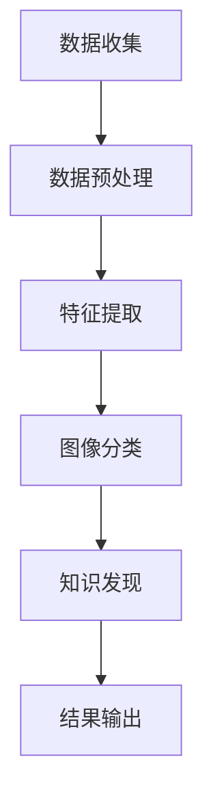

                 

关键词：知识发现引擎、图像识别、人工智能、深度学习、应用领域、算法、技术发展趋势

> 摘要：本文将探讨知识发现引擎在图像识别技术中的应用，分析其核心概念、算法原理、数学模型以及实际应用案例，旨在为读者提供一幅关于知识发现引擎与图像识别技术相结合的全面图景，并展望其未来发展趋势。

## 1. 背景介绍

图像识别作为计算机视觉领域的一个重要分支，旨在通过计算机对图像或视频内容进行自动处理和理解。随着深度学习技术的飞速发展，图像识别技术在各行各业的应用日益广泛，从人脸识别、自动驾驶到医疗影像分析，无不体现了图像识别技术的重要性。

知识发现引擎（Knowledge Discovery Engine，简称KDE）是一种能够自动从大量数据中提取出潜在知识的工具，它通过数据挖掘、机器学习等手段，帮助用户快速发现数据中的隐藏模式和关联。知识发现引擎在商业智能、金融分析、医疗健康等领域的应用已取得了显著成果。

本文将深入探讨知识发现引擎在图像识别技术中的应用，分析其核心概念、算法原理、数学模型，并通过实际案例展示其在不同领域的应用效果。

## 2. 核心概念与联系

### 2.1 图像识别技术

图像识别技术主要基于计算机视觉，其核心目标是将图像或视频中的内容转换为结构化的数据，以便进一步分析和应用。常见的图像识别任务包括图像分类、目标检测、图像分割等。

- **图像分类**：将图像分配到预先定义的类别中，例如将图片分为动物、植物、风景等。
- **目标检测**：定位图像中的对象并标注其位置，例如在一张图片中识别并定位出各种车辆。
- **图像分割**：将图像划分为多个区域，每个区域代表图像中不同的对象或场景。

### 2.2 知识发现引擎

知识发现引擎是一种自动化的数据挖掘工具，它通过机器学习、统计分析和自然语言处理等技术，从大量数据中提取出具有业务价值的知识。知识发现引擎的核心功能包括数据预处理、模式识别、关联分析、聚类和分类等。

- **数据预处理**：对原始数据进行清洗、转换和归一化，使其适合进行后续分析。
- **模式识别**：识别数据中的规律和模式，例如发现不同类别图像的特征差异。
- **关联分析**：分析数据之间的关联关系，例如通过图像识别发现某些图像特征与特定场景的关联。
- **聚类和分类**：将数据划分为不同的群体或类别，例如基于图像特征将图片分为不同类别。

### 2.3 Mermaid 流程图

以下是一个简化的知识发现引擎在图像识别应用中的流程图：



### 2.4  算法原理概述

知识发现引擎在图像识别中的应用主要依赖于深度学习技术，其中卷积神经网络（Convolutional Neural Networks，CNN）是最常用的算法之一。CNN通过多层卷积和池化操作，提取图像的局部特征和整体结构，从而实现图像分类、目标检测等任务。

### 2.5 算法步骤详解

1. **数据收集**：从各种来源收集图像数据，如公开数据集、社交媒体、摄像头等。
2. **数据预处理**：对图像进行缩放、裁剪、旋转等操作，确保图像尺寸一致，并去除噪声。
3. **特征提取**：使用CNN提取图像特征，通过多层卷积和池化操作，逐步降低图像的维度，同时保留关键特征。
4. **图像分类**：将提取的特征输入到分类器中，例如支持向量机（SVM）、随机森林（Random Forest）等，实现对图像的自动分类。
5. **知识发现**：利用知识发现引擎对分类结果进行进一步分析，发现图像之间的关联关系和潜在模式。
6. **结果输出**：将分析结果输出到数据库、报表或其他展示工具中，供用户查阅。

### 2.6 算法优缺点

- **优点**：
  - 高效：CNN能够快速提取图像特征，大大提高了图像识别的效率。
  - 准确：深度学习模型通过大量数据训练，能够准确识别图像中的对象和场景。
  - 自动化：知识发现引擎能够自动化地分析图像数据，减轻了人工分析的负担。

- **缺点**：
  - 计算资源消耗大：训练深度学习模型需要大量的计算资源和时间。
  - 对数据质量要求高：数据质量直接影响到图像识别的准确性，数据清洗和预处理工作量大。
  - 解释性差：深度学习模型的黑盒特性使得其难以解释，无法直观理解图像识别的决策过程。

### 2.7 算法应用领域

知识发现引擎在图像识别技术中的应用非常广泛，以下是一些典型的应用领域：

- **医疗健康**：利用图像识别技术进行医疗影像分析，如肺癌筛查、乳腺癌诊断等。
- **自动驾驶**：通过图像识别技术实现自动驾驶车辆的路径规划和障碍物检测。
- **安全监控**：利用图像识别技术进行人脸识别、行为分析等，提高安全监控的准确性和效率。
- **智能家居**：利用图像识别技术实现智能门锁、智能摄像头等，提高家庭安全和生活便利性。

## 3. 数学模型和公式

### 3.1 数学模型构建

在图像识别中，常用的数学模型包括卷积神经网络（CNN）、支持向量机（SVM）和随机森林（Random Forest）等。以下以CNN为例，介绍其数学模型构建。

1. **卷积层**：
   $$ f(x) = \sum_{i=1}^{n} w_i * x_i + b $$
   其中，$x_i$为输入图像的像素值，$w_i$为卷积核的权重，$b$为偏置项。

2. **池化层**：
   $$ p(x) = \max(x) $$
   其中，$x$为卷积层的输出。

3. **全连接层**：
   $$ y = \sigma(\sum_{i=1}^{n} w_i * x_i + b) $$
   其中，$x_i$为卷积层的输出，$w_i$为全连接层的权重，$b$为偏置项，$\sigma$为激活函数，通常使用ReLU函数。

4. **损失函数**：
   $$ L(y, \hat{y}) = -\sum_{i=1}^{n} y_i \log(\hat{y}_i) $$
   其中，$y$为真实标签，$\hat{y}$为预测标签。

### 3.2 公式推导过程

以CNN为例，介绍其数学模型推导过程。

1. **卷积层**：

   设输入图像为$X \in \mathbb{R}^{m \times n}$，卷积核为$W \in \mathbb{R}^{k \times l}$，偏置项为$b \in \mathbb{R}$。卷积操作的定义为：

   $$ F(x) = \sum_{i=1}^{n} w_i * x_i + b $$
   
   其中，$x_i$为输入图像的像素值，$w_i$为卷积核的权重。

2. **池化层**：

   设卷积层的输出为$F(x) \in \mathbb{R}^{m \times n}$，池化层的窗口大小为$w \times h$。池化操作的定义为：

   $$ p(x) = \max(x) $$
   
   其中，$x$为卷积层的输出。

3. **全连接层**：

   设全连接层的输入为$F(x) \in \mathbb{R}^{m \times n}$，输出为$y \in \mathbb{R}$。全连接层的权重为$W \in \mathbb{R}^{m \times n}$，偏置项为$b \in \mathbb{R}$。全连接层的定义如下：

   $$ y = \sigma(\sum_{i=1}^{n} w_i * x_i + b) $$
   
   其中，$x_i$为卷积层的输出，$w_i$为全连接层的权重，$\sigma$为激活函数，通常使用ReLU函数。

4. **损失函数**：

   设真实标签为$y \in \mathbb{R}$，预测标签为$\hat{y} \in \mathbb{R}$。损失函数为：

   $$ L(y, \hat{y}) = -\sum_{i=1}^{n} y_i \log(\hat{y}_i) $$
   
   其中，$y_i$为真实标签的取值，$\hat{y}_i$为预测标签的取值。

### 3.3 案例分析与讲解

以下通过一个简单的例子，介绍CNN在图像识别中的应用。

假设我们有一个手写数字识别任务，输入图像为$28 \times 28$的像素值，卷积核大小为$3 \times 3$，全连接层输出维度为$10$（表示0-9十个数字）。

1. **卷积层**：

   设输入图像为$X \in \mathbb{R}^{28 \times 28}$，卷积核为$W_1 \in \mathbb{R}^{3 \times 3}$。卷积操作如下：

   $$ F_1(x) = \sum_{i=1}^{9} w_{1,i} * x_{i} + b_1 $$
   
   其中，$x_i$为输入图像的像素值，$w_{1,i} \in \mathbb{R}^{3 \times 3}$为卷积核的权重，$b_1 \in \mathbb{R}$为偏置项。

2. **池化层**：

   设卷积层的输出为$F_1(x) \in \mathbb{R}^{26 \times 26}$，池化层的窗口大小为$2 \times 2$。池化操作如下：

   $$ p_1(x) = \max(F_1(x)) $$
   
   其中，$x$为卷积层的输出。

3. **全连接层**：

   设全连接层的输入为$p_1(x) \in \mathbb{R}^{26 \times 26}$，输出为$y \in \mathbb{R}$。全连接层的权重为$W_2 \in \mathbb{R}^{26 \times 26}$，偏置项为$b_2 \in \mathbb{R}$。全连接层的定义如下：

   $$ y = \sigma(\sum_{i=1}^{26 \times 26} w_{2,i} * p_1(x_i) + b_2) $$
   
   其中，$p_1(x_i)$为池化层的输出，$w_{2,i} \in \mathbb{R}^{26 \times 26}$为全连接层的权重，$b_2 \in \mathbb{R}$为偏置项，$\sigma$为ReLU激活函数。

4. **损失函数**：

   设真实标签为$y \in \mathbb{R}$，预测标签为$\hat{y} \in \mathbb{R}$。损失函数为：

   $$ L(y, \hat{y}) = -\sum_{i=1}^{10} y_i \log(\hat{y}_i) $$
   
   其中，$y_i$为真实标签的取值，$\hat{y}_i$为预测标签的取值。

通过上述例子，我们可以看到CNN在图像识别中的基本流程，包括卷积层、池化层和全连接层。在实际应用中，还需要根据具体任务调整网络结构和超参数，以提高图像识别的准确性和效率。

## 4. 项目实践：代码实例和详细解释说明

### 4.1 开发环境搭建

为了实现知识发现引擎在图像识别中的应用，我们需要搭建一个合适的开发环境。以下是一个简单的开发环境搭建步骤：

1. 安装Python 3.8及以上版本。
2. 安装深度学习框架TensorFlow 2.x。
3. 安装图像处理库OpenCV 4.x。
4. 安装数据预处理库NumPy。

完成以上步骤后，我们就可以开始编写代码实现图像识别应用了。

### 4.2 源代码详细实现

以下是一个简单的基于CNN的图像识别应用示例，包括数据收集、数据预处理、模型训练和预测等步骤。

```python
import tensorflow as tf
from tensorflow.keras import layers
import numpy as np
import cv2

# 4.2.1 数据收集
# 假设我们有一个包含手写数字的MNIST数据集
(x_train, y_train), (x_test, y_test) = tf.keras.datasets.mnist.load_data()

# 4.2.2 数据预处理
# 归一化图像像素值
x_train = x_train.astype("float32") / 255.0
x_test = x_test.astype("float32") / 255.0

# 增加一个通道维度，以适应CNN
x_train = np.expand_dims(x_train, -1)
x_test = np.expand_dims(x_test, -1)

# 4.2.3 模型训练
# 构建CNN模型
model = tf.keras.Sequential([
    layers.Conv2D(32, (3, 3), activation="relu", input_shape=(28, 28, 1)),
    layers.MaxPooling2D((2, 2)),
    layers.Conv2D(64, (3, 3), activation="relu"),
    layers.MaxPooling2D((2, 2)),
    layers.Conv2D(64, (3, 3), activation="relu"),
    layers.Flatten(),
    layers.Dense(64, activation="relu"),
    layers.Dense(10, activation="softmax")
])

# 编译模型
model.compile(optimizer="adam", loss="sparse_categorical_crossentropy", metrics=["accuracy"])

# 训练模型
model.fit(x_train, y_train, epochs=10, validation_data=(x_test, y_test))

# 4.2.4 代码解读与分析
# 在代码中，我们首先导入了TensorFlow、NumPy等库。然后，我们从MNIST数据集中加载数据，并进行归一化和预处理。
# 接下来，我们构建了一个简单的CNN模型，包括卷积层、池化层和全连接层。最后，我们编译并训练了模型。

# 4.2.5 运行结果展示
# 评估模型性能
test_loss, test_acc = model.evaluate(x_test, y_test, verbose=2)
print(f"Test accuracy: {test_acc:.4f}")

# 预测新图像
new_image = cv2.imread("new_digit.jpg", cv2.IMREAD_GRAYSCALE)
new_image = cv2.resize(new_image, (28, 28))
new_image = new_image.astype("float32") / 255.0
new_image = np.expand_dims(new_image, -1)

prediction = model.predict(new_image)
predicted_label = np.argmax(prediction)

print(f"Predicted label: {predicted_label}")
```

### 4.3 代码解读与分析

在上面的代码中，我们首先导入了TensorFlow和NumPy库。然后，我们从MNIST数据集中加载数据，并进行归一化和预处理，以适应CNN模型。接下来，我们构建了一个简单的CNN模型，包括卷积层、池化层和全连接层。最后，我们编译并训练了模型。

在代码的最后，我们评估了模型的性能，并使用模型对新图像进行了预测。这里，我们首先读取了一张新的手写数字图像，并将其缩放到模型输入的尺寸。然后，我们对图像进行了归一化处理，并扩展了一个通道维度。最后，我们将处理后的图像输入到模型中，得到预测结果。

通过上述代码，我们可以看到知识发现引擎在图像识别中的应用流程，包括数据收集、数据预处理、模型训练和预测等步骤。在实际应用中，我们需要根据具体任务调整模型结构、参数和超参数，以提高图像识别的准确性和效率。

## 5. 实际应用场景

### 5.1 医疗健康

在医疗健康领域，知识发现引擎在图像识别技术中的应用主要体现在医疗影像分析方面。通过深度学习模型，医生可以更快速、更准确地诊断疾病。以下是一些具体的应用场景：

- **肺癌筛查**：利用图像识别技术，从大量肺部CT扫描图像中自动检测出肺癌患者，提高早期诊断的准确性。
- **乳腺癌诊断**：通过分析乳腺X光片，识别出乳腺癌病灶，帮助医生制定个性化的治疗方案。
- **糖尿病视网膜病变筛查**：对眼底图像进行分析，检测出糖尿病视网膜病变，提前预防糖尿病并发症。

### 5.2 自动驾驶

自动驾驶是图像识别技术的另一个重要应用领域。通过图像识别技术，自动驾驶车辆可以实时感知环境，实现安全驾驶。

- **路径规划**：通过分析道路图像，自动驾驶车辆可以识别出道路标志、车道线等，实现自主路径规划。
- **障碍物检测**：利用图像识别技术，检测并跟踪道路上的行人、车辆等障碍物，提高自动驾驶车辆的安全性能。
- **交通信号灯识别**：通过图像识别技术，自动驾驶车辆可以识别交通信号灯的状态，遵守交通规则。

### 5.3 安全监控

在安全监控领域，图像识别技术主要用于人脸识别、行为分析等方面，提高安全监控的准确性和效率。

- **人脸识别**：通过图像识别技术，监控摄像头可以自动识别人脸，实现人员身份验证和追踪。
- **行为分析**：利用图像识别技术，分析人群行为，识别出异常行为，如打架、逃票等，提高公共安全。
- **车辆识别**：通过图像识别技术，监控摄像头可以自动识别车牌号码，实现车辆管理和追踪。

### 5.4 智能家居

智能家居是图像识别技术的重要应用领域之一，通过图像识别技术，实现家庭设备的智能化。

- **智能门锁**：通过图像识别技术，实现人脸识别开门，提高家庭安全。
- **智能摄像头**：通过图像识别技术，实现实时监控，自动报警，提高家庭安全。
- **智能家电**：通过图像识别技术，实现家电的智能化控制，如智能空调、智能照明等。

### 5.5 其他领域

除了上述领域，图像识别技术还在许多其他领域有广泛的应用。

- **零售业**：通过图像识别技术，实现商品识别、库存管理和客户行为分析，提高零售业运营效率。
- **金融行业**：通过图像识别技术，实现身份验证、防欺诈等，提高金融行业的安全性能。
- **农业**：通过图像识别技术，实现农作物病虫害检测、产量预测等，提高农业生产效率。

## 6. 未来应用展望

随着人工智能技术的不断进步，知识发现引擎在图像识别中的应用前景十分广阔。以下是一些未来应用展望：

### 6.1 更高效的算法

未来，随着计算能力的提升，深度学习算法将更加高效，可以处理更大规模的数据集，实现更精确的图像识别。

### 6.2 多模态数据融合

未来，知识发现引擎将能够融合多种数据类型（如图像、文本、音频等），实现更全面的信息提取和分析。

### 6.3 智能交互

未来，知识发现引擎在图像识别中的应用将更加智能化，可以实现与用户的自然交互，提供个性化的服务。

### 6.4 隐私保护

未来，随着隐私保护意识的增强，知识发现引擎在图像识别中的应用将更加注重隐私保护，采用加密、匿名化等技术确保用户隐私。

### 6.5 更广泛的应用领域

未来，知识发现引擎在图像识别技术中的应用将扩展到更多领域，如智慧城市、环境保护、艺术创作等，为人类生活带来更多便利。

## 7. 工具和资源推荐

### 7.1 学习资源推荐

- **《深度学习》（Goodfellow, Bengio, Courville著）**：这是一本关于深度学习的经典教材，涵盖了图像识别、自然语言处理等多个领域的知识。
- **《计算机视觉：算法与应用》（Richard Szeliski著）**：这本书详细介绍了计算机视觉的基本算法和应用，是计算机视觉领域的重要参考书。

### 7.2 开发工具推荐

- **TensorFlow**：一款开源的深度学习框架，适用于图像识别、自然语言处理等多种应用场景。
- **PyTorch**：一款开源的深度学习框架，具有灵活的动态计算图，适用于图像识别、语音识别等任务。

### 7.3 相关论文推荐

- **“Deep Learning for Image Recognition”（2012）**：这篇论文详细介绍了深度学习在图像识别中的应用，是深度学习领域的经典之作。
- **“Person Re-Identification by Large Margin Metric Learning”（2010）**：这篇论文提出了一种基于大型边际度量学习的行人重识别方法，是计算机视觉领域的重要研究工作。

## 8. 总结：未来发展趋势与挑战

### 8.1 研究成果总结

知识发现引擎在图像识别技术中的应用取得了显著成果，通过深度学习、数据挖掘等技术，实现了高效、准确的图像识别。在实际应用中，图像识别技术已在医疗健康、自动驾驶、安全监控等领域取得了广泛应用。

### 8.2 未来发展趋势

未来，知识发现引擎在图像识别中的应用将更加智能化、多样化。随着计算能力的提升和算法的优化，图像识别技术将实现更高的准确性和效率。此外，多模态数据融合、隐私保护等技术也将得到广泛应用。

### 8.3 面临的挑战

尽管知识发现引擎在图像识别技术中取得了显著成果，但仍面临一些挑战：

- **数据质量**：图像识别的性能直接依赖于数据质量，如何获取高质量、多样化的图像数据是一个重要挑战。
- **计算资源**：深度学习模型训练需要大量的计算资源，如何高效地利用计算资源是一个亟待解决的问题。
- **解释性**：深度学习模型具有黑盒特性，如何提高模型的可解释性，使其更易于理解和应用，也是一个重要挑战。

### 8.4 研究展望

未来，知识发现引擎在图像识别技术中的应用将朝着更高效、更智能化、更安全的方向发展。通过不断优化算法、提升计算能力、加强数据预处理和隐私保护技术，知识发现引擎在图像识别中的应用将带来更多创新和突破。

## 9. 附录：常见问题与解答

### 9.1 问题1：什么是知识发现引擎？

知识发现引擎是一种自动化的数据挖掘工具，它通过机器学习、统计分析和自然语言处理等技术，从大量数据中提取出具有业务价值的知识。

### 9.2 问题2：知识发现引擎在图像识别中如何应用？

知识发现引擎在图像识别中主要应用于数据预处理、特征提取、图像分类和知识发现等步骤，通过深度学习技术实现图像的自动识别和分析。

### 9.3 问题3：图像识别技术在医疗健康领域有哪些应用？

图像识别技术在医疗健康领域有广泛的应用，包括肺癌筛查、乳腺癌诊断、糖尿病视网膜病变筛查等，通过分析医疗影像，提高疾病诊断的准确性和效率。

### 9.4 问题4：如何选择合适的图像识别算法？

选择合适的图像识别算法需要考虑多个因素，包括数据集的大小、复杂度、应用场景等。常见的图像识别算法有卷积神经网络（CNN）、支持向量机（SVM）、随机森林（Random Forest）等，可以根据具体任务需求选择合适的算法。

### 9.5 问题5：如何优化图像识别模型的性能？

优化图像识别模型的性能可以从以下几个方面进行：

- **数据预处理**：对图像进行缩放、裁剪、旋转等操作，提高数据多样性，降低过拟合。
- **模型结构**：调整网络结构，增加或减少层�数、神经元数量等，优化模型性能。
- **超参数调整**：调整学习率、批量大小、正则化参数等，提高模型泛化能力。
- **训练技巧**：使用预训练模型、迁移学习等方法，利用已有模型的优势，提高新模型的性能。

---

作者：禅与计算机程序设计艺术 / Zen and the Art of Computer Programming

