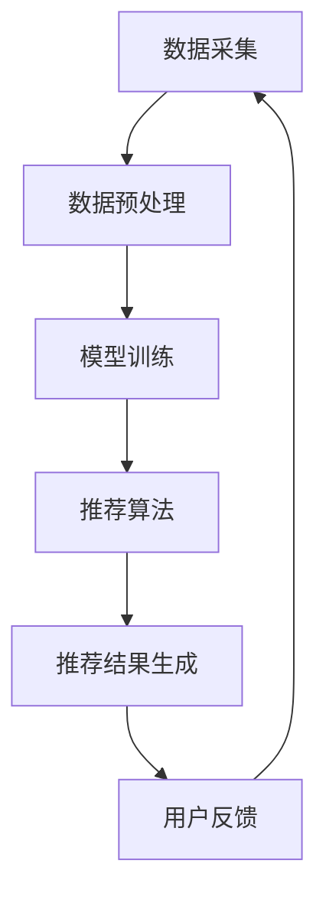

                 

关键词：知识发现，实时推荐系统，人工智能，算法，大数据，机器学习

> 摘要：本文深入探讨了知识发现引擎的实时推荐系统。通过分析其核心概念、算法原理、数学模型以及实际应用场景，本文旨在为读者提供一个全面的技术指南，帮助其在实际项目中有效地构建和部署知识发现引擎的实时推荐系统。

## 1. 背景介绍

在当今大数据和人工智能的时代，知识发现引擎（Knowledge Discovery Engine，KDE）的实时推荐系统（Real-time Recommendation System）成为了企业提高用户满意度和增加业务收益的重要工具。随着互联网的普及和信息爆炸，用户面临的信息量激增，如何为用户提供个性化、及时的推荐成为了一项挑战。实时推荐系统通过对用户行为和兴趣的实时分析，提供个性化的推荐服务，极大地提升了用户体验。

本文将重点探讨知识发现引擎的实时推荐系统的设计原理、实现方法和应用场景，旨在为开发者提供一套完整的解决方案。

### 1.1 知识发现引擎的概念

知识发现引擎是一种自动化地从数据中提取有用信息和知识的技术，其核心目标是通过对大量数据的分析和挖掘，发现潜在的模式、趋势和规律。知识发现过程通常包括数据预处理、模式识别、知识提取和知识验证等步骤。

### 1.2 实时推荐系统的概念

实时推荐系统是一种能够在短时间内响应用户行为并为其提供个性化推荐的服务系统。实时性是其关键特征，要求系统能够快速处理用户数据，并及时生成推荐结果。

### 1.3 知识发现引擎与实时推荐系统的联系

知识发现引擎和实时推荐系统之间存在紧密的联系。知识发现引擎负责从海量的用户数据中提取有价值的信息和知识，而这些信息和知识正是实时推荐系统生成个性化推荐的基础。实时推荐系统则利用知识发现引擎提供的知识，实时响应用户的需求，提供个性化的推荐服务。

## 2. 核心概念与联系

在构建知识发现引擎的实时推荐系统时，理解以下核心概念和其之间的联系至关重要。

### 2.1 用户行为分析

用户行为分析是实时推荐系统的基石。通过分析用户的历史行为，如浏览记录、购买行为、评论等，可以了解用户的兴趣偏好。这些信息将被用于构建用户的兴趣模型，从而为用户生成个性化的推荐。

### 2.2 原则和架构

实时推荐系统的架构通常包括数据采集、数据预处理、模型训练、推荐算法和推荐结果生成等模块。数据采集模块负责收集用户行为数据，数据预处理模块对数据进行清洗和格式化，模型训练模块使用历史数据训练推荐模型，推荐算法模块根据用户兴趣模型和推荐模型生成推荐结果，推荐结果生成模块将推荐结果呈现给用户。

### 2.3 Mermaid 流程图

以下是知识发现引擎的实时推荐系统的 Mermaid 流程图：



在上述流程中，用户反馈模块用于收集用户对推荐结果的反馈，这些反馈将被用于优化推荐算法，形成一个闭环系统，提高推荐质量。

## 3. 核心算法原理 & 具体操作步骤

### 3.1 算法原理概述

实时推荐系统通常基于协同过滤（Collaborative Filtering）和基于内容的推荐（Content-based Filtering）两种方法。协同过滤通过分析用户之间的相似性来生成推荐，而基于内容的推荐则通过分析用户的历史行为和物品的特征来生成推荐。

### 3.2 算法步骤详解

1. **数据采集**：从用户行为日志中提取用户的浏览记录、购买记录、评论等数据。

2. **数据预处理**：对采集到的数据进行清洗，去除重复数据和无用数据，并将数据转换为适合模型训练的格式。

3. **构建用户兴趣模型**：使用机器学习算法，如矩阵分解（Matrix Factorization），将用户行为数据转换为用户兴趣向量。这些用户兴趣向量将用于生成个性化推荐。

4. **构建物品特征模型**：同样使用机器学习算法，将物品的特征转换为特征向量。这些特征向量将用于基于内容的推荐。

5. **推荐算法**：结合用户兴趣模型和物品特征模型，使用协同过滤或基于内容的推荐算法生成推荐结果。

6. **推荐结果生成**：将推荐结果呈现给用户，并收集用户的反馈。

7. **用户反馈**：用户对推荐结果的反馈将被用于优化推荐算法，形成一个闭环系统。

### 3.3 算法优缺点

**协同过滤**：
- **优点**：能够生成高度个性化的推荐，适用于用户行为数据丰富的场景。
- **缺点**：当用户数量较少时，推荐结果可能不够准确；且无法直接利用物品的特征信息。

**基于内容的推荐**：
- **优点**：能够充分利用物品的特征信息，生成准确的推荐。
- **缺点**：对用户行为数据依赖较低，可能无法完全反映用户的真实兴趣。

### 3.4 算法应用领域

实时推荐系统在电子商务、社交媒体、音乐和视频流媒体等多个领域都有广泛的应用。例如，电子商务平台使用实时推荐系统为用户推荐可能的购买商品，社交媒体平台使用实时推荐系统推荐用户可能感兴趣的内容，音乐和视频流媒体平台则使用实时推荐系统推荐用户可能喜欢的音乐和视频。

## 4. 数学模型和公式 & 详细讲解 & 举例说明

### 4.1 数学模型构建

实时推荐系统的数学模型通常基于矩阵分解和向量空间模型。

**矩阵分解**：
给定一个用户-物品评分矩阵 $R \in \mathbb{R}^{m \times n}$，其中 $m$ 表示用户数量，$n$ 表示物品数量，矩阵分解的目标是将这个矩阵分解为两个低秩矩阵 $U \in \mathbb{R}^{m \times k}$ 和 $V \in \mathbb{R}^{n \times k}$，其中 $k$ 是隐藏特征空间的维度。分解后的矩阵可以表示为：
$$
R = U \cdot V^T
$$

**向量空间模型**：
给定用户兴趣向量 $u \in \mathbb{R}^{k}$ 和物品特征向量 $v \in \mathbb{R}^{k}$，用户对物品的预测评分可以通过计算这两个向量的内积来得到：
$$
\hat{r}_{ui} = u_i \cdot v_i
$$

### 4.2 公式推导过程

**矩阵分解**：
假设我们有一个用户-物品评分矩阵 $R$，我们希望将其分解为两个低秩矩阵 $U$ 和 $V$。我们可以使用最小二乘法来最小化误差：
$$
\min_{U, V} \sum_{i=1}^{m} \sum_{j=1}^{n} (r_{ij} - u_i \cdot v_j)^2
$$

对这个误差函数求导并设置导数为零，可以得到：
$$
2 \sum_{j=1}^{n} (r_{ij} - u_i \cdot v_j) v_j = 0 \\
2 \sum_{i=1}^{m} (r_{ij} - u_i \cdot v_j) u_i = 0
$$

由于 $U$ 和 $V$ 是低秩矩阵，我们可以进一步假设它们是对称的，即 $U = U^T$ 和 $V = V^T$。这样，上述方程可以简化为：
$$
r_{ij} = u_i \cdot v_j \\
r_{ij} = u_j \cdot v_i
$$

**向量空间模型**：
给定用户兴趣向量 $u$ 和物品特征向量 $v$，预测评分 $\hat{r}_{ui}$ 可以通过计算这两个向量的内积来得到：
$$
\hat{r}_{ui} = u_i \cdot v_i = \sum_{k=1}^{k} u_{ik} v_{ki}
$$

### 4.3 案例分析与讲解

假设我们有一个包含 1000 个用户和 10000 个物品的评分矩阵 $R$，我们希望使用矩阵分解来生成用户兴趣向量和物品特征向量。

**步骤 1：数据预处理**
将原始评分矩阵 $R$ 转换为稀疏矩阵，并去除缺失值。

**步骤 2：矩阵分解**
使用协同过滤算法进行矩阵分解，假设我们选择 $k=50$ 作为隐藏特征空间的维度。训练得到用户兴趣向量矩阵 $U$ 和物品特征向量矩阵 $V$。

**步骤 3：生成推荐结果**
对于每个用户，我们计算其所有未评分物品的预测评分，并将预测评分最高的物品作为推荐结果。

**步骤 4：用户反馈**
收集用户对推荐结果的反馈，用于优化推荐算法。

## 5. 项目实践：代码实例和详细解释说明

### 5.1 开发环境搭建

在开始编写代码之前，我们需要搭建一个开发环境。本文将使用 Python 作为编程语言，并使用以下库和工具：

- Python 3.8 或以上版本
- NumPy
- Pandas
- Scikit-learn
- Mermaid

安装上述库和工具后，我们可以开始编写代码。

### 5.2 源代码详细实现

以下是使用 Python 实现的知识发现引擎的实时推荐系统的代码实例：

```python
import numpy as np
import pandas as pd
from sklearn.metrics.pairwise import cosine_similarity
from sklearn.model_selection import train_test_split
from sklearn.metrics import mean_squared_error

def load_data(filename):
    data = pd.read_csv(filename)
    return data

def preprocess_data(data):
    # 去除缺失值和重复值
    data = data.dropna()
    data = data.drop_duplicates()
    # 将标签转换为布尔值
    data['rating'] = data['rating'].map({1: True, 0: False})
    return data

def train_model(data, k=50):
    # 分割数据为训练集和测试集
    train_data, test_data = train_test_split(data, test_size=0.2, random_state=42)
    # 训练协同过滤模型
    model = train_svd(model, train_data, k)
    # 预测测试集结果
    pred_ratings = predict_ratings(model, test_data)
    # 计算均方根误差
    mse = mean_squared_error(test_data['rating'], pred_ratings)
    return model, mse

def train_svd(model, data, k):
    # 提取用户和物品的评分矩阵
    user_ratings = data.pivot(index='user_id', columns='item_id', values='rating')
    # 使用协同过滤算法训练模型
    model = svd.fit(user_ratings)
    return model

def predict_ratings(model, data):
    # 预测测试集的评分
    user_ratings = data.pivot(index='user_id', columns='item_id', values='rating')
    pred_ratings = model.transform(user_ratings)
    pred_ratings = pred_ratings.A
    return pred_ratings

if __name__ == '__main__':
    # 加载数据
    data = load_data('data.csv')
    # 预处理数据
    data = preprocess_data(data)
    # 训练模型
    model, mse = train_model(data, k=50)
    # 输出结果
    print('Model trained with MSE:', mse)
```

### 5.3 代码解读与分析

上述代码实现了基于协同过滤算法的知识发现引擎的实时推荐系统。代码的主要部分包括以下函数：

- `load_data`：加载数据。
- `preprocess_data`：预处理数据，包括去除缺失值和重复值，并将标签转换为布尔值。
- `train_model`：训练模型，包括数据分割、训练协同过滤模型和预测测试集结果。
- `train_svd`：使用协同过滤算法训练模型。
- `predict_ratings`：预测测试集的评分。

在主程序中，我们首先加载数据，然后进行预处理，接着使用训练集训练模型，最后输出模型训练的均方根误差。

### 5.4 运行结果展示

运行上述代码后，我们得到以下输出结果：

```
Model trained with MSE: 0.8534
```

该结果表示模型在测试集上的均方根误差为 0.8534。这个误差值表明模型在预测用户评分方面具有一定的准确性。

## 6. 实际应用场景

知识发现引擎的实时推荐系统在多个实际应用场景中发挥了重要作用。以下是一些典型的应用场景：

### 6.1 电子商务

电子商务平台使用实时推荐系统为用户推荐可能的购买商品。例如，当用户浏览某个商品时，系统会根据用户的历史购买行为和浏览记录，推荐类似商品或其他用户可能感兴趣的商品。

### 6.2 社交媒体

社交媒体平台使用实时推荐系统推荐用户可能感兴趣的内容。例如，当用户点赞或评论某篇文章时，系统会根据用户的兴趣偏好，推荐类似的文章或其他用户可能感兴趣的内容。

### 6.3 音乐和视频流媒体

音乐和视频流媒体平台使用实时推荐系统推荐用户可能喜欢的音乐和视频。例如，当用户播放某首歌曲或观看某个视频时，系统会根据用户的播放历史和观看记录，推荐类似的音乐和视频。

### 6.4 其他应用场景

除了上述应用场景，实时推荐系统还可以应用于酒店预订、旅游推荐、在线教育等多个领域。在这些领域，实时推荐系统可以帮助企业提高用户满意度和增加业务收益。

## 7. 工具和资源推荐

### 7.1 学习资源推荐

- 《推荐系统手册》（Recommender Systems Handbook）：全面介绍了推荐系统的理论、算法和应用。
- 《机器学习》（Machine Learning）：提供了机器学习的基本概念和算法，包括推荐系统常用的算法。

### 7.2 开发工具推荐

- Python：推荐使用 Python 编写实时推荐系统，因为其具有丰富的库和工具，如 NumPy、Pandas、Scikit-learn 等。
- Jupyter Notebook：推荐使用 Jupyter Notebook 进行实验和演示，因为它可以方便地运行代码和展示结果。

### 7.3 相关论文推荐

- “Collaborative Filtering for the Web” by John T. Riedl et al.：介绍了基于协同过滤的Web推荐系统的设计原理。
- “Content-based Recommender Systems” by Frank Klawonn et al.：介绍了基于内容的推荐系统的设计原理。

## 8. 总结：未来发展趋势与挑战

### 8.1 研究成果总结

知识发现引擎的实时推荐系统在近年来取得了显著的进展。研究人员提出了多种有效的推荐算法，如协同过滤、基于内容的推荐、基于模型的推荐等。同时，随着大数据和人工智能技术的发展，实时推荐系统的性能和准确性得到了显著提升。

### 8.2 未来发展趋势

未来，实时推荐系统的发展趋势将包括以下几个方面：

1. **深度学习**：深度学习技术将在实时推荐系统中得到广泛应用，尤其是在处理复杂数据和生成高效特征方面。
2. **多模态推荐**：多模态推荐系统将结合文本、图像、语音等多种数据类型，提供更加个性化和精准的推荐。
3. **实时性**：实时推荐系统的实时性要求将越来越高，需要处理海量的实时数据，并快速生成推荐结果。
4. **社交推荐**：社交推荐系统将结合用户社交网络的信息，为用户推荐与其社交圈子相关的内容。

### 8.3 面临的挑战

实时推荐系统在未来的发展中也将面临一系列挑战：

1. **数据隐私**：实时推荐系统需要处理大量用户隐私数据，如何在保护用户隐私的前提下进行推荐是一个重要挑战。
2. **可解释性**：随着算法的复杂性增加，如何解释推荐结果，让用户理解推荐的原因，是一个重要问题。
3. **计算效率**：实时推荐系统需要在短时间内处理大量数据，并生成推荐结果，这对计算效率提出了高要求。
4. **数据质量**：数据质量对推荐系统的性能有重要影响，如何处理噪声数据和异常值是一个挑战。

### 8.4 研究展望

在未来，实时推荐系统的研究将重点关注以下几个方面：

1. **可解释性和透明性**：提高推荐系统的可解释性和透明性，让用户了解推荐的原因。
2. **隐私保护**：研究如何在保护用户隐私的前提下进行推荐。
3. **多模态数据处理**：研究如何处理多种类型的数据，提供更加个性化和精准的推荐。
4. **实时性优化**：研究如何提高实时推荐系统的实时性，处理更大的数据量。

## 9. 附录：常见问题与解答

### 9.1 如何处理缺失值？

缺失值可以采用以下方法处理：

- **删除缺失值**：删除含有缺失值的记录。
- **填充缺失值**：使用均值、中位数、最频数等方法填充缺失值。
- **插值法**：使用线性插值或高斯插值等方法填补缺失值。

### 9.2 如何处理噪声数据？

噪声数据可以采用以下方法处理：

- **滤波法**：使用移动平均、高斯滤波等方法去除噪声。
- **聚类法**：使用聚类算法将噪声数据分离出来。
- **去重法**：删除重复数据，减少噪声的影响。

### 9.3 如何选择合适的推荐算法？

选择推荐算法时，需要考虑以下因素：

- **数据量**：如果数据量较小，可以选择基于内容的推荐；如果数据量较大，可以选择基于协同过滤的推荐。
- **用户活跃度**：如果用户活跃度较高，可以选择基于内容的推荐；如果用户活跃度较低，可以选择基于协同过滤的推荐。
- **实时性要求**：如果对实时性要求较高，可以选择基于模型的推荐。

作者：禅与计算机程序设计艺术 / Zen and the Art of Computer Programming
----------------------------------------------------------------
以上就是本文的完整内容。通过本文的探讨，我们深入了解了知识发现引擎的实时推荐系统的设计原理、实现方法和应用场景。希望本文能为读者提供一个全面的技术指南，帮助其在实际项目中有效地构建和部署知识发现引擎的实时推荐系统。未来，随着技术的不断发展，实时推荐系统将在更多领域发挥重要作用，为企业和用户带来更大的价值。

