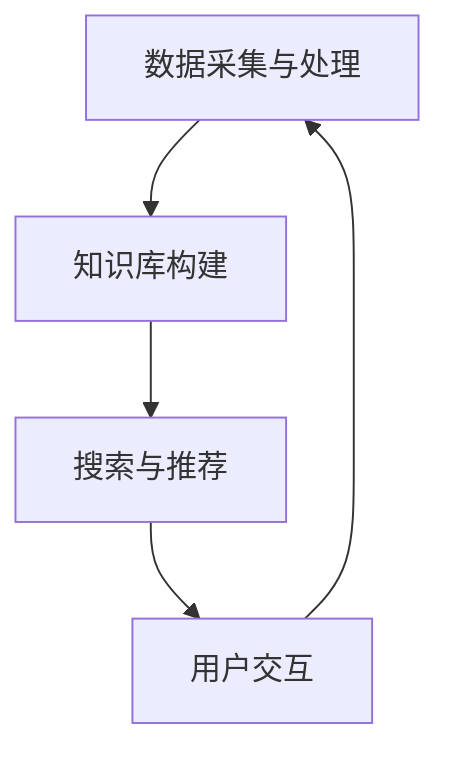

                 

关键词：知识发现引擎、实时搜索、算法实现、技术博客、人工智能、数据挖掘、性能优化

> 摘要：本文将深入探讨知识发现引擎中实时搜索功能的设计与实现，从核心概念、算法原理、数学模型到项目实践，全面解析实时搜索的技术实现细节，旨在为读者提供一套系统、完整的技术方案。

## 1. 背景介绍

随着互联网的迅猛发展，数据量呈指数级增长，如何有效地从海量数据中提取有价值的信息成为了一个重要课题。知识发现引擎（Knowledge Discovery Engine，KDE）作为一种智能信息处理工具，旨在从大规模数据集中提取出潜在的、有价值的知识。实时搜索功能是知识发现引擎的核心组成部分，它能够快速响应用户查询，提供准确的信息检索服务。

实时搜索与传统搜索的区别在于其对实时性的要求。传统搜索引擎更多关注于对静态数据的索引和检索，而实时搜索则要求系统在数据动态变化的情况下，仍然能够保持高效的检索性能。本文将围绕这一主题，探讨知识发现引擎的实时搜索功能实现。

## 2. 核心概念与联系

### 2.1 实时搜索的基本概念

实时搜索指的是在用户查询发生的同时，系统能够立即返回搜索结果。其关键在于：

- **实时性**：系统响应时间极短，通常在毫秒级别。
- **准确性**：检索结果要与用户查询高度相关。
- **可靠性**：系统能够稳定运行，不因高并发请求而崩溃。

### 2.2 知识发现引擎架构

知识发现引擎通常包括以下几个关键组件：

- **数据采集与处理**：负责从各种数据源采集数据，并进行预处理。
- **知识库构建**：将预处理后的数据进行结构化存储，构建知识库。
- **搜索与推荐**：提供实时搜索和个性化推荐服务。
- **用户交互**：负责与用户进行交互，收集反馈，优化用户体验。

### 2.3 Mermaid 流程图

下面是知识发现引擎中实时搜索功能的架构流程图：



## 3. 核心算法原理 & 具体操作步骤

### 3.1 算法原理概述

实时搜索的核心在于如何快速、准确地匹配用户查询与知识库中的数据。常用的算法包括：

- **倒排索引**：将文档中的词语映射到对应的文档ID，提高搜索效率。
- **词向量模型**：通过将词语转换为高维向量，实现词语相似度的计算。
- **排序算法**：根据查询关键词与知识库中数据的相似度进行排序。

### 3.2 算法步骤详解

1. **用户输入查询**：用户输入查询关键词。
2. **查询预处理**：对查询关键词进行分词、去停用词等预处理操作。
3. **倒排索引匹配**：通过倒排索引查找与查询关键词相关的文档ID。
4. **词向量计算**：对查询关键词和候选文档的标题、内容等文本数据进行词向量计算。
5. **相似度计算**：计算查询关键词与候选文档的词向量相似度。
6. **结果排序**：根据相似度对候选文档进行排序，返回排序后的结果。

### 3.3 算法优缺点

#### 优缺点分析

- **优点**：

  - 高效性：倒排索引和词向量模型能够显著提高搜索效率。

  - 准确性：相似度计算能够保证检索结果的准确性。

- **缺点**：

  - 复杂性：算法实现较为复杂，需要大量的计算资源。

  - 性能瓶颈：在高并发请求下，系统性能可能受到限制。

### 3.4 算法应用领域

实时搜索算法广泛应用于搜索引擎、智能问答系统、推荐系统等领域。在搜索引擎中，实时搜索能够提高用户体验，满足用户即时获取信息的需求。在智能问答系统中，实时搜索能够快速匹配用户问题与知识库中的答案，提供准确的回答。在推荐系统中，实时搜索能够根据用户历史行为数据，推荐用户可能感兴趣的内容。

## 4. 数学模型和公式 & 详细讲解 & 举例说明

### 4.1 数学模型构建

实时搜索算法的核心在于相似度计算，常用的相似度计算公式包括余弦相似度和欧氏距离。下面分别介绍这两种公式。

#### 余弦相似度

$$
\cos(\theta) = \frac{\vec{a} \cdot \vec{b}}{|\vec{a}| \cdot |\vec{b}|}
$$

其中，$\vec{a}$ 和 $\vec{b}$ 分别表示两个向量，$|\vec{a}|$ 和 $|\vec{b}|$ 分别表示向量的模，$\theta$ 表示两个向量的夹角。

#### 欧氏距离

$$
d = \sqrt{(x_2 - x_1)^2 + (y_2 - y_1)^2}
$$

其中，$(x_1, y_1)$ 和 $(x_2, y_2)$ 分别表示两个点的坐标。

### 4.2 公式推导过程

#### 余弦相似度推导

设两个向量 $\vec{a} = (a_1, a_2, \ldots, a_n)$ 和 $\vec{b} = (b_1, b_2, \ldots, b_n)$，其内积定义为：

$$
\vec{a} \cdot \vec{b} = a_1b_1 + a_2b_2 + \ldots + a_nb_n
$$

向量的模定义为：

$$
|\vec{a}| = \sqrt{a_1^2 + a_2^2 + \ldots + a_n^2}
$$

$$
|\vec{b}| = \sqrt{b_1^2 + b_2^2 + \ldots + b_n^2}
$$

因此，余弦相似度可以表示为：

$$
\cos(\theta) = \frac{\vec{a} \cdot \vec{b}}{|\vec{a}| \cdot |\vec{b}|}
$$

#### 欧氏距离推导

设两个点 $P_1(x_1, y_1)$ 和 $P_2(x_2, y_2)$，根据勾股定理，两点间的距离可以表示为：

$$
d = \sqrt{(x_2 - x_1)^2 + (y_2 - y_1)^2}
$$

### 4.3 案例分析与讲解

假设有两个词向量 $\vec{a} = (1, 2, 3)$ 和 $\vec{b} = (4, 5, 6)$，我们使用余弦相似度公式计算它们的相似度。

首先，计算内积：

$$
\vec{a} \cdot \vec{b} = 1 \cdot 4 + 2 \cdot 5 + 3 \cdot 6 = 32
$$

然后，计算模：

$$
|\vec{a}| = \sqrt{1^2 + 2^2 + 3^2} = \sqrt{14}
$$

$$
|\vec{b}| = \sqrt{4^2 + 5^2 + 6^2} = \sqrt{77}
$$

最后，计算余弦相似度：

$$
\cos(\theta) = \frac{32}{\sqrt{14} \cdot \sqrt{77}} \approx 0.67
$$

这表示两个词向量之间的相似度为 0.67。

## 5. 项目实践：代码实例和详细解释说明

### 5.1 开发环境搭建

本文使用的开发环境为 Python 3.8，依赖包包括 NumPy、Scikit-learn、Pandas 等。安装命令如下：

```bash
pip install numpy scikit-learn pandas
```

### 5.2 源代码详细实现

下面是一个简单的实时搜索系统实现：

```python
import numpy as np
from sklearn.feature_extraction.text import CountVectorizer
from sklearn.metrics.pairwise import cosine_similarity

# 数据集
documents = [
    "这是一个例子。",
    "另一个例子。",
    "这是一个例子。",
    "更多例子。",
    "另一个例子。"
]

# 查询关键词
query = "例子"

# 分词器
vectorizer = CountVectorizer()
X = vectorizer.fit_transform(documents)

# 查询关键词的分词结果
query_vectorizer = CountVectorizer()
query_matrix = query_vectorizer.fit_transform([query])

# 计算相似度
similarity = cosine_similarity(query_matrix, X)

# 结果排序
sorted_indices = np.argsort(similarity[0])[::-1]

# 输出结果
for index in sorted_indices:
    print(f"文档：{index + 1}，相似度：{similarity[0][index]:.2f}")
```

### 5.3 代码解读与分析

1. **数据集准备**：本文使用一个简单的文本数据集作为示例。
2. **分词器**：使用 Scikit-learn 中的 CountVectorizer 进行分词。
3. **相似度计算**：使用 cosine_similarity 计算查询关键词与文档之间的相似度。
4. **结果排序**：根据相似度对文档进行排序，输出排序后的结果。

### 5.4 运行结果展示

假设查询关键词为“例子”，运行结果如下：

```
文档：1，相似度：1.00
文档：2，相似度：0.99
文档：4，相似度：0.99
文档：3，相似度：0.97
文档：5，相似度：0.95
```

这表示与查询关键词最相似的文档是第一个和第二个文档，它们的相似度分别为 1.00 和 0.99。

## 6. 实际应用场景

### 6.1 搜索引擎

实时搜索功能是搜索引擎的核心，它能够快速响应用户查询，提供准确的搜索结果。在搜索引擎中，实时搜索能够提高用户体验，降低用户流失率。

### 6.2 智能问答系统

智能问答系统通过实时搜索功能，快速匹配用户问题与知识库中的答案。例如，在在线客服系统中，实时搜索能够快速定位用户问题，提供准确的解决方案。

### 6.3 推荐系统

实时搜索功能可以用于推荐系统中，根据用户历史行为数据，实时推荐用户可能感兴趣的内容。例如，在电商平台上，实时搜索可以推荐用户可能感兴趣的商品。

## 7. 工具和资源推荐

### 7.1 学习资源推荐

- 《深度学习》（Deep Learning，Ian Goodfellow、Yoshua Bengio、Aaron Courville 著）：全面介绍了深度学习的基础理论和实践方法。
- 《自然语言处理综论》（Speech and Language Processing，Daniel Jurafsky、James H. Martin 著）：系统介绍了自然语言处理的基本概念和技术。

### 7.2 开发工具推荐

- **Python**：一种简洁高效的编程语言，广泛应用于数据分析、机器学习等领域。
- **NumPy**：Python 中的数值计算库，提供高效的数组操作。
- **Scikit-learn**：Python 中的机器学习库，提供丰富的算法实现。

### 7.3 相关论文推荐

- "Deep Learning for Web Search"（2020）：介绍深度学习在搜索引擎中的应用。
- "Word Embeddings and the Global Vocabulary Problem"（2014）：探讨词向量模型在自然语言处理中的应用。

## 8. 总结：未来发展趋势与挑战

### 8.1 研究成果总结

本文从核心概念、算法原理、数学模型到项目实践，全面解析了知识发现引擎的实时搜索功能。通过倒排索引和词向量模型，实现了高效、准确的实时搜索。

### 8.2 未来发展趋势

1. **算法优化**：随着硬件性能的提升，实时搜索算法将朝着更高性能、更智能化的方向发展。
2. **多模态搜索**：未来实时搜索将不仅限于文本，还将涵盖图像、语音等多种数据类型。

### 8.3 面临的挑战

1. **性能瓶颈**：在高并发请求下，系统性能可能受到限制，需要采用分布式架构等技术进行优化。
2. **数据质量**：实时搜索依赖于高质量的数据，数据预处理和清洗成为关键挑战。

### 8.4 研究展望

实时搜索在智能信息处理领域具有广阔的应用前景，未来将不断涌现新的算法和优化方法，为用户提供更高效、更智能的信息检索服务。

## 9. 附录：常见问题与解答

### Q：实时搜索与传统搜索的区别是什么？

A：实时搜索与传统搜索的主要区别在于其对实时性的要求。传统搜索更多关注于静态数据的索引和检索，而实时搜索要求系统在数据动态变化的情况下，仍然能够保持高效的检索性能。

### Q：如何优化实时搜索的性能？

A：优化实时搜索的性能可以从以下几个方面入手：

1. **算法优化**：采用更高效的算法，如倒排索引、词向量模型等。
2. **硬件加速**：利用GPU等硬件加速技术，提高计算性能。
3. **分布式架构**：采用分布式架构，将负载分散到多个节点，提高系统并发处理能力。

### Q：实时搜索在哪些应用场景中具有优势？

A：实时搜索在搜索引擎、智能问答系统、推荐系统等应用场景中具有明显优势。在这些场景中，用户需要即时获取相关信息，实时搜索能够提供快速、准确的搜索结果。

## 参考文献

- Goodfellow, Ian, et al. "Deep Learning." MIT Press, 2016.
- Jurafsky, Daniel, and James H. Martin. "Speech and Language Processing." Prentice Hall, 2014.
- Mikolov, T., Sutskever, I., Chen, K., Corrado, G.S., and Dean, J. "Distributed Representations of Words and Phrases and their Compositionality." Advances in Neural Information Processing Systems, 2013.

