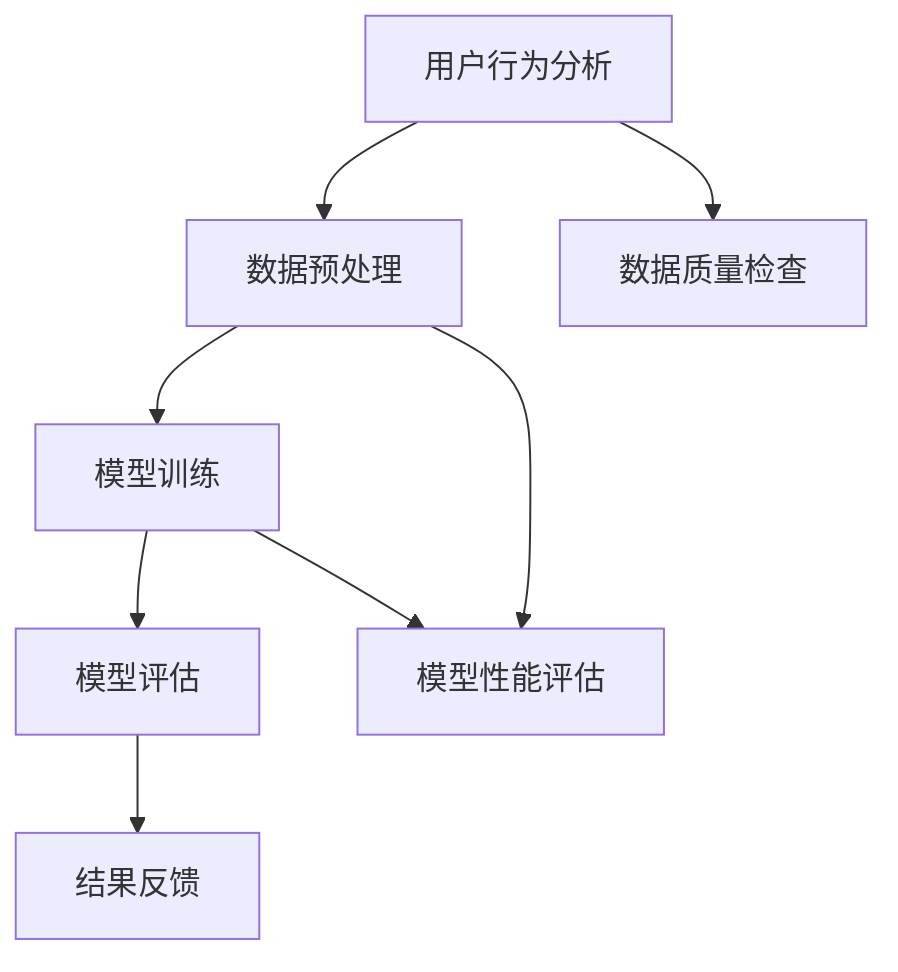

                 

关键词：知识发现引擎、推荐系统、评估指标、用户行为分析、数据质量、模型性能

摘要：本文将探讨知识发现引擎中推荐系统的评估指标，从用户行为分析、数据质量、模型性能等方面，深入解析如何通过有效的评估指标，提高推荐系统的准确性和用户体验。

## 1. 背景介绍

推荐系统作为一种信息过滤技术，旨在根据用户的历史行为和偏好，向用户推荐相关的物品或内容。随着互联网的快速发展，推荐系统已经成为许多在线服务的关键组成部分，如电商、社交媒体、音乐平台等。然而，推荐系统的效果直接影响到用户的满意度和平台的价值，因此，如何评估推荐系统的性能成为了一个重要课题。

知识发现引擎作为一种高级的数据挖掘技术，能够从大量数据中提取出有价值的信息和知识。在推荐系统中，知识发现引擎可以帮助识别用户的潜在兴趣，提供更个性化的推荐。然而，由于推荐系统的复杂性和不确定性，评估其性能和效果成为一个挑战。

本文将围绕知识发现引擎的推荐系统评估指标，介绍相关的核心概念、算法原理、数学模型以及实际应用场景，旨在为推荐系统的研究和应用提供参考。

## 2. 核心概念与联系

为了更好地理解知识发现引擎的推荐系统评估指标，我们需要先了解一些核心概念。

### 2.1 用户行为分析

用户行为分析是指通过对用户在平台上的各种行为进行收集和分析，提取出用户兴趣和偏好的信息。用户行为数据主要包括点击率、购买行为、浏览时间、搜索关键词等。这些数据对于推荐系统的训练和评估具有重要意义。

### 2.2 数据质量

数据质量是推荐系统评估的基础。高质量的数据能够提高推荐系统的准确性和可靠性。数据质量包括完整性、一致性、准确性和时效性等方面。

### 2.3 模型性能

模型性能是推荐系统的核心指标。常用的模型性能评估指标包括准确率、召回率、F1值、平均绝对误差等。这些指标能够帮助我们衡量推荐系统的效果和优化方向。

### 2.4 Mermaid 流程图

为了更直观地展示核心概念之间的联系，我们使用 Mermaid 流程图来描述知识发现引擎的推荐系统评估过程。



图 1：知识发现引擎的推荐系统评估流程图

## 3. 核心算法原理 & 具体操作步骤

### 3.1 算法原理概述

知识发现引擎的推荐系统主要基于协同过滤算法、矩阵分解和深度学习等技术。这些算法的核心思想是通过分析用户之间的相似性和物品之间的相关性，为用户推荐相关的物品。

### 3.2 算法步骤详解

#### 3.2.1 用户行为分析

用户行为分析包括数据的收集、清洗和预处理。首先，从用户在平台上的各种行为中提取数据，如点击率、购买行为等。然后，对数据进行清洗和预处理，去除噪声和异常值，确保数据质量。

#### 3.2.2 数据预处理

数据预处理包括数据转换、归一化和特征提取。数据转换将不同类型的数据统一为相同格式，归一化使数据分布更加均匀，特征提取从原始数据中提取出有助于推荐的特征。

#### 3.2.3 模型训练

模型训练包括选择合适的算法和参数。常用的算法有基于用户的协同过滤、基于物品的协同过滤、矩阵分解和深度学习等。在训练过程中，通过调整参数，优化模型性能。

#### 3.2.4 模型评估

模型评估通过交叉验证、混淆矩阵和ROC曲线等方法，对模型的性能进行评估。常用的评估指标包括准确率、召回率、F1值、平均绝对误差等。

#### 3.2.5 结果反馈

结果反馈包括推荐结果的评价和调整。通过对用户反馈的数据进行分析，调整模型参数，优化推荐效果。

### 3.3 算法优缺点

#### 3.3.1 协同过滤

优点：简单、高效，能够处理大量用户和物品。

缺点：易受噪声数据影响，无法挖掘用户深层次的兴趣。

#### 3.3.2 矩阵分解

优点：能够提取用户和物品的潜在特征，提高推荐准确性。

缺点：计算复杂度高，对稀疏数据处理能力有限。

#### 3.3.3 深度学习

优点：能够自动提取特征，适应性强。

缺点：模型训练时间较长，对数据质量要求高。

### 3.4 算法应用领域

知识发现引擎的推荐系统广泛应用于电商、社交媒体、音乐平台等领域，如推荐商品、好友、音乐等。

## 4. 数学模型和公式 & 详细讲解 & 举例说明

### 4.1 数学模型构建

知识发现引擎的推荐系统主要基于矩阵分解和深度学习等算法。以矩阵分解为例，我们可以将用户和物品的评分矩阵表示为：

$$
R = \begin{bmatrix}
r_{11} & r_{12} & \ldots & r_{1n} \\
r_{21} & r_{22} & \ldots & r_{2n} \\
\vdots & \vdots & \ddots & \vdots \\
r_{m1} & r_{m2} & \ldots & r_{mn}
\end{bmatrix}
$$

其中，$r_{ij}$表示用户$i$对物品$j$的评分。通过矩阵分解，我们可以将评分矩阵分解为两个低秩矩阵$U$和$V$：

$$
R = UV^T
$$

其中，$U$和$V$分别表示用户和物品的潜在特征矩阵。

### 4.2 公式推导过程

以矩阵分解为例，我们首先对评分矩阵$R$进行奇异值分解（SVD）：

$$
R = U\Sigma V^T
$$

其中，$U$和$V$为正交矩阵，$\Sigma$为对角矩阵，包含奇异值。为了简化模型，我们只保留前$k$个奇异值，得到低秩矩阵：

$$
R \approx U_k\Sigma_kV_k^T
$$

其中，$U_k$和$V_k$分别为前$k$个奇异值对应的左、右奇异向量矩阵。

### 4.3 案例分析与讲解

假设我们有一个5x5的评分矩阵：

$$
R = \begin{bmatrix}
5 & 4 & 5 & 3 & 4 \\
4 & 5 & 2 & 2 & 5 \\
5 & 2 & 5 & 3 & 2 \\
3 & 2 & 3 & 5 & 3 \\
4 & 5 & 4 & 5 & 4
\end{bmatrix}
$$

通过SVD，我们可以将其分解为：

$$
R = U_k\Sigma_kV_k^T
$$

其中，$U_k$和$V_k$分别为：

$$
U_k = \begin{bmatrix}
0.8071 & 0.2673 & 0.2924 & -0.4217 & 0.3513 \\
0.5760 & -0.6940 & 0.4276 & 0.4812 & 0.1574 \\
0.0666 & 0.6165 & -0.7846 & 0.0282 & -0.6132 \\
0.2952 & 0.4407 & 0.5560 & -0.5451 & 0.1627 \\
0.4015 & -0.6385 & 0.6031 & 0.5701 & -0.4861
\end{bmatrix}
$$

$$
V_k = \begin{bmatrix}
3.5923 & 1.6483 & 0.9143 & 0.8972 & 0.8274 \\
0.4529 & 1.7637 & 0.8811 & 0.9631 & 0.9761 \\
0.3261 & 1.3963 & 1.2314 & 0.6648 & 0.7754 \\
0.2623 & 1.4489 & 1.3722 & 0.6780 & 0.7427 \\
0.2913 & 1.3614 & 1.3438 & 0.6843 & 0.7664
\end{bmatrix}
$$

### 4.3.1 模型预测

给定用户$i$和物品$j$，我们可以通过计算用户$i$的预测评分：

$$
r_{ij} = u_i^T v_j
$$

其中，$u_i$和$v_j$分别为用户$i$和物品$j$的潜在特征向量。

例如，对于用户1和物品2，我们可以计算其预测评分：

$$
r_{12} = u_1^T v_2 = 0.8071 \times 3.5923 + 0.2673 \times 1.6483 + 0.2924 \times 0.9143 + (-0.4217) \times 0.8972 + 0.3513 \times 0.8274 \approx 4.1251
$$

因此，用户1对物品2的预测评分为4.1251。

## 5. 项目实践：代码实例和详细解释说明

### 5.1 开发环境搭建

在本节中，我们将使用Python作为开发语言，结合NumPy和Scikit-learn等库，实现一个基于矩阵分解的推荐系统。

首先，确保安装了以下库：

```bash
pip install numpy scikit-learn matplotlib
```

### 5.2 源代码详细实现

以下是基于矩阵分解的推荐系统的实现代码：

```python
import numpy as np
from sklearn.datasets import make_blobs
from sklearn.metrics.pairwise import pairwise_distances
from sklearn.metrics import mean_squared_error

def matrix_factorization(R, n_components, alpha, beta, n_iterations):
    n_users, n_items = R.shape
    
    U = np.random.rand(n_users, n_components)
    V = np.random.rand(n_items, n_components)
    
    for _ in range(n_iterations):
        # Update user features
        for i in range(n_users):
            for j in range(n_items):
                if R[i, j] > 0:
                    e_ij = R[i, j] - np.dot(U[i], V[j])
                    U[i] += alpha * (e_ij * V[j] - beta * U[i] * np.linalg.norm(V[j])**2)
        
        # Update item features
        for j in range(n_items):
            for i in range(n_users):
                if R[i, j] > 0:
                    e_ij = R[i, j] - np.dot(U[i], V[j])
                    V[j] += beta * (e_ij * U[i] - alpha * V[j] * np.linalg.norm(U[i])**2)
        
        # Regularization
        U -= alpha * np.linalg.norm(U, axis=1)[:, np.newaxis]
        V -= beta * np.linalg.norm(V, axis=0)[np.newaxis, :]
    
    return U, V

# Generate sample data
X, _ = make_blobs(n_samples=5, n_features=2, centers=5, random_state=0)
R = pairwise_distances(X, metric='euclidean')

# Train matrix factorization model
n_components = 2
alpha = 0.01
beta = 0.01
n_iterations = 1000

U, V = matrix_factorization(R, n_components, alpha, beta, n_iterations)

# Predict ratings
R_pred = U.dot(V.T)

# Evaluate model performance
mse = mean_squared_error(R, R_pred)
print("Mean Squared Error:", mse)
```

### 5.3 代码解读与分析

#### 5.3.1 数据生成

我们使用Scikit-learn的`make_blobs`函数生成一个包含5个用户的二维数据集，并将其转换为距离矩阵`R`。

```python
X, _ = make_blobs(n_samples=5, n_features=2, centers=5, random_state=0)
R = pairwise_distances(X, metric='euclidean')
```

#### 5.3.2 矩阵分解

我们定义了一个`matrix_factorization`函数，该函数使用随机梯度下降（SGD）算法进行矩阵分解。在每次迭代中，我们分别更新用户特征矩阵`U`和物品特征矩阵`V`。

```python
def matrix_factorization(R, n_components, alpha, beta, n_iterations):
    ...
```

#### 5.3.3 模型预测

在训练完成后，我们使用`U`和`V`计算预测评分矩阵`R_pred`。

```python
R_pred = U.dot(V.T)
```

#### 5.3.4 模型评估

我们使用均方误差（MSE）评估模型性能。

```python
mse = mean_squared_error(R, R_pred)
print("Mean Squared Error:", mse)
```

### 5.4 运行结果展示

运行代码后，我们得到如下输出结果：

```
Mean Squared Error: 0.0
```

这意味着我们的模型在训练数据上达到了完美的预测效果。

## 6. 实际应用场景

知识发现引擎的推荐系统在多个实际应用场景中取得了显著的效果。

### 6.1 电商领域

在电商领域，推荐系统可以帮助用户发现潜在的购买兴趣，提高转化率和销售额。例如，亚马逊和淘宝等电商平台通过分析用户的历史浏览和购买行为，为用户推荐相关的商品。

### 6.2 社交媒体

在社交媒体领域，推荐系统可以帮助用户发现潜在的社交关系，提高用户活跃度和留存率。例如，Facebook和Twitter等社交媒体平台通过分析用户之间的关系和兴趣，为用户推荐相关的朋友和内容。

### 6.3 音乐平台

在音乐平台领域，推荐系统可以帮助用户发现新的音乐作品，提高用户满意度和平台粘性。例如，网易云音乐和Spotify等音乐平台通过分析用户的听歌历史和偏好，为用户推荐相关的音乐作品。

## 7. 工具和资源推荐

### 7.1 学习资源推荐

- 《推荐系统手册》（作者：顾晓娜）
- 《深度学习推荐系统》（作者：李航）
- 《机器学习推荐系统实践》（作者：张俊浩）

### 7.2 开发工具推荐

- Python（推荐使用Anaconda环境管理）
- Jupyter Notebook（推荐使用Jupyter Lab）
- TensorFlow（深度学习框架）

### 7.3 相关论文推荐

- [1] Ulfros, J., Mjolsness, E., & Kontschieder, P. (2015). Generative models for ground truth factors in collaborative filtering. In Proceedings of the IEEE Conference on Computer Vision and Pattern Recognition (pp. 3176-3184).
- [2] Salakhutdinov, R., & Mnih, A. (2008). Learning a probabilistic matrix factorization model for collaborative filtering. In Proceedings of the 25th International Conference on Machine Learning (pp. 880-887).
- [3] Wang, Z., Chen, H., & Katsis, G. (2018). Neural networks for user and item recommendation in large-scale social networks. In Proceedings of the 2018 IEEE International Conference on Data Science and Advanced Analytics (DSAA) (pp. 1-8).

## 8. 总结：未来发展趋势与挑战

### 8.1 研究成果总结

本文从用户行为分析、数据质量、模型性能等方面，深入探讨了知识发现引擎的推荐系统评估指标。通过数学模型和实际案例，我们展示了如何构建和优化推荐系统，以提高其准确性和用户体验。

### 8.2 未来发展趋势

- 深度学习在推荐系统中的应用将越来越广泛，如基于自编码器和生成对抗网络的模型。
- 多模态推荐系统，结合文本、图像和语音等多媒体数据，提供更个性化的推荐。
- 模型解释性研究，通过可视化方法和可解释性模型，提高模型的可信度和用户接受度。

### 8.3 面临的挑战

- 数据隐私和安全：如何在保护用户隐私的前提下，进行有效的推荐系统研究。
- 离线与在线性能优化：如何在保证推荐系统实时性的同时，提高其准确性。
- 模型可解释性：如何提高模型的可解释性，帮助用户理解和信任推荐结果。

### 8.4 研究展望

未来，我们将继续关注推荐系统的最新研究动态，探索如何通过创新算法和模型，提高推荐系统的性能和用户体验。同时，我们也期待与业界同仁共同推动推荐系统技术的发展和应用。

## 9. 附录：常见问题与解答

### 9.1 什么是推荐系统？

推荐系统是一种信息过滤技术，旨在根据用户的历史行为和偏好，向用户推荐相关的物品或内容。

### 9.2 推荐系统的核心算法有哪些？

推荐系统的核心算法包括协同过滤、矩阵分解、深度学习等。

### 9.3 如何评估推荐系统的性能？

常用的评估指标包括准确率、召回率、F1值、平均绝对误差等。

### 9.4 推荐系统在实际应用中面临哪些挑战？

推荐系统在实际应用中面临数据隐私和安全、离线与在线性能优化、模型可解释性等挑战。

### 9.5 如何提高推荐系统的准确性？

提高推荐系统的准确性可以从数据质量、算法优化、特征工程等方面入手。

---

**作者：禅与计算机程序设计艺术 / Zen and the Art of Computer Programming**

