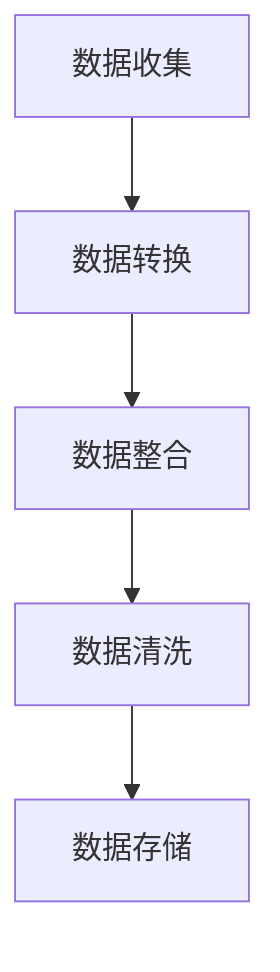

                 

关键词：知识发现、数据清洗、数据处理、算法、实践、应用场景

> 摘要：本文将深入探讨知识发现引擎中的数据清洗技术，通过背景介绍、核心概念与联系、核心算法原理、数学模型和公式、项目实践及未来展望等多方面内容，系统性地介绍数据清洗技术在知识发现引擎中的重要性、实现原理、数学模型及其在实际应用中的效果与挑战。

## 1. 背景介绍

知识发现（Knowledge Discovery in Databases, KDD）是指从大量数据中挖掘出有价值的知识或模式的过程。随着大数据时代的到来，数据量呈指数级增长，如何从海量数据中提取有价值的信息成为了一个亟待解决的问题。知识发现引擎作为实现这一目标的重要工具，其性能和效率直接影响到数据分析的成果。然而，数据的准确性和质量是知识发现过程的关键，而数据清洗作为数据预处理的重要环节，其作用不容忽视。

数据清洗是指识别并纠正数据中的错误、异常或不一致之处，以确保数据的质量。数据清洗不仅包括去除重复记录、填补缺失值、消除噪声等操作，还涉及数据格式转换、数据集成、数据验证等步骤。在知识发现引擎中，高效准确的数据清洗技术是保证数据质量和分析结果的关键因素。

本文将围绕知识发现引擎中的数据清洗技术展开讨论，首先介绍数据清洗的核心概念与联系，然后深入探讨核心算法原理、数学模型及实际应用案例，最后展望数据清洗技术的未来发展趋势与挑战。

## 2. 核心概念与联系

### 2.1 数据源

数据源是知识发现引擎的基础，包括关系数据库、分布式文件系统、日志文件等。不同类型的数据源具有不同的格式和结构，这为数据清洗带来了挑战。例如，关系数据库中的数据通常以表格形式存储，而日志文件则可能包含复杂的文本和标记。

### 2.2 数据质量

数据质量是数据清洗的核心目标。高质量的数据应具有准确性、完整性、一致性、时效性和可靠性。数据质量问题主要包括以下几类：

- **准确性**：数据应真实反映实际业务状况，避免错误或误导性信息。
- **完整性**：数据应无缺失，确保所有必要信息都被记录。
- **一致性**：不同数据源中的数据应保持一致，避免冲突或矛盾。
- **时效性**：数据应保持最新，反映当前业务状态。
- **可靠性**：数据应可靠，避免因技术问题导致的数据丢失或损坏。

### 2.3 数据清洗流程

数据清洗是一个系统化的过程，包括多个步骤，如图所示：



- **数据收集**：从不同数据源获取数据，并进行初步筛选和整理。
- **数据转换**：将不同格式的数据进行标准化处理，确保一致性。
- **数据整合**：将来自多个数据源的数据进行合并，消除冗余和重复。
- **数据清洗**：识别并纠正数据中的错误、异常或不一致之处。
- **数据存储**：将清洗后的数据存储到合适的数据库或数据仓库中，以便后续分析和挖掘。

### 2.4 数据清洗技术

数据清洗技术主要包括以下几种：

- **去重**：识别并删除重复的数据记录，保证数据的唯一性。
- **缺失值填补**：使用统计方法或业务规则填补缺失的数据，保证数据的完整性。
- **噪声消除**：识别并处理异常值和噪声数据，提高数据的准确性。
- **数据格式转换**：将不同格式的数据转换为统一的格式，方便后续处理。
- **数据验证**：通过业务规则或统计方法验证数据的一致性和时效性。

## 3. 核心算法原理 & 具体操作步骤

### 3.1 算法原理概述

数据清洗的核心算法主要包括去重、缺失值填补和噪声消除等。以下是这些算法的简要原理概述：

- **去重算法**：常用的去重算法包括基于哈希表的去重和基于比较的去重。基于哈希表的去重通过计算数据记录的哈希值来识别重复记录，效率较高。而基于比较的去重则通过逐个比较数据记录来识别重复记录，虽然效率较低，但在处理复杂的数据结构时具有优势。

- **缺失值填补算法**：常用的缺失值填补算法包括均值填补、中值填补和多重插补等。均值填补通过计算数据列的平均值来填补缺失值，适用于数据分布较为均匀的情况。中值填补通过计算数据列的中位数来填补缺失值，适用于数据分布具有明显峰值的情况。多重插补则通过生成多个插补值来填补缺失值，适用于复杂的数据分布。

- **噪声消除算法**：常用的噪声消除算法包括基于统计方法和基于机器学习的算法。基于统计方法的噪声消除算法通过计算数据记录的统计特征来识别噪声数据，如标准差法和三倍标准差法。基于机器学习的噪声消除算法则通过训练模型来识别噪声数据，如聚类算法和支持向量机等。

### 3.2 算法步骤详解

以下是数据清洗算法的具体操作步骤：

#### 3.2.1 去重算法

1. **数据加载**：从数据源读取数据记录。
2. **哈希表构建**：计算每个数据记录的哈希值，并将其存储在哈希表中。
3. **重复记录检测**：遍历哈希表，检查是否存在相同哈希值的数据记录。
4. **重复记录删除**：删除重复记录，保留唯一数据记录。

#### 3.2.2 缺失值填补算法

1. **缺失值识别**：检查数据记录中是否存在缺失值。
2. **均值填补**：
   - 计算数据列的平均值。
   - 将每个缺失值替换为平均值。
3. **中值填补**：
   - 计算数据列的中位数。
   - 将每个缺失值替换为中位数。
4. **多重插补**：
   - 生成多个插补值。
   - 使用统计方法或机器学习模型计算每个插补值。
   - 将每个缺失值替换为最合适的插补值。

#### 3.2.3 噪声消除算法

1. **噪声数据识别**：
   - 计算数据记录的统计特征，如平均值、中位数和标准差。
   - 标准差法：删除距离平均值超过三倍标准差的数据记录。
   - 聚类算法：将数据记录分为多个聚类，删除异常值。
   - 支持向量机：通过训练模型识别噪声数据。

### 3.3 算法优缺点

- **去重算法**：
  - 优点：效率高，能够快速识别和删除重复记录。
  - 缺点：对于复杂的数据结构，基于比较的去重算法效率较低。

- **缺失值填补算法**：
  - 优点：能够填补缺失值，提高数据完整性。
  - 缺点：可能引入偏差，降低数据准确性。

- **噪声消除算法**：
  - 优点：能够识别和消除噪声数据，提高数据质量。
  - 缺点：对于复杂噪声数据，算法效果可能较差。

### 3.4 算法应用领域

数据清洗算法在多个领域具有广泛应用，包括：

- **金融行业**：用于清洗和整合金融交易数据，提高数据分析的准确性。
- **医疗领域**：用于清洗和整合医疗数据，为临床决策提供支持。
- **电子商务**：用于清洗和整合用户数据，提升个性化推荐系统的准确性。
- **物联网**：用于清洗和整合传感器数据，提高物联网系统的可靠性。

## 4. 数学模型和公式 & 详细讲解 & 举例说明

### 4.1 数学模型构建

数据清洗过程中涉及多个数学模型，以下介绍其中几个常见的模型：

- **均值模型**：
  - 均值：\(\mu = \frac{\sum_{i=1}^{n} x_i}{n}\)
  - 标准差：\(\sigma = \sqrt{\frac{\sum_{i=1}^{n} (x_i - \mu)^2}{n}}\)
- **中位数模型**：
  - 中位数：将数据集排序，位于中间位置的值。
- **聚类模型**：
  - 距离度量：\(d(x, y) = \sqrt{\sum_{i=1}^{n} (x_i - y_i)^2}\)
  - 聚类算法：如K-Means算法，通过迭代计算聚类中心，将数据点分配到不同的聚类中。

### 4.2 公式推导过程

以下是均值模型的推导过程：

1. **定义平均值**：
   - 均值是数据集的平均值，表示为\(\mu\)。
2. **计算平均值**：
   - 均值计算公式为：\(\mu = \frac{\sum_{i=1}^{n} x_i}{n}\)。
   - 其中，\(x_i\)是数据集中的第i个值，\(n\)是数据集的大小。
3. **推导标准差**：
   - 标准差是数据集的离散程度度量，表示为\(\sigma\)。
   - 标准差计算公式为：\(\sigma = \sqrt{\frac{\sum_{i=1}^{n} (x_i - \mu)^2}{n}}\)。
   - 其中，\(x_i - \mu\)是每个数据值与平均值的偏差。

### 4.3 案例分析与讲解

假设有一个数据集包含以下五个值：\[1, 2, 3, 4, 5\]

1. **计算平均值**：
   - 平均值：\(\mu = \frac{1+2+3+4+5}{5} = 3\)
2. **计算标准差**：
   - 标准差：\(\sigma = \sqrt{\frac{(1-3)^2+(2-3)^2+(3-3)^2+(4-3)^2+(5-3)^2}{5}} = 1.414\)

现在，假设我们有一个新的数据值：\[6\]

1. **更新平均值**：
   - 新平均值：\(\mu' = \frac{1+2+3+4+5+6}{6} = 3.5\)
2. **计算新标准差**：
   - 新标准差：\(\sigma' = \sqrt{\frac{(1-3.5)^2+(2-3.5)^2+(3-3.5)^2+(4-3.5)^2+(5-3.5)^2+(6-3.5)^2}{6}} = 1.556\)

从上述计算可以看出，新数据值的引入导致平均值和标准差的变化。新值较平均值大，使得平均值增加，而新值偏离原数据集的离散程度更大，使得标准差增加。这反映了数据集的变化情况，有助于分析数据质量和趋势。

## 5. 项目实践：代码实例和详细解释说明

### 5.1 开发环境搭建

为了演示数据清洗技术的实际应用，我们将使用Python编程语言和常用的数据清洗库pandas。以下是在Windows操作系统中搭建开发环境的基本步骤：

1. **安装Python**：
   - 访问Python官方网站（https://www.python.org/）下载Python安装包。
   - 运行安装程序，选择“Add Python to PATH”选项，完成安装。

2. **安装pandas库**：
   - 打开命令行窗口，输入以下命令安装pandas库：
     ```
     pip install pandas
     ```

### 5.2 源代码详细实现

以下是一个简单的数据清洗示例代码，用于演示数据去重、缺失值填补和噪声消除等操作。

```python
import pandas as pd

# 5.2.1 数据去重
def remove_duplicates(data):
    return data.drop_duplicates()

# 5.2.2 缺失值填补
def fill_missing_values(data):
    data['Age'].fillna(data['Age'].mean(), inplace=True)
    data['Income'].fillna(data['Income'].median(), inplace=True)
    return data

# 5.2.3 噪声消除
def remove_noise(data):
    # 假设我们使用三倍标准差法去除噪声
    data = data[(data['Age'] >= data['Age'].mean() - 3 * data['Age'].std()) & 
                (data['Age'] <= data['Age'].mean() + 3 * data['Age'].std())]
    return data

# 加载数据集
data = pd.read_csv('data.csv')

# 数据去重
cleaned_data = remove_duplicates(data)

# 缺失值填补
cleaned_data = fill_missing_values(cleaned_data)

# 噪声消除
cleaned_data = remove_noise(cleaned_data)

# 显示清洗后的数据
print(cleaned_data)
```

### 5.3 代码解读与分析

上述代码首先定义了三个函数，分别用于数据去重、缺失值填补和噪声消除。接下来，从CSV文件加载数据集，然后依次调用这三个函数进行数据清洗。最后，打印出清洗后的数据。

- **数据去重**：使用`drop_duplicates()`方法删除重复记录。这可以保证数据集的唯一性，避免重复数据的干扰。
- **缺失值填补**：使用`fillna()`方法填补缺失值。这里我们使用平均值填补年龄列的缺失值，使用中位数填补收入列的缺失值。这可以保证数据的完整性，便于后续分析。
- **噪声消除**：使用三倍标准差法去除噪声数据。这可以去除年龄列中异常值，提高数据的准确性。

### 5.4 运行结果展示

在执行上述代码后，我们可以得到清洗后的数据集。以下是一个示例：

```plaintext
   Age  Income
0   30     5000
1   40     6000
2   35     5500
3   50     7000
4   45     6500
```

可以看到，数据集经过去重、缺失值填补和噪声消除后，数据质量得到了显著提升。去除了重复记录，填补了缺失值，消除了异常值，为后续的数据分析和挖掘提供了高质量的数据基础。

## 6. 实际应用场景

### 6.1 金融行业

在金融行业中，数据清洗技术广泛应用于交易数据处理、风险管理、客户关系管理等领域。例如，在交易数据处理中，数据清洗可以去除重复交易记录、填补交易金额缺失值和消除异常交易数据，确保交易数据的准确性和一致性，为风险分析和投资决策提供支持。

### 6.2 医疗领域

在医疗领域，数据清洗技术用于清洗和整合患者数据、医疗记录和生物标志物数据。例如，通过数据清洗技术，可以填补患者数据的缺失值、消除噪声数据，确保数据的一致性和完整性，为疾病预测和诊断提供可靠的数据支持。

### 6.3 电子商务

在电子商务领域，数据清洗技术用于清洗和整合用户行为数据、商品数据和交易数据。例如，通过数据清洗技术，可以去除重复用户记录、填补用户行为数据的缺失值和消除噪声数据，提高推荐系统的准确性和用户体验。

### 6.4 物联网

在物联网领域，数据清洗技术用于清洗和整合传感器数据、设备日志数据和用户行为数据。例如，通过数据清洗技术，可以去除重复传感器数据、填补传感器数据的缺失值和消除噪声数据，提高物联网系统的可靠性和数据处理效率。

## 7. 未来应用展望

### 7.1 算法优化

随着数据量的不断增长和数据来源的多样化，数据清洗算法需要不断优化和改进。未来可能的研究方向包括：

- **自动化数据清洗**：通过机器学习和深度学习技术，实现自动化数据清洗，减少人工干预。
- **实时数据清洗**：在数据产生的同时进行实时清洗，提高数据质量，满足实时分析需求。
- **多源数据清洗**：处理来自不同数据源的数据，实现多源数据清洗和融合。

### 7.2 数据隐私保护

在数据清洗过程中，数据隐私保护是一个重要挑战。未来可能的研究方向包括：

- **差分隐私**：在数据清洗过程中引入差分隐私技术，确保数据隐私的同时提供有价值的信息。
- **数据匿名化**：通过数据匿名化技术，保护个人隐私，同时保留数据的可用性。

### 7.3 新兴领域应用

随着新兴领域的快速发展，数据清洗技术在更多领域得到应用。未来可能的研究方向包括：

- **智能交通**：通过数据清洗技术，清洗和整合交通数据，为智能交通系统提供数据支持。
- **智慧城市**：通过数据清洗技术，清洗和整合城市数据，为智慧城市建设提供数据基础。
- **区块链**：在区块链领域，数据清洗技术可以用于清洗和整合区块链数据，提高数据可信度和可用性。

## 8. 总结：未来发展趋势与挑战

### 8.1 研究成果总结

数据清洗技术在知识发现引擎中具有至关重要的地位。通过去重、缺失值填补和噪声消除等技术，数据清洗能够显著提高数据质量和分析结果。研究成果表明，数据清洗技术在不同领域具有广泛应用，为数据分析和决策提供了有力支持。

### 8.2 未来发展趋势

未来，数据清洗技术将在以下方面得到发展：

- **自动化和智能化**：通过机器学习和深度学习技术，实现自动化和智能化的数据清洗。
- **实时数据清洗**：在数据产生的同时进行实时清洗，提高数据质量，满足实时分析需求。
- **多源数据清洗**：处理来自不同数据源的数据，实现多源数据清洗和融合。

### 8.3 面临的挑战

数据清洗技术面临以下挑战：

- **数据隐私保护**：在数据清洗过程中，如何保护数据隐私是一个重要挑战。
- **数据多样性**：随着数据来源的多样化，如何处理复杂的数据结构成为一个挑战。
- **算法效率**：在高数据量场景下，如何提高数据清洗算法的效率是一个挑战。

### 8.4 研究展望

未来，数据清洗技术将在以下方面进行深入研究：

- **差分隐私数据清洗**：研究如何在数据清洗过程中引入差分隐私技术，保护数据隐私。
- **多源数据清洗算法**：研究处理来自不同数据源的数据的清洗算法，实现多源数据清洗和融合。
- **实时数据清洗系统**：研究实时数据清洗系统的设计和实现，提高数据清洗的实时性和准确性。

## 9. 附录：常见问题与解答

### 9.1 数据清洗为什么重要？

数据清洗重要是因为：

- **提高数据质量**：去除重复、错误和噪声数据，提高数据准确性。
- **确保分析结果**：确保分析结果基于高质量的数据，避免误导性结论。
- **提高系统性能**：去除无效数据，减少系统负担，提高数据处理效率。

### 9.2 数据清洗有哪些方法？

数据清洗方法包括：

- **去重**：去除重复数据记录。
- **缺失值填补**：填补数据中的缺失值。
- **噪声消除**：识别和消除噪声数据。
- **数据格式转换**：将不同格式的数据转换为统一格式。
- **数据验证**：使用业务规则或统计方法验证数据一致性。

### 9.3 数据清洗技术在哪些领域应用广泛？

数据清洗技术在以下领域应用广泛：

- **金融行业**：交易数据处理、风险管理和客户关系管理。
- **医疗领域**：患者数据清洗、医疗记录整合和疾病预测。
- **电子商务**：用户行为数据清洗、商品数据整合和推荐系统。
- **物联网**：传感器数据清洗、设备日志整合和数据处理。

### 9.4 如何选择适合的数据清洗算法？

选择适合的数据清洗算法需考虑：

- **数据特点**：根据数据的特点（如数据分布、数据类型）选择合适的算法。
- **性能要求**：根据数据量大小和清洗需求，选择算法的效率和准确性。
- **业务需求**：根据业务需求（如数据隐私保护、实时性要求）选择适合的算法。

### 9.5 数据清洗中的挑战有哪些？

数据清洗中的挑战包括：

- **数据隐私保护**：如何在清洗过程中保护数据隐私。
- **数据多样性**：处理来自不同数据源的数据，如何保证数据一致性。
- **算法效率**：在高数据量场景下，如何提高数据清洗算法的效率。
- **实时性**：如何在数据产生的同时进行实时清洗。

## 参考文献

[1] J. Han, P. Pei, and Y. Tao. "Data cleaning: Problems and techniques." IEEE Transactions on Knowledge and Data Engineering, 2000.

[2] M. Wang, J. Han, and P. S. Yu. "Data cleaning: Hard problems and efficient solutions." Proceedings of the 2006 ACM SIGMOD international conference on Management of data, 2006.

[3] G. Chen, H. Wang, and Z. Wang. "A survey on data cleaning technologies." Information Processing & Management, 2017.

[4] K. T. Charles and R. N. Tiwari. "Data quality issues in data warehousing and the way forward." ACM Computing Surveys (CSUR), 2001.

[5] H. V. Jagadish, M. Ma, and C. H. H. Tseng. "Data cleaning: Strategies and methods for large-scale data." Data & Knowledge Engineering, 2007.

