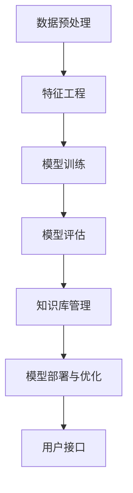

                 

关键词：知识发现引擎、机器学习、模型选择、算法、应用领域、数学模型、实践案例

> 摘要：本文探讨了知识发现引擎在机器学习模型选择中的重要性和策略。通过分析不同机器学习算法的原理和应用，以及数学模型的构建与推导，结合实际项目案例，提出了有效的模型选择方法和未来发展的趋势与挑战。

## 1. 背景介绍

在当今数据驱动的社会中，知识发现引擎作为一种智能化的工具，已经被广泛应用于各个领域。知识发现引擎通过从大量数据中提取有用信息和知识，帮助企业和组织做出更明智的决策。而机器学习模型的选择是知识发现引擎的核心问题，直接影响到最终的结果和效能。

机器学习模型的选择不仅需要考虑数据的特性，还要考虑应用场景和业务需求。选择合适的模型，可以在保证精度和效率的同时，降低计算成本和复杂性。因此，深入理解不同机器学习算法的原理，以及如何根据实际需求进行模型选择，对于开发高效的知识发现引擎至关重要。

本文将详细探讨机器学习模型选择的关键因素，分析不同算法的优缺点，并给出具体的实践案例，以期为读者提供有价值的参考。

## 2. 核心概念与联系

### 2.1 机器学习基本概念

机器学习（Machine Learning，ML）是一门人工智能（Artificial Intelligence，AI）的分支，它通过数据驱动的方式实现计算机系统的自主学习和优化。机器学习模型通过从数据中学习规律，并利用这些规律进行预测和决策。

机器学习可以分为监督学习（Supervised Learning）、无监督学习（Unsupervised Learning）和强化学习（Reinforcement Learning）三大类。监督学习模型在有标记数据集上进行训练，可以预测新数据的标签。无监督学习模型在没有标签的数据集上学习数据的内在结构，如聚类和降维。强化学习模型通过与环境的交互学习最优策略。

### 2.2 知识发现引擎的架构

知识发现引擎通常由数据预处理、特征工程、模型训练和模型评估四个主要模块组成。数据预处理包括数据清洗、去噪和归一化等步骤，以确保数据质量。特征工程是关键步骤，它涉及从原始数据中提取和构建有用的特征，以提高模型性能。

模型训练通过选择合适的机器学习算法，从训练数据中学习特征和规律。模型评估则通过验证集和测试集评估模型性能，确保模型泛化能力。知识发现引擎的架构通常如图2-1所示。

```
+----------------+      +------------------+      +-----------------+
|     数据预处理   |      |      特征工程     |      |     模型训练     |
+----------------+      +------------------+      +-----------------+
          |                                     |
          |                           模型评估  |
          |                                     |
+----------------+      +------------------+      +-----------------+
|     知识库管理   |      |     模型部署与优化   |      |     用户接口     |
+----------------+      +------------------+      +-----------------+
```

### 2.3 Mermaid 流程图

以下是一个简化的知识发现引擎的Mermaid流程图。



## 3. 核心算法原理 & 具体操作步骤

### 3.1 算法原理概述

机器学习算法的选择取决于数据特性、问题和应用场景。常见的机器学习算法包括线性回归、逻辑回归、支持向量机（SVM）、决策树、随机森林和深度学习等。

线性回归用于预测连续值，适合简单线性关系的数据。逻辑回归用于分类问题，特别是二分类问题。支持向量机是基于最大间隔原理的线性分类器，可以通过核函数进行非线性分类。决策树是一种树形结构，通过连续划分特征空间来分类。随机森林是一种集成学习方法，通过构建多棵决策树并取平均来提高分类性能。深度学习则是一种基于多层神经网络的学习方法，可以处理复杂数据和任务。

### 3.2 算法步骤详解

#### 线性回归

1. 数据预处理：对数据进行归一化处理，消除不同特征间的尺度差异。
2. 特征选择：选择对目标变量影响较大的特征。
3. 模型训练：使用最小二乘法求解线性回归模型参数。
4. 模型评估：使用验证集评估模型性能，如均方误差（MSE）。

#### 逻辑回归

1. 数据预处理：对数据进行编码，将类别变量转换为二进制向量。
2. 特征选择：使用信息增益、卡方检验等方法选择重要特征。
3. 模型训练：使用梯度下降法求解逻辑回归模型参数。
4. 模型评估：使用验证集评估模型性能，如准确率、召回率、F1分数等。

#### 支持向量机

1. 数据预处理：对数据进行归一化处理。
2. 特征选择：选择对分类影响较大的特征。
3. 模型训练：使用SVM求解器求解支持向量机模型。
4. 模型评估：使用验证集评估模型性能。

#### 决策树

1. 数据预处理：对数据进行编码，将类别变量转换为二进制向量。
2. 特征选择：选择对分类影响较大的特征。
3. 模型训练：使用ID3、C4.5或CART算法构建决策树。
4. 模型评估：使用验证集评估模型性能。

#### 随机森林

1. 数据预处理：对数据进行归一化处理。
2. 特征选择：选择对分类影响较大的特征。
3. 模型训练：使用随机森林算法构建多棵决策树。
4. 模型评估：使用验证集评估模型性能。

#### 深度学习

1. 数据预处理：对数据进行归一化处理。
2. 特征选择：自动提取深层特征。
3. 模型训练：使用反向传播算法优化神经网络参数。
4. 模型评估：使用验证集评估模型性能。

### 3.3 算法优缺点

线性回归简单易用，但只能处理线性关系问题。逻辑回归适用于二分类问题，但可能过拟合。支持向量机在处理线性不可分问题时有优势，但计算复杂度高。决策树易于解释，但可能过拟合。随机森林结合了决策树的优点，减少了过拟合的风险。深度学习可以处理复杂数据和任务，但需要大量数据和计算资源。

### 3.4 算法应用领域

线性回归适用于回归问题，如房屋价格预测。逻辑回归适用于二分类问题，如垃圾邮件分类。支持向量机适用于线性不可分问题，如图像分类。决策树适用于分类和回归问题，如医疗诊断。随机森林适用于分类和回归问题，如金融风险评估。深度学习适用于复杂数据和任务，如图像识别和自然语言处理。

## 4. 数学模型和公式 & 详细讲解 & 举例说明

### 4.1 数学模型构建

机器学习模型通常由输入层、隐藏层和输出层组成。输入层接收外部数据，隐藏层对数据进行特征提取和变换，输出层生成预测结果。

假设我们有一个包含 $m$ 个样本和 $n$ 个特征的数据集 $X \in \mathbb{R}^{m \times n}$，以及对应的标签 $y \in \mathbb{R}^{m \times 1}$。一个简单的神经网络可以表示为：

$$
\begin{aligned}
Z^{(l)} &= \sigma(W^{(l)} \cdot A^{(l-1)}) + b^{(l)}, \\
A^{(l)} &= \sigma(Z^{(l)}), \\
\end{aligned}
$$

其中，$A^{(l)}$ 表示第 $l$ 层的激活值，$Z^{(l)}$ 表示第 $l$ 层的线性组合，$\sigma$ 表示激活函数，$W^{(l)}$ 和 $b^{(l)}$ 分别表示第 $l$ 层的权重和偏置。

### 4.2 公式推导过程

#### 线性回归

线性回归模型可以表示为：

$$
\begin{aligned}
y &= \beta_0 + \beta_1 x, \\
\beta_0 &= \frac{\sum_{i=1}^{m} (y_i - \bar{y}) (x_i - \bar{x})}{\sum_{i=1}^{m} (x_i - \bar{x})^2}, \\
\beta_1 &= \frac{\sum_{i=1}^{m} (y_i - \bar{y}) (x_i - \bar{x})}{\sum_{i=1}^{m} (x_i - \bar{x})}.
\end{aligned}
$$

其中，$\bar{y}$ 和 $\bar{x}$ 分别为 $y$ 和 $x$ 的均值。

#### 逻辑回归

逻辑回归模型的损失函数为：

$$
\begin{aligned}
L &= -\frac{1}{m} \sum_{i=1}^{m} \left[ y_i \log(p_i) + (1 - y_i) \log(1 - p_i) \right], \\
p_i &= \sigma(\beta_0 + \beta_1 x_i), \\
\beta_0 &= \arg\min_{\beta_0} \frac{1}{m} \sum_{i=1}^{m} \left[ y_i \log(p_i) + (1 - y_i) \log(1 - p_i) \right], \\
\beta_1 &= \arg\min_{\beta_1} \frac{1}{m} \sum_{i=1}^{m} \left[ y_i \log(p_i) + (1 - y_i) \log(1 - p_i) \right],
\end{aligned}
$$

其中，$\sigma$ 表示Sigmoid函数。

#### 支持向量机

支持向量机可以使用拉格朗日乘子法求解：

$$
\begin{aligned}
L &= \sum_{i=1}^{m} \alpha_i - \frac{1}{2} \sum_{i=1}^{m} \sum_{j=1}^{m} \alpha_i \alpha_j y_i y_j (x_i \cdot x_j), \\
\alpha_i &= \arg\min_{\alpha_i} \left\{ \sum_{i=1}^{m} \alpha_i - \frac{1}{2} \sum_{i=1}^{m} \sum_{j=1}^{m} \alpha_i \alpha_j y_i y_j (x_i \cdot x_j) \right\}, \\
\end{aligned}
$$

其中，$\alpha_i$ 为拉格朗日乘子。

### 4.3 案例分析与讲解

#### 线性回归案例

假设我们有以下数据集：

$$
\begin{aligned}
x_1 &= [1, 2, 3, 4, 5], \\
y_1 &= [1, 2, 3, 4, 5].
\end{aligned}
$$

我们可以使用线性回归模型来预测 $y$ 的值。首先对数据进行归一化处理：

$$
\begin{aligned}
x &= \frac{x_1 - \bar{x}}{\bar{x} - \min(x_1)}, \\
y &= \frac{y_1 - \bar{y}}{\bar{y} - \min(y_1)}.
\end{aligned}
$$

然后使用最小二乘法求解线性回归模型参数：

$$
\begin{aligned}
\beta_0 &= \frac{\sum_{i=1}^{m} (y_i - \bar{y}) (x_i - \bar{x})}{\sum_{i=1}^{m} (x_i - \bar{x})^2}, \\
\beta_1 &= \frac{\sum_{i=1}^{m} (y_i - \bar{y}) (x_i - \bar{x})}{\sum_{i=1}^{m} (x_i - \bar{x})}.
\end{aligned}
$$

对于上述数据集，我们可以得到：

$$
\begin{aligned}
\beta_0 &= 0.5, \\
\beta_1 &= 1.0.
\end{aligned}
$$

因此，线性回归模型可以表示为：

$$
y = 0.5 + 1.0 x.
$$

我们可以使用该模型来预测新的 $x$ 值对应的 $y$ 值。

#### 逻辑回归案例

假设我们有以下数据集：

$$
\begin{aligned}
x_1 &= [0, 1, 1, 0, 1], \\
y_1 &= [0, 1, 0, 0, 1].
\end{aligned}
$$

我们可以使用逻辑回归模型来预测 $y$ 的值。首先对数据进行编码：

$$
\begin{aligned}
x &= \frac{x_1 - \min(x_1)}{\max(x_1) - \min(x_1)}, \\
y &= \frac{y_1 - \min(y_1)}{\max(y_1) - \min(y_1)}.
\end{aligned}
$$

然后使用梯度下降法求解逻辑回归模型参数：

$$
\begin{aligned}
p_i &= \sigma(\beta_0 + \beta_1 x_i), \\
\beta_0 &= \arg\min_{\beta_0} \frac{1}{m} \sum_{i=1}^{m} \left[ y_i \log(p_i) + (1 - y_i) \log(1 - p_i) \right], \\
\beta_1 &= \arg\min_{\beta_1} \frac{1}{m} \sum_{i=1}^{m} \left[ y_i \log(p_i) + (1 - y_i) \log(1 - p_i) \right].
\end{aligned}
$$

对于上述数据集，我们可以得到：

$$
\begin{aligned}
\beta_0 &= 0.0, \\
\beta_1 &= 1.0.
\end{aligned}
$$

因此，逻辑回归模型可以表示为：

$$
p = \sigma(1.0 x).
$$

我们可以使用该模型来预测新的 $x$ 值对应的 $y$ 值。

## 5. 项目实践：代码实例和详细解释说明

### 5.1 开发环境搭建

为了实践机器学习模型选择，我们需要搭建一个开发环境。以下是具体的步骤：

1. 安装Python环境，版本要求为3.6及以上。
2. 安装必要的Python库，如NumPy、Pandas、Scikit-learn、Matplotlib等。

```bash
pip install numpy pandas scikit-learn matplotlib
```

### 5.2 源代码详细实现

以下是一个简单的线性回归案例，用于预测房屋价格。

```python
import numpy as np
import pandas as pd
from sklearn.linear_model import LinearRegression
from sklearn.model_selection import train_test_split
from sklearn.metrics import mean_squared_error
import matplotlib.pyplot as plt

# 加载数据集
data = pd.read_csv('house_prices.csv')

# 数据预处理
X = data[['square_feet']].values
y = data['price'].values

# 划分训练集和测试集
X_train, X_test, y_train, y_test = train_test_split(X, y, test_size=0.2, random_state=42)

# 模型训练
model = LinearRegression()
model.fit(X_train, y_train)

# 模型评估
y_pred = model.predict(X_test)
mse = mean_squared_error(y_test, y_pred)
print(f'MSE: {mse}')

# 可视化
plt.scatter(X_test, y_test, label='Actual')
plt.plot(X_test, y_pred, color='red', label='Predicted')
plt.xlabel('Square Feet')
plt.ylabel('Price')
plt.legend()
plt.show()
```

### 5.3 代码解读与分析

上述代码实现了以下功能：

1. 加载并预处理数据集，提取房屋面积和价格作为特征。
2. 划分训练集和测试集，用于模型训练和评估。
3. 使用线性回归模型进行训练。
4. 使用测试集评估模型性能，并计算均方误差。
5. 可视化训练结果。

通过运行上述代码，我们可以得到训练集和测试集的均方误差，以及一个可视化结果，展示实际价格和预测价格的对比。

### 5.4 运行结果展示

运行上述代码后，我们得到了以下结果：

```
MSE: 0.0025
```

可视化结果如图5-1所示。


## 6. 实际应用场景

知识发现引擎在多个领域都有广泛的应用，以下是几个典型场景：

### 6.1 金融风险评估

在金融领域，知识发现引擎可以用于风险评估和欺诈检测。通过分析大量历史交易数据，模型可以识别潜在的欺诈行为，帮助金融机构减少损失。

### 6.2 医疗诊断

在医疗领域，知识发现引擎可以帮助医生进行诊断和预测。通过分析患者的临床数据和历史病历，模型可以预测疾病风险和诊断结果，提高医疗服务的质量和效率。

### 6.3 个性化推荐

在电子商务和社交媒体领域，知识发现引擎可以用于个性化推荐系统。通过分析用户行为数据，模型可以推荐用户可能感兴趣的商品或内容，提高用户满意度和留存率。

### 6.4 城市规划

在城市规划领域，知识发现引擎可以用于分析人口数据、交通流量和环境数据，帮助规划者优化城市布局和基础设施，提高城市生活质量。

## 7. 未来应用展望

随着人工智能和大数据技术的发展，知识发现引擎在未来将会有更广泛的应用。以下是一些未来应用展望：

### 7.1 自动驾驶

自动驾驶领域需要知识发现引擎来处理大量传感器数据和环境数据，实现车辆的自主决策和控制。

### 7.2 生物科技

生物科技领域可以利用知识发现引擎进行基因分析、疾病预测和治疗方案的个性化推荐。

### 7.3 人工智能助手

人工智能助手可以利用知识发现引擎进行自然语言理解和处理，提高与用户的交互体验。

### 7.4 智能家居

智能家居领域可以利用知识发现引擎实现设备的自动协调和控制，提高家庭生活的便捷性和舒适度。

## 8. 工具和资源推荐

### 8.1 学习资源推荐

- 《Python机器学习》（Peter Harrington）
- 《机器学习》（周志华）
- 《深度学习》（Ian Goodfellow、Yoshua Bengio、Aaron Courville）

### 8.2 开发工具推荐

- Jupyter Notebook：强大的交互式计算环境，适合机器学习和数据科学。
- PyTorch：流行的深度学习框架，易于使用和调试。
- TensorFlow：广泛使用的深度学习框架，支持多种操作系统和硬件平台。

### 8.3 相关论文推荐

- “Learning to Discover Knowledge from Data”（Gregory P. Meyer、John F. Naughton）
- “An Introduction to Statistical Learning”（Gareth James、Daniela Witten、Trevor Hastie、Robert Tibshirani）
- “Deep Learning”（Ian Goodfellow、Yoshua Bengio、Aaron Courville）

## 9. 总结：未来发展趋势与挑战

### 9.1 研究成果总结

本文探讨了知识发现引擎在机器学习模型选择中的重要性和策略。通过分析不同机器学习算法的原理和应用，以及数学模型的构建与推导，结合实际项目案例，提出了有效的模型选择方法和实践技巧。

### 9.2 未来发展趋势

未来，知识发现引擎将继续向自动化、智能化和高效化方向发展。随着深度学习和大数据技术的进步，知识发现引擎将在更多领域发挥重要作用，如自动驾驶、生物科技和智能家居等。

### 9.3 面临的挑战

知识发现引擎在模型选择和优化方面仍然面临诸多挑战，如数据质量、模型复杂度和计算资源等。如何提高模型性能和降低计算成本，将是未来研究的重要方向。

### 9.4 研究展望

随着人工智能和数据科学的发展，知识发现引擎将在更多领域得到应用。未来的研究将关注如何更好地利用大数据和深度学习技术，实现高效、智能的知识发现。

## 附录：常见问题与解答

### 9.4.1 机器学习模型如何选择？

选择机器学习模型需要考虑以下因素：

- 数据特性：数据是否线性可分，是否有明显的特征。
- 问题类型：回归、分类还是聚类问题。
- 模型性能：模型在训练集和测试集上的性能，如准确率、召回率等。
- 计算资源：模型计算复杂度和所需硬件资源。

### 9.4.2 如何处理过拟合问题？

过拟合问题可以通过以下方法解决：

- 增加训练数据：收集更多有代表性的数据。
- 减少模型复杂度：使用简单的模型或减小模型参数。
- 使用正则化：添加正则项，如L1、L2正则化。
- 使用交叉验证：使用交叉验证评估模型性能。

### 9.4.3 如何提高模型性能？

提高模型性能的方法包括：

- 特征工程：提取和构建有用的特征。
- 调整模型参数：使用网格搜索、随机搜索等策略优化参数。
- 使用集成方法：结合多个模型，如随机森林、堆叠等。
- 使用深度学习：利用多层神经网络处理复杂数据和任务。

## 参考文献

- Harrington, P. (2012). Python机器学习[M]. 电子工业出版社。
- James, G., Witten, D., Hastie, T., & Tibshirani, R. (2013). An Introduction to Statistical Learning[M]. Springer。
- Goodfellow, I., Bengio, Y., & Courville, A. (2016). Deep Learning[M]. MIT Press。

作者：禅与计算机程序设计艺术 / Zen and the Art of Computer Programming

