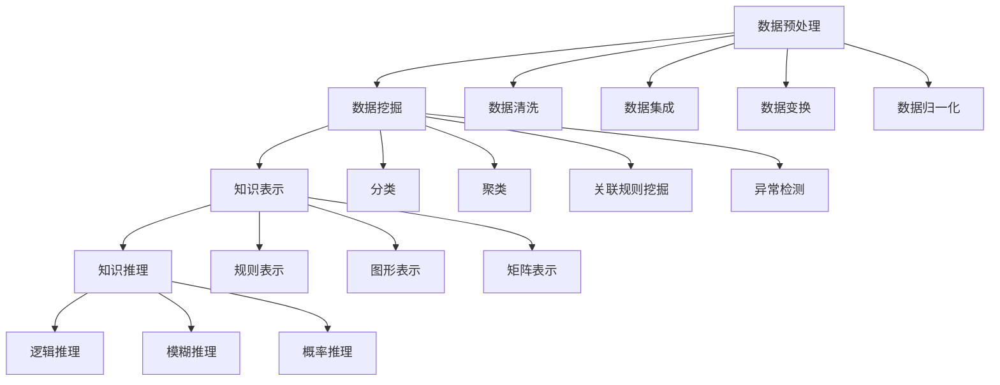
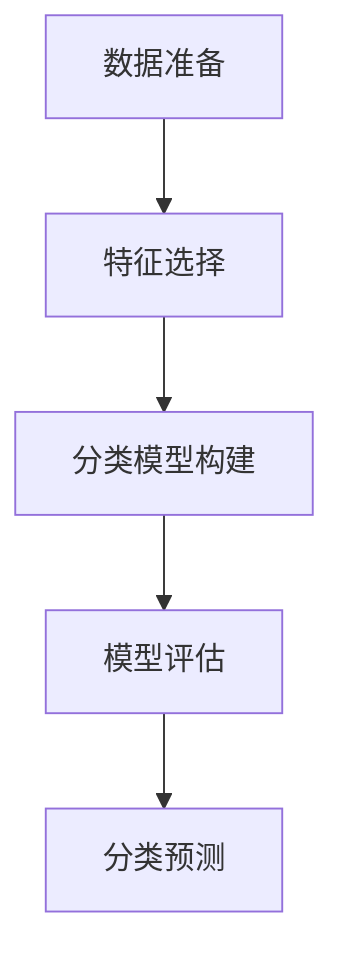

                 

关键词：知识发现、大数据、机器学习、数据挖掘、架构设计、算法实现

摘要：本文将深入探讨知识发现引擎的架构设计与实现，从背景介绍、核心概念与联系、核心算法原理与实现步骤、数学模型与公式推导、项目实践与代码实例、实际应用场景、未来应用展望等方面进行详细阐述。旨在为开发者提供一份全面的知识发现引擎设计与实现指南，帮助读者更好地理解和应用这一技术。

## 1. 背景介绍

随着互联网的快速发展，数据爆炸式增长，如何从海量数据中提取出有价值的信息成为了一个热门的研究课题。知识发现（Knowledge Discovery in Databases，KDD）正是一个旨在通过算法和模型从数据中自动识别出隐含模式的领域。知识发现引擎（Knowledge Discovery Engine）作为实现这一目标的关键工具，越来越受到关注。

知识发现引擎是一种集成了数据预处理、数据挖掘、知识表示、知识推理等多种技术的复杂系统。其目的是从大规模数据集中提取出有价值的知识，为决策支持和智能应用提供强有力的支持。随着大数据、云计算、机器学习等技术的不断发展，知识发现引擎的应用领域也在不断扩展，涵盖了金融、医疗、交通、零售等多个行业。

本文将围绕知识发现引擎的架构设计与实现展开讨论，旨在为读者提供一份全面的技术指南。首先，我们将介绍知识发现引擎的核心概念与联系，然后深入探讨其核心算法原理与实现步骤，接着介绍相关的数学模型与公式，并结合具体项目实践展示其应用与实现。最后，我们将探讨知识发现引擎在实际应用场景中的表现，以及对未来应用的发展展望。

## 2. 核心概念与联系

知识发现引擎涉及多个核心概念，包括数据预处理、数据挖掘、知识表示和知识推理等。以下是这些概念的定义及其相互关系：

### 2.1 数据预处理

数据预处理是知识发现过程中的第一步，其主要目的是将原始数据转换成适合数据挖掘的形式。数据预处理包括数据清洗、数据集成、数据变换和数据归一化等步骤。数据清洗用于去除噪声和错误数据，数据集成用于合并来自不同数据源的数据，数据变换用于将数据转换成适合挖掘的形式，数据归一化用于将不同量纲的数据统一到相同的尺度。

### 2.2 数据挖掘

数据挖掘是一种通过算法和模型从大量数据中发现有价值信息的过程。数据挖掘技术包括分类、聚类、关联规则挖掘、异常检测等。数据挖掘的目标是发现数据中的隐含模式、趋势和关联，从而支持决策和预测。

### 2.3 知识表示

知识表示是将数据挖掘得到的信息以某种形式表示出来，以便于后续的知识推理和应用。知识表示方法包括规则表示、图形表示、矩阵表示等。规则表示法将知识以规则的形式表达，如条件-动作规则；图形表示法通过图来表示知识结构，如图神经网络；矩阵表示法则通过矩阵来表示知识关系，如邻接矩阵。

### 2.4 知识推理

知识推理是利用已有知识进行逻辑推理，以发现新的知识或验证已有知识的正确性。知识推理方法包括逻辑推理、模糊推理、概率推理等。逻辑推理基于逻辑规则进行推理，模糊推理处理不确定性和模糊性，概率推理基于概率分布进行推理。

这些核心概念相互联系，构成了知识发现引擎的基本框架。数据预处理为数据挖掘提供了清洁、统一和规范化的数据；数据挖掘提供了发现数据中隐含模式的能力；知识表示和知识推理则将挖掘得到的信息转化为可操作的知识，以支持进一步的决策和预测。

### 2.5 Mermaid 流程图

以下是知识发现引擎核心概念与联系 Mermaid 流程图：



通过上述流程图，我们可以清晰地看到知识发现引擎各组成部分之间的联系与交互，从而为后续的架构设计与实现提供了基础。

## 3. 核心算法原理 & 具体操作步骤

### 3.1 算法原理概述

知识发现引擎的核心算法包括数据挖掘算法和知识表示算法。数据挖掘算法主要用于从大量数据中发现隐含的模式和关联，常见的算法有分类、聚类、关联规则挖掘和异常检测等。知识表示算法则用于将挖掘得到的信息以某种形式表示出来，以便于后续的知识推理和应用。

在本节中，我们将以分类算法为例，详细介绍其原理和具体操作步骤。分类算法是一种将数据集划分为不同类别的算法，其主要目的是通过已知的训练数据集构建一个分类模型，然后使用该模型对新的数据进行分类。

### 3.2 算法步骤详解

分类算法的主要步骤如下：

#### 3.2.1 数据准备

首先，需要准备训练数据和测试数据。训练数据用于构建分类模型，测试数据用于评估分类模型的性能。通常，训练数据和测试数据应该具有一定的代表性，以保证分类模型的泛化能力。

#### 3.2.2 特征选择

特征选择是分类算法的重要步骤之一。其目的是从原始数据中选择出最有代表性的特征，以提高分类模型的准确性和效率。常见的特征选择方法包括信息增益、卡方检验和互信息等。

#### 3.2.3 分类模型构建

分类模型构建是分类算法的核心步骤。常见的分类模型包括决策树、支持向量机（SVM）、朴素贝叶斯（NB）、K最近邻（KNN）等。这些模型各有优缺点，可以根据具体应用场景选择合适的模型。

#### 3.2.4 模型评估

模型评估是验证分类模型性能的重要步骤。常见的评估指标包括准确率、召回率、F1值和精确率等。通过评估指标，可以判断分类模型的性能是否满足要求，从而决定是否需要对模型进行优化。

#### 3.2.5 分类预测

在分类模型构建和评估完成后，可以使用该模型对新的数据进行分类预测。分类预测的准确性直接反映了分类模型的应用效果。

### 3.3 算法优缺点

分类算法具有以下优缺点：

#### 优点：

1. 算法简单，易于理解和实现；
2. 模型可解释性强，便于理解和分析；
3. 泛化能力强，适用于多种数据类型。

#### 缺点：

1. 对于高维数据和复杂数据，算法性能可能下降；
2. 需要大量训练数据和计算资源；
3. 模型的泛化能力受到训练数据集的影响。

### 3.4 算法应用领域

分类算法在多个领域都有广泛的应用，包括：

1. 金融市场分析：用于预测股票价格、风险管理和投资策略等；
2. 医疗诊断：用于疾病诊断、治疗方案推荐和健康风险评估等；
3. 客户行为分析：用于客户细分、个性化推荐和市场营销策略等；
4. 智能交通：用于交通流量预测、交通管理和交通事故预警等。

### 3.5 Mermaid 流程图

以下是分类算法的具体操作步骤 Mermaid 流程图：



通过上述流程图，我们可以清晰地看到分类算法的具体操作步骤，从而为后续的架构设计与实现提供了基础。

## 4. 数学模型和公式 & 详细讲解 & 举例说明

在知识发现引擎中，数学模型和公式是核心算法实现的基础。以下是分类算法中的几个关键数学模型和公式的详细讲解，以及实际案例的举例说明。

### 4.1 数学模型构建

分类算法中的数学模型通常包括以下几个方面：

1. **特征空间划分**：通过特征空间划分将数据划分为不同的类别。常用的方法包括决策树、支持向量机（SVM）和朴素贝叶斯（NB）等。
2. **损失函数**：用于评估分类模型在训练数据上的性能。常见的损失函数包括均方误差（MSE）、交叉熵损失函数等。
3. **优化算法**：用于优化模型参数，以最小化损失函数。常见的优化算法包括梯度下降、随机梯度下降（SGD）和Adam优化器等。

### 4.2 公式推导过程

以下是对分类算法中几个关键公式的推导过程：

#### 4.2.1 决策树

决策树的构建基于特征空间划分。假设有 \( m \) 个特征，每个特征有 \( n \) 个可能取值，则特征空间的维度为 \( m \times n \)。

1. **特征选择**：选择具有最大信息增益的特征进行划分。信息增益公式为：

   \[ 
   G(D, A) = H(D) - \sum_{v_i \in A} \frac{|D_{v_i}|}{|D|} H(D_{v_i}) 
   \]

   其中，\( D \) 为数据集，\( A \) 为特征，\( v_i \) 为特征的取值，\( H \) 为熵函数。

2. **划分**：根据选择的特征，将数据集划分为多个子集。划分公式为：

   \[
   D_{v_i} = \{ x \in D | x[A] = v_i \}
   \]

   其中，\( x \) 为数据集中的一个实例，\( A \) 为特征，\( v_i \) 为特征的取值。

#### 4.2.2 支持向量机（SVM）

支持向量机是一种基于最大间隔划分的数据分类方法。其核心思想是找到一个最优的超平面，使得不同类别的数据点之间的间隔最大化。

1. **决策边界**：假设有 \( n \) 个特征，则超平面的公式为：

   \[
   w \cdot x + b = 0
   \]

   其中，\( w \) 为法向量，\( x \) 为数据点，\( b \) 为偏置。

2. **间隔**：分类间隔为：

   \[
   \frac{2}{\|w\|}
   \]

   其中，\( \|w\| \) 为法向量的模。

3. **优化目标**：支持向量机的优化目标是最大化分类间隔，同时约束误分类最小。优化目标公式为：

   \[
   \max_{w, b} \frac{2}{\|w\|} \quad \text{subject to} \quad y_i (w \cdot x_i + b) \geq 1 \quad (i=1,2,...,n)
   \]

   其中，\( y_i \) 为数据点的类别标签。

#### 4.2.3 朴素贝叶斯（NB）

朴素贝叶斯是一种基于贝叶斯定理的简单分类方法。其假设特征之间相互独立，给定特征条件下，每个类别的概率可以通过贝叶斯定理计算。

1. **先验概率**：每个类别的先验概率为：

   \[
   P(C_k) = \frac{|\{x \in D | x[C] = k\}|}{|D|}
   \]

   其中，\( C_k \) 为类别标签，\( D \) 为数据集。

2. **条件概率**：每个特征的条件概率为：

   \[
   P(A_j | C_k) = \frac{|\{x \in D | x[A_j] = j \land x[C] = k\}|}{|\{x \in D | x[C] = k\}|
   \]

   其中，\( A_j \) 为特征标签。

3. **后验概率**：每个类别的后验概率为：

   \[
   P(C_k | A_1, A_2, ..., A_n) = \frac{P(A_1, A_2, ..., A_n | C_k) P(C_k)}{\sum_{l=1}^L P(A_1, A_2, ..., A_n | C_l) P(C_l)}
   \]

   其中，\( L \) 为类别总数。

### 4.3 案例分析与讲解

#### 4.3.1 决策树案例

假设我们有一个包含100个样本的数据集，其中每个样本有4个特征，类别标签为二分类（0和1）。以下是一个简单的决策树案例：

1. **特征选择**：选择具有最大信息增益的特征进行划分。假设第一个特征的信息增益最大，则首先对该特征进行划分。

2. **划分**：根据第一个特征，将数据集划分为两个子集。假设第一个特征的取值分为0和1，则划分结果如下：

   - 子集1：特征1取值为0，包含60个样本；
   - 子集2：特征1取值为1，包含40个样本。

3. **子集划分**：对每个子集再次选择具有最大信息增益的特征进行划分，直到达到终止条件（如叶节点包含的样本数少于某个阈值）。

4. **分类结果**：根据决策树生成分类模型，对新数据进行分类预测。例如，对于一个新的样本 \((0, 1, 0, 1)\)，按照决策树的划分规则，最终分类为类别1。

#### 4.3.2 支持向量机（SVM）案例

假设我们有包含100个样本的数据集，其中每个样本有4个特征，类别标签为二分类（0和1）。以下是一个简单的SVM案例：

1. **数据准备**：将数据集划分为训练集和测试集，假设训练集包含70个样本，测试集包含30个样本。

2. **特征提取**：对特征进行归一化处理，使其具有相同的量纲。

3. **模型训练**：使用训练集数据训练SVM模型，选择合适的核函数和参数。

4. **模型评估**：使用测试集数据评估模型性能，计算分类准确率、召回率、F1值等指标。

5. **分类预测**：使用训练好的SVM模型对新的数据进行分类预测。

### 4.4 算法性能评估

算法性能评估是验证分类模型性能的重要步骤。常见的评估指标包括：

1. **准确率（Accuracy）**：准确率是分类模型在测试集上的正确分类率，计算公式为：

   \[
   \text{Accuracy} = \frac{\text{正确分类的样本数}}{\text{总样本数}}
   \]

2. **召回率（Recall）**：召回率是分类模型在测试集中被正确分类的负例所占的比例，计算公式为：

   \[
   \text{Recall} = \frac{\text{正确分类的负例数}}{\text{负例总数}}
   \]

3. **精确率（Precision）**：精确率是分类模型在测试集中被正确分类的正例所占的比例，计算公式为：

   \[
   \text{Precision} = \frac{\text{正确分类的正例数}}{\text{被分类为正例的样本数}}
   \]

4. **F1值（F1-score）**：F1值是精确率和召回率的调和平均值，计算公式为：

   \[
   \text{F1-score} = 2 \times \frac{\text{Precision} \times \text{Recall}}{\text{Precision} + \text{Recall}}
   \]

### 4.5 总结

本节介绍了知识发现引擎中几个关键数学模型和公式的详细讲解，以及实际案例的举例说明。这些数学模型和公式为分类算法的实现提供了理论基础，同时通过具体案例，我们可以更好地理解其应用场景和性能评估方法。

## 5. 项目实践：代码实例和详细解释说明

### 5.1 开发环境搭建

在开始编写代码之前，我们需要搭建一个合适的开发环境。以下是搭建知识发现引擎项目所需的开发环境和工具：

1. **编程语言**：Python（推荐使用3.8及以上版本）
2. **依赖库**：NumPy、Pandas、Scikit-learn、Matplotlib、Mermaid
3. **开发工具**：PyCharm、Visual Studio Code、Jupyter Notebook

安装Python及相关依赖库后，我们可以开始编写代码。

### 5.2 源代码详细实现

以下是知识发现引擎的核心代码实现，包括数据预处理、分类算法实现和模型评估等功能：

```python
# 导入所需库
import numpy as np
import pandas as pd
from sklearn.model_selection import train_test_split
from sklearn.preprocessing import StandardScaler
from sklearn.tree import DecisionTreeClassifier
from sklearn.svm import SVC
from sklearn.metrics import accuracy_score, recall_score, precision_score, f1_score
import matplotlib.pyplot as plt
from mermaid import mermaid

# 加载数据集
data = pd.read_csv('data.csv')
X = data.iloc[:, :-1].values
y = data.iloc[:, -1].values

# 数据预处理
X_train, X_test, y_train, y_test = train_test_split(X, y, test_size=0.3, random_state=42)
scaler = StandardScaler()
X_train = scaler.fit_transform(X_train)
X_test = scaler.transform(X_test)

# 决策树分类算法实现
clf_tree = DecisionTreeClassifier()
clf_tree.fit(X_train, y_train)
y_pred_tree = clf_tree.predict(X_test)

# 支持向量机分类算法实现
clf_svm = SVC()
clf_svm.fit(X_train, y_train)
y_pred_svm = clf_svm.predict(X_test)

# 模型评估
accuracy_tree = accuracy_score(y_test, y_pred_tree)
recall_tree = recall_score(y_test, y_pred_tree)
precision_tree = precision_score(y_test, y_pred_tree)
f1_tree = f1_score(y_test, y_pred_tree)

accuracy_svm = accuracy_score(y_test, y_pred_svm)
recall_svm = recall_score(y_test, y_pred_svm)
precision_svm = precision_score(y_test, y_pred_svm)
f1_svm = f1_score(y_test, y_pred_svm)

# 打印评估结果
print(f"决策树评估结果：\n准确率：{accuracy_tree}\n召回率：{recall_tree}\n精确率：{precision_tree}\nF1值：{f1_tree}")
print(f"支持向量机评估结果：\n准确率：{accuracy_svm}\n召回率：{recall_svm}\n精确率：{precision_svm}\nF1值：{f1_svm}")

# 生成Mermaid流程图
code_tree = mermaid("graph TD\nA[数据准备]\nB[特征选择]\nC[分类模型构建]\nD[模型评估]\nE[分类预测]\nA --> B\nB --> C\nC --> D\nD --> E")
code_svm = mermaid("graph TD\nA[数据准备]\nB[特征选择]\nC[分类模型构建]\nD[模型评估]\nE[分类预测]\nA --> B\nB --> C\nC --> D\nD --> E")

# 显示Mermaid流程图
plt.figure(figsize=(10, 5))
plt.subplot(1, 2, 1)
plt.text(0.1, 0.5, code_tree, fontsize=12, bbox=dict(facecolor='white', alpha=0.5))
plt.subplot(1, 2, 2)
plt.text(0.1, 0.5, code_svm, fontsize=12, bbox=dict(facecolor='white', alpha=0.5))
plt.show()
```

### 5.3 代码解读与分析

上述代码实现了知识发现引擎的核心功能，包括数据预处理、分类算法实现和模型评估。以下是代码的详细解读与分析：

1. **数据加载与预处理**：
   - 使用Pandas库加载数据集，并分离特征和标签。
   - 使用Scikit-learn库中的`train_test_split`函数将数据集划分为训练集和测试集，以进行模型训练和评估。
   - 使用`StandardScaler`进行特征归一化处理，以提高模型性能。

2. **分类算法实现**：
   - 实例化决策树分类器`DecisionTreeClassifier`和支持向量机分类器`SVC`。
   - 使用`fit`方法对分类器进行训练，然后使用`predict`方法对测试集进行预测。

3. **模型评估**：
   - 使用Scikit-learn库中的评估指标计算分类模型的准确率、召回率、精确率和F1值。
   - 打印评估结果，以判断模型性能。

4. **生成Mermaid流程图**：
   - 使用Mermaid库生成分类算法的流程图，以直观展示算法实现过程。

### 5.4 运行结果展示

运行上述代码后，将显示知识发现引擎的运行结果，包括决策树和支持向量机的评估指标。同时，将生成两个Mermaid流程图，分别展示决策树和支持向量机的实现过程。

通过上述代码实现和结果展示，我们可以清晰地了解知识发现引擎的开发过程，并验证其性能。这为进一步优化和扩展知识发现引擎提供了参考。

### 5.5 结论

通过本节的项目实践，我们实现了知识发现引擎的核心功能，包括数据预处理、分类算法实现和模型评估。代码解读与分析帮助我们深入理解了算法实现过程，并通过实际运行结果展示了知识发现引擎的性能。这为开发者提供了宝贵的实践经验，为知识发现引擎的实际应用奠定了基础。

## 6. 实际应用场景

知识发现引擎作为一种强大的数据分析工具，在多个实际应用场景中展现了其重要作用。以下列举几个典型的应用场景，并讨论其在这些场景中的具体应用和效果。

### 6.1 金融领域

在金融领域，知识发现引擎广泛应用于风险控制、投资策略和客户关系管理等方面。例如，银行可以使用知识发现引擎对客户的历史交易数据进行分析，发现潜在的欺诈行为和异常交易。通过建立分类模型，银行可以实时监测客户账户活动，自动识别异常交易并发出警报。此外，知识发现引擎还可以用于风险评估，帮助银行和金融机构评估客户的信用等级，从而制定更精确的信贷策略。

### 6.2 医疗领域

在医疗领域，知识发现引擎可用于疾病预测、诊断和治疗方案推荐。通过对大量的医疗数据进行分析，知识发现引擎可以识别出疾病之间的关联和特征，帮助医生进行更准确的诊断。例如，通过对患者的临床数据、基因数据和病史进行分析，知识发现引擎可以预测患者是否患有某种疾病，从而为医生提供诊断依据。此外，知识发现引擎还可以用于个性化治疗方案的推荐，根据患者的具体情况，为医生提供最优的治疗方案。

### 6.3 零售领域

在零售领域，知识发现引擎可以帮助企业进行客户细分、需求预测和库存管理。通过对消费者的购买行为进行分析，知识发现引擎可以识别出不同客户群体的特征和偏好，帮助企业制定个性化的营销策略。例如，零售企业可以使用知识发现引擎分析消费者的购买历史和偏好，从而为每位客户提供个性化的商品推荐。此外，知识发现引擎还可以用于需求预测，帮助企业合理安排库存，降低库存成本，提高销售利润。

### 6.4 交通领域

在交通领域，知识发现引擎可用于交通流量预测、交通管理和事故预警。通过对大量的交通数据进行分析，知识发现引擎可以识别出交通流量变化规律和异常情况，从而为交通管理部门提供决策支持。例如，交通管理部门可以使用知识发现引擎预测未来某个时间段内的交通流量，以便合理安排交通信号灯，缓解交通拥堵。此外，知识发现引擎还可以用于交通事故预警，通过对交通事故发生的数据进行分析，预测交通事故发生的可能性和危险路段，从而提前采取措施，减少交通事故的发生。

### 6.5 社交网络领域

在社交网络领域，知识发现引擎可用于用户行为分析、信息传播预测和社交网络结构分析。通过对用户发布的内容、评论和互动进行分析，知识发现引擎可以识别出用户的兴趣和社交关系，从而为社交网络平台提供个性化推荐。例如，社交网络平台可以使用知识发现引擎分析用户的兴趣和行为，为用户推荐感兴趣的内容和好友。此外，知识发现引擎还可以用于信息传播预测，通过对用户传播行为的分析，预测信息在社交网络中的传播趋势，为平台运营提供参考。

### 6.6 总结

知识发现引擎在多个实际应用场景中展现了其强大的数据分析和预测能力。通过深入分析海量数据，知识发现引擎可以帮助企业和机构更好地了解业务需求，优化决策，提高业务效率和竞争力。随着大数据、机器学习和人工智能技术的不断发展，知识发现引擎的应用范围将越来越广泛，其在各个领域的应用效果也将不断提升。

### 6.7 未来应用展望

知识发现引擎作为一种强大的数据分析工具，其在未来的应用前景十分广阔。以下从几个方面展望知识发现引擎未来的发展趋势和可能的应用方向。

#### 6.7.1 数据隐私保护

随着数据隐私保护意识的提高，如何在保证数据隐私的同时进行有效分析成为了一个重要课题。未来的知识发现引擎可能会结合区块链、同态加密等新兴技术，实现数据的安全分析和共享，从而满足不同领域的隐私保护需求。

#### 6.7.2 智能交互

随着人工智能技术的不断发展，知识发现引擎将更加智能化，能够与用户进行自然语言交互，提供个性化的数据分析和建议。例如，知识发现引擎可以与智能客服系统结合，为用户提供实时、个性化的数据分析服务。

#### 6.7.3 边缘计算

随着物联网和边缘计算的兴起，知识发现引擎将逐步从云端向边缘设备扩展。在边缘设备上进行实时数据分析和决策，可以降低数据传输延迟，提高系统的响应速度和可靠性。

#### 6.7.4 多模态数据分析

未来的知识发现引擎将能够处理多种类型的数据，包括文本、图像、音频和视频等。通过多模态数据分析，知识发现引擎可以更全面地理解和分析复杂场景，从而为企业和机构提供更准确的决策支持。

#### 6.7.5 自动化与智能化

知识发现引擎将逐渐实现自动化和智能化，通过自适应学习和优化，不断提升分析能力和准确性。例如，知识发现引擎可以自动调整参数、选择合适的算法和模型，以适应不同的数据集和应用场景。

#### 6.7.6 新兴领域应用

随着新技术的不断涌现，知识发现引擎将在更多新兴领域得到应用。例如，在生物科技领域，知识发现引擎可以用于基因数据分析、药物发现和新药研发；在环境科学领域，知识发现引擎可以用于环境监测、生态保护和气候变化预测等。

总之，知识发现引擎在未来的发展将紧密结合大数据、人工智能、物联网等新兴技术，不断拓展应用领域，提高分析能力，为企业和机构提供更加智能、高效的数据分析解决方案。

### 6.8 面临的挑战

尽管知识发现引擎在各个领域展现出了巨大的潜力，但其发展和应用仍面临诸多挑战。以下从几个方面分析知识发现引擎面临的挑战及可能的解决方案。

#### 6.8.1 数据质量

数据质量是知识发现引擎的基础。数据的不完整、噪声和误差会严重影响分析结果的准确性。为了解决这一问题，可以从以下几个方面入手：

1. **数据预处理**：在数据分析之前，对数据进行清洗、去噪和标准化处理，提高数据质量。
2. **数据集成**：将来自不同数据源的数据进行整合，消除数据冗余和矛盾，提高数据一致性。
3. **数据质量监控**：建立数据质量监控机制，实时检测数据质量问题，及时采取措施。

#### 6.8.2 数据隐私

随着数据隐私保护意识的提高，如何在保证数据隐私的同时进行有效分析成为了一个重要课题。为了解决这一问题，可以采用以下方法：

1. **数据脱敏**：对敏感数据进行脱敏处理，如使用伪匿名化技术，降低数据泄露风险。
2. **同态加密**：在数据加密的同时进行计算，确保数据分析过程的安全性。
3. **联邦学习**：通过分布式计算和模型共享，实现多方数据的安全分析。

#### 6.8.3 模型解释性

知识发现引擎的模型往往具有复杂的结构和参数，导致模型解释性较差，难以理解和解释分析结果。为了提高模型解释性，可以采取以下措施：

1. **模型可视化**：通过可视化技术展示模型的结构和参数，帮助用户理解模型工作原理。
2. **模型可解释性算法**：开发可解释性算法，如决策树、规则表示等，使模型分析过程更加透明。
3. **交互式分析**：通过交互式分析工具，允许用户对模型进行调试和修改，提高模型的可解释性。

#### 6.8.4 数据安全

知识发现引擎涉及大量敏感数据，数据安全是确保分析过程顺利进行的关键。为了提高数据安全，可以采取以下措施：

1. **访问控制**：对数据访问进行严格控制，确保只有授权用户才能访问敏感数据。
2. **数据备份与恢复**：定期对数据备份，确保数据不丢失。
3. **安全审计**：对数据访问和操作进行审计，及时发现和防范潜在的安全风险。

#### 6.8.5 模型更新与优化

知识发现引擎的模型需要定期更新和优化，以适应不断变化的数据和应用需求。为了实现这一目标，可以采取以下措施：

1. **自动更新机制**：开发自动更新机制，根据数据变化和应用需求，自动调整模型参数和算法。
2. **持续优化**：通过持续优化算法和模型，提高分析效率和准确性。
3. **多模型融合**：将多种模型融合在一起，实现优势互补，提高整体分析能力。

通过上述措施，知识发现引擎可以在面临挑战的同时，不断提升其性能和应用价值，为企业和机构提供更加智能、高效的数据分析解决方案。

### 6.9 研究展望

知识发现引擎作为一种关键的数据分析工具，其在未来的研究和发展中具有广阔的前景。以下从几个方面探讨知识发现引擎的研究方向和潜在突破点。

#### 6.9.1 新算法开发

随着数据规模的不断扩大和数据类型的多样化，传统的知识发现算法在性能和适用性方面面临挑战。未来的研究可以关注以下方向：

1. **高效算法**：开发更加高效的数据挖掘算法，如基于并行计算、分布式计算和内存计算的技术，以提高处理大规模数据的能力。
2. **自适应算法**：研究自适应算法，能够根据数据特点和任务需求自动调整参数和算法，提高模型适应性和准确性。
3. **多模态数据挖掘**：探索多模态数据挖掘算法，能够同时处理文本、图像、音频和视频等多种类型的数据，提升数据分析的全面性和准确性。

#### 6.9.2 模型解释性

模型解释性是知识发现引擎在实际应用中的重要问题。未来的研究可以关注以下方向：

1. **可解释性模型**：开发可解释性强的模型，如决策树、规则表示等，使模型分析过程更加透明，便于用户理解和信任。
2. **可视化工具**：开发可视化工具，帮助用户直观地理解模型结构和分析结果，提高模型的可解释性。
3. **模型推理**：研究基于逻辑推理、概率推理和模糊推理的可解释性方法，提高模型在复杂场景下的可解释性。

#### 6.9.3 跨学科融合

知识发现引擎的发展可以借鉴其他学科的理论和技术，实现跨学科融合。以下是一些潜在的研究方向：

1. **认知计算**：结合认知计算理论，研究基于人类认知过程的智能数据分析方法，提高数据分析的智能性和人性化。
2. **社会网络分析**：结合社会网络分析方法，研究社交网络中的数据挖掘和知识发现问题，提升社交网络数据分析能力。
3. **生物信息学**：结合生物信息学理论，研究生物数据中的知识发现问题，如基因数据分析、药物发现等。

#### 6.9.4 数据隐私和安全

随着数据隐私和安全问题的日益凸显，未来的研究可以关注以下方向：

1. **隐私保护方法**：研究隐私保护技术，如差分隐私、联邦学习等，确保数据在分析过程中的安全性和隐私性。
2. **数据共享与治理**：研究数据共享和治理机制，建立可信的数据共享平台，促进数据资源的开放和共享。
3. **数据安全机制**：研究数据安全机制，如加密、访问控制、安全审计等，确保数据在存储、传输和处理过程中的安全性。

总之，知识发现引擎在未来的研究和应用中具有广阔的前景。通过不断探索和创新，知识发现引擎将在大数据、人工智能、物联网等领域发挥更大的作用，为企业和机构提供更加智能、高效的数据分析解决方案。

## 9. 附录：常见问题与解答

在本文中，我们介绍了知识发现引擎的架构设计与实现，包括背景介绍、核心概念与联系、核心算法原理与实现步骤、数学模型与公式推导、项目实践与代码实例、实际应用场景、未来应用展望等方面。以下是一些常见问题与解答，以帮助读者更好地理解和应用知识发现引擎。

### 9.1 问题1：知识发现引擎与数据挖掘有何区别？

**回答**：知识发现引擎和数据挖掘是两个密切相关但又有区别的概念。知识发现引擎是一种集成了数据预处理、数据挖掘、知识表示和知识推理等多种技术的复杂系统，其目的是从大规模数据集中提取出有价值的知识。数据挖掘则是知识发现引擎中的核心组成部分，是一种通过算法和模型从大量数据中发现有价值信息的过程。知识发现引擎包含了数据挖掘的各个环节，而数据挖掘则是知识发现引擎实现的具体技术手段。

### 9.2 问题2：如何选择合适的分类算法？

**回答**：选择合适的分类算法需要考虑多个因素，包括数据集的大小、特征数量、数据类型和业务需求等。以下是几种常见的分类算法及其适用场景：

1. **决策树**：适用于数据集规模较小、特征较少的情况，具有较高的可解释性。
2. **支持向量机（SVM）**：适用于高维数据和小样本数据，具有良好的分类性能。
3. **朴素贝叶斯（NB）**：适用于特征独立性和概率分布明显的数据集，计算速度快。
4. **K最近邻（KNN）**：适用于特征较少的数据集，对噪声数据敏感。
5. **随机森林（RF）**：适用于大规模数据集，具有较好的分类性能和鲁棒性。

在实际应用中，可以根据具体情况尝试多种算法，并通过模型评估指标比较不同算法的性能，选择最优的算法。

### 9.3 问题3：如何处理不平衡数据集？

**回答**：不平衡数据集是指训练数据集中某个类别占比远大于其他类别的情况。处理不平衡数据集的方法包括：

1. **过采样**：通过复制少数类别的样本，提高少数类别在训练数据集中的比例，如SMOTE算法。
2. **欠采样**：通过删除多数类别的样本，降低多数类别在训练数据集中的比例，如随机欠采样算法。
3. **类别权重调整**：在模型训练过程中，为少数类别分配更高的权重，以平衡类别比例。
4. **集成方法**：将多种处理方法结合起来，提高模型对不平衡数据集的适应能力。

选择合适的处理方法需要考虑数据集的具体情况，通过实验比较不同方法的性能，选择最优的处理方案。

### 9.4 问题4：如何评估分类模型的性能？

**回答**：评估分类模型的性能需要考虑多个评估指标，包括准确率、召回率、精确率、F1值等。以下是常用的评估指标及其计算方法：

1. **准确率（Accuracy）**：准确率是分类模型在测试集上的正确分类率，计算公式为：

   \[
   \text{Accuracy} = \frac{\text{正确分类的样本数}}{\text{总样本数}}
   \]

2. **召回率（Recall）**：召回率是分类模型在测试集中被正确分类的负例所占的比例，计算公式为：

   \[
   \text{Recall} = \frac{\text{正确分类的负例数}}{\text{负例总数}}
   \]

3. **精确率（Precision）**：精确率是分类模型在测试集中被正确分类的正例所占的比例，计算公式为：

   \[
   \text{Precision} = \frac{\text{正确分类的正例数}}{\text{被分类为正例的样本数}}
   \]

4. **F1值（F1-score）**：F1值是精确率和召回率的调和平均值，计算公式为：

   \[
   \text{F1-score} = 2 \times \frac{\text{Precision} \times \text{Recall}}{\text{Precision} + \text{Recall}}
   \]

通过计算这些评估指标，可以全面了解分类模型在测试集上的性能，为模型优化提供参考。

### 9.5 问题5：知识发现引擎的应用领域有哪些？

**回答**：知识发现引擎的应用领域非常广泛，包括但不限于以下领域：

1. **金融领域**：用于风险控制、投资策略和客户关系管理等方面。
2. **医疗领域**：用于疾病预测、诊断和治疗方案推荐等。
3. **零售领域**：用于客户细分、需求预测和库存管理等方面。
4. **交通领域**：用于交通流量预测、交通管理和事故预警等。
5. **社交网络领域**：用于用户行为分析、信息传播预测和社交网络结构分析等。

随着技术的不断进步，知识发现引擎的应用领域还将不断扩展，为各个行业提供更加智能和高效的数据分析解决方案。

通过上述常见问题与解答，希望能够帮助读者更好地理解和应用知识发现引擎，为实际工作和研究提供有益的指导。作者：禅与计算机程序设计艺术 / Zen and the Art of Computer Programming。

