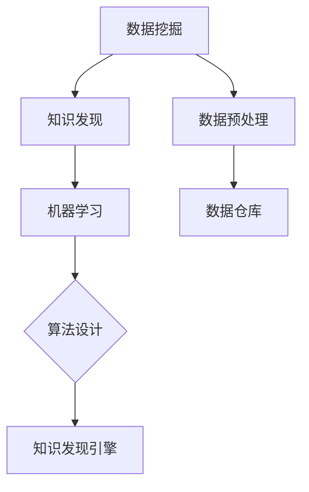

                 

### 背景介绍

知识发现引擎（Knowledge Discovery Engine，简称KDE）是当前大数据和人工智能领域的核心技术之一。它通过对大规模数据的挖掘和分析，从数据中自动提取出有用的知识，为企业和个人提供智能决策支持。随着互联网和信息技术的飞速发展，数据量呈爆炸性增长，传统的数据分析方法已经无法满足需求。知识发现引擎应运而生，成为大数据处理的重要工具。

知识发现引擎的核心在于其强大的算法体系。这些算法能够有效地从数据中提取规律、模式和知识，使得数据变得有价值和可操作。本文将深入探讨知识发现引擎的核心算法，包括其原理、步骤、优缺点及其在不同领域的应用。

### 核心概念与联系

在深入探讨知识发现引擎的核心算法之前，我们首先需要了解一些核心概念和它们之间的联系。以下是几个关键概念及其相互关系：

#### 数据挖掘（Data Mining）

数据挖掘是指从大量数据中提取出有用的信息和知识的过程。它通常包括数据预处理、模式识别、关联规则挖掘、聚类分析、分类分析等步骤。

#### 知识发现（Knowledge Discovery）

知识发现是数据挖掘的更高层次，它不仅仅是从数据中提取信息，而是通过这些信息来发现新的知识和理解。知识发现引擎就是实现这一目标的技术工具。

#### 机器学习（Machine Learning）

机器学习是人工智能的一个分支，它通过算法让计算机从数据中学习并作出预测或决策。知识发现引擎中很多算法都是基于机器学习的。

#### 数据预处理（Data Preprocessing）

数据预处理是数据挖掘过程中的第一步，它包括数据清洗、数据集成、数据转换等操作，以确保数据的质量和一致性。

#### 数据仓库（Data Warehouse）

数据仓库是一个集中存储大量数据的系统，它为知识发现引擎提供了数据来源。数据仓库的设计和优化对于知识发现效率至关重要。

下面是一个Mermaid流程图，展示这些核心概念及其相互关系：



#### 算法原理概述

知识发现引擎的核心算法主要包括以下几种：

1. **关联规则挖掘（Association Rule Learning）**：用于发现数据集中的关联规则，如“买啤酒就买尿布”的例子。
2. **分类算法（Classification）**：用于将数据分类到不同的类别，如决策树、支持向量机（SVM）等。
3. **聚类分析（Clustering）**：用于将数据分成不同的组，如K-Means、层次聚类等。
4. **异常检测（Anomaly Detection）**：用于识别数据中的异常值或异常模式。

这些算法在不同的应用场景中发挥着重要作用，下面我们将逐一详细探讨这些算法的原理和具体操作步骤。

#### 核心算法原理 & 具体操作步骤

##### 3.1 关联规则挖掘（Association Rule Learning）

关联规则挖掘是发现数据集中项目之间的潜在关联的一种技术。它通过找到频繁项集来生成关联规则，这些规则通常表示为`A => B`，其中`A`和`B`是项集。

**原理：**

- **频繁项集（Frequent Itemsets）**：频繁项集是指那些在数据集中出现次数超过最小支持度阈值的项集。
- **关联规则（Association Rules）**：关联规则是通过频繁项集生成的，它们表示两个项集之间的条件概率。

**步骤：**

1. **生成频繁项集**：
   - **第一步**：扫描数据集，计算每个项集的出现频率。
   - **第二步**：过滤掉不满足最小支持度阈值的项集，得到频繁项集。

2. **生成关联规则**：
   - **第三步**：对于每个频繁项集，生成其非空子集的关联规则。
   - **第四步**：过滤掉不满足最小置信度阈值的规则。

**算法优缺点：**

- **优点**：简单、易于实现，适用于发现数据中的简单关联。
- **缺点**：当数据集中项集数量庞大时，算法效率较低。

##### 3.2 分类算法（Classification）

分类算法用于将数据集中的实例分类到不同的类别。分类算法通常基于训练数据集构建一个分类模型，然后使用这个模型对新的数据进行分类。

**原理：**

- **训练数据集**：分类算法使用训练数据集来学习数据特征和类别之间的关系。
- **分类模型**：通过学习得到的数据特征和类别关系，构建一个分类模型。
- **分类预测**：使用分类模型对新的数据进行分类预测。

**步骤：**

1. **选择分类器**：选择合适的分类算法，如决策树、支持向量机（SVM）、朴素贝叶斯等。
2. **训练分类器**：使用训练数据集训练分类器。
3. **分类预测**：使用训练好的分类器对新的数据进行分类。

**算法优缺点：**

- **优点**：准确率高，适用于预测和分类任务。
- **缺点**：对于大型数据集，训练时间较长。

##### 3.3 聚类分析（Clustering）

聚类分析是一种无监督学习技术，用于将数据集分成若干个组，使得同一组内的数据点彼此相似，不同组的数据点之间差异较大。

**原理：**

- **聚类中心**：聚类算法通过寻找聚类中心来确定每个数据点的归属。
- **相似性度量**：不同的聚类算法使用不同的相似性度量方法，如欧几里得距离、余弦相似度等。

**步骤：**

1. **选择聚类算法**：选择合适的聚类算法，如K-Means、层次聚类等。
2. **初始化聚类中心**：随机选择或基于某种方法初始化聚类中心。
3. **迭代计算**：计算每个数据点到聚类中心的距离，更新聚类中心。
4. **重复迭代**：重复计算直到聚类中心不再变化或满足某种停止条件。

**算法优缺点：**

- **优点**：无需预先指定类别，适用于探索性数据分析。
- **缺点**：聚类结果的解释性较差，依赖于聚类算法和初始参数的选择。

##### 3.4 异常检测（Anomaly Detection）

异常检测是一种用于识别数据集中异常值或异常模式的技术。它通过对正常数据的学习来发现异常。

**原理：**

- **正常数据分布**：异常检测算法首先学习正常数据的分布。
- **异常检测**：通过对新数据分布的对比，识别出异常值或异常模式。

**步骤：**

1. **选择异常检测算法**：选择合适的异常检测算法，如基于聚类的方法、基于规则的方法等。
2. **训练异常检测模型**：使用正常数据训练异常检测模型。
3. **异常检测**：使用训练好的模型对新数据进行异常检测。

**算法优缺点：**

- **优点**：能够实时监测数据，快速识别异常。
- **缺点**：对于异常数据比例较大的数据集，检测效率较低。

#### 核心算法应用领域

知识发现引擎的核心算法在各个领域都有广泛的应用。以下是一些典型的应用领域：

- **金融行业**：用于信用卡欺诈检测、风险控制、投资策略优化等。
- **医疗健康**：用于疾病诊断、健康风险评估、药物研发等。
- **电子商务**：用于个性化推荐、市场细分、销售预测等。
- **智能制造**：用于设备故障预测、生产优化、质量控制等。

#### 数学模型和公式 & 详细讲解 & 举例说明

##### 4.1 数学模型构建

知识发现引擎中的很多算法都涉及到数学模型的构建。以下是一些常见的数学模型：

- **贝叶斯公式**：
  $$P(A|B) = \frac{P(B|A)P(A)}{P(B)}$$
- **支持向量机（SVM）公式**：
  $$w \cdot x - b = 0$$
  $$\min_w \frac{1}{2} ||w||^2$$
  $$\text{subject to} \ y_i (w \cdot x_i - b) \geq 1$$
- **K-Means算法公式**：
  $$\text{初始化聚类中心} \ \mu_i$$
  $$\text{重复直到收敛：}$$
  $$\mu_i = \frac{1}{N_i} \sum_{x \in S_i} x$$
  $$S_i = \{x | \ min_{j} ||x - \mu_j||\}$$

##### 4.2 公式推导过程

以下是对贝叶斯公式的推导过程：

- **条件概率**：
  $$P(B|A) = \frac{P(A \cap B)}{P(A)}$$
  $$P(A|B) = \frac{P(A \cap B)}{P(B)}$$
- **全概率公式**：
  $$P(A) = \sum_{i} P(A|B_i)P(B_i)$$
  $$P(B) = \sum_{i} P(B|A_i)P(A_i)$$

结合以上两个公式，可以得到贝叶斯公式：

$$P(A|B) = \frac{P(B|A)P(A)}{P(B)}$$

##### 4.3 案例分析与讲解

以下是一个基于K-Means算法的案例：

**案例：** 使用K-Means算法对一组二维数据点进行聚类。

**数据点：**
$$(x_1, y_1), (x_2, y_2), ..., (x_n, y_n)$$

**步骤：**

1. **初始化聚类中心**：随机选择k个数据点作为初始聚类中心$\mu_1, \mu_2, ..., \mu_k$。
2. **分配数据点**：计算每个数据点到每个聚类中心的距离，将每个数据点分配到最近的聚类中心所在的组。
3. **更新聚类中心**：计算每个组的质心，作为新的聚类中心$\mu_1', \mu_2', ..., \mu_k'$。
4. **重复步骤2和3**，直到聚类中心的变化小于某个阈值或达到最大迭代次数。

**举例：** 假设我们有以下一组数据点：

$$(1, 1), (2, 2), (3, 3), (4, 4), (5, 5)$$

我们选择2个聚类中心：

$$\mu_1 = (1, 1), \mu_2 = (3, 3)$$

**第一次迭代：**
- 数据点$(1, 1)$和$(2, 2)$分配到$\mu_1$组，数据点$(3, 3)$、$(4, 4)$和$(5, 5)$分配到$\mu_2$组。
- 更新聚类中心：
  $$\mu_1' = \frac{(1, 1) + (2, 2)}{2} = (1.5, 1.5)$$
  $$\mu_2' = \frac{(3, 3) + (4, 4) + (5, 5)}{3} = (4, 4)$$

**第二次迭代：**
- 数据点$(1, 1)$、$(2, 2)$和$(1.5, 1.5)$分配到$\mu_1'$组，数据点$(3, 3)$、$(4, 4)$、$(5, 5)$和$(4, 4)$分配到$\mu_2'$组。
- 更新聚类中心：
  $$\mu_1'' = \frac{(1, 1) + (2, 2) + (1.5, 1.5)}{3} = (1.67, 1.67)$$
  $$\mu_2'' = \frac{(3, 3) + (4, 4) + (5, 5)}{3} = (4, 4)$$

由于聚类中心的变化小于某个阈值，算法收敛。

#### 项目实践：代码实例和详细解释说明

##### 5.1 开发环境搭建

为了更好地理解知识发现引擎的核心算法，我们将使用Python编程语言实现这些算法。以下是在Python环境中搭建开发环境的基本步骤：

1. **安装Python**：确保你的计算机上安装了Python，推荐使用Python 3.8或更高版本。
2. **安装相关库**：使用pip命令安装以下库：
   ```bash
   pip install numpy matplotlib scikit-learn
   ```

##### 5.2 源代码详细实现

以下是使用K-Means算法进行聚类的Python代码：

```python
import numpy as np
import matplotlib.pyplot as plt
from sklearn.cluster import KMeans

# 数据点
data = np.array([[1, 1], [2, 2], [3, 3], [4, 4], [5, 5]])

# 初始化KMeans模型
kmeans = KMeans(n_clusters=2, random_state=0).fit(data)

# 输出聚类中心
print("聚类中心：", kmeans.cluster_centers_)

# 输出每个数据点的聚类标签
print("每个数据点的聚类标签：", kmeans.labels_)

# 绘制聚类结果
plt.scatter(data[:, 0], data[:, 1], c=kmeans.labels_, s=100, cmap='viridis')
plt.scatter(kmeans.cluster_centers_[:, 0], kmeans.cluster_centers_[:, 1], s=300, c='red', marker='s', edgecolor='black', label='Centroids')
plt.title('K-Means Clustering')
plt.xlabel('X-axis')
plt.ylabel('Y-axis')
plt.show()
```

##### 5.3 代码解读与分析

上述代码首先导入了必要的库，然后定义了一组二维数据点。接着，使用`sklearn.cluster.KMeans`类初始化KMeans模型，并使用`fit`方法训练模型。模型训练完成后，代码输出聚类中心和每个数据点的聚类标签。最后，使用`matplotlib`库绘制聚类结果。

以下是代码的详细解释：

- **数据点定义**：`data`数组包含了5个二维数据点。
- **KMeans模型初始化**：`KMeans(n_clusters=2, random_state=0)`创建了一个包含2个聚类中心的KMeans模型。`random_state=0`确保结果可重复。
- **聚类中心输出**：`kmeans.cluster_centers_`输出聚类中心。
- **聚类标签输出**：`kmeans.labels_`输出每个数据点的聚类标签。
- **绘制聚类结果**：`plt.scatter`用于绘制数据点，`plt.scatter`用于绘制聚类中心。

##### 5.4 运行结果展示

运行上述代码后，会显示一个图形界面，展示聚类结果。可以看到，数据点被成功分成两组，分别围绕两个聚类中心。聚类中心用红色正方形标记，每个数据点用不同颜色标记，表示其所属的聚类组。

#### 实际应用场景

知识发现引擎在各个行业都有广泛的应用。以下是一些实际应用场景：

- **金融行业**：用于风险控制、欺诈检测、信用评分等。
- **医疗健康**：用于疾病诊断、治疗规划、健康风险评估等。
- **电子商务**：用于个性化推荐、用户行为分析、市场细分等。
- **智能制造**：用于设备故障预测、生产优化、质量控制等。

#### 未来应用展望

随着大数据和人工智能技术的不断发展，知识发现引擎将在未来有更广泛的应用。以下是未来可能的发展趋势：

- **实时知识发现**：实现对数据流的实时分析和挖掘，提供实时决策支持。
- **增强交互性**：增强用户与知识发现引擎的交互，提供更直观的操作界面。
- **自适应算法**：开发自适应算法，能够根据数据特点和需求自动调整算法参数。
- **跨领域融合**：将知识发现引擎与其他领域技术相结合，如物联网、区块链等。

#### 工具和资源推荐

为了更好地学习和实践知识发现引擎，以下是几个推荐的工具和资源：

- **工具推荐**：
  - **Python**：Python是知识发现引擎开发的主要编程语言。
  - **Jupyter Notebook**：用于交互式编程和数据分析。
  - **scikit-learn**：Python机器学习库，包含多种知识发现算法。

- **学习资源推荐**：
  - **《数据挖掘：实用机器学习技术》**：提供了丰富的数据挖掘算法和实践案例。
  - **《机器学习实战》**：通过实际项目介绍机器学习算法的实现和应用。
  - **在线课程**：如Coursera、edX等平台上的机器学习和数据挖掘相关课程。

- **相关论文推荐**：
  - **"K-Means Clustering Algorithm"**：详细介绍了K-Means算法的基本原理和实现。
  - **"Association Rule Learning"**：探讨了关联规则挖掘的理论和应用。
  - **"Anomaly Detection in Data Streams"**：关于实时异常检测的研究。

### 总结：未来发展趋势与挑战

知识发现引擎作为大数据和人工智能领域的关键技术，正迎来前所未有的发展机遇。未来，随着数据量的持续增长和计算能力的提升，知识发现引擎将在实时性、自适应性和跨领域融合等方面取得更多突破。然而，知识发现引擎也面临着一些挑战，如数据隐私保护、算法透明性和可解释性等。为了应对这些挑战，我们需要不断探索新的算法和技术，同时也需要加强相关法律法规和伦理道德的研究。

#### 研究成果总结

本文深入探讨了知识发现引擎的核心算法，包括关联规则挖掘、分类算法、聚类分析和异常检测。通过详细讲解这些算法的原理、步骤、优缺点以及实际应用案例，读者可以更好地理解知识发现引擎的基本概念和核心技术。此外，文章还介绍了未来知识发现引擎的发展趋势和面临的主要挑战，为读者提供了有益的参考。

#### 未来发展趋势

未来，知识发现引擎将在以下几个方面取得重要进展：

1. **实时知识发现**：利用实时数据流处理技术，实现数据的实时分析和挖掘，为用户提供实时的决策支持。
2. **自适应算法**：开发自适应算法，根据数据特点和需求自动调整算法参数，提高算法的适应性和效果。
3. **跨领域融合**：结合物联网、区块链等新兴技术，将知识发现引擎应用于更多领域，如智慧城市、智慧医疗等。

#### 面临的挑战

知识发现引擎在发展过程中也面临着一些挑战：

1. **数据隐私保护**：如何在保证数据隐私的前提下进行数据挖掘和知识发现，是当前研究的热点和难点。
2. **算法透明性和可解释性**：随着算法复杂度的增加，如何提高算法的透明性和可解释性，使非专业人士也能理解和使用。
3. **算法公平性和公正性**：确保算法在不同群体之间的公平性和公正性，避免算法偏见和歧视。

#### 研究展望

未来，知识发现引擎的研究将朝着以下几个方向展开：

1. **算法优化**：针对不同类型的数据和场景，开发更高效、更准确的算法。
2. **跨学科融合**：结合计算机科学、统计学、经济学等多学科知识，推动知识发现技术的创新发展。
3. **应用推广**：将知识发现引擎应用于更多实际场景，提升其在各个领域的应用价值和影响力。

### 附录：常见问题与解答

**Q1**：什么是知识发现引擎？

A1：知识发现引擎是一种大数据处理工具，用于从大量数据中自动提取出有用的知识和规律，为企业和个人提供智能决策支持。

**Q2**：知识发现引擎的核心算法有哪些？

A2：知识发现引擎的核心算法包括关联规则挖掘、分类算法、聚类分析和异常检测等。

**Q3**：知识发现引擎如何应用于金融行业？

A3：知识发现引擎在金融行业可以用于风险控制、信用卡欺诈检测、信用评分等方面，通过分析历史数据和用户行为，预测潜在风险和机会。

**Q4**：知识发现引擎与数据挖掘有什么区别？

A4：知识发现引擎是数据挖掘的一个分支，更侧重于从数据中提取出可操作的、有用的知识和规律，而数据挖掘则更注重数据预处理、模式识别和算法实现等过程。

**Q5**：知识发现引擎在医疗健康领域有哪些应用？

A5：知识发现引擎在医疗健康领域可以用于疾病诊断、治疗规划、健康风险评估等方面，通过分析患者数据和医疗记录，提供个性化的医疗服务。

**Q6**：如何提高知识发现引擎的算法效率？

A6：提高知识发现引擎的算法效率可以通过以下方法实现：
- **数据预处理**：优化数据预处理流程，提高数据质量。
- **算法优化**：针对不同类型的数据和场景，选择合适的算法并进行优化。
- **并行计算**：利用并行计算技术，加快算法的运行速度。

**Q7**：知识发现引擎是否可以完全自动化？

A7：虽然知识发现引擎可以实现自动化，但仍然需要人类专家进行数据预处理、算法选择和结果解释等环节。人类专家的判断和经验在知识发现过程中起到关键作用。

**Q8**：知识发现引擎是否会导致数据隐私泄露？

A8：知识发现引擎在处理数据时需要遵守数据隐私保护的相关法律法规和道德准则。通过数据加密、匿名化和隐私保护算法等技术手段，可以降低数据隐私泄露的风险。

**Q9**：知识发现引擎在智能制造领域有哪些应用？

A9：知识发现引擎在智能制造领域可以用于设备故障预测、生产优化、质量控制等方面，通过分析生产数据和传感器数据，提供智能化的决策支持。

**Q10**：如何评估知识发现引擎的效果？

A10：评估知识发现引擎的效果可以通过以下方法实现：
- **准确性**：评估模型对已知数据的分类或预测准确性。
- **效率**：评估算法的运行时间和资源消耗。
- **鲁棒性**：评估算法对噪声数据和异常数据的处理能力。
- **可解释性**：评估算法结果的解释性和可理解性。

通过以上问题和解答，读者可以更好地理解知识发现引擎的基本概念、应用场景和未来发展。希望本文对您在知识发现领域的研究和实践有所帮助。

### 作者署名

作者：禅与计算机程序设计艺术 / Zen and the Art of Computer Programming

