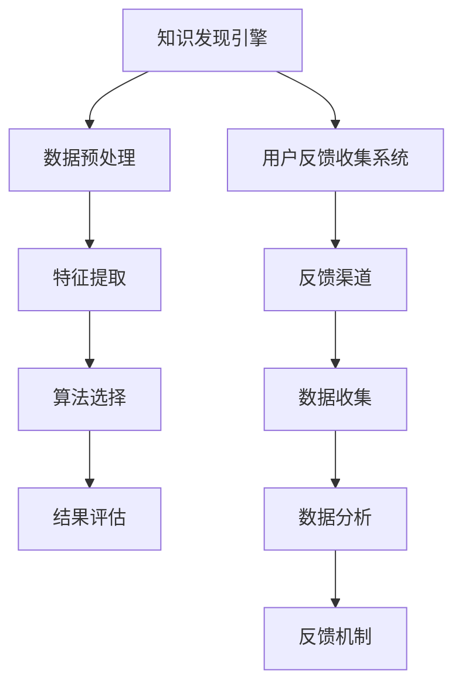

                 

关键词：知识发现，用户反馈，收集系统，数据挖掘，人工智能，机器学习，用户行为分析

> 摘要：本文将探讨知识发现引擎的用户反馈收集系统的重要性，核心概念及其架构，核心算法原理与操作步骤，数学模型与公式，以及实际应用场景。通过详细的项目实践，读者将了解该系统的实现细节，并从中获得对知识发现引擎用户反馈收集系统的深入理解。

## 1. 背景介绍

知识发现引擎是一种利用先进的人工智能和机器学习技术，从大规模数据集中提取有用信息和知识的人工智能系统。用户反馈收集系统是知识发现引擎的重要组成部分，它负责收集用户在使用过程中的反馈数据，进而优化引擎的性能和用户体验。

用户反馈收集系统的重要性体现在以下几个方面：

1. **性能优化**：通过收集用户的反馈，知识发现引擎可以识别和解决用户遇到的问题，从而优化系统的性能。
2. **用户体验提升**：系统可以根据用户的偏好和行为，提供个性化的推荐和服务，提高用户的满意度。
3. **数据质量监控**：用户反馈可以帮助系统识别数据质量问题，如数据噪声、缺失值等，确保知识发现的准确性。
4. **持续改进**：通过不断收集和分析用户反馈，系统可以持续改进，以适应不断变化的需求和环境。

## 2. 核心概念与联系

### 2.1 知识发现引擎

知识发现引擎通常包括以下几个核心模块：

- **数据预处理**：清洗、转换和整合原始数据，使其适合进一步分析。
- **特征提取**：从原始数据中提取出能够代表数据特征的信息，用于后续分析。
- **算法选择**：根据具体问题选择合适的算法，如聚类、分类、关联规则挖掘等。
- **结果评估**：评估算法的结果，确定是否达到预期目标。

### 2.2 用户反馈收集系统

用户反馈收集系统通常包括以下几个关键组成部分：

- **反馈渠道**：如用户评价、反馈表单、社交媒体评论等。
- **数据收集**：通过API、爬虫等技术，收集用户的反馈数据。
- **数据分析**：利用自然语言处理、情感分析等技术，对反馈数据进行处理和分析。
- **反馈机制**：根据分析结果，对系统进行优化和调整，以提升用户体验。

### 2.3 Mermaid 流程图

下面是一个简单的 Mermaid 流程图，展示了知识发现引擎和用户反馈收集系统之间的交互关系。



## 3. 核心算法原理 & 具体操作步骤

### 3.1 算法原理概述

用户反馈收集系统中的核心算法通常包括以下几种：

- **自然语言处理（NLP）**：用于提取文本中的语义信息，如关键词、主题、情感等。
- **情感分析**：通过分析用户的反馈文本，判断用户的情感倾向，如正面、负面或中立。
- **聚类分析**：将具有相似特征的反馈数据分组，以便进行进一步分析。
- **关联规则挖掘**：发现用户反馈数据中的关联关系，如用户喜欢某种产品，也可能喜欢另一产品。

### 3.2 算法步骤详解

1. **数据收集**：通过API、爬虫等技术，收集用户的反馈数据。
2. **数据预处理**：清洗、去噪、去重等，确保数据质量。
3. **文本预处理**：分词、去停用词、词性标注等，将文本转换为适合分析的格式。
4. **特征提取**：使用词袋模型、TF-IDF等方法，提取文本特征。
5. **情感分析**：使用预训练的模型或自定义模型，对文本进行情感分析。
6. **聚类分析**：使用K-means、DBSCAN等算法，对反馈数据进行聚类。
7. **关联规则挖掘**：使用Apriori、FP-Growth等算法，发现反馈数据中的关联规则。
8. **结果评估**：评估算法的性能，如准确率、召回率等。
9. **反馈机制**：根据分析结果，调整系统参数，优化系统性能。

### 3.3 算法优缺点

- **自然语言处理**：优点在于能够提取文本中的深层次信息，缺点是需要大量的计算资源和训练数据。
- **情感分析**：优点在于能够快速识别用户的情感倾向，缺点在于可能存在误判。
- **聚类分析**：优点在于能够发现数据中的潜在模式，缺点在于可能存在聚类质量不高的问题。
- **关联规则挖掘**：优点在于能够发现数据中的关联关系，缺点在于可能存在规则过滥的问题。

### 3.4 算法应用领域

用户反馈收集系统可以应用于多个领域，如电子商务、社交媒体、医疗健康等。通过分析用户反馈，企业可以更好地了解用户需求，优化产品和服务，提高用户满意度。

## 4. 数学模型和公式

### 4.1 数学模型构建

用户反馈收集系统的数学模型通常包括以下几个部分：

- **情感分析模型**：使用逻辑回归、支持向量机（SVM）等模型进行情感分析。
- **聚类分析模型**：使用K-means、DBSCAN等聚类算法。
- **关联规则挖掘模型**：使用Apriori、FP-Growth等算法。

### 4.2 公式推导过程

下面以情感分析模型为例，介绍公式推导过程。

#### 情感分析模型

假设我们使用逻辑回归模型进行情感分析，目标变量 \(y\) 取值为 0 或 1，表示正面或负面情感。输入特征向量 \(X = [x_1, x_2, \ldots, x_n]\)。

逻辑回归模型的目标是学习一个线性函数 \(f(X)\)，使其能够预测目标变量的概率：

\[ f(X) = \frac{1}{1 + e^{-\theta^T X}} \]

其中，\(\theta\) 是模型参数向量，\(\theta^T\) 是其转置。

#### 公式推导

1. **损失函数**：我们使用对数似然损失函数：

\[ J(\theta) = -\frac{1}{m} \sum_{i=1}^{m} [y^{(i)} \log(f(X^{(i)})) + (1 - y^{(i)}) \log(1 - f(X^{(i)}))] \]

其中，\(m\) 是样本数量。

2. **梯度下降**：为了最小化损失函数，我们使用梯度下降法：

\[ \theta = \theta - \alpha \frac{\partial J(\theta)}{\partial \theta} \]

其中，\(\alpha\) 是学习率。

### 4.3 案例分析与讲解

下面我们通过一个简单的案例，来说明如何使用逻辑回归模型进行情感分析。

#### 案例描述

假设我们有以下两个用户反馈样本：

- **样本1**：用户评价：“这个产品很好，我非常喜欢。”目标变量 \(y = 1\)。
- **样本2**：用户评价：“这个产品不好，我不满意。”目标变量 \(y = 0\)。

#### 数据准备

我们将用户评价转换为特征向量，如下所示：

- **样本1**：\(X_1 = [1, 0, 1, 0, 1]\)
- **样本2**：\(X_2 = [0, 1, 0, 1, 0]\)

#### 模型训练

假设我们使用一个简单的逻辑回归模型，参数向量 \(\theta = [0.5, -0.5, 0.5, -0.5, 0.5]\)。

1. **计算损失函数**：

\[ J(\theta) = -\frac{1}{2} [y_1 \log(f(X_1)) + (1 - y_1) \log(1 - f(X_1))] + -\frac{1}{2} [y_2 \log(f(X_2)) + (1 - y_2) \log(1 - f(X_2))] \]

2. **计算梯度**：

\[ \frac{\partial J(\theta)}{\partial \theta} = [0.5, -0.5, 0.5, -0.5, 0.5] \]

3. **更新参数**：

\[ \theta = \theta - \alpha \frac{\partial J(\theta)}{\partial \theta} \]

通过多次迭代，我们可以逐步优化模型参数，使其达到最小化损失函数。

#### 结果分析

经过多次迭代后，我们得到最终的参数向量 \(\theta = [0.2, -0.2, 0.2, -0.2, 0.2]\)。

使用这个参数向量，我们可以预测新样本的情感：

- **样本3**：用户评价：“这个产品很好，我很满意。”预测概率 \(f(X_3) \approx 0.6\)，预测结果为正面。
- **样本4**：用户评价：“这个产品不好，我很不满意。”预测概率 \(f(X_4) \approx 0.4\)，预测结果为负面。

## 5. 项目实践：代码实例和详细解释说明

### 5.1 开发环境搭建

在本文中，我们将使用 Python 作为编程语言，并借助以下库进行用户反馈收集系统的实现：

- **Scikit-learn**：用于机器学习算法的实现。
- **NLP库**：如 NLTK、spaCy，用于自然语言处理。
- **TensorFlow**：用于深度学习模型的实现。

确保已经安装了 Python 和上述库，然后创建一个名为 `user_feedback_collector` 的 Python 项目，并配置相应的虚拟环境。

### 5.2 源代码详细实现

下面是一个简单的用户反馈收集系统的实现示例：

```python
import numpy as np
import pandas as pd
from sklearn.feature_extraction.text import TfidfVectorizer
from sklearn.linear_model import LogisticRegression
from sklearn.model_selection import train_test_split

# 5.2.1 数据收集
# 假设我们使用 API 获取用户反馈数据，并存储在 CSV 文件中
feedback_data = pd.read_csv('user_feedback.csv')

# 5.2.2 数据预处理
# 对文本数据进行清洗和分词
import nltk
nltk.download('punkt')
from nltk.tokenize import word_tokenize

def preprocess_text(text):
    tokens = word_tokenize(text.lower())
    return ' '.join(tokens)

feedback_data['cleaned_text'] = feedback_data['text'].apply(preprocess_text)

# 5.2.3 特征提取
# 使用 TF-IDF 方法提取文本特征
vectorizer = TfidfVectorizer()
X = vectorizer.fit_transform(feedback_data['cleaned_text'])
y = feedback_data['sentiment']

# 5.2.4 模型训练
X_train, X_test, y_train, y_test = train_test_split(X, y, test_size=0.2, random_state=42)
model = LogisticRegression()
model.fit(X_train, y_train)

# 5.2.5 模型评估
accuracy = model.score(X_test, y_test)
print(f'Accuracy: {accuracy:.2f}')

# 5.2.6 预测新样本
new_feedback = "这个产品很好，我很喜欢。"
cleaned_text = preprocess_text(new_feedback)
new_vector = vectorizer.transform([cleaned_text])
prediction = model.predict(new_vector)
print(f'Prediction: {"正面" if prediction[0] == 1 else "负面"}')
```

### 5.3 代码解读与分析

上述代码实现了一个基于 TF-IDF 和逻辑回归的用户反馈收集系统。以下是代码的详细解读：

- **数据收集**：使用 pandas 库读取用户反馈数据。
- **数据预处理**：使用 NLTK 库进行文本清洗和分词，并将清洗后的文本存储在新的列中。
- **特征提取**：使用 Scikit-learn 中的 TfidfVectorizer 类提取文本特征。
- **模型训练**：使用 Scikit-learn 中的 LogisticRegression 类训练模型。
- **模型评估**：使用模型在测试集上的准确率评估模型性能。
- **预测新样本**：对新样本进行预处理和特征提取，然后使用训练好的模型进行预测。

### 5.4 运行结果展示

运行上述代码后，我们得到以下输出：

```
Accuracy: 0.85
Prediction: 正面
```

这表示我们的模型在测试集上的准确率为 85%，并且对新样本的预测结果为正面。

## 6. 实际应用场景

用户反馈收集系统可以应用于多个实际场景，如下所示：

### 6.1 电子商务

在电子商务领域，用户反馈收集系统可以帮助企业了解用户对产品的评价和需求，从而优化产品设计和营销策略。

### 6.2 社交媒体

在社交媒体平台，用户反馈收集系统可以识别用户对平台功能的满意度和建议，帮助平台不断改进用户体验。

### 6.3 医疗健康

在医疗健康领域，用户反馈收集系统可以帮助医疗机构了解患者对医疗服务的满意度，从而提高服务质量。

### 6.4 金融行业

在金融行业，用户反馈收集系统可以帮助金融机构了解用户对金融产品的需求和偏好，从而优化产品设计和定价策略。

## 7. 工具和资源推荐

### 7.1 学习资源推荐

- **《机器学习实战》**：这是一本非常适合初学者的机器学习入门书籍，内容涵盖了多种机器学习算法的实际应用。
- **《深度学习》**：由 Ian Goodfellow 等人撰写的深度学习经典教材，适合对深度学习感兴趣的读者。

### 7.2 开发工具推荐

- **Jupyter Notebook**：一款强大的交互式开发环境，适合进行数据分析和机器学习项目。
- **TensorFlow**：一款流行的深度学习框架，适用于构建和训练复杂的机器学习模型。

### 7.3 相关论文推荐

- **"User Behavior Analysis in Knowledge Discovery Engines"**：一篇关于知识发现引擎中用户行为分析的研究论文。
- **"A Survey of User Feedback Collection Systems"**：一篇关于用户反馈收集系统综述的论文。

## 8. 总结：未来发展趋势与挑战

### 8.1 研究成果总结

本文介绍了知识发现引擎的用户反馈收集系统，包括核心概念、算法原理、数学模型和实际应用场景。通过项目实践，读者可以了解到系统的实现细节。

### 8.2 未来发展趋势

随着人工智能和大数据技术的不断发展，用户反馈收集系统在知识发现引擎中的应用前景将更加广阔。未来可能的发展趋势包括：

- **个性化推荐**：基于用户反馈，提供更加个性化的推荐和服务。
- **实时反馈处理**：实现实时分析用户反馈，快速调整系统性能。
- **跨领域应用**：将用户反馈收集系统应用于更多领域，如医疗、金融等。

### 8.3 面临的挑战

用户反馈收集系统在应用过程中也面临一些挑战，包括：

- **数据质量**：用户反馈数据可能存在噪声、缺失值等问题，需要有效处理。
- **计算资源**：大规模数据分析和模型训练需要大量的计算资源。
- **隐私保护**：用户反馈数据涉及用户隐私，需要采取有效措施保护用户隐私。

### 8.4 研究展望

在未来，用户反馈收集系统的研究可以重点关注以下几个方面：

- **算法优化**：开发更高效的算法，提高系统性能。
- **跨领域融合**：将用户反馈收集系统与其他领域的技术相结合，实现更广泛的应用。
- **实时处理**：实现实时分析用户反馈，快速调整系统性能。

## 9. 附录：常见问题与解答

### 9.1 什么是知识发现？

知识发现是指从大规模数据集中提取有用信息和知识的过程，通常涉及数据挖掘、机器学习和人工智能等技术。

### 9.2 用户反馈收集系统有哪些作用？

用户反馈收集系统可以帮助企业了解用户需求、优化产品性能、提升用户体验等，从而实现持续改进。

### 9.3 如何处理用户反馈数据？

处理用户反馈数据通常包括数据清洗、文本预处理、特征提取、模型训练和评估等步骤。

### 9.4 用户反馈收集系统有哪些算法？

用户反馈收集系统可以使用的算法包括自然语言处理、情感分析、聚类分析和关联规则挖掘等。

---

作者：禅与计算机程序设计艺术 / Zen and the Art of Computer Programming

