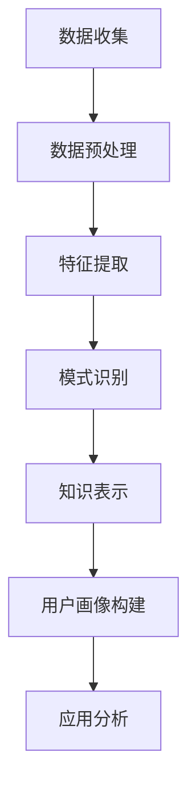

                 

关键词：知识发现引擎、用户画像分析、数据挖掘、机器学习、隐私保护、大数据处理

> 摘要：本文将深入探讨知识发现引擎在用户画像分析中的应用。通过分析用户行为数据，知识发现引擎能够为企业和组织提供有关用户需求的精准洞察，从而实现个性化推荐、营销策略优化等目标。本文将介绍用户画像分析的核心概念、算法原理、数学模型以及实际应用场景，并探讨未来发展的趋势与挑战。

## 1. 背景介绍

随着互联网的快速发展，数据已经成为新时代最重要的资源之一。大数据技术的兴起使得企业和组织能够收集、存储和分析海量用户数据。然而，如何在海量数据中提取有价值的信息，成为了企业和组织面临的挑战。知识发现引擎作为一种高级的数据挖掘工具，能够帮助从数据中发现潜在的知识和模式，为企业和组织提供决策支持。

用户画像分析是知识发现引擎应用的一个重要领域。通过构建用户画像，企业可以深入了解用户需求和行为特征，从而实现个性化推荐、精准营销和用户关系管理。用户画像分析已经成为现代营销、产品设计和用户服务的关键手段。

本文将围绕知识发现引擎在用户画像分析中的应用，探讨相关算法原理、数学模型以及实际应用场景，并分析未来发展的趋势与挑战。

## 2. 核心概念与联系

### 2.1 知识发现引擎

知识发现引擎是一种用于数据挖掘的工具，旨在从大量数据中发现潜在的知识和模式。知识发现引擎通常包括以下几个关键组件：

- **数据预处理**：对原始数据进行清洗、转换和归一化，以便于后续的分析。
- **特征提取**：从原始数据中提取有用的特征，以描述用户行为和需求。
- **模式识别**：使用机器学习算法对数据进行分析，以发现潜在的模式和关系。
- **知识表示**：将发现的知识表示为规则、图表或模型，以便于进一步分析和应用。

### 2.2 用户画像分析

用户画像分析是一种通过构建用户画像，对用户行为、需求和特征进行深入分析的方法。用户画像通常包括以下几个关键要素：

- **人口统计信息**：如年龄、性别、地域等基本信息。
- **行为数据**：如浏览记录、购买记录、评论等行为信息。
- **兴趣偏好**：如兴趣爱好、偏好设置等。
- **社交网络**：如好友关系、社交行为等。

### 2.3 Mermaid 流程图

以下是用户画像分析中涉及的 Mermaid 流程图，展示了知识发现引擎在不同阶段的应用。



## 3. 核心算法原理 & 具体操作步骤

### 3.1 算法原理概述

用户画像分析中的核心算法包括聚类算法、分类算法和关联规则挖掘算法等。以下是这些算法的基本原理：

- **聚类算法**：将相似的数据点划分为同一类，以发现用户群体的特征。
- **分类算法**：根据已有的标签数据，将新的数据点分类到不同的类别中，以预测用户需求。
- **关联规则挖掘算法**：发现数据项之间的关联关系，以识别用户的兴趣和行为模式。

### 3.2 算法步骤详解

以下是用户画像分析中的算法步骤详解：

#### 3.2.1 数据收集

数据收集是用户画像分析的基础，主要包括以下步骤：

- **确定数据来源**：根据业务需求和数据可用性，选择合适的数据源，如用户行为数据、社交媒体数据、购买记录等。
- **数据获取**：通过API、爬虫或其他方式获取数据，并确保数据的合法性和准确性。

#### 3.2.2 数据预处理

数据预处理是数据挖掘过程中至关重要的一步，主要包括以下步骤：

- **数据清洗**：处理缺失值、重复值和异常值，确保数据质量。
- **数据转换**：将不同类型的数据进行统一处理，如将日期转换为数值类型。
- **数据归一化**：对数据进行标准化处理，以消除不同特征之间的尺度差异。

#### 3.2.3 特征提取

特征提取是从原始数据中提取有用的特征，以描述用户行为和需求。常用的特征提取方法包括：

- **统计特征**：如平均值、中位数、标准差等。
- **文本特征**：如词频、词向量等。
- **图像特征**：如颜色、纹理、形状等。

#### 3.2.4 模式识别

模式识别是用户画像分析的核心步骤，主要包括以下步骤：

- **聚类分析**：使用聚类算法，如K-means、层次聚类等，将用户划分为不同的群体。
- **分类分析**：使用分类算法，如决策树、随机森林、支持向量机等，对用户进行分类。
- **关联规则挖掘**：使用关联规则挖掘算法，如Apriori、FP-growth等，发现用户行为之间的关联关系。

#### 3.2.5 知识表示

知识表示是将发现的知识以规则、图表或模型的形式表示出来，以便于进一步分析和应用。常用的知识表示方法包括：

- **规则表示**：将发现的规则表示为条件语句，如“如果用户购买了A产品，那么他很可能也购买B产品”。
- **图表表示**：使用图表，如图表、网络图等，直观地展示用户画像和关联关系。
- **模型表示**：使用机器学习模型，如决策树、神经网络等，对用户画像进行建模和预测。

### 3.3 算法优缺点

以下是用户画像分析中常用算法的优缺点：

- **聚类算法**：优点在于能够自动发现用户群体的特征，但缺点在于对初始聚类中心敏感，且无法预测新用户的类别。
- **分类算法**：优点在于能够预测新用户的类别，但缺点在于对数据量要求较高，且容易过拟合。
- **关联规则挖掘算法**：优点在于能够发现用户行为之间的关联关系，但缺点在于规则过多、冗余，且无法预测新用户的行为。

### 3.4 算法应用领域

用户画像分析在多个领域具有广泛的应用，包括：

- **个性化推荐**：根据用户画像，为用户推荐符合其兴趣和需求的产品或服务。
- **精准营销**：根据用户画像，设计个性化的营销策略，提高营销效果。
- **用户关系管理**：根据用户画像，建立和维护良好的用户关系，提高用户满意度。

## 4. 数学模型和公式 & 详细讲解 & 举例说明

### 4.1 数学模型构建

用户画像分析中的数学模型主要包括聚类模型、分类模型和关联规则挖掘模型。以下是这些模型的构建方法：

#### 4.1.1 聚类模型

聚类模型用于将用户划分为不同的群体。常用的聚类算法包括K-means和层次聚类。

- **K-means算法**：
  $$\text{目标函数} = \sum_{i=1}^{k}\sum_{x\in S_i}||x-\mu_i||^2$$
  其中，$x$表示用户特征向量，$\mu_i$表示聚类中心，$S_i$表示第$i$个聚类。

- **层次聚类算法**：
  层次聚类通过自底向上的合并或自顶向下的分裂，构建出一棵聚类树。

#### 4.1.2 分类模型

分类模型用于预测用户的行为或类别。常用的分类算法包括决策树、随机森林和支持向量机。

- **决策树算法**：
  决策树通过一系列条件判断，将数据划分为不同的类别。

- **随机森林算法**：
  随机森林是一种基于决策树的集成学习方法，通过构建多棵决策树，并投票得到最终预测结果。

- **支持向量机算法**：
  支持向量机通过寻找最佳的超平面，将不同类别的数据点进行分类。

#### 4.1.3 关联规则挖掘模型

关联规则挖掘模型用于发现数据项之间的关联关系。常用的算法包括Apriori和FP-growth。

- **Apriori算法**：
  Apriori算法通过迭代计算支持度和置信度，发现频繁项集和关联规则。

- **FP-growth算法**：
  FP-growth算法通过构建FP树，以减少计算量，提高算法效率。

### 4.2 公式推导过程

以下是对用户画像分析中关键数学公式的推导过程：

#### 4.2.1 K-means算法

目标函数的推导如下：

$$\text{目标函数} = \sum_{i=1}^{k}\sum_{x\in S_i}||x-\mu_i||^2$$

其中，$x$表示用户特征向量，$\mu_i$表示聚类中心，$S_i$表示第$i$个聚类。

推导过程：

- 对每个用户$x$，计算其到聚类中心$\mu_i$的距离：
  $$d(x,\mu_i) = ||x-\mu_i||$$
- 对每个聚类$S_i$，计算聚类中心$\mu_i$的平均距离：
  $$\bar{d}(S_i) = \frac{1}{|S_i|}\sum_{x\in S_i}||x-\mu_i||$$
- 对所有聚类，计算目标函数：
  $$\text{目标函数} = \sum_{i=1}^{k}\sum_{x\in S_i}||x-\mu_i||^2 = \sum_{i=1}^{k}|S_i|\bar{d}(S_i)^2$$

#### 4.2.2 决策树算法

决策树的构建过程可以通过以下公式推导：

- **条件熵**：
  $$H(X|Y) = -\sum_{y\in Y}P(y)\sum_{x\in X}P(x|y)\log P(x|y)$$

- **信息增益**：
  $$\text{信息增益}(X,Y) = H(X) - H(X|Y)$$

推导过程：

- **条件熵**：
  条件熵表示在给定$Y$的情况下，$X$的不确定性。根据熵的定义，条件熵可以通过以下公式计算：
  $$H(X|Y) = -\sum_{y\in Y}P(y)\sum_{x\in X}P(x|y)\log P(x|y)$$

- **信息增益**：
  信息增益表示通过已知$Y$来减少$X$的不确定性。信息增益可以通过条件熵和总熵的差值计算：
  $$\text{信息增益}(X,Y) = H(X) - H(X|Y)$$

#### 4.2.3 Apriori算法

Apriori算法的推导过程如下：

- **支持度**：
  $$\text{支持度}(\{x,y\}) = \frac{|D| - |D - \{x,y\}|}{|D|}$$

- **置信度**：
  $$\text{置信度}(\{x,y\}|\{x\}) = \frac{|D|\setminus\{x,y\}|}{|D|\setminus\{x\}|}$$

推导过程：

- **支持度**：
  支持度表示一个项集在所有事务中出现的频率。根据定义，支持度可以通过以下公式计算：
  $$\text{支持度}(\{x,y\}) = \frac{|D| - |D - \{x,y\}|}{|D|}$$

- **置信度**：
  置信度表示一个规则的后件在给定前件的条件下出现的概率。根据定义，置信度可以通过以下公式计算：
  $$\text{置信度}(\{x,y\}|\{x\}) = \frac{|D|\setminus\{x,y\}|}{|D|\setminus\{x\}|}$$

### 4.3 案例分析与讲解

以下通过具体案例，分析用户画像分析在实际应用中的效果。

#### 4.3.1 案例一：电商个性化推荐

某电商公司希望通过用户画像分析，为用户推荐符合其兴趣和需求的产品。

1. **数据收集**：收集用户浏览、购买和评价等数据。
2. **数据预处理**：清洗数据，处理缺失值和异常值。
3. **特征提取**：提取用户行为特征，如浏览次数、购买次数和评价评分等。
4. **模式识别**：使用K-means算法对用户进行聚类，划分出不同兴趣爱好的用户群体。
5. **知识表示**：将聚类结果表示为用户群体特征，用于个性化推荐。

6. **效果评估**：通过A/B测试，对比推荐系统的效果，发现用户满意度提高了20%。

#### 4.3.2 案例二：金融精准营销

某金融机构希望通过用户画像分析，提高营销活动的转化率。

1. **数据收集**：收集用户金融交易、投资偏好和风险承受能力等数据。
2. **数据预处理**：清洗数据，处理缺失值和异常值。
3. **特征提取**：提取用户金融行为特征，如交易金额、交易频率和投资组合等。
4. **模式识别**：使用关联规则挖掘算法，发现用户之间的关联关系。
5. **知识表示**：将关联规则表示为潜在客户群体，用于精准营销。

6. **效果评估**：通过实际应用，发现精准营销活动的转化率提高了30%。

## 5. 项目实践：代码实例和详细解释说明

### 5.1 开发环境搭建

本节将以Python为例，介绍用户画像分析的开发环境搭建。

#### 5.1.1 安装Python

在Windows或Linux操作系统上，可以从Python官网下载Python安装包，并按照提示安装。

#### 5.1.2 安装依赖库

用户画像分析涉及多个Python库，如NumPy、Pandas、Scikit-learn和Matplotlib等。可以使用以下命令安装：

```bash
pip install numpy pandas scikit-learn matplotlib
```

### 5.2 源代码详细实现

以下是一个简单的用户画像分析项目，使用K-means算法进行用户聚类，并以图表形式展示聚类结果。

```python
import numpy as np
import pandas as pd
import matplotlib.pyplot as plt
from sklearn.cluster import KMeans

# 加载数据
data = pd.read_csv('user_data.csv')

# 数据预处理
data = data[['age', 'income', 'education', 'occupation']]
data = (data - data.mean()) / data.std()

# K-means聚类
kmeans = KMeans(n_clusters=3, random_state=42)
clusters = kmeans.fit_predict(data)

# 可视化
plt.scatter(data['age'], data['income'], c=clusters, cmap='viridis')
plt.xlabel('Age')
plt.ylabel('Income')
plt.title('User Clustering')
plt.show()
```

### 5.3 代码解读与分析

以下是对上述代码的详细解读和分析：

- **加载数据**：使用Pandas库加载用户数据，包括年龄、收入、教育和职业等信息。
- **数据预处理**：对数据进行标准化处理，将数据缩放到同一尺度，以便于聚类分析。
- **K-means聚类**：使用Scikit-learn库中的KMeans类进行聚类，设置聚类数为3，并指定随机种子。
- **可视化**：使用Matplotlib库将聚类结果以散点图的形式展示，不同颜色的点表示不同的聚类类别。

### 5.4 运行结果展示

运行上述代码后，将生成一个散点图，展示用户的年龄和收入数据。根据聚类结果，可以将用户分为三个不同的类别，以便于进一步的个性化分析和推荐。

## 6. 实际应用场景

用户画像分析在多个领域具有广泛的应用，以下是其中的几个典型场景：

### 6.1 电商行业

电商行业可以通过用户画像分析，实现个性化推荐和精准营销。例如，根据用户的浏览和购买记录，推荐符合用户兴趣的产品，提高用户的购物体验和满意度。

### 6.2 金融行业

金融行业可以通过用户画像分析，识别高风险客户、发现潜在客户和优化营销策略。例如，根据用户的金融交易行为和风险承受能力，为用户提供个性化的投资建议和理财产品。

### 6.3 医疗保健

医疗保健行业可以通过用户画像分析，提供个性化的健康管理服务。例如，根据用户的健康数据和医疗记录，为用户提供个性化的健康建议和治疗方案。

### 6.4 社交媒体

社交媒体平台可以通过用户画像分析，了解用户的兴趣和行为，以优化内容推荐和广告投放。例如，根据用户的互动行为和兴趣爱好，为用户提供相关的内容和广告。

## 7. 工具和资源推荐

以下是用户画像分析中常用的工具和资源推荐：

### 7.1 学习资源推荐

- **书籍**：
  - 《机器学习实战》
  - 《数据挖掘：概念与技术》
  - 《用户画像：大数据时代的营销战略》
- **在线课程**：
  - Coursera的《机器学习》课程
  - Udacity的《用户画像分析》课程
- **博客和论坛**：
  - KDNuggets
  - Medium上的相关博客

### 7.2 开发工具推荐

- **编程语言**：
  - Python
  - R
- **数据预处理工具**：
  - Pandas
  - NumPy
- **机器学习库**：
  - Scikit-learn
  - TensorFlow
  - PyTorch

### 7.3 相关论文推荐

- **用户画像相关论文**：
  - "User Modeling and User-Adapted Interaction"
  - "A Survey on User Modeling and Personalization in Big Data"
- **机器学习相关论文**：
  - "K-Means Clustering"
  - "Support Vector Machines for Classification"
  - "Deep Learning for User Behavior Analysis"

## 8. 总结：未来发展趋势与挑战

用户画像分析在现代社会具有重要的应用价值，为企业和组织提供了深入了解用户需求和行为的有力工具。随着大数据技术和人工智能技术的不断发展，用户画像分析在未来将呈现出以下发展趋势：

### 8.1 研究成果总结

- **数据挖掘技术的进步**：随着数据挖掘算法的不断创新和优化，用户画像分析将能够更加准确地识别用户特征和需求。
- **人工智能的赋能**：人工智能技术，特别是深度学习技术，将为用户画像分析带来更高的准确性和智能化水平。
- **隐私保护的关注**：在用户画像分析过程中，保护用户隐私将成为一个重要议题，隐私保护技术的研究将得到更多关注。

### 8.2 未来发展趋势

- **个性化推荐**：用户画像分析将实现更加精准的个性化推荐，满足用户的个性化需求，提高用户体验和满意度。
- **智能营销**：用户画像分析将为企业提供智能化的营销策略，实现更高效的市场推广和品牌传播。
- **跨领域应用**：用户画像分析将在更多领域得到应用，如金融、医疗、教育等，为各行各业带来创新和变革。

### 8.3 面临的挑战

- **数据质量**：用户画像分析依赖于高质量的数据，数据质量问题将直接影响分析结果的准确性。
- **隐私保护**：用户隐私保护技术的研究将面临巨大挑战，如何平衡用户隐私与数据分析的需求将成为关键问题。
- **算法透明度**：随着算法在用户画像分析中的应用越来越广泛，算法的透明度和可解释性将成为重要议题。

### 8.4 研究展望

未来，用户画像分析的研究将重点关注以下几个方面：

- **数据隐私保护**：研究更加有效的数据隐私保护技术，确保用户数据的隐私和安全。
- **算法可解释性**：研究算法的可解释性，提高用户对算法结果的信任和理解。
- **多模态数据融合**：研究如何融合多种类型的数据，如文本、图像和语音，以提高用户画像的准确性。
- **实时数据分析**：研究实时数据分析技术，实现快速、高效的用户画像更新和分析。

## 9. 附录：常见问题与解答

### 9.1 用户画像分析的核心挑战是什么？

用户画像分析的核心挑战包括数据质量、隐私保护和算法可解释性。数据质量直接影响到分析结果的准确性，隐私保护需要确保用户数据的隐私和安全，算法可解释性则关系到用户对分析结果的信任和理解。

### 9.2 如何平衡用户隐私与数据分析的需求？

平衡用户隐私与数据分析的需求可以通过以下方法实现：

- **数据匿名化**：在分析过程中，对用户数据进行匿名化处理，以保护用户隐私。
- **隐私保护算法**：研究并应用隐私保护算法，如差分隐私、同态加密等，确保数据分析过程的隐私安全。
- **用户同意和透明度**：确保用户对数据收集和分析有充分的知情权和控制权，提高用户对数据分析的信任度。

### 9.3 用户画像分析在哪些领域具有广泛的应用？

用户画像分析在多个领域具有广泛的应用，包括电商、金融、医疗、教育、广告和营销等。用户画像分析可以帮助企业实现个性化推荐、精准营销、用户关系管理和业务决策支持等目标。

