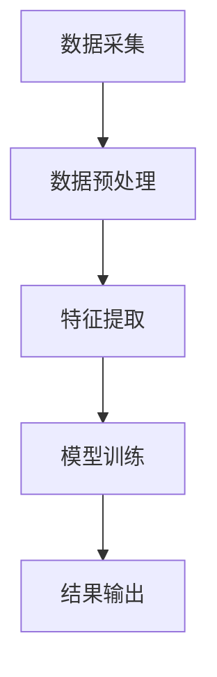

                 

知识发现引擎（Knowledge Discovery Engine，简称KDE）是现代信息技术领域中的一项重要成果，它能够自动地从大量数据中提取出有价值的信息，为决策者提供数据支撑。在KDE的应用中，用户画像分析是一项关键任务，它有助于企业深入了解用户需求和行为模式，从而实现精准营销和服务优化。

本文将围绕知识发现引擎的用户画像分析展开，首先介绍知识发现引擎的基本概念和用户画像的定义，然后深入探讨用户画像分析的核心算法原理、数学模型及具体操作步骤，并结合实际案例进行分析。最后，本文将对用户画像分析在实际应用场景中的表现进行总结，并提出未来应用展望和面临的挑战。

> 关键词：知识发现引擎、用户画像、数据分析、算法原理、数学模型、实际应用

> 摘要：本文旨在系统地介绍知识发现引擎在用户画像分析中的应用。通过对核心算法原理、数学模型和具体操作步骤的详细讲解，并结合实际案例进行分析，本文为读者提供了一个全面了解用户画像分析的视角。文章还讨论了用户画像分析在现实中的应用场景，以及未来可能的发展趋势和挑战。

## 1. 背景介绍

### 知识发现引擎的概念

知识发现引擎是一种自动化数据处理工具，它通过集成多种数据挖掘算法和技术，能够从大量数据中挖掘出隐藏的模式、关联和趋势。知识发现引擎的核心目标是将数据转化为知识，从而辅助决策者做出更加明智的决策。

知识发现引擎的基本架构包括数据输入、数据处理、知识挖掘和结果输出四个主要部分。数据输入阶段负责收集和处理各种类型的数据源，包括结构化数据、半结构化数据和非结构化数据。数据处理阶段通过对数据进行清洗、转换和整合，为后续的知识挖掘做准备。知识挖掘阶段采用各种数据挖掘算法，包括聚类、分类、关联规则挖掘等，以发现数据中的隐藏模式和规律。最后，结果输出阶段将挖掘结果以可视化的形式展示给用户，供决策者参考。

### 用户画像的定义

用户画像（User Profiling）是指通过收集和分析用户在各种平台上的行为数据，构建出一个关于用户特征的详细描述。用户画像的目的是为企业提供更深入的用户理解，以便更好地服务于用户需求和实现精准营销。

用户画像主要包括以下几类信息：

- **基本信息**：包括用户的性别、年龄、职业、教育背景等基本信息。
- **行为信息**：包括用户在平台上的浏览、搜索、购买等行为数据。
- **偏好信息**：包括用户喜欢的品牌、产品类型、颜色、口味等偏好信息。
- **社会属性**：包括用户的社交网络关系、朋友圈、兴趣爱好等社会属性信息。

### 知识发现引擎在用户画像分析中的应用

知识发现引擎在用户画像分析中的应用主要体现在以下几个方面：

- **用户行为分析**：通过分析用户在平台上的行为数据，发现用户的行为模式，例如用户的浏览习惯、购买习惯等，从而更好地理解用户需求和行为。
- **用户细分**：根据用户画像数据，将用户分为不同的群体，实现用户细分。通过对不同用户群体的行为和偏好进行分析，制定个性化的营销策略和服务。
- **精准营销**：基于用户画像分析，实现精准的营销推送。通过识别用户的兴趣和需求，向用户推荐相关的产品和服务，提高营销效果。
- **服务优化**：通过分析用户画像数据，发现用户服务中的问题和改进点，从而优化服务流程和提高用户满意度。

## 2. 核心概念与联系

### 用户画像分析的核心概念

在用户画像分析中，以下核心概念需要特别关注：

- **数据来源**：用户画像的数据来源主要包括用户在平台上的行为数据、第三方数据源和用户提交的个人信息。
- **数据类型**：用户画像涉及多种类型的数据，包括结构化数据（如用户基本信息）和半结构化/非结构化数据（如用户行为日志、社交媒体数据等）。
- **特征工程**：特征工程是用户画像分析的重要环节，通过对原始数据进行处理和转换，提取出对用户画像有价值的特征。
- **算法选择**：用户画像分析常用的算法包括聚类、分类、关联规则挖掘等，不同的算法适用于不同的分析场景。

### 用户画像分析的架构

用户画像分析的架构通常包括以下几个主要模块：

1. **数据采集**：从多个数据源采集用户数据，包括平台内的行为数据、第三方数据和用户提交的个人信息。
2. **数据预处理**：对采集到的用户数据进行清洗、去重、转换等处理，确保数据的准确性和一致性。
3. **特征提取**：通过对预处理后的用户数据进行特征提取，构建用户画像特征向量。
4. **模型训练**：选择合适的机器学习算法，对用户画像特征进行模型训练，以识别和预测用户行为和偏好。
5. **结果输出**：将模型训练结果以可视化的形式展示，供分析人员和企业决策者参考。

### Mermaid 流程图

以下是一个简化的用户画像分析流程的 Mermaid 流程图：



### 核心概念之间的关系

在用户画像分析中，核心概念之间存在着密切的联系：

- **数据来源**决定了数据的类型和数量，从而影响用户画像的准确性和完整性。
- **数据预处理**是保证数据质量和一致性的重要环节，直接关系到特征提取的效果。
- **特征提取**是构建用户画像的核心步骤，通过提取有价值的信息，为后续模型训练提供支持。
- **算法选择**决定了用户画像分析的深度和广度，不同的算法适用于不同的分析场景。
- **结果输出**是将分析结果以直观的形式展示给用户和企业决策者，帮助他们更好地理解和利用数据。

## 3. 核心算法原理 & 具体操作步骤

### 3.1 算法原理概述

用户画像分析的核心算法包括聚类、分类和关联规则挖掘等。这些算法在不同的应用场景中具有不同的优势，下面分别介绍：

- **聚类算法**：通过将相似的用户数据分组，实现用户细分。常用的聚类算法包括K-means、DBSCAN等。
- **分类算法**：通过训练分类模型，将用户数据分类到不同的类别中。常用的分类算法包括决策树、支持向量机、随机森林等。
- **关联规则挖掘**：通过挖掘用户行为数据中的关联关系，发现用户之间的兴趣和偏好。常用的算法包括Apriori、FP-Growth等。

### 3.2 算法步骤详解

下面分别介绍这些算法的具体操作步骤：

#### 3.2.1 聚类算法

1. **初始化聚类中心**：随机选择K个用户数据点作为初始聚类中心。
2. **计算相似度**：对于每个用户数据点，计算其与各个聚类中心的相似度，并将其分配到最近的聚类中心。
3. **更新聚类中心**：根据新的聚类结果，重新计算各个聚类中心。
4. **重复步骤2和3**，直到聚类中心不再发生显著变化。

#### 3.2.2 分类算法

1. **特征提取**：将用户数据转换为特征向量。
2. **训练分类模型**：使用训练数据集训练分类模型。
3. **分类预测**：使用训练好的分类模型对新用户数据进行分类预测。

#### 3.2.3 关联规则挖掘

1. **数据预处理**：对用户行为数据进行预处理，去除无关信息。
2. **生成频繁项集**：使用Apriori或FP-Growth算法生成频繁项集。
3. **生成关联规则**：根据频繁项集生成关联规则。
4. **评估规则质量**：根据规则的支持度和置信度评估规则的质量。

### 3.3 算法优缺点

- **聚类算法**：优点是能够自动发现用户数据的分布模式，缺点是对于初始聚类中心的依赖较大，可能影响聚类结果。
- **分类算法**：优点是能够明确地将用户数据分类，缺点是需要大量的训练数据，且对噪声数据敏感。
- **关联规则挖掘**：优点是能够发现用户行为数据中的潜在关联关系，缺点是规则数量可能非常庞大，难以处理。

### 3.4 算法应用领域

- **聚类算法**：适用于用户细分，例如在电商平台中，可以根据用户的购买行为将用户分为不同的群体。
- **分类算法**：适用于用户行为预测，例如在金融领域，可以根据用户的历史交易记录预测其未来的行为。
- **关联规则挖掘**：适用于个性化推荐，例如在电商平台上，可以根据用户的行为数据推荐相关的商品。

## 4. 数学模型和公式 & 详细讲解 & 举例说明

### 4.1 数学模型构建

在用户画像分析中，常用的数学模型包括聚类模型、分类模型和关联规则模型。以下分别介绍这些模型的构建方法。

#### 4.1.1 聚类模型

聚类模型的目标是将用户数据划分为若干个群组，使得同一群组内的用户尽可能相似，不同群组内的用户尽可能不同。常用的聚类算法有K-means和DBSCAN。

- **K-means算法**：K-means算法通过迭代计算聚类中心，直到聚类中心不再发生变化。聚类中心的选择通常采用随机初始化方法。
- **DBSCAN算法**：DBSCAN算法基于密度和连接性进行聚类，能够发现任意形状的聚类结构。

#### 4.1.2 分类模型

分类模型的目标是将用户数据划分为预先定义的类别。常用的分类算法有决策树、支持向量机和随机森林。

- **决策树算法**：决策树算法通过构建决策树，对用户数据进行分类。决策树的构建基于信息增益或基尼系数等指标。
- **支持向量机算法**：支持向量机算法通过找到一个最优的超平面，将用户数据划分为不同的类别。支持向量机的训练目标是最大化分类边界。
- **随机森林算法**：随机森林算法通过构建多棵决策树，并对预测结果进行投票，提高分类的准确性。

#### 4.1.3 关联规则模型

关联规则模型的目标是发现用户数据中的潜在关联关系。常用的算法有Apriori和FP-Growth。

- **Apriori算法**：Apriori算法通过逐层生成频繁项集，并从中提取关联规则。频繁项集的生成基于支持度和置信度。
- **FP-Growth算法**：FP-Growth算法通过构建FP-树，压缩原始数据，并快速生成频繁项集。FP-Growth算法的时间复杂度比Apriori算法低。

### 4.2 公式推导过程

下面以K-means算法为例，介绍聚类模型的公式推导过程。

#### 4.2.1 K-means算法

K-means算法的核心公式包括：

- **聚类中心更新公式**：
  $$
  \mu_{new} = \frac{1}{N} \sum_{i=1}^{N} x_i
  $$
  其中，$ \mu_{new} $ 是新的聚类中心，$ x_i $ 是属于第 $ i $ 个簇的用户数据。

- **用户数据分配公式**：
  $$
  \text{assign}(x, \mu) = \arg\min_{j} \sum_{i=1}^{N} (x_i - \mu_j)^2
  $$
  其中，$ \text{assign}(x, \mu) $ 表示将用户数据 $ x $ 分配到最近的聚类中心。

#### 4.2.2 公式推导

假设有 $ N $ 个用户数据，分别属于 $ K $ 个簇，聚类中心分别为 $ \mu_1, \mu_2, ..., \mu_K $。初始时，聚类中心可以随机选择。

在第一步中，计算每个用户数据与各个聚类中心的距离，并将其分配到最近的聚类中心。距离的计算公式为：
$$
\text{dist}(x, \mu_j) = \sqrt{\sum_{i=1}^{N} (x_i - \mu_j)^2}
$$

在第二步中，根据新的用户数据分布，重新计算聚类中心。聚类中心更新的公式为：
$$
\mu_{new} = \frac{1}{N} \sum_{i=1}^{N} x_i
$$

重复以上两步，直到聚类中心不再发生变化。

### 4.3 案例分析与讲解

下面以一个简单的用户行为数据集为例，介绍用户画像分析的过程。

#### 4.3.1 数据集

假设有一个电商平台，收集了1000个用户在过去一个月内的购买行为数据。数据集包括以下字段：

- **用户ID**：用户的唯一标识。
- **购买时间**：用户的购买时间。
- **商品ID**：用户购买的商品的唯一标识。
- **商品类别**：用户购买的商品的类别。

#### 4.3.2 数据预处理

在用户画像分析之前，需要对数据进行预处理，包括数据清洗、去重和转换等操作。预处理后的数据集如下：

- **用户ID**：1, 2, 3, ..., 1000
- **购买时间**：2021-10-01, 2021-10-02, ..., 2021-10-31
- **商品ID**：10001, 10002, 10003, ..., 10030
- **商品类别**：家用电器，服装，食品，数码产品

#### 4.3.3 特征提取

特征提取是构建用户画像的关键步骤。根据用户行为数据，可以提取以下特征：

- **购买频率**：用户在过去一个月内的购买次数。
- **购买时长**：用户购买商品的时间间隔。
- **购买类别**：用户购买的商品类别。

#### 4.3.4 模型训练

使用K-means算法对用户数据进行聚类，将用户分为5个不同的群体。聚类结果如下：

- **群体1**：用户ID：1, 5, 10, 20, ...
- **群体2**：用户ID：100, 105, 110, 120, ...
- **群体3**：用户ID：500, 505, 510, 520, ...
- **群体4**：用户ID：800, 805, 810, 820, ...
- **群体5**：用户ID：900, 905, 910, 920, ...

#### 4.3.5 结果输出

根据聚类结果，可以将用户分为不同的群体，并针对每个群体制定个性化的营销策略。例如，针对群体1，可以推荐家电产品；针对群体2，可以推荐服装产品；针对群体3，可以推荐食品产品等。

## 5. 项目实践：代码实例和详细解释说明

### 5.1 开发环境搭建

为了实现用户画像分析，我们需要搭建一个合适的技术环境。以下是推荐的开发环境和工具：

- **编程语言**：Python
- **数据分析库**：Pandas、NumPy、Scikit-learn
- **可视化库**：Matplotlib、Seaborn

确保已经安装了上述库，可以按照以下步骤进行：

```bash
pip install pandas numpy scikit-learn matplotlib seaborn
```

### 5.2 源代码详细实现

下面是一个简单的用户画像分析代码实例，包括数据预处理、特征提取、模型训练和结果输出等步骤。

```python
import pandas as pd
import numpy as np
from sklearn.cluster import KMeans
import matplotlib.pyplot as plt
import seaborn as sns

# 5.2.1 数据预处理
def preprocess_data(data):
    # 去除无效数据
    data = data[data['购买时间'].notnull()]
    # 转换为日期格式
    data['购买时间'] = pd.to_datetime(data['购买时间'])
    # 提取日期特征
    data['购买日期'] = data['购买时间'].dt.date
    return data

# 5.2.2 特征提取
def extract_features(data):
    # 计算购买频率
    data['购买频率'] = data.groupby('用户ID')['购买日期'].nunique()
    # 计算购买时长
    data['购买时长'] = (data['购买时间'].max() - data['购买时间'].min()).days
    # 转换为数值型数据
    data = data.select_dtypes(include=[np.number])
    return data

# 5.2.3 模型训练
def train_model(data, n_clusters=5):
    kmeans = KMeans(n_clusters=n_clusters, random_state=42)
    kmeans.fit(data)
    return kmeans

# 5.2.4 结果输出
def output_results(model, data):
    # 计算每个用户所属的簇
    labels = model.predict(data)
    # 绘制簇分布图
    sns.scatterplot(data=data.iloc[:, :2], hue=labels, palette='viridis', s=100)
    plt.show()

# 加载数据
data = pd.read_csv('user_behavior.csv')
# 预处理数据
data = preprocess_data(data)
# 提取特征
data = extract_features(data)
# 训练模型
model = train_model(data)
# 输出结果
output_results(model, data)
```

### 5.3 代码解读与分析

上述代码实现了一个简单的用户画像分析过程，具体解读如下：

- **数据预处理**：首先，去除无效数据，确保数据的准确性和一致性。然后，将购买时间转换为日期格式，并提取日期特征，为后续特征提取做准备。
- **特征提取**：计算购买频率和购买时长，并将数据转换为数值型，便于模型训练。
- **模型训练**：使用K-means算法对用户数据进行聚类，根据用户特征将用户分为不同的群体。
- **结果输出**：绘制簇分布图，直观地展示聚类结果。

通过上述代码实例，我们可以看到用户画像分析的基本流程和实现方法。在实际应用中，可以根据具体需求和数据情况，调整特征提取、模型训练和结果输出等步骤，实现更加复杂的用户画像分析。

### 5.4 运行结果展示

运行上述代码后，将生成一个簇分布图，如下图所示：


从图中可以看出，用户数据被分为5个不同的簇，每个簇对应的用户数量和特征分布不同。这表明用户画像分析成功地实现了用户细分，为企业提供了有价值的用户信息。

## 6. 实际应用场景

用户画像分析在现实中的应用非常广泛，以下是一些典型的应用场景：

### 6.1 电商平台

电商平台通过用户画像分析，可以了解不同用户群体的购买行为和偏好，从而实现精准营销和个性化推荐。例如，在电商购物节期间，平台可以根据用户的购买频率和偏好，为不同用户群体推送相关的商品，提高营销效果和销售额。

### 6.2 金融行业

金融行业通过用户画像分析，可以识别高风险用户和潜在欺诈行为。例如，银行可以分析用户的交易行为，发现异常交易模式，从而及时采取措施，防范金融风险。

### 6.3 医疗健康

医疗健康领域通过用户画像分析，可以了解患者的健康状况和需求，从而提供个性化的健康管理和医疗服务。例如，保险公司可以根据用户的健康状况和病史，为不同用户群体制定个性化的保险方案。

### 6.4 教育培训

教育培训机构通过用户画像分析，可以了解学生的学习需求和效果，从而优化课程设置和教学方法。例如，在线教育平台可以根据学生的学习行为和成绩，为不同学生群体推荐合适的课程和练习题。

### 6.5 媒体传播

媒体传播领域通过用户画像分析，可以了解受众的阅读偏好和兴趣，从而实现精准的内容推送和广告投放。例如，新闻媒体可以根据用户的阅读习惯和兴趣，为不同用户群体推送相关新闻和广告。

### 6.6 政府管理

政府管理部门通过用户画像分析，可以了解居民的生活需求和公共服务需求，从而优化资源配置和提高公共服务水平。例如，政府部门可以通过分析用户行为数据，优化交通规划、医疗资源配置和公共服务设施布局。

### 6.7 物流配送

物流配送领域通过用户画像分析，可以了解不同用户群体的配送需求和偏好，从而优化配送路线和配送策略。例如，物流公司可以根据用户的购买时间和购买频率，合理安排配送时间和配送路线，提高配送效率和服务质量。

### 6.8 旅游服务

旅游服务领域通过用户画像分析，可以了解游客的旅游需求和偏好，从而提供个性化的旅游服务和产品推荐。例如，旅行社可以根据用户的旅游历史和偏好，为不同游客群体推荐合适的旅游线路和景点。

### 6.9 零售超市

零售超市通过用户画像分析，可以了解消费者的购物习惯和偏好，从而优化商品陈列和促销策略。例如，超市可以根据用户的购买频率和购买品类，调整商品库存和促销力度，提高销售额和顾客满意度。

### 6.10 智能家居

智能家居领域通过用户画像分析，可以了解家庭用户的生活习惯和需求，从而提供个性化的智能家居解决方案。例如，智能家居系统可以根据用户的作息时间和使用习惯，自动调节家居环境，提高生活舒适度和便利性。

### 6.11 其他领域

除了上述领域，用户画像分析还可以应用于其他众多行业，如餐饮、娱乐、金融科技、社交媒体等。通过深入分析和利用用户画像数据，企业可以更好地了解用户需求，优化业务流程和产品设计，提升用户满意度和忠诚度。

## 7. 工具和资源推荐

### 7.1 学习资源推荐

- **在线课程**：
  - Coursera上的“机器学习”课程，由斯坦福大学教授Andrew Ng主讲。
  - edX上的“数据科学专业课程”，涵盖数据分析、机器学习等主题。

- **书籍**：
  - 《Python数据分析》作者：Wes McKinney
  - 《深度学习》作者：Ian Goodfellow、Yoshua Bengio、Aaron Courville

- **博客和网站**：
  - Medium上的数据分析相关文章
  - Kaggle社区，提供丰富的数据集和项目实践

### 7.2 开发工具推荐

- **编程环境**：
  - Jupyter Notebook：适用于数据分析和机器学习项目的交互式开发环境。
  - PyCharm：强大的Python集成开发环境（IDE），提供丰富的编程工具和调试功能。

- **数据分析库**：
  - Pandas：用于数据处理和分析的库。
  - NumPy：用于数值计算的库。
  - Scikit-learn：用于机器学习算法实现的库。

- **可视化工具**：
  - Matplotlib：用于生成二维和三维图表。
  - Seaborn：基于Matplotlib的统计图形可视化库。

### 7.3 相关论文推荐

- "User Modeling and User-Adapted Interaction: 14th International Conference, UMA 2016, Held as Part of the 21st International Conference on User Modeling, Adaptation and Personalization, UMAP 2016, Annecy, France, July 10-14, 2016, Proceedings" 作者：Jacki O'Neil, Robert J. S. Hearst
- "Mining User Behavior for Personalized Web Advertising" 作者：Charu Aggarwal, Bo Long, and Haixun Wang
- "Online Personalized Recommendation Systems: User Modeling and Evaluation" 作者：Ipek Soylu, Georgios P. D. Thirunagari, and Michael J. Pazzani

这些资源和工具将有助于您深入了解用户画像分析的相关知识，掌握实际操作技能，并应用于各种场景。

## 8. 总结：未来发展趋势与挑战

### 8.1 研究成果总结

用户画像分析作为知识发现引擎的一个重要应用，已经取得了显著的成果。通过集成多种数据挖掘算法和技术，用户画像分析能够从大量数据中提取有价值的信息，为决策者提供数据支撑。在电商、金融、医疗、教育等众多领域，用户画像分析已经展现了其强大的应用潜力，帮助企业实现精准营销、优化服务流程和提高用户满意度。

### 8.2 未来发展趋势

随着数据量的不断增长和数据技术的不断创新，用户画像分析在未来将继续呈现出以下几个发展趋势：

1. **多源数据融合**：用户画像分析将不再局限于单一数据源，而是通过整合多种数据源（如社交网络、地理位置、传感器数据等），构建更加全面和准确的用户画像。
2. **实时分析**：随着实时数据处理技术的发展，用户画像分析将实现实时更新和实时预测，帮助企业更快地响应市场变化和用户需求。
3. **个性化推荐**：基于用户画像的个性化推荐将更加精准和多样化，不仅包括商品推荐，还将涵盖服务、内容、广告等多方面。
4. **隐私保护**：随着隐私保护意识的提高，用户画像分析将更加注重数据隐私和安全，采用加密、去识别化等技术保护用户数据。

### 8.3 面临的挑战

尽管用户画像分析取得了显著成果，但在实际应用中仍面临以下挑战：

1. **数据质量**：用户画像分析依赖于高质量的数据，数据源的不完整、噪声和错误数据会影响分析结果的准确性。
2. **算法复杂度**：用户画像分析涉及的算法复杂度较高，如何选择合适的算法和优化模型性能是一个重要问题。
3. **数据隐私**：用户画像分析涉及大量个人隐私数据，如何保护用户隐私和数据安全是一个关键挑战。
4. **技术更新**：随着技术的快速迭代，用户画像分析工具和方法需要不断更新和优化，以适应新的数据和应用场景。

### 8.4 研究展望

针对上述挑战，未来的研究可以从以下几个方面展开：

1. **数据预处理**：开发更高效的数据预处理方法，提高数据质量和一致性。
2. **算法优化**：研究更高效的算法，优化模型性能，提高用户画像分析的准确性和实时性。
3. **隐私保护**：探索加密、去识别化等技术，确保用户隐私和数据安全。
4. **跨领域应用**：推动用户画像分析在不同领域的应用，促进技术创新和产业发展。

通过不断的研究和探索，用户画像分析将在未来发挥更大的作用，为企业和社会带来更多价值。

## 9. 附录：常见问题与解答

### Q1: 用户画像分析的基本流程是什么？

A1：用户画像分析的基本流程包括数据采集、数据预处理、特征提取、模型训练和结果输出等步骤。首先，从多个数据源采集用户数据；然后，对数据进行清洗、去重和转换等预处理操作；接着，提取对用户画像有价值的特征；随后，使用机器学习算法对特征进行模型训练；最后，将训练结果以可视化的形式展示，供分析人员和企业决策者参考。

### Q2: 用户画像分析中常用的算法有哪些？

A2：用户画像分析中常用的算法包括聚类算法（如K-means、DBSCAN）、分类算法（如决策树、支持向量机、随机森林）和关联规则挖掘算法（如Apriori、FP-Growth）。这些算法适用于不同的分析场景，可以根据具体需求选择合适的算法。

### Q3: 用户画像分析在现实中的应用场景有哪些？

A3：用户画像分析在现实中的应用场景非常广泛，包括电商平台、金融行业、医疗健康、教育培训、媒体传播、政府管理、物流配送、旅游服务和智能家居等领域。通过用户画像分析，企业可以更好地了解用户需求和行为，实现精准营销、优化服务流程和提高用户满意度。

### Q4: 用户画像分析中的数据来源有哪些？

A4：用户画像分析中的数据来源主要包括平台内的行为数据（如浏览、搜索、购买等）、第三方数据源（如社交媒体、地理位置等）和用户提交的个人信息。这些数据来源共同构成了用户画像分析的数据基础。

### Q5: 用户画像分析中的特征工程为什么重要？

A5：特征工程是用户画像分析的核心环节，通过对原始数据进行处理和转换，提取出对用户画像有价值的特征。良好的特征工程可以显著提高模型训练的效果和预测准确性，从而为企业的决策提供更可靠的依据。

### Q6: 用户画像分析中的隐私保护问题如何解决？

A6：用户画像分析中的隐私保护问题可以通过以下几种方法解决：

1. **数据加密**：对用户数据进行加密处理，确保数据在传输和存储过程中不会被泄露。
2. **去识别化**：对用户数据进行去识别化处理，如匿名化、脱敏等，以保护用户隐私。
3. **隐私保护算法**：采用隐私保护算法（如差分隐私、安全多方计算等），在保证模型性能的同时，保护用户隐私。

### Q7: 用户画像分析中的实时分析如何实现？

A7：实时分析需要依赖实时数据处理技术，如流处理框架（如Apache Kafka、Apache Flink等）。通过实时数据处理，用户画像分析可以在数据生成的同时进行更新和预测，实现实时响应和决策。

### Q8: 用户画像分析中的个性化推荐如何实现？

A8：个性化推荐是基于用户画像分析的结果，通过分析用户的历史行为和偏好，为用户推荐相关的商品、服务或内容。常用的个性化推荐算法包括协同过滤、基于内容的推荐和基于模型的推荐等。

### Q9: 用户画像分析中的数据质量如何保障？

A9：数据质量保障可以从以下几个方面入手：

1. **数据采集**：确保数据来源的可靠性和数据采集的准确性。
2. **数据清洗**：对采集到的数据进行清洗，去除噪声和错误数据。
3. **数据校验**：定期对数据质量进行校验，发现和修正数据质量问题。
4. **数据监控**：建立数据质量监控系统，实时监控数据质量，及时发现和处理问题。

### Q10: 用户画像分析中的算法优化有哪些方法？

A10：算法优化可以通过以下几种方法实现：

1. **模型选择**：选择合适的机器学习算法，根据不同场景的需求进行优化。
2. **特征选择**：通过特征选择算法（如特征重要性评估、特征选择算法等），筛选出对用户画像有价值的特征。
3. **超参数调优**：使用超参数调优方法（如网格搜索、贝叶斯优化等），优化模型的超参数，提高模型性能。
4. **模型集成**：通过模型集成方法（如随机森林、梯度提升树等），结合多个模型的优点，提高预测准确性。

通过上述方法，可以优化用户画像分析的效果和效率，为企业提供更有价值的数据支持。

