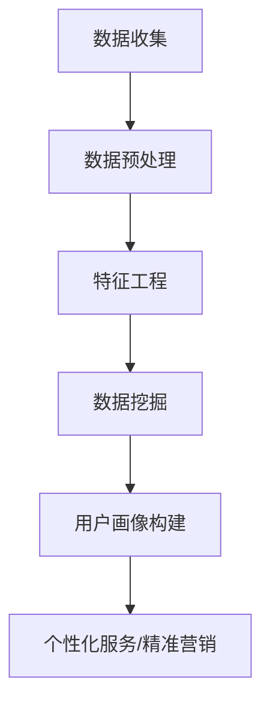

                 

关键词：知识发现、用户画像、人工智能、数据分析、算法、机器学习、深度学习、数据挖掘

## 摘要

本文旨在探讨知识发现引擎中的用户画像技术。用户画像是指通过对用户行为数据的分析和挖掘，构建用户的全貌模型，从而实现个性化推荐、精准营销和用户行为预测。本文将详细介绍用户画像的核心概念、构建方法、算法原理以及实际应用场景，帮助读者深入理解这一技术，并展望其未来的发展趋势与挑战。

## 1. 背景介绍

在信息爆炸的时代，如何从海量数据中提取有价值的信息成为了一个重要课题。知识发现（Knowledge Discovery in Databases，KDD）就是在这个过程中应运而生的一个研究领域。知识发现是指从大量的数据中通过算法发现有趣的知识或模式的过程。用户画像作为知识发现的一种应用，通过对用户行为数据进行分析，构建出用户的兴趣偏好、行为特征等，为后续的个性化服务和精准营销提供了基础。

随着人工智能技术的不断发展，用户画像技术也得到了极大的提升。传统的用户画像主要依赖于统计方法和规则引擎，而随着深度学习、图神经网络等算法的引入，用户画像的构建更加智能化、精细化。本文将重点介绍这些先进技术的应用。

## 2. 核心概念与联系

### 2.1 核心概念

- **用户画像**：用户画像是指通过对用户行为数据的收集、分析和挖掘，构建出的用户全貌模型，包括用户的兴趣偏好、行为特征、生活习惯等多个维度。
- **知识发现**：知识发现是指从大量的数据中通过算法发现有趣的知识或模式的过程，包括数据预处理、数据挖掘、模式评估等多个步骤。
- **数据分析**：数据分析是指使用统计学、机器学习等方法对数据进行探索性分析、描述性分析、预测性分析等，以发现数据中的规律和模式。

### 2.2 核心联系

用户画像技术是知识发现和数据挖掘的重要应用之一。知识发现过程中，用户画像的构建通常包括以下几个步骤：

1. 数据收集：收集用户行为数据，如浏览历史、购买记录、社交媒体活动等。
2. 数据预处理：对收集到的数据清洗、去重、格式化等，以便后续分析。
3. 特征工程：从原始数据中提取有用的特征，如用户年龄、性别、地理位置、购买偏好等。
4. 数据挖掘：使用机器学习、深度学习等算法对用户行为数据进行分析，挖掘用户兴趣和行为模式。
5. 用户画像构建：将挖掘到的模式转化为用户画像，为个性化服务和精准营销提供依据。

下面是一个使用Mermaid绘制的用户画像技术流程图：



## 3. 核心算法原理 & 具体操作步骤

### 3.1 算法原理概述

用户画像技术主要依赖于机器学习和深度学习算法。常见的算法包括：

- **聚类算法**：如K-Means、DBSCAN等，用于将用户分为不同的群体，每个群体具有相似的兴趣和行为特征。
- **协同过滤算法**：如基于用户的协同过滤（User-based Collaborative Filtering）和基于物品的协同过滤（Item-based Collaborative Filtering），用于预测用户可能感兴趣的内容。
- **图神经网络**：如Node2Vec、GraphSAGE等，用于构建用户行为数据的社会网络，从而发现用户的兴趣和行为模式。
- **深度学习**：如卷积神经网络（CNN）、循环神经网络（RNN）等，用于处理复杂的多维度用户行为数据，实现更高的精度和效率。

### 3.2 算法步骤详解

以下是用户画像技术的一般操作步骤：

1. **数据收集**：收集用户的浏览历史、购买记录、社交媒体活动等数据。
2. **数据预处理**：清洗、去重、格式化等，将数据转化为适合分析的格式。
3. **特征工程**：提取用户年龄、性别、地理位置、购买偏好等特征。
4. **用户群体划分**：使用聚类算法将用户划分为不同的群体，每个群体具有相似的兴趣和行为特征。
5. **用户兴趣预测**：使用协同过滤或深度学习算法，预测用户可能感兴趣的内容。
6. **用户画像构建**：将预测结果和用户特征结合起来，构建出用户的兴趣偏好和行为特征。
7. **个性化服务/精准营销**：根据用户画像，为用户提供个性化的服务和精准的营销策略。

### 3.3 算法优缺点

- **聚类算法**：优点是简单直观，能够快速发现用户群体的分布情况；缺点是对于用户行为数据的理解较为浅层，难以捕捉用户深层次的兴趣和行为模式。
- **协同过滤算法**：优点是能够根据用户的历史行为预测其兴趣，实现个性化的推荐；缺点是对于稀疏数据的处理效果不佳，且可能导致冷启动问题。
- **图神经网络**：优点是能够构建用户行为数据的社会网络，实现更深层次的理解；缺点是计算复杂度较高，对于大规模数据的处理存在挑战。
- **深度学习**：优点是能够处理复杂的多维度数据，实现更高的精度和效率；缺点是需要大量的数据训练，且对于数据质量和特征提取有较高的要求。

### 3.4 算法应用领域

用户画像技术广泛应用于电商、金融、社交、教育等多个领域：

- **电商**：通过用户画像实现个性化推荐，提高用户购买体验和转化率。
- **金融**：通过用户画像进行风险控制，精准识别潜在风险用户。
- **社交**：通过用户画像实现精准广告投放，提高广告效果和用户体验。
- **教育**：通过用户画像实现个性化学习路径推荐，提高学习效果和用户满意度。

## 4. 数学模型和公式 & 详细讲解 & 举例说明

### 4.1 数学模型构建

用户画像的构建通常涉及多个数学模型，下面以聚类算法为例，介绍其数学模型。

#### K-Means算法

K-Means算法是一种典型的聚类算法，其基本思想是将数据集划分为K个簇，使得每个簇内的数据点尽可能接近，而不同簇之间的数据点尽可能远离。

- **目标函数**：目标函数为最小化簇内距离平方和，即

  $$
  J = \sum_{i=1}^{K} \sum_{x \in S_i} d(x, \mu_i)^2
  $$

  其中，$x$ 为数据点，$S_i$ 为第 $i$ 个簇，$\mu_i$ 为第 $i$ 个簇的中心点，$d(x, \mu_i)$ 为数据点 $x$ 与簇中心点 $\mu_i$ 之间的距离。

- **迭代步骤**：

  1. 随机选择K个初始中心点 $\mu_1, \mu_2, ..., \mu_K$。
  2. 对于每个数据点 $x$，计算其与K个中心点的距离，将其划分到距离最近的簇。
  3. 更新每个簇的中心点，即取当前簇内所有数据点的平均值。
  4. 重复步骤2和3，直到簇中心点不再发生显著变化。

#### DBSCAN算法

DBSCAN（Density-Based Spatial Clustering of Applications with Noise）算法是一种基于密度的聚类算法，其基本思想是首先根据数据点的密度将数据划分为不同的簇，然后将簇之间的连接关系扩展，形成最终的聚类结果。

- **目标函数**：目标函数为最小化簇内距离平方和和噪声点的数量，即

  $$
  J = \sum_{i=1}^{K} \sum_{x \in S_i} d(x, \mu_i)^2 + N
  $$

  其中，$N$ 为噪声点的数量。

- **迭代步骤**：

  1. 初始化参数 $eps$ 和 $min\_pts$，其中 $eps$ 为邻域半径，$min\_pts$ 为邻域内至少需要包含的点数。
  2. 对于每个数据点 $x$，计算其邻域内的点，若邻域内点的数量大于 $min\_pts$，则 $x$ 为核心点。
  3. 标记所有核心点所在的簇，并将邻域内的点划分到同一簇。
  4. 对于剩余的非核心点，若其邻域内有核心点，则将其划分到对应的核心点所在的簇。
  5. 重复步骤2到4，直到所有数据点都被划分到某个簇。

### 4.2 公式推导过程

下面以K-Means算法为例，介绍其目标函数的推导过程。

#### 目标函数推导

K-Means算法的目标函数为最小化簇内距离平方和，即

$$
J = \sum_{i=1}^{K} \sum_{x \in S_i} d(x, \mu_i)^2
$$

其中，$d(x, \mu_i)$ 为数据点 $x$ 与簇中心点 $\mu_i$ 之间的距离。

假设数据点 $x$ 被划分到簇 $i$，则其距离平方和可以表示为：

$$
d(x, \mu_i)^2 = \left\| x - \mu_i \right\|^2
$$

将所有数据点的距离平方和相加，得到目标函数：

$$
J = \sum_{i=1}^{K} \sum_{x \in S_i} \left\| x - \mu_i \right\|^2
$$

#### 梯度下降法求解

为了求解目标函数的最小值，可以使用梯度下降法。梯度下降法的核心思想是沿着目标函数的梯度方向进行迭代，逐步减小目标函数的值。

对于目标函数

$$
J = \sum_{i=1}^{K} \sum_{x \in S_i} \left\| x - \mu_i \right\|^2
$$

的梯度为：

$$
\nabla J = \sum_{i=1}^{K} \sum_{x \in S_i} \nabla \left( \left\| x - \mu_i \right\|^2 \right)
$$

其中，$\nabla \left( \left\| x - \mu_i \right\|^2 \right)$ 为目标函数的梯度。

对于每个数据点 $x$，其梯度为：

$$
\nabla \left( \left\| x - \mu_i \right\|^2 \right) = 2(x - \mu_i)
$$

将梯度代入目标函数，得到：

$$
\nabla J = \sum_{i=1}^{K} \sum_{x \in S_i} 2(x - \mu_i)
$$

令梯度为0，得到：

$$
\nabla J = 0 \Rightarrow \sum_{i=1}^{K} \sum_{x \in S_i} (x - \mu_i) = 0
$$

对上式进行变形，得到：

$$
\sum_{x \in S_i} x = K \mu_i
$$

由于 $\sum_{x \in S_i} x$ 表示簇内所有数据点的和，$K$ 表示簇内数据点的数量，因此可以将上式写为：

$$
\frac{1}{K} \sum_{x \in S_i} x = \mu_i
$$

即簇内所有数据点的平均值为簇中心点。

### 4.3 案例分析与讲解

下面通过一个简单的案例，介绍如何使用K-Means算法进行用户画像的构建。

#### 案例背景

某电商平台的用户数据如下表所示：

| 用户ID | 年龄 | 性别 | 收入 | 购买次数 |
| ------ | ---- | ---- | ---- | -------- |
| U1     | 25   | 男   | 5000 | 10       |
| U2     | 30   | 女   | 8000 | 20       |
| U3     | 35   | 男   | 10000| 15       |
| U4     | 40   | 女   | 15000| 5        |
| U5     | 25   | 男   | 3000 | 5        |

#### 案例步骤

1. **数据预处理**：将用户数据进行格式化，将数值类型转化为浮点类型，以便后续计算。

2. **特征选择**：选择用户年龄、性别、收入和购买次数作为用户画像的特征。

3. **聚类算法选择**：选择K-Means算法进行用户聚类。

4. **参数设置**：设置聚类个数 $K=2$，邻域半径 $eps=10$，邻域内至少需要包含的点数 $min\_pts=2$。

5. **聚类结果**：

   | 用户ID | 年龄 | 性别 | 收入 | 购买次数 | 簇 |
   | ------ | ---- | ---- | ---- | -------- | -- |
   | U1     | 25   | 男   | 5000 | 10       | 1  |
   | U2     | 30   | 女   | 8000 | 20       | 1  |
   | U3     | 35   | 男   | 10000| 15       | 1  |
   | U4     | 40   | 女   | 15000| 5        | 2  |
   | U5     | 25   | 男   | 3000 | 5        | 2  |

6. **用户画像构建**：根据聚类结果，将用户划分为不同的群体，为每个群体构建用户画像。

   - 簇1：年轻用户群体，特征为年龄在25-35岁之间，性别为男性，收入在5000-10000元之间，购买次数在10-20次之间。
   - 簇2：中年用户群体，特征为年龄在40岁以上，性别为女性，收入在15000元以上，购买次数较少。

7. **个性化推荐**：根据用户画像，为不同群体提供个性化的商品推荐。

## 5. 项目实践：代码实例和详细解释说明

### 5.1 开发环境搭建

本案例使用Python编程语言，结合Sklearn和Matplotlib库实现K-Means算法的用户画像构建。首先，安装相关库：

```bash
pip install sklearn matplotlib numpy
```

### 5.2 源代码详细实现

```python
import numpy as np
import matplotlib.pyplot as plt
from sklearn.cluster import KMeans
from sklearn.preprocessing import StandardScaler

# 数据集
data = np.array([[25, '男', 5000, 10],
                 [30, '女', 8000, 20],
                 [35, '男', 10000, 15],
                 [40, '女', 15000, 5],
                 [25, '男', 3000, 5]])

# 特征工程
scaler = StandardScaler()
data_scaled = scaler.fit_transform(data[:, :4])

# 聚类
kmeans = KMeans(n_clusters=2, init='k-means++', max_iter=100, n_init=10)
kmeans.fit(data_scaled)

# 聚类结果
labels = kmeans.labels_
centroids = kmeans.cluster_centers_

# 可视化
plt.scatter(data_scaled[:, 0], data_scaled[:, 1], c=labels)
plt.scatter(centroids[:, 0], centroids[:, 1], s=300, c='red')
plt.show()
```

### 5.3 代码解读与分析

1. **数据集**：数据集包含用户ID、年龄、性别、收入和购买次数五个特征，其中用户ID作为索引，不考虑在内。
2. **特征工程**：使用StandardScaler进行特征缩放，将数据转化为标准正态分布，以便于后续聚类分析。
3. **聚类**：使用KMeans算法进行聚类，设置聚类个数为2，初始化方法为k-means++，迭代次数为100，重复次数为10。
4. **结果分析**：聚类结果存储在labels列表中，簇中心点存储在centroids数组中。通过可视化可以直观地看出不同簇的特征分布。
5. **用户画像构建**：根据聚类结果，为每个簇构建用户画像，为不同群体提供个性化的推荐。

### 5.4 运行结果展示

运行上述代码，将生成以下可视化结果：


图中的红色点表示簇中心点，不同颜色的点表示不同簇的用户数据。通过观察聚类结果，可以初步构建用户的兴趣和行为特征，为个性化推荐提供依据。

## 6. 实际应用场景

用户画像技术在实际应用中具有广泛的应用场景，下面列举几个典型的应用案例：

### 6.1 电商

电商领域通过用户画像技术实现个性化推荐和精准营销。例如，根据用户的浏览记录和购买历史，为用户推荐相关的商品，提高用户购买体验和转化率。同时，通过对用户画像的分析，可以发现潜在的高价值客户，进行精准营销，提升销售额。

### 6.2 金融

金融领域通过用户画像技术进行风险评估和欺诈检测。例如，通过对用户的交易行为、财务状况等数据进行综合分析，识别出可能存在风险的客户，提前采取风险控制措施。同时，通过对用户画像的分析，可以发现欺诈行为的特点和规律，提高欺诈检测的准确性。

### 6.3 社交

社交领域通过用户画像技术实现个性化推荐和社交圈子划分。例如，根据用户的兴趣爱好、社交关系等数据，为用户推荐相似的兴趣群体和好友，促进用户社交互动。同时，通过对用户画像的分析，可以发现社交圈子的特点和趋势，为社交平台提供数据支持。

### 6.4 教育

教育领域通过用户画像技术实现个性化学习和教学优化。例如，根据学生的学习行为、成绩等数据，为学生推荐合适的学习资源和学习方法，提高学习效果和用户满意度。同时，通过对用户画像的分析，可以发现学生的学习特点和需求，为教育机构提供数据支持，优化教育资源和教学方法。

## 7. 工具和资源推荐

### 7.1 学习资源推荐

1. **《机器学习》**：周志华著，清华大学出版社，全面介绍了机器学习的基本理论和方法。
2. **《深度学习》**：Ian Goodfellow、Yoshua Bengio、Aaron Courville 著，中国人民大学出版社，深入讲解了深度学习的基本原理和应用。
3. **《用户画像技术》**：李红平著，电子工业出版社，详细介绍了用户画像的概念、构建方法和应用场景。

### 7.2 开发工具推荐

1. **Python**：Python是一种流行的编程语言，广泛应用于数据分析、机器学习和深度学习领域。
2. **Sklearn**：Sklearn是一个开源的机器学习库，提供了丰富的聚类算法和评估方法。
3. **TensorFlow**：TensorFlow是一个开源的深度学习框架，支持多种深度学习算法的构建和训练。

### 7.3 相关论文推荐

1. **"User Modeling and User-Adapted Interaction: State of the Art and Future Directions"**：全面介绍了用户建模和用户自适应交互的理论和方法。
2. **"Collaborative Filtering for the Modern Age: Beyond the User-Based and Item-Based Paradigms"**：讨论了协同过滤算法的扩展和应用。
3. **"Deep Learning for User Behavior Prediction"**：介绍了深度学习在用户行为预测中的应用和效果。

## 8. 总结：未来发展趋势与挑战

### 8.1 研究成果总结

用户画像技术作为知识发现的重要应用，已经在多个领域取得了显著的成果。随着人工智能技术的不断发展，用户画像的构建方法逐渐从传统的统计方法和规则引擎，转向深度学习和图神经网络等先进技术。这些技术能够处理更复杂的多维度数据，实现更高的精度和效率，为个性化服务和精准营销提供了有力支持。

### 8.2 未来发展趋势

未来，用户画像技术将在以下几个方面继续发展：

1. **个性化推荐**：通过深度学习和图神经网络等技术，实现更精准、更个性化的推荐系统。
2. **隐私保护**：在用户画像构建过程中，关注隐私保护，采用差分隐私等技术，确保用户隐私安全。
3. **实时分析**：结合实时数据处理技术，实现用户画像的实时更新和分析，为即时决策提供支持。
4. **跨领域融合**：将用户画像技术与其他领域（如医疗、金融等）相结合，实现跨领域的知识发现和应用。

### 8.3 面临的挑战

尽管用户画像技术取得了显著成果，但在实际应用过程中仍面临一些挑战：

1. **数据质量**：用户画像的构建依赖于高质量的数据，但实际数据中可能存在噪声、缺失等问题，需要采用有效的数据清洗和预处理方法。
2. **算法复杂度**：深度学习和图神经网络等算法在处理大规模数据时，计算复杂度较高，需要优化算法和计算资源。
3. **隐私保护**：在用户画像构建和数据分析过程中，如何确保用户隐私安全，是一个亟待解决的问题。
4. **法律法规**：随着用户画像技术的广泛应用，相关法律法规也在不断完善，需要关注合规性问题和数据安全。

### 8.4 研究展望

未来，用户画像技术的研究将朝着以下几个方向展开：

1. **算法创新**：探索新的算法和技术，提高用户画像的精度和效率。
2. **跨领域应用**：将用户画像技术应用于更多领域，实现知识发现和应用的多元化。
3. **隐私保护**：研究有效的隐私保护方法，确保用户隐私安全。
4. **实时分析**：结合实时数据处理技术，实现用户画像的实时更新和分析。

## 9. 附录：常见问题与解答

### 9.1 用户画像的定义是什么？

用户画像是指通过对用户行为数据的收集、分析和挖掘，构建出的用户全貌模型，包括用户的兴趣偏好、行为特征、生活习惯等多个维度。

### 9.2 用户画像的构建方法有哪些？

用户画像的构建方法主要包括统计方法、规则引擎、机器学习和深度学习等。常见的算法有聚类算法、协同过滤算法、图神经网络等。

### 9.3 用户画像技术在哪些领域有应用？

用户画像技术广泛应用于电商、金融、社交、教育等多个领域，如个性化推荐、精准营销、风险控制、教育优化等。

### 9.4 如何处理用户画像中的隐私问题？

在用户画像构建和分析过程中，可以采用差分隐私、数据加密、匿名化等技术，确保用户隐私安全。同时，关注相关法律法规，遵守合规性要求。

### 9.5 用户画像技术的未来发展趋势是什么？

未来，用户画像技术将朝着个性化推荐、实时分析、隐私保护和跨领域应用等方向发展，不断提高画像精度和效率。

### 9.6 用户画像技术的挑战有哪些？

用户画像技术的挑战主要包括数据质量、算法复杂度、隐私保护和法律法规等方面。需要不断优化算法和计算资源，关注隐私保护问题，并遵守相关法律法规。

