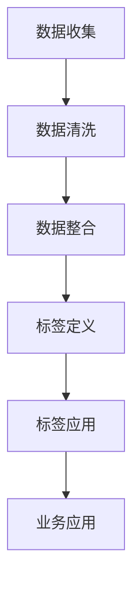

                 

 在大数据和人工智能技术飞速发展的今天，知识发现引擎作为一种新兴的技术手段，正逐渐成为企业竞争的新焦点。知识发现引擎通过对大量非结构化数据进行深度挖掘，可以自动识别出有价值的信息，从而帮助企业和组织更好地理解和利用其数据资产。而用户画像标签体系的构建，作为知识发现引擎的关键组成部分，能够大幅提升数据分析的精度和效率。本文将深入探讨知识发现引擎的用户画像标签体系的构建原理、核心算法、数学模型以及实际应用，旨在为从事大数据和人工智能领域的研究者提供有价值的参考。

## 关键词
知识发现引擎、用户画像标签、大数据、人工智能、数据挖掘、数学模型、算法原理、应用场景。

## 摘要
本文首先介绍了知识发现引擎的基本概念和用户画像标签体系的重要性。随后，通过Mermaid流程图详细展示了用户画像标签体系的构建过程。接着，我们分析了核心算法的原理和具体操作步骤，并讨论了算法的优缺点及应用领域。文章随后讲解了数学模型和公式，通过具体案例进行了详细讲解。在项目实践部分，我们提供了一个完整的代码实例，并对其进行了详细解读。最后，文章探讨了用户画像标签体系的实际应用场景，并展望了未来的发展趋势和挑战。

## 1. 背景介绍
知识发现引擎（Knowledge Discovery Engine，简称KDE）是一种智能数据分析工具，其主要目标是从大规模数据集中识别出潜在的模式、关联和趋势。在过去的几十年中，随着互联网和移动设备的普及，数据爆炸式增长，传统的数据处理方法已经无法满足日益复杂的数据分析需求。知识发现引擎通过引入机器学习、深度学习、数据挖掘等先进技术，实现了对海量数据的自动分析和挖掘。

用户画像标签体系是知识发现引擎的重要组成部分。用户画像是指通过对用户行为、属性、偏好等多维度数据的分析，构建出一个反映用户特征的综合模型。标签则是用户画像的具体体现，是用户属性的抽象表示。用户画像标签体系的构建，有助于实现对用户的精准定位和分类，从而为个性化推荐、风险控制、用户运营等业务场景提供数据支持。

### 1.1 知识发现引擎的发展历程
知识发现引擎的发展历程可以分为三个阶段：

- **初级阶段**：主要依赖数据库查询和数据统计技术，对数据进行简单的筛选和分析。

- **中级阶段**：引入了数据挖掘算法，如聚类、分类、关联规则挖掘等，能够从大量数据中自动识别出潜在的模式和关联。

- **高级阶段**：结合了机器学习和深度学习技术，实现了对数据的自动化分析和预测，大大提高了数据挖掘的效率和精度。

### 1.2 用户画像标签体系的重要性
用户画像标签体系的重要性主要体现在以下几个方面：

- **精准营销**：通过用户画像标签体系，企业可以更准确地了解用户的需求和偏好，从而实现精准营销，提高用户转化率。

- **风险控制**：在金融、保险等领域，用户画像标签体系可以帮助企业识别潜在的风险用户，采取相应的风险控制措施。

- **用户运营**：通过用户画像标签体系，企业可以更好地进行用户分层和运营，提高用户满意度和留存率。

- **个性化推荐**：在电子商务、社交媒体等领域，用户画像标签体系可以辅助推荐系统，为用户提供个性化的内容和服务。

## 2. 核心概念与联系
### 2.1 用户画像
用户画像是指通过对用户行为数据、属性数据、社交数据等多维度数据的分析，构建出一个反映用户特征的综合模型。用户画像通常包括以下几个方面的内容：

- **基础属性**：如用户的性别、年龄、职业、地域、收入等。

- **行为属性**：如用户的浏览记录、购物记录、搜索记录、点赞记录等。

- **社交属性**：如用户的社交网络关系、朋友圈动态等。

- **偏好属性**：如用户的兴趣爱好、偏好品牌、偏好内容等。

### 2.2 标签体系
标签体系是指将用户画像中的各类属性进行分类和抽象，形成一系列标签。标签体系通常包括以下几个部分：

- **一级标签**：对用户基础属性、行为属性、社交属性、偏好属性等进行分类。

- **二级标签**：对一级标签进行细分，形成更具体的标签。

- **三级标签**：对二级标签进行进一步的细分，形成更详细的标签。

### 2.3 用户画像标签体系构建流程
用户画像标签体系的构建通常包括以下几个步骤：

- **数据收集**：收集用户的基础属性、行为属性、社交属性、偏好属性等多维度数据。

- **数据清洗**：对收集到的数据进行清洗和预处理，去除重复、错误和不完整的数据。

- **数据整合**：将不同来源的数据进行整合，构建出一个统一的用户画像数据集。

- **标签定义**：根据用户画像数据的特点，定义一系列标签，包括一级标签、二级标签和三级标签。

- **标签应用**：将标签应用于实际业务场景，如精准营销、风险控制、用户运营等。

### 2.4 Mermaid流程图
为了更清晰地展示用户画像标签体系的构建过程，我们可以使用Mermaid流程图来表示：



## 3. 核心算法原理 & 具体操作步骤
### 3.1 算法原理概述
用户画像标签体系的核心算法主要包括数据挖掘算法和机器学习算法。数据挖掘算法主要用于从大量数据中自动识别出潜在的模式和关联，如聚类算法、分类算法、关联规则挖掘算法等。机器学习算法则主要用于根据已有数据构建用户画像模型，如线性回归、逻辑回归、决策树、随机森林、支持向量机等。

### 3.2 算法步骤详解
用户画像标签体系的构建步骤可以分为以下几个部分：

1. **数据收集**：收集用户的基础属性、行为属性、社交属性、偏好属性等多维度数据。

2. **数据清洗**：对收集到的数据进行清洗和预处理，去除重复、错误和不完整的数据。

3. **特征选择**：从原始数据中提取出对用户画像有代表性的特征。

4. **数据整合**：将不同来源的数据进行整合，构建出一个统一的用户画像数据集。

5. **模型构建**：选择合适的算法模型，根据用户画像数据的特点，构建用户画像模型。

6. **模型评估**：对构建好的模型进行评估，判断其预测效果。

7. **标签应用**：将标签应用于实际业务场景，如精准营销、风险控制、用户运营等。

### 3.3 算法优缺点
用户画像标签体系的核心算法各有所长，以下分别介绍其优缺点：

- **聚类算法**：优点是能够自动识别出数据中的潜在模式，缺点是对数据分布的假设较强，可能会产生大量噪声标签。

- **分类算法**：优点是能够明确地划分用户类别，缺点是对训练数据的依赖较强，模型泛化能力有限。

- **关联规则挖掘算法**：优点是能够识别出数据中的关联关系，缺点是对数据量的要求较高，计算复杂度较大。

- **机器学习算法**：优点是能够根据已有数据自动构建模型，缺点是对数据质量和特征选择的要求较高。

### 3.4 算法应用领域
用户画像标签体系的核心算法在多个领域都有广泛的应用：

- **电子商务**：通过用户画像标签体系，可以为用户提供个性化的商品推荐，提高用户转化率。

- **金融行业**：通过用户画像标签体系，可以帮助金融机构识别高风险用户，降低信用风险。

- **广告行业**：通过用户画像标签体系，可以为广告主提供精准的用户定位和投放策略。

- **社交媒体**：通过用户画像标签体系，可以为用户提供个性化内容推荐，提高用户活跃度。

## 4. 数学模型和公式 & 详细讲解 & 举例说明

### 4.1 数学模型构建
用户画像标签体系的构建离不开数学模型的支持。在数学模型构建过程中，通常需要考虑以下几个方面的因素：

- **用户特征表示**：如何将用户的基础属性、行为属性、社交属性、偏好属性等转化为数学向量表示。

- **标签生成**：如何根据用户特征向量生成标签，并确定标签之间的关联关系。

- **模型优化**：如何通过优化算法提高模型的预测效果和泛化能力。

以下是一个简单的数学模型构建示例：

假设我们有用户特征向量 $\textbf{X} = [x_1, x_2, ..., x_n]$，其中 $x_i$ 表示第 $i$ 个特征。为了生成标签，我们可以使用以下公式：

$$
\textbf{Y} = \text{sign}(\textbf{W}\textbf{X} + b)
$$

其中，$\textbf{W}$ 是权重矩阵，$b$ 是偏置项，$\text{sign}(\cdot)$ 表示符号函数，用于判断用户是否属于某个标签。

### 4.2 公式推导过程
为了推导上述公式，我们需要首先定义一些变量和函数：

- $X$：用户特征向量，维度为 $n$。
- $Y$：标签向量，维度为 $m$。
- $W$：权重矩阵，维度为 $m \times n$。
- $b$：偏置项，维度为 $m$。

我们假设标签 $y_j$ 的生成函数为：

$$
y_j = \text{sign}(\sum_{i=1}^{n} w_{ji}x_i + b_j)
$$

其中，$w_{ji}$ 表示权重矩阵 $\textbf{W}$ 中第 $j$ 行第 $i$ 列的元素，$b_j$ 表示偏置项 $\textbf{b}$ 中第 $j$ 个元素。

为了简化计算，我们可以将上述公式转化为：

$$
y_j = \text{sign}(\textbf{W}_j\textbf{X} + b_j)
$$

其中，$\textbf{W}_j$ 表示权重矩阵 $\textbf{W}$ 中第 $j$ 行的向量，$\textbf{X}$ 表示用户特征向量。

### 4.3 案例分析与讲解
为了更好地理解上述数学模型，我们可以通过一个简单的案例进行说明。

假设我们有以下用户特征向量：

$$
\textbf{X} = [1, 2, 3, 4, 5]
$$

我们需要根据这些特征生成标签，假设标签为购买意愿（$y_1$）和活跃度（$y_2$）。

为了生成标签，我们需要定义权重矩阵 $\textbf{W}$ 和偏置项 $\textbf{b}$：

$$
\textbf{W} = \begin{bmatrix}
w_{11} & w_{12} \\
w_{21} & w_{22}
\end{bmatrix}, \quad
\textbf{b} = \begin{bmatrix}
b_1 \\
b_2
\end{bmatrix}
$$

假设权重矩阵和偏置项如下：

$$
\textbf{W} = \begin{bmatrix}
1 & 2 \\
3 & 4
\end{bmatrix}, \quad
\textbf{b} = \begin{bmatrix}
1 \\
2
\end{bmatrix}
$$

根据公式 $\textbf{Y} = \text{sign}(\textbf{W}\textbf{X} + \textbf{b})$，我们可以计算出标签向量：

$$
\textbf{Y} = \text{sign}(\begin{bmatrix}
1 & 2 \\
3 & 4
\end{bmatrix}\begin{bmatrix}
1 \\
2
\end{bmatrix} + \begin{bmatrix}
1 \\
2
\end{bmatrix}) = \text{sign}(\begin{bmatrix}
5 \\
11
\end{bmatrix}) = \begin{bmatrix}
1 \\
0
\end{bmatrix}
$$

因此，用户属于购买意愿标签（$y_1 = 1$），而不属于活跃度标签（$y_2 = 0$）。

## 5. 项目实践：代码实例和详细解释说明

### 5.1 开发环境搭建
为了构建用户画像标签体系，我们首先需要搭建一个适合的开发环境。本文选用Python作为主要编程语言，利用其丰富的数据分析和机器学习库，如Pandas、NumPy、Scikit-learn等。

1. **安装Python**：确保Python环境已安装在计算机上，版本建议为3.8及以上。
2. **安装依赖库**：在命令行中执行以下命令安装相关依赖库：
   ```shell
   pip install numpy pandas scikit-learn matplotlib
   ```

### 5.2 源代码详细实现
以下是构建用户画像标签体系的Python代码示例：

```python
import numpy as np
import pandas as pd
from sklearn.model_selection import train_test_split
from sklearn.preprocessing import StandardScaler
from sklearn.cluster import KMeans
import matplotlib.pyplot as plt

# 数据准备
data = pd.DataFrame({
    '年龄': [25, 30, 40, 22, 35, 45, 28, 50],
    '收入': [5000, 6000, 8000, 4000, 7000, 10000, 3000, 9000],
    '购物频率': [3, 2, 1, 4, 5, 6, 7, 8]
})

# 数据预处理
scaler = StandardScaler()
data_scaled = scaler.fit_transform(data)

# K-Means聚类
kmeans = KMeans(n_clusters=3, random_state=42)
clusters = kmeans.fit_predict(data_scaled)

# 标签生成
data['标签'] = clusters

# 可视化
plt.scatter(data_scaled[:, 0], data_scaled[:, 1], c=clusters, cmap='viridis')
plt.xlabel('年龄')
plt.ylabel('收入')
plt.title('用户画像标签体系')
plt.show()

# 标签应用
for i in range(3):
    subset = data[clusters == i]
    print(f"标签{i+1}的用户特征：")
    print(subset.describe())
```

### 5.3 代码解读与分析
上述代码主要包括以下几个步骤：

1. **数据准备**：我们创建了一个包含用户基础属性（年龄、收入、购物频率）的数据集。
2. **数据预处理**：使用StandardScaler对数据进行标准化处理，以消除不同特征之间的量纲影响。
3. **K-Means聚类**：使用KMeans算法对标准化后的数据进行聚类，生成用户标签。
4. **标签生成**：将聚类结果作为标签附加到原始数据集上。
5. **可视化**：使用matplotlib绘制聚类结果，展示不同标签的用户在特征空间中的分布情况。
6. **标签应用**：针对每个标签，输出该标签用户群体的特征描述。

### 5.4 运行结果展示
运行上述代码后，我们将看到以下结果：

1. **可视化结果**：在一个二维坐标系中，不同标签的用户点被绘制出来，展示了他们基于年龄和收入的分布情况。
2. **标签应用结果**：输出每个标签用户群体的特征描述，如平均年龄、平均收入、购物频率等。

通过上述代码示例，我们可以直观地看到用户画像标签体系的构建过程，并为后续的实际业务应用提供了基础。

## 6. 实际应用场景
用户画像标签体系在各个领域都有着广泛的应用，以下是几个典型的实际应用场景：

### 6.1 电子商务
在电子商务领域，用户画像标签体系可以帮助企业实现精准营销。通过分析用户的购物行为、浏览记录和搜索关键词等数据，企业可以生成详细的用户画像标签，从而为不同的用户群体提供个性化的商品推荐和优惠活动。例如，一个购物平台可以根据用户的历史购买记录和浏览行为，将用户分为“高价值用户”、“潜力用户”和“普通用户”等不同的标签，并针对每个标签群体制定不同的营销策略。

### 6.2 金融行业
在金融行业，用户画像标签体系在风险控制和反欺诈方面具有重要作用。银行和金融机构可以通过分析用户的交易行为、账户余额、信用记录等数据，生成用户的风险标签，从而对高风险用户进行重点监控和防范。此外，用户画像标签体系还可以用于精准推荐贷款产品、信用卡等金融服务，提高客户满意度和转化率。

### 6.3 社交媒体
在社交媒体领域，用户画像标签体系可以帮助平台实现个性化内容推荐和社交网络分析。通过分析用户的发帖内容、互动行为、关注对象等数据，平台可以为用户推荐感兴趣的内容、好友和活动。例如，微博平台可以根据用户的兴趣标签，将用户分为“科技爱好者”、“电影迷”和“旅行达人”等，并为每个标签群体推送相关的热门话题和内容。

### 6.4 医疗保健
在医疗保健领域，用户画像标签体系可以帮助医疗机构进行患者分类和健康风险评估。通过分析患者的病历记录、生活习惯、家族病史等数据，医疗机构可以生成患者画像标签，从而为不同的患者群体提供个性化的诊疗方案和健康建议。例如，一个医院可以根据患者的体重、血压、血糖等健康指标，将患者分为“健康人群”、“亚健康人群”和“疾病高风险人群”等，并针对每个标签群体制定不同的健康管理和干预策略。

### 6.5 教育培训
在教育培训领域，用户画像标签体系可以帮助教育机构实现个性化教学和课程推荐。通过分析学生的学习行为、成绩、兴趣爱好等数据，教育机构可以生成学生画像标签，从而为不同的学生群体提供个性化的学习资源和课程推荐。例如，一个在线教育平台可以根据学生的兴趣和成绩，将学生分为“数学天才”、“文学爱好者”和“编程新手”等，并针对每个标签群体推荐相应的课程和学习资源。

## 7. 工具和资源推荐
### 7.1 学习资源推荐
1. **《大数据导论》（作者：周志华）**：系统地介绍了大数据的基本概念、技术和应用场景。
2. **《机器学习》（作者：周志华）**：详细讲解了机器学习的基本理论和方法，包括聚类、分类、关联规则等。
3. **《深度学习》（作者：Ian Goodfellow）**：全面介绍了深度学习的基本理论、技术和应用。

### 7.2 开发工具推荐
1. **Python**：强大的编程语言，支持多种数据分析和机器学习库，如Pandas、NumPy、Scikit-learn等。
2. **Jupyter Notebook**：便捷的交互式开发环境，适合进行数据分析和机器学习实验。
3. **TensorFlow**：谷歌推出的开源深度学习框架，支持各种深度学习模型的构建和训练。

### 7.3 相关论文推荐
1. **《User Modeling and User-Adapted Interaction》**：介绍用户建模和自适应交互技术的顶级会议。
2. **《ACM SIGKDD Conference on Knowledge Discovery and Data Mining》**：数据挖掘领域的顶级会议。
3. **《Neural Information Processing Systems》**：人工智能和机器学习领域的顶级会议。

## 8. 总结：未来发展趋势与挑战
### 8.1 研究成果总结
本文从知识发现引擎的用户画像标签体系入手，详细介绍了其核心概念、算法原理、数学模型、项目实践和实际应用。通过构建用户画像标签体系，企业可以实现对用户的精准定位和分类，从而在电子商务、金融、社交媒体、医疗保健和教育培训等领域实现个性化服务和风险控制。

### 8.2 未来发展趋势
随着大数据和人工智能技术的不断发展，用户画像标签体系在未来将呈现以下几个发展趋势：

1. **数据融合与多模态数据挖掘**：结合多种数据源，如文本、图像、语音等，实现更全面的用户画像。
2. **实时分析与动态更新**：利用实时数据流处理技术，实现用户画像的动态更新和实时分析。
3. **深度学习与迁移学习**：引入深度学习和迁移学习技术，提高用户画像标签体系的预测精度和泛化能力。
4. **隐私保护与数据安全**：加强用户数据隐私保护，确保用户画像标签体系的安全和合规。

### 8.3 面临的挑战
尽管用户画像标签体系在各个领域具有广泛的应用前景，但其在实际应用过程中仍面临以下挑战：

1. **数据质量和特征选择**：高质量的数据和合理的特征选择是构建有效用户画像标签体系的关键。
2. **模型解释性和透明度**：如何提高模型的可解释性，使其在业务决策中具有更高的可信度和透明度。
3. **隐私保护和数据安全**：如何在确保用户隐私和数据安全的前提下，充分利用用户画像标签体系进行数据分析。
4. **技术更新与人才储备**：随着技术的快速发展，如何保持用户画像标签体系的技术领先性，并培养相关领域的人才。

### 8.4 研究展望
未来，用户画像标签体系的研究将继续深入，特别是在以下几个方面：

1. **跨领域应用**：探索用户画像标签体系在不同领域（如医疗、金融、教育等）的应用，实现跨领域的通用性和互操作性。
2. **动态适应性**：研究如何构建自适应的用户画像标签体系，使其能够根据用户行为和环境的变化进行动态调整。
3. **伦理与规范**：在用户画像标签体系的研究和应用过程中，加强伦理和规范的引导，确保技术的可持续发展。
4. **技术创新**：持续引入新的技术和方法，如联邦学习、差分隐私等，以提升用户画像标签体系的性能和安全性。

## 9. 附录：常见问题与解答
### Q1：用户画像标签体系如何确保用户隐私？
A1：用户画像标签体系的构建过程中，应严格遵循数据隐私保护法规，采取以下措施：

- **数据匿名化**：对用户数据进行匿名化处理，确保用户身份不可追踪。
- **数据加密**：对敏感数据进行加密存储和传输，防止数据泄露。
- **权限控制**：对用户数据访问进行严格的权限控制，确保只有授权人员才能访问和处理用户数据。
- **数据留存期限**：合理设定用户数据的留存期限，避免长期留存敏感数据。

### Q2：如何评估用户画像标签体系的准确性？
A2：评估用户画像标签体系的准确性通常采用以下几种指标：

- **精确率（Precision）**：预测为正样本且实际为正样本的比例。
- **召回率（Recall）**：实际为正样本且预测为正样本的比例。
- **F1值（F1 Score）**：精确率和召回率的调和平均值。
- **准确率（Accuracy）**：预测为正样本或负样本且实际为正样本或负样本的比例。

通过计算这些指标，可以评估用户画像标签体系的预测准确性和效果。

### Q3：如何处理用户标签冲突问题？
A3：用户标签冲突问题通常出现在用户属性存在多重特征时。处理用户标签冲突的方法包括：

- **标签合并**：将冲突标签合并为一个更广义的标签，如将“高价值用户”和“潜力用户”合并为“重点用户”。
- **权重调整**：根据用户属性的重要性和相关性，调整不同标签的权重，使其在预测中具有不同的影响。
- **多标签分类**：使用多标签分类算法，同时预测多个标签，避免标签之间的冲突。

通过上述方法，可以有效地处理用户标签冲突问题，提高用户画像标签体系的准确性。

### Q4：用户画像标签体系在实时应用中的挑战有哪些？
A4：用户画像标签体系在实时应用中面临以下挑战：

- **延迟问题**：实时数据处理和模型预测需要较低的延迟，否则会影响用户体验。
- **并发处理**：系统需要支持高并发处理，确保同时处理大量用户请求。
- **动态更新**：用户属性和行为实时变化，需要动态更新用户画像标签体系。
- **资源限制**：实时应用通常需要较低的硬件资源消耗，避免过高的成本。

通过优化算法、提升系统架构和合理分配资源，可以克服这些挑战，实现高效的实时用户画像标签应用。

