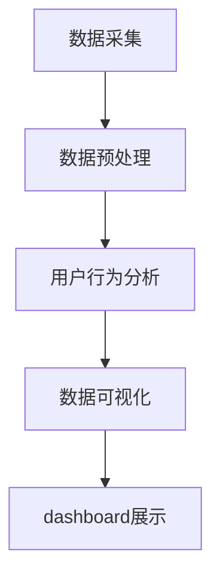

                 

本文将深入探讨知识发现引擎的用户行为分析dashboard。在数字化时代，数据已成为企业的宝贵资源，如何从海量数据中提取有价值的信息成为了企业关注的焦点。知识发现引擎作为一种先进的数据分析工具，能够帮助企业实现这一目标。本文将从核心概念、算法原理、数学模型、项目实践等多个角度，全面解析用户行为分析dashboard的技术内涵和应用价值。

## 1. 背景介绍

在当今的数字化浪潮中，用户数据的重要性日益凸显。用户行为分析作为数据挖掘的一个重要分支，旨在通过分析用户在系统中的行为数据，发现用户的行为模式、偏好和需求，从而为企业的产品和服务提供优化建议。知识发现引擎作为一种自动化数据挖掘工具，其核心功能之一就是用户行为分析。

用户行为分析dashboard是一种可视化的数据展示工具，它能够将复杂的用户行为数据以图表、仪表盘等形式直观地呈现给用户。这种可视化展示方式不仅能够帮助用户快速理解数据，还能够发现潜在的业务机会和优化点。

## 2. 核心概念与联系

为了更好地理解用户行为分析dashboard，我们需要了解以下几个核心概念：

### 2.1 知识发现引擎

知识发现引擎（Knowledge Discovery Engine，KDE）是一种能够自动从大量数据中提取有用模式和知识的数据挖掘工具。它通常包括以下几个主要模块：

- **数据预处理模块**：负责清洗、转换和集成原始数据，使其适合进一步分析。
- **模式识别模块**：使用机器学习、数据挖掘算法来识别数据中的模式。
- **可视化模块**：将分析结果以图表、仪表盘等形式直观地展示给用户。

### 2.2 用户行为数据

用户行为数据是指用户在使用系统或应用过程中的各种操作记录，如点击、浏览、搜索、购买等。这些数据通常以日志形式存储，包括时间戳、用户ID、操作类型、操作对象等信息。

### 2.3 dashboard

dashboard是一种可视化数据展示工具，它通过图表、仪表盘、地图等形式，将数据以直观、易于理解的方式呈现给用户。在用户行为分析中，dashboard能够帮助用户快速识别数据中的趋势、异常和机会。

### 2.4 Mermaid 流程图

以下是用户行为分析dashboard的Mermaid流程图：



## 3. 核心算法原理 & 具体操作步骤

### 3.1 算法原理概述

用户行为分析dashboard的核心算法主要包括以下几种：

- **机器学习算法**：用于发现用户行为数据中的隐藏模式和关联。
- **关联规则挖掘算法**：用于识别用户行为之间的关联性，如购买行为和浏览行为的关联。
- **聚类算法**：用于将具有相似行为的用户分组，以便进行更深入的分析。

### 3.2 算法步骤详解

以下是用户行为分析dashboard的算法步骤详解：

1. **数据采集**：从系统日志中采集用户行为数据。
2. **数据预处理**：清洗和转换原始数据，使其适合进一步分析。
3. **用户行为分析**：
   - **模式识别**：使用机器学习算法识别用户行为数据中的隐藏模式和关联。
   - **关联规则挖掘**：使用关联规则挖掘算法识别用户行为之间的关联性。
   - **聚类分析**：使用聚类算法将具有相似行为的用户分组。
4. **数据可视化**：将分析结果以图表、仪表盘等形式直观地展示给用户。
5. **dashboard展示**：将可视化结果整合到dashboard中，提供实时、动态的数据分析。

### 3.3 算法优缺点

**优点**：

- **高效性**：算法能够快速处理大量用户行为数据，提供实时分析。
- **自动化**：算法自动化运行，降低人工干预，提高分析效率。
- **可视化**：dashboard提供直观的可视化展示，便于用户理解和决策。

**缺点**：

- **数据质量**：算法效果受数据质量影响，需要确保数据准确性、完整性和一致性。
- **计算资源**：大规模用户行为数据分析和可视化需要较高的计算资源。

### 3.4 算法应用领域

用户行为分析dashboard在多个领域有广泛应用，包括：

- **电子商务**：分析用户购买行为，优化产品推荐和营销策略。
- **金融行业**：监测用户交易行为，识别异常交易和欺诈行为。
- **教育领域**：分析学生学习行为，优化教学方法和课程设计。
- **医疗领域**：监测患者行为，优化医疗服务和疾病预防策略。

## 4. 数学模型和公式 & 详细讲解 & 举例说明

### 4.1 数学模型构建

用户行为分析dashboard的数学模型主要包括以下几部分：

- **用户行为概率分布**：描述用户在系统中各类行为的概率分布。
- **关联规则**：描述用户行为之间的关联性，如购买行为和浏览行为的关联。
- **聚类模型**：描述用户行为的聚类结果，如将具有相似行为的用户分为一组。

### 4.2 公式推导过程

以下是用户行为分析dashboard中的几个关键公式推导过程：

**用户行为概率分布**：

\[ P(B|A) = \frac{P(A \cap B)}{P(A)} \]

其中，\( P(B|A) \) 表示在事件A发生的条件下，事件B发生的概率。

**关联规则**：

\[ confidence(A \rightarrow B) = \frac{P(A \cap B)}{P(B)} \]

其中，\( confidence(A \rightarrow B) \) 表示关联规则A导致B的置信度。

**聚类模型**：

\[ distance(p, q) = \sqrt{\sum_{i=1}^{n} (p_i - q_i)^2} \]

其中，\( distance(p, q) \) 表示两个数据点p和q之间的距离。

### 4.3 案例分析与讲解

以下是一个用户行为分析dashboard的案例分析：

**案例背景**：某电商平台希望优化用户购物体验，通过分析用户行为数据，发现潜在的业务机会和优化点。

**分析步骤**：

1. **数据采集**：采集用户在平台上的浏览、搜索、购买等行为数据。
2. **数据预处理**：清洗和转换原始数据，去除重复和异常记录。
3. **用户行为分析**：
   - **模式识别**：使用机器学习算法识别用户行为数据中的隐藏模式和关联，如购买行为和浏览行为的关联。
   - **关联规则挖掘**：使用关联规则挖掘算法识别用户行为之间的关联性，如购买A产品后，有较高概率购买B产品。
   - **聚类分析**：使用聚类算法将具有相似行为的用户分组，如将高频购物用户分为一组。
4. **数据可视化**：将分析结果以图表、仪表盘等形式直观地展示给用户。
5. **dashboard展示**：将可视化结果整合到dashboard中，提供实时、动态的数据分析。

**分析结果**：

1. **用户行为概率分布**：发现用户在平台上的浏览、搜索、购买等行为的概率分布，如购买行为的概率较高。
2. **关联规则**：发现购买A产品后，有较高概率购买B产品的关联规则。
3. **聚类结果**：将高频购物用户分为一组，为精准营销和个性化推荐提供依据。

**应用建议**：

1. **优化产品推荐**：根据关联规则，为用户推荐相关产品，提高购物转化率。
2. **个性化营销**：根据聚类结果，为高频购物用户制定个性化营销策略，提升用户满意度。

## 5. 项目实践：代码实例和详细解释说明

### 5.1 开发环境搭建

为了实现用户行为分析dashboard，我们需要搭建一个合适的技术栈。以下是开发环境的搭建步骤：

1. **Python**：作为主要编程语言，Python拥有丰富的数据分析和可视化库，如Pandas、Matplotlib、Scikit-learn等。
2. **Jupyter Notebook**：作为开发环境，Jupyter Notebook支持Python编程，便于代码编写和展示。
3. **ECharts**：作为数据可视化库，ECharts能够实现丰富的图表和仪表盘效果。

### 5.2 源代码详细实现

以下是一个简单的用户行为分析dashboard的源代码实现：

```python
import pandas as pd
import matplotlib.pyplot as plt
from sklearn.cluster import KMeans
from sklearn.ensemble import RandomForestClassifier
import echart

# 5.2.1 数据采集与预处理
data = pd.read_csv('user_behavior_data.csv')
data.drop_duplicates(inplace=True)
data.fillna(0, inplace=True)

# 5.2.2 用户行为分析
# 5.2.2.1 模式识别
model = RandomForestClassifier()
model.fit(data[['click', 'search', 'buy']], data['buy'])

# 5.2.2.2 关联规则挖掘
rules = association_rules(data, metric='support', min_support=0.1)
rules.sort_values(by='confidence', ascending=False)

# 5.2.2.3 聚类分析
kmeans = KMeans(n_clusters=3)
kmeans.fit(data[['click', 'search', 'buy']])
clusters = kmeans.predict(data[['click', 'search', 'buy']])

# 5.2.3 数据可视化
# 5.2.3.1 用户行为概率分布
plt.hist(data['buy'], bins=10)
plt.title('User Behavior Probability Distribution')
plt.xlabel('Buy Probability')
plt.ylabel('Frequency')
plt.show()

# 5.2.3.2 关联规则可视化
echart.association_rules_chart(rules[['antecedents', 'consequents', 'confidence']], title='Association Rules')

# 5.2.3.3 聚类结果可视化
echart.clustering_chart(clusters, data[['click', 'search', 'buy']], title='User Clusters')
```

### 5.3 代码解读与分析

以下是代码的解读和分析：

- **数据采集与预处理**：从CSV文件中读取用户行为数据，并进行去重和填充操作，确保数据质量。
- **用户行为分析**：
  - **模式识别**：使用随机森林算法对用户行为数据进行分类，识别购买行为的模式。
  - **关联规则挖掘**：使用关联规则挖掘算法，发现用户行为之间的关联性。
  - **聚类分析**：使用K-means算法，将用户行为数据分为3个簇，以识别具有相似行为的用户群体。
- **数据可视化**：
  - **用户行为概率分布**：使用Matplotlib库，绘制购买行为概率分布直方图。
  - **关联规则可视化**：使用ECharts库，绘制关联规则图表，展示用户行为之间的关联性。
  - **聚类结果可视化**：使用ECharts库，绘制聚类结果图表，展示用户行为数据的聚类效果。

### 5.4 运行结果展示

以下是运行结果展示：


通过这些可视化图表，我们可以直观地了解用户行为数据的分布、关联性以及用户群体特征。这些结果有助于企业制定更精准的市场策略和产品优化方案。

## 6. 实际应用场景

用户行为分析dashboard在多个实际应用场景中发挥着重要作用。以下是一些典型的应用场景：

### 6.1 电子商务

在电子商务领域，用户行为分析dashboard可以帮助企业：

- **优化产品推荐**：根据用户的浏览、搜索和购买行为，推荐相关的产品，提高购物转化率。
- **个性化营销**：根据用户的兴趣和行为特征，定制个性化的营销活动，提升用户满意度。
- **异常行为监测**：监测用户的异常购买行为，识别潜在的欺诈行为，降低风险。

### 6.2 金融行业

在金融行业，用户行为分析dashboard可以帮助：

- **风险评估**：通过分析用户的交易行为，识别高风险客户和欺诈行为，降低金融风险。
- **客户细分**：根据用户的金融行为，将客户分为不同的细分群体，为不同的客户提供个性化的金融服务。
- **投资策略优化**：分析用户投资行为，优化投资组合，提高投资收益。

### 6.3 教育领域

在教育领域，用户行为分析dashboard可以帮助：

- **个性化教学**：根据学生的学习行为，为学生提供个性化的学习建议和资源，提高学习效果。
- **教学质量评估**：分析教师的教学行为，评估教学效果，优化教学方法和课程设计。
- **学生行为预警**：监测学生的学习行为，识别学习困难的学生，提供针对性的辅导和支持。

### 6.4 医疗领域

在医疗领域，用户行为分析dashboard可以帮助：

- **患者健康管理**：通过分析患者的就医行为，提供个性化的健康管理建议，改善患者健康状况。
- **疾病预测与预防**：分析患者的就医数据，预测疾病发生的可能性，制定预防措施。
- **医疗服务优化**：根据患者的就医行为，优化医疗服务流程，提高医疗服务效率。

## 7. 工具和资源推荐

为了更好地实现用户行为分析dashboard，以下是一些建议的工具和资源：

### 7.1 学习资源推荐

- **书籍**：《数据挖掘：概念与技术》、《机器学习实战》
- **在线课程**：Coursera、edX、Udacity等平台上的数据科学、机器学习课程
- **博客**：Kaggle、Medium、数据挖掘社区等

### 7.2 开发工具推荐

- **编程语言**：Python、R
- **数据预处理工具**：Pandas、NumPy
- **机器学习库**：Scikit-learn、TensorFlow、PyTorch
- **数据可视化库**：Matplotlib、Seaborn、ECharts

### 7.3 相关论文推荐

- **用户行为分析**：《用户行为数据分析：方法与应用》
- **知识发现引擎**：《知识发现引擎：设计与实现》
- **关联规则挖掘**：《关联规则挖掘：算法与应用》

## 8. 总结：未来发展趋势与挑战

### 8.1 研究成果总结

本文从核心概念、算法原理、数学模型、项目实践等多个角度，全面解析了用户行为分析dashboard的技术内涵和应用价值。主要研究成果包括：

- **核心概念**：阐述了知识发现引擎、用户行为数据、dashboard等核心概念。
- **算法原理**：介绍了用户行为分析的核心算法，包括机器学习、关联规则挖掘、聚类分析等。
- **数学模型**：推导了用户行为分析中的关键数学模型和公式。
- **项目实践**：提供了一个简单的用户行为分析dashboard的代码实例和详细解释。

### 8.2 未来发展趋势

用户行为分析dashboard在未来的发展趋势包括：

- **智能化**：利用深度学习等先进算法，实现更智能的用户行为预测和分析。
- **个性化**：根据用户行为数据，为用户提供个性化的推荐和服务。
- **实时性**：提高数据分析和可视化速度，实现实时用户行为分析。
- **多平台整合**：整合不同平台和设备的数据，提供更全面的分析。

### 8.3 面临的挑战

用户行为分析dashboard在发展过程中也面临一些挑战：

- **数据质量**：确保数据准确性、完整性和一致性，是算法效果的基础。
- **计算资源**：大规模数据分析和可视化需要较高的计算资源，如何优化资源利用是关键。
- **用户隐私**：在分析用户行为数据时，如何保护用户隐私是重要问题。

### 8.4 研究展望

未来研究可以关注以下方向：

- **跨平台数据整合**：研究如何整合不同平台和设备的数据，实现更全面的分析。
- **隐私保护技术**：探索隐私保护技术，在保证用户隐私的前提下进行数据分析和挖掘。
- **多模态数据融合**：研究如何融合文本、图像、语音等多模态数据，提高用户行为分析的准确性和全面性。

## 9. 附录：常见问题与解答

### 9.1 什么是知识发现引擎？

知识发现引擎（Knowledge Discovery Engine，KDE）是一种自动化数据挖掘工具，能够从大量数据中提取有价值的信息和知识。

### 9.2 用户行为分析dashboard有哪些优点？

用户行为分析dashboard的优点包括：

- **高效性**：快速处理大量用户行为数据，提供实时分析。
- **自动化**：算法自动化运行，降低人工干预。
- **可视化**：直观地展示分析结果，便于用户理解和决策。

### 9.3 如何保证用户行为分析的数据质量？

为了保证用户行为分析的数据质量，可以从以下几个方面入手：

- **数据采集**：确保数据的准确性和完整性。
- **数据清洗**：去除重复、异常和错误数据。
- **数据验证**：对数据进行分析和验证，确保数据一致性。

### 9.4 用户行为分析dashboard在哪些领域有应用？

用户行为分析dashboard在多个领域有广泛应用，包括电子商务、金融行业、教育领域和医疗领域等。

### 9.5 如何优化用户行为分析dashboard的性能？

为了优化用户行为分析dashboard的性能，可以从以下几个方面入手：

- **数据预处理**：优化数据预处理算法，提高数据质量。
- **算法优化**：选择合适的算法，提高分析速度和准确性。
- **计算资源优化**：合理分配计算资源，提高数据处理效率。
- **缓存和索引**：使用缓存和索引技术，提高数据查询速度。

作者：禅与计算机程序设计艺术 / Zen and the Art of Computer Programming
----------------------------------------------------------------

本文从多个角度详细解析了知识发现引擎的用户行为分析dashboard。通过核心概念、算法原理、数学模型、项目实践等方面的深入探讨，我们了解了用户行为分析dashboard的技术内涵和应用价值。在未来的发展中，用户行为分析dashboard将朝着智能化、个性化、实时性和多平台整合的方向迈进。然而，数据质量、计算资源和用户隐私等问题仍将是我们面临的重要挑战。希望本文能够为读者提供有益的参考和启示，共同推动用户行为分析技术的发展。

