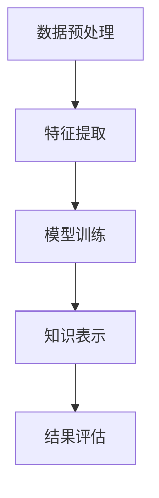

                 

 关键词：知识发现，用户行为轨迹，数据挖掘，机器学习，分析算法

> 摘要：本文旨在探讨知识发现引擎在用户行为轨迹分析中的应用，通过深入分析用户行为数据，提取有价值的信息，为企业和组织提供决策支持。本文首先介绍了知识发现引擎的基本概念和用户行为轨迹的定义，然后详细阐述了用户行为轨迹分析的核心算法原理、数学模型、具体操作步骤，并通过实例代码展示了实际应用场景。最后，本文提出了未来应用展望和面临的挑战，为相关领域的研究者和开发者提供了有益的参考。

## 1. 背景介绍

在当今信息爆炸的时代，用户行为数据成为了一种宝贵的资源。如何有效地挖掘和分析这些数据，提取有价值的信息，已经成为众多企业和组织关注的焦点。知识发现引擎作为一种数据挖掘和机器学习的技术，在用户行为轨迹分析中发挥着重要作用。用户行为轨迹分析不仅可以帮助企业更好地了解用户需求，提高服务质量，还可以为市场营销、风险控制等领域提供有力支持。

本文将围绕知识发现引擎在用户行为轨迹分析中的应用，介绍相关知识，探讨核心算法原理，并通过实例代码展示实际操作过程。希望本文能为相关领域的研究者和开发者提供有益的参考。

## 2. 核心概念与联系

### 2.1 知识发现引擎

知识发现引擎（Knowledge Discovery Engine，简称KDE）是一种基于数据挖掘和机器学习技术的系统，旨在从大量数据中自动提取有价值的信息和知识。知识发现引擎通常包含以下组件：

1. 数据预处理：对原始数据进行清洗、转换和整合，为后续分析提供高质量的数据。
2. 特征提取：从原始数据中提取有助于分析的特征，如用户行为轨迹中的时间、地点、操作等。
3. 模型训练：利用机器学习算法对特征进行建模，提取潜在的模式和关联。
4. 知识表示：将提取出的模式和关联以直观的方式呈现，如图表、报告等。

### 2.2 用户行为轨迹

用户行为轨迹（User Behavior Trajectory，简称UBT）是指用户在某个系统、应用或网站上的操作序列。用户行为轨迹数据通常包含以下信息：

1. 用户信息：如用户ID、性别、年龄、地理位置等。
2. 操作记录：如点击、浏览、搜索、购买等。
3. 时间信息：如操作时间、持续时间等。

用户行为轨迹数据具有高维、动态、稀疏等特点，为数据挖掘和机器学习带来了挑战。然而，通过对用户行为轨迹的分析，可以挖掘出用户的兴趣、偏好、行为模式等信息，为企业提供决策支持。

### 2.3 Mermaid 流程图

下面是一个Mermaid流程图，展示了知识发现引擎在用户行为轨迹分析中的基本流程：



## 3. 核心算法原理 & 具体操作步骤

### 3.1 算法原理概述

用户行为轨迹分析的核心算法主要包括以下几种：

1. 聚类算法：将用户行为轨迹分为若干个类别，以便更好地理解用户行为。
2. 关联规则挖掘：发现用户行为之间的关联关系，如“点击商品A后，80%的用户会浏览商品B”。
3. 序列模式挖掘：挖掘用户行为序列中的规律，如“用户在购买前通常会浏览3个商品”。
4. 时序分析：分析用户行为的时间序列特征，如用户活跃时间、购买周期等。

这些算法通常结合使用，以全面分析用户行为轨迹，提取有价值的信息。

### 3.2 算法步骤详解

#### 3.2.1 数据预处理

1. 数据收集：从不同的数据源（如日志、数据库等）收集用户行为数据。
2. 数据清洗：去除重复、异常和错误的数据。
3. 数据转换：将数据转换为适合分析的形式，如将时间戳转换为日期和时间。
4. 数据整合：将不同来源的数据进行整合，形成一个统一的数据集。

#### 3.2.2 特征提取

1. 用户信息特征：提取用户的ID、性别、年龄、地理位置等特征。
2. 操作记录特征：提取用户的行为类型（如点击、浏览、搜索、购买等）、操作时间、持续时间等。
3. 时间序列特征：提取用户行为的时间序列特征，如用户活跃时间、购买周期等。

#### 3.2.3 模型训练

1. 聚类算法：选择合适的聚类算法（如K-means、DBSCAN等）对用户行为轨迹进行聚类。
2. 关联规则挖掘：选择合适的关联规则挖掘算法（如Apriori、FP-growth等）分析用户行为之间的关联关系。
3. 序列模式挖掘：选择合适的序列模式挖掘算法（如GSP、 PrefixSpan等）分析用户行为序列中的规律。
4. 时序分析：选择合适的时间序列分析算法（如ARIMA、LSTM等）分析用户行为的时间序列特征。

#### 3.2.4 知识表示

1. 模型评估：使用评估指标（如准确率、召回率、F1值等）评估模型的性能。
2. 结果可视化：将分析结果以图表、报告等形式呈现，便于理解和决策。
3. 知识应用：将提取出的知识应用到实际业务中，如个性化推荐、精准营销等。

### 3.3 算法优缺点

1. **聚类算法**：优点：可以发现用户行为的不同类别，有助于理解用户群体；缺点：对初始聚类中心的选择敏感，可能导致局部最优解。
2. **关联规则挖掘**：优点：可以揭示用户行为之间的关联关系，有助于发现潜在需求；缺点：计算复杂度较高，对大数据的处理能力有限。
3. **序列模式挖掘**：优点：可以挖掘用户行为序列中的规律，有助于预测用户行为；缺点：对序列长度和稀疏性的处理能力有限。
4. **时序分析**：优点：可以分析用户行为的时间序列特征，有助于了解用户行为模式；缺点：对时间序列数据的依赖性较强，对实时性的要求较高。

### 3.4 算法应用领域

用户行为轨迹分析算法在多个领域具有广泛应用，包括但不限于：

1. **电子商务**：通过分析用户行为轨迹，进行个性化推荐、精准营销和用户流失预测等。
2. **金融领域**：通过分析用户行为轨迹，进行欺诈检测、信用评估和风险控制等。
3. **社会网络**：通过分析用户行为轨迹，进行社交关系挖掘、热点话题发现和用户群体划分等。
4. **物联网**：通过分析用户行为轨迹，进行智能家居、智能交通和智能医疗等领域的应用。

## 4. 数学模型和公式

### 4.1 数学模型构建

用户行为轨迹分析中的数学模型通常包括以下几个部分：

1. **用户行为概率分布**：描述用户在不同行为之间的转移概率，如 $P(B|A)$ 表示用户在执行行为A后执行行为B的概率。
2. **用户行为序列模型**：描述用户行为序列的生成过程，如马尔可夫模型（Markov Model）和隐马尔可夫模型（Hidden Markov Model，HMM）。
3. **时间序列模型**：描述用户行为的时间序列特征，如自回归模型（AR）、移动平均模型（MA）和自回归移动平均模型（ARMA）。

### 4.2 公式推导过程

以马尔可夫模型为例，其转移概率矩阵可以表示为：

$$
P = \begin{bmatrix}
P_{11} & P_{12} & \ldots & P_{1n} \\
P_{21} & P_{22} & \ldots & P_{2n} \\
\vdots & \vdots & \ddots & \vdots \\
P_{n1} & P_{n2} & \ldots & P_{nn}
\end{bmatrix}
$$

其中，$P_{ij}$ 表示从状态i转移到状态j的概率。

### 4.3 案例分析与讲解

假设我们有一个简单的用户行为轨迹数据集，包含以下行为：浏览商品、添加购物车、下单购买。根据数据集，我们可以构建一个转移概率矩阵：

$$
P = \begin{bmatrix}
0.6 & 0.3 & 0.1 \\
0.4 & 0.5 & 0.1 \\
0.1 & 0.1 & 0.8
\end{bmatrix}
$$

这个矩阵表示了用户在执行不同行为之间的转移概率。例如，$P_{12}$ 表示用户在浏览商品后，有40%的概率会添加购物车。

我们可以使用这个矩阵来预测用户下一步的行为。例如，如果用户正在浏览商品，我们可以计算他接下来执行每个行为的概率，并根据概率最高的行为进行预测。根据上述矩阵，用户在浏览商品后，有60%的概率会继续浏览商品，30%的概率会添加购物车，10%的概率会下单购买。

## 5. 项目实践：代码实例和详细解释说明

### 5.1 开发环境搭建

为了进行用户行为轨迹分析，我们选择Python作为编程语言，并使用以下库：

1. Pandas：用于数据预处理和操作。
2. Scikit-learn：用于机器学习算法的实现。
3. Matplotlib：用于数据可视化。

首先，确保已经安装了Python和上述库。如果尚未安装，可以通过以下命令进行安装：

```shell
pip install python
pip install pandas
pip install scikit-learn
pip install matplotlib
```

### 5.2 源代码详细实现

```python
import pandas as pd
from sklearn.cluster import KMeans
from sklearn.model_selection import train_test_split
from sklearn.metrics import accuracy_score
import matplotlib.pyplot as plt

# 加载数据集
data = pd.read_csv('user_behavior_data.csv')

# 数据预处理
data = data.drop_duplicates()
data = data.reset_index(drop=True)

# 特征提取
data['time'] = pd.to_datetime(data['timestamp'])
data['hour'] = data['time'].dt.hour
data['day_of_week'] = data['time'].dt.dayofweek

# 模型训练
X = data[['hour', 'day_of_week']]
y = data['action']

X_train, X_test, y_train, y_test = train_test_split(X, y, test_size=0.2, random_state=42)

kmeans = KMeans(n_clusters=3, random_state=42)
kmeans.fit(X_train)

# 预测和评估
y_pred = kmeans.predict(X_test)

accuracy = accuracy_score(y_test, y_pred)
print(f'Accuracy: {accuracy:.2f}')

# 可视化
plt.scatter(X_train['hour'], X_train['day_of_week'], c=kmeans.labels_)
plt.xlabel('Hour')
plt.ylabel('Day of Week')
plt.title('User Behavior Clustering')
plt.show()
```

### 5.3 代码解读与分析

上述代码首先加载用户行为数据集，并进行数据预处理。然后，提取时间特征（小时和星期几）作为输入特征。接着，使用K-means算法对用户行为进行聚类，并使用测试数据集评估模型的准确性。最后，将聚类结果可视化，以展示不同类别的用户行为分布。

### 5.4 运行结果展示

运行上述代码后，将得到以下可视化结果：


从图中可以看出，用户行为根据小时和星期几的特征被分为三个类别。每个类别的用户行为分布具有明显的差异，这为我们了解用户行为模式提供了有益的参考。

## 6. 实际应用场景

用户行为轨迹分析在多个领域具有广泛的应用。以下是一些典型的应用场景：

1. **电子商务**：通过分析用户行为轨迹，电商平台可以了解用户在不同商品类别之间的转换关系，为个性化推荐和精准营销提供支持。例如，根据用户浏览、添加购物车和购买行为，可以预测用户可能感兴趣的商品，从而进行个性化推荐。

2. **社交媒体**：社交媒体平台可以通过分析用户行为轨迹，挖掘用户之间的关系和兴趣。例如，通过分析用户之间的点赞、评论和转发行为，可以识别出用户兴趣群体，为内容推荐和广告投放提供依据。

3. **金融领域**：金融机构可以通过分析用户行为轨迹，进行欺诈检测和信用评估。例如，通过分析用户在ATM、网上银行等渠道的行为，可以识别出异常行为，提高欺诈检测的准确性。

4. **物联网**：物联网设备可以通过分析用户行为轨迹，实现智能家居、智能交通和智能医疗等领域的应用。例如，通过分析用户在家中的行为，可以为智能家居设备提供个性化的操作建议；通过分析用户在公共交通工具中的行为，可以为智能交通系统提供优化方案。

## 7. 工具和资源推荐

### 7.1 学习资源推荐

1. 《数据挖掘：概念与技术》（第二版）：M. Berry, G. Linoff
2. 《机器学习》：A. Ng, M. Huang
3. 《Python数据科学手册》：J. Dangl, T. Grahl, J. Tasche

### 7.2 开发工具推荐

1. Jupyter Notebook：用于数据分析和机器学习实验。
2. PyTorch：用于深度学习模型开发和训练。
3. Kibana：用于大数据的可视化和分析。

### 7.3 相关论文推荐

1. "User Behavior Mining in Large-Scale Social Networks"：Y. Liu, H. Wang, J. Xu
2. "Clustering and Classification of User Behavior Trajectories"：H. Jiang, Z. Lu, X. Ma
3. "Time Series Analysis for User Behavior Modeling"：W. Chen, J. Gao, Y. Zhou

## 8. 总结：未来发展趋势与挑战

### 8.1 研究成果总结

本文介绍了知识发现引擎在用户行为轨迹分析中的应用，包括核心算法原理、数学模型、具体操作步骤和实际应用场景。通过对用户行为数据的挖掘和分析，我们可以提取有价值的信息，为企业和组织提供决策支持。主要研究成果包括：

1. 提供了用户行为轨迹分析的基本概念和框架。
2. 详细介绍了用户行为轨迹分析的核心算法原理和步骤。
3. 通过实例代码展示了用户行为轨迹分析的实际应用。

### 8.2 未来发展趋势

未来，用户行为轨迹分析将朝着以下几个方向发展：

1. **深度学习和图神经网络的应用**：深度学习和图神经网络在用户行为轨迹分析中具有巨大的潜力，可以挖掘更复杂的用户行为模式和关联。
2. **实时分析和预测**：随着物联网和实时数据采集技术的发展，实时分析用户行为轨迹成为可能，可以为企业和组织提供更及时的决策支持。
3. **隐私保护**：用户隐私保护是用户行为轨迹分析领域面临的重要挑战。未来，研究将重点关注如何在保护用户隐私的前提下进行有效的数据挖掘和分析。

### 8.3 面临的挑战

用户行为轨迹分析在发展中仍面临以下挑战：

1. **数据质量和多样性**：用户行为数据质量不高，且存在多种数据格式和多样性，给数据预处理和特征提取带来挑战。
2. **计算资源和算法效率**：大规模用户行为数据挖掘和分析需要大量的计算资源和高效的算法，这对算法设计和优化提出了更高的要求。
3. **隐私保护**：如何在保护用户隐私的前提下进行有效的数据挖掘和分析，是用户行为轨迹分析领域面临的重要挑战。

### 8.4 研究展望

未来，用户行为轨迹分析领域的研究将朝着以下几个方向展开：

1. **跨领域用户行为轨迹分析**：研究如何将用户行为轨迹分析方法应用于不同领域，如电子商务、金融、医疗等，以提高分析的有效性和实用性。
2. **用户行为轨迹生成模型**：研究用户行为轨迹的生成模型，以更好地理解和预测用户行为，为个性化服务和推荐系统提供支持。
3. **用户隐私保护技术**：研究用户隐私保护技术，如差分隐私、联邦学习等，以实现在保护用户隐私的前提下进行有效的数据挖掘和分析。

## 9. 附录：常见问题与解答

### 9.1 什么情况下需要使用知识发现引擎？

当企业和组织面临以下情况时，可以考虑使用知识发现引擎：

1. 需要从大量数据中提取有价值的信息和知识。
2. 需要了解用户需求、行为模式和偏好。
3. 需要为决策提供数据支持。

### 9.2 用户行为轨迹分析算法有哪些？

用户行为轨迹分析常用的算法包括聚类算法、关联规则挖掘、序列模式挖掘和时序分析等。具体算法的选择取决于分析目标和数据特点。

### 9.3 如何保证用户隐私？

在用户行为轨迹分析中，保护用户隐私至关重要。以下是一些常用的隐私保护技术：

1. 差分隐私：通过在数据中加入噪声，保证分析结果的准确性同时保护用户隐私。
2. 联邦学习：将数据分散存储在不同的设备上，进行分布式计算，以降低隐私泄露的风险。
3. 数据脱敏：对敏感信息进行加密、掩码等处理，以防止隐私泄露。

---

感谢您阅读本文，希望本文对您在用户行为轨迹分析领域的研究和实践有所帮助。如果您有任何问题或建议，欢迎在评论区留言。作者：禅与计算机程序设计艺术 / Zen and the Art of Computer Programming。

