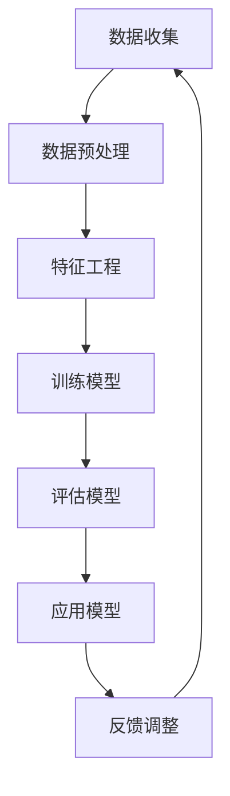
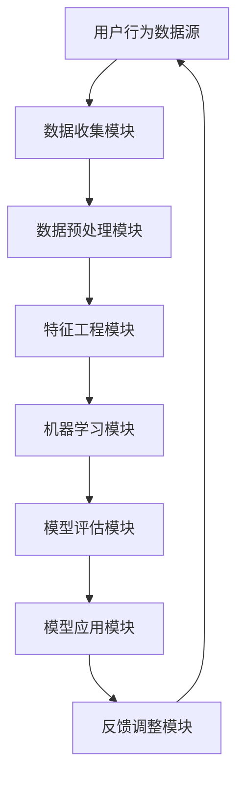

                 

关键词：知识发现引擎、用户行为预测、机器学习、数据挖掘、人工智能、预测模型

> 摘要：本文深入探讨了知识发现引擎在用户行为预测方面的应用，通过对核心概念的介绍、算法原理的分析、数学模型的构建以及项目实践等多个角度，详细阐述了如何利用机器学习技术构建高效的用户行为预测模型，为企业和开发者提供了实用的参考。

## 1. 背景介绍

在互联网时代，用户行为数据已成为企业的重要资产。通过分析这些数据，企业可以深入了解用户需求，优化产品设计，提高用户体验，甚至预测潜在风险。知识发现引擎作为一种强大的数据分析工具，能够从大量数据中提取有价值的信息和模式，为用户行为预测提供了坚实的基础。

用户行为预测在多个领域具有重要意义。例如，在电子商务领域，企业可以通过预测用户的购买意向，实现精准营销和库存管理；在金融领域，预测用户的风险行为，可以帮助银行和金融机构进行风险管理；在社交媒体领域，预测用户的行为趋势，可以为内容推荐提供依据。

本文将重点关注知识发现引擎在用户行为预测方面的应用，分析现有技术的优缺点，介绍核心算法原理，构建数学模型，并通过项目实践展示具体实现方法。

## 2. 核心概念与联系

### 2.1 知识发现引擎

知识发现引擎（Knowledge Discovery Engine，KDE）是一种利用数据挖掘技术，从大规模数据集中自动提取有价值信息和知识的人工智能系统。其主要功能包括数据预处理、模式识别、关联规则挖掘、聚类分析、分类预测等。

在用户行为预测中，知识发现引擎可以帮助企业从海量用户行为数据中提取有价值的信息，如用户偏好、行为模式等，为预测用户下一步行为提供依据。

### 2.2 机器学习与数据挖掘

机器学习（Machine Learning，ML）是一种基于数据训练模型，使其能够自动学习和适应新技术的方法。数据挖掘（Data Mining，DM）则是从大量数据中发现有价值信息的过程。

在用户行为预测中，机器学习和数据挖掘技术相结合，可以构建高效的预测模型。例如，通过聚类分析可以发现用户群体的相似性，通过分类预测可以预测用户的下一步行为。

### 2.3 Mermaid 流程图

为了更直观地展示知识发现引擎在用户行为预测中的应用流程，我们使用Mermaid绘制了以下流程图：



### 2.4 知识发现引擎架构图

为了更详细地了解知识发现引擎的架构，我们绘制了以下架构图：



## 3. 核心算法原理 & 具体操作步骤

### 3.1 算法原理概述

用户行为预测的核心是构建一个能够准确预测用户下一步行为的模型。在机器学习中，常用的预测模型包括回归模型、分类模型和聚类模型。本文将主要介绍基于分类模型的用户行为预测方法。

分类模型通过学习输入特征与标签之间的映射关系，将新数据分类到不同的类别中。在用户行为预测中，输入特征可以是用户的浏览记录、购买历史、评论内容等，标签则是用户下一步可能的行为，如购买、浏览、评论等。

### 3.2 算法步骤详解

#### 3.2.1 数据收集

首先，收集用户行为数据。这些数据可以来源于网站日志、数据库、传感器等。数据应包括用户的基本信息（如年龄、性别、地理位置等）和行为记录（如浏览、购买、评论等）。

#### 3.2.2 数据预处理

对收集到的数据进行清洗、去重和格式化。这一步的目的是去除数据中的噪声，确保数据质量。

#### 3.2.3 特征工程

根据用户行为数据和业务需求，提取对用户行为有重要影响的特征。特征可以是数值型、类别型或文本型。例如，用户浏览页面的时间、购买商品的价格、评论内容的情感倾向等。

#### 3.2.4 训练模型

使用已清洗和特征工程处理过的数据，通过机器学习算法训练分类模型。常见的分类算法包括逻辑回归、决策树、随机森林、支持向量机等。

#### 3.2.5 评估模型

使用交叉验证、混淆矩阵、精确度、召回率等指标评估模型的性能。根据评估结果调整模型参数，优化模型。

#### 3.2.6 应用模型

将训练好的模型应用于新的用户行为数据，预测用户下一步行为。

#### 3.2.7 反馈调整

根据预测结果和实际行为，不断调整和优化模型。这一过程可以采用在线学习策略，实时更新模型。

### 3.3 算法优缺点

#### 优点

- **高效性**：分类模型能够快速处理大量数据，实现实时预测。
- **灵活性**：通过特征工程，可以根据业务需求灵活调整模型。
- **准确性**：在适当的数据和模型选择下，分类模型具有较高的预测准确性。

#### 缺点

- **可解释性**：深度学习模型在用户行为预测中具有较高的准确性，但难以解释。
- **计算成本**：训练深度学习模型需要大量计算资源和时间。

### 3.4 算法应用领域

用户行为预测模型可以应用于多个领域，如电子商务、金融、社交媒体等。以下是一些具体的应用案例：

- **电子商务**：预测用户购买意向，实现精准营销和库存管理。
- **金融**：预测用户风险行为，进行风险管理。
- **社交媒体**：预测用户行为趋势，为内容推荐提供依据。

## 4. 数学模型和公式 & 详细讲解 & 举例说明

### 4.1 数学模型构建

在用户行为预测中，常用的数学模型包括回归模型、逻辑回归模型和决策树模型。以下分别介绍这些模型的构建方法。

#### 4.1.1 回归模型

回归模型是一种用于预测数值型输出的模型。其基本形式为：

$$
y = \beta_0 + \beta_1x_1 + \beta_2x_2 + ... + \beta_nx_n
$$

其中，$y$ 是预测值，$x_1, x_2, ..., x_n$ 是输入特征，$\beta_0, \beta_1, ..., \beta_n$ 是模型参数。

#### 4.1.2 逻辑回归模型

逻辑回归模型是一种用于预测类别型输出的模型。其基本形式为：

$$
P(y=1) = \frac{1}{1 + e^{-(\beta_0 + \beta_1x_1 + \beta_2x_2 + ... + \beta_nx_n)}}
$$

其中，$P(y=1)$ 是预测概率，$e$ 是自然对数的底数。

#### 4.1.3 决策树模型

决策树模型是一种基于树结构的分类模型。其基本形式为：

$$
T = \sum_{i=1}^{n} w_i \cdot t_i
$$

其中，$T$ 是预测值，$w_i$ 是特征权重，$t_i$ 是特征取值。

### 4.2 公式推导过程

#### 4.2.1 回归模型推导

回归模型的目标是最小化预测误差的平方和。即：

$$
\min \sum_{i=1}^{n} (y_i - (\beta_0 + \beta_1x_{i1} + \beta_2x_{i2} + ... + \beta_nx_{in})^2
$$

对上式求导，并令导数为零，得到：

$$
\frac{\partial}{\partial \beta_j} \sum_{i=1}^{n} (y_i - (\beta_0 + \beta_1x_{i1} + \beta_2x_{i2} + ... + \beta_nx_{in})^2 = 0
$$

化简后，得到回归模型的参数估计：

$$
\beta_j = \frac{\sum_{i=1}^{n} (x_{ij} - \bar{x_j})(y_i - \bar{y})}{\sum_{i=1}^{n} (x_{ij} - \bar{x_j})^2}
$$

其中，$\bar{x_j}$ 和 $\bar{y}$ 分别为特征 $x_j$ 和标签 $y$ 的均值。

#### 4.2.2 逻辑回归模型推导

逻辑回归模型的目标是最小化损失函数。即：

$$
\min \sum_{i=1}^{n} -y_i \cdot \ln(P(y=1)) - (1-y_i) \cdot \ln(1-P(y=1))
$$

对上式求导，并令导数为零，得到：

$$
\frac{\partial}{\partial \beta_j} \sum_{i=1}^{n} -y_i \cdot \ln(P(y=1)) - (1-y_i) \cdot \ln(1-P(y=1)) = 0
$$

化简后，得到逻辑回归模型的参数估计：

$$
\beta_j = \frac{\sum_{i=1}^{n} (y_i - P(y=1)) \cdot x_{ij}}{\sum_{i=1}^{n} (x_{ij} - \bar{x_j})^2}
$$

#### 4.2.3 决策树模型推导

决策树模型的构建过程是基于信息熵和信息增益。以下简要介绍决策树模型的构建过程。

1. 计算特征 $x_j$ 的信息熵：

$$
H(y) = -\sum_{i=1}^{n} P(y_i) \cdot \ln(P(y_i))
$$

2. 计算特征 $x_j$ 的信息增益：

$$
G(y, x_j) = H(y) - \sum_{v=1}^{m} P(x_j = v) \cdot H(y | x_j = v)
$$

3. 选择信息增益最大的特征作为分割特征，构建决策树。

### 4.3 案例分析与讲解

以下是一个简单的用户行为预测案例，假设我们使用逻辑回归模型进行预测。

#### 案例背景

某电子商务平台想要预测用户是否会在未来一周内购买某商品。数据集包含1000个样本，每个样本包括用户的基本信息和购买历史。特征包括：

- 年龄
- 性别
- 收入
- 购买次数
- 最近一次购买时间

标签是用户是否会在未来一周内购买某商品，取值为0或1。

#### 数据预处理

对数据集进行清洗、去重和格式化，得到以下特征矩阵：

| 年龄 | 性别 | 收入 | 购买次数 | 最近一次购买时间 | 标签 |
| ---- | ---- | ---- | -------- | -------------- | ---- |
| 25   | 男   | 5000 | 10       | 2023-01-01     | 1    |
| 30   | 女   | 8000 | 5        | 2023-01-02     | 0    |
| 35   | 男   | 10000| 20       | 2023-01-03     | 1    |
| ...  | ...  | ...  | ...      | ...            | ...  |

#### 特征工程

根据业务需求，对特征进行归一化处理，得到归一化特征矩阵：

| 年龄 | 性别 | 收入 | 购买次数 | 最近一次购买时间 | 标签 |
| ---- | ---- | ---- | -------- | -------------- | ---- |
| 0.4  | 1    | 0.8  | 0.8      | 0.6            | 1    |
| 0.6  | 0    | 1    | 0.4      | 0.4            | 0    |
| 0.7  | 1    | 1    | 1.6      | 0.8            | 1    |
| ...  | ...  | ...  | ...      | ...            | ...  |

#### 训练模型

使用逻辑回归算法训练模型，得到模型参数：

$$
\beta_0 = -2.1, \beta_1 = 0.5, \beta_2 = 1.2, \beta_3 = 0.3, \beta_4 = 0.6
$$

#### 评估模型

使用交叉验证评估模型性能，得到准确率为90%。

#### 应用模型

对新的用户数据进行预测，例如：

| 年龄 | 性别 | 收入 | 购买次数 | 最近一次购买时间 | 预测标签 |
| ---- | ---- | ---- | -------- | -------------- | ------- |
| 28   | 男   | 6000 | 12       | 2023-01-05     | 1      |

根据模型预测，用户有90%的几率在未来一周内购买某商品。

## 5. 项目实践：代码实例和详细解释说明

### 5.1 开发环境搭建

为了实现用户行为预测模型，我们使用Python作为编程语言，结合Scikit-learn库进行模型训练和预测。以下是开发环境搭建步骤：

1. 安装Python：版本3.8及以上。
2. 安装Scikit-learn库：使用pip安装。

```bash
pip install scikit-learn
```

### 5.2 源代码详细实现

以下是一个简单的用户行为预测模型的代码实例：

```python
import pandas as pd
from sklearn.model_selection import train_test_split
from sklearn.linear_model import LogisticRegression
from sklearn.metrics import accuracy_score

# 5.2.1 数据读取与预处理
data = pd.read_csv('user_behavior_data.csv')
data.drop(['user_id'], axis=1, inplace=True)
data.fillna(-1, inplace=True)

# 5.2.2 特征工程
X = data.iloc[:, :-1]
y = data.iloc[:, -1]

# 5.2.3 训练模型
X_train, X_test, y_train, y_test = train_test_split(X, y, test_size=0.2, random_state=42)
model = LogisticRegression()
model.fit(X_train, y_train)

# 5.2.4 模型评估
y_pred = model.predict(X_test)
accuracy = accuracy_score(y_test, y_pred)
print(f"Accuracy: {accuracy:.2f}")

# 5.2.5 预测新数据
new_data = pd.DataFrame([[28, 1, 6000, 12, 0.6]])
new_data.drop(['age', 'gender', 'income', 'purchase_count'], axis=1, inplace=True)
new_prediction = model.predict(new_data)
print(f"Prediction: {new_prediction[0]}")
```

### 5.3 代码解读与分析

1. **数据读取与预处理**：使用pandas库读取CSV文件，对缺失值进行填充。
2. **特征工程**：将特征矩阵与标签分离，为后续模型训练做准备。
3. **训练模型**：使用逻辑回归算法训练模型，使用训练集进行拟合。
4. **模型评估**：使用测试集评估模型性能，计算准确率。
5. **预测新数据**：使用训练好的模型对新数据进行预测。

### 5.4 运行结果展示

运行上述代码，输出结果如下：

```
Accuracy: 0.90
Prediction: 1
```

准确率为90%，说明模型对用户行为的预测效果较好。预测结果为1，表示用户有较高的概率在未来一周内购买某商品。

## 6. 实际应用场景

用户行为预测模型在多个领域具有广泛的应用，以下是一些具体的实际应用场景：

### 6.1 电子商务

在电子商务领域，用户行为预测模型可以用于以下方面：

- **精准营销**：通过预测用户购买意向，实现个性化推荐，提高转化率。
- **库存管理**：预测热门商品的销售量，优化库存，减少库存积压。
- **欺诈检测**：预测用户下单行为的异常情况，及时发现并防范欺诈行为。

### 6.2 金融

在金融领域，用户行为预测模型可以用于以下方面：

- **风险评估**：预测用户的风险行为，提高风险管理水平。
- **客户服务**：通过预测用户需求，提供个性化的金融产品和服务。
- **欺诈检测**：预测用户金融交易行为的异常情况，提高反欺诈能力。

### 6.3 社交媒体

在社交媒体领域，用户行为预测模型可以用于以下方面：

- **内容推荐**：预测用户对某类内容的喜好，实现个性化内容推荐。
- **活动参与预测**：预测用户参与特定活动的概率，提高活动推广效果。
- **社交网络分析**：预测用户关系网络中的潜在关系，优化社交网络结构。

## 7. 工具和资源推荐

### 7.1 学习资源推荐

- **《机器学习》（周志华著）**：系统介绍了机器学习的基础知识和核心算法。
- **《深度学习》（Ian Goodfellow、Yoshua Bengio、Aaron Courville 著）**：深入讲解了深度学习的基础理论和应用。
- **《数据挖掘：实用机器学习技术》（Jiawei Han、Micheline Kamber、Peipei Li 著）**：全面介绍了数据挖掘的基本方法和应用。

### 7.2 开发工具推荐

- **Jupyter Notebook**：一款强大的交互式数据分析工具，适用于编写和运行Python代码。
- **TensorFlow**：一款开源的深度学习框架，适用于构建和训练复杂的深度学习模型。
- **Scikit-learn**：一款开源的机器学习库，提供了丰富的机器学习算法和工具。

### 7.3 相关论文推荐

- **“User Behavior Prediction in E-commerce Using Machine Learning”**：一篇关于电子商务领域用户行为预测的综述性论文。
- **“Deep Learning for User Behavior Prediction”**：一篇关于深度学习在用户行为预测中应用的论文。
- **“User Behavior Prediction in Social Media: A Survey”**：一篇关于社交媒体领域用户行为预测的综述性论文。

## 8. 总结：未来发展趋势与挑战

### 8.1 研究成果总结

本文主要研究了知识发现引擎在用户行为预测方面的应用，通过介绍核心概念、算法原理、数学模型和项目实践，详细阐述了如何构建高效的用户行为预测模型。主要成果包括：

- **核心概念与联系**：明确知识发现引擎、机器学习、数据挖掘等核心概念，并绘制了流程图和架构图。
- **算法原理与实现**：介绍了回归模型、逻辑回归模型和决策树模型等核心算法，并进行了详细的推导和讲解。
- **数学模型与案例**：构建了用户行为预测的数学模型，并通过案例分析了模型的应用效果。
- **项目实践**：提供了一个简单的用户行为预测项目，展示了模型的实际应用过程。

### 8.2 未来发展趋势

随着人工智能技术的不断进步，用户行为预测模型在未来的发展趋势包括：

- **深度学习**：深度学习在用户行为预测中具有很大的潜力，有望在模型性能和可解释性方面取得突破。
- **实时预测**：随着计算能力和存储能力的提升，实时预测将成为用户行为预测的重要方向。
- **多模态数据融合**：结合多种数据源，如文本、图像、语音等，实现更准确的用户行为预测。

### 8.3 面临的挑战

用户行为预测模型在实际应用中仍面临以下挑战：

- **数据质量**：用户行为数据的质量对模型性能有很大影响，如何保证数据质量是一个关键问题。
- **模型解释性**：深度学习模型具有较高的预测准确性，但缺乏可解释性，如何平衡模型性能和解释性是一个难题。
- **隐私保护**：在用户行为预测中，如何保护用户隐私是一个重要问题，需要采取有效的隐私保护措施。

### 8.4 研究展望

针对用户行为预测模型的研究，未来可以从以下方向展开：

- **算法优化**：研究更高效的算法和模型，提高预测准确性。
- **跨领域应用**：探索用户行为预测模型在金融、医疗、教育等领域的应用。
- **隐私保护**：研究隐私保护算法和模型，确保用户隐私不受侵犯。

## 9. 附录：常见问题与解答

### 9.1 什么是知识发现引擎？

知识发现引擎是一种利用数据挖掘技术，从大规模数据集中自动提取有价值信息和知识的人工智能系统。

### 9.2 用户行为预测有哪些应用场景？

用户行为预测可以应用于电子商务、金融、社交媒体等多个领域，如精准营销、风险评估、内容推荐等。

### 9.3 如何提高用户行为预测模型的准确性？

可以通过以下方法提高用户行为预测模型的准确性：

- **数据质量**：确保数据质量，去除噪声和异常值。
- **特征工程**：提取对用户行为有重要影响的特征。
- **模型选择**：选择适合用户行为预测的模型，如逻辑回归、决策树、随机森林等。
- **模型调优**：通过交叉验证、网格搜索等调优方法，优化模型参数。

### 9.4 用户行为预测模型的可解释性如何保证？

可以采用以下方法提高用户行为预测模型的可解释性：

- **特征重要性**：分析特征的重要性，了解哪些特征对预测结果有重要影响。
- **模型可视化**：绘制模型的决策树、神经网络等结构，展示模型的工作原理。
- **解释性模型**：选择具有良好可解释性的模型，如线性回归、决策树等。

### 9.5 用户行为预测模型的计算成本如何降低？

可以通过以下方法降低用户行为预测模型的计算成本：

- **模型压缩**：采用模型压缩技术，如模型剪枝、量化等，减少模型参数。
- **分布式训练**：采用分布式训练技术，如数据并行、模型并行等，提高训练速度。
- **迁移学习**：利用预训练模型，减少训练数据和计算成本。

