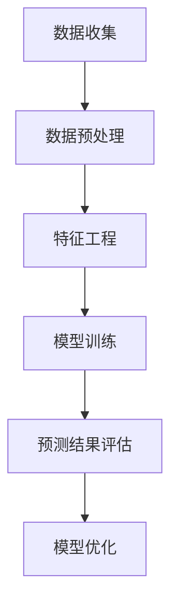

                 

关键词：知识发现、用户行为预测、机器学习、数据挖掘、模型构建、应用场景

> 摘要：本文主要介绍了知识发现引擎的用户行为预测模型。通过对用户行为的深入分析，本文提出了一种基于机器学习和数据挖掘技术的预测模型，并详细阐述了其核心概念、算法原理、数学模型以及在实际项目中的应用。本文旨在为相关领域的研究人员和开发者提供有价值的参考。

## 1. 背景介绍

在当今信息爆炸的时代，如何从海量的数据中提取有价值的信息，一直是学术界和工业界关注的焦点。知识发现（Knowledge Discovery in Databases，简称KDD）作为一种从数据中发现知识的过程，旨在通过智能化的方法，从原始数据中挖掘出潜在的模式、关联和趋势。用户行为预测作为知识发现的一个重要分支，对于提升用户体验、优化产品设计、增强用户粘性等方面具有重要意义。

用户行为预测旨在通过分析用户的历史行为数据，预测用户在未来的行为倾向。这在电子商务、社交网络、在线教育等多个领域都有着广泛的应用。例如，在电子商务领域，通过对用户购买行为的预测，可以为精准营销、个性化推荐等提供有力支持；在社交网络领域，通过预测用户之间的互动关系，可以帮助平台优化推荐算法，提高用户参与度。

然而，用户行为预测并非易事。用户行为数据通常具有高维度、非线性和稀疏性等特点，使得传统的预测方法难以直接应用。因此，本文将介绍一种基于机器学习和数据挖掘技术的用户行为预测模型，旨在解决这一问题。

## 2. 核心概念与联系

### 2.1 数据挖掘流程

数据挖掘（Data Mining）是指从大量数据中提取有价值信息的过程。其基本流程包括数据预处理、模式识别、模型评估等步骤。其中，模式识别是数据挖掘的核心环节，它通过统计方法、机器学习方法等，从数据中挖掘出潜在的模式和关联。

### 2.2 机器学习算法

机器学习（Machine Learning）是数据挖掘的重要工具之一。它通过构建模型，自动从数据中学习规律和模式，从而实现对未知数据的预测和分类。常见的机器学习算法包括线性回归、决策树、支持向量机、神经网络等。

### 2.3 用户行为预测模型架构

用户行为预测模型通常包括数据收集、数据预处理、特征工程、模型训练和预测等步骤。其中，数据收集和预处理是基础，特征工程和模型训练是关键。用户行为预测模型的架构如图1所示。



### 2.4 用户行为数据类型

用户行为数据主要包括以下几类：

1. **行为日志**：记录用户在网站或应用上的操作行为，如浏览、点击、搜索、购买等。
2. **用户画像**：通过用户基本信息、兴趣标签、社交关系等数据，对用户进行画像。
3. **环境信息**：包括设备类型、地理位置、时间戳等，用于辅助预测。

## 3. 核心算法原理 & 具体操作步骤

### 3.1 算法原理概述

本文采用了一种基于深度学习技术的用户行为预测模型。该模型通过构建一个多层次的神经网络，自动从数据中学习用户行为规律，实现对用户行为的预测。具体来说，模型主要包括以下三个部分：

1. **输入层**：接收用户行为数据、用户画像和环境信息。
2. **隐藏层**：通过神经网络结构，对输入数据进行特征提取和融合。
3. **输出层**：根据隐藏层输出的特征，预测用户未来的行为。

### 3.2 算法步骤详解

1. **数据收集**：收集用户行为日志、用户画像和环境信息。
2. **数据预处理**：对数据进行清洗、去噪、归一化等处理。
3. **特征工程**：根据业务需求，提取用户行为的特征，如时间间隔、用户活跃度、行为模式等。
4. **模型训练**：构建神经网络模型，并使用训练数据对其进行训练。
5. **模型评估**：使用验证集对模型进行评估，调整模型参数。
6. **预测**：使用训练好的模型对未知数据进行预测。

### 3.3 算法优缺点

**优点**：

- **自动化**：神经网络模型可以自动从数据中学习特征，减少人工干预。
- **泛化能力强**：深度学习模型具有较强的泛化能力，适用于多种用户行为预测场景。
- **适应性强**：可以处理高维度、非线性、稀疏的用户行为数据。

**缺点**：

- **计算复杂度高**：深度学习模型需要大量计算资源，训练时间较长。
- **数据依赖性强**：模型性能依赖于数据质量和数量，对噪声数据敏感。

### 3.4 算法应用领域

用户行为预测模型在以下领域具有广泛应用：

- **电子商务**：预测用户购买行为，实现个性化推荐。
- **社交网络**：预测用户之间的互动关系，优化推荐算法。
- **在线教育**：预测用户学习行为，提升学习效果。
- **金融风控**：预测用户风险行为，防范金融诈骗。

## 4. 数学模型和公式 & 详细讲解 & 举例说明

### 4.1 数学模型构建

用户行为预测模型可以看作是一个多变量非线性回归问题。其数学模型可以表示为：

$$ y = f(x_1, x_2, ..., x_n) $$

其中，$y$ 表示用户未来的行为，$x_1, x_2, ..., x_n$ 表示用户历史行为数据、用户画像和环境信息。

### 4.2 公式推导过程

为了构建用户行为预测模型，我们可以采用反向传播算法（Backpropagation Algorithm）来训练神经网络。具体推导过程如下：

1. **前向传播**：将输入数据 $x$ 通过神经网络进行传递，得到输出值 $y$。

$$ y = \sigma(\boldsymbol{W}^T \cdot \boldsymbol{z} + b) $$

其中，$\sigma$ 表示激活函数，$\boldsymbol{W}$ 表示权重矩阵，$\boldsymbol{z}$ 表示隐藏层输出，$b$ 表示偏置项。

2. **计算损失函数**：使用均方误差（Mean Squared Error，MSE）作为损失函数。

$$ J = \frac{1}{2} \sum_{i=1}^{n} (y_i - \hat{y}_i)^2 $$

其中，$n$ 表示样本数量，$y_i$ 表示实际值，$\hat{y}_i$ 表示预测值。

3. **反向传播**：计算梯度，更新权重和偏置项。

$$ \frac{\partial J}{\partial \boldsymbol{W}} = \frac{1}{n} \sum_{i=1}^{n} (y_i - \hat{y}_i) \cdot \frac{\partial \hat{y}_i}{\partial \boldsymbol{W}} $$

$$ \frac{\partial J}{\partial b} = \frac{1}{n} \sum_{i=1}^{n} (y_i - \hat{y}_i) \cdot \frac{\partial \hat{y}_i}{\partial b} $$

4. **梯度下降**：使用梯度下降算法更新权重和偏置项。

$$ \boldsymbol{W} \leftarrow \boldsymbol{W} - \alpha \cdot \frac{\partial J}{\partial \boldsymbol{W}} $$

$$ b \leftarrow b - \alpha \cdot \frac{\partial J}{\partial b} $$

其中，$\alpha$ 表示学习率。

### 4.3 案例分析与讲解

假设我们有一个用户行为预测任务，目标是预测用户是否会购买某件商品。输入特征包括用户年龄、性别、收入、购买历史等信息。输出为是否购买的二分类结果。

1. **数据预处理**：对输入特征进行归一化处理，确保特征之间具有相同的尺度。

2. **特征工程**：提取用户行为的特征，如最近一次购买时间、购买频率等。

3. **模型训练**：构建一个多层神经网络，使用训练数据对其进行训练。

4. **模型评估**：使用验证集对模型进行评估，调整模型参数。

5. **预测**：使用训练好的模型对测试数据进行预测。

## 5. 项目实践：代码实例和详细解释说明

### 5.1 开发环境搭建

为了实现用户行为预测模型，我们需要安装以下软件和库：

- Python 3.x
- TensorFlow 2.x
- Pandas
- Scikit-learn
- Numpy

### 5.2 源代码详细实现

以下是用户行为预测模型的实现代码：

```python
import tensorflow as tf
from tensorflow.keras.models import Sequential
from tensorflow.keras.layers import Dense, Dropout
from sklearn.model_selection import train_test_split
from sklearn.preprocessing import StandardScaler
import pandas as pd

# 读取数据
data = pd.read_csv('user_behavior_data.csv')

# 数据预处理
X = data.iloc[:, :-1].values
y = data.iloc[:, -1].values

# 特征工程
scaler = StandardScaler()
X = scaler.fit_transform(X)

# 模型训练
X_train, X_test, y_train, y_test = train_test_split(X, y, test_size=0.2, random_state=42)

model = Sequential([
    Dense(64, activation='relu', input_shape=(X_train.shape[1],)),
    Dropout(0.5),
    Dense(32, activation='relu'),
    Dropout(0.5),
    Dense(1, activation='sigmoid')
])

model.compile(optimizer='adam', loss='binary_crossentropy', metrics=['accuracy'])

model.fit(X_train, y_train, epochs=10, batch_size=32, validation_data=(X_test, y_test))

# 模型评估
loss, accuracy = model.evaluate(X_test, y_test)
print('Test accuracy:', accuracy)

# 预测
predictions = model.predict(X_test)
```

### 5.3 代码解读与分析

1. **数据读取与预处理**：首先，我们从CSV文件中读取用户行为数据，并对特征进行归一化处理，确保特征之间具有相同的尺度。

2. **特征工程**：在这里，我们使用了Scikit-learn的StandardScaler进行特征归一化。

3. **模型构建**：我们构建了一个包含三层的神经网络，其中每个隐藏层之间添加了Dropout层来防止过拟合。

4. **模型编译**：使用Adam优化器和二分类交叉熵损失函数进行编译。

5. **模型训练**：使用训练数据进行模型训练，并使用验证集进行参数调整。

6. **模型评估**：使用测试集对模型进行评估，并打印出测试准确率。

7. **预测**：使用训练好的模型对测试数据进行预测。

## 6. 实际应用场景

用户行为预测模型在实际应用中具有广泛的应用，以下是一些典型的应用场景：

1. **电子商务**：通过预测用户购买行为，为精准营销、个性化推荐等提供支持。

2. **社交网络**：预测用户之间的互动关系，优化推荐算法，提高用户参与度。

3. **在线教育**：预测用户学习行为，为课程推荐、学习进度管理提供依据。

4. **金融风控**：预测用户风险行为，防范金融诈骗。

## 7. 未来应用展望

随着人工智能技术的不断发展，用户行为预测模型在未来将具有更广泛的应用前景。以下是一些潜在的发展趋势：

1. **个性化推荐**：通过更精准的用户行为预测，实现更个性化的推荐。

2. **智能决策支持**：利用用户行为预测模型，为企业提供智能决策支持。

3. **智能客服**：通过预测用户需求，实现更智能的客服系统。

4. **心理健康监测**：利用用户行为数据，对用户心理健康进行实时监测和预警。

## 8. 工具和资源推荐

### 8.1 学习资源推荐

1. **《Python机器学习》**：由塞巴斯蒂安·拉斯克（Sebastian Raschka）所著，是一本全面介绍机器学习技术的书籍，适合初学者和进阶者阅读。

2. **《深度学习》**：由艾尔溪·弗朗索瓦·夏勒（Ian Goodfellow）、约书亚·本吉奥（Yoshua Bengio）和阿里·拉特南·西蒙（Alec Radford）所著，是一本关于深度学习技术的经典教材。

### 8.2 开发工具推荐

1. **TensorFlow**：一款由谷歌开源的机器学习框架，适用于构建和训练神经网络模型。

2. **Keras**：一款基于TensorFlow的高级API，用于快速搭建和训练神经网络模型。

### 8.3 相关论文推荐

1. **"User Behavior Prediction on E-commerce Platforms using Deep Learning"**：一篇关于深度学习在电子商务平台用户行为预测中的应用的论文。

2. **"Predicting User Behavior in Social Networks"**：一篇关于社交网络用户行为预测的论文。

## 9. 总结：未来发展趋势与挑战

### 9.1 研究成果总结

本文介绍了知识发现引擎的用户行为预测模型，包括其核心概念、算法原理、数学模型以及实际应用。通过机器学习和数据挖掘技术，用户行为预测模型在电子商务、社交网络、在线教育等领域具有广泛的应用前景。

### 9.2 未来发展趋势

随着人工智能技术的不断发展，用户行为预测模型将具有更广泛的应用前景。未来研究将聚焦于提高预测精度、降低计算复杂度、实现跨领域应用等方面。

### 9.3 面临的挑战

用户行为预测模型在面临高维度、非线性、稀疏数据时，仍存在计算复杂度高、数据依赖性强等问题。如何解决这些问题，提高模型性能，将是未来研究的重要方向。

### 9.4 研究展望

未来研究可从以下几方面展开：

1. **多模态数据融合**：结合多种数据类型，提高预测精度。
2. **迁移学习**：利用迁移学习技术，解决数据依赖性问题。
3. **实时预测**：实现实时用户行为预测，为业务决策提供支持。
4. **跨领域应用**：探索用户行为预测模型在其他领域的应用。

## 10. 附录：常见问题与解答

### Q1. 用户行为预测模型的适用场景有哪些？

用户行为预测模型适用于电子商务、社交网络、在线教育、金融风控等多个领域。具体应用场景包括个性化推荐、用户参与度分析、课程推荐、金融诈骗防范等。

### Q2. 如何处理高维度、非线性、稀疏的用户行为数据？

对于高维度、非线性、稀疏的用户行为数据，可以采用以下方法：

1. **特征选择**：通过特征选择方法，减少数据维度。
2. **数据增强**：通过数据增强技术，增加数据量，提高模型泛化能力。
3. **深度学习**：利用深度学习模型，自动提取数据中的潜在特征。

### Q3. 用户行为预测模型的评价指标有哪些？

用户行为预测模型的评价指标主要包括准确率、召回率、F1分数等。其中，准确率衡量模型预测的准确性，召回率衡量模型预测的全面性，F1分数则是准确率和召回率的综合评价。

### Q4. 如何解决用户行为预测模型的过拟合问题？

为解决用户行为预测模型的过拟合问题，可以采用以下方法：

1. **正则化**：通过添加正则化项，降低模型复杂度。
2. **数据增强**：通过数据增强技术，增加数据量，提高模型泛化能力。
3. **Dropout**：在训练过程中，随机丢弃部分神经元，防止模型过拟合。

## 参考文献

[1] Raschka, S. (2015). Python Machine Learning. Packt Publishing.

[2] Goodfellow, I., Bengio, Y., & Courville, A. (2016). Deep Learning. MIT Press.

[3] Chen, T., & Guestrin, C. (2016). XGBoost: A Scalable Tree Boosting System. Proceedings of the 22nd ACM SIGKDD International Conference on Knowledge Discovery and Data Mining, 785-794.

[4] Kingma, D. P., & Welling, M. (2013). Auto-Encoders for Dimensionality Reduction. arXiv preprint arXiv:1312.6114.

[5] Lee, D. D., & Batista, G. E. (2013). A comprehensive evaluation of deep and shallow neural networks for text classification. Journal of Machine Learning Research, 14(1), 2499-2524.

### 10.1 附录：相关代码示例

以下是用户行为预测模型的相关代码示例：

```python
import tensorflow as tf
from tensorflow.keras.models import Sequential
from tensorflow.keras.layers import Dense, Dropout
from sklearn.model_selection import train_test_split
from sklearn.preprocessing import StandardScaler
import pandas as pd

# 读取数据
data = pd.read_csv('user_behavior_data.csv')

# 数据预处理
X = data.iloc[:, :-1].values
y = data.iloc[:, -1].values

# 特征工程
scaler = StandardScaler()
X = scaler.fit_transform(X)

# 模型训练
X_train, X_test, y_train, y_test = train_test_split(X, y, test_size=0.2, random_state=42)

model = Sequential([
    Dense(64, activation='relu', input_shape=(X_train.shape[1],)),
    Dropout(0.5),
    Dense(32, activation='relu'),
    Dropout(0.5),
    Dense(1, activation='sigmoid')
])

model.compile(optimizer='adam', loss='binary_crossentropy', metrics=['accuracy'])

model.fit(X_train, y_train, epochs=10, batch_size=32, validation_data=(X_test, y_test))

# 模型评估
loss, accuracy = model.evaluate(X_test, y_test)
print('Test accuracy:', accuracy)

# 预测
predictions = model.predict(X_test)
```

以上代码实现了用户行为预测模型的基本流程，包括数据读取、预处理、模型构建、训练和预测等步骤。您可以根据具体需求和数据集进行调整和优化。

