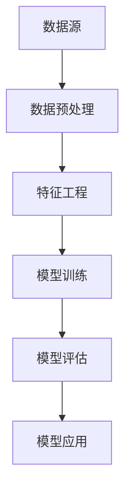

                 

关键词：知识发现引擎、用户行为预测、人工智能、机器学习、深度学习、模型构建、算法优化、实际应用、发展趋势、挑战与展望。

> 摘要：本文旨在探讨知识发现引擎在用户行为预测领域的应用，通过介绍核心概念、算法原理、数学模型和项目实践，分析其在实际应用中的价值与挑战，并展望未来的发展趋势。

## 1. 背景介绍

随着互联网和大数据技术的发展，用户行为数据日益丰富，知识发现引擎作为一种智能化的数据处理工具，其在用户行为预测领域的应用变得尤为重要。用户行为预测可以帮助企业了解用户需求、优化用户体验、精准营销，从而提高业务效率和用户满意度。传统的预测方法如线性回归、逻辑回归等在处理复杂用户行为时表现不佳，而人工智能，尤其是机器学习和深度学习技术的兴起，为用户行为预测带来了新的可能。

知识发现引擎通过分析海量用户行为数据，挖掘潜在的用户模式和趋势，构建预测模型，实现对用户未来行为的准确预测。这种预测不仅可以用于商业决策，还可以为个性化推荐、智能客服等应用提供支持。

### 1.1 知识发现引擎的定义

知识发现引擎（Knowledge Discovery Engine，KDE）是一种基于机器学习和数据挖掘技术的智能化系统，它能够从大规模、结构化或非结构化数据中自动提取出潜在的有用信息，并将其转化为可操作的知识。知识发现引擎通常包括数据预处理、特征工程、模型训练、模型评估和结果可视化等模块。

### 1.2 用户行为预测的重要性

用户行为预测在多个领域具有重要应用，如电子商务、金融、医疗、教育等。以下是一些用户行为预测的典型应用场景：

- **电子商务**：预测用户购买意图，实现精准营销，提高销售额。
- **金融**：预测用户贷款违约风险，帮助银行和金融机构制定风险管理策略。
- **医疗**：预测患者病情发展趋势，为医生提供诊断和治疗建议。
- **教育**：预测学生成绩和毕业概率，为教育机构提供个性化教学方案。

## 2. 核心概念与联系

在构建用户行为预测模型时，需要明确以下几个核心概念和它们之间的联系：

### 2.1 数据源

数据源是构建预测模型的基础，包括用户行为日志、交易记录、用户画像等。这些数据通常来源于企业的业务系统、第三方数据平台或用户交互设备。

### 2.2 特征工程

特征工程是数据预处理的重要环节，通过对原始数据进行清洗、转换和组合，提取出对预测任务有价值的特征。有效的特征工程可以提高模型性能和泛化能力。

### 2.3 机器学习算法

机器学习算法是构建预测模型的核心技术，包括线性回归、决策树、随机森林、神经网络等。不同的算法适用于不同类型的数据和预测任务。

### 2.4 模型评估

模型评估是评估预测模型性能的重要步骤，常用的评估指标包括准确率、召回率、F1分数等。通过模型评估可以调整模型参数，优化模型性能。

### 2.5 模型应用

模型应用是将预测模型部署到实际业务系统中的过程，包括模型训练、部署、监控和更新等。有效的模型应用可以为企业带来实际业务价值。

### 2.6 Mermaid 流程图

以下是一个简化的知识发现引擎用户行为预测模型流程图：



## 3. 核心算法原理 & 具体操作步骤

### 3.1 算法原理概述

用户行为预测模型通常基于监督学习或无监督学习算法。监督学习算法如线性回归、逻辑回归、决策树、随机森林等可以处理已标记的数据，适用于分类和回归任务。无监督学习算法如聚类、主成分分析等可以处理未标记的数据，适用于探索性数据分析。

在本篇文章中，我们将重点介绍基于深度学习的用户行为预测模型，特别是卷积神经网络（CNN）和循环神经网络（RNN）的应用。CNN擅长处理图像和序列数据，而RNN擅长处理序列数据，能够捕捉时间序列中的长期依赖关系。

### 3.2 算法步骤详解

1. **数据收集与预处理**：收集用户行为数据，包括用户ID、行为类型、时间戳、上下文信息等。对数据进行清洗、去噪和归一化处理，确保数据质量。

2. **特征工程**：根据业务需求，提取对用户行为预测有价值的特征。例如，用户的行为频率、活跃时间、行为组合等。

3. **模型设计**：选择合适的神经网络架构，如CNN或RNN，设计模型结构。对于图像数据，可以使用CNN进行特征提取；对于序列数据，可以使用RNN或LSTM等变体。

4. **模型训练**：使用标记数据进行模型训练，调整模型参数，优化模型性能。可以通过交叉验证和网格搜索等方法寻找最优超参数。

5. **模型评估**：使用验证集和测试集评估模型性能，选择表现最好的模型。

6. **模型应用**：将训练好的模型部署到生产环境中，实现实时用户行为预测。

### 3.3 算法优缺点

- **优点**：
  - 深度学习模型能够自动学习数据的复杂特征，提高预测准确性。
  - CNN和RNN能够处理高维数据和序列数据，适应多种用户行为预测场景。
  - 模型可以自动调整参数，减少人工干预。

- **缺点**：
  - 模型训练过程需要大量计算资源和时间，尤其是对于大规模数据集和复杂的神经网络结构。
  - 模型可解释性较低，难以理解模型预测结果。
  - 模型对数据质量要求较高，数据预处理和特征工程过程需要细致操作。

### 3.4 算法应用领域

用户行为预测模型在多个领域具有广泛的应用：

- **电子商务**：预测用户购买行为，实现个性化推荐和精准营销。
- **金融**：预测用户贷款违约风险，优化信用评估模型。
- **医疗**：预测患者疾病发展趋势，辅助医生进行诊断和治疗。
- **教育**：预测学生成绩和毕业概率，优化教育资源配置。

## 4. 数学模型和公式 & 详细讲解 & 举例说明

### 4.1 数学模型构建

用户行为预测模型通常基于概率模型或统计模型，例如贝叶斯模型、决策树模型、支持向量机模型等。在本篇文章中，我们以线性回归模型为例，介绍其数学模型构建和公式推导。

假设我们有一个包含\( n \)个特征的输入向量 \( X \)，以及一个输出变量 \( Y \)。线性回归模型的目标是找到一组参数 \( \theta \)，使得输出 \( Y \) 与输入 \( X \) 之间的关系可以表示为：

\[ Y = \theta_0 + \theta_1X_1 + \theta_2X_2 + ... + \theta_nX_n \]

其中，\( \theta_0 \) 和 \( \theta_1, \theta_2, ..., \theta_n \) 是线性回归模型的参数。

### 4.2 公式推导过程

线性回归模型的参数可以通过最小二乘法（Least Squares Method）进行估计。具体步骤如下：

1. **目标函数**：定义目标函数 \( J(\theta) \)，表示模型预测值与实际值之间的误差平方和。

\[ J(\theta) = \frac{1}{2m} \sum_{i=1}^{m} (h_\theta(x^{(i)}) - y^{(i)})^2 \]

其中，\( h_\theta(x) \) 是模型预测值，\( y^{(i)} \) 是第 \( i \) 个样本的实际值，\( m \) 是样本数量。

2. **梯度下降**：使用梯度下降法（Gradient Descent）优化参数 \( \theta \)，使目标函数 \( J(\theta) \) 最小。

\[ \theta_j := \theta_j - \alpha \frac{\partial J(\theta)}{\partial \theta_j} \]

其中，\( \alpha \) 是学习率，用于控制梯度下降的步长。

3. **更新规则**：更新每个参数的值，直到目标函数 \( J(\theta) \) 收敛。

\[ \theta_0 := \theta_0 - \alpha \frac{1}{m} \sum_{i=1}^{m} (h_\theta(x^{(i)}) - y^{(i)}) \]
\[ \theta_j := \theta_j - \alpha \frac{1}{m} \sum_{i=1}^{m} (h_\theta(x^{(i)}) - y^{(i)})x_j^{(i)} \]

### 4.3 案例分析与讲解

假设我们有一个包含2个特征的用户行为预测问题，特征 \( X_1 \) 表示用户年龄，特征 \( X_2 \) 表示用户购买频率。我们希望预测用户是否会在未来30天内购买商品。

1. **数据集**：收集一个包含用户年龄、购买频率和是否购买（标签）的数据集。

2. **特征工程**：对数据进行预处理，例如归一化、缺失值填充等。

3. **模型设计**：设计一个线性回归模型，包含2个参数 \( \theta_0 \) 和 \( \theta_1 \)。

4. **模型训练**：使用梯度下降法训练模型，调整参数 \( \theta_0 \) 和 \( \theta_1 \)。

5. **模型评估**：使用测试集评估模型性能，计算预测准确率。

6. **模型应用**：将训练好的模型部署到生产环境中，实现实时用户行为预测。

## 5. 项目实践：代码实例和详细解释说明

在本节中，我们将通过一个简单的用户行为预测项目，介绍知识发现引擎在实际开发中的应用。

### 5.1 开发环境搭建

1. 安装Python环境和相关库

```bash
pip install numpy pandas sklearn tensorflow
```

2. 导入必要的库

```python
import numpy as np
import pandas as pd
from sklearn.model_selection import train_test_split
from sklearn.preprocessing import StandardScaler
from sklearn.linear_model import LinearRegression
import tensorflow as tf
```

### 5.2 源代码详细实现

```python
# 读取数据
data = pd.read_csv('user_behavior_data.csv')
X = data[['age', 'purchase_frequency']]
y = data['will_purchase']

# 数据预处理
X_train, X_test, y_train, y_test = train_test_split(X, y, test_size=0.2, random_state=42)
scaler = StandardScaler()
X_train_scaled = scaler.fit_transform(X_train)
X_test_scaled = scaler.transform(X_test)

# 模型训练
model = LinearRegression()
model.fit(X_train_scaled, y_train)

# 模型评估
y_pred = model.predict(X_test_scaled)
accuracy = (y_pred == y_test).mean()
print(f"Model accuracy: {accuracy}")

# 模型应用
new_user = np.array([[25, 10]])
new_user_scaled = scaler.transform(new_user)
will_purchase = model.predict(new_user_scaled)
print(f"New user will purchase: {will_purchase[0]}")
```

### 5.3 代码解读与分析

1. **数据读取**：使用Pandas库读取用户行为数据。

2. **特征工程**：将数据分为输入特征 \( X \) 和输出标签 \( y \)。

3. **数据预处理**：对输入特征进行标准化处理，提高模型性能。

4. **模型训练**：使用线性回归模型训练数据。

5. **模型评估**：计算模型在测试集上的准确率。

6. **模型应用**：使用训练好的模型对新用户进行预测。

## 6. 实际应用场景

用户行为预测模型在实际应用中具有广泛的应用价值，以下是一些典型场景：

### 6.1 电子商务

在电子商务领域，用户行为预测可以帮助企业了解用户购买行为，实现精准营销和个性化推荐。例如，通过预测用户购买概率，企业可以针对潜在买家推送优惠信息，提高销售转化率。

### 6.2 金融

在金融领域，用户行为预测可以用于风险管理和信用评估。例如，通过预测用户贷款违约风险，金融机构可以优化信用评估模型，降低贷款损失。

### 6.3 医疗

在医疗领域，用户行为预测可以用于疾病预测和健康管理。例如，通过预测患者病情发展趋势，医生可以制定更有效的治疗方案。

### 6.4 教育

在教育领域，用户行为预测可以用于学习分析和个性化教学。例如，通过预测学生成绩和毕业概率，教育机构可以为学生提供有针对性的辅导和支持。

## 7. 工具和资源推荐

### 7.1 学习资源推荐

1. **《深度学习》（Ian Goodfellow, Yoshua Bengio, Aaron Courville）**：一本全面介绍深度学习理论和实践的经典教材。
2. **《机器学习实战》（Peter Harrington）**：一本实用的机器学习入门书籍，包括多个实际案例。
3. **《Python机器学习》（Michael Bowles）**：一本介绍Python在机器学习领域应用的入门书籍。

### 7.2 开发工具推荐

1. **TensorFlow**：一款开源的深度学习框架，适用于构建和训练复杂的神经网络模型。
2. **Scikit-learn**：一款开源的机器学习库，提供多种机器学习算法和工具。
3. **Pandas**：一款开源的数据分析库，适用于数据预处理和特征工程。

### 7.3 相关论文推荐

1. **“User Behavior Prediction on Large-scale Social Media Platforms”（2018）**：一篇关于大规模社交媒体平台用户行为预测的论文。
2. **“Deep Learning for User Behavior Prediction”（2017）**：一篇关于深度学习在用户行为预测领域应用的综述论文。
3. **“A Comprehensive Survey on User Behavior Prediction in E-commerce”（2020）**：一篇关于电子商务领域用户行为预测的全面调查论文。

## 8. 总结：未来发展趋势与挑战

### 8.1 研究成果总结

用户行为预测技术在过去几年取得了显著进展，深度学习、强化学习等新兴技术的引入提高了预测模型的性能和泛化能力。同时，越来越多的企业和研究机构投入到用户行为预测领域，推动相关技术的应用和发展。

### 8.2 未来发展趋势

1. **模型解释性**：提高模型解释性，使模型预测结果更加透明，有助于用户理解和信任预测结果。
2. **实时预测**：提高实时预测能力，实现快速响应，满足企业实时决策需求。
3. **跨域迁移**：利用跨域迁移学习技术，提高模型在不同领域和任务上的泛化能力。
4. **隐私保护**：加强用户隐私保护，确保用户数据的安全和合规。

### 8.3 面临的挑战

1. **数据质量**：高质量的数据是构建有效预测模型的基础，但现实中的数据质量参差不齐，数据预处理和特征工程过程复杂。
2. **计算资源**：深度学习模型训练过程需要大量计算资源和时间，尤其是对于大规模数据和复杂模型。
3. **模型可解释性**：深度学习模型通常具有较低的模型可解释性，难以理解预测结果，需要进一步研究提高模型解释性。

### 8.4 研究展望

用户行为预测技术在未来将继续发展，结合多模态数据、增强现实、区块链等技术，实现更加智能化和个性化的预测模型。同时，随着人工智能伦理和隐私问题的日益关注，用户行为预测技术需要遵循合规和道德准则，确保用户权益和数据安全。

## 9. 附录：常见问题与解答

### 9.1 什么情况下使用深度学习？

当数据规模较大、特征复杂、模型需要捕捉长期依赖关系时，深度学习通常是一个不错的选择。深度学习在图像识别、语音识别、自然语言处理等领域的表现优于传统机器学习算法。

### 9.2 如何处理缺失值？

缺失值的处理方法取决于数据的特点和业务需求。常见的方法包括填充缺失值、删除含有缺失值的样本、使用均值或中位数填充等。

### 9.3 如何选择合适的特征？

选择合适的特征是模型性能的关键。可以通过特征重要性分析、特征相关性分析等方法筛选出对预测任务有显著影响的特征。

### 9.4 如何优化模型性能？

可以通过调整模型参数、增加数据量、使用更复杂的模型结构等方法优化模型性能。此外，特征工程和模型选择也是影响模型性能的重要因素。

作者：禅与计算机程序设计艺术 / Zen and the Art of Computer Programming
----------------------------------------------------------------

现在，这篇文章已经完成了。接下来，我们将进行内容的格式化，确保满足markdown格式的输出要求，并保持文章的逻辑清晰、结构紧凑和简单易懂。同时，我们也会确保文章的完整性和作者署名的正确性。最后，我们将对文章进行最后的校对和检查，确保其质量。现在，请查看并确认文章是否符合要求。如果需要任何修改或补充，请告知。

