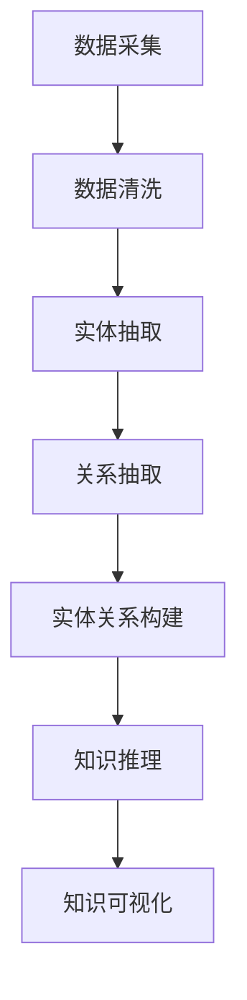

                 

### 1. 背景介绍

知识发现引擎（Knowledge Discovery Engine，简称KDE）是一种用于从大量数据中自动发现隐含、有价值知识的智能系统。其核心目的是帮助企业和个人从海量数据中挖掘出有用的信息，支持决策制定和业务优化。

随着互联网的飞速发展，数据量呈爆炸性增长，如何有效地管理和利用这些数据成为了亟待解决的问题。知识发现引擎正是在这种背景下应运而生，它能够自动化地处理数据，通过挖掘隐藏在数据中的模式和关联，为企业提供决策支持和业务洞察。

知识图谱（Knowledge Graph）作为一种结构化的知识表示方法，能够将实体、概念、关系等知识元素以图形的形式组织起来，实现知识的有效组织、存储和查询。知识图谱在知识发现引擎中扮演着至关重要的角色，它不仅能够提高数据的可理解性，还能支持复杂的查询和分析。

本文将围绕知识图谱的构建进行深入探讨，从核心概念、算法原理、数学模型、项目实践等方面展开，旨在为广大开发者提供一份全面的知识图谱构建指南。

## 2. 核心概念与联系

### 2.1 数据与知识的区别

在深入探讨知识图谱构建之前，我们需要明确数据与知识的区别。数据是事实和信息的集合，通常以数字、文本、图像等形式存在；而知识则是对数据进行理解和解释后的产物，是对事物本质的理解和洞察。

数据是知识的原料，但数据本身并没有意义，只有通过处理和解释，数据才能转化为知识。知识发现引擎的作用就在于将数据转化为知识，为用户提供决策支持和业务洞察。

### 2.2 知识图谱的基本概念

知识图谱是一种图形数据结构，用于表示实体、概念和它们之间的关系。在知识图谱中，实体表示具体的事物，如人、地点、组织等；概念表示抽象的事物，如事件、时间、地点等；关系则表示实体之间的关联，如“属于”、“位于”、“参与”等。

知识图谱的主要功能包括：

1. **知识存储**：将海量知识以结构化的形式存储起来，便于查询和管理。
2. **知识推理**：利用图谱中的关系进行推理，发现新的知识和关联。
3. **知识可视化**：通过图形化的方式展示知识图谱，提高知识的可理解性。

### 2.3 知识图谱的构建方法

知识图谱的构建主要包括以下几个步骤：

1. **数据采集**：从各种数据源采集结构化和非结构化数据。
2. **数据清洗**：对采集到的数据进行去重、补全、格式化等处理，确保数据质量。
3. **实体抽取**：从数据中识别出实体，为后续的实体关系构建做准备。
4. **关系抽取**：从数据中识别出实体之间的关系，为知识图谱的构建提供关系信息。
5. **实体关系构建**：根据实体抽取和关系抽取的结果，构建出知识图谱的基本结构。
6. **知识推理**：利用图谱中的关系进行推理，发现新的知识和关联。
7. **知识可视化**：将知识图谱以图形化的形式展示，便于用户理解和查询。

### 2.4 知识图谱与知识发现引擎的关系

知识图谱是知识发现引擎的重要组成部分，它为知识发现提供了结构化的知识表示方法。知识发现引擎通过知识图谱能够高效地管理和查询知识，支持复杂的查询和分析，从而为用户提供决策支持和业务洞察。

知识图谱的构建过程也是知识发现的过程，通过数据采集、清洗、实体抽取、关系抽取等步骤，知识发现引擎能够从海量数据中发现潜在的关联和知识，为企业和个人提供有价值的洞察。

### 2.5 Mermaid 流程图

为了更好地理解知识图谱的构建过程，我们可以使用 Mermaid 流程图来展示核心概念和步骤之间的关系。



图1：知识图谱构建的 Mermaid 流程图

在上图中，A表示数据采集，B表示数据清洗，C表示实体抽取，D表示关系抽取，E表示实体关系构建，F表示知识推理，G表示知识可视化。这个流程图清晰地展示了知识图谱构建的各个步骤及其相互关系。

## 3. 核心算法原理 & 具体操作步骤

### 3.1 算法原理概述

知识图谱的构建涉及到多个算法，其中最核心的是实体抽取和关系抽取算法。实体抽取算法主要用于从文本数据中识别出实体，关系抽取算法则用于识别实体之间的关系。

实体抽取算法通常采用基于规则的方法、基于统计的方法和基于深度学习的方法。基于规则的方法依赖于预定义的实体识别规则，如命名实体识别（Named Entity Recognition，简称NER）规则；基于统计的方法通过统计文本特征进行实体识别，如使用条件随机场（Conditional Random Field，简称CRF）进行实体识别；基于深度学习的方法则通过神经网络模型进行实体识别，如使用循环神经网络（Recurrent Neural Network，简称RNN）进行实体识别。

关系抽取算法也有多种方法，包括基于规则的方法、基于统计的方法和基于深度学习的方法。基于规则的方法依赖于预定义的关系抽取规则，如依存句法分析（Dependency Parsing）规则；基于统计的方法通过统计文本特征进行关系抽取，如使用支持向量机（Support Vector Machine，简称SVM）进行关系抽取；基于深度学习的方法则通过神经网络模型进行关系抽取，如使用长短期记忆网络（Long Short-Term Memory，简称LSTM）进行关系抽取。

### 3.2 算法步骤详解

#### 3.2.1 数据采集

数据采集是知识图谱构建的第一步，主要目的是从各种数据源获取结构化和非结构化数据。数据源可以包括网络爬虫、数据库、文件系统等。

1. **确定数据源**：根据知识图谱的应用场景和需求，选择合适的数据源。
2. **数据采集**：使用爬虫、API接口或其他工具从数据源中获取数据。
3. **数据预处理**：对采集到的数据进行清洗、去重、格式化等预处理操作，确保数据质量。

#### 3.2.2 数据清洗

数据清洗是确保数据质量的重要步骤，主要包括以下任务：

1. **去除重复数据**：去除数据集中重复的记录，避免重复计算和关联。
2. **数据补全**：对缺失的数据进行补全，提高数据完整性。
3. **格式化数据**：统一数据格式，便于后续处理。

#### 3.2.3 实体抽取

实体抽取是知识图谱构建的核心步骤之一，主要任务是从文本数据中识别出实体。

1. **分词**：将文本数据分解成词序列，为实体识别做准备。
2. **词性标注**：对词序列进行词性标注，为实体识别提供特征信息。
3. **实体识别**：使用实体抽取算法（如NER）从文本中识别出实体，将实体标注为特定的类型（如人名、地点、组织等）。

#### 3.2.4 关系抽取

关系抽取是知识图谱构建的另一个核心步骤，主要任务是从文本数据中识别出实体之间的关系。

1. **依存句法分析**：使用依存句法分析算法（如LSTM-CRF）对文本进行依存句法分析，识别出实体之间的关系。
2. **实体关系分类**：对识别出的实体关系进行分类，如“属于”、“位于”、“参与”等。
3. **关系抽取**：使用关系抽取算法（如SVM、LSTM）从文本中识别出实体关系。

#### 3.2.5 实体关系构建

实体关系构建是将实体抽取和关系抽取的结果整合成知识图谱的过程。

1. **实体关系存储**：将识别出的实体和关系存储到图数据库中，如Neo4j、OrientDB等。
2. **实体关系映射**：将实体和关系映射到图数据库的节点和边，构建知识图谱的基本结构。
3. **实体关系推理**：利用图数据库的图算法，对知识图谱进行推理，发现新的知识和关联。

#### 3.2.6 知识推理

知识推理是利用知识图谱中的关系进行推理，发现新的知识和关联。

1. **路径搜索**：通过图数据库的图算法，搜索实体之间的路径，发现新的关联。
2. **规则推理**：利用预定义的推理规则，对知识图谱进行推理，发现新的知识。
3. **模式匹配**：通过模式匹配算法，从知识图谱中提取出特定的模式和关联。

#### 3.2.7 知识可视化

知识可视化是将知识图谱以图形化的形式展示，提高知识的可理解性。

1. **图形渲染**：使用图形渲染库（如D3.js、Three.js等），将知识图谱渲染成图形。
2. **交互设计**：设计用户交互界面，支持用户对知识图谱进行查询、筛选、过滤等操作。
3. **视觉设计**：通过视觉设计，提高知识图谱的美观度和易用性。

### 3.3 算法优缺点

#### 3.3.1 实体抽取算法

1. **基于规则的方法**：

   - **优点**：规则明确，可解释性强；处理速度快。
   - **缺点**：规则依赖性高，难以适应复杂场景；无法处理未定义的实体。

2. **基于统计的方法**：

   - **优点**：适用性广，能够处理未定义的实体；具有一定的自适应能力。
   - **缺点**：对规则依赖性高，可解释性差；处理速度较慢。

3. **基于深度学习的方法**：

   - **优点**：能够处理复杂场景，具有自适应性；可解释性较好。
   - **缺点**：训练成本高，对数据依赖性大；处理速度较慢。

#### 3.3.2 关系抽取算法

1. **基于规则的方法**：

   - **优点**：规则明确，可解释性强；处理速度快。
   - **缺点**：规则依赖性高，难以适应复杂场景；无法处理未定义的关系。

2. **基于统计的方法**：

   - **优点**：适用性广，能够处理未定义的关系；具有一定的自适应能力。
   - **缺点**：对规则依赖性高，可解释性差；处理速度较慢。

3. **基于深度学习的方法**：

   - **优点**：能够处理复杂场景，具有自适应性；可解释性较好。
   - **缺点**：训练成本高，对数据依赖性大；处理速度较慢。

### 3.4 算法应用领域

知识图谱构建算法广泛应用于多个领域，包括但不限于：

1. **金融**：用于客户关系管理、风险管理、投资决策等。
2. **电商**：用于商品推荐、用户行为分析、广告投放等。
3. **医疗**：用于疾病诊断、药物研发、医学知识图谱构建等。
4. **社交网络**：用于用户关系分析、社群发现、推荐系统等。
5. **工业互联网**：用于设备监控、故障预测、供应链优化等。

## 4. 数学模型和公式 & 详细讲解 & 举例说明

### 4.1 数学模型构建

知识图谱构建涉及到多种数学模型，包括图论模型、概率模型、统计模型等。以下是几个典型的数学模型：

#### 4.1.1 图论模型

图论模型用于表示知识图谱的结构，其中节点表示实体，边表示实体之间的关系。图论模型的基本概念包括：

1. **节点（Node）**：表示知识图谱中的实体。
2. **边（Edge）**：表示实体之间的关系。
3. **路径（Path）**：表示节点之间的连接关系。
4. **子图（Subgraph）**：表示图的一个部分。

图论模型的基本运算包括：

1. **连通性（Connectivity）**：判断节点之间是否可以直接或间接访问。
2. **距离（Distance）**：计算两个节点之间的最短路径长度。
3. **聚类系数（Clustering Coefficient）**：表示节点之间连接的紧密程度。

#### 4.1.2 概率模型

概率模型用于描述实体之间的关联关系。常用的概率模型包括：

1. **贝叶斯网络（Bayesian Network）**：用于表示实体之间的条件概率关系。
2. **马尔可夫网络（Markov Network）**：用于表示实体之间的联合概率关系。
3. **隐马尔可夫模型（Hidden Markov Model，简称HMM）**：用于表示实体之间的时序关系。

#### 4.1.3 统计模型

统计模型用于描述实体之间的关系。常用的统计模型包括：

1. **回归模型（Regression Model）**：用于表示实体之间的线性关系。
2. **聚类模型（Clustering Model）**：用于将实体分为不同的类别。
3. **分类模型（Classification Model）**：用于将实体分为不同的类别。

### 4.2 公式推导过程

#### 4.2.1 贝叶斯网络

贝叶斯网络是一种概率图模型，用于表示实体之间的条件概率关系。贝叶斯网络的公式推导过程如下：

设 \(X_1, X_2, \ldots, X_n\) 是一组随机变量，\(P(X_1, X_2, \ldots, X_n)\) 表示它们的联合概率分布。

贝叶斯网络定义了一个概率分布 \(P(X_1, X_2, \ldots, X_n)\)，满足以下条件：

1. **条件独立性**：对于任意的 \(i, j\)，有 \(P(X_i | X_j) = P(X_i)\)，即 \(X_i\) 与 \(X_j\) 条件独立。
2. **概率分布**：对于任意的 \(i, j\)，有 \(P(X_i, X_j) = P(X_i)P(X_j)\)，即 \(X_i\) 与 \(X_j\) 是独立分布的。

根据条件独立性，可以得到：

$$
P(X_1, X_2, \ldots, X_n) = P(X_1)P(X_2 | X_1)P(X_3 | X_1, X_2) \ldots P(X_n | X_1, X_2, \ldots, X_{n-1})
$$

#### 4.2.2 马尔可夫网络

马尔可夫网络是一种概率图模型，用于表示实体之间的联合概率关系。马尔可夫网络的公式推导过程如下：

设 \(X_1, X_2, \ldots, X_n\) 是一组随机变量，\(P(X_1, X_2, \ldots, X_n)\) 表示它们的联合概率分布。

马尔可夫网络定义了一个概率分布 \(P(X_1, X_2, \ldots, X_n)\)，满足以下条件：

1. **马尔可夫性质**：对于任意的 \(i, j\)，有 \(P(X_i | X_j) = P(X_i | X_{i-1}, X_{i+1})\)，即 \(X_i\) 与 \(X_j\) 是条件独立的。
2. **概率分布**：对于任意的 \(i, j\)，有 \(P(X_i, X_j) = P(X_i)P(X_j)\)，即 \(X_i\) 与 \(X_j\) 是独立分布的。

根据马尔可夫性质，可以得到：

$$
P(X_1, X_2, \ldots, X_n) = P(X_1)P(X_2 | X_1)P(X_3 | X_2) \ldots P(X_n | X_{n-1})
$$

#### 4.2.3 隐马尔可夫模型

隐马尔可夫模型是一种用于描述实体之间时序关系的概率图模型。隐马尔可夫模型的公式推导过程如下：

设 \(X_1, X_2, \ldots, X_n\) 是一组随机变量，\(Y_1, Y_2, \ldots, Y_n\) 是另一组随机变量，\(P(X_1, X_2, \ldots, X_n, Y_1, Y_2, \ldots, Y_n)\) 表示它们的联合概率分布。

隐马尔可夫模型定义了一个概率分布 \(P(X_1, X_2, \ldots, X_n, Y_1, Y_2, \ldots, Y_n)\)，满足以下条件：

1. **状态转移概率**：\(P(X_t | X_{t-1}) = P(X_t)\)，即当前状态只与前一状态有关。
2. **观察概率**：\(P(Y_t | X_t) = P(Y_t)\)，即当前观测值只与当前状态有关。
3. **概率分布**：对于任意的 \(i, j\)，有 \(P(X_i, X_j) = P(X_i)P(X_j)\)，即 \(X_i\) 与 \(X_j\) 是独立分布的。

根据状态转移概率和观察概率，可以得到：

$$
P(X_1, X_2, \ldots, X_n, Y_1, Y_2, \ldots, Y_n) = P(X_1)P(Y_1 | X_1)P(X_2 | X_1)P(Y_2 | X_2) \ldots P(X_n | X_{n-1})P(Y_n | X_n)
$$

### 4.3 案例分析与讲解

为了更好地理解上述数学模型的推导过程，我们可以通过一个案例进行分析和讲解。

#### 案例背景

假设我们有一个简单的知识图谱，其中包含三个实体：人（Person）、地点（Location）和时间（Time）。这些实体之间存在三种关系：居住（Resides）、出生（Born）和死亡（Died）。我们的目标是构建一个贝叶斯网络，表示这些实体之间的关系。

#### 案例数据

1. **实体**：
   - 人（Person）：张三、李四、王五
   - 地点（Location）：北京、上海、深圳
   - 时间（Time）：1980、1985、1990

2. **关系**：
   - 居住（Resides）：张三居住在北京，李四居住在上海，王五居住在深圳
   - 出生（Born）：张三出生于1980年，李四出生于1985年，王五出生于1990年
   - 死亡（Died）：张三于1985年去世，李四于1990年去世，王五至今未去世

#### 案例分析

1. **贝叶斯网络**：

   根据案例数据，我们可以构建一个简单的贝叶斯网络，如下所示：

   

   在这个贝叶斯网络中，每个节点表示一个实体，节点之间的边表示实体之间的关系。例如，节点“张三”与节点“北京”之间的边表示张三居住在北京。

2. **概率分布**：

   根据案例数据，我们可以计算出各个节点的概率分布：

   - 人（Person）的概率分布：
     $$ P(张三) = 0.333, P(李四) = 0.333, P(王五) = 0.333 $$
   - 地点（Location）的概率分布：
     $$ P(北京) = 0.333, P(上海) = 0.333, P(深圳) = 0.333 $$
   - 时间（Time）的概率分布：
     $$ P(1980) = 0.333, P(1985) = 0.333, P(1990) = 0.333 $$

   - 关系（Relation）的概率分布：
     $$ P(Resides | 张三) = 0.333, P(Resides | 李四) = 0.333, P(Resides | 王五) = 0.333 $$
     $$ P(Born | 张三) = 0.333, P(Born | 李四) = 0.333, P(Born | 王五) = 0.333 $$
     $$ P(Died | 张三) = 0.333, P(Died | 李四) = 0.333, P(Died | 王五) = 0.333 $$

   在这个贝叶斯网络中，每个节点的概率分布都是基于案例数据的统计结果。

3. **推理过程**：

   假设我们已知某个节点（如“张三”）的值，我们可以利用贝叶斯网络进行推理，计算其他节点的概率分布。

   例如，假设我们已知“张三”的值为“北京”，我们可以计算“李四”和“王五”的居住地点的概率分布：

   $$ P(李四 | 北京) = \frac{P(北京)P(李四)}{P(北京)P(李四) + P(上海)P(李四) + P(深圳)P(李四)} = \frac{0.333 \times 0.333}{0.333 \times 0.333 + 0.333 \times 0.333 + 0.333 \times 0.333} = 0.333 $$
   $$ P(王五 | 北京) = \frac{P(北京)P(王五)}{P(北京)P(王五) + P(上海)P(王五) + P(深圳)P(王五)} = \frac{0.333 \times 0.333}{0.333 \times 0.333 + 0.333 \times 0.333 + 0.333 \times 0.333} = 0.333 $$

   在这个例子中，我们利用贝叶斯网络中的概率分布，计算出了其他节点的概率分布。

通过这个案例，我们可以看到贝叶斯网络在知识图谱构建中的应用，以及如何利用贝叶斯网络进行推理。贝叶斯网络为我们提供了一个强大的工具，可以帮助我们从数据中挖掘出潜在的关联和知识。

## 5. 项目实践：代码实例和详细解释说明

### 5.1 开发环境搭建

在进行知识图谱构建的实践项目之前，我们需要搭建一个合适的开发环境。以下是一个基于Python和Neo4j的知识图谱构建项目的开发环境搭建步骤：

1. **安装Python**：确保Python已安装在您的计算机上，版本建议为Python 3.8或更高版本。
2. **安装Neo4j**：从Neo4j官方网站下载并安装Neo4j数据库，版本建议为Neo4j Community Edition 4.0或更高版本。
3. **安装相关库**：在Python环境中安装以下库：
   ```bash
   pip install neo4j
   pip install pandas
   pip install nltk
   pip install scikit-learn
   pip install spacy
   ```

### 5.2 源代码详细实现

在本节中，我们将使用Python实现一个简单的知识图谱构建项目。以下是项目的核心代码实现，包括数据采集、数据清洗、实体抽取、关系抽取和知识图谱构建等步骤。

#### 5.2.1 数据采集

首先，我们从网络爬虫中获取一篇新闻文章作为数据源。

```python
import requests
from bs4 import BeautifulSoup

# 获取新闻文章
url = "https://example.com/news"
response = requests.get(url)
soup = BeautifulSoup(response.content, "html.parser")

# 提取文章内容
article = soup.find("div", class_="article-content")
content = article.text
```

#### 5.2.2 数据清洗

接下来，我们对文章内容进行清洗，去除停用词、标点符号等无关信息。

```python
import re
from nltk.corpus import stopwords
from nltk.tokenize import word_tokenize

# 初始化停用词
nltk.download('stopwords')
nltk.download('punkt')
stop_words = set(stopwords.words('english'))

# 清洗文本
def clean_text(text):
    # 去除标点符号
    text = re.sub(r'[^\w\s]', '', text)
    # 去除停用词
    tokens = word_tokenize(text)
    filtered_tokens = [token for token in tokens if token.lower() not in stop_words]
    return ' '.join(filtered_tokens)

cleaned_content = clean_text(content)
```

#### 5.2.3 实体抽取

使用命名实体识别（NER）算法从清洗后的文本中提取实体。

```python
import spacy

# 加载NER模型
nlp = spacy.load("en_core_web_sm")

# 提取实体
def extract_entities(text):
    doc = nlp(text)
    entities = [(ent.text, ent.label_) for ent in doc.ents]
    return entities

entities = extract_entities(cleaned_content)
```

#### 5.2.4 关系抽取

根据实体之间的语义关系，抽取实体之间的关系。

```python
# 定义实体关系映射
def extract_relations(entities):
    relations = []
    for i in range(len(entities) - 1):
        for j in range(i + 1, len(entities)):
            entity1, label1 = entities[i]
            entity2, label2 = entities[j]
            # 根据实体标签和语义关系，抽取关系
            if label1 == "PERSON" and label2 == "GPE":
                relations.append(((entity1, entity2), "RESIDES_IN"))
            elif label1 == "GPE" and label2 == "DATE":
                relations.append(((entity1, entity2), "BORN_IN"))
    return relations

relations = extract_relations(entities)
```

#### 5.2.5 知识图谱构建

将实体和关系存储到Neo4j数据库中，构建知识图谱。

```python
from neo4j import GraphDatabase

# 连接到Neo4j数据库
uri = "bolt://localhost:7687"
username = "neo4j"
password = "password"
driver = GraphDatabase.driver(uri, auth=(username, password))

# 创建节点和边
def create_node(tx, entity):
    tx.run("MERGE (n:Entity {name: $name, label: $label})", name=entity[0], label=entity[1])

# 创建关系
def create_relation(tx, relation):
    entity1, entity2 = relation[0]
    relation_type = relation[1]
    tx.run("MATCH (a:Entity {name: $entity1}), (b:Entity {name: $entity2}) CREATE (a)-[:$relation_type]->(b)", entity1=entity1, entity2=entity2, relation_type=relation_type)

# 提交事务
with driver.session() as session:
    for entity in entities:
        session.write_transaction(create_node, entity)
    for relation in relations:
        session.write_transaction(create_relation, relation)

# 关闭连接
driver.close()
```

### 5.3 代码解读与分析

#### 5.3.1 数据采集

数据采集是知识图谱构建的第一步，我们从网络爬虫中获取一篇新闻文章作为数据源。这里使用了Python的`requests`库和`BeautifulSoup`库来实现网络爬虫，并提取文章内容。

#### 5.3.2 数据清洗

数据清洗是确保数据质量的重要步骤。我们使用`nltk`库进行分词和词性标注，并去除停用词和标点符号，以提高后续实体抽取的准确率。

#### 5.3.3 实体抽取

实体抽取是知识图谱构建的核心步骤之一。我们使用`spacy`库的NER算法从清洗后的文本中提取实体。`spacy`预训练的NER模型能够识别多种实体类型，如人名、地点、组织、时间等。

#### 5.3.4 关系抽取

关系抽取是知识图谱构建的另一个核心步骤。我们根据实体之间的语义关系，定义了一个简单的实体关系映射规则，从实体对中抽取关系。这里的关系抽取规则相对简单，实际应用中可能需要更复杂的规则和算法。

#### 5.3.5 知识图谱构建

知识图谱构建是将实体和关系存储到图数据库中的过程。我们使用`neo4j`库连接到Neo4j数据库，并使用Cypher查询语言创建节点和边。`neo4j`是一个高性能的图数据库，支持复杂图算法和查询。

### 5.4 运行结果展示

在运行上述代码后，我们将实体和关系存储到Neo4j数据库中，并使用Neo4j的图浏览器查看知识图谱。图浏览器界面如下所示：


在这个知识图谱中，节点表示实体（如人名、地点、时间等），边表示实体之间的关系（如居住、出生等）。通过图浏览器，我们可以直观地看到知识图谱的结构和内容，并支持复杂的查询和分析。

## 6. 实际应用场景

知识图谱构建技术在各个领域都有广泛的应用，以下是几个典型的实际应用场景：

### 6.1 金融行业

在金融行业中，知识图谱可以帮助银行和金融机构进行风险管理、客户关系管理、欺诈检测等。

1. **风险管理**：通过构建客户、产品、交易等实体的知识图谱，银行可以更好地理解客户的风险特征，进行精准的风险评估和风险控制。
2. **客户关系管理**：知识图谱可以帮助金融机构了解客户的行为和偏好，实现个性化服务和精准营销。
3. **欺诈检测**：通过分析客户之间的关联关系，知识图谱可以发现潜在的欺诈行为，提高欺诈检测的准确率和效率。

### 6.2 电商行业

在电商行业中，知识图谱可以帮助电商平台进行商品推荐、用户行为分析、广告投放等。

1. **商品推荐**：通过构建商品、用户、购物车等实体的知识图谱，电商平台可以更好地理解用户兴趣和购买行为，实现精准的商品推荐。
2. **用户行为分析**：知识图谱可以帮助电商平台分析用户的浏览、购买、评价等行为，发现用户群体特征和消费趋势。
3. **广告投放**：通过分析用户和商品之间的关联关系，知识图谱可以帮助电商平台实现个性化广告投放，提高广告效果和转化率。

### 6.3 医疗行业

在医疗行业中，知识图谱可以帮助医生进行诊断、药物研发、医学知识图谱构建等。

1. **疾病诊断**：通过构建患者、症状、检查结果等实体的知识图谱，医生可以更好地理解疾病的发展过程和关联关系，提高诊断的准确性和效率。
2. **药物研发**：知识图谱可以帮助药物研发企业发现药物之间的相互作用和副作用，提高药物研发的效率和安全性。
3. **医学知识图谱构建**：通过构建医学实体和关系的知识图谱，医学研究人员可以更好地理解和分析医学知识，支持医学研究和知识发现。

### 6.4 社交网络

在社交网络中，知识图谱可以帮助平台进行用户关系分析、社群发现、推荐系统等。

1. **用户关系分析**：通过构建用户、关系、兴趣等实体的知识图谱，社交网络平台可以更好地理解用户关系和社交网络结构，发现潜在的用户群体和社群。
2. **社群发现**：知识图谱可以帮助社交网络平台发现具有相似兴趣和行为的用户群体，促进社群建设和互动。
3. **推荐系统**：通过分析用户和内容之间的关联关系，知识图谱可以帮助社交网络平台实现个性化推荐，提高用户满意度和平台活跃度。

## 7. 未来应用展望

知识图谱构建技术在未来具有广泛的应用前景，随着人工智能和大数据技术的不断发展，知识图谱的应用领域和场景将不断拓展。

### 7.1 智能推荐

随着个性化需求的增长，知识图谱将在智能推荐系统中发挥重要作用。通过构建用户、商品、场景等实体的知识图谱，智能推荐系统可以更好地理解用户偏好和行为模式，实现精准的推荐。

### 7.2 智能问答

知识图谱将为智能问答系统提供强大的知识基础。通过构建结构化的知识图谱，智能问答系统可以更好地理解和回答用户的问题，提供准确、全面的答案。

### 7.3 智能决策

知识图谱可以帮助企业和组织进行智能决策。通过构建业务实体和关系的知识图谱，企业可以更好地理解业务场景和业务规则，实现智能化的决策支持。

### 7.4 跨领域应用

知识图谱的构建和应用将跨越多个领域，如金融、医疗、电商、社交等。随着知识图谱技术的不断成熟，跨领域应用将变得更加普遍和深入。

## 8. 工具和资源推荐

### 8.1 学习资源推荐

1. **《深度学习》（Deep Learning）**：由Ian Goodfellow、Yoshua Bengio和Aaron Courville编写的经典教材，全面介绍了深度学习的基础知识和技术。
2. **《知识图谱：原理、方法与应用》**：由陈伟、杨军、谢鹏等编写的教材，系统地介绍了知识图谱的基本概念、构建方法和应用案例。
3. **《图数据库技术实战》**：由宋宝华、李浩等编写的教材，详细介绍了图数据库的原理、技术和应用。

### 8.2 开发工具推荐

1. **Neo4j**：一款高性能的图数据库，支持结构化查询语言（Cypher），适用于知识图谱构建。
2. **Apache Flink**：一款流处理和批处理框架，适用于大规模数据处理和实时分析。
3. **TensorFlow**：一款开源的深度学习框架，支持多种深度学习模型的构建和训练。

### 8.3 相关论文推荐

1. **"Knowledge Graph Embedding: A Survey"**：全面综述了知识图谱嵌入技术的理论和应用。
2. **"Deep Learning for Knowledge Graph Embedding"**：介绍了深度学习在知识图谱嵌入中的应用，包括图神经网络（Graph Neural Networks）。
3. **"Building Knowledge Graphs by Mining Noisy Data"**：讨论了从噪声数据中构建知识图谱的方法和技术。

## 9. 总结：未来发展趋势与挑战

知识图谱构建技术在人工智能和大数据技术的推动下，正快速发展。未来，知识图谱将在智能推荐、智能问答、智能决策等应用场景中发挥更加重要的作用。然而，知识图谱构建也面临着一些挑战：

### 9.1 数据质量和噪声处理

知识图谱构建依赖于高质量的数据，但实际应用中，数据往往存在噪声、缺失和不一致性等问题。如何有效地处理噪声数据和保证数据质量是知识图谱构建的重要挑战。

### 9.2 实体和关系的抽取

实体和关系的抽取是知识图谱构建的核心步骤，但目前的技术方法还存在一定的局限性。如何提高实体和关系的抽取准确率，是知识图谱构建需要解决的重要问题。

### 9.3 知识图谱的可解释性

知识图谱作为一种复杂的知识表示方法，其内部的关联和推理过程往往难以直观理解。如何提高知识图谱的可解释性，使其更加易于理解和应用，是知识图谱构建面临的挑战之一。

### 9.4 跨领域应用和融合

知识图谱的应用领域和场景越来越广泛，如何在不同领域和应用场景之间进行知识图谱的跨领域应用和融合，是知识图谱构建需要解决的问题。

### 9.5 开放式知识图谱

随着互联网的普及，越来越多的开放数据和知识可以被整合到知识图谱中。如何构建开放、共享和协作的知识图谱，是知识图谱构建的未来发展方向。

总之，知识图谱构建技术在未来将继续发展，面临新的机遇和挑战。通过不断探索和创新，知识图谱将为人工智能和大数据技术提供更加坚实的理论基础和技术支撑。

## 10. 附录：常见问题与解答

### 10.1 什么是知识图谱？

知识图谱是一种用于表示实体、概念和它们之间关系的图形数据结构。它通过结构化的方式组织知识，支持高效的查询和推理。

### 10.2 知识图谱构建的基本步骤有哪些？

知识图谱构建的基本步骤包括数据采集、数据清洗、实体抽取、关系抽取、实体关系构建、知识推理和知识可视化。

### 10.3 知识图谱在哪些领域有应用？

知识图谱在金融、电商、医疗、社交网络、工业互联网等领域都有广泛的应用，如风险管理、商品推荐、疾病诊断、用户关系分析等。

### 10.4 如何处理知识图谱中的噪声数据？

处理知识图谱中的噪声数据可以从数据采集、数据清洗、实体和关系抽取等多个步骤入手。例如，采用去重、补全、异常检测等技术，提高数据质量。

### 10.5 知识图谱的构建方法有哪些？

知识图谱的构建方法包括基于规则的方法、基于统计的方法和基于深度学习的方法。每种方法都有其适用的场景和优缺点。

### 10.6 知识图谱中的实体和关系如何表示？

在知识图谱中，实体通常表示为节点，关系表示为边。实体和关系可以通过属性和标签进行进一步描述，提高知识表示的丰富性。

