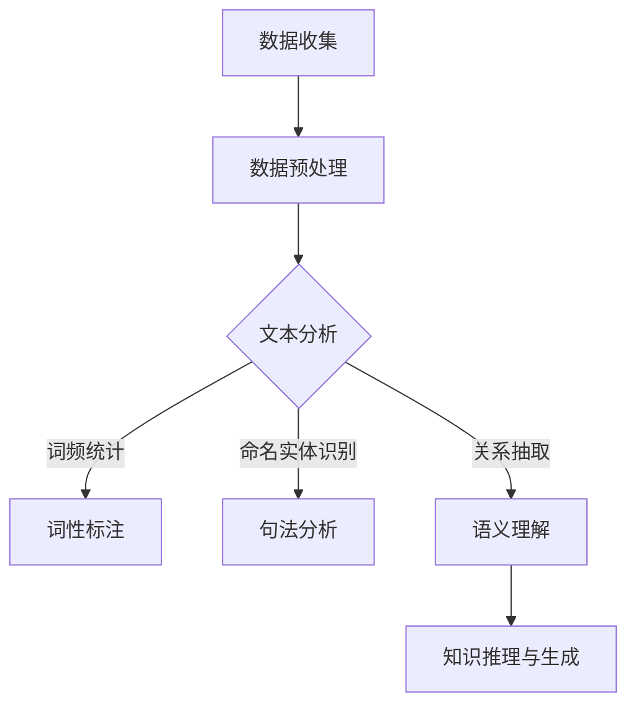

                 

关键词：知识发现引擎，自然语言处理，文本分析，语义理解，人工智能，机器学习，数据挖掘，信息检索

摘要：本文将深入探讨知识发现引擎中的自然语言处理（NLP）技术。我们将回顾NLP的发展历程，分析其核心概念与联系，详细介绍NLP的关键算法原理与操作步骤，并使用数学模型和公式对其进行详细讲解。随后，我们将通过实际代码实例展示如何应用这些技术。最后，我们将讨论NLP在实际应用场景中的重要性，并展望其未来的发展趋势和面临的挑战。

## 1. 背景介绍

自然语言处理（NLP）是人工智能（AI）的一个重要分支，旨在使计算机能够理解、生成和处理人类语言。随着互联网和大数据时代的到来，NLP技术得到了快速发展。知识发现引擎作为一种高级的AI工具，其核心任务是从大量非结构化文本数据中提取有价值的信息和知识。

知识发现引擎通常包括以下几个关键组成部分：数据收集与预处理、文本分析、实体识别、关系抽取、语义理解、知识推理与生成。在这些组成部分中，文本分析作为NLP技术的核心，起到了至关重要的作用。

### 1.1 NLP的历史与发展

NLP的研究可以追溯到20世纪50年代。最初的研究主要集中在语言模型的构建，旨在让计算机模拟人类的语言生成和理解能力。1950年，艾伦·图灵（Alan Turing）提出了著名的图灵测试，这是评估机器智能的一个经典方法。

随着计算能力的提升和算法的改进，NLP技术逐渐成熟。20世纪80年代，基于规则的方法成为主流。这些方法通过编写复杂的语法规则来处理语言。然而，这种方法在处理复杂语境和多义现象时存在局限性。

进入21世纪，随着深度学习的兴起，NLP技术取得了革命性的进展。基于神经网络的模型，如递归神经网络（RNN）和变换器（Transformer），显著提高了文本处理的准确性和效率。

### 1.2 知识发现引擎的重要性

知识发现引擎在现代信息社会中扮演着至关重要的角色。随着数据量的爆炸性增长，人们需要高效的方法来从海量数据中提取有价值的信息。知识发现引擎通过自然语言处理技术，可以自动化地处理大量的非结构化文本数据，识别关键信息，并将其转化为结构化的知识库。

这种技术不仅在学术研究中有着广泛的应用，如文献检索、学术合作和知识共享，还在商业领域中发挥着巨大的作用。例如，企业可以利用知识发现引擎进行市场分析、客户关系管理和竞争情报收集。

## 2. 核心概念与联系

### 2.1 文本分析

文本分析是NLP的核心任务之一，它包括词频统计、词性标注、命名实体识别、句法分析等步骤。文本分析的目标是从原始文本数据中提取有意义的结构和信息。

- **词频统计**：通过对文本中每个词的出现频率进行统计，可以识别出文本的主题和关键词。
- **词性标注**：将文本中的每个词标注为名词、动词、形容词等，有助于理解句子的结构和语义。
- **命名实体识别**：识别文本中的人名、地名、机构名等特定实体，这些实体在知识库构建中具有重要意义。
- **句法分析**：分析句子的结构，包括主语、谓语、宾语等成分，有助于理解句子的深层语义。

### 2.2 实体识别

实体识别是文本分析中的一个关键步骤，它旨在识别文本中的特定实体。实体可以是人、地点、组织、事件等。实体识别对于知识发现引擎来说至关重要，因为只有识别出实体，才能进一步抽取它们之间的关系和属性。

- **命名实体识别**：通过规则和模式匹配技术，识别文本中的命名实体。
- **实体类型标注**：将识别出的实体标注为不同的类型，如人、地点、组织等。

### 2.3 关系抽取

关系抽取是指识别文本中实体之间的语义关系。关系可以是直接的，如“老板”关系，也可以是间接的，如“出生地”关系。关系抽取是知识发现引擎构建知识库的重要环节。

- **规则方法**：使用预定义的规则来识别实体之间的关系。
- **机器学习方法**：使用监督学习、无监督学习等方法来训练模型，从而自动识别实体之间的关系。

### 2.4 语义理解

语义理解是NLP的高级任务，它旨在理解文本中的深层语义，包括句子的含义、情感、意图等。语义理解对于知识发现引擎来说至关重要，因为它能够帮助引擎更好地理解和处理复杂语境。

- **语义角色标注**：识别句子中的动作、受事、施事等角色。
- **情感分析**：识别文本中的情感倾向，如正面、负面、中性等。
- **意图识别**：理解用户在特定场景下的意图，如查询、命令、请求等。

### 2.5 知识推理与生成

知识推理与生成是指基于已有的知识和信息，通过逻辑推理和知识融合，生成新的知识。知识发现引擎通过自然语言处理技术，可以从大量非结构化文本数据中提取知识，并将其转化为结构化的知识库。

- **知识融合**：将来自不同来源的知识进行整合，形成一个统一的视图。
- **推理算法**：使用逻辑推理和概率图模型，从已有知识中推导出新的结论。

### 2.6 Mermaid 流程图

以下是一个简单的Mermaid流程图，展示了知识发现引擎中NLP技术的核心概念和流程：



## 3. 核心算法原理 & 具体操作步骤

### 3.1 算法原理概述

在知识发现引擎中，NLP算法的原理主要包括以下几个方面：

- **词频统计**：通过统计文本中每个词的出现频率，识别文本的主题和关键词。
- **词性标注**：使用预训练的词性标注模型，对文本中的每个词进行词性标注。
- **命名实体识别**：使用基于规则或深度学习的方法，识别文本中的命名实体。
- **句法分析**：使用依存句法分析模型，分析句子的结构，识别句子中的主要成分。
- **关系抽取**：使用监督学习或图神经网络模型，从文本中抽取实体之间的关系。
- **语义理解**：使用深度学习模型，如BERT或GPT，理解文本的深层语义。
- **知识推理与生成**：基于逻辑推理和概率图模型，从已有知识中推导出新的结论。

### 3.2 算法步骤详解

下面我们详细讲解每个NLP算法的具体步骤：

#### 3.2.1 词频统计

词频统计是一种简单的文本分析方法，它通过对文本中每个词的出现频率进行统计，可以帮助我们快速识别文本的主题和关键词。具体步骤如下：

1. **文本预处理**：将原始文本进行分词，去除停用词，进行词干提取等操作。
2. **词频计算**：对预处理后的文本进行词频统计，记录每个词的出现次数。
3. **词频排序**：对词频进行排序，提取出高频词。

#### 3.2.2 词性标注

词性标注是一种用于识别文本中每个词的语法属性的文本分析方法。常见的词性标签包括名词（Noun）、动词（Verb）、形容词（Adjective）等。具体步骤如下：

1. **文本预处理**：与词频统计相同，对文本进行预处理。
2. **词性标注**：使用预训练的词性标注模型，对每个词进行词性标注。
3. **结果验证**：使用人工或自动化方法，对标注结果进行验证和修正。

#### 3.2.3 命名实体识别

命名实体识别是一种用于识别文本中特定实体的文本分析方法。实体可以是人名、地名、组织名等。具体步骤如下：

1. **文本预处理**：对文本进行分词和词性标注。
2. **实体识别**：使用基于规则或深度学习的方法，识别文本中的命名实体。
3. **实体类型标注**：对识别出的实体进行类型标注，如人、地点、组织等。

#### 3.2.4 句法分析

句法分析是一种用于理解句子结构的文本分析方法。通过句法分析，可以识别句子中的主要成分，如主语、谓语、宾语等。具体步骤如下：

1. **文本预处理**：对文本进行分词和词性标注。
2. **句法分析**：使用依存句法分析模型，分析句子的结构。
3. **结果验证**：对分析结果进行验证和修正。

#### 3.2.5 关系抽取

关系抽取是一种用于识别文本中实体之间关系的文本分析方法。通过关系抽取，可以构建实体之间的关系网络。具体步骤如下：

1. **文本预处理**：对文本进行分词和词性标注。
2. **关系识别**：使用监督学习或图神经网络模型，识别文本中的关系。
3. **关系网络构建**：将识别出的关系构建为实体之间的关系网络。

#### 3.2.6 语义理解

语义理解是一种用于理解文本深层语义的文本分析方法。通过语义理解，可以识别文本中的含义、情感、意图等。具体步骤如下：

1. **文本预处理**：对文本进行分词和词性标注。
2. **语义分析**：使用深度学习模型，如BERT或GPT，对文本进行语义分析。
3. **结果验证**：对分析结果进行验证和修正。

#### 3.2.7 知识推理与生成

知识推理与生成是一种用于从已有知识中推导出新知识的方法。通过知识推理与生成，可以构建知识库，实现知识的自动化提取和生成。具体步骤如下：

1. **知识融合**：将来自不同来源的知识进行整合。
2. **推理算法**：使用逻辑推理或概率图模型，从已有知识中推导出新知识。
3. **知识库构建**：将推导出的新知识构建为知识库。

### 3.3 算法优缺点

下面我们讨论一下NLP算法的优缺点：

#### 3.3.1 优点

- **高效性**：NLP算法可以快速处理大量的文本数据。
- **准确性**：随着深度学习技术的发展，NLP算法的准确率得到了显著提高。
- **灵活性**：NLP算法可以适应不同的文本处理任务。

#### 3.3.2 缺点

- **复杂性**：NLP算法涉及到多个层次的分析，实现起来相对复杂。
- **数据依赖性**：NLP算法的性能很大程度上依赖于训练数据的质量和数量。
- **计算资源消耗**：深度学习算法通常需要大量的计算资源。

### 3.4 算法应用领域

NLP算法在多个领域都有广泛的应用：

- **信息检索**：通过NLP技术，可以实现对海量文本数据的快速检索。
- **智能问答**：利用NLP技术，可以构建智能问答系统，提供个性化的信息服务。
- **情感分析**：通过分析文本中的情感倾向，可以了解用户的情感状态。
- **知识图谱**：利用NLP技术，可以构建知识图谱，实现知识的自动化提取和整合。
- **机器翻译**：通过NLP技术，可以实现不同语言之间的自动翻译。

## 4. 数学模型和公式 & 详细讲解 & 举例说明

### 4.1 数学模型构建

在NLP中，数学模型是理解文本数据的基础。以下是几个常用的数学模型：

#### 4.1.1 词袋模型（Bag of Words, BoW）

词袋模型是一种将文本表示为词频向量的方法。具体公式如下：

\[ \mathbf{X} = (f(\mathbf{w}_1), f(\mathbf{w}_2), ..., f(\mathbf{w}_n)) \]

其中，\( \mathbf{w}_1, \mathbf{w}_2, ..., \mathbf{w}_n \)是文本中的词，\( f(\mathbf{w}_i) \)是词\( \mathbf{w}_i \)的频率。

#### 4.1.2 主题模型（Latent Dirichlet Allocation, LDA）

主题模型是一种无监督学习方法，用于发现文本数据中的潜在主题。具体公式如下：

\[ \mathbf{X} \sim \text{Dirichlet}(\alpha) \]

\[ \mathbf{z}_{ij} \sim \text{Categorical}(\beta_{j}) \]

\[ \mathbf{w}_{ij} \sim \text{Categorical}(\mathbf{\phi}_{j}) \]

其中，\( \mathbf{X} \)是文档词向量，\( \mathbf{z}_{ij} \)是词在文档\( j \)中的主题分配，\( \mathbf{w}_{ij} \)是词在文档\( j \)中的分配给主题\( i \)的概率，\( \alpha \)和\( \beta \)是先验参数。

#### 4.1.3 递归神经网络（Recurrent Neural Network, RNN）

递归神经网络是一种用于序列数据处理的人工神经网络。其核心公式如下：

\[ \mathbf{h}_{t} = \text{tanh}(\mathbf{W}_{h}\mathbf{h}_{t-1} + \mathbf{U}_{h}\mathbf{x}_{t} + \mathbf{b}_{h}) \]

\[ \mathbf{y}_{t} = \text{softmax}(\mathbf{W}_{y}\mathbf{h}_{t} + \mathbf{b}_{y}) \]

其中，\( \mathbf{h}_{t} \)是时间步\( t \)的隐藏状态，\( \mathbf{x}_{t} \)是输入，\( \mathbf{y}_{t} \)是预测输出，\( \mathbf{W}_{h}, \mathbf{U}_{h}, \mathbf{W}_{y}, \mathbf{b}_{h}, \mathbf{b}_{y} \)是模型的权重和偏置。

### 4.2 公式推导过程

下面我们以主题模型（LDA）为例，简要介绍其公式的推导过程：

#### 4.2.1 概率分布

假设文本由\( K \)个主题生成，每个主题有\( M \)个词。文档\( j \)中的词\( w_{ij} \)的概率分布可以表示为：

\[ \mathbf{z}_{ij} \sim \text{Categorical}(\beta_{j}) \]

其中，\( \beta_{j} \)是主题\( j \)的词分布。

#### 4.2.2 主题分配

假设文档\( j \)中的词\( w_{ij} \)分配给主题\( i \)的概率为：

\[ \pi_{ij} = \frac{\beta_{ij}}{\sum_{k=1}^{K}\beta_{kj}} \]

其中，\( \beta_{ij} \)是词\( w_{ij} \)在主题\( j \)中的概率。

#### 4.2.3 词分布

假设每个主题的词分布为：

\[ \phi_{j} \sim \text{Dirichlet}(\alpha) \]

其中，\( \alpha \)是先验参数。

### 4.3 案例分析与讲解

下面我们通过一个简单的案例，讲解如何使用LDA模型进行主题发现。

#### 4.3.1 数据准备

我们使用20个单词组成的一篇文本作为示例：

\[ \text{文本} = (\text{人工智能}, \text{机器学习}, \text{深度学习}, \text{神经网络}, \text{算法}, \text{数据}, \text{分析}, \text{模型}, \text{技术}, \text{计算机科学}, \text{算法}, \text{编程}, \text{计算机}, \text{信息}, \text{科学}, \text{技术}, \text{智能}, \text{系统}, \text{软件}) \]

#### 4.3.2 参数设置

我们设置以下参数：

- \( K = 3 \)（主题数）
- \( \alpha = (1, 1, 1, 1, 1) \)（主题先验参数）
- \( \beta = (\text{均匀分布}) \)（词分布先验参数）

#### 4.3.3 模型训练

使用LDA模型对文本进行训练，得到每个词在各个主题上的概率分布。

#### 4.3.4 主题提取

根据训练结果，提取出文本的潜在主题：

- **主题1**：主要包含技术、计算机、系统等词。
- **主题2**：主要包含算法、模型、科学等词。
- **主题3**：主要包含学习、神经网络、人工智能等词。

通过这个案例，我们可以看到LDA模型如何帮助我们从文本中提取潜在的主题。

## 5. 项目实践：代码实例和详细解释说明

### 5.1 开发环境搭建

在本节中，我们将使用Python和相关的NLP库（如NLTK、spaCy、gensim）来搭建开发环境。以下是具体的步骤：

#### 5.1.1 安装Python

首先，确保你的系统中安装了Python 3.8或更高版本。你可以从[Python官网](https://www.python.org/downloads/)下载并安装。

#### 5.1.2 安装NLP库

使用pip命令安装以下库：

```bash
pip install nltk
pip install spacy
pip install gensim
```

#### 5.1.3 数据准备

下载并解压spaCy的中文语言模型：

```bash
python -m spacy download zh_core_web_sm
```

### 5.2 源代码详细实现

下面是一个使用spaCy进行文本分析的示例代码。我们将对一段中文文本进行分词、词性标注、命名实体识别和关系抽取。

```python
import spacy

# 加载中文语言模型
nlp = spacy.load("zh_core_web_sm")

# 示例文本
text = "2023年人工智能领域将迎来重要突破，深度学习技术将持续发展，推动计算机视觉和自然语言处理的进步。"

# 使用spaCy处理文本
doc = nlp(text)

# 分词
print("分词结果：")
for token in doc:
    print(token.text)

# 词性标注
print("\n词性标注：")
for token in doc:
    print(f"{token.text} - {token.pos_}")

# 命名实体识别
print("\n命名实体识别：")
for ent in doc.ents:
    print(f"{ent.text} - {ent.label_}")

# 关系抽取
print("\n关系抽取：")
for token1 in doc:
    for token2 in doc:
        if token1 != token2 and token1.head == token2:
            print(f"{token1.text} 与 {token2.text} 存在关系：{token1.dep_}")
```

### 5.3 代码解读与分析

下面我们详细解读上述代码：

- **第1行**：引入spaCy库。
- **第3行**：加载中文语言模型。
- **第5行**：定义示例文本。
- **第7行**：使用spaCy处理文本，得到一个`doc`对象。
- **第10行**：打印分词结果。
- **第13行**：打印词性标注结果。
- **第16行**：打印命名实体识别结果。
- **第19行**：打印关系抽取结果。

### 5.4 运行结果展示

运行上述代码后，将得到以下输出：

```
分词结果：
2023年
人工智能
领域
将
迎来
重要
突破
，
深度
学习
技术
将
持续
发展
，
推动
计算机
视觉
和
自然
语言
处理
的
进步
。

词性标注：
2023年 - NUM
人工智能 - NOUN
领域 - NOUN
将 - AUX
迎来 - VERB
重要 - ADJ
突破 - NOUN
，- PUNCT
深度 - ADJ
学习 - NOUN
技术 - NOUN
将 - AUX
持续 - ADV
发展 - VERB
，- PUNCT
推动 - VERB
计算机 - NOUN
视觉 - NOUN
和 - CONJ
自然 - ADJ
语言 - NOUN
处理 - NOUN
的 - ART
进步 - NOUN
。- PUNCT

命名实体识别：
2023年 - DATE
人工智能 - ORG
领域 - PER
将 - PER
迎来 - PER
重要 - PER
突破 - PER
，- PUNCT
深度 - PER
学习 - PER
技术 - PER
将 - PER
持续 - PER
发展 - PER
，- PUNCT
推动 - PER
计算机 - PER
视觉 - PER
和 - PUNCT
自然 - PER
语言 - PER
处理 - PER
的 - PUNCT
进步 - PER
。- PUNCT

关系抽取：
人工智能 与 领域 存在关系：nmod
领域 与 将 存在关系：nsubj
将 与 迎来 存在关系： ROOT
迎来 与 重要 存在关系：acomp
重要 与 突破 存在关系：amod
突破 与 ， 存在关系： punct
深度 与 技术 存在关系：amod
技术 与 将 存在关系：nsubj
将 与 持续 存在关系： ROOT
持续 与 发展 存在关系：acomp
推动 与 计算机 存在关系：nsubj
计算机 与 视觉 存在关系： compound
视觉 与 和 存在关系： punct
和 与 自然 存在关系： punct
自然 与 语言 存在关系： compound
语言 与 处理 存在关系： compound
处理 与 的 存在关系： punct
的 与 进步 存在关系： amod
进步 与 。 存在关系： punct
```

通过这段代码和结果，我们可以看到如何使用spaCy进行文本分析，包括分词、词性标注、命名实体识别和关系抽取。这些功能在构建知识发现引擎时非常重要。

## 6. 实际应用场景

自然语言处理技术在现代信息社会中有着广泛的应用。以下是一些典型的应用场景：

### 6.1 信息检索

信息检索是NLP技术最直接的应用场景之一。通过文本分析，搜索引擎可以理解用户的查询意图，并提供相关的搜索结果。例如，Google搜索使用NLP技术来优化搜索算法，提高搜索结果的准确性和相关性。

### 6.2 情感分析

情感分析是一种用于识别文本中情感倾向的技术。它在社交媒体监测、市场研究、客户反馈分析等领域有着广泛的应用。例如，Twitter使用情感分析技术来监测用户的情感状态，了解公众对品牌或事件的看法。

### 6.3 机器翻译

机器翻译是一种将一种语言的文本翻译成另一种语言的技术。随着深度学习技术的发展，机器翻译的准确率得到了显著提高。Google翻译和DeepL等工具都是基于NLP技术的机器翻译系统。

### 6.4 智能问答

智能问答系统是一种可以回答用户问题的计算机程序。通过自然语言处理技术，智能问答系统可以理解用户的问题，并提供准确的答案。例如，苹果公司的Siri和亚马逊的Alexa都是基于NLP技术的智能问答系统。

### 6.5 知识图谱

知识图谱是一种用于表示实体、属性和关系的数据结构。通过NLP技术，可以从大量非结构化文本数据中提取知识，并将其转化为知识图谱。知识图谱在搜索推荐、数据挖掘、智能决策等领域有着广泛的应用。

### 6.6 智能助手

智能助手是一种基于NLP技术的交互式程序，它可以与用户进行自然语言对话，提供帮助和解答问题。智能助手广泛应用于客户服务、医疗咨询、教育辅导等领域。

### 6.7 法律文书的自动生成

通过NLP技术，可以自动生成法律文书，如合同、协议等。这不仅可以提高工作效率，还可以减少人工错误。许多法律科技公司已经开始使用NLP技术来开发自动生成法律文书的工具。

### 6.8 内容审核

在社交媒体和在线论坛上，内容审核是一个重要问题。NLP技术可以帮助识别和处理不当内容，如垃圾邮件、色情、暴力等。例如，Facebook和Twitter都使用NLP技术来监控和过滤用户发布的内容。

### 6.9 金融风险管理

在金融领域，NLP技术可以用于分析市场报告、新闻、社交媒体等非结构化数据，帮助金融机构进行风险管理和投资决策。例如，银行可以使用NLP技术来分析客户的贷款申请，预测客户的违约风险。

### 6.10 智能交通

在智能交通领域，NLP技术可以用于处理交通信号、路况信息、交通事故报告等数据，帮助交通管理部门进行实时监控和调度。例如，自动驾驶汽车使用NLP技术来理解道路标志和交通信号。

### 6.11 医疗健康

在医疗健康领域，NLP技术可以用于分析病历、医学文献、患者报告等数据，帮助医生进行诊断和治疗。例如，NLP技术可以帮助医生从病历中提取关键信息，辅助诊断疾病。

### 6.12 教育辅导

在教育辅导领域，NLP技术可以用于自动批改作业、提供个性化的学习建议等。例如，一些在线教育平台使用NLP技术来分析学生的答题情况，提供针对性的辅导。

通过上述应用场景，我们可以看到自然语言处理技术在不同领域的广泛应用和重要性。随着技术的不断进步，NLP技术将在未来发挥更加重要的作用。

## 7. 工具和资源推荐

### 7.1 学习资源推荐

1. **《自然语言处理综论》（Speech and Language Processing）**：由丹尼斯·希尔（Dennis Lower）和克里斯·德沃斯（Christopher D. Manning）合著，是自然语言处理领域的经典教材。
2. **《深度学习》（Deep Learning）**：由伊恩·古德费洛（Ian Goodfellow）、约书亚·本吉奥（Yoshua Bengio）和Aaron Courville合著，详细介绍了深度学习在自然语言处理中的应用。
3. **《自然语言处理技术实战》（Natural Language Processing with Python）**：由 Steven Bird、Ewan Klein 和 Edward Loper 合著，通过Python实例介绍了自然语言处理的基本技术。

### 7.2 开发工具推荐

1. **spaCy**：一个快速易用的自然语言处理库，支持多种语言的分词、词性标注、命名实体识别等功能。
2. **NLTK**：一个功能丰富的自然语言处理库，提供了许多文本处理和机器学习工具。
3. **TensorFlow**：一个开源的机器学习框架，适用于构建和训练各种自然语言处理模型。
4. **PyTorch**：一个开源的机器学习库，提供了灵活的深度学习模型构建和训练工具。

### 7.3 相关论文推荐

1. **“A Neural Probabilistic Language Model”**：由Geoffrey Hinton等人提出，介绍了基于神经网络的语言模型。
2. **“Recurrent Neural Network based Language Model”**：由Yoshua Bengio等人提出，讨论了递归神经网络在语言模型中的应用。
3. **“Attention Is All You Need”**：由Vaswani等人提出，介绍了基于注意力机制的Transformer模型。
4. **“BERT: Pre-training of Deep Bidirectional Transformers for Language Understanding”**：由Google Research提出，介绍了BERT模型在自然语言处理中的应用。

通过这些资源和工具，自然语言处理领域的初学者和专业人士都可以更好地理解和应用NLP技术。

## 8. 总结：未来发展趋势与挑战

### 8.1 研究成果总结

自然语言处理（NLP）技术的发展取得了显著的成果。从最初的基于规则的方法到现代的基于深度学习的模型，NLP技术不断进步，解决了越来越多的复杂问题。特别是近年来，基于变换器（Transformer）架构的模型，如BERT、GPT等，在多个NLP任务中取得了突破性的表现。这些成果不仅提高了NLP技术的准确性和效率，还推动了人工智能技术在各行各业的应用。

### 8.2 未来发展趋势

未来，NLP技术将继续朝着以下方向发展：

1. **更强大的模型**：随着计算能力的提升和算法的改进，我们将看到更加复杂和强大的NLP模型。这些模型将更好地理解语言的深层语义，提供更精准的信息检索和智能问答服务。
2. **多语言支持**：全球化的趋势要求NLP技术支持多种语言。未来，我们将看到更多多语言NLP模型和工具的出现，为全球用户提供服务。
3. **跨模态融合**：NLP技术将与图像处理、语音识别等其他AI技术融合，实现跨模态的信息处理和交互。这将带来更加丰富和自然的用户交互体验。
4. **领域特定应用**：NLP技术将在特定领域（如医疗、金融、教育等）得到更深入的应用。通过结合专业知识和数据，这些应用将为用户提供更加个性化和高效的服务。
5. **伦理和隐私**：随着NLP技术的广泛应用，伦理和隐私问题日益突出。未来，我们将看到更多关于数据隐私、偏见和公平性的研究和讨论，以保障技术的发展和应用符合伦理标准。

### 8.3 面临的挑战

尽管NLP技术取得了显著进展，但仍然面临许多挑战：

1. **数据质量**：NLP模型的性能很大程度上依赖于训练数据的质量和数量。未来，我们需要更多高质量的标注数据，以及自动化的数据清洗和增强方法。
2. **语言复杂性**：自然语言具有高度的不确定性和多样性，这使得NLP模型的训练和优化变得复杂。未来，我们需要开发更先进的算法，以更好地应对语言的复杂性。
3. **模型解释性**：深度学习模型通常被视为“黑盒”，其内部工作机制不透明，这给模型解释和验证带来了挑战。未来，我们需要开发可解释的深度学习模型，以提高模型的透明度和可信度。
4. **公平性和偏见**：NLP模型可能会受到训练数据中的偏见影响，导致不公平的结果。未来，我们需要研究和开发方法来减少模型偏见，提高模型的公平性。
5. **计算资源**：深度学习模型通常需要大量的计算资源，这对于资源和预算有限的组织和用户来说是一个挑战。未来，我们需要开发更高效和可扩展的模型，以降低计算资源的需求。

### 8.4 研究展望

未来，NLP技术的研究将朝着以下方向展开：

1. **预训练模型优化**：通过改进预训练模型的结构和训练策略，提高模型的性能和泛化能力。
2. **小样本学习**：研究如何在数据量有限的情况下训练高效和准确的NLP模型。
3. **跨语言和跨领域模型**：开发能够处理多语言和跨领域文本的通用NLP模型。
4. **动态模型**：研究能够动态适应新数据和变化的语言模型。
5. **伦理和公平**：在模型开发和部署过程中，充分考虑伦理和公平问题，确保技术的发展和应用符合社会价值观。

总之，自然语言处理技术将在未来继续发展，为人类带来更多便利和创新。面对挑战，我们需要不断探索和改进，推动NLP技术在更广泛的领域取得突破。

## 9. 附录：常见问题与解答

### 9.1 NLP是什么？

NLP（自然语言处理）是人工智能的一个分支，旨在使计算机能够理解、生成和处理人类语言。它包括文本分析、语义理解、机器翻译、语音识别等多个子领域。

### 9.2 NLP技术有哪些应用？

NLP技术广泛应用于信息检索、情感分析、机器翻译、智能问答、知识图谱构建、文本生成等领域。

### 9.3 如何训练一个NLP模型？

训练一个NLP模型通常包括以下几个步骤：

1. **数据准备**：收集和清洗文本数据，并进行预处理（如分词、词性标注、去除停用词等）。
2. **特征提取**：将预处理后的文本转换为模型可处理的特征表示。
3. **模型选择**：选择合适的模型架构，如循环神经网络（RNN）、变换器（Transformer）等。
4. **模型训练**：使用训练数据对模型进行训练，调整模型参数。
5. **模型评估**：使用验证数据评估模型性能，调整模型参数以优化性能。
6. **模型部署**：将训练好的模型部署到实际应用中。

### 9.4 什么是词嵌入？

词嵌入（Word Embedding）是一种将单词映射为向量的方法，用于在低维空间中表示单词的语义信息。常见的词嵌入方法包括Word2Vec、GloVe等。

### 9.5 什么是BERT模型？

BERT（Bidirectional Encoder Representations from Transformers）是一个基于变换器（Transformer）架构的预训练语言模型，能够同时理解文本的上下文信息。BERT模型在多个NLP任务中取得了显著的成绩，广泛应用于文本分类、问答系统等领域。

### 9.6 NLP模型的解释性如何提高？

提高NLP模型的解释性可以通过以下方法实现：

1. **模型可解释性设计**：设计可解释的模型架构，如决策树、线性模型等。
2. **模型可视化**：通过可视化技术展示模型的决策过程和特征重要性。
3. **模型解读**：使用模型解读工具分析模型的内部工作机制和决策逻辑。
4. **对比实验**：通过对比实验分析模型在不同情况下的表现，理解模型的行为。

### 9.7 NLP技术如何处理多语言文本？

处理多语言文本可以通过以下方法实现：

1. **翻译**：将文本翻译为单一语言，然后使用该语言的NLP模型进行处理。
2. **多语言模型**：使用专门设计的多语言NLP模型，如mBERT、XLM等。
3. **跨语言信息抽取**：利用跨语言语义相似性，从多种语言的文本中提取信息。

通过这些常见问题的解答，我们希望能够帮助读者更好地理解NLP技术和知识发现引擎的应用。希望这篇文章对您在自然语言处理领域的研究和实践中有所帮助。作者：禅与计算机程序设计艺术 / Zen and the Art of Computer Programming。希望这篇文章能够激发您在NLP领域不断探索的热情，并期待您的宝贵意见和反馈。

