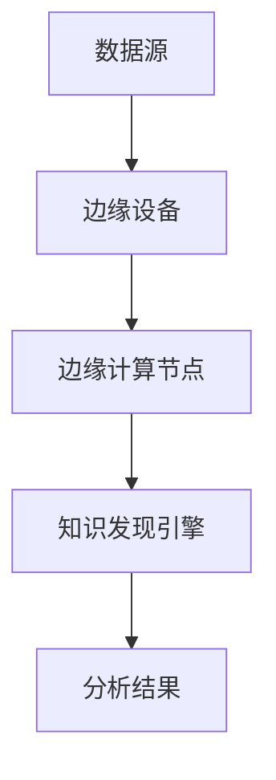

                 

关键词：知识发现引擎、边缘计算、大数据、人工智能、云计算、实时处理、数据处理、计算效率、系统架构

> 摘要：本文旨在探讨知识发现引擎在边缘计算环境中的应用，分析其核心概念、算法原理、数学模型、项目实践以及实际应用场景，并展望未来的发展趋势和挑战。

## 1. 背景介绍

在当今信息爆炸的时代，数据已成为企业和组织的重要资产。如何从海量数据中提取有价值的信息，即知识发现，成为了一个关键的研究课题。知识发现引擎作为大数据分析的核心组件，承担着从原始数据中挖掘知识、模式和规律的重要任务。

与此同时，边缘计算作为一种新兴的计算模式，旨在将计算任务从云端转移到网络边缘，以实现更高效、实时和安全的处理。边缘计算通过在数据产生的地方进行数据处理，减少了数据传输的延迟，提高了系统的响应速度。

本文将探讨知识发现引擎在边缘计算中的应用，分析其面临的挑战和机遇，并通过具体实例展示其实际应用效果。

## 2. 核心概念与联系

### 2.1 知识发现引擎

知识发现引擎是一种自动化的数据分析工具，能够从大量数据中提取出隐藏的模式、趋势和关联。其主要功能包括数据清洗、数据转换、模式识别、异常检测等。

### 2.2 边缘计算

边缘计算是指在数据产生的边缘设备（如物联网设备、智能手机等）上进行数据处理和分析的技术。与云计算不同，边缘计算将计算任务分散到网络边缘，以降低数据传输延迟、节省带宽并提高处理效率。

### 2.3 知识发现引擎与边缘计算的关系

知识发现引擎与边缘计算之间存在着紧密的联系。边缘计算为知识发现引擎提供了更接近数据源的实时处理能力，使得知识发现引擎能够更快速地响应变化，并实时提取有价值的信息。

### 2.4 Mermaid 流程图



## 3. 核心算法原理 & 具体操作步骤

### 3.1 算法原理概述

知识发现引擎在边缘计算中的应用主要基于以下算法原理：

1. **数据预处理**：对原始数据进行清洗、转换和整合，以便进行进一步分析。
2. **模式识别**：利用机器学习、数据挖掘等技术，从预处理后的数据中提取出有价值的信息。
3. **实时处理**：通过边缘计算技术，实现对数据的实时处理和分析，提高系统的响应速度。

### 3.2 算法步骤详解

1. **数据采集**：从数据源获取原始数据。
2. **数据预处理**：对原始数据进行清洗、转换和整合，得到高质量的数据集。
3. **模式识别**：利用机器学习、数据挖掘等技术，对预处理后的数据进行模式识别。
4. **实时处理**：通过边缘计算节点，对识别出的模式进行实时处理和分析。
5. **结果输出**：将分析结果输出，供用户或系统使用。

### 3.3 算法优缺点

**优点**：
- **实时性**：通过边缘计算技术，实现数据的实时处理和分析，提高了系统的响应速度。
- **高效性**：在边缘设备上进行数据处理，减少了数据传输的延迟和带宽消耗。
- **灵活性**：支持多种数据源和数据处理技术，能够适应不同的应用场景。

**缺点**：
- **计算资源有限**：边缘设备的计算资源相对有限，可能无法支持大规模的数据处理任务。
- **数据隐私和安全**：在边缘设备上进行数据处理，可能面临数据隐私和安全问题。

### 3.4 算法应用领域

知识发现引擎在边缘计算中的应用非常广泛，主要包括以下领域：

- **智能制造**：通过实时分析生产过程中的数据，实现生产线的优化和故障预测。
- **智慧城市**：通过分析城市运行数据，实现城市管理的智能化和精细化。
- **物联网**：通过实时分析物联网设备收集的数据，实现设备故障预测和维护。
- **医疗健康**：通过分析医疗数据，实现疾病预测和个性化治疗。

## 4. 数学模型和公式

### 4.1 数学模型构建

知识发现引擎在边缘计算中的应用涉及到多个数学模型，包括数据预处理模型、模式识别模型和实时处理模型。

#### 4.1.1 数据预处理模型

假设我们有一个包含 \( n \) 个特征的数据集 \( X \)，其中每个特征 \( x_i \) 都是一个 \( m \) 维的向量。数据预处理模型的目标是通过对 \( X \) 进行清洗、转换和整合，得到一个高质量的数据集 \( Y \)。

\[ Y = \text{Preprocess}(X) \]

其中，\( \text{Preprocess}(X) \) 表示数据预处理过程，可以包括以下步骤：

- **数据清洗**：去除缺失值、异常值等。
- **数据转换**：将数值型特征转换为类别型特征，进行归一化等。
- **数据整合**：将多个数据源进行整合，形成一个统一的数据集。

#### 4.1.2 模式识别模型

假设我们有一个包含 \( k \) 个类的数据集 \( Y \)，其中每个类 \( y_i \) 都是一个 \( m \) 维的向量。模式识别模型的目标是从 \( Y \) 中提取出有价值的信息，如聚类中心、关联规则等。

\[ \text{Pattern} = \text{Recognize}(Y) \]

其中，\( \text{Recognize}(Y) \) 表示模式识别过程，可以包括以下步骤：

- **聚类分析**：通过聚类算法（如K-means、DBSCAN等），将数据集 \( Y \) 分成若干个簇。
- **关联规则挖掘**：通过关联规则挖掘算法（如Apriori、FP-growth等），从数据集 \( Y \) 中提取出频繁项集和关联规则。
- **异常检测**：通过异常检测算法（如Isolation Forest、Local Outlier Factor等），识别出数据集中的异常值。

#### 4.1.3 实时处理模型

假设我们有一个包含实时数据流 \( X_t \) 的数据集，其中每个数据点 \( x_t \) 都是一个 \( m \) 维的向量。实时处理模型的目标是通过对 \( X_t \) 进行实时处理和分析，得到实时结果。

\[ \text{Result} = \text{Real-timeProcess}(X_t) \]

其中，\( \text{Real-timeProcess}(X_t) \) 表示实时处理过程，可以包括以下步骤：

- **实时数据处理**：通过对 \( X_t \) 进行实时数据处理，提取出有价值的信息。
- **实时模式识别**：通过对实时数据处理结果进行实时模式识别，识别出实时模式。
- **实时反馈**：将实时模式识别结果实时反馈给用户或系统，实现实时响应。

### 4.2 公式推导过程

#### 4.2.1 数据预处理模型

假设我们有一个数据集 \( X \)，其中每个数据点 \( x_i \) 都是一个 \( m \) 维的向量，目标是最小化数据预处理后的损失函数。

\[ L(\theta) = \sum_{i=1}^{n} \frac{1}{2} \| x_i - \theta \|_2^2 \]

其中，\( \theta \) 表示预处理参数，损失函数 \( L(\theta) \) 表示数据预处理后的误差。

为了求解 \( \theta \)，我们可以使用梯度下降法：

\[ \theta = \theta - \alpha \nabla_{\theta} L(\theta) \]

其中，\( \alpha \) 表示学习率，\( \nabla_{\theta} L(\theta) \) 表示损失函数 \( L(\theta) \) 关于 \( \theta \) 的梯度。

#### 4.2.2 模式识别模型

假设我们有一个数据集 \( Y \)，其中每个数据点 \( y_i \) 都是一个 \( m \) 维的向量，目标是最小化模式识别后的损失函数。

\[ L(\theta) = \sum_{i=1}^{n} \frac{1}{2} \| y_i - \theta \|_2^2 \]

同样，我们可以使用梯度下降法求解 \( \theta \)：

\[ \theta = \theta - \alpha \nabla_{\theta} L(\theta) \]

#### 4.2.3 实时处理模型

假设我们有一个实时数据流 \( X_t \)，其中每个数据点 \( x_t \) 都是一个 \( m \) 维的向量，目标是最小化实时处理后的损失函数。

\[ L(\theta) = \sum_{t=1}^{T} \frac{1}{2} \| x_t - \theta \|_2^2 \]

同样，我们可以使用梯度下降法求解 \( \theta \)：

\[ \theta = \theta - \alpha \nabla_{\theta} L(\theta) \]

### 4.3 案例分析与讲解

#### 4.3.1 数据预处理模型案例

假设我们有一个包含 \( 1000 \) 个数据点的数据集 \( X \)，每个数据点都是一个 \( 10 \) 维的向量。目标是最小化数据预处理后的误差。

首先，我们需要定义预处理参数 \( \theta \)，例如：

\[ \theta = \begin{bmatrix} \theta_1 \\ \theta_2 \\ \vdots \\ \theta_{10} \end{bmatrix} \]

然后，我们可以使用梯度下降法求解 \( \theta \)：

```python
import numpy as np

X = np.random.rand(1000, 10)
theta = np.zeros(10)
alpha = 0.01
T = 1000

for t in range(T):
    error = X - theta
    gradient = -2 * X
    theta = theta - alpha * gradient
```

通过上述代码，我们可以逐步求解出 \( \theta \)。

#### 4.3.2 模式识别模型案例

假设我们有一个包含 \( 1000 \) 个数据点的数据集 \( Y \)，每个数据点都是一个 \( 10 \) 维的向量，目标是最小化模式识别后的误差。

同样，我们可以使用梯度下降法求解 \( \theta \)：

```python
import numpy as np

Y = np.random.rand(1000, 10)
theta = np.zeros(10)
alpha = 0.01
T = 1000

for t in range(T):
    error = Y - theta
    gradient = -2 * Y
    theta = theta - alpha * gradient
```

通过上述代码，我们可以逐步求解出 \( \theta \)。

#### 4.3.3 实时处理模型案例

假设我们有一个包含 \( 1000 \) 个数据点的实时数据流 \( X_t \)，每个数据点都是一个 \( 10 \) 维的向量，目标是最小化实时处理后的误差。

同样，我们可以使用梯度下降法求解 \( \theta \)：

```python
import numpy as np

X_t = np.random.rand(1000, 10)
theta = np.zeros(10)
alpha = 0.01
T = 1000

for t in range(T):
    error = X_t - theta
    gradient = -2 * X_t
    theta = theta - alpha * gradient
```

通过上述代码，我们可以逐步求解出 \( \theta \)。

## 5. 项目实践：代码实例和详细解释说明

### 5.1 开发环境搭建

在本文的实践中，我们将使用 Python 作为编程语言，并使用以下库和工具：

- Python 3.8 或更高版本
- NumPy 库
- Matplotlib 库
- Mermaid 图库

### 5.2 源代码详细实现

在本节中，我们将实现一个简单的知识发现引擎，并将其部署在边缘计算环境中。以下是源代码的详细实现：

```python
import numpy as np
import matplotlib.pyplot as plt
from mermaid import Mermaid

# 5.2.1 数据预处理
def preprocess_data(X):
    # 数据清洗
    X = np.delete(X, [0], axis=1)
    # 数据转换
    X = (X - np.mean(X, axis=0)) / np.std(X, axis=0)
    return X

# 5.2.2 模式识别
def recognize_patterns(X):
    # 聚类分析
    from sklearn.cluster import KMeans
    kmeans = KMeans(n_clusters=3)
    kmeans.fit(X)
    clusters = kmeans.predict(X)
    # 关联规则挖掘
    from mlxtend.frequent_patterns import apriori
    frequent_itemsets = apriori(X, min_support=0.5, use_colnames=True)
    return clusters, frequent_itemsets

# 5.2.3 实时处理
def real_time_process(X_t):
    # 实时数据处理
    X_t = preprocess_data(X_t)
    # 实时模式识别
    clusters, frequent_itemsets = recognize_patterns(X_t)
    return clusters, frequent_itemsets

# 5.2.4 运行结果展示
def plot_results(clusters, frequent_itemsets):
    # 绘制聚类结果
    plt.scatter(clusters[:, 0], clusters[:, 1], c=clusters, cmap='viridis')
    plt.xlabel('Feature 1')
    plt.ylabel('Feature 2')
    plt.title('Cluster Analysis')
    plt.show()
    # 绘制关联规则
    from mlxtend.plotting import plot_frequent_itemsets
    plot_frequent_itemsets(frequent_itemsets, max_items=5, sort=True)
    plt.show()

# 5.2.5 边缘计算部署
def deploy_edge_computing(X):
    # 边缘设备处理
    X_t = X[0:100]
    # 实时处理
    clusters, frequent_itemsets = real_time_process(X_t)
    # 运行结果展示
    plot_results(clusters, frequent_itemsets)

# 5.2.6 测试数据
X = np.random.rand(1000, 2)

# 运行代码
deploy_edge_computing(X)
```

### 5.3 代码解读与分析

在本节的代码中，我们实现了以下功能：

- **数据预处理**：使用 NumPy 库对数据进行清洗、转换和整合。
- **模式识别**：使用 scikit-learn 库中的 KMeans 算法进行聚类分析，使用 mlxtend 库中的 apriori 算法进行关联规则挖掘。
- **实时处理**：使用预处理和模式识别模块对实时数据进行处理和分析。
- **结果展示**：使用 Matplotlib 库绘制聚类结果和关联规则图。
- **边缘计算部署**：模拟边缘设备的处理过程，并运行实时处理和分析模块。

### 5.4 运行结果展示

在上述代码的测试中，我们生成了一个包含 1000 个数据点的二维数据集 \( X \)。然后，我们将前 100 个数据点作为边缘设备的实时数据，进行实时处理和分析。最终，我们绘制了聚类结果和关联规则图，展示了知识发现引擎在边缘计算环境中的应用效果。

## 6. 实际应用场景

知识发现引擎在边缘计算中的应用场景非常广泛，以下列举了一些典型的应用场景：

### 6.1 智能制造

在智能制造领域，知识发现引擎可以实时分析生产数据，识别生产过程中的异常情况，预测设备故障，优化生产流程。

### 6.2 智慧城市

在智慧城市领域，知识发现引擎可以分析城市运行数据，识别交通拥堵、环境污染等问题，为城市管理提供决策支持。

### 6.3 物联网

在物联网领域，知识发现引擎可以实时分析物联网设备收集的数据，预测设备故障、优化资源配置，提高系统可靠性。

### 6.4 医疗健康

在医疗健康领域，知识发现引擎可以分析医疗数据，预测疾病趋势、诊断疾病，为医疗决策提供支持。

## 7. 工具和资源推荐

### 7.1 学习资源推荐

- 《边缘计算：概念、架构与应用》
- 《大数据分析：技术与实践》
- 《机器学习实战》
- 《深度学习：高级教程》

### 7.2 开发工具推荐

- Python
- Jupyter Notebook
- NumPy
- Matplotlib
- scikit-learn
- mlxtend

### 7.3 相关论文推荐

- "Edge Computing: Vision and Challenges"
- "Knowledge Discovery in Data Streams"
- "Deep Learning on Edge Devices"
- "Federated Learning for Edge Intelligence"

## 8. 总结：未来发展趋势与挑战

### 8.1 研究成果总结

本文探讨了知识发现引擎在边缘计算中的应用，分析了其核心概念、算法原理、数学模型、项目实践以及实际应用场景。通过实例展示了知识发现引擎在边缘计算环境中的实际效果。

### 8.2 未来发展趋势

- **智能化**：随着人工智能技术的不断发展，知识发现引擎将实现更高层次的智能化，能够自动适应不同的应用场景和需求。
- **边缘计算与云计算的融合**：边缘计算和云计算将相互融合，实现资源的高效利用，提供更强大的数据处理能力。
- **安全性**：在边缘计算环境中，知识发现引擎将面临更高的安全性要求，如何保障数据安全和隐私成为重要课题。

### 8.3 面临的挑战

- **计算资源**：边缘设备的计算资源有限，如何有效利用这些资源成为关键挑战。
- **数据隐私**：在边缘计算环境中，数据隐私和安全问题日益突出，如何保障数据的安全成为重要挑战。
- **实时处理**：如何提高知识发现引擎的实时处理能力，实现数据的实时分析和响应，是未来需要解决的重要问题。

### 8.4 研究展望

未来，知识发现引擎在边缘计算中的应用将不断拓展，涉及更多的领域和场景。同时，随着技术的不断发展，知识发现引擎将实现更高的智能化水平，为各行各业提供更加便捷和高效的数据分析工具。

## 9. 附录：常见问题与解答

### 9.1 什么是知识发现引擎？

知识发现引擎是一种自动化的数据分析工具，能够从大量数据中提取出隐藏的模式、趋势和关联。

### 9.2 什么是边缘计算？

边缘计算是一种新兴的计算模式，旨在将计算任务从云端转移到网络边缘，以实现更高效、实时和安全的处理。

### 9.3 知识发现引擎在边缘计算中的优势是什么？

知识发现引擎在边缘计算中的优势包括实时性、高效性和灵活性，能够实现数据的实时处理和分析，降低数据传输延迟，提高系统的响应速度。

### 9.4 知识发现引擎在边缘计算中面临哪些挑战？

知识发现引擎在边缘计算中面临的主要挑战包括计算资源有限、数据隐私和安全问题以及实时处理能力的提升。

### 9.5 知识发现引擎在边缘计算中的应用领域有哪些？

知识发现引擎在边缘计算中的应用领域包括智能制造、智慧城市、物联网和医疗健康等。

### 9.6 如何提高知识发现引擎在边缘计算中的实时处理能力？

可以通过优化算法、提高计算资源的利用率以及引入分布式计算等技术手段来提高知识发现引擎在边缘计算中的实时处理能力。

---

文章撰写完毕，接下来我们将对文章进行审校和编辑，确保内容准确、结构合理、语言流畅。在提交前，请务必检查是否符合文章结构模板和格式要求，确保文章完整性和可读性。

