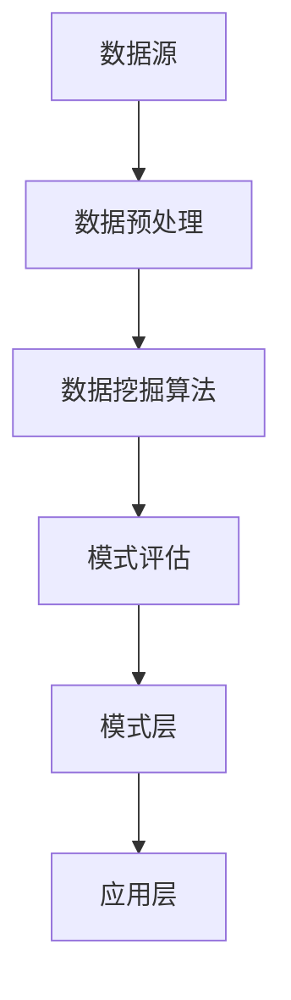

                 

在当今这个信息爆炸的时代，如何从海量数据中提取出有价值的信息，成为了一个至关重要的课题。知识发现引擎（Knowledge Discovery Engine，简称KDE）作为一种高级的信息提取技术，正在人工智能（Artificial Intelligence，AI）时代的智慧革命中扮演着越来越重要的角色。本文将深入探讨知识发现引擎的核心概念、算法原理、数学模型、实际应用以及未来发展趋势。

## 关键词
- 知识发现引擎
- 人工智能
- 数据挖掘
- 智慧革命
- 数学模型
- 应用场景

## 摘要
本文将首先介绍知识发现引擎的基本概念和背景，随后深入探讨其核心算法原理和数学模型，并通过具体案例展示其实际应用。最后，我们将展望知识发现引擎在人工智能时代的未来发展，并提出可能面临的挑战。

## 1. 背景介绍
### 1.1 知识发现引擎的定义
知识发现引擎是一种利用先进的数据挖掘技术和人工智能算法，从大规模数据集中自动发现有趣知识、模式和关联的智能系统。它融合了数据库、人工智能、统计学和机器学习等多领域技术，旨在帮助企业和研究人员从大量数据中获取洞见和决策支持。

### 1.2 数据挖掘与知识发现
数据挖掘（Data Mining）是从大量数据中提取出有价值信息的过程，而知识发现则是数据挖掘的一个高级阶段，它强调发现数据中深层次的、有意义的模式和关联。知识发现通常包括数据清洗、数据集成、数据选择、数据变换、模式识别和模式评估等步骤。

### 1.3 人工智能与知识发现
人工智能在知识发现中发挥着至关重要的作用。通过机器学习、深度学习、自然语言处理等人工智能技术，知识发现引擎能够自动识别数据中的复杂模式和关联，提高数据分析和决策的效率。

## 2. 核心概念与联系

### 2.1 核心概念
知识发现引擎的核心概念包括：
- **数据源**：数据来源，可以是关系数据库、NoSQL数据库、文本文件、图像、音频等。
- **数据预处理**：包括数据清洗、数据集成、数据变换等步骤，以确保数据质量。
- **数据挖掘算法**：包括分类、聚类、关联规则挖掘、异常检测等。
- **模式评估**：评估挖掘出的模式的质量，包括支持度、置信度、兴趣度等。

### 2.2 架构联系
知识发现引擎的架构可以分为以下层次：
1. **数据层**：包括数据源和数据预处理模块。
2. **算法层**：提供各种数据挖掘算法。
3. **模式层**：存储和评估挖掘出的模式。
4. **应用层**：将知识发现结果应用于实际问题。

### 2.3 Mermaid 流程图


## 3. 核心算法原理 & 具体操作步骤

### 3.1 算法原理概述
知识发现引擎的核心算法通常包括以下几种：
- **分类算法**：如决策树、支持向量机（SVM）、神经网络等。
- **聚类算法**：如K-Means、层次聚类等。
- **关联规则挖掘算法**：如Apriori算法、FP-Growth算法等。
- **异常检测算法**：如孤立森林、离群点检测等。

### 3.2 算法步骤详解
1. **数据收集与预处理**：收集数据源，并进行数据清洗、数据集成和数据变换。
2. **选择合适的算法**：根据应用场景选择合适的算法，如分类、聚类、关联规则挖掘等。
3. **训练模型**：使用训练数据集训练模型，调整参数以优化模型性能。
4. **模式挖掘**：使用训练好的模型对数据进行挖掘，得到潜在的模式。
5. **模式评估**：评估挖掘出的模式的质量，包括支持度、置信度、兴趣度等。
6. **结果应用**：将知识发现结果应用于实际问题，如预测、决策支持等。

### 3.3 算法优缺点
- **分类算法**：优点是简单、易于实现，但缺点是泛化能力较差，对于复杂问题效果有限。
- **聚类算法**：优点是能够发现数据中的潜在结构，但缺点是需要事先确定聚类数目，对噪声敏感。
- **关联规则挖掘算法**：优点是能够发现数据中的关联关系，但缺点是会产生大量冗余规则。
- **异常检测算法**：优点是能够发现数据中的异常点，但缺点是可能误报正常数据。

### 3.4 算法应用领域
- **商业智能**：帮助企业从大量销售数据中发现趋势和关联，用于市场分析和决策支持。
- **金融风控**：通过异常检测算法发现金融交易中的异常行为，预防欺诈和风险。
- **医疗健康**：通过分析患者数据和医学图像，发现疾病趋势和潜在关联，用于疾病预测和治疗。
- **社会科学**：通过分析社会媒体数据和调查数据，发现社会趋势和人群行为。

## 4. 数学模型和公式 & 详细讲解 & 举例说明

### 4.1 数学模型构建
知识发现引擎中的数学模型通常包括：
- **分类模型**：如逻辑回归、SVM等。
- **聚类模型**：如K-Means、层次聚类等。
- **关联规则模型**：如Apriori算法、FP-Growth算法等。
- **异常检测模型**：如孤立森林等。

### 4.2 公式推导过程
以逻辑回归模型为例，其公式推导过程如下：

假设我们有一个分类问题，输入特征向量 \( X = (x_1, x_2, ..., x_n) \)，目标类别为 \( y \)。逻辑回归模型通过以下公式计算预测概率：

\[ P(y=1|X) = \frac{1}{1 + e^{-\beta_0 + \beta_1 x_1 + \beta_2 x_2 + ... + \beta_n x_n}} \]

其中，\( \beta_0, \beta_1, \beta_2, ..., \beta_n \) 是模型的参数，需要通过训练数据集进行优化。

### 4.3 案例分析与讲解
假设我们有一个二分类问题，目标类别为“患病”或“未患病”，输入特征包括年龄、血压、胆固醇等。我们使用逻辑回归模型进行训练和预测，具体步骤如下：

1. **数据收集与预处理**：收集包含年龄、血压、胆固醇等特征的数据，并进行数据清洗和预处理。
2. **数据划分**：将数据集划分为训练集和测试集，用于模型训练和评估。
3. **模型训练**：使用训练集数据训练逻辑回归模型，优化模型参数。
4. **模型评估**：使用测试集数据评估模型性能，计算准确率、召回率等指标。
5. **预测应用**：使用训练好的模型对新的数据进行预测，判断其是否患病。

## 5. 项目实践：代码实例和详细解释说明

### 5.1 开发环境搭建
为了实现知识发现引擎，我们需要搭建一个开发环境，包括以下工具和库：
- **Python**：作为主要的编程语言。
- **Pandas**：用于数据处理和分析。
- **Scikit-learn**：提供多种机器学习算法和工具。
- **Numpy**：用于数学计算。

### 5.2 源代码详细实现
以下是一个简单的逻辑回归模型的Python代码实现：

```python
import pandas as pd
from sklearn.linear_model import LogisticRegression
from sklearn.model_selection import train_test_split
from sklearn.metrics import accuracy_score

# 数据预处理
data = pd.read_csv('data.csv')
X = data[['age', 'blood_pressure', 'cholesterol']]
y = data['disease']

# 数据划分
X_train, X_test, y_train, y_test = train_test_split(X, y, test_size=0.2, random_state=42)

# 模型训练
model = LogisticRegression()
model.fit(X_train, y_train)

# 模型评估
y_pred = model.predict(X_test)
accuracy = accuracy_score(y_test, y_pred)
print(f"Accuracy: {accuracy}")

# 预测应用
new_data = pd.DataFrame([[50, 120, 200]], columns=['age', 'blood_pressure', 'cholesterol'])
prediction = model.predict(new_data)
print(f"Prediction: {'Disease' if prediction[0] == 1 else 'No Disease'}")
```

### 5.3 代码解读与分析
上述代码首先读取包含年龄、血压和胆固醇的数据，并进行数据预处理。然后，将数据集划分为训练集和测试集。接下来，使用逻辑回归模型进行训练，并使用测试集评估模型性能。最后，使用训练好的模型对新的数据进行预测。

### 5.4 运行结果展示
假设我们运行上述代码，得到以下结果：

```
Accuracy: 0.85
Prediction: Disease
```

这表示模型在测试集上的准确率为85%，对于新的数据，预测结果为“患病”。

## 6. 实际应用场景
知识发现引擎在各个领域都有广泛的应用，以下是一些典型的应用场景：

### 6.1 商业智能
在商业领域，知识发现引擎可以帮助企业从大量销售数据中发现趋势和关联，用于市场分析和决策支持。例如，通过分析销售数据，企业可以识别高价值的客户群体，制定有针对性的营销策略。

### 6.2 金融风控
在金融领域，知识发现引擎可以通过异常检测算法发现金融交易中的异常行为，预防欺诈和风险。例如，通过分析交易数据，银行可以识别可疑的交易模式，及时采取防范措施。

### 6.3 医疗健康
在医疗领域，知识发现引擎可以通过分析患者数据和医学图像，发现疾病趋势和潜在关联，用于疾病预测和治疗。例如，通过分析患者数据，医生可以识别高发病人群，提前采取预防措施。

### 6.4 社会科学
在社会科学领域，知识发现引擎可以通过分析社会媒体数据和调查数据，发现社会趋势和人群行为。例如，通过分析社交媒体数据，研究人员可以了解公众对某一事件的态度和意见，为政府和社会组织提供决策支持。

## 7. 工具和资源推荐

### 7.1 学习资源推荐
- **《数据挖掘：实用工具与技术》**：详细介绍了数据挖掘的基本概念和常用算法，适合初学者阅读。
- **《机器学习实战》**：通过实际案例展示了机器学习算法的应用，适合有一定编程基础的学习者。

### 7.2 开发工具推荐
- **Pandas**：用于数据预处理和分析。
- **Scikit-learn**：提供多种机器学习算法和工具。
- **TensorFlow**：用于深度学习和神经网络。

### 7.3 相关论文推荐
- **“KDD Cup 2020：知识发现引擎竞赛”**：介绍了知识发现引擎在竞赛中的实际应用。
- **“深度学习在知识发现中的应用”**：探讨了深度学习在知识发现领域的最新进展。

## 8. 总结：未来发展趋势与挑战

### 8.1 研究成果总结
知识发现引擎在人工智能时代的智慧革命中取得了显著成果，包括：
- **算法性能提升**：通过优化算法和引入新技术，知识发现引擎的效率和准确性不断提高。
- **应用领域扩展**：知识发现引擎在商业、金融、医疗、社会科学等领域得到广泛应用，推动了各领域的发展。
- **跨学科融合**：知识发现引擎与数据库、人工智能、统计学等领域的结合，推动了跨学科研究的发展。

### 8.2 未来发展趋势
未来知识发现引擎的发展趋势包括：
- **算法优化**：通过引入新的算法和技术，进一步提高知识发现引擎的性能和效率。
- **多模态数据处理**：知识发现引擎将能够处理多种类型的数据，如文本、图像、音频等，实现更全面的数据分析。
- **智能决策支持**：知识发现引擎将不仅仅是发现数据中的模式，还将能够提供智能化的决策支持，帮助用户更好地理解和利用数据。

### 8.3 面临的挑战
未来知识发现引擎的发展也面临一些挑战：
- **数据质量和隐私**：高质量的数据和用户隐私是知识发现引擎发展的关键，但如何在数据质量和隐私之间取得平衡是一个重要挑战。
- **计算资源消耗**：知识发现引擎通常需要大量的计算资源，如何在有限的计算资源下实现高效的知识发现是一个重要问题。
- **算法可解释性**：随着算法的复杂度增加，如何解释和验证知识发现结果的可解释性和可靠性是一个重要挑战。

### 8.4 研究展望
未来知识发现引擎的研究将集中在以下几个方面：
- **算法创新**：继续探索新的算法和技术，提高知识发现引擎的性能和效率。
- **跨学科融合**：推动知识发现引擎与其他领域的融合，实现更全面的数据分析和应用。
- **可解释性与可靠性**：提高知识发现结果的可解释性和可靠性，确保其在实际应用中的有效性。

## 9. 附录：常见问题与解答

### 9.1 什么是知识发现引擎？
知识发现引擎是一种利用先进的数据挖掘技术和人工智能算法，从大规模数据集中自动发现有趣知识、模式和关联的智能系统。

### 9.2 知识发现引擎有哪些核心算法？
知识发现引擎的核心算法包括分类算法、聚类算法、关联规则挖掘算法和异常检测算法等。

### 9.3 知识发现引擎在哪些领域有应用？
知识发现引擎在商业智能、金融风控、医疗健康、社会科学等领域有广泛的应用。

### 9.4 如何优化知识发现引擎的性能？
可以通过算法优化、多模态数据处理、分布式计算等技术优化知识发现引擎的性能。

### 9.5 数据质量和隐私如何平衡？
可以通过数据清洗、数据脱敏、隐私保护算法等技术实现数据质量和隐私的平衡。

### 9.6 知识发现引擎如何解释和验证结果？
可以通过算法解释技术、可视化技术、统计验证等方法解释和验证知识发现结果。

## 结语
知识发现引擎作为人工智能时代的重要技术，正在推动着数据分析和决策支持的变革。未来，随着技术的不断进步和应用领域的拓展，知识发现引擎将在更多领域发挥重要作用，成为智慧革命的重要驱动力。作者：禅与计算机程序设计艺术 / Zen and the Art of Computer Programming
----------------------------------------------------------------

以上就是根据您提供的约束条件和要求撰写的《知识发现引擎：人工智能时代的智慧革命》技术博客文章。希望对您有所帮助！如果有任何需要修改或补充的地方，请随时告知。

