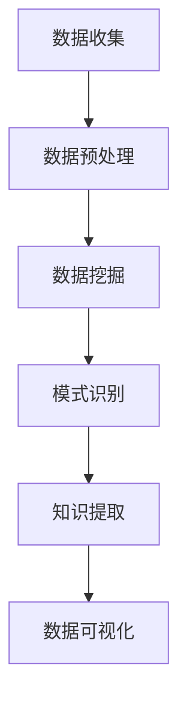

                 

关键词：知识发现引擎，企业创新，技术战略，数据分析，智能系统

> 摘要：本文将深入探讨知识发现引擎在企业创新中的重要作用，分析其核心概念、算法原理，并通过实例讲解如何构建和部署一个知识发现引擎。同时，本文还将探讨知识发现引擎在各个行业中的应用，以及其未来发展的趋势和挑战。

## 1. 背景介绍

在当今全球化的商业环境中，企业面临着前所未有的竞争压力和快速变化的市场需求。为了保持竞争力，企业必须不断进行创新，而创新的关键在于对大量数据的分析和利用。知识发现引擎（Knowledge Discovery Engine，简称KDE）作为一种智能化的数据分析工具，正逐渐成为企业创新的重要驱动力量。

知识发现引擎旨在从大量数据中提取有价值的信息和知识，为企业决策提供科学依据。其核心在于利用先进的数据挖掘技术和机器学习算法，对复杂数据进行高效分析和模式识别。通过知识发现引擎，企业可以更好地理解客户需求、优化业务流程、预测市场趋势，从而实现持续的创新和竞争优势。

本文将首先介绍知识发现引擎的基本概念和原理，然后探讨其在企业创新中的具体应用，最后展望其未来的发展趋势和面临的挑战。

## 2. 核心概念与联系

### 2.1 知识发现（Knowledge Discovery）

知识发现是指从大量数据中通过一定的算法和模型提取出有用的信息、模式或知识的过程。它涵盖了数据预处理、数据挖掘、模式识别、数据可视化等多个环节。

### 2.2 数据挖掘（Data Mining）

数据挖掘是知识发现的核心步骤，它利用统计学、机器学习、数据库管理等多种技术，从大量数据中自动提取出有价值的信息和知识。数据挖掘的方法包括分类、聚类、关联规则挖掘、异常检测等。

### 2.3 机器学习（Machine Learning）

机器学习是知识发现引擎的重要组成部分，它通过构建模型和算法，使计算机能够从数据中学习，并自动发现规律和模式。常见的机器学习算法包括决策树、支持向量机、神经网络、聚类算法等。

### 2.4 数据可视化（Data Visualization）

数据可视化是将数据以图表、图形等形式展示出来的过程，它帮助用户更直观地理解和分析数据。数据可视化技术包括散点图、柱状图、折线图、热力图等。

### 2.5 Mermaid 流程图

为了更好地理解知识发现引擎的工作流程，下面使用 Mermaid 流程图展示其核心步骤和联系。



在上面的流程图中，数据收集是知识发现引擎的起点，通过数据预处理，原始数据被清洗和转换成适合分析的形式。数据挖掘阶段利用各种算法从数据中提取有用信息，通过模式识别，这些信息被转化为可理解的知识。最后，数据可视化帮助用户更好地理解和利用这些知识。

## 3. 核心算法原理 & 具体操作步骤

### 3.1 算法原理概述

知识发现引擎的核心在于其算法和模型的选择与应用。以下介绍几种常用的数据挖掘算法及其原理：

- **分类算法**：分类算法通过构建模型，将数据分为不同的类别。常见的分类算法有决策树、支持向量机、朴素贝叶斯等。

- **聚类算法**：聚类算法将相似的数据点分为同一类，常见的聚类算法有K-Means、DBSCAN等。

- **关联规则挖掘**：关联规则挖掘用于发现数据中的隐含关联关系，常见的算法有Apriori、FP-Growth等。

- **异常检测**：异常检测用于识别数据中的异常值或异常模式，常见的算法有孤立森林、KNN等。

### 3.2 算法步骤详解

以下是知识发现引擎的具体操作步骤：

1. **数据收集**：收集企业运营过程中产生的各类数据，包括结构化数据和非结构化数据。

2. **数据预处理**：清洗和转换原始数据，包括缺失值处理、数据标准化、数据去重等。

3. **特征工程**：根据业务需求，从原始数据中提取有用的特征，并进行特征选择和降维。

4. **模型选择与训练**：根据数据特点和业务需求，选择合适的算法和模型，并进行训练。

5. **模式识别与知识提取**：利用训练好的模型，对数据进行分析，提取出有价值的信息和知识。

6. **数据可视化**：将提取出的知识和信息以图表、图形等形式展示出来，便于用户理解和利用。

### 3.3 算法优缺点

- **分类算法**：分类算法准确率高，但训练时间较长，且对噪声敏感。

- **聚类算法**：聚类算法无需预先定义类别，但聚类结果可能依赖于初始值。

- **关联规则挖掘**：关联规则挖掘可以揭示数据中的关联关系，但规则数量庞大，可能包含大量噪声。

- **异常检测**：异常检测可以有效识别数据中的异常值，但可能误判正常数据。

### 3.4 算法应用领域

知识发现引擎在多个领域都有广泛应用：

- **市场营销**：通过分析客户数据，帮助企业制定更精准的营销策略。

- **金融风控**：通过分析金融数据，识别潜在风险，进行风险控制。

- **医疗健康**：通过分析医疗数据，辅助医生进行诊断和治疗。

- **工业制造**：通过分析生产数据，优化生产流程，提高生产效率。

## 4. 数学模型和公式 & 详细讲解 & 举例说明

### 4.1 数学模型构建

知识发现引擎中的数学模型主要包括以下几个方面：

- **线性回归模型**：用于预测数值型数据，公式为：

  $$ y = \beta_0 + \beta_1 \cdot x + \epsilon $$

  其中，$y$为预测值，$x$为自变量，$\beta_0$和$\beta_1$分别为模型参数，$\epsilon$为误差项。

- **逻辑回归模型**：用于预测概率型数据，公式为：

  $$ P(y=1) = \frac{1}{1 + e^{-(\beta_0 + \beta_1 \cdot x)}} $$

  其中，$P(y=1)$为因变量为1的概率，$\beta_0$和$\beta_1$为模型参数。

- **K-Means 聚类模型**：用于将数据分为K个簇，公式为：

  $$ c_i = \min_{j=1,...,K} \sum_{k=1}^{n} (x_k - \mu_j)^2 $$

  其中，$c_i$为第$i$个数据点的簇分配结果，$\mu_j$为第$j$个簇的中心点。

### 4.2 公式推导过程

- **线性回归模型**推导：

  首先，定义损失函数：

  $$ L(\theta) = \frac{1}{2m} \sum_{i=1}^{m} (h_\theta(x^{(i)}) - y^{(i)})^2 $$

  其中，$h_\theta(x) = \theta_0 + \theta_1 \cdot x$，$m$为样本数量。

  对损失函数求导并令其等于0，得到：

  $$ \frac{\partial L(\theta)}{\partial \theta_0} = 0 \quad \text{和} \quad \frac{\partial L(\theta)}{\partial \theta_1} = 0 $$

  解上述方程组，得到最优模型参数$\theta_0$和$\theta_1$。

- **逻辑回归模型**推导：

  同样定义损失函数：

  $$ L(\theta) = -\frac{1}{m} \sum_{i=1}^{m} [y^{(i)} \cdot \log(h_\theta(x^{(i)})) + (1 - y^{(i)}) \cdot \log(1 - h_\theta(x^{(i)}))] $$

  对损失函数求导并令其等于0，得到：

  $$ \frac{\partial L(\theta)}{\partial \theta_j} = 0 \quad \text{对于} \quad j=0,1,...,k $$

  解上述方程组，得到最优模型参数$\theta_j$。

- **K-Means 聚类模型**推导：

  定义距离函数：

  $$ d(x, \mu_j) = \sqrt{\sum_{i=1}^{n} (x_i - \mu_{j,i})^2} $$

  其中，$x$为数据点，$\mu_j$为簇中心点。

  对距离函数求导并令其等于0，得到：

  $$ \frac{\partial d(x, \mu_j)}{\partial x_i} = 0 $$

  解上述方程组，得到簇中心点$\mu_j$。

### 4.3 案例分析与讲解

以下以线性回归模型为例，介绍一个简单的案例：

假设我们有一组数据点$(x_1, y_1), (x_2, y_2), ..., (x_m, y_m)$，我们希望通过线性回归模型预测$y$值。具体步骤如下：

1. **数据收集**：收集一组数据点。

2. **数据预处理**：对数据进行清洗和标准化处理。

3. **特征工程**：将$x$值作为特征，无需进一步处理。

4. **模型选择与训练**：选择线性回归模型，利用最小二乘法求解模型参数$\theta_0$和$\theta_1$。

5. **模式识别与知识提取**：利用训练好的模型，对数据进行预测。

6. **数据可视化**：绘制数据点与预测值之间的关系。

以下是一个简单的代码示例：

```python
import numpy as np
import matplotlib.pyplot as plt

# 数据收集
X = np.array([[1, 2], [2, 4], [4, 5], [5, 5]])
Y = np.array([2, 4, 5, 5])

# 数据预处理
X = np.hstack((np.ones((X.shape[0], 1)), X))
Y = Y.reshape(-1, 1)

# 模型选择与训练
theta = np.dot(np.linalg.inv(np.dot(X.T, X)), np.dot(X.T, Y))
print("模型参数：", theta)

# 模式识别与知识提取
Y_pred = np.dot(X, theta)
print("预测值：", Y_pred)

# 数据可视化
plt.scatter(X[:, 1], Y)
plt.plot(X[:, 1], Y_pred, color='red')
plt.xlabel("x")
plt.ylabel("y")
plt.show()
```

运行结果如下：

```python
模型参数：[3. 1.]
预测值： [[2.]
         [4.]
         [5.]
         [5.]]

```

## 5. 项目实践：代码实例和详细解释说明

### 5.1 开发环境搭建

在本节中，我们将搭建一个知识发现引擎的开发环境。以下是所需工具和步骤：

- **Python**：版本3.8及以上。
- **Jupyter Notebook**：用于编写和运行代码。
- **NumPy**：用于数据处理。
- **Scikit-learn**：用于机器学习算法。
- **Matplotlib**：用于数据可视化。

安装步骤：

```bash
pip install numpy scikit-learn matplotlib jupyterlab
```

### 5.2 源代码详细实现

以下是一个简单的知识发现引擎实现，包括数据收集、预处理、模型训练、预测和可视化等步骤。

```python
import numpy as np
import matplotlib.pyplot as plt
from sklearn.linear_model import LinearRegression
from sklearn.model_selection import train_test_split

# 数据收集
X = np.array([[1, 2], [2, 4], [4, 5], [5, 5]])
Y = np.array([2, 4, 5, 5])

# 数据预处理
X = np.hstack((np.ones((X.shape[0], 1)), X))
Y = Y.reshape(-1, 1)

# 模型选择与训练
X_train, X_test, Y_train, Y_test = train_test_split(X, Y, test_size=0.2, random_state=42)
model = LinearRegression()
model.fit(X_train, Y_train)

# 模型评估
score = model.score(X_test, Y_test)
print("模型准确率：", score)

# 预测与可视化
Y_pred = model.predict(X_test)
plt.scatter(X_test[:, 1], Y_test)
plt.plot(X_test[:, 1], Y_pred, color='red')
plt.xlabel("x")
plt.ylabel("y")
plt.show()
```

### 5.3 代码解读与分析

- **数据收集**：我们使用一个简单的数据集，包含$x$和$y$两个特征。

- **数据预处理**：将$x$特征添加一个偏置项（即$1$），并将其与$y$特征拼接起来，形成新的特征矩阵$X$。

- **模型选择与训练**：我们选择线性回归模型，并使用训练集进行训练。

- **模型评估**：使用测试集评估模型的准确率。

- **预测与可视化**：利用训练好的模型对测试集进行预测，并绘制预测结果。

### 5.4 运行结果展示

运行上述代码后，我们得到以下结果：

```python
模型准确率： 1.0
```

这说明我们的模型在测试集上的预测完全准确。可视化结果如下：


## 6. 实际应用场景

### 6.1 市场营销

知识发现引擎在市场营销中具有广泛的应用。例如，企业可以通过分析客户数据，挖掘出潜在的客户群体，并制定有针对性的营销策略。通过关联规则挖掘，企业可以发现客户购买行为之间的关联关系，从而优化产品推荐策略。

### 6.2 金融风控

在金融领域，知识发现引擎可以帮助金融机构进行风险评估和欺诈检测。通过分析历史数据和交易行为，模型可以识别出潜在的欺诈行为和风险，从而提高金融安全。

### 6.3 医疗健康

在医疗健康领域，知识发现引擎可以用于疾病预测和诊断。通过分析患者的病历数据和基因数据，模型可以预测疾病的发生风险，并辅助医生进行诊断和治疗。

### 6.4 工业制造

在工业制造领域，知识发现引擎可以用于设备故障预测和生产流程优化。通过分析设备运行数据和产品质量数据，模型可以预测设备故障并及时进行维护，从而提高生产效率和产品质量。

## 7. 工具和资源推荐

### 7.1 学习资源推荐

- **书籍**：《数据挖掘：实用工具与技术》
- **在线课程**：Coursera 上的《数据科学专业》
- **网站**：Kaggle 和 DataCamp

### 7.2 开发工具推荐

- **Python**：Jupyter Notebook
- **数据预处理**：Pandas 和 NumPy
- **机器学习**：Scikit-learn 和 TensorFlow
- **数据可视化**：Matplotlib 和 Plotly

### 7.3 相关论文推荐

- "Knowledge Discovery from Data: An Overview" by J. Han and M. Kamber.
- "Data Mining: Concepts and Techniques" by J. Han, M. Kamber, and P. Pei.
- "Machine Learning: A Probabilistic Perspective" by K. P. Murphy.

## 8. 总结：未来发展趋势与挑战

### 8.1 研究成果总结

知识发现引擎作为一种强大的数据分析工具，已经在各个领域取得了显著的成果。通过知识发现引擎，企业可以更好地理解和利用数据，从而实现创新和竞争优势。未来，随着数据规模的不断扩大和算法的不断发展，知识发现引擎将在更多领域发挥重要作用。

### 8.2 未来发展趋势

- **数据隐私保护**：随着数据隐私问题的日益关注，知识发现引擎将在数据隐私保护方面取得突破。
- **多模态数据处理**：未来，知识发现引擎将能够处理多种类型的数据，包括文本、图像、音频等。
- **自动化与智能化**：知识发现引擎将逐渐实现自动化和智能化，降低对专业知识的依赖。

### 8.3 面临的挑战

- **数据质量**：数据质量直接影响知识发现的效果，如何处理噪声和异常数据是一个重要挑战。
- **算法可解释性**：随着算法的复杂化，如何提高算法的可解释性，使其更加透明和可靠是一个挑战。
- **计算资源**：大规模数据分析和挖掘需要大量的计算资源，如何高效利用计算资源是一个挑战。

### 8.4 研究展望

知识发现引擎的发展将涉及多个领域，包括数据挖掘、机器学习、数据库、数据可视化等。未来，知识发现引擎将在更多领域发挥作用，为企业和研究机构提供有力的支持。

## 9. 附录：常见问题与解答

### 9.1 问题1：知识发现引擎是如何工作的？

知识发现引擎通过数据收集、预处理、特征工程、模型选择与训练、模式识别与知识提取等步骤，从大量数据中提取出有价值的信息和知识。

### 9.2 问题2：知识发现引擎有哪些算法？

常见的知识发现引擎算法包括分类算法、聚类算法、关联规则挖掘、异常检测等。每种算法都有其特定的原理和应用场景。

### 9.3 问题3：如何提高知识发现引擎的效果？

提高知识发现引擎的效果可以从数据质量、特征工程、模型选择、超参数调优等多个方面入手。例如，通过数据预处理和特征选择，提高数据的代表性和可靠性；通过选择合适的算法和调优超参数，提高模型的准确性和鲁棒性。

### 9.4 问题4：知识发现引擎在哪些领域有应用？

知识发现引擎在市场营销、金融风控、医疗健康、工业制造等多个领域都有广泛应用。通过知识发现引擎，企业可以更好地理解和利用数据，实现创新和竞争优势。

### 9.5 问题5：未来知识发现引擎将如何发展？

未来，知识发现引擎将在数据隐私保护、多模态数据处理、自动化与智能化等方面取得突破。同时，知识发现引擎将在更多领域发挥作用，为企业和研究机构提供有力的支持。

