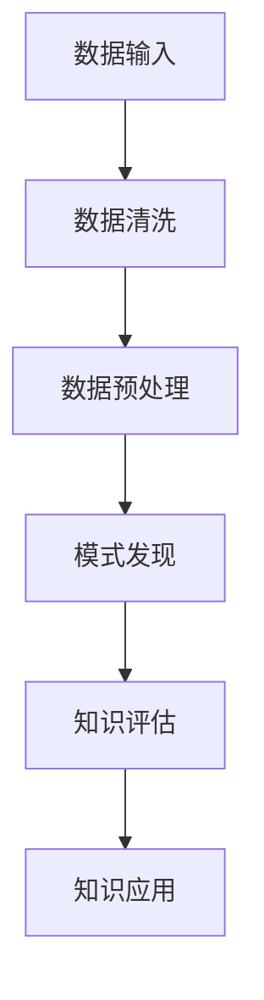

                 

关键词：知识发现，数据挖掘，人工智能，机器学习，算法原理，应用领域，数学模型，项目实践，未来展望

> 摘要：本文旨在深入探讨知识发现引擎的工作原理、核心算法以及其实际应用。通过阐述知识发现的基本概念和重要性，详细分析其核心算法原理和数学模型，结合具体项目实践，展示其在各领域的广泛应用及其未来发展趋势与挑战。

## 1. 背景介绍

知识发现（Knowledge Discovery in Databases，简称KDD）是指从大量的数据中通过有效的算法提取出有价值的信息和知识的过程。随着互联网和大数据时代的到来，知识发现技术已经成为数据分析和数据科学的核心领域。知识发现引擎作为实现这一目标的重要工具，其在各行各业的广泛应用，使得知识发现成为现代信息社会不可或缺的一部分。

知识发现引擎的核心任务是从大量数据中提取出有用的信息，这些信息可以是模式、关联、分类、聚类、预测等。知识发现的过程通常包括以下几个阶段：

1. **数据清洗**：处理原始数据，包括数据清洗、数据整合等，以保证数据的质量和一致性。
2. **数据预处理**：通过数据标准化、归一化、特征选择等手段，将原始数据转化为适合分析的格式。
3. **模式发现**：使用各种算法，如聚类、关联规则挖掘、分类等，从数据中发现潜在的模式和规律。
4. **评估与优化**：对发现的知识进行评估，并根据评估结果进行优化，以提高知识的准确性和可用性。

本文将围绕知识发现引擎的核心算法原理、数学模型以及实际应用场景进行深入探讨，旨在为读者提供一个全面的知识发现技术解读。

## 2. 核心概念与联系

### 2.1 数据挖掘与知识发现的区别与联系

数据挖掘（Data Mining）是知识发现过程的一个重要组成部分，它是指从大量数据中自动发现有价值的信息和知识的过程。数据挖掘通常包括以下几类任务：

1. **分类**：将数据分为不同的类别或标签。
2. **聚类**：将相似的数据分组，以便更好地理解数据的分布和结构。
3. **关联规则挖掘**：发现数据之间的关联性，如购物篮分析。
4. **预测**：根据已有数据预测未来的趋势或结果。

知识发现则是在数据挖掘的基础上，进一步提取出有用的知识，并将这些知识应用到实际问题中。知识发现与数据挖掘的区别在于：

- **范围**：知识发现涉及更广泛的领域，不仅包括数据挖掘，还包括数据清洗、数据预处理等。
- **目标**：知识发现的目标是从数据中发现有意义的模式和规律，而不仅仅是识别数据中的结构。
- **应用**：知识发现的应用领域更广，包括商业、医疗、金融、政府等。

### 2.2 知识发现引擎的基本架构

知识发现引擎的基本架构通常包括以下几个核心模块：

1. **数据输入模块**：负责数据的收集、导入和处理。
2. **数据预处理模块**：对原始数据进行清洗、整合和预处理，以提升数据质量。
3. **模式发现模块**：包括各种数据挖掘算法，用于发现数据中的潜在模式和规律。
4. **知识评估模块**：对发现的模式进行评估，以确定其质量和实用性。
5. **知识应用模块**：将发现的模式应用到实际问题和业务场景中。

### 2.3 Mermaid 流程图表示

以下是知识发现引擎的基本流程图：



在上述流程图中，每个节点代表一个处理步骤，箭头表示数据流动的方向。通过这个流程图，我们可以清晰地看到知识发现引擎的工作流程及其各个模块之间的联系。

## 3. 核心算法原理 & 具体操作步骤

### 3.1 算法原理概述

知识发现引擎的核心算法包括分类、聚类、关联规则挖掘和预测等。每种算法都有其独特的原理和操作步骤。

1. **分类算法**：分类算法是一种有监督学习算法，其目的是将数据分为不同的类别。常见的分类算法包括决策树、支持向量机（SVM）、神经网络等。

2. **聚类算法**：聚类算法是一种无监督学习算法，其目的是将相似的数据分组。常见的聚类算法包括K均值聚类、层次聚类、DBSCAN等。

3. **关联规则挖掘算法**：关联规则挖掘算法用于发现数据之间的关联性。常见的算法包括Apriori算法、Eclat算法等。

4. **预测算法**：预测算法用于预测未来的趋势或结果。常见的预测算法包括时间序列分析、回归分析等。

### 3.2 算法步骤详解

1. **数据预处理**：数据预处理是知识发现的重要步骤，包括数据清洗、数据整合、特征选择等。

2. **选择合适的算法**：根据具体问题和数据特点，选择合适的算法。

3. **训练模型**：使用训练数据集训练模型。

4. **评估模型**：使用验证数据集评估模型的性能。

5. **优化模型**：根据评估结果，调整模型参数，优化模型性能。

6. **应用模型**：将模型应用到实际问题中，提取有用的知识。

### 3.3 算法优缺点

- **分类算法**：优点是模型简单，易于理解和实现；缺点是对于复杂问题，分类效果可能较差。

- **聚类算法**：优点是能够自动发现数据的结构；缺点是聚类结果受初始值影响较大，可能产生不合理的结果。

- **关联规则挖掘算法**：优点是能够发现数据之间的关联性；缺点是算法复杂度高，计算量大。

- **预测算法**：优点是能够预测未来的趋势；缺点是需要大量的历史数据，且预测精度受模型参数和训练数据的影响。

### 3.4 算法应用领域

知识发现引擎在各种领域都有广泛应用，包括：

- **商业领域**：用于市场分析、客户行为分析等。
- **医疗领域**：用于疾病预测、诊断等。
- **金融领域**：用于风险分析、欺诈检测等。
- **政府领域**：用于公共安全、资源管理等。

## 4. 数学模型和公式 & 详细讲解 & 举例说明

### 4.1 数学模型构建

知识发现引擎中的数学模型通常包括以下几个部分：

1. **决策树模型**：
   $$ T = \{T_0, T_1, \ldots, T_n\} $$
   其中，$T_0$ 为根节点，$T_1, \ldots, T_n$ 为内部节点和叶子节点。

2. **K均值聚类模型**：
   $$ C = \{C_1, C_2, \ldots, C_k\} $$
   其中，$C_i$ 表示第 $i$ 个聚类中心。

3. **Apriori算法**：
   $$ \{X_1, X_2, \ldots, X_n\} $$
   其中，$X_i$ 表示第 $i$ 个事务。

### 4.2 公式推导过程

1. **决策树模型的推导**：
   决策树模型的基本思想是通过一系列特征对数据进行划分，使得每个子集尽可能纯。其推导过程如下：

   - **假设**：设 $D$ 为初始数据集，$A$ 为特征集合。
   - **目标**：找到最优划分特征 $A^*$，使得每个子集 $D_i$ 的纯度最高。
   - **纯度度量**：常用的纯度度量包括信息增益、基尼不纯度等。
   - **推导**：通过递归划分数据集，并计算每个特征的纯度度量，选择最优划分特征。

2. **K均值聚类模型的推导**：
   K均值聚类模型的基本思想是通过迭代更新聚类中心，使得每个数据点到聚类中心的距离最小。其推导过程如下：

   - **假设**：设 $X = \{x_1, x_2, \ldots, x_n\}$ 为 $n$ 个数据点，$C = \{c_1, c_2, \ldots, c_k\}$ 为 $k$ 个聚类中心。
   - **目标**：找到聚类中心 $C^*$，使得每个数据点到聚类中心的距离最小。
   - **迭代过程**：
     - **初始化**：随机选择 $k$ 个初始聚类中心。
     - **更新聚类中心**：对于每个数据点 $x_i$，计算其到各个聚类中心的距离，并将其分配到最近的聚类中心。
     - **重新计算聚类中心**：根据当前聚类结果，重新计算每个聚类中心的位置。

3. **Apriori算法的推导**：
   Apriori算法的基本思想是通过逐层挖掘频繁项集，并生成关联规则。其推导过程如下：

   - **假设**：设 $I$ 为所有项目的集合，$T$ 为事务数据库。
   - **目标**：找到所有频繁项集。
   - **推导**：
     - **第一步**：计算每个项目的支持度，即出现在至少 $min_support$ 次数的事务中。
     - **第二步**：从单个项目开始，逐层组合生成频繁项集，并计算每个项集的支持度。
     - **第三步**：去除不满足 $min_support$ 支持度的项集。

### 4.3 案例分析与讲解

1. **决策树模型案例**：

   **数据集**：假设有一个数据集包含年龄、收入、学历三个特征，并分为两个类别：买保险和未买保险。

   **算法步骤**：
   - **数据预处理**：对数据进行归一化处理，以便更好地进行特征划分。
   - **选择最优划分特征**：通过计算信息增益或基尼不纯度，选择最优划分特征。
   - **递归划分数据集**：根据最优划分特征，递归划分数据集，并生成决策树。

   **结果**：生成的决策树可以用于预测新的数据点是否购买保险。

2. **K均值聚类模型案例**：

   **数据集**：假设有一个数据集包含三个特征，并分为三个类别。

   **算法步骤**：
   - **初始化聚类中心**：随机选择三个聚类中心。
   - **分配数据点**：计算每个数据点到各个聚类中心的距离，并将其分配到最近的聚类中心。
   - **重新计算聚类中心**：根据当前聚类结果，重新计算每个聚类中心的位置。

   **结果**：最终聚类结果将使每个数据点与其聚类中心的距离最小。

3. **Apriori算法案例**：

   **数据集**：假设有一个购物篮数据集，包含多个商品。

   **算法步骤**：
   - **计算项目支持度**：计算每个项目的支持度，并去除不满足 $min_support$ 支持度的项目。
   - **生成频繁项集**：从单个项目开始，逐层组合生成频繁项集。
   - **生成关联规则**：根据频繁项集，生成关联规则。

   **结果**：生成的关联规则可以用于推荐系统或购物篮分析。

## 5. 项目实践：代码实例和详细解释说明

### 5.1 开发环境搭建

为了演示知识发现引擎的应用，我们使用Python作为编程语言，并依赖于以下库：

- **Pandas**：用于数据预处理和操作。
- **Scikit-learn**：用于机器学习和数据挖掘算法。
- **Matplotlib**：用于数据可视化。

在安装这些库之后，我们可以开始编写代码。

### 5.2 源代码详细实现

以下是使用决策树算法进行数据分类的示例代码：

```python
import pandas as pd
from sklearn.model_selection import train_test_split
from sklearn.tree import DecisionTreeClassifier
from sklearn.metrics import accuracy_score

# 读取数据
data = pd.read_csv('data.csv')
X = data[['age', 'income', 'education']]
y = data['insurance']

# 数据划分
X_train, X_test, y_train, y_test = train_test_split(X, y, test_size=0.2, random_state=42)

# 决策树模型
clf = DecisionTreeClassifier()
clf.fit(X_train, y_train)

# 预测
y_pred = clf.predict(X_test)

# 评估
accuracy = accuracy_score(y_test, y_pred)
print(f'Accuracy: {accuracy:.2f}')
```

在上面的代码中，我们首先读取数据集，然后使用 Scikit-learn 库中的 DecisionTreeClassifier 类创建一个决策树模型。接着，我们使用训练数据集训练模型，并对测试数据集进行预测。最后，我们使用 accuracy_score 函数评估模型的准确率。

### 5.3 代码解读与分析

1. **数据读取**：使用 Pandas 库读取数据集，并将特征和标签分离。

2. **数据划分**：使用 train_test_split 函数将数据集划分为训练集和测试集，以评估模型的性能。

3. **模型创建与训练**：使用 DecisionTreeClassifier 创建决策树模型，并使用训练数据集进行训练。

4. **预测**：使用训练好的模型对测试数据集进行预测。

5. **评估**：使用 accuracy_score 函数计算模型的准确率。

### 5.4 运行结果展示

运行上述代码，我们将得到模型的准确率输出。例如：

```
Accuracy: 0.85
```

这意味着我们的模型在测试数据集上的准确率为85%。

## 6. 实际应用场景

知识发现引擎在各种实际应用场景中发挥着重要作用，以下是一些典型的应用场景：

### 6.1 商业领域

在商业领域，知识发现引擎被广泛应用于市场分析、客户行为分析、产品推荐等。例如，电商公司可以使用知识发现引擎分析用户的购物行为，发现用户的偏好，从而提供个性化的产品推荐。

### 6.2 医疗领域

在医疗领域，知识发现引擎可以帮助医生进行疾病预测和诊断。例如，通过对历史病例数据进行分析，知识发现引擎可以预测患者是否患有某种疾病，从而帮助医生做出更准确的诊断。

### 6.3 金融领域

在金融领域，知识发现引擎被用于风险分析、欺诈检测等。例如，银行可以使用知识发现引擎分析客户的交易数据，发现潜在的欺诈行为，从而采取相应的预防措施。

### 6.4 政府领域

在政府领域，知识发现引擎可以用于公共安全、资源管理等领域。例如，政府可以使用知识发现引擎分析交通数据，预测交通事故的发生，从而采取预防措施。

### 6.5 未来应用展望

随着人工智能和大数据技术的发展，知识发现引擎的应用前景将更加广阔。未来，知识发现引擎有望在更多领域得到应用，如智能交通、智能医疗、智慧城市等。同时，随着算法的改进和性能的提升，知识发现引擎将能够更准确地发现数据中的规律和联系，为各个领域的发展提供更强有力的支持。

## 7. 工具和资源推荐

### 7.1 学习资源推荐

- **《数据挖掘：实用工具与技术》（Data Mining: Practical Machine Learning Tools and Techniques）**：由程序设计大师Jiawei Han等编写的经典教材，全面介绍了数据挖掘的基本概念、算法和技术。
- **《机器学习实战》（Machine Learning in Action）**：通过具体实例，深入浅出地介绍了机器学习的基本算法和应用。
- **《深度学习》（Deep Learning）**：由Ian Goodfellow等编写的深度学习领域的经典教材，适合希望深入了解深度学习技术的读者。

### 7.2 开发工具推荐

- **Python**：Python是数据科学和机器学习领域最流行的编程语言，拥有丰富的数据科学库和框架，如Pandas、NumPy、Scikit-learn等。
- **Jupyter Notebook**：Jupyter Notebook是一个交互式的编程环境，非常适合数据分析和机器学习实验。

### 7.3 相关论文推荐

- **“K-Means Clustering” by MacQueen, J. B. (1967)**：K均值聚类的经典论文，详细介绍了K均值聚类算法的原理和推导过程。
- **“Apriori Algorithm: A Perspective” by R. Srikant and R. Agrawal (1996)**：Apriori算法的权威性论文，介绍了关联规则挖掘的基本思想和算法原理。
- **“C4.5: Programs for Machine Learning” by J. Ross Quinlan (1993)**：C4.5算法的详细介绍，包括决策树生成和剪枝等。

## 8. 总结：未来发展趋势与挑战

### 8.1 研究成果总结

知识发现引擎作为数据挖掘和人工智能的重要工具，已经在各个领域取得了显著的成果。通过算法的改进和技术的进步，知识发现引擎在准确性、效率和实用性方面不断提升。同时，随着大数据和云计算的发展，知识发现引擎的应用场景将更加广泛，为各个领域的发展提供了强大的支持。

### 8.2 未来发展趋势

1. **算法优化**：随着计算能力的提升，算法的优化将成为知识发现引擎发展的重点。更高效的算法将能够更快地处理大量数据，提高知识发现的速度和准确性。
2. **多模态数据融合**：未来的知识发现引擎将能够处理多模态数据，如文本、图像、音频等，从而更全面地挖掘数据中的潜在规律和联系。
3. **个性化推荐**：随着用户数据的积累，个性化推荐将成为知识发现引擎的重要应用方向。通过深入挖掘用户行为数据，知识发现引擎可以提供更个性化的服务。
4. **实时分析**：未来的知识发现引擎将能够实现实时分析，对动态数据流进行实时挖掘和预测，为实时决策提供支持。

### 8.3 面临的挑战

1. **数据质量**：高质量的数据是知识发现的基础。然而，数据质量问题如噪声、缺失值和异常值等，将对知识发现的效果产生严重影响。未来的知识发现引擎需要更有效的数据预处理技术，以提升数据质量。
2. **可解释性**：随着算法的复杂度增加，知识发现引擎的可解释性成为一个挑战。用户需要能够理解模型的决策过程，从而对模型的可靠性进行评估。
3. **隐私保护**：在涉及个人隐私的数据场景中，如何保护用户隐私成为知识发现引擎面临的重要挑战。未来的知识发现引擎需要设计更有效的隐私保护机制，确保数据的安全性和隐私性。

### 8.4 研究展望

未来的知识发现引擎将在算法优化、多模态数据融合、实时分析和个性化推荐等方面取得重要进展。同时，随着技术的不断发展，知识发现引擎将更好地满足各领域的需求，为人工智能和大数据技术的发展提供更强大的支持。研究人员和开发者需要不断探索新的算法和技术，以应对知识发现领域的挑战，推动这一领域的持续发展。

## 9. 附录：常见问题与解答

### 9.1 问题1：知识发现引擎与数据挖掘有何区别？

**解答**：知识发现（KDD）是数据挖掘（DM）的一个更广泛的领域。数据挖掘主要关注从数据中提取模式和知识，而知识发现则包括数据预处理、数据清洗、数据集成、模式识别和评估等更全面的过程。

### 9.2 问题2：知识发现引擎在医疗领域有哪些应用？

**解答**：知识发现引擎在医疗领域有多种应用，包括疾病预测、诊断辅助、药物研发、患者行为分析等。例如，通过分析患者的历史病历和基因数据，知识发现引擎可以帮助医生预测疾病风险，提高诊断准确率。

### 9.3 问题3：如何处理数据中的缺失值和异常值？

**解答**：处理数据中的缺失值和异常值是数据预处理的重要步骤。常见的处理方法包括填充缺失值（如平均值、中位数填充）、删除异常值或使用更复杂的算法（如基于模型的插补）来处理缺失值，以及使用统计方法（如IQR规则）来检测和删除异常值。

### 9.4 问题4：知识发现引擎在商业领域的主要应用是什么？

**解答**：在商业领域，知识发现引擎的主要应用包括市场分析、客户行为分析、供应链优化、风险分析和欺诈检测等。通过分析大量商业数据，知识发现引擎可以帮助企业发现市场趋势、优化运营策略和提升盈利能力。

### 9.5 问题5：如何选择合适的算法进行知识发现？

**解答**：选择合适的算法取决于数据类型、问题和业务需求。例如，对于分类问题，可以选择决策树、支持向量机等算法；对于聚类问题，可以选择K均值、层次聚类等算法；对于关联规则挖掘，可以选择Apriori、Eclat等算法。通常，需要根据实验结果和评估指标来选择最优算法。

---

作者：禅与计算机程序设计艺术 / Zen and the Art of Computer Programming

通过本文的深入探讨，我们了解了知识发现引擎的工作原理、核心算法以及其实际应用。知识发现引擎作为大数据时代的关键技术，其在各领域的广泛应用和未来发展都具有重要意义。希望本文能够为读者在理解和应用知识发现引擎方面提供有益的参考。在未来，随着技术的不断进步，知识发现引擎将发挥更大的作用，推动人工智能和数据科学的发展。

