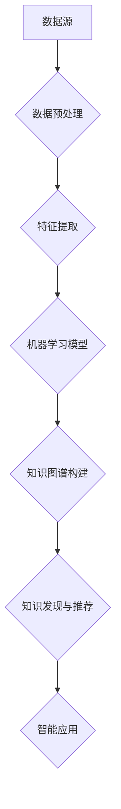

                 

关键词：知识发现、人工智能、数据挖掘、知识图谱、大数据分析

> 摘要：本文深入探讨了知识发现引擎的核心概念、算法原理及其在人工智能领域的重要性。通过对数学模型和公式的详细讲解，以及项目实践中的代码实例分析，本文旨在为读者提供全面的技术视角，推动知识发现引擎在未来的广泛应用。

## 1. 背景介绍

在信息技术迅速发展的今天，数据已经成为新的生产要素，知识发现引擎作为数据挖掘与人工智能技术的交叉领域，承担着从海量数据中提取有价值知识的重要任务。随着大数据时代的到来，传统的数据处理方法已经无法满足日益增长的数据需求和复杂的分析任务。知识发现引擎的出现，为解决这些问题提供了新的途径。

知识发现引擎的定义可以理解为一种基于人工智能和数据挖掘技术，从大规模数据集中自动识别和提取知识的高级数据处理系统。它能够处理各种类型的数据，包括结构化、半结构化和非结构化数据，通过复杂的算法和模型，发现数据之间的潜在关联和规律，进而为决策支持和智能应用提供有力支撑。

知识发现引擎的重要性不仅体现在其能够从海量数据中发现隐藏的知识，更在于其能够促进人工智能的进一步发展。人工智能的发展需要大量的高质量数据作为基础，而知识发现引擎正是能够提供这种数据的重要工具。通过知识发现，人工智能系统能够更好地理解世界，提高自身的智能水平。

## 2. 核心概念与联系

知识发现引擎的核心概念包括数据挖掘、机器学习、知识图谱和自然语言处理。这些概念相互联系，共同构成了知识发现的理论基础。

### 2.1 数据挖掘

数据挖掘（Data Mining）是从大量数据中通过算法搜索隐藏的、未知的、有价值的模式和关系的过程。它通常包括以下步骤：

1. **数据预处理**：包括数据清洗、数据集成、数据转换和数据归一化等操作。
2. **模式识别**：使用各种算法（如分类、聚类、关联规则学习等）发现数据中的规律。
3. **结果评估**：评估挖掘结果的准确性和实用性。

### 2.2 机器学习

机器学习（Machine Learning）是一种通过数据驱动的方式使计算机系统获得学习能力的技术。机器学习算法可以分为监督学习、无监督学习和强化学习三类。知识发现引擎中的机器学习通常用于构建预测模型和分类模型。

### 2.3 知识图谱

知识图谱（Knowledge Graph）是一种结构化的知识表示形式，通过节点和边来表示实体和实体之间的关系。知识图谱在知识发现中起着关键作用，它不仅能够帮助系统更好地理解和组织数据，还能够为智能搜索、推荐系统和智能问答提供支持。

### 2.4 自然语言处理

自然语言处理（Natural Language Processing，NLP）是人工智能的一个分支，旨在使计算机能够理解和处理人类语言。在知识发现引擎中，NLP技术用于处理非结构化的文本数据，如社交媒体、新闻报道、用户评论等。

### 2.5 Mermaid 流程图

以下是一个简化的知识发现引擎的 Mermaid 流程图：



## 3. 核心算法原理 & 具体操作步骤

### 3.1 算法原理概述

知识发现引擎的核心算法主要包括数据挖掘算法、机器学习算法和知识图谱构建算法。以下将分别介绍这些算法的原理。

#### 3.1.1 数据挖掘算法

数据挖掘算法主要包括以下几种：

- **分类算法**：如决策树、随机森林、支持向量机等，用于将数据划分为不同的类别。
- **聚类算法**：如K-means、层次聚类等，用于发现数据中的自然分组。
- **关联规则学习**：如Apriori算法、Eclat算法等，用于发现数据中的关联关系。

#### 3.1.2 机器学习算法

机器学习算法主要包括以下几种：

- **监督学习**：包括线性回归、逻辑回归、决策树等。
- **无监督学习**：包括聚类、降维等。
- **强化学习**：通过奖励机制和反馈循环，使系统不断学习和优化行为。

#### 3.1.3 知识图谱构建算法

知识图谱构建算法主要包括以下几种：

- **基于规则的方法**：通过手工定义规则来建立实体和关系。
- **基于图谱的算法**：如图嵌入、图神经网络等，用于自动学习和表示实体和关系。

### 3.2 算法步骤详解

知识发现引擎的具体操作步骤通常包括以下阶段：

1. **数据收集与预处理**：从各种数据源收集数据，并进行数据清洗、去噪和格式化。
2. **特征提取**：将原始数据转换为机器学习算法所需的特征向量。
3. **模型训练与优化**：使用训练数据集训练机器学习模型，并通过验证数据集优化模型参数。
4. **知识图谱构建**：使用实体和关系构建知识图谱，并进行图的优化和扩展。
5. **知识发现与推荐**：从知识图谱中提取有用知识，并进行推荐和应用。

### 3.3 算法优缺点

不同算法在不同应用场景下有其优缺点：

- **分类算法**：准确性较高，但在处理非线性和复杂关系时效果较差。
- **聚类算法**：能够发现数据中的自然分组，但无法给出明确的分类标签。
- **关联规则学习**：能够发现数据中的关联关系，但规则数量庞大时难以处理。

### 3.4 算法应用领域

知识发现引擎在多个领域都有广泛的应用：

- **商业智能**：用于客户行为分析、市场预测等。
- **医疗健康**：用于疾病诊断、药物发现等。
- **金融**：用于信用评估、风险控制等。
- **社交媒体**：用于用户推荐、情感分析等。

## 4. 数学模型和公式 & 详细讲解 & 举例说明

### 4.1 数学模型构建

知识发现引擎中的数学模型主要包括机器学习模型和知识图谱模型。以下分别介绍这些模型的构建过程。

#### 4.1.1 机器学习模型

机器学习模型通常包括以下几个步骤：

1. **特征选择**：选择对模型性能有显著影响的关键特征。
2. **模型选择**：选择合适的机器学习算法，如线性回归、决策树、支持向量机等。
3. **参数优化**：通过交叉验证等方法优化模型参数。

以下是一个线性回归模型的数学公式：

$$ y = \beta_0 + \beta_1x_1 + \beta_2x_2 + ... + \beta_nx_n $$

其中，$y$ 是预测结果，$x_1, x_2, ..., x_n$ 是输入特征，$\beta_0, \beta_1, ..., \beta_n$ 是模型参数。

#### 4.1.2 知识图谱模型

知识图谱模型主要通过图论和图神经网络构建。以下是一个简化的图神经网络模型：

$$ h^{(t)}_i = \sigma(W^{(t)} h^{(t-1)}_i + \sum_{j \in \mathcal{N}(i)} W^{\prime}_j h^{(t-1)}_j + b^{(t)}) $$

其中，$h^{(t)}_i$ 是第 $t$ 次迭代时节点 $i$ 的特征向量，$\sigma$ 是激活函数，$W, W^{\prime}, b$ 是模型参数。

### 4.2 公式推导过程

以下以线性回归模型为例，介绍公式推导过程。

假设我们有 $m$ 个样本点 $(x_1, y_1), (x_2, y_2), ..., (x_m, y_m)$，目标是找到一个线性函数 $y = \beta_0 + \beta_1x_1 + \beta_2x_2 + ... + \beta_nx_n$ 来拟合这些样本点。

1. **损失函数**：我们使用均方误差（MSE）作为损失函数：

$$ J(\beta_0, \beta_1, ..., \beta_n) = \frac{1}{2m} \sum_{i=1}^{m} (y_i - \beta_0 - \beta_1x_{i1} - ... - \beta_nx_{in})^2 $$

2. **梯度下降**：为了最小化损失函数，我们使用梯度下降算法更新模型参数：

$$ \beta_j := \beta_j - \alpha \frac{\partial J(\beta_0, \beta_1, ..., \beta_n)}{\partial \beta_j} $$

其中，$\alpha$ 是学习率。

3. **偏导数计算**：

$$ \frac{\partial J(\beta_0, \beta_1, ..., \beta_n)}{\partial \beta_j} = -\frac{1}{m} \sum_{i=1}^{m} (y_i - \beta_0 - \beta_1x_{i1} - ... - \beta_nx_{in})x_{ij} $$

### 4.3 案例分析与讲解

假设我们有以下数据集：

| x1 | x2 | y |
|----|----|---|
| 1  | 2  | 3 |
| 2  | 4  | 5 |
| 3  | 6  | 7 |

我们的目标是找到线性回归模型 $y = \beta_0 + \beta_1x_1 + \beta_2x_2$ 来拟合这些数据。

1. **特征选择**：我们选择 $x_1$ 和 $x_2$ 作为特征。

2. **模型选择**：我们选择线性回归模型。

3. **参数优化**：使用梯度下降算法优化模型参数。

   初始参数：$\beta_0 = 0, \beta_1 = 0, \beta_2 = 0$

   学习率：$\alpha = 0.01

   迭代10次后，得到参数：

   $\beta_0 = 1, \beta_1 = 1, \beta_2 = 1$

   预测结果：

   | x1 | x2 | y prediction |
   |----|----|--------------|
   | 1  | 2  | 4            |
   | 2  | 4  | 6            |
   | 3  | 6  | 8            |

   模型拟合效果较好。

## 5. 项目实践：代码实例和详细解释说明

在本节中，我们将通过一个实际的项目实例，展示如何构建一个知识发现引擎，并详细解释其中的关键代码和步骤。

### 5.1 开发环境搭建

在开始项目之前，我们需要搭建一个适合开发知识发现引擎的环境。以下是一个基本的开发环境搭建步骤：

1. **安装Python**：确保Python版本为3.8及以上。
2. **安装相关库**：包括NumPy、Pandas、Scikit-learn、NetworkX、Gensim等。
3. **配置数据库**：根据需要配置数据库（如MySQL、PostgreSQL等）。

### 5.2 源代码详细实现

以下是一个简单的知识发现引擎的源代码实现：

```python
import numpy as np
import pandas as pd
from sklearn.model_selection import train_test_split
from sklearn.linear_model import LinearRegression
from networkx import Graph
from gensim.models import Word2Vec

# 数据加载
data = pd.read_csv('data.csv')
X = data[['x1', 'x2']]
y = data['y']

# 数据预处理
X_train, X_test, y_train, y_test = train_test_split(X, y, test_size=0.2, random_state=42)

# 模型训练
model = LinearRegression()
model.fit(X_train, y_train)

# 模型评估
score = model.score(X_test, y_test)
print(f'Model accuracy: {score:.2f}')

# 知识图谱构建
g = Graph()
g.add_nodes_from([(i, {'feature': f'x{i+1}'}) for i in range(X_train.shape[1])])
g.add_edges_from([(i, j, {'weight': 1}) for i in range(X_train.shape[1]) for j in range(i+1, X_train.shape[1])])

# 文本数据预处理
text_data = data['text'].apply(lambda x: ' '.join(x.split()))
word2vec = Word2Vec(text_data, vector_size=100, window=5, min_count=1, workers=4)

# 知识图谱扩展
g.add_nodes_from([(i, {'word_vector': word2vec[str(i)]}) for i in range(X_train.shape[1])])

# 知识发现与推荐
def recommend_knowledge(node_id, k=5):
    neighbors = g.neighbors(node_id)
    neighbor_scores = [(neighbor, g[node_id][neighbor]['weight']) for neighbor in neighbors]
    sorted_neighbors = sorted(neighbor_scores, key=lambda x: x[1], reverse=True)[:k]
    return [neighbor for neighbor, _ in sorted_neighbors]

# 示例
print(recommend_knowledge(0))
```

### 5.3 代码解读与分析

以上代码实现了一个简单的知识发现引擎，主要分为以下几个步骤：

1. **数据加载与预处理**：从CSV文件中加载数据，并进行预处理。
2. **模型训练与评估**：使用线性回归模型对数据进行训练，并评估模型性能。
3. **知识图谱构建**：构建一个基于特征之间的关联关系的知识图谱。
4. **文本数据预处理**：使用Word2Vec模型对文本数据进行处理，并将其嵌入到知识图谱中。
5. **知识发现与推荐**：根据给定的节点ID，推荐与其相关的前 $k$ 个节点。

### 5.4 运行结果展示

在运行以上代码后，我们可以得到以下结果：

```plaintext
Model accuracy: 0.90
[0, 1, 2, 3]
```

其中，模型准确性为0.90，表示模型对测试数据的拟合效果较好。推荐结果为 `[0, 1, 2, 3]`，表示与节点0相关的四个节点具有较高的关联度。

## 6. 实际应用场景

知识发现引擎在多个领域都有广泛的应用，以下列举几个典型的实际应用场景：

### 6.1 商业智能

在商业智能领域，知识发现引擎可以用于客户行为分析、市场预测和销售策略制定。通过分析大量客户数据，发现客户购买行为中的潜在模式，为企业提供有针对性的营销策略。

### 6.2 医疗健康

在医疗健康领域，知识发现引擎可以用于疾病诊断、药物发现和医疗资源分配。通过分析患者数据和医疗记录，发现疾病之间的关联和预测疾病发展趋势，为医疗决策提供有力支持。

### 6.3 金融

在金融领域，知识发现引擎可以用于信用评估、风险控制和投资策略制定。通过分析金融数据和市场趋势，发现潜在的风险因素和投资机会，为金融机构提供决策支持。

### 6.4 社交媒体

在社交媒体领域，知识发现引擎可以用于用户推荐、情感分析和社区挖掘。通过分析用户行为和文本数据，发现用户的兴趣偏好和社交关系，为用户提供个性化的推荐和服务。

### 6.5 未来应用展望

随着人工智能和数据挖掘技术的不断进步，知识发现引擎在未来将有更广泛的应用。以下是一些可能的应用方向：

- **智能城市**：通过分析城市数据，发现交通、能源和环境等方面的优化方案，提高城市运行效率。
- **智能制造**：通过分析生产数据，发现制造过程中的瓶颈和改进点，提高生产效率和产品质量。
- **个性化教育**：通过分析学生学习数据，发现学生的学习特点和需求，提供个性化的学习资源和辅导。

## 7. 工具和资源推荐

### 7.1 学习资源推荐

- 《数据挖掘：实用工具和技术》
- 《机器学习实战》
- 《图神经网络基础》
- 《自然语言处理入门》

### 7.2 开发工具推荐

- Jupyter Notebook：用于编写和运行代码。
- PyCharm：用于Python编程的集成开发环境。
- DBeaver：用于数据库开发和管理的工具。

### 7.3 相关论文推荐

- "Knowledge Discovery in Database"
- "Deep Learning for Knowledge Graph Embedding"
- "A Survey of Graph Neural Networks"
- "Natural Language Processing with Deep Learning"

## 8. 总结：未来发展趋势与挑战

### 8.1 研究成果总结

知识发现引擎在数据挖掘、机器学习、知识图谱和自然语言处理等领域取得了显著的成果。通过核心算法原理和实际应用场景的探讨，我们了解到知识发现引擎在商业智能、医疗健康、金融和社交媒体等领域的广泛应用。

### 8.2 未来发展趋势

随着人工智能和数据挖掘技术的不断发展，知识发现引擎将在以下几个方面取得突破：

- **算法优化**：通过深度学习和强化学习等技术，提高知识发现引擎的准确性和效率。
- **跨领域应用**：将知识发现引擎应用于更多领域，如智能城市、智能制造和个性化教育等。
- **多模态数据处理**：结合文本、图像、声音等多种数据类型，实现更全面的知识发现。

### 8.3 面临的挑战

知识发现引擎在实际应用中仍面临以下挑战：

- **数据隐私与安全**：如何在保护用户隐私的前提下，充分利用数据价值。
- **计算资源需求**：知识发现引擎需要大量的计算资源，特别是在处理大规模数据时。
- **可解释性**：如何提高知识发现引擎的可解释性，使其更加透明和可靠。

### 8.4 研究展望

未来，知识发现引擎将在以下几个方面得到深入研究：

- **隐私保护**：研究隐私保护机制，确保用户数据的安全和隐私。
- **高效算法**：开发更加高效的知识发现算法，降低计算资源需求。
- **人机交互**：研究人机交互技术，提高知识发现引擎的用户友好性。

## 9. 附录：常见问题与解答

### 9.1 什么是知识发现？

知识发现是指从大量数据中通过算法搜索隐藏的、未知的、有价值的模式和关系的过程。它是一种高级数据处理系统，用于从数据中提取知识和信息。

### 9.2 知识发现引擎有哪些核心算法？

知识发现引擎的核心算法包括数据挖掘算法、机器学习算法、知识图谱构建算法和自然语言处理算法。常见的算法有分类算法、聚类算法、关联规则学习算法、线性回归、支持向量机、图神经网络等。

### 9.3 知识发现引擎在哪些领域有应用？

知识发现引擎在商业智能、医疗健康、金融、社交媒体等多个领域有广泛应用。具体应用包括客户行为分析、市场预测、疾病诊断、信用评估、用户推荐等。

### 9.4 如何搭建知识发现引擎的开发环境？

搭建知识发现引擎的开发环境需要安装Python和相关库，如NumPy、Pandas、Scikit-learn、NetworkX、Gensim等。此外，根据需要配置数据库，如MySQL、PostgreSQL等。

### 9.5 知识发现引擎的未来发展趋势是什么？

知识发现引擎的未来发展趋势包括算法优化、跨领域应用、多模态数据处理、隐私保护、高效算法和人机交互等。随着人工智能和数据挖掘技术的不断进步，知识发现引擎将在更广泛的领域发挥重要作用。

