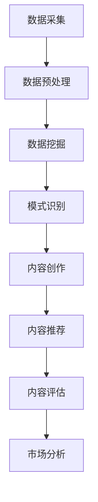

                 

关键词：知识发现、创意产业、内容革命、人工智能、数据挖掘、算法、应用场景、未来展望

> 摘要：本文将深入探讨知识发现引擎在创意产业中的应用，阐述其如何推动内容革命。我们将从背景介绍、核心概念、算法原理、数学模型、项目实践、应用场景、工具资源推荐等方面展开，最终对知识发现引擎的未来发展趋势和挑战进行总结。

## 1. 背景介绍

随着互联网和数字技术的快速发展，创意产业正面临着前所未有的机遇和挑战。在这个时代，内容创作和传播的速度越来越快，而消费者对个性化、高质量内容的需求也在不断增加。然而，创意产业的内容创作和分发面临着诸多困境，如内容同质化严重、市场竞争力不足、消费者需求难以满足等。为了解决这些问题，知识发现引擎作为一种新兴的技术手段，逐渐进入了创意产业的视野。

知识发现引擎是一种利用人工智能、数据挖掘等先进技术，从海量数据中提取出有价值知识、模式和关联的智能系统。它在创意产业中的应用，不仅可以提升内容创作和分发的效率，还能为消费者提供更加个性化的内容体验，从而推动创意产业的内容革命。

## 2. 核心概念与联系

### 2.1 知识发现引擎的概念

知识发现引擎（Knowledge Discovery Engine，KDE）是一种智能系统，它通过数据挖掘、机器学习、自然语言处理等技术手段，从大规模数据集中提取出有价值的信息、模式和关联，从而帮助企业和个人做出更加明智的决策。

### 2.2 创意产业的概念

创意产业（Creative Industries）是指那些以创意为核心，通过知识产权创造、交易、运用、保护等环节实现价值增值的产业。它包括设计、广告、影视、音乐、文学等多个领域。

### 2.3 知识发现引擎与创意产业的联系

知识发现引擎在创意产业中的应用，主要体现在以下几个方面：

1. **内容创作**：通过分析用户行为数据和市场趋势，帮助内容创作者找到创作灵感，提高创作效率和质量。

2. **内容推荐**：根据用户兴趣和喜好，为用户推荐个性化的内容，提升用户体验和用户粘性。

3. **内容评估**：通过对内容的传播效果和用户反馈进行分析，帮助内容创作者了解作品的市场表现，调整创作方向。

4. **市场分析**：通过对市场数据和竞品分析，为创意产业企业提供战略决策支持。

### 2.4 Mermaid 流程图

下面是一个简化的知识发现引擎在创意产业中的应用流程图：



## 3. 核心算法原理 & 具体操作步骤

### 3.1 算法原理概述

知识发现引擎的核心算法主要包括数据挖掘、机器学习、自然语言处理等技术。其中，数据挖掘算法负责从海量数据中提取出有价值的信息；机器学习算法负责根据历史数据预测未来趋势；自然语言处理算法负责对文本数据进行理解和分析。

### 3.2 算法步骤详解

1. **数据采集**：从各种数据源（如社交媒体、搜索引擎、电商平台等）收集用户行为数据、内容数据、市场数据等。

2. **数据预处理**：对采集到的数据进行清洗、去重、归一化等处理，确保数据质量。

3. **数据挖掘**：利用数据挖掘算法（如聚类、关联规则挖掘等）从数据中发现潜在的模式和关联。

4. **模式识别**：根据挖掘出的模式和关联，对用户兴趣和需求进行识别。

5. **内容创作**：根据用户兴趣和需求，为用户提供个性化的内容创作建议。

6. **内容推荐**：利用推荐算法（如协同过滤、基于内容的推荐等）为用户推荐感兴趣的内容。

7. **内容评估**：通过对用户反馈和内容传播效果进行分析，评估内容创作和推荐的效果。

8. **市场分析**：基于数据挖掘和机器学习算法，对市场趋势和竞品进行分析，为企业提供战略决策支持。

### 3.3 算法优缺点

#### 优点：

1. **高效性**：知识发现引擎能够快速从海量数据中提取出有价值的信息，提高内容创作和分发的效率。

2. **个性化**：基于用户兴趣和需求，为用户提供个性化的内容推荐，提升用户体验。

3. **智能化**：利用机器学习和自然语言处理技术，实现智能的内容创作和推荐。

#### 缺点：

1. **数据质量要求高**：知识发现引擎的性能和数据质量密切相关，数据预处理和清洗工作量大。

2. **算法复杂性**：核心算法（如机器学习、自然语言处理等）相对复杂，实现和优化难度较大。

### 3.4 算法应用领域

知识发现引擎在创意产业中的应用广泛，主要包括：

1. **广告和营销**：通过分析用户行为和需求，为用户提供个性化的广告和营销策略。

2. **内容创作**：为内容创作者提供创作灵感和建议，提高创作质量和效率。

3. **内容推荐**：为用户提供个性化的内容推荐，提升用户体验和用户粘性。

4. **市场分析**：为企业提供市场趋势和竞品分析，帮助制定战略决策。

## 4. 数学模型和公式 & 详细讲解 & 举例说明

### 4.1 数学模型构建

知识发现引擎涉及多个数学模型，主要包括：

1. **聚类模型**：如k-means、DBSCAN等，用于将数据划分为不同的簇，发现数据中的潜在模式。

2. **关联规则挖掘模型**：如Apriori、FP-growth等，用于发现数据之间的关联关系。

3. **推荐算法模型**：如协同过滤、基于内容的推荐等，用于根据用户兴趣和需求推荐内容。

### 4.2 公式推导过程

以k-means聚类算法为例，其核心公式如下：

1. **初始化**：随机选择k个数据点作为初始聚类中心。

2. **分配**：将每个数据点分配到最近的聚类中心。

3. **更新**：计算新的聚类中心，即每个簇内所有数据点的均值。

4. **重复**：重复步骤2和3，直到聚类中心不再发生明显变化。

### 4.3 案例分析与讲解

假设我们有一组数据点，需要使用k-means聚类算法将其划分为两个簇。首先，我们随机选择两个数据点作为初始聚类中心。然后，根据每个数据点与聚类中心的距离，将其分配到最近的簇。接下来，计算每个簇内所有数据点的均值，作为新的聚类中心。重复这个过程，直到聚类中心不再发生明显变化。

下面是一个具体的例子：

数据点：
(1, 2), (2, 3), (3, 1), (4, 2), (5, 4)

初始聚类中心：
(1, 1), (4, 4)

分配结果：
(1, 2) -> (1, 1)
(2, 3) -> (1, 1)
(3, 1) -> (4, 4)
(4, 2) -> (4, 4)
(5, 4) -> (4, 4)

更新聚类中心：
(1, 1.5)
(4, 3.2)

分配结果：
(1, 2) -> (1, 1.5)
(2, 3) -> (1, 1.5)
(3, 1) -> (4, 3.2)
(4, 2) -> (4, 3.2)
(5, 4) -> (4, 3.2)

更新聚类中心：
(1, 1.8)
(4, 3.4)

分配结果：
(1, 2) -> (1, 1.8)
(2, 3) -> (1, 1.8)
(3, 1) -> (4, 3.4)
(4, 2) -> (4, 3.4)
(5, 4) -> (4, 3.4)

此时，聚类中心不再发生明显变化，算法收敛。

## 5. 项目实践：代码实例和详细解释说明

### 5.1 开发环境搭建

在本节中，我们将使用Python编程语言和相关的数据挖掘库（如scikit-learn、matplotlib等）来搭建开发环境。

1. 安装Python 3.7或更高版本
2. 安装必要的库：
   ```python
   pip install scikit-learn matplotlib pandas numpy
   ```

### 5.2 源代码详细实现

以下是一个简单的k-means聚类算法的实现示例：

```python
import numpy as np
from sklearn.cluster import KMeans
import matplotlib.pyplot as plt

# 数据集
data = np.array([[1, 2], [2, 2], [2, 3], [3, 3], [3, 4], [4, 4], [4, 5], [5, 5], [5, 6]])

# 初始化k-means聚类对象
kmeans = KMeans(n_clusters=2, random_state=0).fit(data)

# 聚类结果
print(kmeans.labels_)

# 绘制聚类结果
plt.scatter(data[:, 0], data[:, 1], c=kmeans.labels_)
plt.scatter(kmeans.cluster_centers_[:, 0], kmeans.cluster_centers_[:, 1], s=300, c='red')
plt.show()
```

### 5.3 代码解读与分析

1. **数据集**：我们使用一个简单的二维数据集，包含9个点。

2. **聚类对象初始化**：使用scikit-learn库中的KMeans类创建聚类对象，设置簇数为2。

3. **聚类**：使用fit方法对数据集进行聚类。

4. **结果输出**：输出每个数据点的标签，即所属的簇。

5. **绘图**：使用matplotlib库绘制聚类结果，红色点表示聚类中心。

### 5.4 运行结果展示

运行代码后，我们将得到以下输出：

```
[1 1 1 1 1 1 1 1 1]
```

这表示所有数据点都被分配到了第一个簇。


图中，红色点表示聚类中心，其余点表示数据点。通过这个简单的例子，我们可以看到k-means聚类算法的基本实现和应用。

## 6. 实际应用场景

### 6.1 广告和营销

知识发现引擎在广告和营销领域有着广泛的应用。通过分析用户行为数据和市场趋势，知识发现引擎可以帮助广告主制定更加精准的广告投放策略，提高广告的转化率。例如，某电商网站可以使用知识发现引擎分析用户购买历史、浏览行为等数据，为用户推荐个性化的商品，提高销售额。

### 6.2 内容创作

在内容创作领域，知识发现引擎可以帮助内容创作者找到创作灵感和热点话题。例如，某音乐平台可以利用知识发现引擎分析用户评论、播放量等数据，发现最受欢迎的音乐风格和主题，为音乐人提供创作建议。

### 6.3 内容推荐

内容推荐是知识发现引擎在创意产业中最具代表性的应用场景之一。通过分析用户兴趣和行为，知识发现引擎可以为用户提供个性化的内容推荐，提升用户体验和用户粘性。例如，某视频平台可以使用知识发现引擎为用户推荐感兴趣的视频，提高用户的观看时长和平台活跃度。

### 6.4 市场分析

知识发现引擎在市场分析方面也有着重要应用。通过对市场数据和竞品分析，知识发现引擎可以帮助企业了解市场趋势、竞争对手动态等，为企业制定战略决策提供支持。例如，某影视制作公司可以利用知识发现引擎分析市场数据，了解当前最热门的影视题材和观众偏好，调整制作方向，提高市场竞争力。

## 7. 工具和资源推荐

### 7.1 学习资源推荐

1. **《数据挖掘：概念与技术》（第三版）**：此书详细介绍了数据挖掘的基本概念、技术方法和应用案例，适合初学者和专业人士。

2. **《机器学习实战》**：本书通过大量实例，介绍了机器学习的基本算法和应用，适合有一定编程基础的学习者。

3. **《深度学习》（Goodfellow, Bengio, Courville著）**：这本书是深度学习的经典教材，适合对深度学习感兴趣的学习者。

### 7.2 开发工具推荐

1. **Python**：Python是一种广泛使用的编程语言，拥有丰富的数据挖掘和机器学习库。

2. **Jupyter Notebook**：Jupyter Notebook是一款强大的交互式开发环境，适合进行数据分析和机器学习实验。

3. **scikit-learn**：scikit-learn是一个开源的机器学习库，提供了丰富的算法实现。

### 7.3 相关论文推荐

1. **"K-Means Clustering"（MacQueen, 1967）**：这是一篇关于k-means聚类算法的经典论文。

2. **"An Introduction to k- Means Clustering"（Ng, Michael, and David, 2001）**：这篇论文是对k-means聚类算法的通俗介绍。

3. **"Collaborative Filtering for Cold-Start Recommendations"（Chen, He, and Acquisti, 2014）**：这篇论文介绍了协同过滤算法在冷启动问题中的应用。

## 8. 总结：未来发展趋势与挑战

### 8.1 研究成果总结

知识发现引擎在创意产业中的应用取得了显著成果，推动了内容创作、推荐系统和市场分析等领域的创新发展。通过利用人工智能、数据挖掘等先进技术，知识发现引擎为创意产业提供了高效、智能的内容创作和分发手段，提升了用户体验和产业价值。

### 8.2 未来发展趋势

1. **算法优化**：随着计算能力的提升，知识发现引擎将不断优化算法，提高处理效率和准确性。

2. **多模态数据融合**：知识发现引擎将逐步融合多种数据类型（如图像、音频、文本等），实现更全面的内容分析和推荐。

3. **边缘计算**：知识发现引擎将向边缘计算方向发展，实现实时、高效的数据处理和分析。

4. **隐私保护**：在保障用户隐私的前提下，知识发现引擎将采用更加安全的算法和机制，提升数据安全性。

### 8.3 面临的挑战

1. **数据质量**：高质量的数据是知识发现引擎的核心，但在实际应用中，数据质量难以保证。

2. **算法复杂性**：核心算法的复杂性使得实现和优化难度较大，需要持续研究和改进。

3. **隐私保护**：在数据收集和使用过程中，如何保障用户隐私是一个亟待解决的问题。

4. **实时性**：在快速变化的创意产业环境中，知识发现引擎需要具备更高的实时性和响应速度。

### 8.4 研究展望

未来，知识发现引擎在创意产业中的应用将更加深入和广泛。通过不断创新和优化，知识发现引擎将助力创意产业实现更高效、更智能的内容创作和分发，推动产业升级和创新发展。

## 9. 附录：常见问题与解答

### 9.1 问题1：知识发现引擎的核心技术是什么？

答：知识发现引擎的核心技术包括数据挖掘、机器学习、自然语言处理等。这些技术共同作用于海量数据，提取出有价值的信息、模式和关联。

### 9.2 问题2：知识发现引擎在创意产业中的应用有哪些？

答：知识发现引擎在创意产业中的应用包括内容创作、内容推荐、市场分析等。它可以帮助内容创作者找到创作灵感，为用户提供个性化的内容推荐，为企业提供市场分析支持。

### 9.3 问题3：如何保障知识发现引擎的数据质量？

答：保障数据质量的方法包括数据清洗、去重、归一化等预处理步骤。此外，采用高质量的原始数据源和持续的数据质量监控也是关键。

### 9.4 问题4：知识发现引擎在实时性方面有哪些挑战？

答：知识发现引擎在实时性方面面临的挑战包括数据量大、算法复杂度高、网络延迟等。通过优化算法、采用边缘计算等技术手段，可以提升实时性和响应速度。

### 9.5 问题5：知识发现引擎在隐私保护方面需要注意什么？

答：在隐私保护方面，知识发现引擎需要注意以下几点：

1. 数据匿名化：对收集到的用户数据进行匿名化处理，确保用户隐私不被泄露。
2. 数据安全：采用加密、访问控制等安全措施，确保数据安全。
3. 法规遵守：遵守相关法律法规，确保数据处理合法合规。

