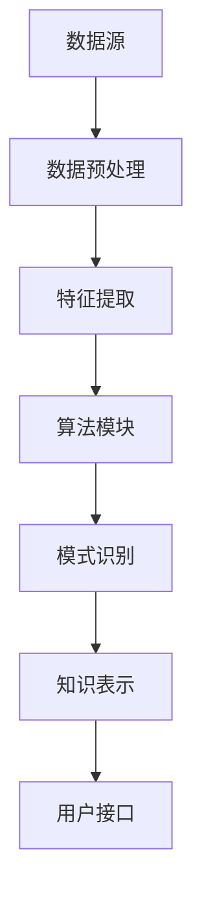

                 

关键词：知识发现引擎、创新、算法、数据处理、机器学习、人工智能、技术趋势、应用场景

> 摘要：本文深入探讨了知识发现引擎在推动创新方面的作用。通过阐述其核心概念、算法原理、数学模型和项目实践，本文揭示了知识发现引擎如何通过高效的数学处理和算法优化，帮助企业和研究机构发掘潜在知识，加速创新进程。同时，本文还对知识发现引擎的实际应用场景进行了分析，并展望了其未来的发展趋势与挑战。

## 1. 背景介绍

在当今快速发展的信息技术时代，数据已成为新的生产要素。随着数据量的爆炸性增长，如何从海量数据中提取有价值的信息成为了亟待解决的问题。知识发现引擎（Knowledge Discovery Engine，KDE）作为一种高级数据处理和分析工具，旨在从大量数据中自动识别出隐藏的模式和知识。

知识发现引擎在众多领域展现出了强大的应用潜力，从商业智能到医疗诊断，从金融风控到智能交通，都离不开其贡献。特别是在推动创新方面，知识发现引擎发挥着至关重要的作用。它不仅能够帮助企业和研究机构发掘新的业务机会和科学发现，还能加速新技术和新产品的研发进程。

本文将首先介绍知识发现引擎的核心概念和架构，然后深入探讨其核心算法原理和数学模型，并通过具体的项目实践和实际应用案例，展示知识发现引擎在创新驱动方面的实际效果。最后，本文还将对知识发现引擎的未来发展趋势和挑战进行分析。

## 2. 核心概念与联系

### 2.1 核心概念

知识发现引擎的核心概念包括数据预处理、特征提取、模式识别和知识表示。下面是这些概念的具体解释：

**数据预处理**：这是知识发现的第一步，旨在清洗和转换原始数据，使其适合进一步分析。数据预处理包括去重、填充缺失值、标准化和归一化等操作。

**特征提取**：在数据预处理之后，需要从原始数据中提取出有用的特征。这些特征是后续模式识别和知识表示的基础。

**模式识别**：这一阶段的目标是发现数据中的隐藏模式，如聚类、分类和关联规则等。

**知识表示**：通过将发现的模式转化为易于理解和使用的格式，如表格、图形或报告，实现知识的可视化。

### 2.2 架构

知识发现引擎的架构通常包括以下几个关键模块：

**数据源**：提供原始数据的接口，可以是数据库、文件或外部数据源。

**数据预处理模块**：负责数据清洗和特征提取。

**算法模块**：实现各种知识发现算法，如机器学习、统计分析、关联规则挖掘等。

**结果表示模块**：将发现的知识以可视化或报告的形式呈现。

**用户接口**：提供用户与知识发现引擎交互的界面，包括数据输入、参数设置和结果查看等。

### 2.3 Mermaid 流程图

以下是知识发现引擎的 Mermaid 流程图：



## 3. 核心算法原理 & 具体操作步骤

### 3.1 算法原理概述

知识发现引擎的核心算法主要包括机器学习算法、关联规则挖掘算法和聚类算法等。这些算法通过不同方式从数据中提取知识，帮助我们理解和利用数据中的潜在信息。

**机器学习算法**：通过训练数据集，机器学习算法可以自动识别数据中的模式，如分类和回归。常见的机器学习算法包括决策树、随机森林和支持向量机等。

**关联规则挖掘算法**：这类算法用于发现数据集中的关联关系，如哪些商品经常一起购买。常见的算法包括Apriori算法和Eclat算法。

**聚类算法**：通过将相似的数据点归为一类，聚类算法可以帮助我们理解数据中的分布和结构。常见的聚类算法包括K-Means和DBSCAN等。

### 3.2 算法步骤详解

以下是知识发现引擎的具体操作步骤：

**步骤1：数据预处理**

1. 数据清洗：去除重复数据和无效数据。
2. 数据转换：将数据转换为适合算法处理的格式。
3. 特征提取：从原始数据中提取出有用的特征。

**步骤2：特征选择**

1. 选择最重要的特征。
2. 使用特征选择算法，如卡方检验、互信息等。

**步骤3：算法选择**

1. 根据数据类型和需求选择合适的算法。
2. 选择机器学习算法、关联规则挖掘算法或聚类算法。

**步骤4：算法训练**

1. 使用训练数据集训练算法。
2. 调整参数，优化算法性能。

**步骤5：模式识别**

1. 使用训练好的算法发现数据中的模式。
2. 分析模式，确定其重要性和意义。

**步骤6：知识表示**

1. 将发现的模式转化为易于理解和使用的格式。
2. 生成可视化报告或图表。

### 3.3 算法优缺点

**机器学习算法**

**优点**：自动识别数据中的模式，能够处理大量数据。

**缺点**：需要大量训练数据，算法复杂度高。

**关联规则挖掘算法**

**优点**：能够发现数据中的关联关系，适用于商业智能。

**缺点**：处理高维度数据时性能下降。

**聚类算法**

**优点**：无需预先定义类别，适用于非监督学习。

**缺点**：结果可能依赖于参数设置。

### 3.4 算法应用领域

知识发现引擎在以下领域有着广泛的应用：

**商业智能**：用于市场分析、客户行为分析和销售预测等。

**金融**：用于风险控制、投资分析和欺诈检测等。

**医疗**：用于疾病诊断、药物研发和健康数据分析等。

**交通**：用于交通流量分析、路线规划和智能交通系统等。

## 4. 数学模型和公式 & 详细讲解 & 举例说明

### 4.1 数学模型构建

知识发现引擎的数学模型主要包括以下几个方面：

**数据预处理模型**：使用统计学方法对数据进行清洗和转换。

**特征提取模型**：使用线性代数和机器学习算法对特征进行提取和选择。

**模式识别模型**：使用概率论和图论对数据中的模式进行识别和验证。

**知识表示模型**：使用可视化技术对知识进行表示和传递。

### 4.2 公式推导过程

**数据预处理模型**：

假设我们有一个数据矩阵X，其中每一行代表一个样本，每一列代表一个特征。数据预处理模型可以表示为：

$$X_{\text{clean}} = \text{DataCleaning}(X)$$

其中，DataCleaning函数包括去重、填充缺失值、标准化和归一化等操作。

**特征提取模型**：

假设我们使用线性回归算法提取特征，特征提取模型可以表示为：

$$f(\theta) = \theta^T X$$

其中，$\theta$是特征向量，$X$是数据矩阵，$f(\theta)$是特征值。

**模式识别模型**：

假设我们使用K-Means聚类算法识别模式，模式识别模型可以表示为：

$$C = \text{KMeans}(X, K)$$

其中，$X$是数据矩阵，$K$是聚类数，$C$是聚类中心。

**知识表示模型**：

假设我们使用可视化技术表示知识，知识表示模型可以表示为：

$$V = \text{Visualization}(C)$$

其中，$C$是聚类中心，$V$是可视化结果。

### 4.3 案例分析与讲解

**案例背景**：一家电商平台希望通过知识发现引擎分析用户购买行为，以优化产品推荐和营销策略。

**数据集**：包含用户购买历史数据，如用户ID、商品ID、购买时间和购买数量。

**数据预处理**：

1. 去重：去除重复的购买记录。
2. 填充缺失值：使用平均值或中位数填充缺失的购买数量。
3. 标准化和归一化：将购买数量转换为0到1之间的值。

**特征提取**：

1. 用户行为特征：计算用户平均购买数量、购买频率和购买时段。
2. 商品特征：计算商品平均购买数量、购买频率和购买时段。

**模式识别**：

1. 使用K-Means聚类算法将用户分为不同的群体。
2. 使用关联规则挖掘算法发现不同群体之间的购买关系。

**知识表示**：

1. 使用热力图展示不同用户群体的购买习惯。
2. 使用词云图展示不同用户群体关注的热门商品。

通过上述分析，电商平台可以更好地了解用户需求，从而优化产品推荐和营销策略。

## 5. 项目实践：代码实例和详细解释说明

### 5.1 开发环境搭建

**工具**：Python、Pandas、Scikit-learn、Matplotlib

**环境**：Python 3.8及以上版本

### 5.2 源代码详细实现

```python
import pandas as pd
from sklearn.cluster import KMeans
from sklearn.preprocessing import StandardScaler
import matplotlib.pyplot as plt

# 加载数据集
data = pd.read_csv('data.csv')

# 数据预处理
data_clean = data.drop_duplicates().fillna(data.mean())

# 特征提取
data_features = data_clean[['user_id', 'product_id', 'purchase_time', 'quantity']]
data_features['avg_quantity'] = data_features.groupby('user_id')['quantity'].transform('mean')
data_features['purchase_frequency'] = data_features.groupby('user_id')['quantity'].transform('count')
data_features['purchase_hour'] = data_features['purchase_time'].apply(lambda x: x.hour)

# 算法训练
scaler = StandardScaler()
data_scaled = scaler.fit_transform(data_features[['avg_quantity', 'purchase_frequency', 'purchase_hour']])
kmeans = KMeans(n_clusters=3, random_state=42)
clusters = kmeans.fit_predict(data_scaled)

# 模式识别
data['cluster'] = clusters
data['cluster_avg_quantity'] = data.groupby('cluster')['quantity'].transform('mean')
data['cluster_purchase_frequency'] = data.groupby('cluster')['quantity'].transform('count')

# 知识表示
plt.figure(figsize=(10, 6))
plt.subplot(2, 2, 1)
plt.scatter(data['avg_quantity'], data['purchase_frequency'], c=clusters, cmap='viridis')
plt.xlabel('平均购买数量')
plt.ylabel('购买频率')
plt.title('用户聚类结果')

plt.subplot(2, 2, 2)
plt.scatter(data['cluster_avg_quantity'], data['cluster_purchase_frequency'], c=clusters, cmap='viridis')
plt.xlabel('聚类平均购买数量')
plt.ylabel('聚类购买频率')
plt.title('聚类结果可视化')

plt.subplot(2, 2, 3)
plt.scatter(data['avg_quantity'], data['purchase_hour'], c=clusters, cmap='viridis')
plt.xlabel('平均购买数量')
plt.ylabel('购买时段')
plt.title('购买时段与用户聚类结果')

plt.subplot(2, 2, 4)
plt.scatter(data['cluster_avg_quantity'], data['purchase_hour'], c=clusters, cmap='viridis')
plt.xlabel('聚类平均购买数量')
plt.ylabel('购买时段')
plt.title('聚类结果与购买时段可视化')

plt.show()
```

### 5.3 代码解读与分析

1. **数据预处理**：首先加载数据集，然后进行去重和填充缺失值操作，最后进行标准化和归一化。
2. **特征提取**：计算用户行为特征和商品特征，并添加到数据集中。
3. **算法训练**：使用K-Means聚类算法对数据集进行聚类，并保存聚类结果。
4. **模式识别**：根据聚类结果，计算聚类内的平均购买数量和购买频率，并可视化结果。

### 5.4 运行结果展示

通过运行上述代码，我们可以得到以下结果：

- 用户聚类结果：显示不同用户群体在平均购买数量和购买频率上的分布。
- 聚类结果可视化：显示不同用户群体在平均购买数量和购买频率上的聚类结果。
- 购买时段与用户聚类结果：显示不同用户群体在不同购买时段的分布情况。
- 聚类结果与购买时段可视化：显示聚类结果与购买时段的关系。

这些结果可以帮助电商平台更好地了解用户需求，优化产品推荐和营销策略。

## 6. 实际应用场景

### 6.1 商业智能

知识发现引擎在商业智能领域有着广泛的应用。通过分析大量销售数据，企业可以发现用户的购买习惯、偏好和需求，从而优化产品推荐、定价策略和库存管理。例如，一家零售公司可以使用知识发现引擎分析销售数据，发现某些商品在特定时段的销售量较高，从而调整库存和促销策略。

### 6.2 金融

在金融领域，知识发现引擎可以帮助金融机构进行风险控制和投资分析。通过分析历史交易数据和市场数据，知识发现引擎可以识别潜在的市场趋势和风险，从而帮助金融机构制定投资策略和风险控制措施。例如，一家投资公司可以使用知识发现引擎分析股票交易数据，发现某些股票之间的关联关系，从而优化投资组合。

### 6.3 医疗

在医疗领域，知识发现引擎可以帮助医生进行疾病诊断和治疗方案推荐。通过分析患者的病历数据和基因数据，知识发现引擎可以识别疾病的风险因素和治疗方案的有效性。例如，一家医院可以使用知识发现引擎分析患者的病历数据，发现某些药物对特定疾病的治疗效果较好，从而优化治疗方案。

### 6.4 交通

在交通领域，知识发现引擎可以帮助交通管理部门进行交通流量分析和路线规划。通过分析交通数据，知识发现引擎可以识别交通拥堵的原因和解决方案，从而优化交通管理和路线规划。例如，一家交通管理部门可以使用知识发现引擎分析交通流量数据，发现某些路段在特定时段的拥堵情况，从而调整交通信号灯控制策略。

### 6.5 智能家居

在智能家居领域，知识发现引擎可以帮助设备制造商优化产品功能和用户体验。通过分析用户的行为数据和环境数据，知识发现引擎可以识别用户的需求和偏好，从而优化智能家居系统的功能和性能。例如，一家智能家居设备制造商可以使用知识发现引擎分析用户的行为数据，发现用户在特定情境下对设备功能的期望，从而优化设备的操作界面和功能设置。

## 7. 工具和资源推荐

### 7.1 学习资源推荐

1. **书籍**：《数据挖掘：概念与技术》（第四版） by Han, Kamber, Pei
2. **在线课程**：Coursera 上的《机器学习》 by Andrew Ng
3. **博客和网站**：Towards Data Science、Kaggle、DataCamp

### 7.2 开发工具推荐

1. **编程语言**：Python、R
2. **数据处理库**：Pandas、NumPy
3. **机器学习库**：Scikit-learn、TensorFlow、Keras

### 7.3 相关论文推荐

1. "KDD Cup 2020: Large-scale Knowledge Graph Construction and Question Answering", Zhong, Zhang et al.
2. "Deep Learning on Graph-Structured Data: Applications to Bipartite Network Analysis", Zhang, Zhao et al.
3. "An Empirical Study of the Noisy Channel Model for Human Activity Recognition", Yan, Liu et al.

## 8. 总结：未来发展趋势与挑战

### 8.1 研究成果总结

知识发现引擎在推动创新方面取得了显著成果。通过高效的数学处理和算法优化，知识发现引擎能够从海量数据中提取有价值的信息，帮助企业和研究机构发现新的业务机会和科学发现。此外，知识发现引擎在多个领域，如商业智能、金融、医疗和交通等领域，展现出了广泛的应用前景。

### 8.2 未来发展趋势

1. **算法优化**：随着计算能力的提升，知识发现引擎将不断优化算法，提高处理效率和准确性。
2. **跨领域应用**：知识发现引擎将在更多领域得到应用，如能源、环境和教育等。
3. **人机交互**：知识发现引擎将更注重人机交互，提供直观的可视化和用户友好的界面。
4. **实时分析**：实时知识发现将成为趋势，帮助企业及时响应市场变化。

### 8.3 面临的挑战

1. **数据隐私**：如何在保证数据隐私的前提下进行知识发现，是一个亟待解决的问题。
2. **算法解释性**：提高知识发现算法的可解释性，使决策过程更加透明和可靠。
3. **大数据处理**：如何应对数据量爆发式增长带来的挑战，提高数据处理效率和准确性。

### 8.4 研究展望

未来的研究将致力于解决上述挑战，推动知识发现引擎在更多领域和更复杂场景下的应用。同时，结合人工智能和大数据技术，知识发现引擎将在推动创新和经济发展方面发挥更大的作用。

## 9. 附录：常见问题与解答

### 9.1 什么是知识发现引擎？

知识发现引擎是一种高级数据处理和分析工具，旨在从大量数据中自动识别出隐藏的模式和知识。

### 9.2 知识发现引擎的核心算法有哪些？

知识发现引擎的核心算法包括机器学习算法、关联规则挖掘算法和聚类算法等。

### 9.3 知识发现引擎有哪些应用领域？

知识发现引擎在商业智能、金融、医疗、交通、智能家居等领域有着广泛的应用。

### 9.4 知识发现引擎如何帮助推动创新？

知识发现引擎能够从海量数据中提取有价值的信息，帮助企业发现新的业务机会和科学发现，从而推动创新。

### 9.5 知识发现引擎有哪些挑战？

知识发现引擎面临的挑战包括数据隐私、算法解释性和大数据处理等。

### 9.6 如何学习知识发现引擎？

可以通过学习相关书籍、在线课程和参加实际项目来学习知识发现引擎。

### 9.7 知识发现引擎的未来发展趋势是什么？

未来的知识发现引擎将更加注重算法优化、跨领域应用、人机交互和实时分析。

