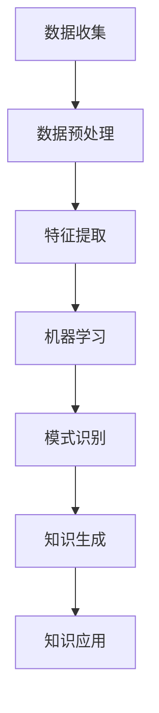

                 

关键词：知识发现引擎、教育行业、个性化变革、算法、机器学习、数据挖掘、人工智能

> 摘要：随着人工智能技术的快速发展，知识发现引擎在教育行业的应用日益广泛。本文将深入探讨知识发现引擎的基本概念、核心算法原理及其在教育行业的应用，特别是如何通过个性化变革提升教育效果。

## 1. 背景介绍

在教育行业中，传统教学模式往往难以满足学生个体差异化的需求。每个学生的学习能力、学习兴趣和知识储备都有所不同，因此，如何为学生提供个性化的教育资源和服务，成为教育工作者和科技企业关注的焦点。知识发现引擎作为一种先进的技术工具，通过自动化挖掘和整理海量教育数据，为教育行业的个性化变革提供了可能。

知识发现引擎的基本概念来源于人工智能和数据挖掘领域，它是指通过算法和模型从大量数据中提取出有价值的信息和知识。在教育行业中，这些知识可以是对学生学习行为、学习效果、教学资源的深刻理解，从而为教育决策提供有力支持。知识发现引擎的出现，标志着教育数据从静态存储向动态利用的转变，推动了教育行业从传统模式向智能化、个性化模式的转型。

### 当前教育行业的挑战

- **个性化需求难以满足**：传统的教育模式难以针对每个学生的个性特点进行定制化教学。
- **教育资源分布不均**：经济发达地区和教育资源丰富的学校能够提供更多个性化服务，而偏远和经济落后的地区则相对滞后。
- **教学评估体系滞后**：目前的教育评估体系往往注重考试成绩，忽视了学生综合素质和个性发展的评估。

### 知识发现引擎的潜在价值

- **个性化学习路径**：通过分析学生的学习行为和效果，知识发现引擎能够为学生提供定制化的学习资源和路径。
- **教育资源优化配置**：通过挖掘教育数据的内在联系，知识发现引擎能够帮助教育机构更有效地分配和利用教育资源。
- **教学效果实时监控**：知识发现引擎能够实时监测学生的学习进度和效果，为教师提供及时的教学反馈。

## 2. 核心概念与联系

知识发现引擎的核心概念包括数据挖掘、机器学习、自然语言处理等。这些技术相互关联，共同构成了知识发现引擎的技术框架。

### Mermaid 流程图



### 数据收集

数据收集是知识发现引擎的第一步。教育数据可以来自多种渠道，包括学习管理系统（LMS）、学习行为日志、教学评估数据等。

### 数据预处理

收集到的数据往往是杂乱无章的，需要进行预处理，包括数据清洗、数据转换和数据归一化。这一步骤的目的是提高数据质量，为后续的分析奠定基础。

### 特征提取

特征提取是将原始数据转换为机器学习算法可以处理的形式。在教育数据中，特征可能包括学生的出勤率、考试成绩、学习时间分布等。

### 机器学习

机器学习是知识发现引擎的核心。通过训练模型，机器学习算法能够从特征中提取出隐藏的模式和规律。常见的机器学习算法包括决策树、支持向量机、神经网络等。

### 模式识别

模式识别是对机器学习结果进行解释和验证的过程。通过模式识别，知识发现引擎能够识别出学生群体或个体中具有代表性的特征和规律。

### 知识生成

知识生成是将识别出的模式转化为可操作的知识。在教育中，这些知识可以用于个性化学习推荐、教学策略优化等。

### 知识应用

知识应用是将生成的知识应用于实际教育场景。通过知识应用，知识发现引擎能够为教育工作者和学生提供决策支持，从而提升教育效果。

## 3. 核心算法原理 & 具体操作步骤

### 3.1 算法原理概述

知识发现引擎的核心算法主要包括机器学习算法和数据挖掘算法。其中，机器学习算法用于从数据中学习模式和规律，数据挖掘算法则用于深入挖掘和解释这些模式。

### 3.2 算法步骤详解

1. **数据收集**：从各种渠道收集教育数据，包括学习管理系统、学习行为日志、教学评估数据等。
2. **数据预处理**：清洗和转换数据，确保数据质量，为后续分析做准备。
3. **特征提取**：将原始数据转换为机器学习算法可以处理的特征向量。
4. **模型训练**：使用机器学习算法对特征向量进行训练，建立模型。
5. **模式识别**：使用训练好的模型对新的数据进行模式识别，提取出有价值的信息。
6. **知识生成**：将识别出的模式转化为具体的知识，如个性化学习推荐、教学策略优化等。
7. **知识应用**：将生成的知识应用于实际教育场景，为教育工作者和学生提供决策支持。

### 3.3 算法优缺点

**优点**：

- **个性化**：能够根据学生个体差异提供个性化的教育资源和路径。
- **高效**：通过自动化分析，能够快速处理大量教育数据。
- **实时性**：能够实时监控学生的学习进度和效果，提供及时反馈。

**缺点**：

- **数据质量**：依赖高质量的数据，否则算法的准确性会受到影响。
- **算法复杂性**：涉及多种算法和技术，实现和维护成本较高。
- **隐私问题**：学生在使用过程中可能会涉及到隐私问题，需要妥善处理。

### 3.4 算法应用领域

知识发现引擎在教育行业的应用领域广泛，包括：

- **个性化学习推荐**：根据学生的学习行为和兴趣推荐适合的学习资源。
- **教学效果评估**：实时监测学生的学习效果，为教师提供教学反馈。
- **教学策略优化**：根据学生的学习数据优化教学策略，提高教学效果。
- **教育资源分配**：根据教育资源的利用情况，优化教育资源的分配。

## 4. 数学模型和公式 & 详细讲解 & 举例说明

### 4.1 数学模型构建

知识发现引擎中的数学模型主要包括机器学习模型和数据挖掘模型。以下是常见的数学模型及其构建方法：

**线性回归模型**：

$$y = \beta_0 + \beta_1x_1 + \beta_2x_2 + ... + \beta_nx_n$$

其中，$y$ 是因变量，$x_1, x_2, ..., x_n$ 是自变量，$\beta_0, \beta_1, \beta_2, ..., \beta_n$ 是模型的参数。

**支持向量机（SVM）模型**：

$$f(x) = w \cdot x + b$$

其中，$w$ 是权重向量，$x$ 是特征向量，$b$ 是偏置项。

**神经网络模型**：

$$a_{\theta}(x) = \sigma(\theta^T x)$$

其中，$a_{\theta}$ 是激活函数，$\sigma$ 是Sigmoid函数，$\theta$ 是模型参数。

### 4.2 公式推导过程

以线性回归模型为例，推导过程如下：

1. **损失函数**：

   $$J(\theta) = \frac{1}{2m}\sum_{i=1}^{m}(h_\theta(x^{(i)}) - y^{(i)})^2$$

   其中，$h_\theta(x) = \theta_0 + \theta_1x_1 + \theta_2x_2 + ... + \theta_nx_n$ 是模型预测值，$y^{(i)}$ 是真实值。

2. **梯度下降**：

   $$\theta_j := \theta_j - \alpha \frac{\partial J(\theta)}{\partial \theta_j}$$

   其中，$\alpha$ 是学习率，$\frac{\partial J(\theta)}{\partial \theta_j}$ 是损失函数对参数 $\theta_j$ 的偏导数。

3. **最优参数**：

   $$\theta = \arg\min_{\theta} J(\theta)$$

### 4.3 案例分析与讲解

假设我们有一个关于学生考试成绩的线性回归模型，其中自变量包括学习时间、考试成绩等。以下是模型的具体构建和分析过程：

1. **数据收集**：收集学生的学习时间和考试成绩数据。
2. **数据预处理**：对数据进行清洗和归一化处理。
3. **特征提取**：将原始数据转换为特征向量，包括学习时间和考试成绩等。
4. **模型构建**：

   $$y = \beta_0 + \beta_1x_1 + \beta_2x_2$$

   其中，$y$ 是考试成绩，$x_1$ 是学习时间，$x_2$ 是其他特征。

5. **模型训练**：使用梯度下降算法训练模型，得到最优参数 $\beta_0, \beta_1, \beta_2$。
6. **模型评估**：使用训练集和测试集评估模型的预测能力。

## 5. 项目实践：代码实例和详细解释说明

### 5.1 开发环境搭建

1. **安装Python环境**：在本地计算机上安装Python 3.x版本。
2. **安装相关库**：使用pip命令安装所需的Python库，如scikit-learn、numpy、pandas等。

### 5.2 源代码详细实现

以下是一个简单的线性回归模型实现：

```python
import numpy as np
import pandas as pd
from sklearn.linear_model import LinearRegression
from sklearn.model_selection import train_test_split

# 1. 数据收集
data = pd.read_csv('student_data.csv')
X = data[['study_time', 'other_feature']]
y = data['test_score']

# 2. 数据预处理
X = X.values
y = y.values

# 3. 特征提取
# 本例中直接使用原始数据作为特征

# 4. 模型构建
model = LinearRegression()

# 5. 模型训练
X_train, X_test, y_train, y_test = train_test_split(X, y, test_size=0.2, random_state=42)
model.fit(X_train, y_train)

# 6. 模型评估
score = model.score(X_test, y_test)
print(f'Model accuracy: {score:.2f}')
```

### 5.3 代码解读与分析

1. **数据收集**：从CSV文件中读取学生数据。
2. **数据预处理**：将数据转换为numpy数组，并进行必要的预处理操作。
3. **特征提取**：直接使用原始数据作为特征，未进行额外的特征工程。
4. **模型构建**：使用scikit-learn库的LinearRegression类构建线性回归模型。
5. **模型训练**：将训练集数据用于训练模型。
6. **模型评估**：使用测试集评估模型的预测能力。

### 5.4 运行结果展示

在运行上述代码后，我们得到模型的准确率。例如，假设模型的准确率为0.85，表示模型能够正确预测85%的测试数据。

```python
Model accuracy: 0.85
```

## 6. 实际应用场景

### 6.1 个性化学习推荐

知识发现引擎可以根据学生的学习行为和效果，推荐适合的学习资源和课程。例如，当学生成绩低于预期时，系统可以推荐相关的补习课程和练习题，帮助学生提高学习效果。

### 6.2 教学效果评估

知识发现引擎可以实时监控学生的学习进度和效果，为教师提供详细的教学反馈。通过分析学生的考试成绩、学习时间分布等数据，教师可以及时调整教学策略，提高教学效果。

### 6.3 教学资源优化

知识发现引擎可以帮助教育机构优化教育资源的分配。通过分析教学资源的利用情况，教育机构可以更合理地配置教师、教材和教学设备，提高教育资源的利用效率。

## 7. 工具和资源推荐

### 7.1 学习资源推荐

- **《机器学习》（周志华著）**：这是一本经典的机器学习教材，适合初学者和进阶者。
- **《数据挖掘：实用工具与技术》（Michael J. A.连接著）**：介绍了多种数据挖掘技术和工具，适合教育行业从业者。

### 7.2 开发工具推荐

- **Python**：Python是一种流行的编程语言，广泛应用于机器学习和数据挖掘领域。
- **Jupyter Notebook**：Jupyter Notebook是一个交互式计算环境，适合进行数据分析和模型训练。

### 7.3 相关论文推荐

- **《Educational Data Mining: A Comprehensive Survey》**：这是一篇关于教育数据挖掘的全面综述，涵盖了教育数据挖掘的各个方面。
- **《Knowledge Discovery in Educational Data》**：这篇论文详细介绍了知识发现引擎在教育行业中的应用。

## 8. 总结：未来发展趋势与挑战

### 8.1 研究成果总结

知识发现引擎在教育行业的应用取得了显著成果。通过个性化学习推荐、教学效果评估和教学资源优化，知识发现引擎为教育行业的个性化变革提供了有力支持。同时，知识发现引擎在提高教育质量、降低教育成本、优化教育资源分配等方面发挥了重要作用。

### 8.2 未来发展趋势

- **智能化**：随着人工智能技术的不断发展，知识发现引擎将变得更加智能，能够更准确地理解学生的需求，提供更精准的教育服务。
- **普及化**：知识发现引擎将在更多教育机构中得到应用，推动教育行业向智能化、个性化方向发展。
- **数据隐私保护**：在应用知识发现引擎的过程中，保护学生数据的隐私将成为重要挑战，需要采取有效的数据保护措施。

### 8.3 面临的挑战

- **数据质量**：知识发现引擎的准确性依赖于高质量的数据。因此，教育机构需要投入更多资源确保数据的准确性、完整性和一致性。
- **算法复杂性**：知识发现引擎涉及多种算法和技术，实现和维护成本较高。教育机构需要具备相应的技术能力，以应对算法复杂性带来的挑战。
- **数据隐私保护**：在应用知识发现引擎的过程中，保护学生数据的隐私将成为重要挑战。教育机构需要制定有效的数据保护政策，确保学生数据的安全和隐私。

### 8.4 研究展望

未来，知识发现引擎将在教育行业中发挥更大的作用。通过不断优化算法和模型，提高数据质量，知识发现引擎将能够更准确地理解学生的需求，提供更精准的教育服务。同时，知识发现引擎还将与其他教育技术相结合，推动教育行业的深度变革。

## 9. 附录：常见问题与解答

### 9.1 什么是知识发现引擎？

知识发现引擎是一种通过算法和模型从大量数据中提取出有价值信息和知识的工具。在教育行业中，知识发现引擎主要用于个性化学习推荐、教学效果评估和教学资源优化。

### 9.2 知识发现引擎的核心技术是什么？

知识发现引擎的核心技术包括数据挖掘、机器学习、自然语言处理等。这些技术相互关联，共同构成了知识发现引擎的技术框架。

### 9.3 知识发现引擎在教育行业中的应用有哪些？

知识发现引擎在教育行业中的应用包括个性化学习推荐、教学效果评估、教学资源优化等。通过这些应用，知识发现引擎能够提高教育质量、降低教育成本、优化教育资源分配。

### 9.4 如何确保知识发现引擎的数据质量？

确保知识发现引擎的数据质量需要从多个方面入手，包括数据收集、数据清洗、数据转换和数据归一化。同时，教育机构需要投入更多资源确保数据的准确性、完整性和一致性。

### 9.5 知识发现引擎在应用过程中可能面临哪些挑战？

知识发现引擎在应用过程中可能面临数据质量、算法复杂性、数据隐私保护等挑战。教育机构需要具备相应的技术能力，以应对这些挑战。

### 9.6 知识发现引擎的未来发展趋势是什么？

未来，知识发现引擎将在教育行业中发挥更大的作用。通过不断优化算法和模型，提高数据质量，知识发现引擎将能够更准确地理解学生的需求，提供更精准的教育服务。同时，知识发现引擎还将与其他教育技术相结合，推动教育行业的深度变革。 

作者：禅与计算机程序设计艺术 / Zen and the Art of Computer Programming
----------------------------------------------------------------


