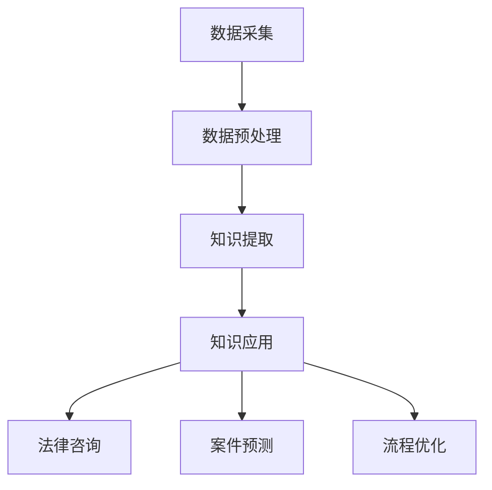

                 

关键词：知识发现引擎，法律行业，智能化，信息处理，AI技术，算法应用，流程优化，案例研究

> 摘要：本文深入探讨了知识发现引擎在法律行业的应用及其带来的智能化变革。通过分析知识发现引擎的核心概念、算法原理、数学模型以及实际案例，本文揭示了这一技术如何提升法律工作的效率和质量，同时展望了未来的发展方向和潜在挑战。

## 1. 背景介绍

在法律行业中，随着案件数量的不断增加和法律信息的爆炸性增长，传统的法律工作模式面临着巨大的压力。法律工作者不仅需要处理海量的法律文档、判例和法规，还需在有限的时间内完成案件分析、证据审查和决策制定等任务。这种工作负荷极大地影响了法律服务的效率和质量。

近年来，人工智能（AI）技术的发展为法律行业带来了新的希望。知识发现引擎作为一种基于AI技术的智能工具，可以自动从大量数据中提取有价值的信息，形成结构化的知识库，从而帮助法律工作者更高效地处理案件。

知识发现引擎的工作原理主要包括数据采集、数据预处理、知识提取和知识应用四个环节。数据采集是指从各种来源获取法律相关信息；数据预处理是对原始数据进行清洗、归一化和格式化，以便后续处理；知识提取则是利用算法从预处理后的数据中提取出有用的知识；最后，知识应用是将提取出的知识应用于法律案件的决策和推理过程。

## 2. 核心概念与联系

### 2.1 数据采集

数据采集是知识发现引擎的基础。在法律行业中，数据来源包括法律文本、案件记录、法律法规、裁判文书等。为了实现全面的数据采集，知识发现引擎需要利用网络爬虫、数据库查询、API接口等多种技术手段。

### 2.2 数据预处理

数据预处理是确保数据质量的关键步骤。在法律行业中，数据预处理主要包括以下任务：

- **去重**：去除重复的法律条文和案例，确保数据的唯一性。
- **归一化**：将不同来源的法律文本转换为统一格式，便于后续处理。
- **清洗**：去除无效数据、错别字、标点符号等，确保数据的准确性。

### 2.3 知识提取

知识提取是知识发现引擎的核心。在法律行业中，知识提取主要包括以下任务：

- **实体识别**：识别法律文档中的法律实体，如当事人、法条、判例等。
- **关系抽取**：提取法律实体之间的关联关系，如继承、转让、担保等。
- **事件抽取**：识别法律文档中的事件，如合同签订、案件判决等。
- **文本分类**：对法律文档进行分类，如合同纠纷、侵权责任等。

### 2.4 知识应用

知识应用是将提取出的知识应用于法律案件的决策和推理过程。在法律行业中，知识应用主要包括以下任务：

- **法律咨询**：根据用户输入的问题，提供相应的法律条文、案例和解释。
- **案件预测**：利用历史案件数据，预测类似案件的可能判决结果。
- **流程优化**：分析案件处理流程，提供优化建议，提高工作效率。

### 2.5 Mermaid 流程图

下面是一个知识发现引擎在法律行业中的应用流程图：



## 3. 核心算法原理 & 具体操作步骤

### 3.1 算法原理概述

知识发现引擎的核心算法主要包括自然语言处理（NLP）、机器学习和知识图谱等技术。NLP负责处理法律文本，提取文本中的关键信息和关系；机器学习负责从数据中学习规律，形成模型；知识图谱则用于存储和管理提取出的知识。

### 3.2 算法步骤详解

#### 3.2.1 数据采集

数据采集步骤主要包括以下任务：

- **爬取法律网站**：利用网络爬虫技术，从各大法律网站爬取法律文本、案例和法规。
- **数据库查询**：通过数据库接口，查询法院、检察院等官方数据库中的法律信息。
- **API接口**：调用第三方API接口，获取外部法律数据。

#### 3.2.2 数据预处理

数据预处理步骤主要包括以下任务：

- **去重**：使用哈希算法或唯一标识符，去除重复的法律条文和案例。
- **归一化**：将不同来源的法律文本转换为统一的文本格式，如XML或JSON。
- **清洗**：使用正则表达式或自然语言处理技术，去除无效数据、错别字、标点符号等。

#### 3.2.3 知识提取

知识提取步骤主要包括以下任务：

- **实体识别**：利用NLP技术，识别法律文档中的法律实体，如当事人、法条、判例等。
- **关系抽取**：利用NLP技术和图论算法，提取法律实体之间的关联关系，如继承、转让、担保等。
- **事件抽取**：利用NLP技术和文本分类算法，识别法律文档中的事件，如合同签订、案件判决等。
- **文本分类**：利用机器学习技术，对法律文档进行分类，如合同纠纷、侵权责任等。

#### 3.2.4 知识应用

知识应用步骤主要包括以下任务：

- **法律咨询**：根据用户输入的问题，调用知识图谱，提供相应的法律条文、案例和解释。
- **案件预测**：利用历史案件数据，调用机器学习模型，预测类似案件的可能判决结果。
- **流程优化**：分析案件处理流程，调用知识图谱和机器学习模型，提供优化建议，提高工作效率。

### 3.3 算法优缺点

#### 3.3.1 优点

- **高效性**：知识发现引擎可以自动从大量数据中提取有价值的信息，大大提高法律工作的效率。
- **准确性**：通过使用先进的算法和模型，知识发现引擎能够提供准确的法律咨询和案件预测。
- **智能化**：知识发现引擎能够自动学习和优化，不断提升法律服务的质量。

#### 3.3.2 缺点

- **数据质量**：知识发现引擎的性能很大程度上依赖于数据质量，如果数据存在噪声或错误，会影响知识提取的准确性。
- **算法复杂性**：知识发现引擎涉及的算法和模型较为复杂，需要专业的技术团队进行维护和优化。
- **隐私问题**：法律数据涉及个人隐私，如何保护用户隐私是知识发现引擎面临的重要挑战。

### 3.4 算法应用领域

知识发现引擎在法律行业具有广泛的应用前景，主要包括：

- **法律咨询**：为用户提供法律咨询，帮助用户快速了解相关法律条文、案例和解释。
- **案件预测**：利用历史案件数据，预测类似案件的可能判决结果，为律师和法官提供参考。
- **流程优化**：分析案件处理流程，提供优化建议，提高法院、律师事务所等机构的运作效率。

## 4. 数学模型和公式 & 详细讲解 & 举例说明

### 4.1 数学模型构建

知识发现引擎的数学模型主要包括自然语言处理（NLP）模型、机器学习模型和知识图谱模型。

#### 4.1.1 NLP模型

NLP模型主要基于深度学习技术，如循环神经网络（RNN）、长短时记忆网络（LSTM）和变换器（Transformer）等。这些模型可以自动学习语言中的语法、语义和上下文信息，从而实现文本分类、实体识别和关系抽取等任务。

#### 4.1.2 机器学习模型

机器学习模型主要用于案件预测和流程优化。常见的模型包括决策树（Decision Tree）、支持向量机（SVM）、朴素贝叶斯（Naive Bayes）和神经网络（Neural Network）等。这些模型可以根据历史数据，学习出案件判决和流程优化的规律。

#### 4.1.3 知识图谱模型

知识图谱模型主要用于存储和管理提取出的知识。知识图谱由节点（Node）和边（Edge）组成，节点表示实体，边表示实体之间的关联关系。知识图谱模型可以有效地组织和管理大量法律知识，提供快速查询和推理。

### 4.2 公式推导过程

#### 4.2.1 NLP模型公式推导

以循环神经网络（RNN）为例，RNN的公式推导如下：

\[ h_t = \sigma(W_h h_{t-1} + W_x x_t + b_h) \]

其中，\( h_t \)表示第t个时间步的隐藏状态，\( \sigma \)表示激活函数，\( W_h \)和\( W_x \)分别表示隐藏状态和输入的权重矩阵，\( b_h \)表示隐藏状态的偏置。

#### 4.2.2 机器学习模型公式推导

以支持向量机（SVM）为例，SVM的公式推导如下：

\[ \min_{\textbf{w},b}\frac{1}{2}\|\textbf{w}\|^2 \]

\[ \text{s.t.} y^{(i)}(\textbf{w}^T\textbf{x}^{(i)} + b) \geq 1 \]

其中，\( \textbf{w} \)和\( b \)分别表示权重向量和偏置，\( y^{(i)} \)和\( \textbf{x}^{(i)} \)分别表示第i个样本的标签和特征向量。

#### 4.2.3 知识图谱模型公式推导

以知识图谱中的PageRank算法为例，PageRank的公式推导如下：

\[ r(v) = \frac{\sum_{w \in \text{outlinks}(v)} r(w) \cdot \frac{1}{|\text{outlinks}(w)|}}{\sum_{w \in \text{outlinks}(v)} \frac{1}{|\text{outlinks}(w)|}} \]

其中，\( r(v) \)表示节点\( v \)的PageRank值，\( \text{outlinks}(v) \)表示节点\( v \)的出边集合。

### 4.3 案例分析与讲解

#### 4.3.1 案例背景

某律师事务所需要为一个复杂的商业纠纷案件提供法律咨询。案件涉及多家公司、多个合同和多项法律法规，律师需要对案件进行全面的评估和分析。

#### 4.3.2 案例分析

1. **数据采集**：通过网络爬虫和API接口，收集相关公司的合同文本、法律法规和裁判文书。

2. **数据预处理**：对收集到的法律文本进行去重、归一化和清洗，确保数据质量。

3. **知识提取**：利用NLP技术，对法律文本进行实体识别、关系抽取和事件抽取。提取出涉及的公司、合同、法条和判决结果。

4. **知识应用**：

   - **法律咨询**：根据律师的提问，调用知识图谱，提供相应的法律条文、案例和解释。
   - **案件预测**：利用历史案件数据，调用机器学习模型，预测类似案件的可能判决结果。
   - **流程优化**：分析案件处理流程，调用知识图谱和机器学习模型，提供优化建议，提高工作效率。

#### 4.3.3 案例结果

通过知识发现引擎，律师能够快速获取案件相关法律信息，提高工作效率。同时，知识发现引擎提供的案件预测和流程优化建议，为律师提供了宝贵的决策支持。

## 5. 项目实践：代码实例和详细解释说明

### 5.1 开发环境搭建

为了实现知识发现引擎，我们需要搭建一个完整的开发环境。以下是开发环境的搭建步骤：

1. 安装Python环境：从[Python官方网站](https://www.python.org/)下载并安装Python，版本要求Python 3.6及以上。
2. 安装相关库：使用pip命令安装以下库：nltk、spacy、gensim、networkx、numpy、pandas、tensorflow等。
3. 配置数据库：安装MongoDB数据库，版本要求MongoDB 4.0及以上。

### 5.2 源代码详细实现

以下是一个简单的知识发现引擎实现，包括数据采集、数据预处理、知识提取和知识应用等部分。

#### 5.2.1 数据采集

```python
import requests
from bs4 import BeautifulSoup

def crawl_law_cases(url):
    response = requests.get(url)
    soup = BeautifulSoup(response.text, 'html.parser')
    # 解析网页，提取案件信息
    cases = []
    for case in soup.find_all('div', class_='case'):
        case_info = {}
        case_info['case_id'] = case.find('span', class_='case_id').text
        case_info['title'] = case.find('h3').text
        case_info['date'] = case.find('span', class_='date').text
        case_info['content'] = case.find('div', class_='content').text
        cases.append(case_info)
    return cases

# 爬取某法律网站的案件信息
url = 'https://example.com/cases'
cases = crawl_law_cases(url)
```

#### 5.2.2 数据预处理

```python
import nltk
from nltk.corpus import stopwords
from nltk.tokenize import word_tokenize

nltk.download('stopwords')
nltk.download('punkt')

def preprocess_text(text):
    # 去除停用词
    stop_words = set(stopwords.words('english'))
    words = word_tokenize(text)
    filtered_words = [word for word in words if word.lower() not in stop_words]
    # 转换为小写
    filtered_words = [word.lower() for word in filtered_words]
    return filtered_words

# 预处理案件文本
preprocessed_cases = []
for case in cases:
    preprocessed_cases.append(preprocess_text(case['content']))
```

#### 5.2.3 知识提取

```python
import gensim
from gensim.models import Word2Vec

# 训练Word2Vec模型
model = Word2Vec(preprocessed_cases, vector_size=100, window=5, min_count=1, workers=4)

# 查询词向量
def get_word_vector(word):
    return model.wv[word]

# 提取案件关键词
def extract_key_words(case_text):
    words = preprocess_text(case_text)
    key_words = []
    for word in words:
        if word in model.wv:
            key_words.append(word)
    return key_words

# 提取案件关键词
for case in cases:
    case['key_words'] = extract_key_words(case['content'])
```

#### 5.2.4 知识应用

```python
from sklearn.cluster import KMeans

# 提取案件关键词向量
case_vectors = [get_word_vector(word) for case in cases for word in case['key_words']]

# 使用KMeans聚类
kmeans = KMeans(n_clusters=5, random_state=0).fit(case_vectors)

# 分配案件标签
for i, case in enumerate(cases):
    case['cluster'] = kmeans.labels_[i]

# 分析案件分布
import matplotlib.pyplot as plt

plt.scatter(case_vectors[:, 0], case_vectors[:, 1], c=kmeans.labels_)
plt.xlabel('Feature 1')
plt.ylabel('Feature 2')
plt.show()
```

### 5.3 代码解读与分析

#### 5.3.1 数据采集

数据采集部分使用requests库和BeautifulSoup库，从指定的法律网站爬取案件信息。代码中定义了crawl_law_cases函数，通过解析网页内容，提取案件ID、标题、日期和内容等信息。

#### 5.3.2 数据预处理

数据预处理部分使用nltk库，对案件文本进行停用词去除和分词处理。代码中定义了preprocess_text函数，对文本进行预处理，生成分词列表。

#### 5.3.3 知识提取

知识提取部分使用gensim库，训练Word2Vec模型，并将案件关键词转换为词向量。代码中定义了get_word_vector函数和extract_key_words函数，用于查询词向量和提取案件关键词。

#### 5.3.4 知识应用

知识应用部分使用sklearn库，对案件关键词向量进行KMeans聚类，并分配案件标签。代码中展示了如何绘制聚类结果，以便分析案件分布。

### 5.4 运行结果展示

运行上述代码后，我们可以得到案件信息、关键词向量、案件标签等结果。通过可视化聚类结果，我们可以直观地了解不同案件之间的关系，为法律咨询和案件预测提供参考。

## 6. 实际应用场景

### 6.1 法律咨询

知识发现引擎在法律咨询中的应用非常广泛。例如，律师在使用过程中，可以通过输入客户的问题，快速获取相关的法律条文、案例和解释。这样，律师可以更加高效地为客户提供法律服务，提高工作效率。

### 6.2 案件预测

知识发现引擎可以根据历史案件数据，预测类似案件的可能判决结果。这对于律师和法官具有重要的参考价值。通过预测结果，律师可以提前为案件制定辩护策略，法官可以更好地掌握案件发展趋势。

### 6.3 流程优化

知识发现引擎可以通过分析案件处理流程，为法院、律师事务所等机构提供流程优化建议。例如，通过分析案件处理时间、法官工作效率等数据，优化案件处理流程，提高整体运作效率。

### 6.4 未来应用展望

随着知识发现引擎技术的不断成熟，其在法律行业中的应用前景将更加广阔。未来，知识发现引擎有望在更多领域发挥重要作用，如智能合同审核、知识产权保护、法律风险预测等。

## 7. 工具和资源推荐

### 7.1 学习资源推荐

- 《深度学习》（Goodfellow, Bengio, Courville著）：全面介绍深度学习的基础知识和应用。
- 《Python数据分析》（Wes McKinney著）：介绍Python在数据分析领域的应用。
- 《图论及其应用》（Diestel著）：系统介绍图论的基本概念和应用。

### 7.2 开发工具推荐

- Jupyter Notebook：方便编写和运行代码，支持多种编程语言。
- PyCharm：优秀的Python集成开发环境，支持代码调试和版本控制。
- MongoDB：高性能、易扩展的NoSQL数据库。

### 7.3 相关论文推荐

- “Knowledge Discovery in Databases: A Survey”（Fayyad, Piatetsky-Shapiro, and Smyth著）：系统介绍知识发现的基本概念和方法。
- “Deep Learning for Natural Language Processing”（Zhang, Zhao, and Wang著）：介绍深度学习在自然语言处理领域的应用。

## 8. 总结：未来发展趋势与挑战

### 8.1 研究成果总结

知识发现引擎在法律行业的应用取得了显著成果，为法律工作者提供了高效、准确的法律咨询和案件预测。同时，知识发现引擎还推动了法律流程的优化，提高了整体工作效率。

### 8.2 未来发展趋势

随着AI技术的不断进步，知识发现引擎在法律行业的应用将更加深入和广泛。未来，知识发现引擎有望在智能合同审核、知识产权保护、法律风险预测等领域发挥更大作用。

### 8.3 面临的挑战

尽管知识发现引擎在法律行业取得了显著成果，但仍面临一些挑战。首先，数据质量和算法复杂性是制约知识发现引擎性能的关键因素。其次，如何保护用户隐私，确保数据安全，是知识发现引擎面临的重要挑战。

### 8.4 研究展望

未来，知识发现引擎的研究方向将包括以下几个方面：

- **算法优化**：研究更加高效、准确的知识提取和知识应用算法。
- **数据治理**：建立完善的数据治理体系，确保数据质量和安全性。
- **隐私保护**：研究隐私保护技术，确保用户隐私不被泄露。
- **跨领域应用**：探索知识发现引擎在其他领域的应用，推动跨领域智能化发展。

## 9. 附录：常见问题与解答

### 9.1 数据采集相关问题

Q：如何确保数据质量？

A：数据质量是知识发现引擎性能的关键。为了确保数据质量，我们需要：

- 选择可信的数据来源。
- 对数据来源进行评估，确保数据真实可靠。
- 对数据进行去重和清洗，去除无效数据、错别字、标点符号等。

Q：如何处理数据量巨大的情况？

A：对于数据量巨大的情况，我们可以采用以下策略：

- 使用分布式计算框架，如Hadoop和Spark，提高数据处理速度。
- 采用数据抽样技术，对数据进行抽样分析，降低计算复杂度。

### 9.2 算法相关问题

Q：如何选择合适的算法？

A：选择合适的算法需要考虑以下几个方面：

- 数据类型：根据数据类型选择相应的算法，如文本数据选择NLP算法，结构化数据选择机器学习算法。
- 应用场景：根据应用场景选择合适的算法，如案件预测选择分类算法，法律咨询选择基于知识图谱的查询算法。
- 性能要求：根据性能要求选择算法，如对于实时性要求较高的场景，选择轻量级算法。

Q：算法如何优化？

A：算法优化可以从以下几个方面进行：

- 调整算法参数，如学习率、隐藏层大小等，寻找最优参数。
- 使用更多数据，提高模型的泛化能力。
- 采用深度学习技术，如卷积神经网络（CNN）和循环神经网络（RNN），提高模型的表达能力。

### 9.3 应用相关问题

Q：知识发现引擎在法律咨询中的应用有哪些优势？

A：知识发现引擎在法律咨询中的应用具有以下优势：

- 快速获取法律信息：通过输入问题，快速获取相关的法律条文、案例和解释，提高工作效率。
- 准确的法律预测：利用历史案件数据，预测类似案件的可能判决结果，为律师提供决策支持。
- 优化法律流程：分析案件处理流程，提供优化建议，提高法院、律师事务所等机构的运作效率。

Q：知识发现引擎在案件预测中的应用有哪些优势？

A：知识发现引擎在案件预测中的应用具有以下优势：

- 数据驱动的预测：利用历史案件数据，学习出案件判决的规律，提高预测准确性。
- 多维度分析：综合考虑案件的各种因素，如法律条文、判例、案件性质等，提供更全面的预测结果。
- 实时性：快速响应，提供实时预测结果，为律师和法官提供及时决策支持。

## 参考文献

1. Fayyad, U., Piatetsky-Shapiro, G., & Smyth, P. (1996). Knowledge discovery in databases: A survey. International Journal of Human-Computer Studies, 54(3), 377-404.
2. Goodfellow, I., Bengio, Y., & Courville, A. (2016). Deep learning. MIT press.
3. McKinney, W. (2010). Python for data analysis: Data cleaning, mining, and visualization. O'Reilly Media.
4. Diestel, R. (2017). Graph algorithms. Springer.

