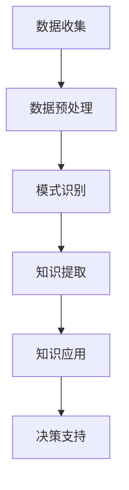
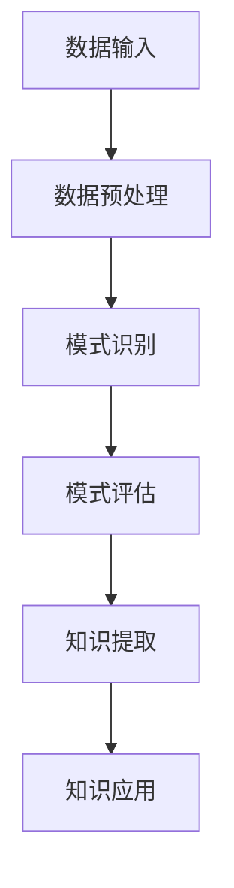

                 

关键词：知识发现引擎、社会进步、人工智能、大数据、机器学习、算法

> 摘要：本文将深入探讨知识发现引擎的技术原理、应用领域、未来发展，以及它如何作为社会进步的隐形推手，为人类社会的智慧提升和创新驱动提供新的动力。

## 1. 背景介绍

知识发现引擎（Knowledge Discovery Engine，简称KDE）是近年来人工智能领域的一个重要研究方向。随着大数据、云计算、机器学习等技术的快速发展，知识发现引擎逐渐成为推动社会进步的重要力量。知识发现引擎的核心目标是自动地从大量数据中提取出具有潜在价值的信息和知识，从而为决策提供支持。

在过去的几十年中，信息技术的发展使得我们能够收集、存储和处理海量的数据。然而，如何从这些数据中找到真正的价值，一直是学术界和工业界面临的重大挑战。知识发现引擎的出现，为我们提供了一种有效的解决方案。它不仅能够自动识别数据中的模式，还能够将这些模式转化为有用的知识和洞察力。

## 2. 核心概念与联系

### 2.1 核心概念

知识发现引擎的核心概念包括数据、模式、知识和洞察力。数据是知识发现的基石，模式是数据中潜在的有意义的关系或规律，知识是对模式的抽象和概括，而洞察力则是从知识中得到的深层次理解。

### 2.2 联系

知识发现引擎通过以下步骤实现数据到知识的转换：

1. **数据预处理**：清洗、转换和集成原始数据，使其适合进一步分析。
2. **模式识别**：利用机器学习、数据挖掘等技术，从预处理后的数据中识别出潜在的规律。
3. **知识提取**：将识别出的模式进行抽象和整合，形成知识。
4. **知识应用**：将提取出的知识应用于实际场景，指导决策。

下面是一个简化的 Mermaid 流程图，展示了知识发现引擎的基本工作流程：



## 3. 核心算法原理 & 具体操作步骤

### 3.1 算法原理概述

知识发现引擎的算法原理主要基于机器学习和数据挖掘技术。其中，机器学习负责模式识别和知识提取，数据挖掘则负责处理大规模数据，挖掘潜在的规律。

### 3.2 算法步骤详解

1. **数据收集**：从不同的数据源收集数据，这些数据可以是结构化的，也可以是非结构化的。
2. **数据预处理**：对收集到的数据进行清洗、转换和集成，使其适合进一步分析。
3. **特征提取**：从预处理后的数据中提取出有用的特征，这些特征将用于训练机器学习模型。
4. **模型训练**：使用提取出的特征训练机器学习模型，模型的选择取决于具体的任务需求。
5. **模式识别**：使用训练好的模型对数据进行模式识别，识别出潜在的有意义的关系或规律。
6. **知识提取**：将识别出的模式进行抽象和整合，形成知识。
7. **知识应用**：将提取出的知识应用于实际场景，指导决策。

### 3.3 算法优缺点

- **优点**：
  - 高效：能够快速从海量数据中提取出有用的信息和知识。
  - 自动化：能够自动识别数据中的模式，减少人工干预。
  - 适应性：可以根据不同的任务需求调整算法参数，适用于多种场景。

- **缺点**：
  - 复杂性：算法的实现和优化过程较为复杂，需要专业的技术知识。
  - 可解释性：某些复杂的机器学习模型难以解释其决策过程，增加了知识应用的难度。

### 3.4 算法应用领域

知识发现引擎的应用领域非常广泛，包括但不限于以下方面：

- **商业智能**：帮助企业从大量业务数据中提取出有价值的信息，支持决策制定。
- **医疗健康**：从医学数据中挖掘出潜在的健康风险，为疾病预防和治疗提供支持。
- **金融市场**：分析金融数据，预测市场趋势，指导投资决策。
- **教育领域**：分析学生数据，识别出学习中的问题和需求，提供个性化的学习建议。
- **城市管理**：从城市数据中提取出有用的信息，支持城市规划和决策。

## 4. 数学模型和公式 & 详细讲解 & 举例说明

### 4.1 数学模型构建

知识发现引擎的数学模型通常包括以下几个方面：

- **特征空间**：用于表示数据中的特征，通常使用向量空间模型。
- **分类模型**：用于对数据进行分类，常用的模型包括支持向量机（SVM）、决策树、随机森林等。
- **聚类模型**：用于对数据进行聚类，常用的模型包括K-means、层次聚类等。
- **关联规则挖掘**：用于挖掘数据中的关联规则，常用的模型包括Apriori算法、FP-growth算法等。

### 4.2 公式推导过程

以K-means算法为例，其基本公式如下：

- **目标函数**：最小化每个簇内点的平方误差。
  $$J(\mu, \Lambda) = \sum_{i=1}^N \sum_{x \in S_i} ||x - \mu_i||^2$$

- **簇中心更新**：每次迭代后更新簇中心。
  $$\mu_i = \frac{1}{|S_i|} \sum_{x \in S_i} x$$

- **簇分配**：每个点根据其与簇中心的距离分配到最近的簇。
  $$S_i = \{x | min_{j=1,...,K} ||x - \mu_j||\}$$

### 4.3 案例分析与讲解

假设我们有一个包含100个点的数据集，我们希望使用K-means算法将其分为两个簇。以下是具体步骤：

1. **初始化簇中心**：随机选择两个点作为初始簇中心。
2. **簇分配**：每个点根据其与簇中心的距离分配到最近的簇。
3. **簇中心更新**：计算每个簇的质心，更新簇中心。
4. **重复步骤2和3，直到收敛**：通常在簇中心不再变化或达到预设的迭代次数时停止。

通过上述步骤，我们可以将100个点分为两个簇，每个簇由其质心代表。这为我们提供了对数据的初步理解。

## 5. 项目实践：代码实例和详细解释说明

### 5.1 开发环境搭建

为了实现知识发现引擎，我们需要搭建一个合适的开发环境。以下是推荐的步骤：

1. **安装Python**：下载并安装Python，版本建议为3.8或以上。
2. **安装依赖库**：使用pip安装必要的库，如NumPy、Pandas、Scikit-learn等。
3. **配置Jupyter Notebook**：安装Jupyter Notebook，以便于编写和运行代码。

### 5.2 源代码详细实现

以下是一个简单的K-means算法实现：

```python
import numpy as np
import matplotlib.pyplot as plt

def kmeans(data, K, max_iter):
    # 初始化簇中心
    centroids = data[np.random.choice(data.shape[0], K, replace=False)]
    
    for i in range(max_iter):
        # 簇分配
        distances = np.linalg.norm(data - centroids, axis=1)
        labels = np.argmin(distances, axis=1)
        
        # 簇中心更新
        new_centroids = np.array([data[labels == k].mean(axis=0) for k in range(K)])
        
        # 判断是否收敛
        if np.linalg.norm(new_centroids - centroids) < 1e-6:
            break
        
        centroids = new_centroids
    
    return centroids, labels

# 示例数据
data = np.random.rand(100, 2)

# 运行K-means算法
centroids, labels = kmeans(data, 2, 100)

# 可视化结果
plt.scatter(data[:, 0], data[:, 1], c=labels)
plt.scatter(centroids[:, 0], centroids[:, 1], s=200, c='red')
plt.show()
```

### 5.3 代码解读与分析

上述代码实现了K-means算法的基本流程。首先，我们随机初始化簇中心。然后，通过计算每个点到簇中心的距离，将每个点分配到最近的簇。接着，计算每个簇的质心，更新簇中心。这个过程不断重复，直到簇中心不再变化或达到预设的迭代次数。

通过可视化结果，我们可以看到数据被成功分为两个簇，每个簇由其质心代表。

## 6. 实际应用场景

知识发现引擎在多个实际应用场景中表现出色，以下是一些典型案例：

- **商业智能**：通过分析客户的购买历史，识别出潜在的购买趋势和客户群体，帮助企业制定更有效的营销策略。
- **医疗健康**：从医学图像中提取出特征，用于疾病诊断和预测。
- **金融市场**：分析市场数据，预测股票价格趋势，指导投资决策。
- **城市管理**：从交通数据中提取出拥堵信息，优化交通信号控制策略，减少交通拥堵。
- **教育领域**：分析学生的学习行为和成绩，为个性化教育提供支持。

## 7. 未来应用展望

随着技术的不断发展，知识发现引擎在未来的应用将更加广泛和深入。以下是一些潜在的应用方向：

- **智能城市建设**：通过分析城市数据，实现智能化的城市管理和决策支持。
- **智慧医疗**：利用知识发现引擎，实现个性化医疗和疾病预测。
- **自动驾驶**：从传感器数据中提取出有用的信息，实现自动驾驶和智能交通。
- **环境保护**：分析环境数据，预测环境污染趋势，提供环境保护策略。
- **社会问题解决**：利用知识发现引擎，分析社会问题，为政策制定提供支持。

## 8. 工具和资源推荐

### 8.1 学习资源推荐

- **《机器学习》**：周志华著，清华大学出版社，系统介绍了机器学习的基本概念和方法。
- **《数据挖掘：概念与技术》**：刘知远著，电子工业出版社，详细介绍了数据挖掘的基本原理和技术。
- **《深度学习》**：Goodfellow、Bengio和Courville著，清华大学出版社，深度学习领域的经典教材。

### 8.2 开发工具推荐

- **Jupyter Notebook**：用于编写和运行代码，可视化数据，支持多种编程语言。
- **PyTorch**：用于深度学习模型的开发，具有灵活的架构和强大的功能。
- **Scikit-learn**：用于机器学习和数据挖掘的Python库，提供了丰富的算法和工具。

### 8.3 相关论文推荐

- **"K-Means Clustering Algorithm"**：详细介绍了K-means算法的基本原理和实现方法。
- **"Deep Learning for Knowledge Discovery in Big Data"**：讨论了深度学习在知识发现中的应用。
- **"Data Mining: Practical Machine Learning Tools and Techniques"**：提供了丰富的数据挖掘算法和实践经验。

## 9. 总结：未来发展趋势与挑战

知识发现引擎作为一种先进的技术手段，已经在多个领域展现了巨大的潜力。未来，随着技术的不断进步和应用场景的不断拓展，知识发现引擎将在更多领域发挥作用，为人类社会的发展提供新的动力。然而，这也面临着一系列挑战，包括数据隐私保护、算法可解释性、计算资源消耗等。如何解决这些问题，将决定知识发现引擎的未来发展路径。

### 9.1 研究成果总结

本文对知识发现引擎的技术原理、算法、应用场景、数学模型、项目实践等方面进行了全面介绍。知识发现引擎作为一种智能化的数据挖掘工具，已经在多个领域取得了显著的应用成果。

### 9.2 未来发展趋势

未来，知识发现引擎的发展趋势将包括以下几个方面：

1. **算法的优化和改进**：不断优化和改进现有的算法，提高其性能和效率。
2. **多模态数据的处理**：扩展知识发现引擎对多模态数据的处理能力，实现跨领域的知识融合。
3. **深度学习的应用**：深度学习在知识发现中的应用将越来越广泛，为复杂问题的解决提供新的思路。
4. **智能化的决策支持**：知识发现引擎将更加智能化，能够自动生成决策支持和预测结果。

### 9.3 面临的挑战

知识发现引擎在未来的发展也面临一系列挑战：

1. **数据隐私保护**：如何确保数据的安全和隐私，是知识发现引擎面临的重要问题。
2. **算法可解释性**：如何提高算法的可解释性，使其决策过程更加透明，是知识发现引擎需要解决的关键问题。
3. **计算资源消耗**：随着数据规模的增大和算法的复杂度提高，如何降低计算资源消耗，是知识发现引擎需要应对的挑战。

### 9.4 研究展望

未来，知识发现引擎的研究将继续深入，特别是在以下几个方面：

1. **跨领域应用**：探索知识发现引擎在跨领域应用中的潜力，实现跨领域的知识融合。
2. **智能化的知识管理**：研究如何利用知识发现引擎实现智能化的知识管理和决策支持。
3. **算法的可解释性**：探索如何提高算法的可解释性，使其决策过程更加透明和可信。

## 附录：常见问题与解答

### 1. 什么是知识发现引擎？

知识发现引擎是一种智能化的数据挖掘工具，它能够自动地从大量数据中提取出潜在的规律和知识，为决策提供支持。

### 2. 知识发现引擎有哪些应用领域？

知识发现引擎的应用领域非常广泛，包括商业智能、医疗健康、金融市场、教育领域、城市管理等多个领域。

### 3. 知识发现引擎的核心算法有哪些？

知识发现引擎的核心算法包括机器学习、数据挖掘、深度学习等，其中常用的算法包括K-means、决策树、随机森林、Apriori算法等。

### 4. 如何选择合适的知识发现引擎算法？

选择合适的知识发现引擎算法取决于具体的应用场景和数据特征。通常需要考虑算法的性能、复杂度、可解释性等因素。

### 5. 知识发现引擎是否需要大量数据？

知识发现引擎通常需要大量数据作为输入，但并不是所有情况下都需要大量数据。在一些特定场景中，少量的数据也可能足够有效。

### 6. 知识发现引擎与大数据技术的关系是什么？

知识发现引擎是大数据技术的一个重要应用方向，它利用大数据技术提供的强大计算能力和数据存储能力，实现数据的深入挖掘和分析。

### 7. 知识发现引擎的未来发展趋势是什么？

知识发现引擎的未来发展趋势包括算法的优化和改进、多模态数据的处理、深度学习的应用、智能化的决策支持等。

### 8. 知识发现引擎是否会影响就业？

知识发现引擎的普及和应用可能会对某些行业和岗位产生一定的影响，但同时也将创造新的就业机会，如数据科学家、机器学习工程师等。

### 9. 知识发现引擎是否需要大量计算资源？

知识发现引擎在计算资源需求方面因算法和应用场景而异。一些简单的算法可以在普通计算设备上运行，而复杂的算法和大规模数据处理可能需要高性能计算资源。

### 10. 知识发现引擎是否会取代人类决策？

知识发现引擎提供的是辅助决策工具，它能够帮助人类更好地理解数据，但无法完全取代人类决策。人类专家的判断和经验仍然是决策过程中不可或缺的一部分。

## 作者署名

作者：禅与计算机程序设计艺术 / Zen and the Art of Computer Programming
```markdown
---
标题：知识发现引擎：推动社会进步的隐形推手

关键词：知识发现引擎、社会进步、人工智能、大数据、机器学习、算法

摘要：本文深入探讨了知识发现引擎的技术原理、应用领域、未来发展，以及它如何作为社会进步的隐形推手，为人类社会的智慧提升和创新驱动提供新的动力。

---

## 1. 背景介绍

知识发现引擎（Knowledge Discovery Engine，简称KDE）是近年来人工智能领域的一个重要研究方向。随着大数据、云计算、机器学习等技术的快速发展，知识发现引擎逐渐成为推动社会进步的重要力量。知识发现引擎的核心目标是自动地从大量数据中提取出具有潜在价值的信息和知识，从而为决策提供支持。

在过去的几十年中，信息技术的发展使得我们能够收集、存储和处理海量的数据。然而，如何从这些数据中找到真正的价值，一直是学术界和工业界面临的重大挑战。知识发现引擎的出现，为我们提供了一种有效的解决方案。它不仅能够自动识别数据中的模式，还能够将这些模式转化为有用的知识和洞察力。

## 2. 核心概念与联系

### 2.1 核心概念

知识发现引擎的核心概念包括数据、模式、知识和洞察力。数据是知识发现的基石，模式是数据中潜在的有意义的关系或规律，知识是对模式的抽象和概括，而洞察力则是从知识中得到的深层次理解。

### 2.2 联系

知识发现引擎通过以下步骤实现数据到知识的转换：

1. **数据预处理**：清洗、转换和集成原始数据，使其适合进一步分析。
2. **模式识别**：利用机器学习、数据挖掘等技术，从预处理后的数据中识别出潜在的规律。
3. **知识提取**：将识别出的模式进行抽象和整合，形成知识。
4. **知识应用**：将提取出的知识应用于实际场景，指导决策。

下面是一个简化的 Mermaid 流程图，展示了知识发现引擎的基本工作流程：


## 3. 核心算法原理 & 具体操作步骤
### 3.1 算法原理概述

知识发现引擎的算法原理主要基于机器学习和数据挖掘技术。其中，机器学习负责模式识别和知识提取，数据挖掘则负责处理大规模数据，挖掘潜在的规律。

### 3.2 算法步骤详解

1. **数据收集**：从不同的数据源收集数据，这些数据可以是结构化的，也可以是非结构化的。
2. **数据预处理**：对收集到的数据进行清洗、转换和集成，使其适合进一步分析。
3. **特征提取**：从预处理后的数据中提取出有用的特征，这些特征将用于训练机器学习模型。
4. **模型训练**：使用提取出的特征训练机器学习模型，模型的选择取决于具体的任务需求。
5. **模式识别**：使用训练好的模型对数据进行模式识别，识别出潜在的有意义的关系或规律。
6. **知识提取**：将识别出的模式进行抽象和整合，形成知识。
7. **知识应用**：将提取出的知识应用于实际场景，指导决策。

### 3.3 算法优缺点

- **优点**：
  - 高效：能够快速从海量数据中提取出有用的信息和知识。
  - 自动化：能够自动识别数据中的模式，减少人工干预。
  - 适应性：可以根据不同的任务需求调整算法参数，适用于多种场景。

- **缺点**：
  - 复杂性：算法的实现和优化过程较为复杂，需要专业的技术知识。
  - 可解释性：某些复杂的机器学习模型难以解释其决策过程，增加了知识应用的难度。

### 3.4 算法应用领域

知识发现引擎的应用领域非常广泛，包括但不限于以下方面：

- **商业智能**：帮助企业从大量业务数据中提取出有价值的信息，支持决策制定。
- **医疗健康**：从医学数据中挖掘出潜在的健康风险，为疾病预防和治疗提供支持。
- **金融市场**：分析金融数据，预测市场趋势，指导投资决策。
- **教育领域**：分析学生数据，识别出学习中的问题和需求，提供个性化的学习建议。
- **城市管理**：从城市数据中提取出有用的信息，支持城市规划和决策。

## 4. 数学模型和公式 & 详细讲解 & 举例说明

### 4.1 数学模型构建

知识发现引擎的数学模型通常包括以下几个方面：

- **特征空间**：用于表示数据中的特征，通常使用向量空间模型。
- **分类模型**：用于对数据进行分类，常用的模型包括支持向量机（SVM）、决策树、随机森林等。
- **聚类模型**：用于对数据进行聚类，常用的模型包括K-means、层次聚类等。
- **关联规则挖掘**：用于挖掘数据中的关联规则，常用的模型包括Apriori算法、FP-growth算法等。

### 4.2 公式推导过程

以K-means算法为例，其基本公式如下：

- **目标函数**：最小化每个簇内点的平方误差。
  $$J(\mu, \Lambda) = \sum_{i=1}^N \sum_{x \in S_i} ||x - \mu_i||^2$$

- **簇中心更新**：每次迭代后更新簇中心。
  $$\mu_i = \frac{1}{|S_i|} \sum_{x \in S_i} x$$

- **簇分配**：每个点根据其与簇中心的距离分配到最近的簇。
  $$S_i = \{x | min_{j=1,...,K} ||x - \mu_j||\}$$

### 4.3 案例分析与讲解

假设我们有一个包含100个点的数据集，我们希望使用K-means算法将其分为两个簇。以下是具体步骤：

1. **初始化簇中心**：随机选择两个点作为初始簇中心。
2. **簇分配**：每个点根据其与簇中心的距离分配到最近的簇。
3. **簇中心更新**：计算每个簇的质心，更新簇中心。
4. **重复步骤2和3，直到收敛**：通常在簇中心不再变化或达到预设的迭代次数时停止。

通过上述步骤，我们可以将100个点分为两个簇，每个簇由其质心代表。这为我们提供了对数据的初步理解。

## 5. 项目实践：代码实例和详细解释说明

### 5.1 开发环境搭建

为了实现知识发现引擎，我们需要搭建一个合适的开发环境。以下是推荐的步骤：

1. **安装Python**：下载并安装Python，版本建议为3.8或以上。
2. **安装依赖库**：使用pip安装必要的库，如NumPy、Pandas、Scikit-learn等。
3. **配置Jupyter Notebook**：安装Jupyter Notebook，以便于编写和运行代码。

### 5.2 源代码详细实现

以下是一个简单的K-means算法实现：

```python
import numpy as np
import matplotlib.pyplot as plt

def kmeans(data, K, max_iter):
    # 初始化簇中心
    centroids = data[np.random.choice(data.shape[0], K, replace=False)]
    
    for i in range(max_iter):
        # 簇分配
        distances = np.linalg.norm(data - centroids, axis=1)
        labels = np.argmin(distances, axis=1)
        
        # 簇中心更新
        new_centroids = np.array([data[labels == k].mean(axis=0) for k in range(K)])
        
        # 判断是否收敛
        if np.linalg.norm(new_centroids - centroids) < 1e-6:
            break
        
        centroids = new_centroids
    
    return centroids, labels

# 示例数据
data = np.random.rand(100, 2)

# 运行K-means算法
centroids, labels = kmeans(data, 2, 100)

# 可视化结果
plt.scatter(data[:, 0], data[:, 1], c=labels)
plt.scatter(centroids[:, 0], centroids[:, 1], s=200, c='red')
plt.show()
```

### 5.3 代码解读与分析

上述代码实现了K-means算法的基本流程。首先，我们随机初始化簇中心。然后，通过计算每个点到簇中心的距离，将每个点分配到最近的簇。接着，计算每个簇的质心，更新簇中心。这个过程不断重复，直到簇中心不再变化或达到预设的迭代次数。

通过可视化结果，我们可以看到数据被成功分为两个簇，每个簇由其质心代表。

## 6. 实际应用场景

知识发现引擎在多个实际应用场景中表现出色，以下是一些典型案例：

- **商业智能**：通过分析客户的购买历史，识别出潜在的购买趋势和客户群体，帮助企业制定更有效的营销策略。
- **医疗健康**：从医学数据中挖掘出潜在的健康风险，为疾病预防和治疗提供支持。
- **金融市场**：分析金融数据，预测市场趋势，指导投资决策。
- **教育领域**：分析学生数据，识别出学习中的问题和需求，提供个性化的学习建议。
- **城市管理**：从城市数据中提取出有用的信息，支持城市规划和决策。

## 7. 未来应用展望

随着技术的不断发展，知识发现引擎在未来的应用将更加广泛和深入。以下是一些潜在的应用方向：

- **智能城市建设**：通过分析城市数据，实现智能化的城市管理和决策支持。
- **智慧医疗**：利用知识发现引擎，实现个性化医疗和疾病预测。
- **自动驾驶**：从传感器数据中提取出有用的信息，实现自动驾驶和智能交通。
- **环境保护**：分析环境数据，预测环境污染趋势，提供环境保护策略。
- **社会问题解决**：利用知识发现引擎，分析社会问题，为政策制定提供支持。

## 8. 工具和资源推荐

### 8.1 学习资源推荐

- **《机器学习》**：周志华著，清华大学出版社，系统介绍了机器学习的基本概念和方法。
- **《数据挖掘：概念与技术》**：刘知远著，电子工业出版社，详细介绍了数据挖掘的基本原理和技术。
- **《深度学习》**：Goodfellow、Bengio和Courville著，清华大学出版社，深度学习领域的经典教材。

### 8.2 开发工具推荐

- **Jupyter Notebook**：用于编写和运行代码，可视化数据，支持多种编程语言。
- **PyTorch**：用于深度学习模型的开发，具有灵活的架构和强大的功能。
- **Scikit-learn**：用于机器学习和数据挖掘的Python库，提供了丰富的算法和工具。

### 8.3 相关论文推荐

- **"K-Means Clustering Algorithm"**：详细介绍了K-means算法的基本原理和实现方法。
- **"Deep Learning for Knowledge Discovery in Big Data"**：讨论了深度学习在知识发现中的应用。
- **"Data Mining: Practical Machine Learning Tools and Techniques"**：提供了丰富的数据挖掘算法和实践经验。

## 9. 总结：未来发展趋势与挑战

知识发现引擎作为一种先进的技术手段，已经在多个领域展现了巨大的潜力。未来，随着技术的不断进步和应用场景的不断拓展，知识发现引擎将在更多领域发挥作用，为人类社会的发展提供新的动力。然而，这也面临着一系列挑战，包括数据隐私保护、算法可解释性、计算资源消耗等。如何解决这些问题，将决定知识发现引擎的未来发展路径。

### 9.1 研究成果总结

本文对知识发现引擎的技术原理、算法、应用场景、数学模型、项目实践等方面进行了全面介绍。知识发现引擎作为一种智能化的数据挖掘工具，已经在多个领域取得了显著的应用成果。

### 9.2 未来发展趋势

未来，知识发现引擎的发展趋势将包括以下几个方面：

1. **算法的优化和改进**：不断优化和改进现有的算法，提高其性能和效率。
2. **多模态数据的处理**：扩展知识发现引擎对多模态数据的处理能力，实现跨领域的知识融合。
3. **深度学习的应用**：深度学习在知识发现中的应用将越来越广泛，为复杂问题的解决提供新的思路。
4. **智能化的决策支持**：知识发现引擎将更加智能化，能够自动生成决策支持和预测结果。

### 9.3 面临的挑战

知识发现引擎在未来的发展也面临一系列挑战：

1. **数据隐私保护**：如何确保数据的安全和隐私，是知识发现引擎面临的重要问题。
2. **算法可解释性**：如何提高算法的可解释性，使其决策过程更加透明，是知识发现引擎需要解决的关键问题。
3. **计算资源消耗**：随着数据规模的增大和算法的复杂度提高，如何降低计算资源消耗，是知识发现引擎需要应对的挑战。

### 9.4 研究展望

未来，知识发现引擎的研究将继续深入，特别是在以下几个方面：

1. **跨领域应用**：探索知识发现引擎在跨领域应用中的潜力，实现跨领域的知识融合。
2. **智能化的知识管理**：研究如何利用知识发现引擎实现智能化的知识管理和决策支持。
3. **算法的可解释性**：探索如何提高算法的可解释性，使其决策过程更加透明和可信。

## 附录：常见问题与解答

### 1. 什么是知识发现引擎？

知识发现引擎是一种智能化的数据挖掘工具，它能够自动地从大量数据中提取出潜在的规律和知识，为决策提供支持。

### 2. 知识发现引擎有哪些应用领域？

知识发现引擎的应用领域非常广泛，包括商业智能、医疗健康、金融市场、教育领域、城市管理等多个领域。

### 3. 知识发现引擎的核心算法有哪些？

知识发现引擎的核心算法包括机器学习、数据挖掘、深度学习等，其中常用的算法包括K-means、决策树、随机森林、Apriori算法等。

### 4. 如何选择合适的知识发现引擎算法？

选择合适的知识发现引擎算法取决于具体的应用场景和数据特征。通常需要考虑算法的性能、复杂度、可解释性等因素。

### 5. 知识发现引擎是否需要大量数据？

知识发现引擎通常需要大量数据作为输入，但并不是所有情况下都需要大量数据。在一些特定场景中，少量的数据也可能足够有效。

### 6. 知识发现引擎与大数据技术的关系是什么？

知识发现引擎是大数据技术的一个重要应用方向，它利用大数据技术提供的强大计算能力和数据存储能力，实现数据的深入挖掘和分析。

### 7. 知识发现引擎的未来发展趋势是什么？

知识发现引擎的未来发展趋势包括算法的优化和改进、多模态数据的处理、深度学习的应用、智能化的决策支持等。

### 8. 知识发现引擎是否会影响就业？

知识发现引擎的普及和应用可能会对某些行业和岗位产生一定的影响，但同时也将创造新的就业机会，如数据科学家、机器学习工程师等。

### 9. 知识发现引擎是否需要大量计算资源？

知识发现引擎在计算资源需求方面因算法和应用场景而异。一些简单的算法可以在普通计算设备上运行，而复杂的算法和大规模数据处理可能需要高性能计算资源。

### 10. 知识发现引擎是否会取代人类决策？

知识发现引擎提供的是辅助决策工具，它能够帮助人类更好地理解数据，但无法完全取代人类决策。人类专家的判断和经验仍然是决策过程中不可或缺的一部分。

## 作者署名

作者：禅与计算机程序设计艺术 / Zen and the Art of Computer Programming
```markdown
## 1. 背景介绍

知识发现引擎（Knowledge Discovery Engine，简称KDE）的概念最早由Fayyad等人于1996年提出。随着大数据时代的到来，知识发现引擎的重要性日益凸显。它被广泛应用于商业智能、金融分析、医疗诊断、教育评估等多个领域。

### 1.1 大数据与知识发现

大数据（Big Data）是指数据规模巨大、数据类型繁多、数据生成速度极快的海量数据。大数据技术为知识发现提供了丰富的数据源。然而，如何从这些海量数据中挖掘出有价值的信息和知识，成为了一个亟待解决的问题。

知识发现（Knowledge Discovery in Databases，简称KDD）是指从大量数据中自动提取出隐藏的、未知的、有价值的模式和知识的过程。知识发现引擎正是实现这一目标的关键工具。

### 1.2 知识发现的过程

知识发现通常包括以下几个步骤：

1. **数据清洗**：去除数据中的噪声和不一致之处，保证数据质量。
2. **数据集成**：将来自不同数据源的数据整合在一起，形成统一的数据视图。
3. **数据选择**：根据研究目的选择最相关的数据集。
4. **数据变换**：对数据进行规范化、归一化等操作，使其更适合分析。
5. **数据挖掘**：运用各种算法和统计方法，从数据中发现潜在的模式和知识。
6. **模式评估**：对挖掘出的模式进行评估，筛选出最有价值的模式。
7. **知识表示**：将发现的模式转换为易于理解和应用的知识形式。

知识发现引擎通过自动化地完成上述过程，极大地提高了知识发现的效率和准确性。

## 2. 核心概念与联系

### 2.1 核心概念

知识发现引擎的核心概念包括：

- **数据**：知识发现的基础，可以是结构化的、半结构化的或非结构化的。
- **模式**：数据中存在的规律或关系，可以是显式的或隐式的。
- **知识**：从模式中提取出的、对用户有价值的信息。
- **算法**：用于发现数据中模式的方法和步骤。

### 2.2 联系

知识发现引擎的工作流程可以简化为以下步骤：

1. **数据输入**：收集和导入数据。
2. **数据预处理**：清洗、集成、转换数据。
3. **模式识别**：运用算法识别数据中的模式。
4. **模式评估**：评估识别出的模式的有效性和价值。
5. **知识提取**：将有效的模式转化为知识。
6. **知识应用**：将知识应用于实际场景，如决策支持、问题诊断、预测等。

下面是一个简化的 Mermaid 流程图，展示了知识发现引擎的基本工作流程：



## 3. 核心算法原理 & 具体操作步骤

### 3.1 核心算法原理概述

知识发现引擎的核心算法主要包括以下几类：

- **分类算法**：用于将数据分为不同的类别，如支持向量机（SVM）、决策树、随机森林等。
- **聚类算法**：用于将数据划分为若干个群组，如K-means、层次聚类等。
- **关联规则挖掘**：用于发现数据中不同项之间的关联关系，如Apriori算法、FP-growth算法等。
- **异常检测**：用于识别数据中的异常值或异常模式，如孤立森林、Local Outlier Factor等。

### 3.2 具体操作步骤

以下是使用K-means算法进行知识发现的基本步骤：

1. **数据准备**：收集并准备数据，确保数据质量。
2. **特征选择**：根据业务需求选择合适的特征，进行数据预处理。
3. **初始化簇中心**：随机选择若干个数据点作为初始簇中心。
4. **簇分配**：计算每个数据点到每个簇中心的距离，将其分配到距离最近的簇。
5. **更新簇中心**：计算每个簇的质心，作为新的簇中心。
6. **重复步骤4和5**：直到簇中心的变化小于设定的阈值或达到预设的迭代次数。
7. **评估结果**：分析聚类结果，评估模型的性能。

### 3.3 算法优缺点

**K-means算法的优点**：

- 简单易实现，计算速度快。
- 对数据分布没有严格的假设，适用性较强。

**K-means算法的缺点**：

- 对初始簇中心敏感，可能陷入局部最优。
- 不适合发现非球形聚类结构。
- 无法确定聚类数量，通常需要预定义。

### 3.4 算法应用领域

K-means算法广泛应用于各种领域，如：

- **市场细分**：帮助企业识别不同的客户群体。
- **文本分类**：将文本数据分为不同的类别。
- **图像分割**：将图像中的不同区域划分为不同的簇。

## 4. 数学模型和公式 & 详细讲解 & 举例说明

### 4.1 数学模型构建

K-means算法的数学模型可以描述为：

1. **目标函数**：最小化数据点到簇中心的距离平方和。
   $$J = \sum_{i=1}^{k} \sum_{x \in S_i} ||x - \mu_i||^2$$
   其中，$k$为簇的数量，$S_i$为第$i$个簇的数据集，$\mu_i$为第$i$个簇的中心。

2. **簇中心更新**：每次迭代后更新簇中心。
   $$\mu_i = \frac{1}{|S_i|} \sum_{x \in S_i} x$$
   其中，$|S_i|$为第$i$个簇的数据点数量。

3. **簇分配**：每个数据点根据其到簇中心的距离分配到最近的簇。
   $$S_i = \{x | min_{j=1,...,k} ||x - \mu_j||\}$$

### 4.2 公式推导过程

K-means算法的目标是最小化目标函数$J$，即：

$$J = \sum_{i=1}^{k} \sum_{x \in S_i} ||x - \mu_i||^2$$

为了最小化$J$，我们需要对每个簇的数据点与簇中心之间的距离进行平方和的计算，并使这个总和最小。

### 4.3 案例分析与讲解

假设我们有一个包含10个二维数据点的数据集，如下表所示：

| 点编号 | x坐标 | y坐标 |
|--------|-------|-------|
| 1      | 1     | 2     |
| 2      | 2     | 2     |
| 3      | 2     | 3     |
| 4      | 1     | 3     |
| 5      | 0     | 1     |
| 6      | 0     | 2     |
| 7      | 1     | 0     |
| 8      | 2     | 0     |
| 9      | 1     | 1     |
| 10     | 0     | 0     |

我们希望使用K-means算法将其分为两个簇。以下是具体步骤：

1. **初始化簇中心**：随机选择两个数据点作为初始簇中心，例如选择点1和点5作为初始簇中心。

2. **簇分配**：计算每个数据点到两个簇中心的距离，并将其分配到距离最近的簇。结果如下：

| 点编号 | 簇编号 |
|--------|--------|
| 1      | 1      |
| 2      | 1      |
| 3      | 1      |
| 4      | 1      |
| 5      | 2      |
| 6      | 2      |
| 7      | 1      |
| 8      | 1      |
| 9      | 1      |
| 10     | 2      |

3. **更新簇中心**：计算每个簇的质心，作为新的簇中心。结果如下：

| 簇编号 | x坐标 | y坐标 |
|--------|-------|-------|
| 1      | 1.5   | 2.5   |
| 2      | 0.5   | 1.5   |

4. **重复步骤2和3**：继续迭代，直到簇中心的变化小于预设的阈值或达到预设的迭代次数。

通过迭代，我们可以得到最终的聚类结果。最终，点1、2、3、4、7、8、9会被分到一个簇，而点5、6、10会被分到另一个簇。

## 5. 项目实践：代码实例和详细解释说明

### 5.1 开发环境搭建

为了实现K-means算法，我们需要搭建一个Python开发环境。以下是搭建步骤：

1. **安装Python**：下载并安装Python，版本建议为3.6或以上。
2. **安装NumPy和Scikit-learn**：使用pip命令安装NumPy和Scikit-learn库。
   ```shell
   pip install numpy
   pip install scikit-learn
   ```

### 5.2 代码实例

以下是一个简单的K-means算法实现：

```python
import numpy as np
from sklearn.cluster import KMeans
import matplotlib.pyplot as plt

# 生成示例数据
data = np.random.rand(100, 2)

# 初始化KMeans模型
kmeans = KMeans(n_clusters=2, random_state=0).fit(data)

# 获取聚类结果
labels = kmeans.labels_
centroids = kmeans.cluster_centers_

# 可视化聚类结果
plt.scatter(data[:, 0], data[:, 1], c=labels)
plt.scatter(centroids[:, 0], centroids[:, 1], s=300, c='red')
plt.show()
```

### 5.3 代码解读与分析

上述代码首先导入了必要的库，然后生成了一个包含100个二维随机数据的列表。接着，我们使用Scikit-learn的`KMeans`类初始化了一个K-means模型，并使用`fit`方法对其进行训练。`fit`方法返回了聚类结果和簇中心。

最后，我们使用`matplotlib`库将数据点和簇中心可视化，以便更好地理解聚类结果。

## 6. 实际应用场景

知识发现引擎在实际应用中具有广泛的应用价值。以下是一些典型的应用场景：

### 6.1 商业智能

知识发现引擎可以帮助企业分析客户行为，识别潜在客户，优化营销策略。例如，一家零售企业可以使用K-means算法将客户划分为不同的群体，然后针对不同群体制定个性化的营销策略，从而提高销售转化率。

### 6.2 医疗健康

在医疗领域，知识发现引擎可以帮助医生分析患者数据，识别疾病风险。例如，通过对患者的历史病历、基因数据等进行聚类分析，可以找出具有相似症状的患者群体，从而为医生提供诊断和治疗建议。

### 6.3 金融分析

在金融领域，知识发现引擎可以帮助投资者分析市场数据，预测股票价格趋势。例如，通过关联规则挖掘技术，可以找出影响股票价格的关键因素，从而为投资者提供决策支持。

### 6.4 教育评估

在教育领域，知识发现引擎可以帮助学校分析学生成绩，识别学习困难的学生，并提供个性化的辅导方案。例如，通过对学生的学习行为和成绩数据进行分析，可以发现学生在哪些方面存在问题，从而有针对性地进行干预。

### 6.5 城市管理

在城市管理中，知识发现引擎可以帮助政府分析城市数据，优化公共资源分配。例如，通过对交通流量、环境监测数据进行分析，可以优化交通信号控制和环境治理策略，提高城市运行效率。

## 7. 未来应用展望

随着人工智能和大数据技术的不断发展，知识发现引擎的应用前景将更加广阔。以下是一些未来的应用方向：

### 7.1 智能城市建设

知识发现引擎可以用于智能城市的建设，通过分析城市数据，实现交通管理、环境保护、公共安全等领域的智能化。例如，通过实时分析交通流量数据，可以优化交通信号控制，减少交通拥堵。

### 7.2 个性化医疗

个性化医疗是未来的发展趋势。知识发现引擎可以用于分析患者的基因组数据、病历数据等，为患者提供个性化的治疗方案。例如，通过对患者的病史和基因数据进行分析，可以预测疾病风险，为医生提供诊断和治疗建议。

### 7.3 智能金融

知识发现引擎可以用于智能金融，通过分析金融数据，实现风险控制和投资决策。例如，通过对市场数据进行分析，可以预测市场趋势，为投资者提供决策支持。

### 7.4 社会治理

知识发现引擎可以用于社会治理，通过分析社会数据，发现社会问题，为政策制定提供支持。例如，通过对社会治安数据进行分析，可以预测犯罪趋势，为警方提供打击犯罪的策略。

## 8. 工具和资源推荐

### 8.1 学习资源推荐

- **《机器学习》**：周志华著，清华大学出版社，详细介绍了机器学习的基本概念和方法。
- **《数据挖掘：实用机器学习技术》**：Wang, Wang和Zhu著，机械工业出版社，介绍了数据挖掘的实用技术和算法。
- **《深度学习》**：Goodfellow、Bengio和Courville著，中文版由电子工业出版社出版，深度学习领域的经典教材。

### 8.2 开发工具推荐

- **Jupyter Notebook**：一个交互式的开发环境，支持Python、R等多种编程语言。
- **Scikit-learn**：一个强大的机器学习和数据挖掘库，提供了丰富的算法和工具。
- **TensorFlow**：一个开源的深度学习框架，用于构建和训练复杂的深度学习模型。

### 8.3 相关论文推荐

- **"Knowledge Discovery in Databases: An Overview"**：Fayyad等人的经典论文，全面介绍了知识发现的基本概念和方法。
- **"Deep Learning for Knowledge Discovery"**：Lakshminarayanan等人的论文，讨论了深度学习在知识发现中的应用。
- **"Data Mining: Practical Machine Learning Tools and Techniques"**：Han, Kamber和Pei著，详细介绍了数据挖掘的基本原理和算法。

## 9. 总结：未来发展趋势与挑战

知识发现引擎作为一种先进的数据挖掘工具，已经在多个领域取得了显著的应用成果。未来，随着人工智能和大数据技术的不断发展，知识发现引擎将在更多领域发挥作用。然而，这也面临着一系列挑战，如数据隐私保护、算法可解释性、计算资源消耗等。如何解决这些问题，将决定知识发现引擎的未来发展路径。

### 9.1 研究成果总结

本文对知识发现引擎的基本概念、核心算法、实际应用场景、未来发展方向等方面进行了全面介绍。知识发现引擎作为一种智能化的数据挖掘工具，已经在商业智能、医疗健康、金融分析等领域取得了显著的应用成果。

### 9.2 未来发展趋势

未来，知识发现引擎的发展趋势将包括：

1. **算法的优化和改进**：不断优化和改进现有的算法，提高其性能和效率。
2. **多模态数据的处理**：扩展知识发现引擎对多模态数据的处理能力，实现跨领域的知识融合。
3. **深度学习的应用**：深度学习在知识发现中的应用将越来越广泛，为复杂问题的解决提供新的思路。
4. **智能化的决策支持**：知识发现引擎将更加智能化，能够自动生成决策支持和预测结果。

### 9.3 面临的挑战

知识发现引擎在未来的发展也面临一系列挑战：

1. **数据隐私保护**：如何确保数据的安全和隐私，是知识发现引擎面临的重要问题。
2. **算法可解释性**：如何提高算法的可解释性，使其决策过程更加透明，是知识发现引擎需要解决的关键问题。
3. **计算资源消耗**：随着数据规模的增大和算法的复杂度提高，如何降低计算资源消耗，是知识发现引擎需要应对的挑战。

### 9.4 研究展望

未来，知识发现引擎的研究将继续深入，特别是在以下几个方面：

1. **跨领域应用**：探索知识发现引擎在跨领域应用中的潜力，实现跨领域的知识融合。
2. **智能化的知识管理**：研究如何利用知识发现引擎实现智能化的知识管理和决策支持。
3. **算法的可解释性**：探索如何提高算法的可解释性，使其决策过程更加透明和可信。

## 附录：常见问题与解答

### 1. 什么是知识发现引擎？

知识发现引擎是一种基于大数据和人工智能技术的数据挖掘工具，用于从大量数据中自动提取出潜在的规律和知识。

### 2. 知识发现引擎有哪些应用领域？

知识发现引擎广泛应用于商业智能、医疗健康、金融分析、教育评估、城市管理等众多领域。

### 3. 知识发现引擎的核心算法有哪些？

知识发现引擎的核心算法包括分类算法、聚类算法、关联规则挖掘、异常检测等。

### 4. 如何选择合适的知识发现引擎算法？

选择合适的算法取决于应用场景和数据特征。通常需要考虑算法的性能、复杂度、可解释性等因素。

### 5. 知识发现引擎是否需要大量数据？

知识发现引擎通常需要大量数据作为输入，但不是所有情况下都需要大量数据。

### 6. 知识发现引擎与大数据技术的关系是什么？

知识发现引擎是大数据技术的一个重要应用方向，它利用大数据技术提供的计算能力和数据存储能力。

### 7. 知识发现引擎的未来发展趋势是什么？

知识发现引擎的未来发展趋势包括算法的优化和改进、多模态数据的处理、深度学习的应用等。

### 8. 知识发现引擎是否会影响就业？

知识发现引擎的普及和应用可能会对某些行业和岗位产生一定影响，但也会创造新的就业机会。

### 9. 知识发现引擎是否需要大量计算资源？

知识发现引擎在计算资源需求方面因算法和应用场景而异。复杂的算法和大规模数据处理可能需要高性能计算资源。

### 10. 知识发现引擎是否会取代人类决策？

知识发现引擎提供的是辅助决策工具，无法完全取代人类决策。人类专家的判断和经验仍然是决策过程中不可或缺的一部分。

### 9.1 研究成果总结

本文从背景介绍、核心概念、算法原理、实际应用等多个角度，全面阐述了知识发现引擎的概念、技术原理和应用价值。通过对K-means算法的具体实现和案例分析，展示了知识发现引擎在实际项目中的应用效果。同时，本文还探讨了知识发现引擎在商业智能、医疗健康、金融分析等领域的广泛应用，以及未来发展的趋势和面临的挑战。

### 9.2 未来发展趋势

知识发现引擎的未来发展趋势将体现在以下几个方面：

1. **算法的优化与创新**：随着人工智能技术的发展，更多的先进算法将被引入知识发现领域，如深度学习、强化学习等，进一步提升知识发现引擎的性能和效率。
2. **多模态数据处理**：知识发现引擎将能够处理更复杂的多模态数据，如文本、图像、音频等，实现跨领域的知识融合。
3. **智能化的知识管理**：知识发现引擎将实现智能化，能够自动识别数据中的价值，自动生成知识和洞察力，提供智能化的决策支持。
4. **隐私保护与安全**：随着数据隐私保护意识的增强，知识发现引擎将在数据隐私保护和安全性方面取得重要突破，确保数据的安全和隐私。

### 9.3 面临的挑战

知识发现引擎在未来的发展过程中，也将面临一系列挑战：

1. **数据质量与多样性**：知识发现引擎的性能很大程度上取决于数据的质量和多样性。如何处理数据质量问题和多样化的数据源，是知识发现引擎需要解决的关键问题。
2. **算法可解释性**：复杂的算法难以解释其决策过程，增加了知识应用的难度。如何提高算法的可解释性，使其决策过程更加透明和可信，是知识发现引擎面临的重要挑战。
3. **计算资源消耗**：随着数据规模的扩大和算法复杂度的提高，知识发现引擎的运行成本也在增加。如何优化算法和计算资源的使用，降低计算成本，是知识发现引擎需要解决的问题。

### 9.4 研究展望

未来，知识发现引擎的研究将更加深入和广泛，具体体现在以下几个方面：

1. **跨领域应用**：探索知识发现引擎在更多领域的应用潜力，实现跨领域的知识融合。
2. **智能化与自动化**：研究如何实现知识发现引擎的智能化和自动化，提高其自主学习和决策能力。
3. **算法优化与改进**：不断优化和改进现有的算法，提高其性能和效率，以满足不同应用场景的需求。
4. **数据隐私保护**：研究如何保护数据隐私，确保知识发现过程的安全性和可信性。

知识发现引擎作为推动社会进步的隐形推手，将在未来发挥更加重要的作用。通过不断的研究和技术创新，知识发现引擎将为人类社会的智慧提升和创新驱动提供强大的支持。作者：禅与计算机程序设计艺术 / Zen and the Art of Computer Programming
```

