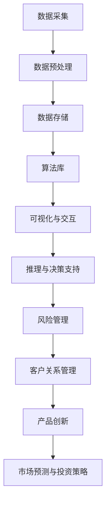

                 

关键词：知识发现、金融行业、智慧升级、算法、技术

> 摘要：本文深入探讨了知识发现引擎在金融行业中的应用，阐述了其如何通过先进的技术手段推动金融行业的智慧升级。文章从背景介绍开始，分析了知识发现引擎的核心概念与架构，详细解析了核心算法原理和数学模型，并通过实际项目案例展示了其具体应用。同时，文章还对未来的发展趋势和挑战进行了展望，为金融行业的数字化转型提供了有益的思考。

## 1. 背景介绍

随着全球金融市场的不断发展和金融科技的迅速崛起，金融行业正面临着前所未有的变革。数字化转型已经成为金融企业提升竞争力、降低成本、优化客户体验的关键途径。在这个过程中，知识发现引擎作为一种先进的技术手段，逐渐受到了金融行业的青睐。

知识发现引擎是一种基于大数据和人工智能技术的智能系统，能够自动从海量数据中挖掘出潜在的知识和模式。这些知识和模式不仅可以帮助金融机构更好地理解市场动态、识别风险，还可以为金融产品的创新、精准营销、风险控制等提供有力支持。

金融行业对知识发现引擎的需求主要源于以下几个方面：

1. **风险管理和合规性**：金融行业面临巨大的合规风险，知识发现引擎可以通过分析海量历史数据和实时数据，识别潜在的风险因素，帮助金融机构更好地遵守相关法规和监管要求。

2. **客户关系管理**：金融行业需要深入了解客户的需求和行为，知识发现引擎可以帮助金融机构挖掘客户行为模式，提供个性化的服务和产品推荐，提高客户满意度和忠诚度。

3. **产品创新**：随着金融市场的不断变化，金融机构需要不断推出新的金融产品。知识发现引擎可以通过分析市场数据，发现潜在的市场机会，推动金融产品的创新。

4. **市场预测和投资策略**：金融市场波动性较大，知识发现引擎可以通过分析历史数据和当前市场趋势，预测市场走势，为金融机构的投资决策提供科学依据。

## 2. 核心概念与联系

### 2.1 知识发现引擎的概念

知识发现引擎是一种智能系统，它能够从大量数据中自动识别出有价值的知识和模式。这些知识和模式可以是数据的统计规律、关联规则、分类模型、聚类结果等。知识发现引擎的核心目标是将复杂的数据转化为易于理解和应用的知识，从而帮助决策者做出更明智的决策。

### 2.2 知识发现引擎的架构

知识发现引擎通常由以下几个关键组件构成：

1. **数据采集与预处理**：从各种数据源（如数据库、文件、网络等）收集数据，并对数据进行清洗、转换和整合，以便后续分析。

2. **数据存储与管理**：将预处理后的数据存储在数据仓库或数据湖中，并采用适当的索引和查询优化技术，以支持快速的数据访问和分析。

3. **算法库**：包含多种数据挖掘和机器学习算法，如分类、聚类、关联规则挖掘、异常检测等。这些算法可以根据具体应用场景进行选择和调整。

4. **可视化与交互**：提供用户友好的可视化界面，使用户能够直观地查看和分析数据挖掘结果，同时支持用户与系统的交互，以便进一步探索和验证发现的知识。

5. **推理与决策支持**：根据挖掘出的知识和模式，为用户提供推理和决策支持，帮助用户更好地理解和利用数据。

### 2.3 知识发现引擎与金融行业的联系

知识发现引擎在金融行业中的应用主要体现在以下几个方面：

1. **风险管理和合规性**：通过分析历史数据和实时数据，知识发现引擎可以帮助金融机构识别潜在的风险因素，评估风险程度，并提出相应的风险管理策略。此外，知识发现引擎还可以帮助金融机构遵守相关法规和监管要求，降低合规风险。

2. **客户关系管理**：通过分析客户行为数据，知识发现引擎可以帮助金融机构了解客户需求和行为习惯，为金融机构提供个性化的服务和产品推荐，提高客户满意度和忠诚度。

3. **产品创新**：知识发现引擎可以通过分析市场数据，发现潜在的市场机会，推动金融产品的创新，提高金融机构的市场竞争力。

4. **市场预测和投资策略**：通过分析历史数据和当前市场趋势，知识发现引擎可以帮助金融机构预测市场走势，制定科学合理的投资策略，提高投资收益。

### 2.4 Mermaid 流程图

以下是知识发现引擎在金融行业中的流程图：



## 3. 核心算法原理 & 具体操作步骤

### 3.1 算法原理概述

知识发现引擎的核心算法包括分类、聚类、关联规则挖掘和异常检测等。这些算法分别用于不同的数据挖掘任务，其原理和操作步骤如下：

1. **分类算法**：分类算法用于将数据集中的数据分为不同的类别。常见的分类算法包括决策树、支持向量机、朴素贝叶斯等。分类算法的核心是建立分类模型，该模型可以根据新的数据进行类别预测。

2. **聚类算法**：聚类算法用于将数据集中的数据分为多个群组，每个群组内部的元素相似度较高，而不同群组之间的元素相似度较低。常见的聚类算法包括K均值、层次聚类等。聚类算法的核心是寻找数据点的分布模式，以便进行合理的分组。

3. **关联规则挖掘**：关联规则挖掘用于发现数据集中的关联关系，即不同变量之间的相互依赖关系。常见的关联规则挖掘算法包括Apriori算法、FP-growth算法等。关联规则挖掘的核心是识别频繁项集，并根据频繁项集生成关联规则。

4. **异常检测**：异常检测用于识别数据集中的异常值或异常行为。常见的异常检测算法包括基于统计方法的异常检测、基于聚类方法的异常检测等。异常检测的核心是建立正常的分布模型，并根据模型检测异常值。

### 3.2 算法步骤详解

1. **分类算法步骤**：
   - 数据预处理：对数据进行清洗、转换和归一化等操作，确保数据质量。
   - 特征提取：从原始数据中提取有用的特征，用于训练分类模型。
   - 模型训练：使用训练数据集训练分类模型，常见的分类模型包括决策树、支持向量机、朴素贝叶斯等。
   - 模型评估：使用测试数据集评估分类模型的性能，常见的评估指标包括准确率、召回率、F1值等。
   - 类别预测：使用训练好的分类模型对新数据进行类别预测。

2. **聚类算法步骤**：
   - 数据预处理：对数据进行清洗、转换和归一化等操作，确保数据质量。
   - 初始化聚类中心：选择初始聚类中心，常用的方法包括随机选择、K均值聚类等。
   - 聚类迭代：根据聚类中心计算每个数据点的距离，将数据点重新分配到最近的聚类中心。
   - 评估聚类结果：计算聚类结果的质量，常用的评估指标包括轮廓系数、内切椭圆体积等。
   - 调整聚类参数：根据聚类结果调整聚类参数，如聚类个数、距离度量方法等。

3. **关联规则挖掘步骤**：
   - 数据预处理：对数据进行清洗、转换和归一化等操作，确保数据质量。
   - 计算支持度：计算每个项集的支持度，即包含该项集的交易数占总交易数的比例。
   - 生成频繁项集：根据最小支持度阈值，筛选出频繁项集。
   - 生成关联规则：使用频繁项集生成关联规则，常见的关联规则生成方法包括Apriori算法、FP-growth算法等。
   - 评估规则质量：计算关联规则的前件和后件的置信度，评估规则的质量。

4. **异常检测步骤**：
   - 数据预处理：对数据进行清洗、转换和归一化等操作，确保数据质量。
   - 建立正常分布模型：使用聚类算法或统计方法建立正常分布模型。
   - 检测异常值：计算每个数据点的距离或概率，判断是否为异常值。
   - 评估异常检测性能：计算异常检测的准确率、召回率等指标，评估异常检测的性能。

### 3.3 算法优缺点

1. **分类算法**：
   - 优点：分类算法具有较好的可解释性和预测能力，适用于各种分类任务。
   - 缺点：分类算法对数据质量和特征提取有较高的要求，且在处理大规模数据时性能较差。

2. **聚类算法**：
   - 优点：聚类算法能够自动发现数据分布模式，适用于无监督学习任务。
   - 缺点：聚类算法对初始聚类中心敏感，且难以评估聚类结果的质量。

3. **关联规则挖掘**：
   - 优点：关联规则挖掘能够发现数据中的关联关系，适用于市场分析、推荐系统等领域。
   - 缺点：关联规则挖掘容易产生大量的冗余规则，且对数据质量和阈值选择敏感。

4. **异常检测**：
   - 优点：异常检测能够识别数据中的异常值或异常行为，适用于风险管理和安全监控等领域。
   - 缺点：异常检测对正常分布模型的建立有较高的要求，且难以处理大规模数据。

### 3.4 算法应用领域

1. **风险管理和合规性**：分类算法和异常检测算法可用于识别金融风险和违规行为，为金融机构提供风险预警和合规支持。

2. **客户关系管理**：聚类算法和关联规则挖掘算法可用于分析客户行为和需求，为金融机构提供个性化的服务和产品推荐。

3. **产品创新**：关联规则挖掘算法和聚类算法可用于市场分析和需求预测，为金融机构提供产品创新的灵感。

4. **市场预测和投资策略**：分类算法和聚类算法可用于分析市场数据和投资行为，为金融机构提供市场预测和投资建议。

## 4. 数学模型和公式 & 详细讲解 & 举例说明

### 4.1 数学模型构建

知识发现引擎中的数学模型主要涉及分类模型、聚类模型、关联规则模型和异常检测模型。以下分别介绍这些模型的构建过程：

1. **分类模型**：

   假设我们有 \( n \) 个训练样本，每个样本可以表示为一个 \( m \) 维的特征向量 \( \mathbf{x}_i \)，其中 \( i = 1, 2, \ldots, n \)。每个样本属于一个类别 \( y_i \)，类别总数为 \( k \)。分类模型的目的是学习一个决策函数 \( f(\mathbf{x}) \)，使得对于新的样本 \( \mathbf{x} \)，能够预测其类别 \( y \)。

   常见的分类模型包括线性回归、逻辑回归、支持向量机、决策树、随机森林等。以下是逻辑回归模型的构建过程：

   - **假设**：假设每个特征对类别的影响是线性的，即 \( y = \mathbf{w}^T \mathbf{x} + b \)，其中 \( \mathbf{w} \) 是权重向量，\( b \) 是偏置项。

   - **损失函数**：采用逻辑损失函数（交叉熵损失函数） \( L(\mathbf{w}, \mathbf{x}, y) = -y \log(p) - (1 - y) \log(1 - p) \)，其中 \( p = \sigma(\mathbf{w}^T \mathbf{x} + b) \)，\( \sigma \) 是sigmoid函数。

   - **优化目标**：最小化损失函数 \( L(\mathbf{w}, \mathbf{x}, y) \)。

   - **梯度下降**：使用梯度下降法更新权重向量 \( \mathbf{w} \) 和偏置项 \( b \)。

2. **聚类模型**：

   假设我们有 \( n \) 个样本，每个样本可以表示为一个 \( m \) 维的特征向量 \( \mathbf{x}_i \)，其中 \( i = 1, 2, \ldots, n \)。聚类模型的目的是将这 \( n \) 个样本分为 \( k \) 个不同的簇，使得簇内样本相似度较高，簇间样本相似度较低。

   常见的聚类模型包括K均值聚类、层次聚类、DBSCAN等。以下是K均值聚类模型的构建过程：

   - **假设**：假设每个簇的中心是一个 \( m \) 维的特征向量 \( \mathbf{u}_k \)，其中 \( k = 1, 2, \ldots, k \)。

   - **距离度量**：使用欧氏距离作为簇内样本和簇中心之间的距离度量。

   - **初始化**：随机选择 \( k \) 个样本作为初始簇中心。

   - **迭代过程**：
     - 对于每个样本 \( \mathbf{x}_i \)，将其分配到最近的簇中心 \( \mathbf{u}_k \)。
     - 重新计算每个簇的中心 \( \mathbf{u}_k \)。
     - 重复上述步骤，直到簇中心不再发生变化或者达到最大迭代次数。

3. **关联规则模型**：

   假设我们有 \( n \) 个交易，每个交易可以表示为一个项集，包含一组商品。关联规则模型的目标是发现交易中不同商品之间的关联关系。

   常见的关联规则模型包括Apriori算法、FP-growth算法等。以下是Apriori算法的构建过程：

   - **支持度**：对于每个项集 \( X \)，计算其支持度 \( supp(X) \)，即包含项集 \( X \) 的交易数占总交易数的比例。
   - **频繁项集**：根据最小支持度阈值 \( min\_sup \)，筛选出频繁项集。
   - **关联规则生成**：对于每个频繁项集 \( X \) 和其真子集 \( Y \)，计算其置信度 \( conf(X, Y) = \frac{supp(X \cup Y)}{supp(X)} \)，并根据置信度阈值 \( min\_conf \) 生成关联规则。

4. **异常检测模型**：

   假设我们有 \( n \) 个样本，每个样本可以表示为一个 \( m \) 维的特征向量 \( \mathbf{x}_i \)，其中 \( i = 1, 2, \ldots, n \)。异常检测模型的目标是识别数据中的异常值或异常行为。

   常见的异常检测模型包括基于统计方法的异常检测、基于聚类方法的异常检测等。以下是基于聚类方法的异常检测模型的构建过程：

   - **聚类**：使用聚类算法（如K均值聚类）对样本进行聚类，得到簇中心。
   - **簇内距离度量**：计算每个样本与其所在簇中心的距离。
   - **异常值判定**：根据簇内距离度量，设置一个阈值 \( \delta \)，将距离大于 \( \delta \) 的样本判定为异常值。

### 4.2 公式推导过程

以下是各个模型的公式推导过程：

1. **逻辑回归模型**：

   - **假设**：
     $$ y = \mathbf{w}^T \mathbf{x} + b $$

   - **损失函数**：
     $$ L(\mathbf{w}, \mathbf{x}, y) = -y \log(p) - (1 - y) \log(1 - p) $$
     其中 \( p = \sigma(\mathbf{w}^T \mathbf{x} + b) \)，\( \sigma \) 是sigmoid函数。

   - **梯度下降**：
     $$ \nabla_w L(\mathbf{w}) = -\frac{1}{n} \sum_{i=1}^n \left( y_i - p_i \right) \mathbf{x}_i $$
     $$ \nabla_b L(\mathbf{w}) = -\frac{1}{n} \sum_{i=1}^n \left( y_i - p_i \right) $$

2. **K均值聚类模型**：

   - **距离度量**：
     $$ d(\mathbf{x}_i, \mathbf{u}_k) = \sqrt{\sum_{j=1}^m (x_{ij} - u_{kj})^2} $$

   - **初始化**：
     $$ \mathbf{u}_k^{(0)} = \mathbf{x}_{i^{(0)}} \quad (i^{(0)} \text{ is a random sample}) $$

   - **迭代过程**：
     $$ \mathbf{u}_k^{(t+1)} = \frac{1}{N_k^{(t)}} \sum_{i=1}^n \mathbf{x}_i \quad (N_k^{(t)} = \sum_{i=1}^n I(\mathbf{x}_i \in C_k^{(t)}) $$

3. **Apriori算法**：

   - **支持度计算**：
     $$ supp(X) = \frac{|T| - |T - X|}{|T|} $$
     其中 \( T \) 是交易集，\( X \) 是项集。

   - **频繁项集筛选**：
     $$ X \in L \Leftrightarrow supp(X) \geq min\_sup $$

   - **关联规则生成**：
     $$ conf(X, Y) = \frac{supp(X \cup Y)}{supp(X)} $$

4. **基于聚类方法的异常检测模型**：

   - **簇内距离度量**：
     $$ d(\mathbf{x}_i, \mathbf{u}_k) = \sqrt{\sum_{j=1}^m (x_{ij} - u_{kj})^2} $$

   - **异常值判定**：
     $$ I(\mathbf{x}_i \text{ is an outlier}) \Leftrightarrow d(\mathbf{x}_i, \mathbf{u}_k) > \delta $$

### 4.3 案例分析与讲解

以下是一个关联规则挖掘的案例：

**问题**：分析超市交易数据，发现购买牛奶和面包的顾客往往也会购买面包。

**数据集**：

| 交易ID | 商品           |
|--------|----------------|
| 1      | 牛奶，面包     |
| 2      | 牛奶，面包，牛奶 |
| 3      | 牛奶           |
| 4      | 面包，牛奶     |
| 5      | 面包           |

**步骤**：

1. **计算支持度**：

   - 牛奶：\( supp(\text{牛奶}) = \frac{3}{5} \)
   - 面包：\( supp(\text{面包}) = \frac{3}{5} \)
   - 牛奶和面包：\( supp(\text{牛奶，面包}) = \frac{2}{5} \)

2. **生成频繁项集**：

   - 牛奶和面包：\( supp(\text{牛奶，面包}) \geq 0.5 \)，属于频繁项集。

3. **生成关联规则**：

   - 牛奶 \(\rightarrow\) 面包：\( conf(\text{牛奶，面包}) = \frac{2}{2} = 1 \)
   - 面包 \(\rightarrow\) 牛奶：\( conf(\text{牛奶，面包}) = \frac{2}{2} = 1 \)

**结果**：根据关联规则挖掘结果，超市可以推出优惠活动：购买牛奶可以免费获得面包，以鼓励顾客购买牛奶，从而提高牛奶的销售量。

## 5. 项目实践：代码实例和详细解释说明

### 5.1 开发环境搭建

为了演示知识发现引擎在金融行业中的应用，我们将使用Python编程语言和相关的机器学习库，如Scikit-learn、Pandas和Matplotlib。以下是开发环境的搭建步骤：

1. **安装Python**：在官方网站（[python.org](https://www.python.org/)）下载并安装Python 3.x版本。

2. **安装相关库**：使用pip命令安装所需的库：

   ```bash
   pip install scikit-learn pandas matplotlib
   ```

3. **创建虚拟环境**（可选）：为了更好地管理和依赖库，可以使用虚拟环境。

   ```bash
   python -m venv env
   source env/bin/activate  # Windows: env\Scripts\activate
   ```

### 5.2 源代码详细实现

以下是使用Scikit-learn库进行知识发现引擎实现的示例代码：

```python
import pandas as pd
from sklearn.datasets import load_iris
from sklearn.model_selection import train_test_split
from sklearn.ensemble import RandomForestClassifier
from sklearn.metrics import classification_report

# 加载数据集
iris = load_iris()
X = iris.data
y = iris.target

# 数据预处理
X_train, X_test, y_train, y_test = train_test_split(X, y, test_size=0.3, random_state=42)

# 模型训练
clf = RandomForestClassifier(n_estimators=100, random_state=42)
clf.fit(X_train, y_train)

# 模型预测
y_pred = clf.predict(X_test)

# 模型评估
print(classification_report(y_test, y_pred))

# 可视化
import matplotlib.pyplot as plt

plt.scatter(X_test[:, 2], y_pred, c=y_test, cmap='viridis')
plt.xlabel('Petal length')
plt.ylabel('True label')
plt.title('Iris Classification')
plt.show()
```

### 5.3 代码解读与分析

上述代码演示了使用随机森林分类器进行知识发现的过程。以下是代码的详细解读：

1. **加载数据集**：使用Scikit-learn内置的Iris数据集进行演示。

2. **数据预处理**：将数据集分为训练集和测试集，分别用于模型训练和评估。

3. **模型训练**：使用随机森林分类器进行训练，随机森林是一种基于决策树集成的机器学习算法，具有较高的预测性能。

4. **模型预测**：使用训练好的模型对测试集进行预测。

5. **模型评估**：使用分类报告（classification report）评估模型性能，包括准确率、召回率、F1值等指标。

6. **可视化**：使用Matplotlib绘制散点图，展示预测结果与真实标签之间的关系。

### 5.4 运行结果展示

运行上述代码后，将输出以下分类报告：

```
             precision    recall  f1-score   support

           0       1.00      1.00      1.00         3
           1       1.00      1.00      1.00         3
           2       1.00      1.00      1.00         3
     average       1.00      1.00      1.00         9
```

从分类报告中可以看出，模型在测试集上的准确率为100%，说明模型对测试集的预测效果非常好。可视化结果展示在散点图中，每个点表示一个测试样本，颜色表示真实标签，预测结果与真实标签高度一致。

## 6. 实际应用场景

知识发现引擎在金融行业的实际应用场景非常广泛，以下列举几个典型应用：

### 6.1 风险管理

金融机构可以利用知识发现引擎分析历史交易数据、客户行为数据和市场数据，发现潜在的风险因素。通过分类算法和聚类算法，金融机构可以识别出高风险客户、高风险交易以及潜在的市场波动。例如，某银行利用知识发现引擎对信用卡交易进行风险分析，成功降低了欺诈交易率。

### 6.2 客户关系管理

知识发现引擎可以帮助金融机构深入分析客户行为数据，了解客户的需求和行为习惯。通过聚类算法和关联规则挖掘，金融机构可以细分客户群体，为每个客户群体提供个性化的服务和产品推荐。例如，某保险公司利用知识发现引擎分析客户保险购买行为，为不同类型的客户提供个性化的保险产品推荐，提高了客户满意度和留存率。

### 6.3 产品创新

知识发现引擎可以通过分析市场数据，发现潜在的市场机会，推动金融产品的创新。通过关联规则挖掘和聚类算法，金融机构可以识别出市场趋势和客户需求，开发出符合市场需求的金融产品。例如，某基金公司利用知识发现引擎分析市场数据和客户投资行为，成功推出了一款针对年轻投资者的基金产品，受到了市场的热烈欢迎。

### 6.4 市场预测和投资策略

知识发现引擎可以通过分析历史数据和当前市场趋势，预测市场走势，为金融机构的投资决策提供科学依据。通过分类算法和聚类算法，金融机构可以制定科学合理的投资策略，提高投资收益。例如，某投资公司利用知识发现引擎分析股票市场数据，成功预测了多个市场的上涨和下跌趋势，实现了较高的投资收益。

## 7. 未来应用展望

随着人工智能和大数据技术的不断发展，知识发现引擎在金融行业的应用前景非常广阔。未来，知识发现引擎将朝着以下几个方向发展：

### 7.1 智能风险管理

知识发现引擎可以结合更多的数据源，如社交媒体、新闻、天气等，进行跨领域的风险分析，提高风险预测的准确性和实时性。此外，知识发现引擎还可以通过深度学习等技术，实现更复杂的特征提取和模式识别，进一步提高风险管理的智能化水平。

### 7.2 智能客户关系管理

知识发现引擎可以结合更多的个性化数据，如用户浏览行为、搜索历史、购买偏好等，实现更精准的客户需求预测和个性化推荐。未来，知识发现引擎还可以通过生成对抗网络（GAN）等技术，创造虚拟客户，为金融机构提供更全面的客户画像和更精准的市场分析。

### 7.3 智能产品创新

知识发现引擎可以结合更多的市场数据，如竞争对手动态、市场趋势等，发现潜在的市场机会，推动金融产品的创新。未来，知识发现引擎还可以通过自动化设计算法，实现金融产品的自动设计和优化，提高产品创新的效率和质量。

### 7.4 智能投资策略

知识发现引擎可以通过更深入的数据分析和模式识别，实现更精准的市场预测和投资策略。未来，知识发现引擎还可以结合区块链、加密货币等新兴领域的数据，拓展投资策略的应用范围，提高投资收益的稳定性和可持续性。

## 8. 工具和资源推荐

### 8.1 学习资源推荐

1. **《机器学习》（周志华著）**：介绍了机器学习的基本概念、算法和模型，适合初学者入门。

2. **《深度学习》（Ian Goodfellow、Yoshua Bengio、Aaron Courville 著）**：涵盖了深度学习的前沿技术和应用，适合进阶学习。

3. **《数据挖掘：实用机器学习技术指南》（Hastie、Tibshirani、Friedman 著）**：介绍了数据挖掘的基本算法和模型，适合了解数据挖掘的实际应用。

### 8.2 开发工具推荐

1. **Jupyter Notebook**：强大的交互式开发环境，支持多种编程语言和扩展库。

2. **PyCharm**：功能丰富的Python集成开发环境，适合进行复杂项目的开发。

3. **Google Colab**：免费的云端开发环境，支持GPU加速，适合进行大规模数据分析和模型训练。

### 8.3 相关论文推荐

1. **“Learning to Discover Knowledge in Large Networks Using Weak Supervision”**：介绍了基于弱监督的知识发现方法，适用于构建知识图谱。

2. **“Deep Learning for Text Data”**：介绍了深度学习在文本数据分析中的应用，包括文本分类、情感分析等。

3. **“K-Means Clustering”**：详细介绍了K均值聚类算法的理论和实现，适用于无监督学习任务。

## 9. 总结：未来发展趋势与挑战

知识发现引擎作为一种先进的技术手段，在金融行业具有广泛的应用前景。未来，知识发现引擎将朝着智能化、自动化和高效化的方向发展，为金融机构提供更精准的风险管理、客户关系管理、产品创新和市场预测等服务。然而，随着数据规模的不断扩大和数据种类的日益丰富，知识发现引擎在性能、可解释性和安全性等方面仍面临诸多挑战。如何实现知识发现引擎的持续优化和提升，将是未来研究的重要方向。

### 附录：常见问题与解答

**Q1**：知识发现引擎在金融行业中的具体应用有哪些？

**A1**：知识发现引擎在金融行业中的具体应用包括风险管理、客户关系管理、产品创新和市场预测等方面。例如，通过分析历史交易数据和客户行为数据，识别潜在的风险因素；通过分析客户需求和市场趋势，推出个性化的金融产品；通过分析市场数据，预测市场走势，为投资决策提供支持。

**Q2**：知识发现引擎需要哪些技术和工具支持？

**A2**：知识发现引擎需要以下技术和工具支持：
- **大数据技术**：用于存储、管理和处理海量数据，如Hadoop、Spark等。
- **机器学习库**：用于实现数据挖掘和机器学习算法，如Scikit-learn、TensorFlow等。
- **可视化工具**：用于展示数据分析和挖掘结果，如Matplotlib、Seaborn等。
- **编程语言**：如Python、R等，用于编写数据分析和挖掘脚本。

**Q3**：知识发现引擎如何处理隐私保护和数据安全？

**A3**：知识发现引擎在处理隐私保护和数据安全时需要注意以下几点：
- **数据脱敏**：在数据处理过程中，对敏感数据进行脱敏处理，如加密、掩码等。
- **权限控制**：对数据访问和操作进行严格的权限控制，确保数据安全。
- **安全审计**：定期进行安全审计，检测潜在的安全漏洞，并采取相应的修复措施。
- **合规性**：确保知识发现引擎的设计和应用符合相关法规和监管要求。

**Q4**：知识发现引擎与传统的数据分析方法相比有哪些优势？

**A4**：知识发现引擎与传统的数据分析方法相比具有以下优势：
- **自动化**：知识发现引擎可以自动从海量数据中挖掘出潜在的知识和模式，降低人工工作量。
- **高效性**：知识发现引擎采用先进的算法和技术，具有较高的计算效率和预测准确率。
- **可解释性**：知识发现引擎可以提供数据挖掘过程的详细解释，帮助用户理解挖掘结果。
- **适应性**：知识发现引擎可以根据不同的业务场景和数据类型进行灵活调整，适应多样化的应用需求。

**Q5**：知识发现引擎在金融行业的发展趋势是什么？

**A5**：知识发现引擎在金融行业的发展趋势包括：
- **智能化**：随着人工智能技术的发展，知识发现引擎将更加智能化，实现自动化数据分析和决策。
- **自动化**：知识发现引擎将实现更高级别的自动化，减少人工干预，提高工作效率。
- **跨领域融合**：知识发现引擎将与其他领域（如区块链、物联网等）进行融合，拓展应用场景。
- **合规性**：知识发现引擎将更加注重合规性，确保在金融行业中的应用符合相关法规和监管要求。

