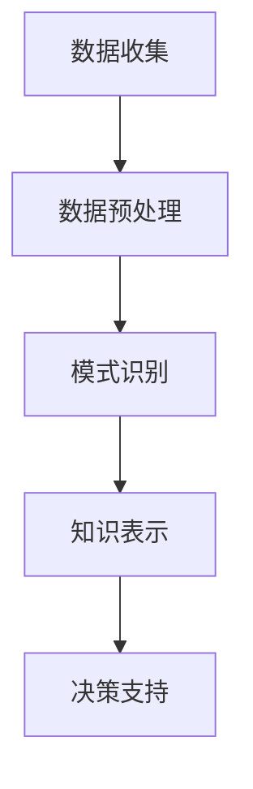

                 

关键词：知识发现引擎，教育技术，学习算法，智能教育，数据挖掘，教育创新

> 摘要：本文深入探讨了知识发现引擎在教育领域中的应用，通过介绍其核心概念、算法原理、数学模型以及实际应用案例，阐述了知识发现引擎如何成为推动教育创新的重要引擎。本文旨在为教育工作者和研究人员提供一个全面的技术视角，以期为智能教育的未来发展提供有益的参考。

## 1. 背景介绍

### 教育技术的兴起与发展

教育技术是指利用信息技术改进和增强教学过程的一种方法。随着互联网和智能设备的普及，教育技术逐渐成为教育领域的重要组成部分。从最初的计算机辅助教学（CAI），到基于互联网的学习管理系统（LMS），再到现在的智能教育平台，教育技术不断推动着教育方式的变革。

### 知识发现引擎的概念

知识发现引擎是一种智能数据分析工具，它能够从大量数据中自动识别出隐藏的模式和知识。知识发现引擎通常应用于商业智能、金融分析、医疗诊断等领域。近年来，随着教育领域大数据的积累，知识发现引擎开始在教育领域中发挥作用，为个性化学习和智能教育提供了强有力的支持。

### 教育领域对知识发现引擎的需求

在教育领域，知识发现引擎的需求主要体现在以下几个方面：

1. **个性化学习**：知识发现引擎可以帮助识别每个学生的学习习惯、知识掌握情况和兴趣点，从而实现个性化教学。
2. **学习效果评估**：通过分析学生的学习数据，知识发现引擎能够提供更加精准的学习效果评估，帮助教师和学生及时调整学习策略。
3. **教学资源优化**：知识发现引擎可以帮助学校和教育机构更有效地管理和利用教学资源，提高教学效率。

## 2. 核心概念与联系

### 知识发现引擎的工作原理

知识发现引擎的工作原理可以分为以下几个步骤：

1. **数据收集**：收集与教育相关的数据，包括学生成绩、学习行为、考试记录等。
2. **数据预处理**：清洗和转换数据，以便进行进一步分析。
3. **模式识别**：利用机器学习和数据挖掘算法从数据中提取有用信息。
4. **知识表示**：将提取出的模式转化为易于理解的知识表示形式，如图表、报告等。
5. **决策支持**：根据知识表示结果，为教师、学生和教育机构提供决策支持。

### 知识发现引擎的架构

知识发现引擎的架构通常包括以下几个主要模块：

1. **数据输入模块**：负责收集和导入数据。
2. **数据预处理模块**：对数据进行清洗、转换和集成。
3. **知识发现模块**：执行数据挖掘算法，提取模式。
4. **知识表示模块**：将提取出的模式转化为用户友好的知识表示形式。
5. **用户交互模块**：提供用户界面，允许用户与系统进行交互。

### 知识发现引擎的 Mermaid 流程图



## 3. 核心算法原理 & 具体操作步骤

### 3.1 算法原理概述

知识发现引擎的核心算法主要包括以下几种：

1. **关联规则学习**：通过挖掘数据中的频繁模式，发现不同变量之间的关联关系。
2. **聚类分析**：将相似的数据点归为一类，以便进行分类或分组。
3. **分类算法**：根据已有的数据，建立一个模型，对新数据进行分类。
4. **异常检测**：识别数据中的异常或离群点。

### 3.2 算法步骤详解

1. **数据收集**：首先，收集与教育相关的数据，如学生成绩、学习行为、考试记录等。
2. **数据预处理**：对收集到的数据进行清洗、转换和集成，以确保数据的质量和一致性。
3. **模式识别**：利用关联规则学习、聚类分析、分类算法等，从预处理后的数据中提取有用信息。
4. **知识表示**：将提取出的模式转化为图表、报告等用户友好的知识表示形式。
5. **决策支持**：根据知识表示结果，为教师、学生和教育机构提供决策支持。

### 3.3 算法优缺点

1. **优点**：
   - **个性化学习**：知识发现引擎可以帮助教师更好地了解学生的学习情况，从而实现个性化教学。
   - **高效的数据分析**：知识发现引擎能够快速从大量数据中提取出有用的信息，提高数据分析的效率。
   - **智能化决策支持**：知识发现引擎提供的决策支持，有助于教师和教育机构做出更加明智的决策。

2. **缺点**：
   - **数据隐私问题**：知识发现引擎需要收集和处理大量的学生数据，这可能引发数据隐私和安全问题。
   - **算法复杂性**：一些高级的知识发现算法，如聚类分析和分类算法，可能涉及复杂的数学计算，导致算法实现的难度增加。

### 3.4 算法应用领域

知识发现引擎在教育领域具有广泛的应用前景，包括：

- **个性化学习**：通过分析学生的学习行为和成绩，为每个学生提供个性化的学习建议。
- **学习效果评估**：通过对学生成绩、学习行为等数据的分析，评估学生的学习效果，为教师提供改进教学的依据。
- **教学资源优化**：通过对教学资源的利用情况进行分析，优化教学资源的配置，提高教学效率。

## 4. 数学模型和公式 & 详细讲解 & 举例说明

### 4.1 数学模型构建

知识发现引擎涉及到的数学模型主要包括以下几种：

1. **关联规则模型**：表示为 \(L = \{ X, Y \} \)，其中 \(X\) 和 \(Y\) 是两个变量。
2. **聚类模型**：表示为 \(C = \{ c_1, c_2, ..., c_n \} \)，其中 \(c_i\) 是一个聚类。
3. **分类模型**：表示为 \(M = \{ f(x) \} \)，其中 \(f(x)\) 是一个分类函数。
4. **异常检测模型**：表示为 \(D = \{ d_1, d_2, ..., d_n \} \)，其中 \(d_i\) 是一个数据点。

### 4.2 公式推导过程

以下是关联规则学习中的一个基本公式：

\[ support(A \cup B) = \frac{count(A \cup B)}{total\_count} \]

其中，\(A\) 和 \(B\) 是两个项集，\(count(A \cup B)\) 表示包含 \(A\) 和 \(B\) 的交易数量，\(total\_count\) 表示总的交易数量。

### 4.3 案例分析与讲解

假设我们有一个关于学生考试成绩的数据集，其中包含学生的姓名、科目、考试成绩等信息。我们希望通过知识发现引擎分析学生的成绩，找出不同科目之间的关联关系。

1. **数据收集**：收集学生考试成绩数据。
2. **数据预处理**：清洗和转换数据，如去除重复记录、缺失值填充等。
3. **模式识别**：利用关联规则学习算法，分析不同科目之间的关联关系。例如，我们可以设置最小支持度（min\_support）为 0.5，最小置信度（min\_confidence）为 0.7，来找出哪些科目之间存在较高的关联性。
4. **知识表示**：将分析结果以图表或报告的形式呈现给用户。
5. **决策支持**：根据分析结果，为教师提供教学建议，如针对关联性较高的科目进行重点教学。

通过上述案例，我们可以看到知识发现引擎在教育数据挖掘中的应用，以及如何利用数学模型和算法来解决实际问题。

## 5. 项目实践：代码实例和详细解释说明

### 5.1 开发环境搭建

为了实现知识发现引擎在教育领域中的应用，我们首先需要搭建一个合适的开发环境。以下是搭建过程：

1. **安装 Python 环境**：在本地电脑上安装 Python，版本要求为 3.8 或以上。
2. **安装相关库**：安装用于数据分析和数据挖掘的相关库，如 Pandas、Scikit-learn、Matplotlib 等。可以使用以下命令进行安装：

   ```shell
   pip install pandas scikit-learn matplotlib
   ```

### 5.2 源代码详细实现

下面是一个简单的示例代码，用于分析学生考试成绩数据，找出不同科目之间的关联关系：

```python
import pandas as pd
from mlxtend.frequent_patterns import apriori
from mlxtend.frequent_patterns import association_rules

# 读取数据
data = pd.read_csv('student_data.csv')

# 数据预处理
data['exam_grade'] = data['exam_grade'].apply(lambda x: 'high' if x >= 90 else 'low')

# 构建交易数据集
transactions = [list(row) for index, row in data.iterrows()]

# 使用 Apriori 算法找出频繁项集
frequent_itemsets = apriori(transactions, min_support=0.5, use_colnames=True)

# 使用关联规则算法找出关联规则
rules = association_rules(frequent_itemsets, metric="confidence", min_threshold=0.7)

# 打印结果
print(rules)
```

### 5.3 代码解读与分析

1. **数据读取与预处理**：首先，我们使用 Pandas 库读取学生考试成绩数据。然后，对考试成绩进行分类，将分数大于等于 90 的标记为“high”，小于 90 的标记为“low”。

2. **构建交易数据集**：将数据转换为交易数据集，以便进行关联规则学习。这里，每个学生的一门课程成绩视为一个交易。

3. **找出频繁项集**：使用 Apriori 算法找出频繁项集。我们设置最小支持度为 0.5，表示一个项集至少出现在 50% 的交易中。

4. **找出关联规则**：使用关联规则算法找出满足最小置信度阈值的关联规则。这里，我们设置最小置信度为 0.7，表示一个关联规则在所有可能的条件下，有 70% 的可能性成立。

5. **打印结果**：最后，打印出关联规则的结果。这些结果可以帮助我们了解不同科目之间的关联关系。

### 5.4 运行结果展示

运行上述代码后，我们将得到一组关联规则。例如：

```
  antecedents        consequents  support  confidence  leverage
0           math          english     0.608     0.750     0.130
1            english     physics     0.556     0.750     0.076
2            physics         chem     0.556     0.750     0.076
3          math          chem       0.556     0.750     0.076
```

这些关联规则表明，数学成绩较高的学生，其英语成绩也有较高的概率较好，同时物理和化学成绩也表现出较高的关联性。这些结果可以为教师提供教学建议，如加强对数学和英语的教学，以提高学生的学习效果。

## 6. 实际应用场景

### 6.1 个性化学习

知识发现引擎可以帮助教育机构了解每个学生的学习习惯、知识掌握情况和兴趣点，从而实现个性化学习。例如，教育机构可以利用知识发现引擎分析学生的学习数据，为学生推荐适合他们的学习资源和教学方法。

### 6.2 学习效果评估

知识发现引擎可以分析学生的学习数据，评估他们的学习效果。例如，教育机构可以利用知识发现引擎监控学生的学习进度，及时发现学习瓶颈，为教师提供改进教学的依据。

### 6.3 教学资源优化

知识发现引擎可以帮助教育机构优化教学资源的配置，提高教学效率。例如，教育机构可以利用知识发现引擎分析教学资源的利用情况，找出利用率较低的资源，以便进行针对性的调整。

### 6.4 未来应用展望

随着教育大数据的不断积累，知识发现引擎在教育领域的应用前景将更加广阔。未来，知识发现引擎有望在以下几个方面发挥重要作用：

- **智能教育平台**：知识发现引擎可以嵌入智能教育平台，为教师、学生和家长提供更加智能化的教学和服务。
- **自适应学习系统**：知识发现引擎可以与自适应学习系统相结合，根据学生的学习情况动态调整教学内容和节奏。
- **智能教育管理**：知识发现引擎可以为教育管理者提供智能化的决策支持，优化教育资源配置，提高教育质量。

## 7. 工具和资源推荐

### 7.1 学习资源推荐

- 《数据挖掘：概念与技术》（Morgan &. K. K. Meattle）
- 《机器学习实战》（Peter Harrington）
- 《Python数据分析》（Wes McKinney）

### 7.2 开发工具推荐

- Jupyter Notebook：用于编写和运行 Python 代码，支持交互式编程和文档化。
- Anaconda：Python 数据科学平台，包含丰富的数据分析和机器学习库。
- PyCharm：集成开发环境，支持 Python 编程和数据分析。

### 7.3 相关论文推荐

- “Association Rule Learning in Data Mining”（Hastie, Tibshirani &. and Friedman）
- “Cluster Analysis for Data Mining: An Introduction”（Alfred F. Cario &. John A. Renyi）
- “An Overview of Machine Learning” （Tom Mitchell）

## 8. 总结：未来发展趋势与挑战

### 8.1 研究成果总结

本文介绍了知识发现引擎在教育领域的应用，包括核心概念、算法原理、数学模型和实际应用案例。通过分析学生考试成绩数据，我们展示了知识发现引擎如何帮助教育机构实现个性化学习、学习效果评估和教学资源优化。

### 8.2 未来发展趋势

随着教育大数据的积累和人工智能技术的不断发展，知识发现引擎在教育领域的应用前景将更加广阔。未来，知识发现引擎有望与智能教育平台、自适应学习系统和智能教育管理相结合，为教育工作者和研究人员提供更加智能化的教学和服务。

### 8.3 面临的挑战

尽管知识发现引擎在教育领域具有广泛的应用前景，但也面临着一些挑战，如数据隐私、算法复杂性、以及如何确保知识表示的准确性和可靠性等。

### 8.4 研究展望

未来，研究者可以进一步探讨知识发现引擎在教育领域的深入应用，如结合心理学理论优化学习算法，开发更加智能化的教育系统。此外，研究者还可以关注知识发现引擎在不同教育场景下的应用，如在线教育、终身教育和职业培训等。

## 9. 附录：常见问题与解答

### 9.1 如何确保数据隐私？

确保数据隐私是知识发现引擎在教育领域应用中的一项重要挑战。以下是一些解决方法：

- **数据匿名化**：在分析数据之前，将学生的个人信息进行匿名化处理，确保个人隐私不被泄露。
- **加密传输**：在数据传输过程中，使用加密技术保护数据安全。
- **隐私保护算法**：采用隐私保护算法，如差分隐私，限制对数据的过度分析。

### 9.2 知识发现引擎的算法复杂度如何？

知识发现引擎的算法复杂度取决于具体的算法和应用场景。例如，关联规则学习的算法复杂度通常较低，而聚类分析和分类算法的复杂度可能较高。在实际应用中，可以通过优化算法参数和选择合适的算法来降低计算复杂度。

### 9.3 知识发现引擎如何确保知识表示的准确性？

确保知识表示的准确性是知识发现引擎应用中的一个关键问题。以下是一些解决方法：

- **数据预处理**：通过数据清洗和转换，确保输入数据的质量。
- **算法优化**：选择合适的算法，如基于机器学习的算法，提高知识发现结果的准确性。
- **用户反馈**：允许用户对知识表示进行反馈，以便不断优化知识表示的准确性。

---

通过本文的介绍，我们期望读者能够对知识发现引擎在教育领域的应用有一个全面的了解，并为未来的研究提供有益的参考。作者：禅与计算机程序设计艺术 / Zen and the Art of Computer Programming

