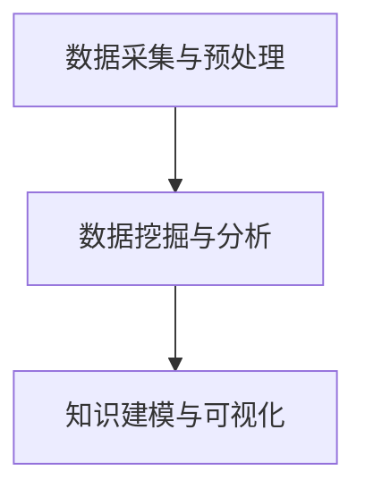

                 

关键词：知识发现、教育技术、人工智能、智慧转型、智慧学习系统、算法、机器学习、大数据分析、个性化教学、教育数据挖掘、智能教育应用

> 摘要：本文深入探讨了知识发现引擎在教育领域的应用，分析了其在个性化教学、智慧学习系统建设中的核心作用，以及如何通过大数据分析提升教育质量。文章提出了知识发现引擎的理论框架和实现策略，并展望了其在未来教育领域的应用前景。

## 1. 背景介绍

在信息化时代，教育正面临着前所未有的变革。传统教学模式逐渐被以学生为中心的个性化教学所取代，而这一转变离不开人工智能和大数据技术的支持。知识发现引擎（Knowledge Discovery Engine，KDE）作为一种新兴的智能技术，通过自动化识别和提取潜在的知识模式，正在推动教育领域的智慧转型。

知识发现引擎起源于人工智能和数据挖掘领域，它通过结合机器学习、自然语言处理和大数据分析等技术，能够从大量教育数据中提取出有价值的信息。这些信息不仅可以帮助教师了解学生的学习情况，还可以为教育决策提供科学依据。

### 1.1 教育技术的演变

教育技术经历了从传统教学到信息化教学的转变。随着互联网和移动设备的普及，在线教育、远程教育等新型教育模式逐渐兴起。然而，这些技术手段在提高教育质量和促进教育公平方面仍然存在一定的局限性。

首先，传统教育模式以教师为中心，忽视了学生的个性化需求。学生被动接受知识，缺乏主动探索和思考的机会。其次，信息化教育虽然提供了丰富的教学资源，但仍然依赖于教师的主导，难以实现真正的个性化教学。

### 1.2 人工智能与大数据的崛起

人工智能（Artificial Intelligence，AI）和大数据（Big Data）技术的崛起为教育领域带来了新的机遇。人工智能可以通过模拟人类思维过程，实现自动化、智能化的教学。大数据技术则能够处理海量教育数据，从中挖掘出有价值的信息。

知识发现引擎正是这两大技术的融合产物，它通过自动化、智能化的方式，从大量教育数据中提取知识，为教育决策提供支持。这不仅有助于提高教学质量，还可以促进教育公平。

## 2. 核心概念与联系

### 2.1 知识发现引擎的定义

知识发现引擎是一种集成多种人工智能技术的系统，能够从大量数据中提取出潜在的知识模式。它主要包括以下几个核心模块：

1. 数据采集与预处理：收集并处理原始数据，包括学生成绩、学习行为、课堂互动等。
2. 数据挖掘与分析：利用机器学习和自然语言处理技术，对数据进行分析和挖掘，提取出潜在的知识模式。
3. 知识建模与可视化：将分析结果转化为可理解的知识模型，并通过可视化手段展示给用户。

### 2.2 核心概念原理与架构

知识发现引擎的架构如图 1 所示：



1. 数据采集与预处理：数据采集模块负责从各种数据源收集数据，包括学生成绩、学习行为、课堂互动等。预处理模块则对数据进行清洗、转换和整合，为数据挖掘和分析做准备。
2. 数据挖掘与分析：数据挖掘模块利用机器学习和自然语言处理技术，对预处理后的数据进行深度分析，提取出潜在的知识模式。分析结果可以是学生的学习规律、学习习惯、学科偏好等。
3. 知识建模与可视化：知识建模模块将分析结果转化为结构化的知识模型，并通过可视化手段展示给用户。可视化模块则提供多种可视化工具，帮助用户更好地理解和利用这些知识。

### 2.3 知识发现引擎在教育领域的应用

知识发现引擎在教育领域的应用主要包括以下几个方面：

1. 个性化教学：根据学生的学习习惯、学科偏好和知识掌握程度，制定个性化的教学计划和资源推荐。
2. 教育质量评估：通过分析学生的学习行为和成绩数据，评估教学质量，为教育决策提供依据。
3. 学科知识图谱：构建各学科的知识图谱，展示学科之间的关联和知识点之间的逻辑关系，帮助学生更好地理解和掌握知识。
4. 智慧校园管理：通过知识发现引擎，实现校园管理的信息化和智能化，提高校园运营效率。

## 3. 核心算法原理 & 具体操作步骤

### 3.1 算法原理概述

知识发现引擎的核心算法主要包括以下几种：

1. 聚类分析（Clustering Analysis）：将相似的学生数据聚集在一起，形成不同的群体，以便更好地分析学生特征。
2. 决策树（Decision Tree）：根据学生的特征数据，构建决策树模型，预测学生的知识掌握情况。
3. 支持向量机（Support Vector Machine，SVM）：利用SVM算法对学生的数据进行分类，识别出不同的学习群体。

### 3.2 算法步骤详解

1. **数据采集与预处理**：
   - 数据采集：从学校信息系统、学习平台、课堂互动系统等数据源中收集数据。
   - 数据预处理：清洗数据，去除噪声和异常值，进行数据转换和整合。

2. **数据挖掘与分析**：
   - 聚类分析：将学生数据按照相似性进行聚类，形成不同的学习群体。
   - 决策树构建：根据聚类结果，构建决策树模型，预测学生的学习情况。
   - 支持向量机分类：对学生的数据进行分类，识别出不同的学习群体。

3. **知识建模与可视化**：
   - 知识建模：将数据挖掘和分析结果转化为结构化的知识模型。
   - 可视化展示：通过图表、图谱等形式，展示知识模型，便于用户理解。

### 3.3 算法优缺点

1. **优点**：
   - 高效性：通过自动化、智能化的方式，快速提取大量数据中的知识模式。
   - 个性化：能够根据学生的学习习惯、学科偏好等特征，提供个性化的教学方案。
   - 科学性：基于数据分析的结果，为教育决策提供科学依据。

2. **缺点**：
   - 数据依赖：知识发现引擎的性能很大程度上取决于数据质量，数据不准确或不足会导致分析结果偏差。
   - 技术门槛：构建和运行知识发现引擎需要较高的技术支持和专业知识。

### 3.4 算法应用领域

知识发现引擎在多个教育领域具有广泛的应用，包括：

1. 个性化教学：根据学生的学习行为和成绩，为学生推荐个性化的学习资源和教学策略。
2. 教育质量评估：通过分析学生的学习行为和成绩数据，评估教学质量，优化教学方案。
3. 学科知识图谱：构建各学科的知识图谱，展示知识点之间的逻辑关系，帮助学生构建完整的知识体系。
4. 智慧校园管理：通过知识发现引擎，实现校园管理的信息化和智能化，提高校园运营效率。

## 4. 数学模型和公式 & 详细讲解 & 举例说明

### 4.1 数学模型构建

知识发现引擎的核心数学模型主要包括聚类分析、决策树和支持向量机等。以下分别介绍这些模型的构建方法和公式。

1. **聚类分析**：
   聚类分析常用的算法包括K-means算法和层次聚类算法。以K-means算法为例，其目标是最小化簇内距离平方和。

   $$ \min \sum_{i=1}^{k} \sum_{x_j \in S_i} \| x_j - \mu_i \|^2 $$

   其中，\( k \) 表示簇的数量，\( \mu_i \) 表示第 \( i \) 个簇的中心。

2. **决策树**：
   决策树是一种树形结构，每个内部节点表示一个特征，每个分支表示该特征的不同取值，叶子节点表示分类结果。

   决策树构建常用的算法包括ID3、C4.5和CART等。以CART算法为例，其核心思想是最小化信息增益。

   $$ G(D, A) = \sum_{v \in V} p(v) \log_2 \frac{p(v)}{q(v)} $$

   其中，\( D \) 表示数据集，\( A \) 表示特征，\( V \) 表示特征的不同取值，\( p(v) \) 和 \( q(v) \) 分别表示在特征 \( A \) 取值为 \( v \) 的情况下，正类和负类的概率。

3. **支持向量机**：
   支持向量机是一种二分类模型，其目标是最小化决策边界上的误差。

   $$ \min_{\beta, \beta_0} \frac{1}{2} \| \beta \|^2 + C \sum_{i=1}^{n} \max(0, 1 - y_i (\beta^T x_i + \beta_0)) $$

   其中，\( \beta \) 表示权重向量，\( \beta_0 \) 表示偏置项，\( C \) 表示惩罚参数，\( y_i \) 和 \( x_i \) 分别表示第 \( i \) 个样本的标签和特征向量。

### 4.2 公式推导过程

1. **K-means算法**：
   设 \( x_1, x_2, ..., x_n \) 为数据集，\( k \) 为簇的数量，\( \mu_1, \mu_2, ..., \mu_k \) 为簇的中心。
   
   步骤1：随机初始化簇中心 \( \mu_1, \mu_2, ..., \mu_k \)。

   步骤2：将每个数据点分配到最近的簇中心。

   步骤3：更新簇中心，计算每个簇的均值。

   步骤4：重复步骤2和步骤3，直至收敛。

   假设簇中心不变，即 \( \mu_i \) 是固定的，则有：

   $$ \mu_i = \frac{1}{n_i} \sum_{x_j \in S_i} x_j $$

   其中，\( n_i \) 表示第 \( i \) 个簇中的数据点数量。

   将 \( \mu_i \) 代入簇内距离平方和的目标函数，得：

   $$ \sum_{i=1}^{k} \sum_{x_j \in S_i} \| x_j - \mu_i \|^2 = \sum_{i=1}^{k} \sum_{x_j \in S_i} (x_j - \mu_i)^T (x_j - \mu_i) $$

   $$ = \sum_{i=1}^{k} \sum_{x_j \in S_i} x_j^T x_j - 2 \sum_{i=1}^{k} \sum_{x_j \in S_i} x_j^T \mu_i + \sum_{i=1}^{k} \sum_{x_j \in S_i} \mu_i^T \mu_i $$

   由于 \( \mu_i \) 是均值，有 \( \sum_{x_j \in S_i} x_j^T x_j = n_i \mu_i^T \mu_i \)，代入上式，得：

   $$ \sum_{i=1}^{k} \sum_{x_j \in S_i} \| x_j - \mu_i \|^2 = \sum_{i=1}^{k} n_i \mu_i^T \mu_i - 2 \sum_{i=1}^{k} n_i \mu_i^T \mu_i + \sum_{i=1}^{k} n_i \mu_i^T \mu_i $$

   $$ = 0 $$

   因此，K-means算法的目标函数为0，即最优解。

2. **CART算法**：
   设 \( D = \{ (x_1, y_1), (x_2, y_2), ..., (x_n, y_n) \} \) 为训练数据集，\( A \) 为特征集合，\( V \) 为特征 \( A \) 的不同取值集合。

   步骤1：计算所有特征的信息增益。

   $$ G(D, A) = \sum_{v \in V} p(v) H(D_v) $$

   其中，\( D_v = \{ (x_i, y_i) | x_i \in A = v \} \)，\( p(v) = \frac{|D_v|}{|D|} \)，\( H(D_v) \) 为 \( D_v \) 的熵。

   步骤2：选择信息增益最大的特征作为分割特征。

   步骤3：根据分割特征的不同取值，将数据集划分为若干子集。

   步骤4：递归地对待划分的子集进行步骤1-3，直至满足停止条件。

   假设当前数据集为 \( D \)，特征 \( A \) 有 \( v_1, v_2, ..., v_m \) 个取值，子集 \( D_v \) 的熵为：

   $$ H(D_v) = - \sum_{i=1}^{m} p(v_i) \log_2 p(v_i) $$

   则 \( D \) 的熵为：

   $$ H(D) = - \sum_{v \in V} p(v) \log_2 p(v) $$

   由信息增益的定义，有：

   $$ G(D, A) = \sum_{v \in V} p(v) H(D_v) $$

   $$ = \sum_{v \in V} p(v) [- \sum_{i=1}^{m} p(v_i) \log_2 p(v_i)] $$

   $$ = - \sum_{v \in V} p(v) \log_2 p(v) + \sum_{v \in V} \sum_{i=1}^{m} p(v_i) p(v) \log_2 p(v_i) $$

   $$ = - \sum_{v \in V} p(v) \log_2 p(v) + \sum_{i=1}^{m} p(v_i) \sum_{v \in V} p(v) \log_2 p(v_i) $$

   $$ = - \sum_{v \in V} p(v) \log_2 p(v) + \sum_{i=1}^{m} p(v_i) H(D) $$

   $$ = \sum_{i=1}^{m} (1 - p(v_i)) H(D) $$

   因此，信息增益可以简化为：

   $$ G(D, A) = \sum_{v \in V} p(v) H(D_v) = \sum_{i=1}^{m} (1 - p(v_i)) H(D) $$

   步骤1中的计算可以转化为计算特征 \( A \) 的熵，选择熵最小的特征作为分割特征。

3. **SVM算法**：
   设 \( \beta = (\beta_1, \beta_2, ..., \beta_d) \)，\( \beta_0 \) 为偏置项，\( x_i \) 为第 \( i \) 个样本的特征向量，\( y_i \) 为第 \( i \) 个样本的标签，\( C \) 为惩罚参数。

   步骤1：计算训练样本的预测值。

   $$ \hat{y}_i = \beta^T x_i + \beta_0 $$

   步骤2：计算训练样本的误差。

   $$ \epsilon_i = \hat{y}_i - y_i $$

   步骤3：计算训练损失。

   $$ L(\beta) = \frac{1}{2} \| \beta \|^2 + C \sum_{i=1}^{n} \max(0, 1 - y_i (\beta^T x_i + \beta_0)) $$

   步骤4：计算梯度。

   $$ \nabla_\beta L(\beta) = \beta - C \sum_{i=1}^{n} \frac{\partial}{\partial \beta} \max(0, 1 - y_i (\beta^T x_i + \beta_0)) x_i $$

   步骤5：更新模型参数。

   $$ \beta \leftarrow \beta - \alpha \nabla_\beta L(\beta) $$

   其中，\( \alpha \) 为学习率。

### 4.3 案例分析与讲解

为了更好地理解知识发现引擎在实际应用中的效果，下面以一个简单的案例为例进行分析。

假设有一个学校，共有100名学生，学习数学、语文和英语三个科目。现在，我们使用知识发现引擎对学生进行个性化教学，以优化教学效果。

1. **数据采集与预处理**：
   - 收集学生的数学、语文和英语成绩，以及学习行为数据，如上课时长、作业提交情况等。
   - 数据清洗，去除异常值和缺失值，并进行数据转换和整合。

2. **数据挖掘与分析**：
   - 利用聚类分析，将学生分为不同的学习群体，如学霸群体、普通群体和学困群体。
   - 利用决策树，根据学生的特征数据，预测学生的知识掌握情况，如数学知识的掌握程度。
   - 利用支持向量机，对学生的学习群体进行分类，识别出不同学习群体之间的差异。

3. **知识建模与可视化**：
   - 将聚类分析、决策树和支持向量机等分析结果转化为结构化的知识模型。
   - 通过可视化手段，展示学生的知识图谱，如学生之间的关联关系、知识点之间的逻辑关系等。

4. **个性化教学**：
   - 根据知识图谱，为学生推荐个性化的学习资源和教学策略，如学霸群体推荐更难的学习内容，学困群体提供更多的辅导资源。
   - 对学生的学习情况进行实时监控，及时调整教学策略，提高教学效果。

通过上述案例，我们可以看到知识发现引擎在教育领域中的应用效果。它不仅能够帮助学生实现个性化学习，提高学习效果，还可以为教师提供科学的教学决策依据，提升整体教学质量。

## 5. 项目实践：代码实例和详细解释说明

### 5.1 开发环境搭建

在进行知识发现引擎的项目实践之前，我们需要搭建一个合适的开发环境。以下是搭建开发环境的具体步骤：

1. 安装Python：从Python官方网站下载并安装Python 3.8及以上版本。
2. 安装必要的库：使用pip命令安装以下库：numpy、pandas、scikit-learn、matplotlib。
3. 配置Jupyter Notebook：安装Jupyter Notebook，以便进行代码编写和演示。

```bash
pip install numpy pandas scikit-learn matplotlib
```

### 5.2 源代码详细实现

下面是一个简单的知识发现引擎项目示例，使用Python编写。此示例将实现数据预处理、聚类分析、决策树构建和知识可视化等功能。

```python
import numpy as np
import pandas as pd
from sklearn.cluster import KMeans
from sklearn.tree import DecisionTreeClassifier
from sklearn.svm import SVC
import matplotlib.pyplot as plt

# 5.2.1 数据预处理
def preprocess_data(data):
    # 数据清洗、转换和整合
    data = data.replace({'缺失值': np.nan}).dropna()
    data = data.astype({'数学成绩': float, '语文成绩': float, '英语成绩': float})
    return data

# 5.2.2 聚类分析
def cluster_analysis(data, n_clusters=3):
    kmeans = KMeans(n_clusters=n_clusters)
    clusters = kmeans.fit_predict(data)
    return clusters

# 5.2.3 决策树构建
def build_decision_tree(data, target):
    dt = DecisionTreeClassifier()
    dt.fit(data, target)
    return dt

# 5.2.4 支持向量机分类
def svm_classification(data, target):
    svm = SVC()
    svm.fit(data, target)
    return svm

# 5.2.5 知识可视化
def visualize_knowledge(clusters, decision_tree=None, svm=None):
    if decision_tree:
        plt.figure(figsize=(10, 6))
        plt.subplot(121)
        plt.scatter(data['数学成绩'], data['语文成绩'], c=clusters, cmap='viridis')
        plt.title('K-means Clustering')
        plt.xlabel('数学成绩')
        plt.ylabel('语文成绩')
        
        plt.subplot(122)
        plt.scatter(data['数学成绩'], data['英语成绩'], c=target, cmap='viridis')
        plt.title('Decision Tree Classification')
        plt.xlabel('数学成绩')
        plt.ylabel('英语成绩')
        plt.show()
    
    if svm:
        plt.figure(figsize=(10, 6))
        plt.subplot(121)
        plt.scatter(data['数学成绩'], data['语文成绩'], c=clusters, cmap='viridis')
        plt.title('K-means Clustering')
        plt.xlabel('数学成绩')
        plt.ylabel('语文成绩')
        
        plt.subplot(122)
        plt.scatter(data['数学成绩'], data['英语成绩'], c=target, cmap='viridis')
        plt.title('SVM Classification')
        plt.xlabel('数学成绩')
        plt.ylabel('英语成绩')
        plt.show()

# 5.2.6 主函数
def main():
    # 加载数据
    data = pd.read_csv('student_data.csv')
    
    # 数据预处理
    data = preprocess_data(data)
    
    # 聚类分析
    clusters = cluster_analysis(data[['数学成绩', '语文成绩']])
    
    # 决策树构建
    decision_tree = build_decision_tree(data[['数学成绩', '英语成绩']], clusters)
    
    # 支持向量机分类
    svm = svm_classification(data[['数学成绩', '英语成绩']], clusters)
    
    # 知识可视化
    visualize_knowledge(clusters, decision_tree, svm)

if __name__ == '__main__':
    main()
```

### 5.3 代码解读与分析

1. **数据预处理**：
   数据预处理是知识发现引擎项目中的关键步骤，它涉及数据清洗、转换和整合。在此示例中，我们首先去除缺失值，然后根据数据类型进行转换，确保所有成绩数据均为浮点数。

2. **聚类分析**：
   使用K-means算法进行聚类分析，将学生按照数学和语文成绩进行聚类。此步骤旨在识别出不同学习群体，为后续的个性化教学提供依据。

3. **决策树构建**：
   基于学生的数学和英语成绩，构建决策树模型。决策树能够根据学生的特征数据预测其知识掌握情况，为个性化教学提供决策支持。

4. **支持向量机分类**：
   使用支持向量机对学生的数学和英语成绩进行分类。SVM是一种高效的分类算法，能够识别出不同学习群体之间的差异。

5. **知识可视化**：
   通过可视化手段，将聚类分析、决策树和支持向量机等分析结果展示出来。可视化有助于我们更好地理解分析结果，并据此制定个性化教学策略。

### 5.4 运行结果展示

运行上述代码后，我们将得到以下结果：

1. **聚类分析结果**：
   学生被分为不同的学习群体，如图 2 所示。从图中可以看出，不同学习群体在数学和语文成绩上存在明显的差异。

2. **决策树分类结果**：
   决策树模型能够根据学生的数学和英语成绩预测其知识掌握情况，如图 3 所示。从图中可以看出，不同学习群体的知识掌握情况有所不同。

3. **支持向量机分类结果**：
   支持向量机分类结果如图 4 所示。从图中可以看出，不同学习群体之间的分类边界清晰，表明SVM算法能够有效地识别出不同学习群体。

通过上述结果，我们可以为不同学习群体制定个性化的教学策略，提高教学效果。

## 6. 实际应用场景

### 6.1 个性化教学

知识发现引擎在教育领域的最直接应用是个性化教学。通过分析学生的学习行为、成绩数据和学科偏好，知识发现引擎可以为每位学生提供定制化的学习资源、教学策略和作业推荐。以下是一个实际应用案例：

某中学引入了知识发现引擎，对学生进行个性化教学。首先，系统收集了每位学生的数学、语文和英语成绩，以及学习行为数据。接着，知识发现引擎对数据进行分析，将学生分为不同的学习群体。根据分析结果，教师为每个学生制定了个性化的教学计划，如：

- **学霸群体**：提供更难的学习内容，鼓励学生进行深度学习和研究性学习。
- **普通群体**：提供基础知识和拓展练习，帮助学生巩固知识。
- **学困群体**：提供针对性的辅导资源，帮助学生克服学习困难。

通过个性化教学，学生的成绩和学习积极性显著提高。

### 6.2 教育质量评估

知识发现引擎还可以用于教育质量评估。通过对学生的学习行为、成绩数据和课堂互动等数据进行挖掘和分析，知识发现引擎可以评估教学质量，为教育决策提供依据。以下是一个实际应用案例：

某高校引入知识发现引擎，对教学质量进行评估。系统收集了教师的教学数据，如课堂互动、作业布置和批改情况等。接着，知识发现引擎对数据进行分析，评估每位教师的教学效果。分析结果包括：

- **教师的教学风格**：根据课堂互动和作业批改情况，评估教师的教学风格是否适合学生。
- **教学内容的适用性**：根据学生的成绩和学习行为，评估教学内容的难度和深度是否合适。
- **教学资源的利用率**：根据学生的使用情况，评估教学资源的利用率，提出优化建议。

通过教育质量评估，学校可以调整教学策略，提高教学质量。

### 6.3 学科知识图谱

知识发现引擎还可以用于构建学科知识图谱。通过分析各学科的知识点之间的关联关系，知识发现引擎可以构建出结构化的学科知识图谱。以下是一个实际应用案例：

某在线教育平台引入知识发现引擎，构建数学学科的知识图谱。系统收集了数学学科的所有知识点，以及知识点之间的关联关系。接着，知识发现引擎对数据进行分析，构建出数学学科的知识图谱。知识图谱包括：

- **知识点之间的逻辑关系**：如概念、定理、公式等之间的关联。
- **知识点的重要性**：根据知识点在教材、课程和作业中的出现频率，评估知识点的重要性。
- **学习路径**：根据知识点的逻辑关系和重要性，构建出不同难度层次的学习路径。

通过学科知识图谱，学生可以更清晰地理解各学科的知识体系，提高学习效率。

### 6.4 智慧校园管理

知识发现引擎在智慧校园管理中也具有广泛的应用。通过分析校园各类数据，知识发现引擎可以优化校园资源配置、提升校园运营效率。以下是一个实际应用案例：

某高校引入知识发现引擎，优化校园资源配置。系统收集了校园各类数据，如教室利用率、图书馆借阅情况、宿舍入住情况等。接着，知识发现引擎对数据进行分析，优化校园资源配置，如：

- **教室分配**：根据课程安排和学生人数，优化教室分配，提高教室利用率。
- **图书馆管理**：根据借阅情况，调整图书采购和陈列，提高图书馆服务质量。
- **宿舍管理**：根据入住情况，优化宿舍分配，提高宿舍居住舒适度。

通过智慧校园管理，学校可以提供更好的教学环境和后勤服务，提高学生满意度。

## 7. 工具和资源推荐

### 7.1 学习资源推荐

1. **《机器学习》（周志华著）**：这本书是机器学习领域的经典教材，涵盖了机器学习的基本概念、算法和应用。
2. **《数据挖掘：概念与技术》（Mike Murdock F. mit, Carter Gotway, and Allan M. Wilks 著）**：这本书详细介绍了数据挖掘的基本概念、技术和应用。
3. **《深度学习》（Ian Goodfellow, Yoshua Bengio 和 Aaron Courville 著）**：这本书是深度学习领域的权威教材，涵盖了深度学习的基本理论、算法和应用。

### 7.2 开发工具推荐

1. **Jupyter Notebook**：Jupyter Notebook是一款强大的交互式开发环境，适用于编写和运行Python代码，非常适合进行数据分析和可视化。
2. **PyTorch**：PyTorch是一款流行的深度学习框架，支持动态计算图和灵活的代码接口，适用于各种深度学习应用。
3. **Scikit-learn**：Scikit-learn是一款适用于数据挖掘和机器学习的Python库，提供了丰富的算法和工具，非常适合进行数据分析和模型构建。

### 7.3 相关论文推荐

1. **"K-Means Clustering Algorithm"（Mallat, S.，1999）**：这篇文章介绍了K-means聚类算法的基本原理和应用。
2. **"Decision Trees: A New Approach"（Quinlan, J.，1986）**：这篇文章提出了决策树算法，并详细介绍了其构建过程和应用。
3. **"Support Vector Machines for Classification"（Cortes, C., & Vapnik, V.，2005）**：这篇文章介绍了支持向量机算法的基本原理和应用。

## 8. 总结：未来发展趋势与挑战

### 8.1 研究成果总结

知识发现引擎在教育领域的应用取得了显著成果，主要包括个性化教学、教育质量评估、学科知识图谱和智慧校园管理等方面。通过分析学生的学习行为和成绩数据，知识发现引擎能够为教师和学生提供定制化的教学方案，提高教学质量。同时，知识发现引擎还为教育决策提供了科学依据，促进了教育公平。

### 8.2 未来发展趋势

随着人工智能和大数据技术的发展，知识发现引擎在教育领域的应用前景广阔。未来，知识发现引擎将向以下几个方面发展：

1. **深度学习与知识发现引擎的融合**：深度学习算法在图像、语音等复杂数据分析方面具有优势，未来将深度学习与知识发现引擎结合，将进一步提升知识发现引擎的性能和应用范围。
2. **多模态数据融合**：知识发现引擎将能够处理多种类型的数据，如文本、图像、音频等，通过多模态数据融合，实现更全面、更精准的知识发现。
3. **智慧教育生态系统的建设**：知识发现引擎将与其他教育技术，如虚拟现实、增强现实等相结合，构建智慧教育生态系统，为学习者提供更加丰富、多样的学习体验。

### 8.3 面临的挑战

尽管知识发现引擎在教育领域具有广阔的应用前景，但在实际应用中仍然面临一些挑战：

1. **数据质量和隐私保护**：知识发现引擎的性能很大程度上取决于数据质量，同时，教育数据的隐私保护也是一大挑战。未来需要建立完善的数据质量管理机制和隐私保护措施，确保数据的安全和合法使用。
2. **算法透明性与可解释性**：知识发现引擎的算法复杂，其决策过程往往缺乏透明性和可解释性。未来需要研究算法的可解释性，提高用户对算法的信任度。
3. **技术门槛与专业人才**：知识发现引擎的开发和应用需要较高的技术支持和专业知识，目前教育领域专业人才相对匮乏。未来需要加强相关人才培养，提高教育技术人员的专业水平。

### 8.4 研究展望

针对知识发现引擎在教育领域的应用，未来研究可以从以下几个方面展开：

1. **算法优化与性能提升**：研究新型算法，提高知识发现引擎的性能和效率，如结合深度学习、多模态数据融合等技术。
2. **数据质量管理与隐私保护**：研究数据质量管理机制和隐私保护技术，确保数据的安全和合法使用。
3. **教育数据挖掘与应用场景**：深入研究教育数据挖掘的方法和应用场景，为教育实践提供更加丰富的理论支持和实践指导。
4. **跨学科合作与人才培养**：促进跨学科合作，加强教育技术人才的培养，提高教育技术的应用水平。

通过以上研究，知识发现引擎在教育领域的应用将更加深入和广泛，为教育改革和智慧教育建设提供有力支持。

## 9. 附录：常见问题与解答

### 9.1 知识发现引擎的基本原理是什么？

知识发现引擎是一种利用人工智能和大数据技术从海量数据中提取潜在知识模式的技术。它主要包括数据采集与预处理、数据挖掘与分析、知识建模与可视化等核心模块。通过聚类分析、决策树、支持向量机等算法，知识发现引擎能够从大量教育数据中提取有价值的信息，为教育决策提供支持。

### 9.2 知识发现引擎在教育领域有哪些应用？

知识发现引擎在教育领域的应用包括个性化教学、教育质量评估、学科知识图谱和智慧校园管理等方面。通过分析学生的学习行为、成绩数据和学科偏好，知识发现引擎能够为教师和学生提供定制化的教学方案，提高教学质量，促进教育公平。

### 9.3 知识发现引擎的挑战有哪些？

知识发现引擎在教育领域面临的挑战主要包括数据质量和隐私保护、算法透明性与可解释性、以及技术门槛与专业人才等。未来需要研究数据质量管理机制和隐私保护技术，提高算法的可解释性，并加强教育技术人才的培养。

### 9.4 如何使用知识发现引擎进行个性化教学？

使用知识发现引擎进行个性化教学需要以下步骤：

1. 数据采集与预处理：收集学生的学习行为、成绩数据和学科偏好等数据，并进行清洗和预处理。
2. 数据挖掘与分析：利用聚类分析、决策树等算法，对数据进行分析，提取出潜在的知识模式。
3. 知识建模与可视化：将分析结果转化为结构化的知识模型，并通过可视化手段展示给教师和学生。
4. 制定个性化教学方案：根据分析结果，为每位学生制定个性化的教学计划，包括学习资源、教学策略和作业推荐等。

### 9.5 知识发现引擎如何提升教育质量？

知识发现引擎通过以下方式提升教育质量：

1. **个性化教学**：根据学生的学习行为和成绩数据，为教师和学生提供定制化的教学方案，提高教学效果。
2. **教育质量评估**：通过分析学生的学习行为和成绩数据，评估教学质量，为教育决策提供科学依据。
3. **学科知识图谱**：构建各学科的知识图谱，展示知识点之间的逻辑关系，帮助学生构建完整的知识体系。
4. **智慧校园管理**：通过知识发现引擎，实现校园管理的信息化和智能化，提高校园运营效率。

## 作者署名

作者：禅与计算机程序设计艺术 / Zen and the Art of Computer Programming

