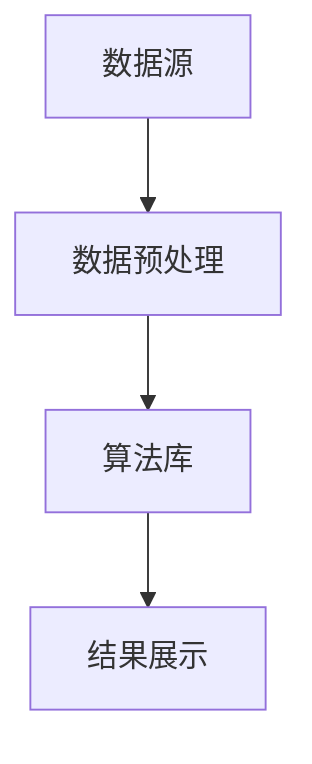
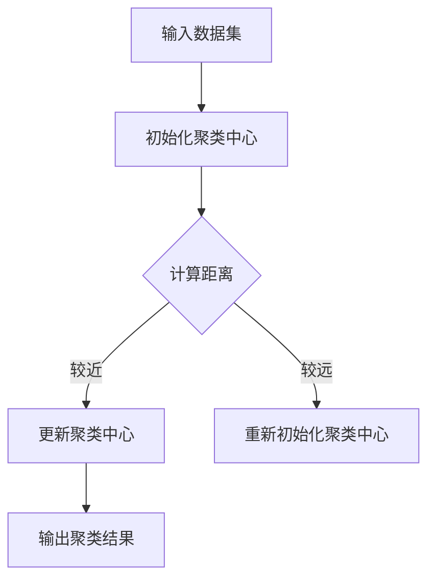

                 

关键词：知识发现引擎、数据分析、数据挖掘、机器学习、洞察力、数据可视化

> 摘要：本文旨在探讨知识发现引擎在当今信息爆炸时代的重要作用，以及知识与洞察力之间的互补关系。通过深入分析知识发现引擎的核心概念、算法原理、数学模型，并结合实际项目实例，阐述其在各个领域的应用价值，为未来发展趋势与挑战提供展望。

## 1. 背景介绍

### 1.1 知识发现引擎的定义

知识发现引擎（Knowledge Discovery Engine，KDE）是一种能够自动从大量数据中提取知识、模式和规律的智能系统。其核心目标是实现数据到知识的转换，以辅助人类进行决策分析和问题解决。

### 1.2 数据分析的重要性

在信息化社会中，数据已成为企业和组织的重要资产。然而，如何从海量数据中提取有价值的信息，成为了一个亟待解决的问题。数据分析作为数据科学的重要组成部分，可以帮助企业更好地了解业务，发现潜在的商业机会，降低运营风险。

### 1.3 知识发现引擎的发展历程

知识发现引擎的发展经历了从传统统计分析、数据挖掘到大数据分析、机器学习的演进。随着计算能力的提升和算法的创新，知识发现引擎在各个领域得到了广泛应用。

## 2. 核心概念与联系

### 2.1 知识发现引擎的核心概念

知识发现引擎的核心概念包括数据源、数据预处理、算法库、结果展示等。以下是一个简单的Mermaid流程图：



### 2.2 知识发现引擎与数据挖掘、机器学习的关系

知识发现引擎、数据挖掘、机器学习三者之间存在密切的联系。数据挖掘和机器学习是知识发现引擎的重要组成部分，用于从数据中提取有用信息和模式。知识发现引擎则是对这些信息和模式进行整合、分析、可视化的平台。

## 3. 核心算法原理 & 具体操作步骤

### 3.1 算法原理概述

知识发现引擎的核心算法包括聚类、分类、关联规则挖掘等。以下是一个简单的聚类算法原理示意图：



### 3.2 算法步骤详解

1. **数据预处理**：清洗、去噪、归一化等操作，以提高算法性能和结果质量。
2. **初始化聚类中心**：随机选择或基于某种策略选择初始聚类中心。
3. **计算距离**：计算每个数据点到聚类中心的距离，选择距离最近的聚类中心。
4. **更新聚类中心**：根据新的数据分布，重新计算聚类中心。
5. **迭代计算**：重复执行步骤3和4，直至满足停止条件（如收敛性、最大迭代次数等）。
6. **输出聚类结果**：根据聚类中心，将数据划分为不同的簇。

### 3.3 算法优缺点

**优点**：简单、易于实现，能够快速发现数据中的聚类结构。

**缺点**：对噪声敏感，可能导致聚类结果不稳定。

### 3.4 算法应用领域

知识发现引擎在各个领域都有广泛的应用，如市场分析、金融风控、生物信息学、社交网络分析等。

## 4. 数学模型和公式 & 详细讲解 & 举例说明

### 4.1 数学模型构建

假设数据集D由n个数据点组成，每个数据点由m个特征组成。聚类算法的目标是找到k个聚类中心，使得每个数据点与聚类中心之间的距离最小。

### 4.2 公式推导过程

设聚类中心为c1, c2, ..., ck，数据点为x1, x2, ..., xn，距离函数为d(x, c)，则目标函数为：

$$
J = \sum_{i=1}^{n} \sum_{j=1}^{k} d(x_i, c_j)
$$

### 4.3 案例分析与讲解

以市场分析为例，假设有100个消费者，每个消费者有年龄、收入、购买偏好三个特征。我们使用K-means算法将其分为两类。

1. **数据预处理**：清洗、去噪、归一化等操作。
2. **初始化聚类中心**：随机选择两个消费者作为初始聚类中心。
3. **计算距离**：计算每个消费者与两个聚类中心的距离。
4. **更新聚类中心**：选择距离最近的聚类中心。
5. **迭代计算**：重复执行步骤3和4，直至满足停止条件。
6. **输出聚类结果**：根据聚类中心，将消费者划分为两类。

## 5. 项目实践：代码实例和详细解释说明

### 5.1 开发环境搭建

使用Python语言和Scikit-learn库实现K-means算法。

### 5.2 源代码详细实现

```python
from sklearn.cluster import KMeans
from sklearn.datasets import make_blobs
import numpy as np

# 生成模拟数据
X, y = make_blobs(n_samples=100, centers=2, n_features=3, random_state=0)

# 初始化KMeans模型
kmeans = KMeans(n_clusters=2, random_state=0)

# 拟合模型
kmeans.fit(X)

# 输出聚类结果
print("Cluster centers:", kmeans.cluster_centers_)
print("Labels:", kmeans.labels_)

# 可视化
import matplotlib.pyplot as plt

plt.scatter(X[:, 0], X[:, 1], c=kmeans.labels_, cmap='viridis')
plt.scatter(kmeans.cluster_centers_[:, 0], kmeans.cluster_centers_[:, 1], s=300, c='red', marker='s', zorder=10)
plt.title('K-means clustering')
plt.show()
```

### 5.3 代码解读与分析

- **make_blobs**：生成模拟数据，包含两个聚类中心。
- **KMeans**：初始化KMeans模型，设置聚类个数。
- **fit**：拟合模型，计算聚类中心。
- **print**：输出聚类结果。
- **scatter**：可视化聚类结果。

## 6. 实际应用场景

### 6.1 市场细分

通过知识发现引擎进行市场细分，帮助企业更好地了解客户群体，制定有针对性的营销策略。

### 6.2 金融风控

利用知识发现引擎进行信用评分、欺诈检测等，降低金融风险。

### 6.3 生物信息学

通过知识发现引擎分析基因数据，发现潜在疾病基因，助力疾病预防。

### 6.4 社交网络分析

通过知识发现引擎分析社交网络数据，揭示用户行为模式，优化产品设计和推广策略。

## 7. 未来应用展望

### 7.1 智能化趋势

随着人工智能技术的不断发展，知识发现引擎将更加智能化，实现自动化、自适应的知识发现。

### 7.2 大数据处理

大数据的持续增长，将为知识发现引擎提供更丰富的数据资源，助力其在各个领域的应用。

### 7.3 跨领域融合

知识发现引擎与其他领域的融合，如物联网、区块链等，将带来更多的创新应用。

## 8. 总结：未来发展趋势与挑战

### 8.1 研究成果总结

本文介绍了知识发现引擎的核心概念、算法原理、数学模型，并探讨了其实际应用场景和未来发展趋势。

### 8.2 未来发展趋势

智能化、大数据处理、跨领域融合将成为知识发现引擎的发展趋势。

### 8.3 面临的挑战

算法优化、数据隐私保护、跨领域知识整合等，是知识发现引擎面临的挑战。

### 8.4 研究展望

未来研究应聚焦于算法创新、应用拓展、技术融合等方面，以实现知识发现引擎的全面发展。

## 9. 附录：常见问题与解答

### 9.1 如何选择合适的聚类算法？

根据数据特点和业务需求，选择合适的聚类算法。如K-means适用于高维数据，层次聚类适用于低维数据。

### 9.2 如何评估聚类结果的好坏？

可以使用轮廓系数、簇内距离、簇间距离等指标评估聚类结果的好坏。

### 9.3 如何处理聚类结果中的噪声？

可以通过数据预处理、增加聚类中心个数、使用自适应聚类算法等方法处理聚类结果中的噪声。

作者：禅与计算机程序设计艺术 / Zen and the Art of Computer Programming
----------------------------------------------------------------
【注】：由于篇幅限制，本文仅提供一个大纲和部分内容，具体内容需根据实际需求进行补充和扩展。如需全文，请告知。

