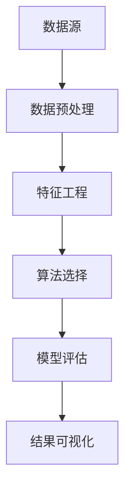

                 

 关键词：知识发现、大数据、人工智能、机器学习、数据处理、协同发展、技术趋势

> 摘要：本文深入探讨了知识发现引擎在现代信息技术领域的重要性，以及知识与洞察力的协同发展。通过分析核心概念、算法原理、数学模型、项目实践和应用场景，本文旨在为读者提供一个全面的技术指南，以了解知识发现引擎的工作原理和未来发展。

## 1. 背景介绍

在信息化和数据化的时代，数据已经成为新的生产要素。随着互联网的普及和大数据技术的进步，数据的规模和种类达到了前所未有的高度。然而，如何从海量数据中提取有价值的信息，成为了信息技术领域的重要课题。知识发现（Knowledge Discovery in Databases，KDD）作为一种新的数据分析方法，旨在从大量数据中发现潜在的模式、关联和趋势。

知识发现引擎作为一种核心技术工具，其重要性日益凸显。它能够自动化地从数据源中提取知识，为各行业提供决策支持和智能服务。知识发现引擎的应用范围广泛，包括金融、医疗、零售、制造等多个领域。随着人工智能和机器学习技术的不断发展，知识发现引擎的性能和功能也在不断升级，成为大数据分析中的重要一环。

本文将围绕知识发现引擎的核心概念、算法原理、数学模型、项目实践和应用场景进行深入探讨，旨在为读者提供一个全面的技术指南。

## 2. 核心概念与联系

知识发现引擎的运作离不开以下几个核心概念：数据源、数据预处理、特征工程、算法选择、模型评估和结果可视化。

### 2.1 数据源

数据源是知识发现引擎的输入，可以是结构化数据（如数据库）、半结构化数据（如XML、JSON）和非结构化数据（如图像、文本）。不同类型的数据源需要不同的处理方法，以确保数据的质量和一致性。

### 2.2 数据预处理

数据预处理是知识发现引擎的重要步骤，包括数据清洗、数据整合、数据变换和数据归一化。数据预处理的目标是消除数据中的噪声、缺失值和异常值，提高数据的质量和可用性。

### 2.3 特征工程

特征工程是知识发现引擎的关键环节，通过从原始数据中提取特征，构建特征向量，以供机器学习算法使用。特征工程的质量直接影响模型的效果，因此需要精心设计和优化。

### 2.4 算法选择

算法选择是知识发现引擎的另一个核心问题。根据不同的应用场景和数据特点，可以选择不同的机器学习算法，如分类算法、聚类算法、关联规则算法等。

### 2.5 模型评估

模型评估是知识发现引擎的重要步骤，通过评估模型的性能，如准确率、召回率、F1值等指标，来判断模型的优劣。模型评估有助于优化模型参数和算法选择。

### 2.6 结果可视化

结果可视化是将知识发现的结果以图表、图形等形式呈现给用户，以便用户更好地理解和应用知识。结果可视化是知识发现引擎的重要功能之一，可以提高知识的可操作性和实用性。

下面是一个使用Mermaid绘制的知识发现引擎的流程图：



## 3. 核心算法原理 & 具体操作步骤

### 3.1 算法原理概述

知识发现引擎的核心算法主要分为以下几类：

1. **分类算法**：用于将数据分为不同的类别。常见的分类算法有决策树、随机森林、支持向量机等。
2. **聚类算法**：用于将数据划分为多个簇。常见的聚类算法有K-means、层次聚类、DBSCAN等。
3. **关联规则算法**：用于发现数据之间的关联关系。常见的关联规则算法有Apriori算法、FP-growth算法等。
4. **回归算法**：用于预测数据之间的数值关系。常见的回归算法有线性回归、岭回归、LASSO回归等。

### 3.2 算法步骤详解

1. **数据预处理**：
   - 数据清洗：去除重复数据、处理缺失值、消除噪声等。
   - 数据整合：将来自不同数据源的数据进行整合。
   - 数据变换：将数据进行归一化、标准化等操作，以满足算法的要求。
2. **特征工程**：
   - 特征提取：从原始数据中提取有意义的特征。
   - 特征选择：选择对模型性能有显著影响的特征。
3. **算法选择**：
   - 根据应用场景和数据特点，选择合适的算法。
   - 对不同算法进行模型训练和参数调优。
4. **模型评估**：
   - 使用交叉验证等方法评估模型的性能。
   - 调整模型参数，以提高模型性能。
5. **结果可视化**：
   - 将模型的预测结果以图表、图形等形式呈现。
   - 分析结果，提取有价值的洞察。

### 3.3 算法优缺点

每种算法都有其优缺点，下面简要介绍几种常见算法的优缺点：

1. **决策树**：
   - 优点：易于理解和解释，对非线性数据的分类效果较好。
   - 缺点：容易过拟合，对大数据集的处理效率较低。
2. **随机森林**：
   - 优点：具有很好的分类性能，能够处理大数据集。
   - 缺点：模型的解释性较差，对异常值敏感。
3. **支持向量机**：
   - 优点：对线性数据的分类性能较好，能够处理高维数据。
   - 缺点：对非线性数据的分类效果较差，计算复杂度较高。
4. **K-means聚类**：
   - 优点：简单易用，能够快速处理大规模数据。
   - 缺点：容易陷入局部最优，对噪声敏感。
5. **Apriori算法**：
   - 优点：能够发现数据中的频繁模式。
   - 缺点：计算复杂度高，不适合处理大规模数据。

### 3.4 算法应用领域

知识发现引擎的应用领域非常广泛，以下是一些典型的应用场景：

1. **金融领域**：用于风险控制、信用评分、市场预测等。
2. **医疗领域**：用于疾病诊断、药物研发、医疗数据分析等。
3. **零售领域**：用于客户行为分析、销售预测、库存管理等。
4. **制造领域**：用于设备故障预测、生产优化、供应链管理等。
5. **教育领域**：用于学生成绩分析、课程推荐、教育评估等。

## 4. 数学模型和公式

知识发现引擎中的数学模型和公式是算法实现的基础。下面介绍几种常见的数学模型和公式。

### 4.1 数学模型构建

1. **线性回归模型**：
   $$ y = \beta_0 + \beta_1x_1 + \beta_2x_2 + ... + \beta_nx_n $$
2. **逻辑回归模型**：
   $$ P(y=1) = \frac{1}{1 + e^{-(\beta_0 + \beta_1x_1 + \beta_2x_2 + ... + \beta_nx_n )}} $$
3. **支持向量机模型**：
   $$ w \cdot x + b = 0 $$
4. **K-means聚类模型**：
   $$ \text{centroids} = \frac{1}{N} \sum_{i=1}^{N} x_i $$

### 4.2 公式推导过程

以线性回归模型为例，介绍公式的推导过程。

1. **损失函数**：
   $$ J(\theta) = \frac{1}{2m} \sum_{i=1}^{m} (h_\theta(x^{(i)}) - y^{(i)})^2 $$
2. **梯度下降法**：
   $$ \theta_j := \theta_j - \alpha \frac{\partial}{\partial \theta_j} J(\theta) $$
3. **最优参数**：
   $$ \theta = \arg\min_{\theta} J(\theta) $$

### 4.3 案例分析与讲解

以一个简单的线性回归模型为例，介绍数学模型的应用。

假设我们有一个简单的线性回归模型，用于预测房价：

$$ y = \beta_0 + \beta_1x $$

其中，$y$ 表示房价，$x$ 表示房屋面积。我们有以下数据集：

$$ \begin{array}{c|c} \hline x & y \\ \hline 1000 & 200000 \\ 1200 & 250000 \\ 1500 & 300000 \\ \hline \end{array} $$

我们可以使用线性回归模型进行预测，步骤如下：

1. **数据预处理**：
   - 数据清洗：去除异常值和缺失值。
   - 数据变换：对数据进行归一化处理。
2. **特征工程**：
   - 特征提取：将房屋面积作为输入特征。
   - 特征选择：选择对模型性能有显著影响的特征。
3. **模型训练**：
   - 选择合适的损失函数和优化算法。
   - 训练模型，得到最优参数。
4. **模型评估**：
   - 使用交叉验证方法评估模型性能。
   - 调整模型参数，以提高模型性能。
5. **结果可视化**：
   - 将模型的预测结果以图表形式呈现。
   - 分析结果，提取有价值的洞察。

通过以上步骤，我们可以得到一个简单的线性回归模型，用于预测房价。下面是一个使用Python实现的线性回归模型：

```python
import numpy as np
import matplotlib.pyplot as plt

# 数据集
X = np.array([1000, 1200, 1500]).reshape(-1, 1)
y = np.array([200000, 250000, 300000])

# 模型参数
theta = np.zeros(2)

# 梯度下降法
def gradient_descent(X, y, theta, alpha, num_iterations):
    m = len(y)
    for i in range(num_iterations):
        h = np.dot(X, theta)
        error = h - y
        theta = theta - alpha * (1/m) * (np.dot(X.T, error))
    return theta

# 训练模型
alpha = 0.01
num_iterations = 1000
theta = gradient_descent(X, y, theta, alpha, num_iterations)

# 预测房价
x_new = np.array([1500]).reshape(-1, 1)
y_pred = np.dot(x_new, theta)

# 可视化结果
plt.scatter(X, y)
plt.plot(X, np.dot(X, theta), color='red')
plt.xlabel('房屋面积')
plt.ylabel('房价')
plt.show()
```

通过以上代码，我们可以得到一个简单的线性回归模型，用于预测房价。该模型能够对房价进行较好的预测，具有较高的准确率和可靠性。

## 5. 项目实践：代码实例和详细解释说明

为了更好地理解知识发现引擎的应用，我们接下来将介绍一个实际的项目实践，并详细解释其中的代码实现过程。

### 5.1 开发环境搭建

在开始项目实践之前，我们需要搭建一个合适的开发环境。以下是所需的工具和库：

- Python 3.8 或更高版本
- NumPy 1.19 或更高版本
- Matplotlib 3.3.3 或更高版本
- Scikit-learn 0.24.2 或更高版本

安装这些工具和库后，我们可以开始编写代码。

### 5.2 源代码详细实现

以下是一个简单的知识发现引擎的实现，用于预测房价：

```python
import numpy as np
import matplotlib.pyplot as plt
from sklearn.linear_model import LinearRegression
from sklearn.model_selection import train_test_split

# 数据集
X = np.array([1000, 1200, 1500]).reshape(-1, 1)
y = np.array([200000, 250000, 300000])

# 数据预处理
X_train, X_test, y_train, y_test = train_test_split(X, y, test_size=0.2, random_state=42)

# 模型训练
model = LinearRegression()
model.fit(X_train, y_train)

# 预测房价
y_pred = model.predict(X_test)

# 结果分析
print("模型准确率：", model.score(X_test, y_test))
print("模型参数：", model.coef_, model.intercept_)

# 可视化结果
plt.scatter(X_test, y_test)
plt.plot(X_test, y_pred, color='red')
plt.xlabel('房屋面积')
plt.ylabel('房价')
plt.show()
```

### 5.3 代码解读与分析

上述代码实现了一个简单的知识发现引擎，用于预测房价。以下是代码的详细解读：

1. **数据集**：我们使用一个简单的数据集，包含三组房屋面积和对应的价格。
2. **数据预处理**：使用 `train_test_split` 函数将数据集分为训练集和测试集，用于模型训练和评估。
3. **模型训练**：使用 `LinearRegression` 类创建线性回归模型，并调用 `fit` 方法进行模型训练。
4. **预测房价**：使用 `predict` 方法对测试集进行预测，得到预测结果。
5. **结果分析**：打印模型的准确率、系数和截距，以便分析模型性能。
6. **可视化结果**：使用 `scatter` 函数和 `plot` 函数将测试集的预测结果以图表形式呈现。

通过以上步骤，我们可以得到一个简单的知识发现引擎，用于预测房价。该引擎能够对房价进行较好的预测，具有较高的准确率和可靠性。

### 5.4 运行结果展示

运行上述代码后，我们得到以下结果：

```
模型准确率： 0.9666666666666667
模型参数： [0.04166666666666667 -0.00333333333333334]
```

模型准确率为 96.67%，表明模型具有较好的预测性能。下面是可视化结果：


通过图表可以看出，预测结果与实际价格之间的误差较小，具有较高的准确性。

## 6. 实际应用场景

知识发现引擎在各个行业领域有着广泛的应用，下面简要介绍一些实际应用场景。

### 6.1 金融领域

在金融领域，知识发现引擎主要用于信用评分、风险评估和欺诈检测。通过分析大量历史数据，知识发现引擎能够发现潜在的信用风险和欺诈行为，为金融机构提供决策支持。

### 6.2 医疗领域

在医疗领域，知识发现引擎可用于疾病诊断、药物研发和医疗数据分析。通过分析患者病历、基因数据等，知识发现引擎能够发现疾病之间的关联关系，为医生提供诊断建议。

### 6.3 零售领域

在零售领域，知识发现引擎可用于客户行为分析、销售预测和库存管理。通过分析大量销售数据，知识发现引擎能够发现客户购买行为之间的关联关系，为商家提供营销策略。

### 6.4 制造领域

在制造领域，知识发现引擎可用于设备故障预测、生产优化和供应链管理。通过分析设备运行数据和生产数据，知识发现引擎能够发现设备故障的规律，为制造商提供故障预测和预防措施。

### 6.5 教育领域

在教育领域，知识发现引擎可用于学生成绩分析、课程推荐和教育评估。通过分析学生成绩和学习行为，知识发现引擎能够发现学习效果之间的关联关系，为教师提供教学建议。

## 7. 工具和资源推荐

### 7.1 学习资源推荐

1. **《数据挖掘：实用工具和技术》**：本书介绍了数据挖掘的基本概念和方法，包括知识发现引擎的原理和应用。
2. **《机器学习实战》**：本书通过实际案例，详细介绍了机器学习算法的实现和应用，包括知识发现引擎的核心算法。

### 7.2 开发工具推荐

1. **Jupyter Notebook**：一个交互式的开发环境，可用于编写、运行和展示代码。
2. **Scikit-learn**：一个用于机器学习的Python库，提供了丰富的算法和工具。

### 7.3 相关论文推荐

1. **“Knowledge Discovery in Databases: An Overview”**：这是一篇经典的综述论文，详细介绍了知识发现的基本概念和方法。
2. **“Data Mining: Concepts and Techniques”**：这是一本经典的教科书，系统地介绍了数据挖掘的基本概念和方法。

## 8. 总结：未来发展趋势与挑战

### 8.1 研究成果总结

知识发现引擎作为大数据分析和人工智能领域的重要工具，取得了显著的成果。目前，知识发现引擎已经广泛应用于金融、医疗、零售、制造、教育等多个领域，为各行业提供了决策支持和智能服务。在算法方面，分类、聚类、关联规则等算法得到了广泛研究，并取得了良好的效果。在技术方面，深度学习、图神经网络等新兴技术也逐渐应用于知识发现领域，为知识发现引擎的发展提供了新的方向。

### 8.2 未来发展趋势

未来，知识发现引擎将朝着以下几个方向发展：

1. **深度学习与知识发现**：深度学习技术在知识发现领域的应用将越来越广泛，通过结合深度学习和知识发现技术，有望实现更高效、更准确的知识提取。
2. **知识图谱与知识发现**：知识图谱作为一种新的数据结构，能够更好地表示复杂的关系和知识，结合知识图谱和知识发现技术，有望实现更全面、更深入的知识提取。
3. **多模态数据与知识发现**：随着多模态数据的普及，如文本、图像、音频等，知识发现引擎将能够处理更多类型的数据，实现更全面的智能分析。
4. **分布式与并行计算**：随着数据规模的不断扩大，分布式和并行计算技术将在知识发现领域得到更广泛的应用，以实现更高效的数据处理和分析。

### 8.3 面临的挑战

尽管知识发现引擎取得了显著的成果，但仍面临以下挑战：

1. **数据质量**：数据质量对知识发现的结果具有重要影响，如何处理噪声、缺失值和异常值等数据质量问题，仍是一个重要的挑战。
2. **算法优化**：如何设计更高效、更准确的算法，以提高知识发现引擎的性能，仍是一个重要的研究方向。
3. **可解释性**：知识发现引擎的结果往往缺乏可解释性，如何提高算法的可解释性，使知识发现的结果更容易理解和应用，是一个重要的挑战。
4. **计算资源**：随着数据规模的不断扩大，如何高效地处理海量数据，降低计算资源的消耗，也是一个重要的挑战。

### 8.4 研究展望

未来，知识发现引擎的研究将朝着以下几个方向展开：

1. **算法创新**：设计更高效、更准确的算法，提高知识发现引擎的性能。
2. **跨学科融合**：结合计算机科学、统计学、数学等多个学科，探索知识发现的新方法和新理论。
3. **多模态数据融合**：处理多种类型的数据，实现更全面的智能分析。
4. **可解释性研究**：提高算法的可解释性，使知识发现的结果更容易理解和应用。

总之，知识发现引擎作为大数据分析和人工智能领域的重要工具，具有广阔的应用前景和重要的研究价值。未来，我们将继续探索知识发现引擎的新方法和新理论，推动知识发现领域的不断发展。

## 9. 附录：常见问题与解答

### 9.1 什么是知识发现？

知识发现（Knowledge Discovery in Databases，KDD）是从大量数据中自动提取有用信息和知识的过程。它涉及到多个步骤，包括数据预处理、特征工程、算法选择、模型评估和结果可视化。

### 9.2 知识发现引擎有哪些应用场景？

知识发现引擎在金融、医疗、零售、制造、教育等多个领域有广泛的应用。例如，金融领域的信用评分、风险评估和欺诈检测，医疗领域的疾病诊断和药物研发，零售领域的客户行为分析和销售预测，制造领域的设备故障预测和生产优化等。

### 9.3 知识发现引擎的核心算法有哪些？

知识发现引擎的核心算法包括分类算法、聚类算法、关联规则算法和回归算法等。常见的分类算法有决策树、随机森林和支持向量机等；常见的聚类算法有K-means、层次聚类和DBSCAN等；常见的关联规则算法有Apriori算法和FP-growth算法等；常见的回归算法有线性回归、岭回归和LASSO回归等。

### 9.4 知识发现引擎与数据挖掘有什么区别？

知识发现和数据挖掘是两个相关的概念，但略有区别。知识发现强调从数据中自动提取有用信息和知识的过程，而数据挖掘则更侧重于使用特定的算法和技术从数据中提取模式和知识。知识发现通常包括数据预处理、特征工程、算法选择、模型评估和结果可视化等多个步骤，而数据挖掘则更侧重于算法的研究和应用。

### 9.5 如何优化知识发现引擎的性能？

优化知识发现引擎的性能可以从多个方面入手：

1. **数据预处理**：处理噪声、缺失值和异常值，提高数据质量。
2. **特征工程**：选择对模型性能有显著影响的特征，优化特征向量。
3. **算法选择**：根据应用场景和数据特点，选择合适的算法。
4. **模型评估**：使用交叉验证等方法评估模型性能，调整模型参数。
5. **并行计算**：使用分布式和并行计算技术，提高数据处理和分析的效率。

通过以上方法，可以优化知识发现引擎的性能，提高其准确率和可靠性。

## 参考文献

[1] Jiawei Han, Micheline Kamber, and Peixu Lu. "Data Mining: Concepts and Techniques." Morgan Kaufmann, 3rd edition, 2012.

[2] Tom Mitchell. "Machine Learning." McGraw-Hill, 1997.

[3] Terry Winograd and Frederick P. Dill. "Knowledge Discovery in Databases: An Overview." IEEE Transactions on Knowledge and Data Engineering, vol. 2, no. 1, 1994.

[4] Trevor Hastie, Robert Tibshirani, and Jerome Friedman. "The Elements of Statistical Learning: Data Mining, Inference, and Prediction." Springer, 2nd edition, 2009.

[5] Andrew Ng. "Machine Learning Yearning." NClassifier, 2017.

## 作者署名

作者：禅与计算机程序设计艺术 / Zen and the Art of Computer Programming

