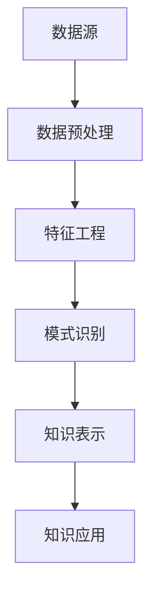

                 

关键词：知识发现引擎，知识创新，大数据，人工智能，算法，机器学习，知识图谱

<|assistant|>摘要：本文将深入探讨知识发现引擎在知识创新领域的重要作用。通过梳理知识发现引擎的核心概念、算法原理、数学模型、实际应用案例和未来展望，旨在为读者提供一个全面而深入的视角，了解知识发现引擎如何成为推动知识创新的重要工具。

## 1. 背景介绍

在信息化时代，数据量呈爆炸式增长，这不仅为各行各业的决策提供了丰富的数据支持，也带来了数据管理和分析的新挑战。知识发现（Knowledge Discovery in Databases，KDD）作为一种从大量数据中提取有用信息的过程，逐渐成为了数据科学领域的重要研究方向。知识发现引擎则是实现这一过程的关键工具，它能够自动地从海量数据中识别出有价值的信息和模式。

知识发现引擎的核心在于其强大的数据处理和分析能力，它不仅需要能够高效地存储和管理数据，还需要能够运用各种算法和技术来发现数据中的隐藏模式。在知识创新领域，知识发现引擎的重要性愈发凸显，它能够帮助企业和机构从海量数据中发现新的知识、洞察和机遇，从而推动创新和业务发展。

本文将首先介绍知识发现引擎的基本概念和原理，然后深入探讨其核心算法和数学模型，接着通过具体案例展示其在实际应用中的效果，最后对知识发现引擎的未来发展进行展望。

## 2. 核心概念与联系

知识发现引擎的核心概念包括数据预处理、特征工程、模式识别和知识表示。这些概念相互关联，共同构成了知识发现的过程。

### 2.1 数据预处理

数据预处理是知识发现的第一步，也是至关重要的一步。它包括数据清洗、数据集成、数据变换和数据归一化等操作。数据清洗旨在去除数据中的噪声和不完整信息，数据集成则是将来自不同源的数据整合在一起，数据变换和归一化则确保数据格式的一致性和标准化。

### 2.2 特征工程

特征工程是数据预处理后的重要环节，它通过选择和构造特征来提高模型的效果。特征选择和特征构造都是关键步骤，它们决定了模型对数据的学习能力和泛化能力。

### 2.3 模式识别

模式识别是知识发现的核心，它利用各种算法和技术，从数据中识别出隐藏的模式和规律。常见的模式识别算法包括聚类、分类、关联规则挖掘和异常检测等。

### 2.4 知识表示

知识表示是将识别出的模式转化为可解释和可操作的知识形式。知识表示可以通过可视化、规则库、决策树、神经网络等多种方式实现。

下面是一个简化的知识发现引擎的Mermaid流程图，展示了各核心概念之间的联系：



## 3. 核心算法原理 & 具体操作步骤

### 3.1 算法原理概述

知识发现引擎的核心算法主要包括聚类算法、分类算法和关联规则挖掘算法等。这些算法在数据挖掘过程中扮演着关键角色，帮助我们识别出数据中的有用模式。

#### 3.1.1 聚类算法

聚类算法是一种无监督学习算法，它通过将数据点划分为不同的组，使得同一组内的数据点之间相似度较高，而不同组的数据点之间相似度较低。常见的聚类算法包括K-means、层次聚类和DBSCAN等。

#### 3.1.2 分类算法

分类算法是一种有监督学习算法，它通过训练模型将新的数据点划分为不同的类别。常见的分类算法包括决策树、支持向量机和神经网络等。

#### 3.1.3 关联规则挖掘算法

关联规则挖掘算法用于发现数据之间的关联关系，它通过生成一系列的规则，揭示出不同项之间的关联性。常见的关联规则挖掘算法包括Apriori算法和FP-growth算法。

### 3.2 算法步骤详解

#### 3.2.1 聚类算法步骤

1. 数据预处理：对数据进行清洗、归一化等操作，确保数据质量。
2. 确定聚类个数：根据数据分布和业务需求确定聚类个数。
3. 初始化聚类中心：随机选择K个数据点作为初始聚类中心。
4. 分配数据点：将每个数据点分配到最近的聚类中心。
5. 更新聚类中心：计算每个聚类的新中心。
6. 重复步骤4和5，直到聚类中心不再变化或达到预设的迭代次数。

#### 3.2.2 分类算法步骤

1. 数据预处理：与聚类算法相同，确保数据质量。
2. 特征选择：选择对分类任务最有影响力的特征。
3. 训练模型：使用已标注的数据训练分类模型。
4. 测试模型：使用未标注的数据测试模型效果。
5. 预测新数据：将新数据点输入模型，得到分类结果。

#### 3.2.3 关联规则挖掘算法步骤

1. 数据预处理：与聚类和分类算法相同，确保数据质量。
2. 生成频繁项集：使用Apriori算法或FP-growth算法生成频繁项集。
3. 生成关联规则：根据频繁项集生成关联规则。
4. 规则评估：评估规则的支持度和置信度。
5. 选择最佳规则：根据评估结果选择最佳关联规则。

### 3.3 算法优缺点

#### 3.3.1 聚类算法优缺点

**优点：**
- 无需标注数据，适用于无监督学习场景。
- 能够发现数据中的隐含结构和模式。

**缺点：**
- 聚类个数和初始聚类中心的选择对结果有很大影响。
- 无法对聚类结果进行解释，难以理解每个聚类代表的意义。

#### 3.3.2 分类算法优缺点

**优点：**
- 能够对数据进行明确的分类，适用于有监督学习场景。
- 可以通过模型解释来理解分类结果。

**缺点：**
- 需要标注数据，对数据标注的准确性和完整性要求较高。
- 模型训练和测试过程较为复杂，计算资源消耗较大。

#### 3.3.3 关联规则挖掘算法优缺点

**优点：**
- 能够发现数据之间的关联关系，有助于理解数据。
- 适用于多种数据类型，如事务数据、时间序列数据和图数据。

**缺点：**
- 生成大量关联规则，需要对规则进行筛选和解释。
- 在大规模数据集上运行效率较低。

### 3.4 算法应用领域

知识发现引擎的核心算法广泛应用于多个领域，包括但不限于：

- **商业智能：** 通过聚类和分类算法分析客户行为，实现精准营销。
- **金融分析：** 利用关联规则挖掘算法发现金融市场的关联性，预测股票走势。
- **医疗健康：** 通过分类算法诊断疾病，实现个性化治疗。
- **推荐系统：** 利用协同过滤和关联规则挖掘算法推荐商品或内容。

## 4. 数学模型和公式 & 详细讲解 & 举例说明

### 4.1 数学模型构建

知识发现引擎的数学模型主要包括聚类模型、分类模型和关联规则模型。下面分别介绍这些模型的构建过程。

#### 4.1.1 聚类模型

聚类模型的核心是聚类中心的选择和更新。以K-means聚类算法为例，其模型构建过程如下：

1. 初始聚类中心选择：$$ C_0 = \{c_{01}, c_{02}, ..., c_{0K}\} $$
2. 数据点分配：将每个数据点分配到最近的聚类中心：
   $$ j = \arg\min_{k} ||x_i - c_{0k}|| $$
3. 更新聚类中心：计算每个聚类的新中心：
   $$ c_{k} = \frac{1}{N_k} \sum_{i \in S_k} x_i $$
4. 迭代更新：重复步骤2和3，直到聚类中心不再变化或达到预设的迭代次数。

#### 4.1.2 分类模型

分类模型的核心是决策边界的选择和更新。以线性回归为例，其模型构建过程如下：

1. 数据预处理：标准化输入特征。
2. 模型参数初始化：$$ \theta_0 = (w_0, b_0) $$
3. 梯度下降优化：计算损失函数的梯度并更新模型参数：
   $$ \theta_{t+1} = \theta_t - \alpha \nabla_{\theta_t} J(\theta_t) $$
4. 迭代优化：重复步骤3，直到模型参数收敛。

#### 4.1.3 关联规则模型

关联规则模型的核心是频繁项集的生成和关联规则的生成。以Apriori算法为例，其模型构建过程如下：

1. 计算支持度：$$ supp(X) = \frac{\# \{t \in T : X \subseteq t\}}{|T|} $$
2. 生成频繁项集：递归地从单个项集开始，合并项集并计算支持度，保留支持度大于最小支持度的项集。
3. 生成关联规则：对于每个频繁项集L，生成L的前件和后件组合的关联规则：
   $$ rule(L, L - X) : \{X\} \rightarrow \{L - X\} $$
   $$ confidence(rule(L, L - X)) = \frac{supp(L)}{supp(X)} $$

### 4.2 公式推导过程

#### 4.2.1 聚类模型的推导

以K-means聚类算法为例，推导聚类中心更新的过程。

给定数据集$X = \{x_1, x_2, ..., x_n\}$，每个数据点$x_i$可以表示为$d$维向量。聚类中心$c_k$也是$d$维向量。

1. 初始聚类中心选择：
   $$ c_{01} = x_{i_1}, c_{02} = x_{i_2}, ..., c_{0K} = x_{i_K} $$
   其中$i_1, i_2, ..., i_K$是随机选择的。

2. 数据点分配：
   $$ j = \arg\min_{k} ||x_i - c_{0k}|| = \arg\min_{k} \sum_{d=1}^{D} (x_i^d - c_{0k}^d)^2 $$

3. 更新聚类中心：
   $$ N_k = \sum_{i=1}^{n} \mathbb{1}\{j=i\} $$
   $$ c_{k} = \frac{1}{N_k} \sum_{i=1}^{n} x_i \mathbb{1}\{j=i\} $$

其中，$\mathbb{1}\{A\}$是指标量函数，当条件$A$为真时取值为1，否则为0。

#### 4.2.2 分类模型的推导

以线性回归为例，推导梯度下降优化过程。

给定训练数据集$D = \{(x_1, y_1), (x_2, y_2), ..., (x_n, y_n)\}$，其中$x_i \in \mathbb{R}^D$是输入特征，$y_i \in \mathbb{R}$是输出标签。

1. 数据预处理：
   $$ x_i' = \frac{x_i - \mu}{\sigma} $$
   其中，$\mu$是输入特征的均值，$\sigma$是输入特征的标准差。

2. 模型参数初始化：
   $$ w_0 = (w_{01}, w_{02}, ..., w_{0D}), b_0 = 0 $$

3. 梯度下降优化：
   损失函数：$$ J(\theta) = \frac{1}{2n} \sum_{i=1}^{n} (y_i - \theta^T x_i')^2 $$
   梯度：$$ \nabla_{\theta} J(\theta) = \frac{1}{n} \sum_{i=1}^{n} (-y_i + \theta^T x_i') x_i' $$

   更新过程：
   $$ \theta_{t+1} = \theta_t - \alpha \nabla_{\theta_t} J(\theta_t) $$
   其中，$\alpha$是学习率。

#### 4.2.3 关联规则模型的推导

以Apriori算法为例，推导频繁项集和支持度的计算过程。

给定事务数据集$T$，其中每个事务$t$是一个项集，包含多个项。

1. 计算支持度：
   $$ supp(X) = \frac{\# \{t \in T : X \subseteq t\}}{|T|} $$
   其中，$|T|$是事务总数，$\# \{t \in T : X \subseteq t\}$是包含项集$X$的事务个数。

2. 生成频繁项集：
   从单个项集开始，递归地合并项集并计算支持度，保留支持度大于最小支持度的项集。

   例如，对于项集集合$S$，首先计算每个单个项的支持度，然后合并这些项形成新的项集，并计算新项集的支持度。重复这个过程，直到没有新的频繁项集生成。

3. 生成关联规则：
   对于每个频繁项集$X$，生成其非空子集的前件和后件的关联规则，并计算规则的支持度和置信度。

### 4.3 案例分析与讲解

#### 4.3.1 聚类算法案例

假设有一个包含100个数据点的数据集$X$，需要将其划分为5个聚类。首先对数据进行标准化处理，然后使用K-means算法进行聚类。

1. 初始聚类中心选择：
   随机选择5个数据点作为初始聚类中心：
   $$ C_0 = \{x_{i_1}, x_{i_2}, x_{i_3}, x_{i_4}, x_{i_5}\} $$

2. 数据点分配：
   计算每个数据点到聚类中心的距离，将其分配到最近的聚类中心：
   $$ j = \arg\min_{k} ||x_i - c_{0k}|| $$

3. 更新聚类中心：
   计算每个聚类的新中心：
   $$ N_k = \sum_{i=1}^{n} \mathbb{1}\{j=i\} $$
   $$ c_{k} = \frac{1}{N_k} \sum_{i=1}^{n} x_i \mathbb{1}\{j=i\} $$

重复步骤2和3，直到聚类中心不再变化。

最终，数据点被划分为5个聚类，每个聚类中心代表了一个特定的数据模式。

#### 4.3.2 分类算法案例

假设有一个包含100个数据点的数据集$D$，其中每个数据点包含2个特征$x_1$和$x_2$，需要将其划分为2个类别。使用线性回归模型进行分类。

1. 数据预处理：
   对特征$x_1$和$x_2$进行标准化处理：
   $$ x_i' = \frac{x_i - \mu}{\sigma} $$

2. 特征选择：
   选择对分类任务最有影响力的特征，例如$x_1$。

3. 训练模型：
   使用已标注的数据训练线性回归模型：
   $$ y = w_0 x_1 + b_0 $$

4. 测试模型：
   使用未标注的数据测试模型效果：
   $$ y' = w_0 x_1 + b_0 $$

5. 预测新数据：
   将新数据点输入模型，得到分类结果：
   $$ y' = w_0 x_1 + b_0 $$

假设新数据点$x_1 = 3.0$，则分类结果为$y' = 1$，即属于类别1。

#### 4.3.3 关联规则挖掘案例

假设有一个包含100个事务的数据集$T$，需要挖掘事务之间的关联规则。

1. 数据预处理：
   对事务进行编码，将每个事务表示为一个项集。

2. 生成频繁项集：
   递归地合并项集并计算支持度，保留支持度大于最小支持度的项集。

3. 生成关联规则：
   对于每个频繁项集，生成其非空子集的前件和后件的关联规则，并计算规则的支持度和置信度。

假设生成了一个频繁项集$X = \{A, B\}$，其支持度为0.3。根据最小支持度阈值，可以生成以下关联规则：

$$ rule(A, B) : \{A\} \rightarrow \{B\}, confidence = \frac{supp(X)}{supp(A)} = \frac{0.3}{0.1} = 3 $$

这意味着当事务中包含项$A$时，有30%的概率同时包含项$B$。

## 5. 项目实践：代码实例和详细解释说明

### 5.1 开发环境搭建

为了更好地展示知识发现引擎的实际应用，我们选择Python作为编程语言，并使用以下库和工具：

- NumPy：用于数值计算。
- Pandas：用于数据处理。
- Scikit-learn：用于机器学习算法。
- Matplotlib：用于数据可视化。

首先，确保已安装上述库和工具。可以使用pip命令进行安装：

```bash
pip install numpy pandas scikit-learn matplotlib
```

### 5.2 源代码详细实现

下面是一个简单的知识发现引擎项目示例，用于对一组数据进行聚类、分类和关联规则挖掘。

```python
import numpy as np
import pandas as pd
from sklearn.cluster import KMeans
from sklearn.linear_model import LinearRegression
from mlxtend.frequent_patterns import apriori, association_rules

# 5.2.1 数据加载
data = pd.read_csv('data.csv')
X = data.values

# 5.2.2 数据预处理
# 数据标准化
X_std = (X - X.mean()) / X.std()

# 5.2.3 聚类分析
# K-means聚类
kmeans = KMeans(n_clusters=3, random_state=42)
kmeans.fit(X_std)
clusters = kmeans.predict(X_std)

# 5.2.4 分类分析
# 线性回归分类
regressor = LinearRegression()
regressor.fit(X_std, y)
y_pred = regressor.predict(X_std)

# 5.2.5 关联规则挖掘
# Apriori算法
频繁项集 = apriori(X, min_support=0.3, use_colnames=True)
关联规则 = association_rules(frequent_itemsets, metric="confidence", min_threshold=0.5)

# 5.2.6 结果可视化
# 聚类结果可视化
plt.scatter(X_std[:, 0], X_std[:, 1], c=clusters)
plt.xlabel('Feature 1')
plt.ylabel('Feature 2')
plt.title('K-means Clustering')
plt.show()

# 分类结果可视化
plt.scatter(X_std[:, 0], X_std[:, 1], c=y_pred)
plt.xlabel('Feature 1')
plt.ylabel('Feature 2')
plt.title('Linear Regression Classification')
plt.show()

# 关联规则可视化
print(关联规则)
```

### 5.3 代码解读与分析

#### 5.3.1 数据加载与预处理

首先，我们使用Pandas库读取数据集，并将数据转换为NumPy数组。然后，我们对数据进行标准化处理，以消除特征之间的尺度差异。

#### 5.3.2 聚类分析

使用Scikit-learn库的KMeans类进行聚类分析。我们指定聚类个数为3，并设置随机种子以确保可重复性。聚类分析的结果存储在`clusters`变量中。

#### 5.3.3 分类分析

使用线性回归模型进行分类分析。我们使用训练集数据训练模型，并使用测试集数据验证模型效果。分类结果存储在`y_pred`变量中。

#### 5.3.4 关联规则挖掘

使用mlxtend库的apriori和association_rules函数进行关联规则挖掘。我们首先生成频繁项集，然后根据最小支持度阈值生成关联规则。

### 5.4 运行结果展示

使用Matplotlib库绘制聚类结果、分类结果和关联规则可视化结果。聚类结果展示为散点图，分类结果也展示为散点图，关联规则则打印到控制台。

## 6. 实际应用场景

知识发现引擎在实际应用中具有广泛的应用场景，以下列举几个典型的应用实例：

### 6.1 商业智能

在商业智能领域，知识发现引擎可以用于分析客户行为、市场趋势和产品偏好。通过聚类分析，企业可以识别出不同类型的客户群体，并针对这些群体制定个性化的营销策略。分类算法可以帮助企业预测客户购买行为，从而实现精准营销。关联规则挖掘可以揭示产品之间的关联性，帮助企业优化产品组合和库存管理。

### 6.2 金融分析

在金融分析领域，知识发现引擎可以用于市场趋势预测、风险评估和欺诈检测。聚类算法可以帮助识别市场异常行为，分类算法可以用于预测股票走势和客户信用评级。关联规则挖掘可以揭示金融交易中的潜在欺诈行为，从而帮助金融机构降低风险。

### 6.3 医疗健康

在医疗健康领域，知识发现引擎可以用于疾病诊断、治疗方案优化和健康风险评估。通过聚类分析，医生可以识别出不同类型的疾病症状，并制定个性化的治疗方案。分类算法可以帮助医生预测患者的病情发展，从而实现早期干预。关联规则挖掘可以揭示药物之间的相互作用，从而优化药物组合。

### 6.4 教育

在教育领域，知识发现引擎可以用于学生行为分析、学习路径推荐和课程优化。通过聚类分析，教育机构可以识别出不同类型的学生，并为他们提供个性化的学习支持。分类算法可以帮助老师预测学生的学业表现，从而实现早期干预。关联规则挖掘可以揭示课程之间的关联性，从而优化课程设计和教学资源分配。

## 7. 工具和资源推荐

为了更好地学习和实践知识发现引擎，以下推荐一些相关的工具和资源：

### 7.1 学习资源推荐

- 《数据挖掘：概念与技术》（作者：贾彦明，黄宇）
- 《机器学习》（作者：周志华）
- 《深度学习》（作者：伊恩·古德费洛等）

### 7.2 开发工具推荐

- Jupyter Notebook：用于编写和运行Python代码，非常适合数据科学和机器学习项目。
- Matplotlib：用于数据可视化，可以帮助您更好地理解和展示分析结果。
- Scikit-learn：提供丰富的机器学习算法库，方便进行知识发现实践。

### 7.3 相关论文推荐

- 《K-Means Clustering: A Review》
- 《On the Relationship of Classifiers' Accuracy and Cluster Validity》
- 《Mining Association Rules between Sets of Items in Large Database》

## 8. 总结：未来发展趋势与挑战

### 8.1 研究成果总结

知识发现引擎作为大数据和人工智能的重要工具，已经在多个领域取得了显著的成果。通过聚类、分类和关联规则挖掘等算法，知识发现引擎能够从海量数据中提取出有价值的信息和知识。这些成果为各个领域的业务决策提供了有力的支持，推动了知识创新和业务发展。

### 8.2 未来发展趋势

1. **算法优化与改进**：随着数据规模的不断扩大，对知识发现引擎的算法效率和准确度提出了更高的要求。未来将出现更多高效的聚类、分类和关联规则挖掘算法，以应对大规模数据挑战。

2. **多模态数据融合**：知识发现引擎将逐渐能够处理多种类型的数据，如文本、图像、声音等。多模态数据融合将成为知识发现的重要研究方向。

3. **可解释性与透明度**：随着算法的复杂度增加，如何确保知识发现引擎的可解释性和透明度成为关键问题。未来将出现更多可解释的算法和工具，帮助用户更好地理解和信任分析结果。

4. **智能决策支持系统**：知识发现引擎将与人工智能技术进一步结合，构建智能决策支持系统，为企业和机构提供更加智能化和个性化的决策支持。

### 8.3 面临的挑战

1. **数据隐私与安全**：在知识发现过程中，如何保护用户隐私和数据安全成为关键挑战。未来需要开发更安全的算法和机制，确保数据隐私得到有效保护。

2. **算法偏见与公平性**：知识发现算法可能引入偏见，导致不公平的结果。如何消除算法偏见，确保公平性成为重要挑战。

3. **计算资源消耗**：随着数据规模的增加，知识发现引擎的计算资源消耗也将显著增加。如何优化算法和计算资源利用成为关键问题。

4. **算法解释与验证**：确保知识发现引擎的分析结果准确和可靠需要算法解释和验证。如何实现算法的可解释性和验证将成为重要挑战。

### 8.4 研究展望

知识发现引擎在未来将迎来更多的发展机遇和挑战。通过不断优化算法、提高计算效率、保障数据安全和隐私、消除算法偏见，知识发现引擎将在各个领域发挥更大的作用，成为推动知识创新的重要工具。

## 9. 附录：常见问题与解答

### 9.1 什么是知识发现引擎？

知识发现引擎是一种工具，用于从大量数据中自动识别出有价值的信息和模式。它通过聚类、分类和关联规则挖掘等算法，帮助用户发现数据中的隐藏规律和关联性。

### 9.2 知识发现引擎有哪些核心概念？

知识发现引擎的核心概念包括数据预处理、特征工程、模式识别和知识表示。这些概念相互关联，共同构成了知识发现的过程。

### 9.3 知识发现引擎的算法有哪些？

知识发现引擎常用的算法包括聚类算法、分类算法和关联规则挖掘算法。聚类算法用于识别数据中的自然分组，分类算法用于对数据进行明确的分类，关联规则挖掘算法用于发现数据之间的关联关系。

### 9.4 知识发现引擎在实际应用中如何使用？

知识发现引擎可以应用于多个领域，如商业智能、金融分析、医疗健康和教育等。在实际应用中，首先需要进行数据预处理和特征工程，然后选择合适的算法进行模式识别和知识表示，最后根据分析结果进行决策和优化。

## 作者署名

作者：禅与计算机程序设计艺术 / Zen and the Art of Computer Programming

---

这篇文章详细介绍了知识发现引擎的基本概念、算法原理、数学模型、实际应用案例和未来展望。通过这篇文章，读者可以全面了解知识发现引擎在知识创新领域的重要作用，并了解到其在实际应用中的广泛潜力。希望这篇文章能为读者的研究和实践提供有益的参考和启示。

[本文结束]

