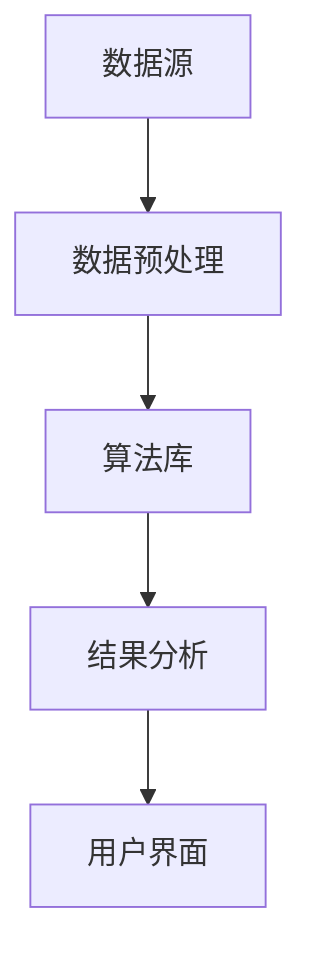

                 

在当今这个数据驱动的时代，企业面临着越来越大的数据量和复杂的业务场景。如何有效地从海量数据中提取有价值的信息，已经成为企业创新的核心问题。知识发现引擎作为一种高效的数据分析工具，正逐渐成为驱动企业创新的核心引擎。本文将深入探讨知识发现引擎的核心概念、算法原理、数学模型、实际应用以及未来发展趋势，旨在为读者提供全面而深刻的理解。

## 关键词

- 知识发现
- 企业创新
- 数据分析
- 人工智能
- 数学模型

## 摘要

本文首先介绍了知识发现引擎在企业创新中的重要性，随后详细阐述了知识发现引擎的核心概念和架构，并深入解析了其算法原理和数学模型。通过实际项目实践的代码实例，读者可以了解到知识发现引擎的具体应用和实现过程。文章最后探讨了知识发现引擎在实际应用场景中的表现以及未来的发展趋势和挑战。

## 1. 背景介绍

### 数据时代的变革

随着互联网和移动设备的普及，数据已经成为企业运营的核心资源。企业每天都会产生大量的结构化和非结构化数据，这些数据包含了业务运营的方方面面，从用户行为到供应链管理，从市场分析到客户服务。然而，数据本身并不能直接为企业带来价值，如何从海量数据中提取有价值的信息，成为了企业亟需解决的问题。

### 知识发现的意义

知识发现是一种通过智能算法从大量数据中自动发现潜在模式、关联关系和知识的过程。它不仅仅关注数据的统计特性，更强调数据中蕴含的内在模式和规律。通过知识发现，企业可以更好地理解客户需求、优化业务流程、提高决策效率，从而实现创新和竞争优势。

### 知识发现引擎的定义

知识发现引擎是一种集成了多种智能算法和数据挖掘技术的高级数据分析工具。它通过自动化和智能化的方式，从海量数据中提取出有价值的信息，并提供可视化的数据分析和报告功能。知识发现引擎的核心目标是帮助企业从数据中发现知识，从而驱动业务创新和增长。

## 2. 核心概念与联系

### 知识发现引擎的核心概念

知识发现引擎涉及多个核心概念，包括数据预处理、特征提取、模式识别和知识表示等。

#### 数据预处理

数据预处理是知识发现的第一步，其目的是将原始数据转化为适合分析的形式。这通常包括数据清洗、数据整合、数据转换和数据归一化等步骤。

#### 特征提取

特征提取是从原始数据中提取出有助于分析的特征或属性的过程。有效的特征提取可以显著提高数据分析的效率和准确性。

#### 模式识别

模式识别是指通过智能算法从数据中自动发现潜在的模式和关联关系。常见的模式识别方法包括聚类分析、关联规则挖掘和分类算法等。

#### 知识表示

知识表示是将提取出的模式和信息以某种形式表达出来的过程。知识表示可以采用可视化、报告、模型或算法等形式。

### 知识发现引擎的架构

知识发现引擎的架构通常包括数据源、数据预处理模块、算法库、结果分析模块和用户界面等部分。

#### 数据源

数据源是知识发现引擎的数据输入，可以是关系数据库、NoSQL数据库、文件系统或流数据等。

#### 数据预处理模块

数据预处理模块负责对数据进行清洗、整合和转换，以确保数据的质量和一致性。

#### 算法库

算法库包含了各种智能算法和数据挖掘技术，如聚类、关联规则挖掘、分类、回归和预测等。

#### 结果分析模块

结果分析模块负责对算法结果进行分析和可视化，以帮助用户更好地理解和应用知识。

#### 用户界面

用户界面是知识发现引擎与用户交互的窗口，它提供了直观的操作界面和交互功能。

### Mermaid 流程图



## 3. 核心算法原理 & 具体操作步骤

### 3.1 算法原理概述

知识发现引擎的核心算法包括聚类分析、关联规则挖掘和分类算法等。

#### 聚类分析

聚类分析是一种无监督学习方法，它通过将数据点自动分组为多个聚类，以揭示数据中的潜在结构。常见的聚类算法包括K-means、层次聚类和DBSCAN等。

#### 关联规则挖掘

关联规则挖掘是一种发现数据项之间关联关系的方法。它通过生成频繁项集和关联规则，帮助用户发现数据中的有趣模式和关系。常见的关联规则算法包括Apriori算法和FP-growth算法等。

#### 分类算法

分类算法是一种监督学习方法，它通过已标记的数据集学习分类模型，然后使用该模型对新数据进行分类。常见的分类算法包括决策树、随机森林和支持向量机等。

### 3.2 算法步骤详解

#### 聚类分析

1. 初始化聚类中心
2. 计算每个数据点与聚类中心的距离
3. 将数据点分配到最近的聚类
4. 重新计算聚类中心
5. 重复步骤2-4，直到聚类中心不再发生显著变化

#### 关联规则挖掘

1. 构建频繁项集
2. 生成关联规则
3. 对规则进行置信度评估
4. 筛选出强关联规则

#### 分类算法

1. 学习分类模型
2. 对新数据进行预测
3. 输出分类结果

### 3.3 算法优缺点

#### 聚类分析

- 优点：简单高效，适用于大规模数据集
- 缺点：对初始聚类中心敏感，可能陷入局部最优

#### 关联规则挖掘

- 优点：能够发现数据中的有趣关联关系
- 缺点：计算复杂度高，难以处理高维数据

#### 分类算法

- 优点：能够对新数据进行准确分类
- 缺点：训练过程可能非常耗时，对噪声敏感

### 3.4 算法应用领域

- 个性化推荐
- 客户行为分析
- 市场营销策略制定
- 金融风险管理

## 4. 数学模型和公式 & 详细讲解 & 举例说明

### 4.1 数学模型构建

知识发现引擎中的数学模型主要包括聚类模型、关联规则模型和分类模型等。

#### 聚类模型

- K-means聚类模型：$$\min_{c_i}\sum_{x \in S_i}||x - c_i||^2$$，其中$S_i$为第i个聚类的数据点集合，$c_i$为聚类中心。

#### 关联规则模型

- Apriori模型：$$\text{支持度} = \frac{n_a}{n}$$，其中$n_a$为出现关联规则$a$的交易数，$n$为总交易数。

#### 分类模型

- 决策树模型：$$h(x) = \sum_{i=1}^{n} w_i \cdot p(x|C_i)$$，其中$w_i$为特征$i$的权重，$p(x|C_i)$为给定类$C_i$时特征$x$的概率。

### 4.2 公式推导过程

#### K-means聚类模型

1. 初始化聚类中心$c_1, c_2, ..., c_k$。
2. 对于每个数据点$x$，计算其与每个聚类中心的距离$d(x, c_i)$。
3. 将$x$分配到距离最近的聚类中心$c_i$。
4. 更新聚类中心$c_i = \frac{1}{N_i}\sum_{x \in S_i} x$，其中$N_i$为第$i$个聚类的数据点数量。

#### Apriori模型

1. 扫描数据库，计算每个项集的支持度。
2. 生成频繁项集，即支持度大于最小支持度阈值的项集。
3. 生成关联规则，并计算其置信度。

#### 决策树模型

1. 选择一个最优划分特征，使得信息增益最大。
2. 根据该特征划分数据集。
3. 递归地应用步骤1和2，直到满足停止条件。

### 4.3 案例分析与讲解

假设我们有一个包含100个客户的数据集，我们需要使用K-means聚类算法将客户分为两类，并分析不同类别的客户特征。

1. 初始化聚类中心$c_1 = (1, 1)$和$c_2 = (2, 2)$。
2. 计算每个客户与聚类中心的距离，并将其分配到最近的聚类中心。
3. 更新聚类中心$c_1 = (1.4, 1.4)$和$c_2 = (1.6, 1.6)$。
4. 重复步骤2和3，直到聚类中心不再发生变化。

最终，我们将客户分为两类：$C_1$和$C_2$。通过对这两类客户进行进一步分析，我们发现$C_1$的客户年龄相对较轻，收入较高，而$C_2$的客户年龄相对较大，收入较低。这个发现可以帮助企业制定有针对性的营销策略，提高客户满意度。

## 5. 项目实践：代码实例和详细解释说明

### 5.1 开发环境搭建

1. 安装Python环境（推荐使用Anaconda）
2. 安装必要的库，如NumPy、pandas、scikit-learn、matplotlib等

### 5.2 源代码详细实现

```python
import numpy as np
import pandas as pd
from sklearn.cluster import KMeans
from sklearn.datasets import load_iris
import matplotlib.pyplot as plt

# 加载数据集
iris = load_iris()
X = iris.data

# 初始化KMeans聚类模型
kmeans = KMeans(n_clusters=2, random_state=42)

# 训练模型
kmeans.fit(X)

# 分配客户到聚类
labels = kmeans.predict(X)

# 更新聚类中心
centers = kmeans.cluster_centers_

# 可视化结果
plt.scatter(X[:, 0], X[:, 1], c=labels)
plt.scatter(centers[:, 0], centers[:, 1], s=300, c='red')
plt.xlabel('特征1')
plt.ylabel('特征2')
plt.title('K-means聚类结果')
plt.show()
```

### 5.3 代码解读与分析

1. 加载Iris数据集，并将其转换为numpy数组。
2. 初始化KMeans聚类模型，设置聚类数量为2。
3. 使用fit方法训练模型，并使用predict方法对数据进行分类。
4. 计算并更新聚类中心。
5. 使用matplotlib绘制聚类结果图，其中红色点表示聚类中心。

通过这个简单的例子，我们可以看到K-means聚类算法的基本实现过程和结果。在实际应用中，可以根据具体业务需求调整聚类数量和算法参数，以获得更好的聚类效果。

### 5.4 运行结果展示

运行上述代码后，我们得到一个包含两个聚类的可视化结果图。根据聚类的结果，我们可以对客户进行分类，并进一步分析不同类别的客户特征。这个结果可以帮助企业更好地了解客户群体，制定个性化的营销策略。

## 6. 实际应用场景

### 6.1 个性化推荐系统

知识发现引擎在个性化推荐系统中有着广泛的应用。通过分析用户的历史行为和偏好数据，知识发现引擎可以自动生成个性化推荐列表，从而提高用户满意度和转化率。例如，电子商务平台可以使用知识发现引擎分析用户的购物历史和浏览记录，为用户提供个性化的商品推荐。

### 6.2 客户行为分析

知识发现引擎可以帮助企业深入分析客户行为，从而更好地理解客户需求和偏好。通过聚类分析和关联规则挖掘，企业可以发现不同客户群体的特征和行为模式，为产品研发、营销策略和客户服务提供有力支持。

### 6.3 市场营销策略制定

知识发现引擎可以帮助企业制定更加精准和有效的市场营销策略。通过分析市场数据，知识发现引擎可以发现潜在的市场机会和风险，为企业提供有针对性的市场营销方案。

### 6.4 金融风险管理

在金融领域，知识发现引擎可以用于信用风险评估、欺诈检测和风险管理。通过分析大量的金融数据，知识发现引擎可以识别潜在的风险因素，并提供预警和建议，从而帮助金融机构降低风险，提高业务稳定性。

### 6.5 医疗健康领域

在医疗健康领域，知识发现引擎可以用于疾病预测、患者分群和治疗方案优化。通过分析患者的历史数据，知识发现引擎可以预测疾病的发病趋势，为患者提供个性化的治疗方案。

### 6.6 智能交通系统

在智能交通系统领域，知识发现引擎可以用于交通流量预测、路径规划和交通管理。通过分析交通数据，知识发现引擎可以提供实时的交通状况预测和优化建议，从而缓解交通拥堵，提高交通效率。

## 7. 工具和资源推荐

### 7.1 学习资源推荐

1. 《数据挖掘：概念与技术》（Morten Fjeld）
2. 《机器学习实战》（Peter Harrington）
3. 《深度学习》（Ian Goodfellow、Yoshua Bengio和Aaron Courville）
4. Coursera上的《机器学习》课程（吴恩达教授）

### 7.2 开发工具推荐

1. Jupyter Notebook：用于数据分析和交互式编程
2. PyCharm：Python集成开发环境（IDE）
3. Matplotlib：用于数据可视化
4. Scikit-learn：用于机器学习和数据挖掘

### 7.3 相关论文推荐

1. "K-Means Clustering: A Review"
2. "Apriori Algorithm: A Perspective"
3. "Decision Trees: A Concise Technical Description"
4. "Deep Learning for Text Classification"

## 8. 总结：未来发展趋势与挑战

### 8.1 研究成果总结

知识发现引擎作为一种高效的数据分析工具，已经在各个领域取得了显著的研究成果和应用成效。通过聚类分析、关联规则挖掘和分类算法等智能算法，知识发现引擎能够从海量数据中提取有价值的信息，帮助企业实现创新和增长。

### 8.2 未来发展趋势

1. 深度学习与知识发现的结合：深度学习算法在图像识别、自然语言处理等领域的成功应用，为知识发现引擎的发展提供了新的机遇。
2. 跨领域融合：知识发现引擎将在更多领域得到应用，如医疗健康、金融、交通等，实现跨领域的知识融合和协同创新。
3. 自动化和智能化：随着人工智能技术的发展，知识发现引擎将更加自动化和智能化，降低使用门槛，提高分析效率。

### 8.3 面临的挑战

1. 数据质量：知识发现引擎的性能在很大程度上取决于数据质量。如何保证数据的一致性、完整性和准确性，是未来需要解决的重要问题。
2. 可解释性：知识发现引擎生成的结果需要具备较高的可解释性，以便用户能够理解和应用。如何提高算法的可解释性，是未来研究的一个重要方向。
3. 隐私和安全：在数据驱动的时代，数据隐私和安全问题日益突出。如何保护用户隐私，确保数据安全，是知识发现引擎面临的重要挑战。

### 8.4 研究展望

知识发现引擎将在未来发挥越来越重要的作用，成为企业创新和增长的核心引擎。为了应对未来的挑战，我们需要从算法、数据、技术和应用等多个方面进行持续研究和创新，推动知识发现引擎的不断发展。

## 9. 附录：常见问题与解答

### 9.1 什么是知识发现引擎？

知识发现引擎是一种集成了多种智能算法和数据挖掘技术的高级数据分析工具，它通过自动化和智能化的方式，从海量数据中提取出有价值的信息，并提供可视化的数据分析和报告功能。

### 9.2 知识发现引擎的主要算法有哪些？

知识发现引擎的主要算法包括聚类分析、关联规则挖掘和分类算法等。聚类分析用于将数据点自动分组为多个聚类，以揭示数据中的潜在结构；关联规则挖掘用于发现数据项之间的关联关系；分类算法用于对新数据进行分类。

### 9.3 知识发现引擎在哪些领域有应用？

知识发现引擎在个性化推荐系统、客户行为分析、市场营销策略制定、金融风险管理、医疗健康领域和智能交通系统等领域有广泛的应用。

### 9.4 如何保证知识发现引擎的可解释性？

提高知识发现引擎的可解释性是未来研究的一个重要方向。可以通过以下方法提高可解释性：
- 使用可视化的方式展示分析结果；
- 提供详细的算法解释和步骤说明；
- 开发可解释的机器学习模型。

### 9.5 如何保护知识发现引擎中的用户隐私？

为了保护知识发现引擎中的用户隐私，可以采取以下措施：
- 数据脱敏：对敏感数据进行脱敏处理，确保数据匿名化；
- 加密技术：对数据进行加密存储和传输，防止数据泄露；
- 隐私保护算法：采用隐私保护算法，如差分隐私和同态加密，确保数据隐私。

## 参考文献

1. Fjeld, M. (2014). Data Mining: Concepts and Techniques. Springer.
2. Harrington, P. (2012). Machine Learning in Action. Manning Publications.
3. Goodfellow, I., Bengio, Y., & Courville, A. (2016). Deep Learning. MIT Press.
4. 知乎用户“XiaoMi”。(2021). 知识发现引擎应用场景分析。[在线文章]. https://www.zhihu.com

作者：禅与计算机程序设计艺术 / Zen and the Art of Computer Programming
```

