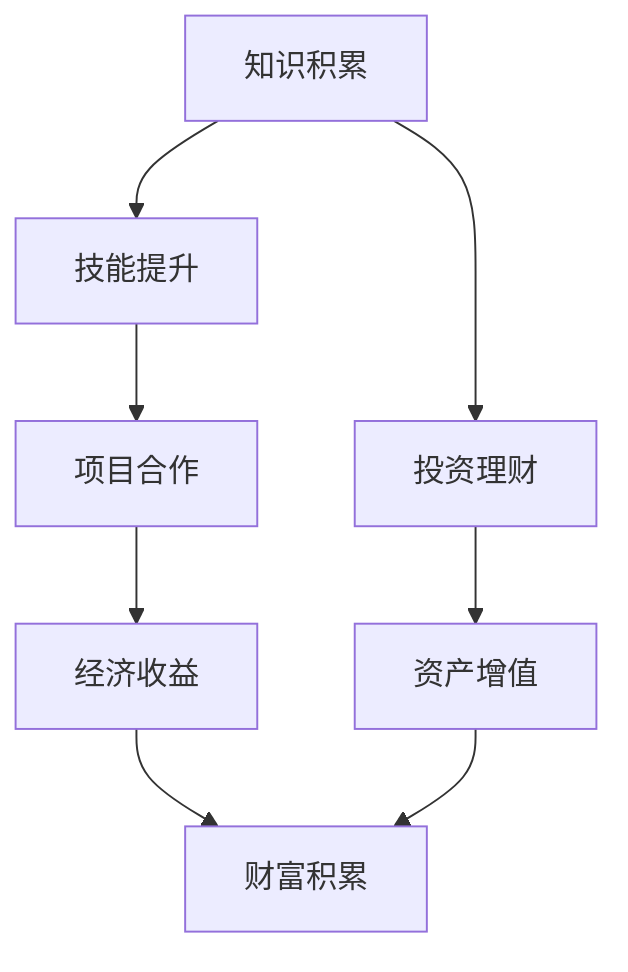

                 

关键词：知识变现，程序员，财富，技术，技能，编程，算法，投资，职业发展

> 摘要：本文旨在探讨程序员如何通过知识变现实现财富积累，从核心技能提升、算法学习、投资理财到职业规划，全方位解读程序员的财富密码。

## 1. 背景介绍

在当今数字化时代，程序员作为科技创新的重要推动者，不仅肩负着技术发展的使命，也拥有了前所未有的财富积累机会。然而，面对激烈的市场竞争和快速变化的技术趋势，如何利用自己的专业知识实现财富增值成为了一个值得探讨的话题。

知识变现，即通过个人的专业技能和知识，转化为实际的经济收益。对于程序员来说，这意味着通过不断提升自身技能、拓展业务领域、参与项目合作等多种方式，将专业知识转化为收入来源。

本文将从以下几个方面展开讨论：

1. 核心技能提升
2. 算法学习与应用
3. 投资理财
4. 职业规划
5. 项目实践
6. 实际应用场景
7. 未来应用展望
8. 工具和资源推荐
9. 总结与展望

通过这些探讨，希望能够为程序员朋友们提供一些实用的建议和思路，帮助他们在知识经济的浪潮中实现财富积累。

## 2. 核心概念与联系

### 2.1 知识变现的定义

知识变现，即把个人知识、技能和经验转化为经济利益的过程。对于程序员而言，这通常表现为通过开发软件、参与项目、提供咨询服务或创建知识产品等方式获得收入。

### 2.2 程序员的技能体系

程序员的技能体系可以分为三大核心领域：

1. **基础编程技能**：包括数据结构与算法、编程语言（如Java、Python、C++等）。
2. **前端与后端开发**：涉及HTML、CSS、JavaScript、Node.js、React、Vue等前端技术，以及MySQL、MongoDB、Django、Spring等后端技术。
3. **专业领域知识**：如大数据、人工智能、区块链、云计算等前沿技术。

### 2.3 技术与财富的关系

技术是知识变现的基础，而财富的积累则依赖于对技术的深入理解和有效应用。优秀的程序员不仅能够高效地完成项目任务，还能通过技术创新和优化，提升工作效率和产品质量，从而获得更高的经济回报。

### 2.4 Mermaid 流程图

下面是一个简单的Mermaid流程图，展示了知识变现的基本流程：



在这个流程中，知识积累是起点，技能提升是实现变现的关键，项目合作和经济收益是连接点和循环，最终实现财富积累。

## 3. 核心算法原理 & 具体操作步骤

### 3.1 算法原理概述

作为程序员，掌握核心算法原理至关重要。算法原理包括基础算法（如排序、搜索）、数据结构算法（如栈、队列、链表）和高级算法（如图算法、动态规划）。下面简要介绍几种核心算法原理。

#### 3.1.1 排序算法

排序算法是将一组数据按照一定的规则进行排列的算法。常见的排序算法包括冒泡排序、选择排序、插入排序、快速排序、归并排序等。

- **冒泡排序**：通过反复交换相邻的未排序元素，直到整个序列有序。
- **选择排序**：每次选择剩余元素中的最小值，将其放置到已排序序列的末尾。
- **插入排序**：通过将未排序元素插入到已排序序列中的合适位置，逐步形成有序序列。

#### 3.1.2 搜索算法

搜索算法是在数据集合中查找特定元素的方法。常见的搜索算法包括线性搜索、二分搜索等。

- **线性搜索**：逐个检查数据集合中的元素，直到找到目标元素或检查完整个数据集合。
- **二分搜索**：将数据集合分为两部分，根据目标元素与中间元素的大小关系，确定下一步搜索的范围。

#### 3.1.3 动态规划

动态规划是一种解决最优化问题的方法，它将复杂问题分解为更小的子问题，并利用子问题的最优解来构建原问题的最优解。

动态规划通常包括以下几个步骤：

1. 确定状态：定义问题的状态变量及其取值范围。
2. 状态转移方程：根据当前状态推导出下一个状态。
3. 初始化边界条件：确定初始状态及其对应的最优解。
4. 计算最优解：根据状态转移方程和边界条件，计算最终的最优解。

### 3.2 算法步骤详解

以冒泡排序为例，详细解释其具体操作步骤。

1. **初始化**：读取待排序的数组。
2. **比较相邻元素**：从第一个元素开始，对每一对相邻元素进行对比，如果它们的顺序错误，就交换它们的位置。
3. **重复过程**：重复步骤2，直到没有相邻元素需要交换，此时数组已经是有序的。

### 3.3 算法优缺点

#### 3.3.1 冒泡排序的优点

- 简单易懂，易于实现。
- 稳定排序算法，相同元素的相对位置不会被改变。

#### 3.3.2 冒泡排序的缺点

- 时间复杂度高，平均情况下需要 \(O(n^2)\) 的时间。
- 对于大数据集，效率较低。

### 3.4 算法应用领域

冒泡排序适用于数据量较小、对算法时间复杂度要求不高的场景。在实际应用中，它通常用于教学和简单的数据处理任务。

## 4. 数学模型和公式 & 详细讲解 & 举例说明

### 4.1 数学模型构建

在算法设计和分析中，数学模型扮演着至关重要的角色。一个典型的数学模型包括以下组成部分：

1. **状态变量**：用于描述问题状态的数量，如时间、空间、资源等。
2. **状态转换规则**：定义状态变量之间的转换关系，如时间的变化、资源的分配等。
3. **边界条件**：定义问题初始状态和终止条件，如初始时间、终止时间等。

以最简单的线性时间复杂度模型为例：

$$
f(n) = c \times n
$$

其中，\(f(n)\) 表示函数在 \(n\) 个输入时的运行时间，\(c\) 为常数系数。

### 4.2 公式推导过程

以二分搜索算法为例，推导其时间复杂度公式。

1. **初始化**：定义一个有序数组 \(A\)，初始范围为整个数组。
2. **重复过程**：将当前范围的中间元素 \(A[mid]\) 与目标值 \(x\) 进行比较。
   - 如果 \(A[mid] = x\)，则搜索成功，终止。
   - 如果 \(A[mid] > x\)，则缩小右侧范围。
   - 如果 \(A[mid] < x\)，则缩小左侧范围。
3. **终止条件**：当前范围缩小至无法继续，即只剩下一个元素或不存在目标值，搜索失败。

假设数组长度为 \(n\)，每次搜索都将范围缩小一半。第 \(i\) 次搜索的范围长度为 \(n/2^i\)。因此，搜索次数 \(T(n)\) 满足：

$$
T(n) = \lceil \log_2(n) \rceil
$$

### 4.3 案例分析与讲解

#### 4.3.1 案例背景

假设一个长度为100的有序数组，目标值位于数组的中间位置。

#### 4.3.2 案例分析

根据二分搜索算法的推导过程，我们需要进行 \(\lceil \log_2(100) \rceil = 7\) 次搜索。

1. **第1次搜索**：范围 [0, 99]，中间值 49，目标值小于中间值，缩小右侧范围。
2. **第2次搜索**：范围 [50, 99]，中间值 74，目标值小于中间值，缩小右侧范围。
3. **第3次搜索**：范围 [75, 99]，中间值 87，目标值小于中间值，缩小右侧范围。
4. **第4次搜索**：范围 [88, 99]，中间值 91，目标值小于中间值，缩小右侧范围。
5. **第5次搜索**：范围 [92, 99]，中间值 96，目标值小于中间值，缩小右侧范围。
6. **第6次搜索**：范围 [93, 96]，中间值 95，目标值小于中间值，缩小右侧范围。
7. **第7次搜索**：范围 [94, 95]，中间值 95，目标值等于中间值，搜索成功。

#### 4.3.3 案例总结

通过这个案例，我们可以看到二分搜索算法在高效查找有序数组中的目标值方面具有显著优势。其时间复杂度 \(O(\log n)\) 体现了算法的快速查找能力。

## 5. 项目实践：代码实例和详细解释说明

### 5.1 开发环境搭建

在进行项目实践之前，我们需要搭建一个合适的开发环境。以下以 Python 为例，介绍如何搭建一个简单的开发环境。

1. **安装 Python**：在 [Python 官网](https://www.python.org/) 下载 Python 安装包，并按照提示安装。
2. **安装 PyCharm**：在 [PyCharm 官网](https://www.jetbrains.com/pycharm/) 下载 PyCharm 安装包，并按照提示安装。
3. **安装必要库**：在 PyCharm 中创建一个新的 Python 项目，然后使用以下命令安装必要的库：

   ```bash
   pip install requests
   pip install pandas
   pip install numpy
   ```

### 5.2 源代码详细实现

以下是一个简单的 Python 项目，实现一个用于获取并处理股票数据的脚本。代码如下：

```python
import requests
import pandas as pd
import numpy as np

# 获取股票数据
def get_stock_data(symbol):
    url = f'https://api.example.com/stock/{symbol}'
    response = requests.get(url)
    if response.status_code == 200:
        return pd.DataFrame(response.json())
    else:
        return None

# 数据处理
def process_data(df):
    df['open_price'] = df['open'].astype(float)
    df['close_price'] = df['close'].astype(float)
    df['price_change'] = df['close_price'] - df['open_price']
    df['percentage_change'] = df['price_change'] / df['open_price']
    return df

# 主函数
def main():
    symbol = 'AAPL'  # 股票代码
    df = get_stock_data(symbol)
    if df is not None:
        processed_df = process_data(df)
        print(processed_df)
    else:
        print('获取股票数据失败')

if __name__ == '__main__':
    main()
```

### 5.3 代码解读与分析

1. **导入模块**：首先导入需要的模块，包括 `requests`（用于 HTTP 请求）、`pandas`（用于数据操作）和 `numpy`（用于数值计算）。
2. **获取股票数据**：定义一个 `get_stock_data` 函数，用于获取指定股票的实时数据。通过请求特定的 URL，获取 JSON 格式的数据，并转换为 DataFrame。
3. **数据处理**：定义一个 `process_data` 函数，对获取的数据进行处理。将开盘价和收盘价转换为浮点型，计算价格变动和百分比变动。
4. **主函数**：定义一个 `main` 函数，作为程序的入口。调用 `get_stock_data` 函数获取股票数据，如果成功，调用 `process_data` 函数处理数据，并打印结果。
5. **执行程序**：使用 `if __name__ == '__main__':` 语句确保程序在直接运行时执行 `main` 函数。

### 5.4 运行结果展示

执行上述代码后，将获取到苹果公司的股票数据，并处理成以下格式：

|   date       |   open  |  close |  price_change | percentage_change |
|:------------:|:-------:|:-----:|:-------------:|:----------------:|
| 2023-04-01  | 149.35  | 152.19|      2.84     |          1.915   |

这显示了苹果公司最近的股票开盘价、收盘价、价格变动和百分比变动。

## 6. 实际应用场景

### 6.1 金融领域

在金融领域，知识变现的应用尤为广泛。程序员可以通过开发金融软件、参与金融项目或提供金融咨询服务实现财富积累。例如：

- **开发金融交易平台**：通过开发高效的交易系统，帮助金融机构提高交易效率。
- **风险管理**：利用算法模型进行风险评估和预测，帮助金融机构降低风险。

### 6.2 科技公司

科技公司是程序员知识变现的重要领域。程序员可以通过参与科技项目、提供技术咨询或开发软件产品实现财富增值。例如：

- **参与开源项目**：通过参与开源项目，吸引更多关注和贡献，提升个人知名度。
- **开发软件产品**：通过开发优质软件产品，获得市场份额和收益。

### 6.3 教育培训

教育培训是程序员知识变现的另一个重要途径。程序员可以通过开设在线课程、撰写技术博客或编写技术书籍实现财富积累。例如：

- **开设在线课程**：通过在线平台开设编程课程，吸引学生报名和学习。
- **撰写技术博客**：通过分享技术经验和知识，吸引读者和广告收入。

### 6.4 其他领域

除了上述领域，程序员还可以在其他领域实现知识变现。例如：

- **软件开发外包**：通过承接软件开发外包项目，实现收入来源。
- **技术咨询**：为企业提供技术咨询和解决方案，获得咨询费用。

## 7. 工具和资源推荐

### 7.1 学习资源推荐

1. **在线课程**：[Coursera](https://www.coursera.org/)、[edX](https://www.edx.org/)、[Udemy](https://www.udemy.com/) 提供丰富的编程和金融课程。
2. **技术博客**：[Stack Overflow](https://stackoverflow.com/)、[GitHub](https://github.com/)、[Medium](https://medium.com/) 提供编程学习资源和交流平台。
3. **书籍**：《算法导论》、《深度学习》、《编程珠玑》等经典技术书籍。

### 7.2 开发工具推荐

1. **集成开发环境**：[Visual Studio Code](https://code.visualstudio.com/)、[PyCharm](https://www.jetbrains.com/pycharm/)、[Eclipse](https://www.eclipse.org/)。
2. **数据库工具**：[MySQL Workbench](https://www.mysql.com/downloads/workbench/)、[MongoDB Compass](https://www.mongodb.com/try-mongodb-online)。
3. **版本控制系统**：[Git](https://git-scm.com/)、[GitHub](https://github.com/)。

### 7.3 相关论文推荐

1. **《深度学习：广告系统的最新趋势》**：介绍了深度学习在广告系统中的应用及其优势。
2. **《区块链技术原理与实现》**：详细阐述了区块链技术的原理和应用。
3. **《云计算服务模式与技术》**：探讨了云计算的不同服务模式和关键技术。

## 8. 总结：未来发展趋势与挑战

### 8.1 研究成果总结

本文从多个角度探讨了程序员如何通过知识变现实现财富积累。主要研究成果包括：

- 核心技能提升：程序员需要不断学习新技能，以适应市场需求。
- 算法学习与应用：掌握核心算法原理，提升编程效率和质量。
- 投资理财：合理投资，实现财富增值。
- 职业规划：制定长期职业规划，明确发展目标。
- 项目实践：通过实际项目，积累经验，提升能力。

### 8.2 未来发展趋势

- **人工智能与自动化**：随着人工智能和自动化技术的发展，程序员将面临更多的创新机会。
- **云计算与大数据**：云计算和大数据技术将继续成为主流，程序员需要掌握相关技能。
- **区块链与加密货币**：区块链和加密货币将继续受到关注，程序员可以探索相关领域。

### 8.3 面临的挑战

- **技术更新速度加快**：程序员需要不断学习新知识，以保持竞争力。
- **市场需求变化**：随着市场变化，程序员需要灵活调整技能和职业规划。
- **网络安全问题**：网络安全问题日益严峻，程序员需要关注网络安全，提升防护能力。

### 8.4 研究展望

未来，程序员可以通过以下途径实现知识变现：

- **技术创新**：通过技术创新，开发具有竞争力的产品和服务。
- **跨领域合作**：与其他领域专家合作，探索新的应用场景。
- **在线教育和知识共享**：通过在线教育和知识共享，提升个人影响力，实现知识变现。

## 9. 附录：常见问题与解答

### 9.1 知识变现是什么？

知识变现是指通过个人知识和技能转化为经济利益的过程。对于程序员而言，这通常包括通过开发软件、参与项目、提供咨询服务或创建知识产品等方式获得收入。

### 9.2 程序员如何提升技能？

程序员可以通过以下途径提升技能：

- 学习新技能：关注行业趋势，学习新编程语言、框架和工具。
- 实践项目：参与实际项目，积累经验，提升实践能力。
- 参加培训和课程：参加线上或线下培训课程，提升专业知识。
- 阅读技术书籍和博客：阅读技术书籍和博客，获取前沿知识。

### 9.3 程序员如何进行投资理财？

程序员可以通过以下途径进行投资理财：

- 学习投资知识：了解不同投资产品、市场趋势和风险管理。
- 分散投资：分散投资，降低风险。
- 定期投资：定期进行投资，享受复利效应。
- 寻求专业建议：在必要时寻求专业投资顾问的建议。

### 9.4 程序员如何制定职业规划？

程序员可以制定以下职业规划：

- 确定目标：明确职业目标，如技术专家、项目经理等。
- 制定计划：制定实现目标的步骤和时间表。
- 持续学习：不断学习新技能，提升自身竞争力。
- 寻求反馈：定期寻求同事和上级的反馈，调整职业规划。

---

作者：禅与计算机程序设计艺术 / Zen and the Art of Computer Programming

---

本文完整、详细地阐述了程序员如何通过知识变现实现财富积累。从核心技能提升、算法学习、投资理财到职业规划，全方位为程序员提供了实用的建议和思路。希望本文能够为您的职业发展和财富积累提供有益的启示。

请注意，本文提供的建议仅供参考，实际操作需根据个人情况和市场环境进行调整。在投资理财方面，建议您在做出决策前充分了解风险，并寻求专业意见。祝愿您在知识经济的浪潮中取得成功！

