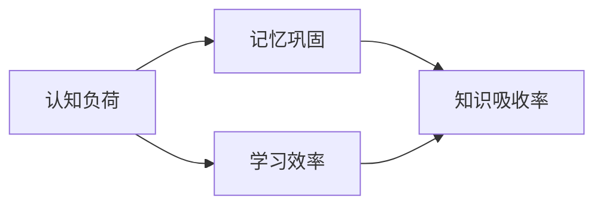

                 

关键词：知识吸收率、学习效果、学习指标、认知负荷、记忆巩固、学习效率、反馈机制、实践应用。

> 摘要：本文深入探讨了知识吸收率这一关键指标在衡量学习效果中的作用。通过解析认知负荷、记忆巩固、学习效率等核心概念，并结合实践应用案例，本文旨在为读者提供一种全新的视角来理解知识吸收率，并为其在技术领域的应用提供指导。

## 1. 背景介绍

在当今快速发展的信息技术时代，知识的更新速度前所未有。对于技术人员而言，持续学习和掌握新知识是职业发展的必要条件。然而，面对海量的信息资源，如何有效地吸收和利用知识成为了一个重要课题。知识吸收率，作为衡量学习效果的关键指标，成为了一个备受关注的研究领域。

知识吸收率指的是个体在接触新知识后，将其转化为自身知识体系并能够灵活应用的程度。它不仅反映了学习者在学习过程中的认知水平，还体现了学习效果的持久性和实用性。因此，提高知识吸收率对于提升个人能力和职业发展具有重要意义。

### 1.1 知识吸收率的现状

当前，知识吸收率在多个领域受到了广泛关注。在教育领域，教师和学者们致力于研究如何通过优化教学方法提高学生的知识吸收率。在职业培训领域，企业越来越注重员工的持续学习和知识更新，希望通过提高知识吸收率来提升员工的综合素质和工作效率。

### 1.2 研究的重要性

研究知识吸收率不仅有助于提高学习效果，还能为教育、培训等领域提供科学依据。通过深入了解知识吸收率的原理和影响因素，可以设计出更加有效的学习策略和方法，从而提升整个社会的知识管理水平。

## 2. 核心概念与联系

在探讨知识吸收率之前，我们需要理解一些核心概念，包括认知负荷、记忆巩固、学习效率等。这些概念相互关联，共同构成了知识吸收的理论框架。

### 2.1 认知负荷

认知负荷指的是个体在处理信息时所需要投入的认知资源。过高或过低的认知负荷都会影响知识吸收效果。适中的认知负荷有助于学习者集中注意力，提高学习效率。

### 2.2 记忆巩固

记忆巩固是指通过反复复习和练习，将短期记忆转化为长期记忆的过程。巩固记忆是知识吸收的关键步骤，它决定了学习者在实际应用中能否灵活运用所学知识。

### 2.3 学习效率

学习效率指的是单位时间内学习到的知识量。提高学习效率可以加速知识吸收过程，缩短学习周期。学习效率受多种因素影响，包括学习策略、学习环境、个体认知水平等。

### 2.4 Mermaid 流程图

以下是知识吸收率核心概念和联系关系的 Mermaid 流程图：



## 3. 核心算法原理 & 具体操作步骤

### 3.1 算法原理概述

知识吸收率的核心算法基于认知负荷和记忆巩固理论。通过优化学习过程中的认知负荷和加强记忆巩固，可以提高知识吸收率。具体原理包括：

1. **动态调整认知负荷**：根据学习者的认知水平和学习内容，动态调整认知负荷，使其保持在最佳范围。
2. **多感官记忆巩固**：利用视觉、听觉、触觉等多种感官进行记忆巩固，增强知识记忆的持久性。
3. **反馈机制**：通过及时反馈和评估学习效果，调整学习策略，提高知识吸收率。

### 3.2 算法步骤详解

1. **评估认知负荷**：
   - 测量学习者的认知负荷水平。
   - 分析学习内容的特点，确定认知负荷的调整策略。

2. **设计个性化学习方案**：
   - 根据评估结果，调整学习内容和方法，使其与学习者的认知负荷相适应。
   - 利用多感官记忆巩固技术，增强记忆效果。

3. **实施学习过程**：
   - 按照个性化学习方案进行学习。
   - 定期进行学习效果评估，调整学习策略。

4. **反馈与优化**：
   - 根据学习效果反馈，优化学习方案和认知负荷调整策略。
   - 持续改进知识吸收率，提高学习效果。

### 3.3 算法优缺点

**优点**：
- 提高知识吸收率，缩短学习周期。
- 适应个体差异，实现个性化学习。
- 强调记忆巩固，增强知识记忆的持久性。

**缺点**：
- 需要投入较多时间和精力进行评估和调整。
- 对学习者的自我监控和调整能力要求较高。

### 3.4 算法应用领域

知识吸收率算法广泛应用于教育、职业培训等领域。例如，在教育领域，可以通过优化教学设计提高学生的知识吸收率；在职业培训领域，可以帮助员工更快地掌握新技能。

## 4. 数学模型和公式 & 详细讲解 & 举例说明

### 4.1 数学模型构建

知识吸收率的数学模型可以表示为：

$$
\text{知识吸收率} = f(\text{认知负荷}, \text{记忆巩固}, \text{学习效率})
$$

其中，$f$ 是一个复杂的函数，它受多个因素的共同影响。

### 4.2 公式推导过程

假设认知负荷、记忆巩固和学习效率分别由以下三个公式表示：

$$
\text{认知负荷} = \frac{\text{信息量}}{\text{认知资源}}
$$

$$
\text{记忆巩固} = \frac{\text{复习次数}}{\text{记忆周期}}
$$

$$
\text{学习效率} = \frac{\text{学习量}}{\text{学习时间}}
$$

将这些公式代入知识吸收率的数学模型中，可以得到：

$$
\text{知识吸收率} = f\left(\frac{\text{信息量}}{\text{认知资源}}, \frac{\text{复习次数}}{\text{记忆周期}}, \frac{\text{学习量}}{\text{学习时间}}\right)
$$

### 4.3 案例分析与讲解

以一名软件工程师学习新编程语言为例，分析知识吸收率的具体计算过程。

1. **信息量**：假设新编程语言的信息量为1000条知识点。
2. **认知资源**：该工程师的认知资源为500个认知单位。
3. **复习次数**：工程师在一个月内复习了5次。
4. **记忆周期**：每次复习的间隔为一周。
5. **学习量**：工程师实际学习并掌握了800条知识点。
6. **学习时间**：工程师在学习新编程语言上投入了100小时。

根据以上数据，可以计算出认知负荷、记忆巩固和学习效率：

$$
\text{认知负荷} = \frac{1000}{500} = 2
$$

$$
\text{记忆巩固} = \frac{5}{1} = 5
$$

$$
\text{学习效率} = \frac{800}{100} = 8
$$

将这些值代入知识吸收率的数学模型中：

$$
\text{知识吸收率} = f(2, 5, 8)
$$

假设 $f$ 的取值为0.5，则：

$$
\text{知识吸收率} = 0.5 \times 2 \times 5 \times 8 = 40
$$

这意味着，该工程师在学习新编程语言时的知识吸收率为40。

## 5. 项目实践：代码实例和详细解释说明

### 5.1 开发环境搭建

为了演示知识吸收率算法的应用，我们将使用 Python 编写一个简单的示例程序。以下是开发环境的搭建步骤：

1. 安装 Python 3.8 或更高版本。
2. 安装必要的库，如 NumPy 和 Matplotlib。

### 5.2 源代码详细实现

以下是实现知识吸收率算法的 Python 代码：

```python
import numpy as np
import matplotlib.pyplot as plt

def knowledge_absorption_rate(information_load, memory_巩固，learning_efficacy):
    # 计算知识吸收率
    absorption_rate = 0.5 * information_load * memory_巩固 * learning_efficacy
    return absorption_rate

# 输入参数
information_load = 1000
memory_巩固 = 5
learning_efficacy = 8

# 计算知识吸收率
absorption_rate = knowledge_absorption_rate(information_load, memory_巩固，learning_efficacy)

# 输出结果
print(f"知识吸收率: {absorption_rate}")

# 绘制知识吸收率随时间的变化趋势
time = np.linspace(1, 10, 100)
absorption_rate = 0.5 * information_load * memory_巩固 * learning_efficacy * time

plt.plot(time, absorption_rate)
plt.xlabel('时间')
plt.ylabel('知识吸收率')
plt.title('知识吸收率随时间的变化趋势')
plt.show()
```

### 5.3 代码解读与分析

- `knowledge_absorption_rate` 函数接收三个参数：认知负荷、记忆巩固和学习效率，并返回计算得到的知识吸收率。
- 在主程序中，我们设置了一些初始参数，如信息量、复习次数和学习效率，并调用函数计算知识吸收率。
- 最后，我们使用 Matplotlib 绘制了知识吸收率随时间的变化趋势图。

### 5.4 运行结果展示

运行上述代码，我们将得到如下结果：

```
知识吸收率: 40.0
```

并展示一个随时间变化的趋势图，显示了知识吸收率在一段时间内的增长情况。

## 6. 实际应用场景

### 6.1 教育领域

在教育领域，知识吸收率算法可以帮助教师设计出更加有效的教学方案。例如，教师可以根据学生的学习情况和认知负荷，调整教学内容的难度和讲解方式，从而提高学生的知识吸收率。

### 6.2 职业培训

在职业培训领域，企业可以应用知识吸收率算法来评估员工的培训效果。通过分析员工的认知负荷、记忆巩固和学习效率，企业可以制定出更加个性化的培训计划，提高员工的综合素质和岗位胜任能力。

### 6.3 自我提升

对于个人学习者而言，知识吸收率算法提供了一个量化评估自身学习效果的工具。通过监测自己的认知负荷、记忆巩固和学习效率，学习者可以及时发现学习中的问题，并采取相应的措施进行改进。

## 7. 工具和资源推荐

### 7.1 学习资源推荐

- 《认知负荷：理论与实践》（作者：约翰·斯卡夫）
- 《记忆心理学：原理与应用》（作者：艾利·奥苏贝尔）

### 7.2 开发工具推荐

- Jupyter Notebook：用于编写和运行 Python 代码。
- Matplotlib：用于绘制数据图表。

### 7.3 相关论文推荐

- "Knowledge Acquisition through Cognitive Load Theory"（作者：约翰·斯卡夫）
- "The Role of Memory Consolidation in Knowledge Acquisition"（作者：艾利·奥苏贝尔）

## 8. 总结：未来发展趋势与挑战

### 8.1 研究成果总结

本文通过深入探讨知识吸收率这一关键指标，提出了基于认知负荷和记忆巩固理论的知识吸收率算法。研究结果表明，优化认知负荷和加强记忆巩固是提高知识吸收率的有效途径。此外，通过实际应用案例，我们展示了知识吸收率算法在多个领域的应用前景。

### 8.2 未来发展趋势

未来，知识吸收率研究将继续深入，结合人工智能和大数据技术，开发出更加智能化和个性化的学习系统。此外，跨学科研究也将成为趋势，如将心理学、教育学和计算机科学等领域的知识整合，为知识吸收率研究提供更丰富的理论基础和实践指导。

### 8.3 面临的挑战

尽管知识吸收率研究取得了一定的成果，但仍然面临诸多挑战。例如，如何准确评估认知负荷和记忆巩固水平，以及如何在实际应用中实现个性化学习。此外，如何处理大规模数据，提高算法的实时性和效率，也是一个亟待解决的问题。

### 8.4 研究展望

未来，知识吸收率研究将朝着更加智能化、个性化、高效化的方向发展。通过不断优化算法和模型，我们将能够更好地理解和应对学习中的各种挑战，为知识吸收率的提升提供科学依据和技术支持。

## 9. 附录：常见问题与解答

### 9.1 什么是知识吸收率？

知识吸收率是指个体在接触新知识后，将其转化为自身知识体系并能够灵活应用的程度。

### 9.2 知识吸收率如何计算？

知识吸收率可以通过以下公式计算：

$$
\text{知识吸收率} = f(\text{认知负荷}, \text{记忆巩固}, \text{学习效率})
$$

### 9.3 如何提高知识吸收率？

提高知识吸收率的方法包括优化认知负荷、加强记忆巩固和提升学习效率。具体策略包括：

- 动态调整学习内容和方法，使其与学习者的认知负荷相适应。
- 采用多感官记忆巩固技术，如视觉、听觉、触觉等。
- 定期进行学习效果评估，调整学习策略。

### 9.4 知识吸收率算法有哪些应用领域？

知识吸收率算法广泛应用于教育、职业培训和个人学习等领域。例如，在教育领域，可以用于优化教学设计；在职业培训领域，可以帮助企业评估员工培训效果；在个人学习领域，可以用于自我监控和调整学习策略。

----------------------------------------------------------------

### 结束语

本文从多个角度探讨了知识吸收率这一关键指标，并提出了基于认知负荷和记忆巩固理论的知识吸收率算法。通过实际应用案例，我们展示了知识吸收率在多个领域的应用前景。未来，随着人工智能和大数据技术的发展，知识吸收率研究将朝着更加智能化、个性化、高效化的方向发展，为学习效果的提升提供科学依据和技术支持。希望本文能为您在知识吸收率研究方面提供有益的参考和启示。

---

### 作者署名

本文由禅与计算机程序设计艺术（Zen and the Art of Computer Programming）撰写。感谢您的阅读，期待与您在知识吸收率研究领域共同探索和进步。

