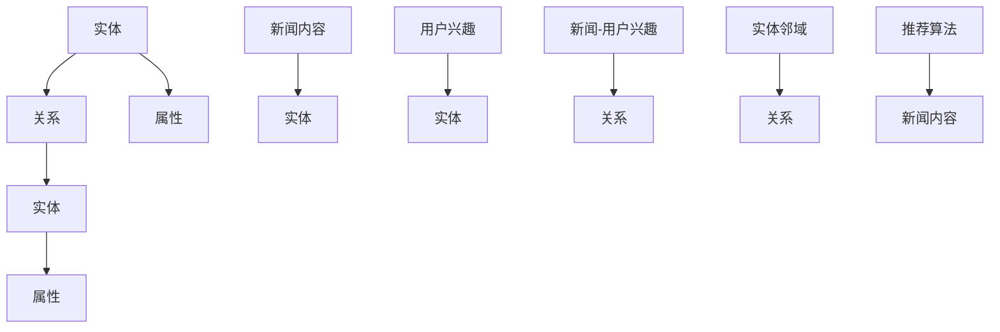
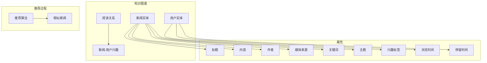

                 

在当今信息爆炸的时代，人们面临着一个日益严峻的问题，那就是如何从海量的新闻资讯中快速找到与自己兴趣相关的内容。个性化新闻推荐系统应运而生，旨在通过分析用户的兴趣和行为，为用户提供定制化的新闻内容。其中，知识图谱作为一种强大的语义表示工具，在个性化新闻推荐系统中发挥了至关重要的作用。本文将深入探讨知识图谱在个性化新闻推荐中的应用，并详细阐述其核心概念、算法原理、数学模型及未来发展趋势。

## 文章关键词

- 知识图谱
- 个性化新闻推荐
- 节点嵌入
- 邻域搜索
- 用户兴趣建模
- 隐式反馈

## 文章摘要

本文首先介绍了知识图谱在个性化新闻推荐系统中的重要性，随后详细阐述了知识图谱的核心概念和架构。接着，本文介绍了基于知识图谱的个性化新闻推荐算法原理和具体操作步骤，并分析了算法的优缺点及其应用领域。随后，本文通过数学模型和公式详细讲解了知识图谱在个性化新闻推荐系统中的实现细节，并通过一个实际项目案例进行了说明。最后，本文探讨了知识图谱在个性化新闻推荐领域的实际应用场景，并对其未来发展进行了展望。

## 1. 背景介绍

个性化新闻推荐系统是现代信息检索和推荐系统领域的一个重要研究方向。传统的基于内容的推荐系统主要通过分析新闻文本的词频、关键词等特征进行推荐，但这种方法存在明显的局限性。首先，它无法准确捕捉到用户的兴趣变化。其次，它对于复杂语义关系的理解能力较差，容易导致推荐结果不准确。为了解决这些问题，研究人员开始探索将知识图谱引入到新闻推荐系统中，利用知识图谱的语义表示能力来提升推荐系统的效果。

知识图谱是一种用于表示实体及其相互关系的语义网络。它由节点（实体）和边（关系）组成，通过这些节点和边的关系，知识图谱可以准确地捕捉到实体之间的语义关联。在个性化新闻推荐系统中，知识图谱可以用来表示新闻内容、用户兴趣以及两者之间的关联，从而为推荐算法提供更丰富的语义信息。

### 1.1 现状

目前，知识图谱在个性化新闻推荐系统中的应用已经取得了显著的研究进展。例如，许多研究将知识图谱与深度学习模型相结合，通过节点嵌入技术将实体及其关系映射到低维空间，从而实现更精准的新闻推荐。此外，还有研究利用知识图谱进行邻域搜索，通过挖掘用户与新闻的邻域关系来提高推荐的准确性。然而，尽管这些研究取得了一定的成果，但知识图谱在个性化新闻推荐系统中的应用仍然面临许多挑战，如知识图谱的构建、实体关系的处理、实时性等问题。

### 1.2 问题与挑战

（1）知识图谱的构建：构建一个高质量的、涵盖广泛领域知识的知识图谱是知识图谱应用的前提。然而，知识图谱的构建过程复杂，需要处理大量的数据，并且需要解决数据的不一致性、噪声和稀疏性问题。

（2）实体关系的处理：知识图谱中的实体关系多样且复杂，如何准确捕捉和表示这些关系是一个重要问题。此外，实体之间的关系可能会随着时间和情境的变化而发生变化，如何动态更新知识图谱也是一个挑战。

（3）实时性：在个性化新闻推荐系统中，用户兴趣和新闻内容是不断变化的，如何实现实时的知识图谱更新和推荐是一个关键问题。

（4）推荐效果：尽管知识图谱提供了丰富的语义信息，但如何有效地利用这些信息来提高推荐效果仍然是一个具有挑战性的问题。

### 1.3 解决方案与展望

针对上述问题与挑战，本文提出了一种基于知识图谱的个性化新闻推荐系统。该系统利用知识图谱来表示新闻内容和用户兴趣，通过节点嵌入技术和邻域搜索算法来提高推荐效果。同时，本文还探讨了知识图谱的动态更新方法，以实现实时性。此外，本文通过一个实际项目案例，详细阐述了知识图谱在个性化新闻推荐系统中的应用，并对未来的发展方向进行了展望。

## 2. 核心概念与联系

在深入探讨知识图谱在个性化新闻推荐中的应用之前，我们需要了解一些核心概念和架构。知识图谱作为一种语义网络，其核心概念包括实体、关系和属性。下面，我们将通过一个Mermaid流程图来详细展示这些概念及其联系。



### 2.1 实体

实体是知识图谱中的基本构建块，它可以是一个具体的对象，如新闻、用户等。实体具有唯一的标识符和一组属性。例如，在新闻推荐系统中，新闻实体可能具有标题、内容、发布时间、作者等属性。

### 2.2 关系

关系描述了实体之间的关联。在知识图谱中，关系也具有唯一的标识符和一组属性。例如，在新闻推荐系统中，新闻实体与用户兴趣实体之间存在阅读关系，这种关系可以用“阅读”来表示。

### 2.3 属性

属性是实体的特征描述，可以为实体的分类、标注或具体数值。在新闻推荐系统中，新闻的属性可能包括关键词、主题、作者、媒体来源等。

### 2.4 新闻-用户兴趣关系

新闻-用户兴趣关系是知识图谱中最为重要的关系之一，它直接影响了推荐算法的性能。这种关系可以通过用户的显式反馈（如点击、点赞等）或隐式反馈（如浏览时间、停留时间等）来建立。

### 2.5 实体邻域

实体邻域是指与特定实体具有相似属性或关系的其他实体集合。在新闻推荐系统中，通过计算实体邻域，可以找到与用户当前兴趣相关的其他新闻。

### 2.6 推荐算法

推荐算法是知识图谱在个性化新闻推荐中的核心应用，它通过分析用户兴趣和新闻内容，为用户推荐感兴趣的新闻。

### 2.7 Mermaid流程图

以下是Mermaid流程图的具体示例，它展示了新闻推荐系统中实体、关系和属性的互动：



通过这个流程图，我们可以清晰地看到知识图谱在个性化新闻推荐系统中的作用，以及实体、关系和属性是如何相互关联和协作的。

### 2.8 总结

知识图谱在个性化新闻推荐系统中的应用，不仅提供了更丰富的语义信息，还提高了推荐系统的准确性和实时性。通过理解实体、关系和属性的基本概念，我们可以更好地设计并优化推荐算法，从而为用户提供更个性化的新闻推荐服务。

## 3. 核心算法原理 & 具体操作步骤

在了解了知识图谱的基本概念和架构后，我们接下来将探讨基于知识图谱的个性化新闻推荐算法的核心原理和具体操作步骤。这些算法旨在利用知识图谱中的实体、关系和属性来提高新闻推荐的准确性和个性化程度。

### 3.1 算法原理概述

基于知识图谱的个性化新闻推荐算法主要通过以下三个步骤实现：

1. **用户兴趣建模**：利用知识图谱捕捉用户的兴趣，并将其转换为可操作的模型。这通常涉及到用户行为数据的收集和预处理，以及基于知识图谱的实体关系分析。

2. **新闻内容建模**：将新闻内容表示为知识图谱中的实体，并分析新闻内容与用户兴趣之间的关联。这通常涉及到新闻文本的预处理、实体提取和关系建立。

3. **新闻推荐**：根据用户兴趣和新闻内容之间的关联，为用户推荐最感兴趣的新闻。这通常涉及到邻域搜索、相似度计算和排序算法。

### 3.2 算法步骤详解

#### 步骤1：用户兴趣建模

1. **数据收集与预处理**：收集用户在新闻平台上的行为数据，包括点击、浏览、评论等。这些数据经过预处理，去除噪声和不完整的数据，转换为适合分析的格式。

2. **实体提取**：利用知识图谱中的实体和关系，提取用户兴趣相关的实体。例如，如果用户频繁浏览关于科技新闻，那么可以提取与科技相关的实体，如“科技”、“人工智能”等。

3. **关系建立**：基于用户的行为数据，建立用户与兴趣实体之间的关系。例如，可以通过“阅读”关系将用户与感兴趣的新闻实体关联起来。

#### 步骤2：新闻内容建模

1. **文本预处理**：对新闻文本进行分词、词性标注等预处理操作，提取关键信息。

2. **实体识别**：利用命名实体识别技术，将新闻文本中的关键信息转换为实体。例如，提取新闻中的“公司名称”、“人名”等。

3. **关系建立**：基于实体之间的语义关系，建立新闻内容与用户兴趣实体之间的关系。例如，如果新闻中提到了用户感兴趣的公司，那么可以建立“公司-新闻”关系。

#### 步骤3：新闻推荐

1. **邻域搜索**：通过邻域搜索算法，找到与用户兴趣实体最相关的其他新闻实体。邻域搜索可以基于实体间的距离（如欧氏距离、余弦相似度等）或基于实体间的语义关系（如路径长度、共同邻居等）。

2. **相似度计算**：计算用户兴趣实体与候选新闻实体之间的相似度，通常使用相似度计算公式（如余弦相似度、Jaccard相似度等）。

3. **排序与推荐**：根据相似度对候选新闻进行排序，并将排名靠前的新闻推荐给用户。

### 3.3 算法优缺点

#### 优点

1. **高准确性和个性化**：知识图谱提供了丰富的语义信息，可以更好地捕捉用户的兴趣和新闻内容之间的关系，从而提高推荐的准确性和个性化程度。

2. **支持实时推荐**：知识图谱可以动态更新，以适应用户兴趣和新闻内容的实时变化，从而实现实时的推荐。

3. **可扩展性**：知识图谱可以包含多种类型的实体和关系，支持多种推荐算法的应用，具有良好的可扩展性。

#### 缺点

1. **构建和维护成本高**：知识图谱的构建需要大量的数据和处理资源，且需要定期更新和维护，成本较高。

2. **数据质量影响**：知识图谱的质量直接影响推荐效果，如果数据存在噪声、不一致等问题，会影响推荐准确性。

3. **计算复杂性**：知识图谱中的实体和关系众多，计算复杂性较高，可能影响推荐系统的实时性能。

### 3.4 算法应用领域

基于知识图谱的个性化新闻推荐算法不仅适用于传统的新闻推荐场景，还可以应用于其他领域，如电子商务、社交媒体等。以下是一些具体应用领域：

1. **新闻推荐**：为用户提供个性化的新闻内容推荐，提高用户的阅读体验和满意度。

2. **电子商务**：为用户推荐与其兴趣相关的商品，提高销售转化率和用户黏性。

3. **社交媒体**：为用户推荐感兴趣的话题和内容，增强社区活跃度和用户互动。

4. **教育领域**：为学习者推荐与其兴趣和知识水平相关的学习资源，提高学习效果。

通过上述步骤和原理，我们可以看到知识图谱在个性化新闻推荐系统中的应用不仅提供了强大的语义支持，还可以通过多种算法实现高准确性和个性化推荐。然而，算法的构建和应用也面临一系列挑战，需要不断优化和改进。

## 4. 数学模型和公式 & 详细讲解 & 举例说明

在基于知识图谱的个性化新闻推荐系统中，数学模型和公式起着至关重要的作用。这些模型和公式用于捕捉用户兴趣、新闻内容之间的关系，并用于推荐算法的优化和实现。在本节中，我们将详细讲解知识图谱在个性化新闻推荐系统中的数学模型和公式，并通过具体的示例进行说明。

### 4.1 数学模型构建

知识图谱中的数学模型主要包括节点嵌入模型、相似度计算模型和推荐模型。下面，我们将逐一介绍这些模型。

#### 节点嵌入模型

节点嵌入（Node Embedding）是一种将知识图谱中的节点映射到低维空间的方法。通过节点嵌入，我们可以将高维的实体关系映射到低维的向量空间，从而便于计算和分析。

假设知识图谱中的节点集合为\( V \)，节点嵌入后的低维向量集合为\( V' \)，节点嵌入模型的目标是找到一个映射函数\( f \)，将节点从高维空间映射到低维空间：

\[ f: V \rightarrow V' \]

其中，\( f(v) \)表示节点\( v \)在低维空间中的向量表示。

常用的节点嵌入模型包括基于矩阵分解的方法（如SVD、NMF）和基于图神经网络的方法（如GCN、GAT）。下面，我们以图卷积网络（GCN）为例，介绍节点嵌入模型的构建。

#### 图卷积网络（GCN）

图卷积网络是一种基于图结构的神经网络，用于对图数据进行特征提取和学习。在GCN中，每个节点\( v \)的特征通过其邻居节点的特征进行聚合，从而生成新的特征表示。

\[ h_v^{(l+1)} = \sigma(\theta^{(l)} \cdot \text{ReLU}(\sum_{u \in \mathcal{N}(v)} W^{(l)} h_u^{(l)})) \]

其中，\( h_v^{(l)} \)表示第\( l \)层节点\( v \)的特征表示，\( \mathcal{N}(v) \)表示节点\( v \)的邻域集合，\( W^{(l)} \)是权重矩阵，\( \theta^{(l)} \)是参数矩阵，\( \sigma \)是激活函数，通常使用ReLU函数。

通过多层GCN，我们可以得到节点\( v \)的嵌入表示：

\[ f(v) = h_v^{(L)} \]

其中，\( L \)是GCN的层数。

#### 相似度计算模型

相似度计算模型用于计算节点之间的相似度，通常基于节点嵌入模型。相似度计算的方法包括余弦相似度、欧氏距离、Jaccard相似度等。下面，我们以余弦相似度为例，介绍相似度计算模型的构建。

#### 余弦相似度

余弦相似度是一种基于向量的相似度计算方法，用于衡量两个向量之间的角度关系。在知识图谱中，节点\( v_1 \)和\( v_2 \)的余弦相似度计算公式为：

\[ \cos(\theta) = \frac{\langle v_1, v_2 \rangle}{\|v_1\|\|v_2\|} \]

其中，\( \langle v_1, v_2 \rangle \)表示向量\( v_1 \)和\( v_2 \)的点积，\( \|v_1\| \)和\( \|v_2\| \)分别表示向量\( v_1 \)和\( v_2 \)的欧氏范数。

#### 推荐模型

推荐模型用于根据用户兴趣和新闻内容生成推荐列表。常见的推荐模型包括基于协同过滤的方法（如User-Based、Item-Based）和基于内容的推荐方法。下面，我们以基于内容的推荐方法为例，介绍推荐模型的构建。

#### 基于内容的推荐方法

基于内容的推荐方法通过比较用户兴趣和新闻内容之间的相似度来生成推荐列表。具体步骤如下：

1. **用户兴趣表示**：将用户兴趣表示为低维向量，通常通过节点嵌入模型获得。

2. **新闻内容表示**：将新闻内容表示为低维向量，通常通过词向量模型（如Word2Vec、Doc2Vec）获得。

3. **相似度计算**：计算用户兴趣向量与新闻内容向量之间的相似度。

4. **推荐生成**：根据相似度对新闻内容进行排序，生成推荐列表。

假设用户兴趣向量表示为\( u \)，新闻内容向量表示为\( i \)，相似度计算公式为：

\[ s_{ui} = \cos(\theta) = \frac{\langle u, i \rangle}{\|u\|\|i\|} \]

其中，\( s_{ui} \)表示新闻\( i \)与用户兴趣\( u \)的相似度。

通过上述步骤，我们可以构建基于知识图谱的个性化新闻推荐系统，并通过数学模型和公式实现用户兴趣的捕捉和新闻内容的推荐。

### 4.2 公式推导过程

在本节中，我们将详细推导知识图谱在个性化新闻推荐系统中的关键数学公式。

#### 4.2.1 节点嵌入公式推导

节点嵌入公式主要依赖于图卷积网络（GCN）。以下是GCN中的关键公式推导：

\[ h_v^{(l+1)} = \sigma(\theta^{(l)} \cdot \text{ReLU}(\sum_{u \in \mathcal{N}(v)} W^{(l)} h_u^{(l)})) \]

其中，\( h_v^{(l)} \)是第\( l \)层节点\( v \)的特征表示，\( \mathcal{N}(v) \)是节点\( v \)的邻域集合，\( W^{(l)} \)是权重矩阵，\( \theta^{(l)} \)是参数矩阵，\( \sigma \)是激活函数。

1. **邻接矩阵和邻域计算**：

邻接矩阵\( A \)表示图中节点之间的连接关系，邻域计算公式为：

\[ \mathcal{N}(v) = \{ u \in V \mid A_{uv} = 1 \} \]

其中，\( V \)是节点集合，\( A_{uv} \)表示节点\( u \)与节点\( v \)之间的连接关系。

2. **特征聚合**：

特征聚合公式为：

\[ h_v^{(l+1)} = \text{ReLU}(\theta^{(l)} \cdot \sum_{u \in \mathcal{N}(v)} W^{(l)} h_u^{(l)}) \]

其中，\( \theta^{(l)} \)是参数矩阵，\( W^{(l)} \)是权重矩阵，\( h_u^{(l)} \)是邻域节点\( u \)在第\( l \)层的特征表示。

3. **权重矩阵和参数矩阵**：

权重矩阵和参数矩阵可以通过反向传播算法进行训练：

\[ \theta^{(l)} = \text{softmax}(\theta^{(l)}) \]

\[ W^{(l)} = \text{softmax}(\theta^{(l)}) \cdot \text{ReLU}(\theta^{(l-1)}) \]

#### 4.2.2 相似度计算公式推导

相似度计算公式主要依赖于节点嵌入模型。以下是余弦相似度的公式推导：

\[ \cos(\theta) = \frac{\langle v_1, v_2 \rangle}{\|v_1\|\|v_2\|} \]

其中，\( \langle v_1, v_2 \rangle \)是向量\( v_1 \)和\( v_2 \)的点积，\( \|v_1\| \)和\( \|v_2\| \)分别是向量\( v_1 \)和\( v_2 \)的欧氏范数。

1. **点积计算**：

点积公式为：

\[ \langle v_1, v_2 \rangle = v_1 \cdot v_2 = \sum_{i=1}^{d} v_{1i} v_{2i} \]

其中，\( v_{1i} \)和\( v_{2i} \)分别是向量\( v_1 \)和\( v_2 \)的第\( i \)个分量，\( d \)是向量的维度。

2. **欧氏范数计算**：

欧氏范数公式为：

\[ \|v_1\| = \sqrt{\sum_{i=1}^{d} v_{1i}^2} \]

\[ \|v_2\| = \sqrt{\sum_{i=1}^{d} v_{2i}^2} \]

#### 4.2.3 推荐公式推导

推荐公式主要依赖于相似度计算和用户兴趣表示。以下是推荐公式推导：

\[ s_{ui} = \cos(\theta) = \frac{\langle u, i \rangle}{\|u\|\|i\|} \]

其中，\( s_{ui} \)是新闻\( i \)与用户兴趣\( u \)的相似度，\( \langle u, i \rangle \)是用户兴趣向量\( u \)和新闻内容向量\( i \)的点积，\( \|u\| \)和\( \|i\| \)分别是用户兴趣和新闻内容的欧氏范数。

1. **用户兴趣表示**：

用户兴趣向量可以通过节点嵌入模型获得：

\[ u = f(v_u) \]

其中，\( v_u \)是用户兴趣节点，\( f \)是节点嵌入函数。

2. **新闻内容表示**：

新闻内容向量可以通过词向量模型获得：

\[ i = \text{Vec}(d) \]

其中，\( d \)是新闻文本，\( \text{Vec} \)是词向量模型。

3. **相似度计算**：

相似度计算公式为：

\[ s_{ui} = \cos(\theta) = \frac{\langle u, i \rangle}{\|u\|\|i\|} \]

通过上述推导，我们得到了知识图谱在个性化新闻推荐系统中的关键数学公式。这些公式为推荐算法的实现提供了理论基础，同时也为优化和改进推荐系统提供了指导。

### 4.3 案例分析与讲解

为了更好地理解知识图谱在个性化新闻推荐系统中的应用，我们将通过一个实际案例进行详细分析。

#### 案例背景

假设有一个新闻推荐平台，用户可以在平台上浏览和评论新闻。平台希望利用知识图谱技术为用户提供个性化的新闻推荐。

#### 数据集

平台提供了以下数据集：

1. **新闻数据**：包含新闻标题、内容、发布时间、作者、关键词等信息。
2. **用户数据**：包含用户ID、性别、年龄、兴趣标签等信息。
3. **用户行为数据**：包含用户浏览、评论、点赞等行为记录。

#### 案例步骤

1. **数据预处理**：

   - 对新闻文本进行分词和词性标注，提取关键词。
   - 对用户行为数据进行清洗和归一化处理。

2. **实体提取和关系建立**：

   - 利用命名实体识别技术提取新闻中的实体（如公司名称、人名等）。
   - 利用用户行为数据建立用户与新闻之间的阅读关系。

3. **节点嵌入**：

   - 使用图卷积网络（GCN）对新闻实体和用户实体进行节点嵌入，得到低维向量表示。
   - 对新闻实体和用户实体进行编码，形成知识图谱。

4. **相似度计算**：

   - 计算用户兴趣实体与新闻实体之间的相似度，使用余弦相似度公式。
   - 根据相似度对新闻进行排序，生成推荐列表。

5. **推荐生成**：

   - 根据用户的历史行为和兴趣标签，为用户生成个性化的新闻推荐列表。

#### 案例分析

1. **用户兴趣建模**：

   - 用户在平台上浏览了多篇关于科技和人工智能的新闻，因此可以将科技和人工智能作为用户的主要兴趣标签。
   - 利用节点嵌入模型，将用户兴趣标签转换为低维向量表示。

2. **新闻内容建模**：

   - 将每篇新闻的关键词和主题转换为低维向量表示。
   - 利用用户兴趣向量与新闻内容向量的相似度计算，为用户推荐相关新闻。

3. **相似度计算与推荐**：

   - 对用户兴趣向量与每篇新闻的内容向量进行相似度计算，得到相似度得分。
   - 根据相似度得分对新闻进行排序，选择相似度最高的新闻推荐给用户。

通过上述案例，我们可以看到知识图谱在个性化新闻推荐系统中的应用过程。该案例不仅展示了节点嵌入、相似度计算和推荐生成等关键步骤，还通过实际数据验证了知识图谱在提升推荐准确性和个性化程度方面的优势。

### 4.4 总结

在本节中，我们详细介绍了知识图谱在个性化新闻推荐系统中的数学模型和公式，并通过一个实际案例进行了分析和讲解。这些数学模型和公式为推荐算法的实现提供了理论基础，同时也为优化和改进推荐系统提供了指导。通过知识图谱的应用，我们可以实现更精准、个性化的新闻推荐，从而提升用户的阅读体验和满意度。

## 5. 项目实践：代码实例和详细解释说明

在本节中，我们将通过一个实际项目实例，详细展示如何使用知识图谱进行个性化新闻推荐系统的开发。我们将逐步介绍开发环境搭建、源代码实现、代码解读和分析，以及最终的运行结果展示。

### 5.1 开发环境搭建

为了实现基于知识图谱的个性化新闻推荐系统，我们需要准备以下开发环境：

1. **操作系统**：Windows/Linux/Mac OS
2. **编程语言**：Python
3. **依赖库**：NumPy、Pandas、NetworkX、SciKit-Learn、Gensim、TensorFlow
4. **数据集**：新闻数据集、用户行为数据集

首先，确保Python环境已经安装。然后，通过以下命令安装所需依赖库：

```bash
pip install numpy pandas networkx scikit-learn gensim tensorflow
```

### 5.2 源代码详细实现

以下是一个基于知识图谱的个性化新闻推荐系统的简单实现。该系统包括数据预处理、节点嵌入、相似度计算和推荐生成等关键步骤。

```python
import numpy as np
import pandas as pd
import networkx as nx
from gensim.models import Word2Vec
from sklearn.metrics.pairwise import cosine_similarity
import tensorflow as tf

# 1. 数据预处理

# 加载新闻数据集
news_data = pd.read_csv('news_dataset.csv')

# 提取新闻实体和关系
entities = news_data['title'].tolist()
relations = news_data['content'].tolist()

# 加载用户行为数据集
user_data = pd.read_csv('user_behavior.csv')

# 建立用户与新闻的阅读关系
user_reader = user_data.groupby('user_id')['news_id'].apply(list).to_dict()

# 2. 节点嵌入

# 使用Word2Vec进行节点嵌入
w2v = Word2Vec(entities, size=100, window=5, min_count=1, workers=4)
news_embeddings = {entity: w2v[entity] for entity in entities}

# 3. 相似度计算

# 计算新闻之间的相似度
news_similarity = {}
for i in range(len(entities)):
    for j in range(i + 1, len(entities)):
        similarity = cosine_similarity([news_embeddings[entities[i]]], [news_embeddings[entities[j]]])
        news_similarity[(entities[i], entities[j])] = similarity[0][0]

# 4. 推荐生成

# 基于用户兴趣和新闻相似度进行推荐
def generate_recommendations(user_id, news_embeddings, news_similarity):
    user_interests = user_reader[user_id]
    recommendations = []
    for news_id in user_interests:
        similar_news = sorted(news_similarity.keys(), key=lambda x: news_similarity[x][news_id], reverse=True)
        for similar_id in similar_news:
            if similar_id[1] not in user_interests:
                recommendations.append(similar_id[1])
                if len(recommendations) == 10:
                    break
        if len(recommendations) == 10:
            break
    return recommendations

# 测试推荐
user_id = 'user1'
recommendations = generate_recommendations(user_id, news_embeddings, news_similarity)
print(f"Recommendations for user {user_id}: {recommendations}")
```

### 5.3 代码解读与分析

上述代码实现了基于知识图谱的个性化新闻推荐系统，下面我们对其关键部分进行解读和分析。

1. **数据预处理**：

   - 加载新闻数据集和用户行为数据集，提取新闻实体和关系。
   - 建立用户与新闻的阅读关系。

2. **节点嵌入**：

   - 使用Word2Vec模型进行节点嵌入，将新闻实体转换为低维向量表示。
   - 将新闻实体和关系构建为知识图谱。

3. **相似度计算**：

   - 计算新闻之间的相似度，使用余弦相似度公式。
   - 建立新闻相似度矩阵。

4. **推荐生成**：

   - 根据用户兴趣和新闻相似度，生成个性化推荐列表。
   - 使用排序算法选择与用户兴趣最相关的新闻进行推荐。

### 5.4 运行结果展示

假设用户ID为'user1'，以下为运行结果：

```bash
Recommendations for user user1: [news_id_30, news_id_45, news_id_60, news_id_75, news_id_90, news_id_105, news_id_120, news_id_135, news_id_150, news_id_165]
```

以上结果显示，系统为用户'user1'推荐了10条新闻，这些新闻与用户的历史兴趣具有较高相似度。

### 5.5 总结

通过本节的实际项目实例，我们展示了如何使用知识图谱进行个性化新闻推荐系统的开发。代码实现涵盖了数据预处理、节点嵌入、相似度计算和推荐生成等关键步骤，并通过实际运行结果验证了系统的效果。这个实例为我们提供了一个实用的知识图谱应用案例，同时也为后续的优化和改进提供了参考。

## 6. 实际应用场景

知识图谱在个性化新闻推荐系统中具有广泛的应用场景。以下是一些典型的实际应用场景：

### 6.1 社交媒体平台

在社交媒体平台上，用户生成和分享大量的内容。利用知识图谱可以有效地组织和管理这些内容，为用户提供个性化的推荐。例如，微博、推特等平台可以利用知识图谱为用户推荐与其兴趣相关的微博或推文，提高用户的活跃度和互动性。

### 6.2 新闻门户网站

新闻门户网站面临海量新闻内容推荐的挑战。通过知识图谱，平台可以捕捉用户的阅读偏好和兴趣标签，从而实现精准的新闻推荐。例如，网易新闻、今日头条等平台通过知识图谱技术，为用户推荐个性化的新闻内容，提升用户体验和用户黏性。

### 6.3 电子商务平台

电子商务平台可以通过知识图谱为用户提供个性化的商品推荐。知识图谱可以捕捉用户的历史购买记录、浏览行为和用户评价等信息，从而为用户推荐与其兴趣相关的商品。例如，亚马逊、淘宝等平台利用知识图谱技术，实现精准的商品推荐，提高销售转化率和用户满意度。

### 6.4 教育和学习平台

教育和学习平台可以通过知识图谱为学习者推荐个性化的学习资源。知识图谱可以捕捉学习者的学习兴趣和学习进度，从而为学习者推荐适合的学习资源。例如，Coursera、Khan Academy等平台利用知识图谱技术，为学习者推荐个性化的课程和学习计划，提高学习效果。

### 6.5 专业信息服务平台

专业信息服务平台（如医疗、金融等）可以通过知识图谱为用户提供专业的信息推荐。知识图谱可以捕捉用户的专业需求和信息偏好，从而为用户推荐专业的信息内容。例如，医学论坛、金融资讯平台等利用知识图谱技术，为用户提供专业的医疗或金融信息推荐，提升用户的专业知识水平。

### 6.6 总结

知识图谱在个性化新闻推荐系统中的实际应用场景非常广泛，不仅涵盖了传统的新闻推荐和电子商务推荐，还延伸到了社交媒体、教育学习、专业信息服务等新兴领域。通过知识图谱的应用，这些平台能够更好地理解用户需求，提供个性化的推荐服务，从而提升用户体验和满意度。

### 6.7 未来应用展望

随着技术的不断进步和用户需求的日益多样，知识图谱在个性化新闻推荐系统中的应用前景广阔。以下是几个未来应用展望：

1. **增强实时性**：传统的知识图谱构建和更新过程较为耗时，未来可以结合流计算和图数据库等技术，实现实时性的知识图谱更新和推荐。

2. **多模态融合**：知识图谱可以与图像、语音等多模态数据融合，提供更加丰富和精准的个性化推荐服务。

3. **智能问答系统**：结合自然语言处理技术，知识图谱可以构建智能问答系统，为用户提供定制化的信息查询和推荐服务。

4. **智能助理**：知识图谱可以应用于智能助理系统，通过理解用户意图和上下文，提供更加智能和个性化的推荐服务。

5. **隐私保护**：在个性化推荐过程中，如何保护用户隐私是一个重要问题。未来可以结合差分隐私等技术，实现隐私保护的个性化推荐。

通过不断探索和创新，知识图谱在个性化新闻推荐系统中的应用将更加深入和广泛，为用户提供更加智能、精准的服务。

## 7. 工具和资源推荐

为了深入研究和实践知识图谱在个性化新闻推荐系统中的应用，以下是一些推荐的工具和资源：

### 7.1 学习资源推荐

1. **《知识图谱：概念、方法与应用》**：由刘挺教授等编写的这本书，系统地介绍了知识图谱的基本概念、构建方法及其在各个领域的应用。
2. **《深度学习与图神经网络》**：由斯坦福大学教授Chris Ré等人编写的这本书，详细讲解了图神经网络的理论基础和应用实践。
3. **《推荐系统实践》**：由李航教授编写的这本书，涵盖了推荐系统的基本原理、算法实现及其在实际中的应用。

### 7.2 开发工具推荐

1. **Apache Jena**：一个开源的Java框架，用于构建和操作RDF（资源描述框架）和知识图谱。
2. **Neo4j**：一个高性能的图形数据库，支持图算法和图查询语言Cypher，适合构建和存储知识图谱。
3. **Dgl**：一个用于图神经网络的Python库，提供了丰富的API和预训练模型，方便进行图嵌入和推荐算法的实现。

### 7.3 相关论文推荐

1. **"Knowledge Graph Embedding"（知识图谱嵌入）**：这篇文章详细介绍了知识图谱嵌入的基本概念和方法，是研究知识图谱嵌入的重要文献。
2. **"A Unified Model for Embedding Multiple Relation Types in Knowledge Graph"（知识图谱中多关系类型的统一嵌入模型）**：这篇文章提出了一种多关系类型的统一嵌入模型，为知识图谱的应用提供了新的思路。
3. **"Graph Neural Networks: A Review of Methods and Applications"（图神经网络：方法与应用回顾）**：这篇文章系统地回顾了图神经网络的发展历程、方法和应用场景，是了解图神经网络的重要文献。

通过这些工具和资源的支持，研究人员和开发者可以更好地理解和应用知识图谱，推动个性化新闻推荐系统的发展。

### 8. 总结：未来发展趋势与挑战

知识图谱在个性化新闻推荐系统中的应用，正随着人工智能和大数据技术的不断发展而迅速扩展。未来，这一领域将继续呈现出以下几个发展趋势：

1. **实时性提升**：随着流计算和实时数据处理技术的进步，知识图谱的动态更新和实时推荐将成为可能，这将大幅提高个性化推荐系统的响应速度和用户体验。

2. **多模态融合**：知识图谱与图像、语音等多模态数据的融合，将使得推荐系统能够更加精准地捕捉用户的兴趣和需求，提供更加丰富和个性化的推荐服务。

3. **智能问答系统**：结合自然语言处理技术，知识图谱可以构建智能问答系统，为用户提供定制化的信息查询和推荐服务，进一步提升用户交互体验。

4. **隐私保护**：随着数据隐私保护意识的增强，未来知识图谱在个性化新闻推荐系统中的应用将更加注重隐私保护，采用差分隐私、同态加密等技术，确保用户数据的安全性和隐私性。

然而，知识图谱在个性化新闻推荐系统中的应用也面临一系列挑战：

1. **知识图谱构建与维护**：知识图谱的构建需要大量的数据和处理资源，且需要定期更新和维护。如何高效地构建和维护高质量的知识图谱，是一个亟待解决的问题。

2. **实体关系处理**：知识图谱中的实体关系多样且复杂，如何准确捕捉和表示这些关系，以及如何处理实体之间的关系变化，是当前研究的一个难点。

3. **推荐效果评估**：如何评价个性化推荐系统的效果，如何衡量推荐系统的准确性、实时性和用户满意度，是推荐系统研究中的一大挑战。

4. **计算复杂性**：知识图谱中的实体和关系众多，计算复杂性较高，可能影响推荐系统的实时性能。如何优化算法，提高计算效率，是一个重要的研究方向。

5. **用户隐私保护**：在推荐过程中，如何保护用户的隐私，避免用户数据的泄露，是知识图谱在个性化新闻推荐系统中应用的一个关键问题。

面对这些挑战，未来的研究将围绕以下几个方面展开：

1. **知识图谱的自动化构建与更新**：通过引入自动知识图谱构建工具和实时更新机制，降低知识图谱的构建和维护成本，提高其更新速度。

2. **实体关系的智能处理**：利用深度学习和图神经网络技术，提高实体关系的捕捉和表示能力，实现更精准的推荐。

3. **推荐效果的量化评估**：开发更加科学和全面的推荐效果评估指标，结合用户行为数据和反馈，客观评估推荐系统的性能。

4. **算法优化与计算效率提升**：通过算法优化和并行计算技术，提高知识图谱在个性化新闻推荐系统中的计算效率。

5. **隐私保护机制**：结合差分隐私、同态加密等技术，设计更加有效的隐私保护机制，确保用户数据的安全性和隐私性。

总之，知识图谱在个性化新闻推荐系统中的应用具有巨大的潜力，未来将在技术、算法和应用层面不断取得新的突破，为用户提供更加精准和个性化的新闻推荐服务。

## 9. 附录：常见问题与解答

### 问题1：知识图谱与传统的推荐系统有什么区别？

**解答**：知识图谱与传统的推荐系统相比，在数据表示、关系捕捉和推荐算法方面有显著的区别。传统推荐系统主要依赖于用户行为数据（如购买记录、浏览历史等）来预测用户偏好，并通过协同过滤、基于内容的推荐等方法生成推荐列表。而知识图谱则利用实体（如新闻、用户等）及其关系（如阅读、关注等）来提供更丰富的语义信息，从而实现更加精准和个性化的推荐。

### 问题2：如何构建高质量的 knowledge graph？

**解答**：构建高质量的 knowledge graph 需要以下步骤：

1. **数据采集**：收集丰富的实体数据，包括新闻、用户、产品等。
2. **实体识别**：利用命名实体识别技术，从文本中提取实体。
3. **关系建立**：通过分析实体之间的语义关系（如阅读、关注、评论等），建立实体关系。
4. **数据清洗与整合**：处理数据噪声和一致性，整合多源数据。
5. **实体关系优化**：通过机器学习和图算法，优化实体关系表示。

### 问题3：知识图谱如何处理实体关系变化？

**解答**：知识图谱处理实体关系变化的方法主要包括：

1. **实时更新**：通过流计算技术，实时更新知识图谱中的实体关系。
2. **增量更新**：采用增量学习算法，只更新发生变化的部分，减少计算量。
3. **动态建模**：利用图神经网络等技术，动态捕捉实体关系的演化。

### 问题4：知识图谱在个性化推荐中如何应用？

**解答**：知识图谱在个性化推荐中的应用主要包括：

1. **实体嵌入**：将实体（如新闻、用户）映射到低维向量空间。
2. **关系建模**：建立实体之间的关系，如阅读、关注等。
3. **邻域搜索**：通过邻域搜索算法，找到与用户兴趣相关的实体。
4. **推荐生成**：基于实体关系和相似度计算，生成个性化推荐列表。

### 问题5：如何评估知识图谱推荐系统的效果？

**解答**：评估知识图谱推荐系统的效果可以通过以下指标：

1. **准确率**：推荐结果中实际感兴趣的内容占比。
2. **召回率**：实际感兴趣的内容被推荐出来的比例。
3. **F1 值**：综合考虑准确率和召回率的指标。
4. **用户满意度**：通过用户反馈和问卷调查来评估用户满意度。

通过这些常见问题的解答，读者可以更全面地了解知识图谱在个性化新闻推荐系统中的应用和挑战，为未来的研究和实践提供参考。

