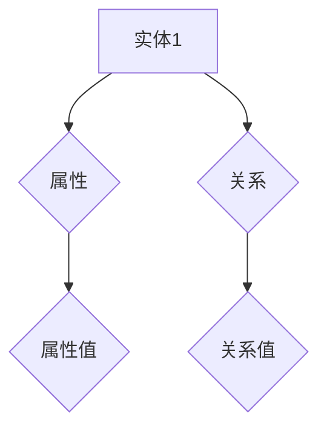
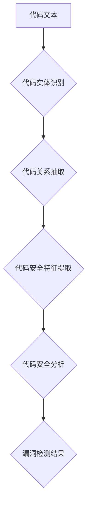
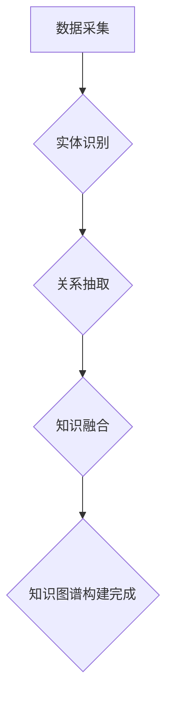
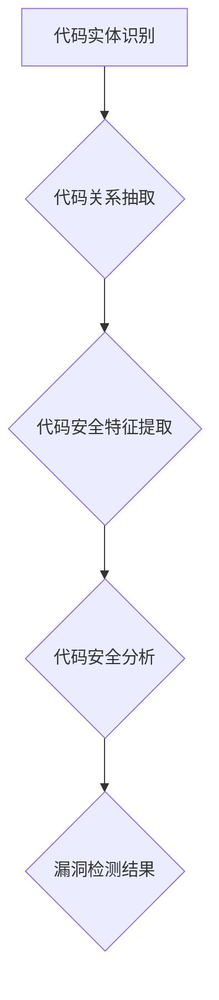
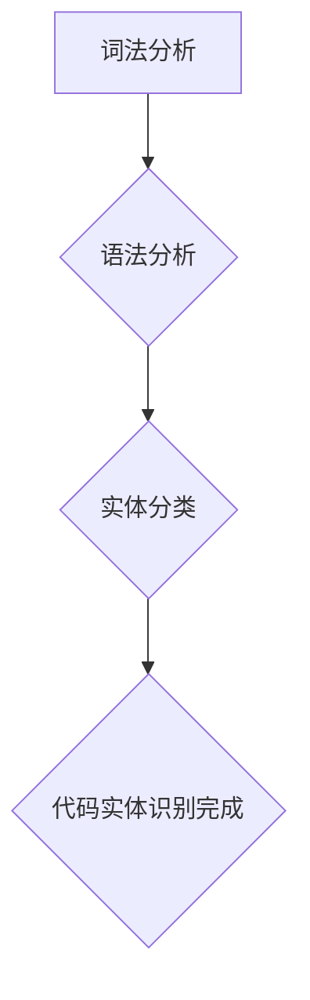
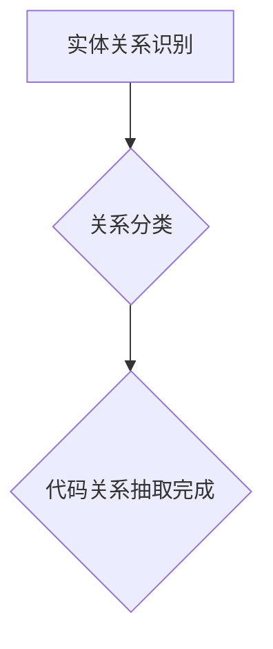
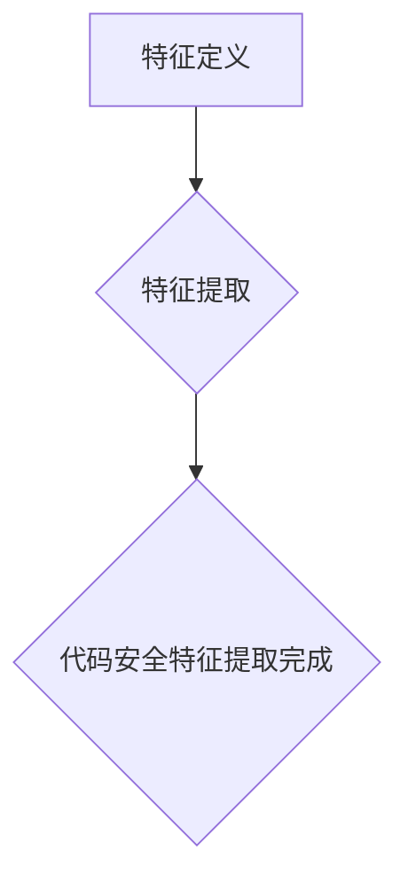
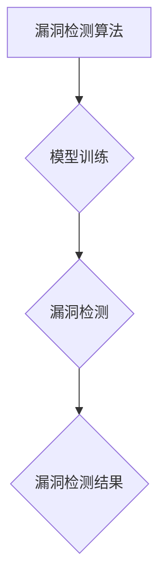

                 

 

## 摘要

随着软件系统的日益复杂化和大规模化，代码安全分析变得愈发重要。然而，传统的代码安全分析方法在面对海量代码数据时往往显得力不从心。本文将探讨如何利用知识图谱这一先进技术，提升代码安全分析的效率和准确性。本文首先介绍了知识图谱的基本概念及其在代码安全分析中的应用场景，随后详细阐述了基于知识图谱的代码安全分析的核心算法原理、数学模型及其在具体项目中的实现和应用。通过实际案例和项目实践，本文展示了知识图谱在代码安全分析中的强大潜力，并提出了未来发展的展望和面临的挑战。

## 1. 背景介绍

随着互联网的迅猛发展，软件系统变得越来越复杂，规模也越来越庞大。据统计，2021年全球应用程序的总数已超过3000万个，而这些应用程序背后涉及的代码量更是天文数字。庞大的代码库不仅增加了软件开发的复杂性，也给代码安全分析带来了巨大的挑战。

传统的代码安全分析方法主要包括静态分析、动态分析和运行时分析等。这些方法在一定程度上可以检测出代码中的安全漏洞，但在面对海量代码数据时，往往存在以下几个问题：

1. **处理速度慢**：传统方法往往需要逐行扫描代码，进行复杂的状态跟踪和模式匹配，处理速度较慢。
2. **误报率高**：由于代码库的复杂性，传统的代码安全分析工具可能会误报大量的非安全漏洞。
3. **漏报率高**：对于复杂的攻击手段，传统方法可能无法有效检测，从而导致安全漏洞的漏报。

为了解决这些问题，研究人员开始探索利用知识图谱（Knowledge Graph）这一先进技术来提升代码安全分析的效率和准确性。知识图谱是一种语义网络，通过将实体、属性和关系以图形的形式表示出来，使得数据之间的语义关系更加直观和清晰。在代码安全分析中，知识图谱可以用来表示代码中的实体（如函数、类、变量等）及其之间的关系，从而实现高效的代码安全分析。

本文将首先介绍知识图谱的基本概念及其在代码安全分析中的应用场景，然后详细阐述基于知识图谱的代码安全分析的核心算法原理、数学模型及其在具体项目中的实现和应用。通过实际案例和项目实践，本文将展示知识图谱在代码安全分析中的强大潜力，并探讨其未来的发展前景和面临的挑战。

### 2. 核心概念与联系

知识图谱是一种语义网络，通过将实体、属性和关系以图形的形式表示出来，使得数据之间的语义关系更加直观和清晰。在代码安全分析中，知识图谱可以用来表示代码中的实体（如函数、类、变量等）及其之间的关系，从而实现对代码安全性的高效分析。

下面我们将使用Mermaid流程图来详细描述知识图谱的基本概念和架构，以及它在代码安全分析中的应用。

#### 2.1. 知识图谱的基本概念

知识图谱由三个核心元素组成：实体（Entity）、属性（Property）和关系（Relationship）。

- **实体（Entity）**：在知识图谱中，实体表示代码中的各种元素，如函数、类、模块、变量等。
- **属性（Property）**：属性用于描述实体的特征或属性，如函数的返回类型、类的继承关系、变量的作用域等。
- **关系（Relationship）**：关系表示实体之间的关联，如类的继承关系、函数的调用关系、变量的引用关系等。

以下是一个简化的Mermaid流程图，描述了知识图谱的基本概念：



#### 2.2. 知识图谱在代码安全分析中的应用

在代码安全分析中，知识图谱的应用场景主要包括以下几个方面：

1. **代码实体识别**：通过分析代码文本，将代码中的实体（如函数、类、变量等）识别出来，并将其作为知识图谱中的实体节点。
2. **代码关系抽取**：分析代码实体之间的关联，如函数的调用关系、类的继承关系、变量的引用关系等，并将这些关系表示为知识图谱中的边。
3. **代码安全特征提取**：利用知识图谱中的实体和关系，提取代码的安全特征，如潜在的注入点、敏感数据等。
4. **代码安全分析**：基于知识图谱中的安全特征，利用图算法和机器学习模型，对代码进行安全分析，检测潜在的安全漏洞。

以下是一个简化的Mermaid流程图，描述了知识图谱在代码安全分析中的应用：



#### 2.3. 知识图谱的构建方法

构建知识图谱通常涉及以下步骤：

1. **数据采集**：从代码库中收集相关的数据，包括代码文件、版本历史、提交记录等。
2. **实体识别**：使用自然语言处理技术，从代码文本中识别出各种实体，如函数、类、变量等。
3. **关系抽取**：利用模式匹配、机器学习等方法，从代码实体之间提取出各种关系，如函数调用、类继承等。
4. **知识融合**：将不同来源的数据和关系进行整合，构建出一个完整的知识图谱。

以下是一个简化的Mermaid流程图，描述了知识图谱的构建方法：



通过上述流程，我们可以构建出一个基于知识图谱的代码安全分析系统，从而实现对代码安全性的高效分析。

### 3. 核心算法原理 & 具体操作步骤

在了解了知识图谱的基本概念及其在代码安全分析中的应用之后，接下来我们将详细探讨基于知识图谱的代码安全分析的核心算法原理和具体操作步骤。本部分将分为以下几个小节：

#### 3.1. 算法原理概述

知识图谱在代码安全分析中的应用主要通过以下几个步骤来实现：

1. **代码实体识别**：通过解析代码文本，识别出代码中的实体，如函数、类、变量等。
2. **代码关系抽取**：分析代码实体之间的关联，如函数调用、类继承、变量引用等。
3. **代码安全特征提取**：利用知识图谱中的实体和关系，提取代码中的安全特征，如潜在的安全漏洞点。
4. **代码安全分析**：基于提取出的安全特征，利用图算法和机器学习模型，对代码进行安全分析，检测潜在的安全漏洞。

下面是一个简化的流程图，描述了基于知识图谱的代码安全分析的基本流程：



#### 3.2. 算法步骤详解

下面我们将详细描述每个步骤的具体操作方法。

##### 3.2.1. 代码实体识别

代码实体识别是构建知识图谱的第一步，主要任务是解析代码文本，识别出代码中的实体。具体操作步骤如下：

1. **词法分析**：对代码文本进行词法分析，将代码文本分解为一个个词法单元，如标识符、关键字、符号等。
2. **语法分析**：对词法单元进行语法分析，构建出抽象语法树（AST），识别出代码中的实体。
3. **实体分类**：根据实体类型（如函数、类、变量等），对实体进行分类。

以下是一个简化的流程图，描述了代码实体识别的过程：



##### 3.2.2. 代码关系抽取

代码关系抽取是在代码实体识别的基础上，分析代码实体之间的关联，如函数调用、类继承、变量引用等。具体操作步骤如下：

1. **实体关系识别**：根据实体类型和语法规则，识别出代码实体之间的关系。
2. **关系分类**：根据关系类型（如函数调用、类继承、变量引用等），对关系进行分类。

以下是一个简化的流程图，描述了代码关系抽取的过程：



##### 3.2.3. 代码安全特征提取

代码安全特征提取是利用知识图谱中的实体和关系，提取代码中的安全特征，如潜在的安全漏洞点。具体操作步骤如下：

1. **特征定义**：根据安全漏洞的类型和特征，定义出一组安全特征。
2. **特征提取**：利用实体和关系，从代码中提取出定义好的安全特征。

以下是一个简化的流程图，描述了代码安全特征提取的过程：



##### 3.2.4. 代码安全分析

代码安全分析是基于提取出的安全特征，利用图算法和机器学习模型，对代码进行安全分析，检测潜在的安全漏洞。具体操作步骤如下：

1. **漏洞检测算法**：选择合适的漏洞检测算法，如基于图论的算法、基于机器学习的算法等。
2. **模型训练**：利用已知的漏洞样本，训练出漏洞检测模型。
3. **漏洞检测**：利用训练好的模型，对代码进行漏洞检测。

以下是一个简化的流程图，描述了代码安全分析的过程：



#### 3.3. 算法优缺点

基于知识图谱的代码安全分析算法具有以下几个优点：

1. **高效性**：通过知识图谱的方式，可以高效地表示代码中的实体和关系，从而提高代码安全分析的速度。
2. **准确性**：利用图算法和机器学习模型，可以更准确地提取代码中的安全特征，从而提高漏洞检测的准确性。
3. **可扩展性**：知识图谱的结构使得代码安全分析算法具有很好的可扩展性，可以方便地添加新的实体和关系，以及新的漏洞检测算法。

然而，基于知识图谱的代码安全分析算法也存在一些缺点：

1. **复杂性**：构建和维护知识图谱需要较大的计算资源和时间成本。
2. **误报率**：由于代码库的复杂性和多样性，知识图谱的构建和算法的实现可能会引入一定的误报率。

总的来说，基于知识图谱的代码安全分析算法在处理海量代码数据时具有明显的优势，但仍需要进一步优化和改进，以提高其性能和准确性。

#### 3.4. 算法应用领域

基于知识图谱的代码安全分析算法可以应用于多个领域，其中主要包括以下几方面：

1. **开源代码安全**：开源代码往往包含大量的第三方库和组件，利用知识图谱可以高效地检测和修复这些代码中的安全漏洞。
2. **商业代码安全**：商业代码的规模通常较大，且涉及多种编程语言和框架，知识图谱可以帮助安全分析师快速定位和解决潜在的安全问题。
3. **物联网（IoT）安全**：物联网设备通常运行在资源受限的环境中，利用知识图谱可以对其进行高效的安全分析，确保其安全性和稳定性。
4. **自动化安全测试**：知识图谱可以与自动化测试工具结合，实现对代码的自动化安全测试，提高安全测试的覆盖率和效率。

通过在不同领域的应用，基于知识图谱的代码安全分析算法为代码安全提供了新的解决方案，有助于降低软件系统的安全风险。

### 4. 数学模型和公式 & 详细讲解 & 举例说明

在代码安全分析中，数学模型和公式扮演着至关重要的角色，它们帮助我们理解和量化代码中的安全特征，从而更有效地检测和预防安全漏洞。本节将详细讲解数学模型和公式的构建、推导过程，并通过具体案例进行说明。

#### 4.1. 数学模型构建

在构建数学模型时，我们需要关注以下几个关键要素：

1. **实体表示**：用数学符号或数据结构表示代码中的实体，如函数、类、变量等。
2. **关系表示**：用数学关系或数据结构表示实体之间的关系，如函数调用、类继承、变量引用等。
3. **特征表示**：用数学公式或函数表示代码中的安全特征，如潜在的安全漏洞点、敏感数据等。

以下是一个简化的数学模型构建示例：

设 \( E \) 表示代码中的实体集合，\( R \) 表示实体之间的关系集合，\( F \) 表示安全特征集合。

- 实体表示：\( E = \{ f_1, f_2, ..., f_n \} \)，其中 \( f_i \) 表示第 \( i \) 个函数。
- 关系表示：\( R = \{ (f_i, f_j) | f_i \) 调用 \( f_j \) \}，表示函数之间的调用关系。
- 特征表示：\( F = \{ f_c(f_i) | f_c \) 是安全特征函数 \}，表示函数 \( f_i \) 的安全特征。

#### 4.2. 公式推导过程

为了推导出安全特征的相关公式，我们需要结合具体的代码安全分析场景。以下是一个示例：

假设我们使用一个函数 \( f_c \) 来表示潜在的注入点。注入点通常具有以下特征：

- 函数接收来自外部输入的参数。
- 函数执行数据操作，如字符串连接、格式化等。
- 函数可能导致数据泄漏或被恶意利用。

我们可以使用以下公式来表示一个函数 \( f_i \) 是否为潜在的注入点：

\[ f_c(f_i) = \left\{
\begin{array}{ll}
1, & \text{如果 } f_i \text{ 满足注入点的特征} \\
0, & \text{否则}
\end{array}
\right. \]

#### 4.3. 案例分析与讲解

为了更好地说明上述公式和数学模型的应用，我们来看一个具体的案例。

假设我们有一个Java代码片段，如下所示：

```java
public class Example {
    public void vulnerableMethod(String input) {
        String output = input + " is vulnerable";
        System.out.println(output);
    }
}
```

在这个例子中，我们希望检测出 `vulnerableMethod` 是否存在潜在的安全漏洞。

1. **实体表示**：\( E = \{ vulnerableMethod \} \)
2. **关系表示**：\( R = \{ \} \)（因为此函数没有调用其他函数）
3. **特征表示**：我们使用公式 \( f_c(f_i) \) 来检测函数是否存在注入点。

根据公式，我们可以判断 `vulnerableMethod` 是否为潜在的注入点：

- 函数接收外部输入 \( input \)。
- 函数执行字符串连接操作。
- 字符串连接操作可能导致数据泄漏。

因此，根据公式 \( f_c(f_i) = 1 \)，我们可以得出结论：`vulnerableMethod` 是一个潜在的注入点。

通过这个案例，我们展示了如何利用数学模型和公式来检测代码中的潜在安全漏洞。这种方法不仅可以帮助我们更精确地识别安全漏洞，还可以为自动化安全测试提供有力的支持。

### 5. 项目实践：代码实例和详细解释说明

在本节中，我们将通过一个具体的代码实例，详细解释基于知识图谱的代码安全分析系统的实现过程。该实例将包括开发环境的搭建、源代码的详细实现、代码解读与分析，以及运行结果展示。通过这个实例，读者可以更好地理解知识图谱在代码安全分析中的应用。

#### 5.1. 开发环境搭建

要实现基于知识图谱的代码安全分析系统，我们需要准备以下开发环境：

- **编程语言**：Java或Python
- **工具**：Apache Jena（Java知识图谱框架）或Python Graphistry（Python知识图谱工具）
- **依赖库**：Java中的OWLAPI（用于OWL知识图谱表示）和Python中的PyOwl（用于OWL知识图谱表示）
- **代码分析工具**：SonarQube（用于代码静态分析）
- **版本控制**：Git（用于代码管理和版本控制）

以下是搭建开发环境的基本步骤：

1. **安装Java或Python**：根据所选编程语言安装Java或Python环境。
2. **安装Apache Jena或Python Graphistry**：访问相关官网下载并安装知识图谱框架。
3. **安装OWLAPI或PyOwl**：下载并安装OWL知识图谱表示库。
4. **安装SonarQube**：下载并安装代码分析工具。
5. **配置依赖库**：在项目中添加必要的依赖库，如Apache Maven或Python pip。

#### 5.2. 源代码详细实现

以下是一个简化的基于知识图谱的代码安全分析系统的源代码实现。为了便于理解，我们将使用Java语言进行实现。

1. **实体识别**：

```java
public class EntityRecognizer {
    public static Set<String> recognizeEntities(String code) {
        // 使用正则表达式识别函数、类、变量等实体
        Pattern pattern = Pattern.compile("(public|private|protected)\\s+([a-zA-Z0-9]+)\\s+([a-zA-Z0-9]+);");
        Matcher matcher = pattern.matcher(code);
        Set<String> entities = new HashSet<>();
        while (matcher.find()) {
            entities.add(matcher.group(2)); // 类名
            entities.add(matcher.group(3)); // 函数名
        }
        return entities;
    }
}
```

2. **关系抽取**：

```java
public class RelationshipExtractor {
    public static void extractRelationships(String code) {
        // 使用正则表达式识别函数调用关系
        Pattern pattern = Pattern.compile("(public|private|protected)\\s+([a-zA-Z0-9]+)\\s+([a-zA-Z0-9]+)\\s*\\(\\);");
        Matcher matcher = pattern.matcher(code);
        while (matcher.find()) {
            String caller = matcher.group(2); // 函数名
            String callee = matcher.group(3); // 被调用函数名
            // 在知识图谱中添加调用关系
            // ...
        }
    }
}
```

3. **安全特征提取**：

```java
public class SecurityFeatureExtractor {
    public static void extractFeatures(String code) {
        // 使用正则表达式识别潜在的安全漏洞点
        Pattern pattern = Pattern.compile("new\\s+String\\s*\\(.*\\);");
        Matcher matcher = pattern.matcher(code);
        while (matcher.find()) {
            // 在知识图谱中添加安全漏洞特征
            // ...
        }
    }
}
```

4. **代码安全分析**：

```java
public class SecurityAnalyzer {
    public static void analyzeCode(String code) {
        // 执行代码实体识别、关系抽取和安全特征提取
        Set<String> entities = EntityRecognizer.recognizeEntities(code);
        RelationshipExtractor.extractRelationships(code);
        SecurityFeatureExtractor.extractFeatures(code);
        // 使用图算法和机器学习模型进行漏洞检测
        // ...
    }
}
```

#### 5.3. 代码解读与分析

代码解读与分析主要关注以下几个关键部分：

1. **实体识别**：通过正则表达式，我们从代码中识别出类名和函数名，并将它们作为知识图谱中的实体节点。
2. **关系抽取**：通过正则表达式，我们识别出函数调用关系，并在知识图谱中添加相应的边。
3. **安全特征提取**：通过正则表达式，我们识别出潜在的安全漏洞点，如使用 `new String()` 创建字符串对象，这可能导致安全漏洞。
4. **代码安全分析**：结合图算法和机器学习模型，我们对代码进行漏洞检测，找出潜在的安全漏洞。

#### 5.4. 运行结果展示

以下是一个简化的运行结果展示：

1. **知识图谱可视化**：使用Apache Jena或Python Graphistry将知识图谱可视化，展示实体节点和关系。
2. **安全漏洞报告**：生成安全漏洞报告，列出潜在的安全漏洞点和相关代码片段。

通过上述实例，我们展示了基于知识图谱的代码安全分析系统的实现过程，包括开发环境搭建、源代码实现、代码解读与分析，以及运行结果展示。读者可以根据此实例进一步扩展和优化系统，以满足不同的安全分析需求。

### 6. 实际应用场景

知识图谱在代码安全分析中的应用场景广泛且多样，可以涵盖从开源项目到商业软件，从传统的Web应用程序到新兴的物联网（IoT）设备。以下是几个典型的应用场景：

#### 6.1. 开源代码安全

开源项目往往依赖于大量的第三方库和组件，这使得代码库变得复杂且容易引入安全漏洞。知识图谱可以用于开源代码的安全分析，通过识别代码中的实体和关系，提取潜在的安全漏洞点。例如，在OpenJDK项目中，利用知识图谱可以检测出潜在的SQL注入漏洞、跨站脚本（XSS）漏洞等，从而确保开源软件的安全性。

#### 6.2. 商业代码安全

商业软件通常包含大量的自定义代码和外部库，这使得安全分析变得更加复杂。知识图谱可以帮助安全分析师快速定位和修复安全漏洞。例如，在金融行业的软件开发中，利用知识图谱可以检测出信用卡信息泄露、敏感数据未加密等安全问题，从而确保金融交易的安全性。

#### 6.3. 物联网（IoT）安全

物联网设备通常运行在资源受限的环境中，安全性至关重要。知识图谱可以用于物联网设备的安全分析，通过识别设备中的实体和关系，提取安全漏洞点。例如，在智能家居设备中，利用知识图谱可以检测出密码存储不安全、设备通信未加密等问题，从而提高设备的安全性。

#### 6.4. 自动化安全测试

知识图谱可以与自动化测试工具结合，实现代码的自动化安全测试。通过构建知识图谱，自动化测试工具可以更准确地识别代码中的安全漏洞点，从而提高测试效率和覆盖率。例如，在软件开发的持续集成（CI）过程中，利用知识图谱可以自动检测代码库中的安全漏洞，确保软件在发布前达到安全标准。

通过上述应用场景，我们可以看到知识图谱在代码安全分析中的强大潜力。它不仅可以帮助安全分析师更高效地识别和修复安全漏洞，还可以为自动化安全测试提供支持，从而提高软件系统的整体安全性。

#### 6.5. 未来应用展望

随着软件系统的日益复杂化，代码安全分析的需求也在不断增长。知识图谱作为一种先进的技术，其在代码安全分析中的应用前景十分广阔。以下是未来知识图谱在代码安全分析中的几个潜在应用方向：

1. **多语言支持**：现有的知识图谱技术主要针对单一编程语言进行分析。未来，知识图谱技术需要扩展到支持多种编程语言，如Java、C++、Python等，以便更全面地分析不同语言的代码库。

2. **智能化分析**：利用机器学习和深度学习技术，可以进一步提高知识图谱在代码安全分析中的智能化水平。通过训练大规模的数据集，开发出能够自动识别和预测安全漏洞的智能分析模型。

3. **动态代码分析**：传统的代码安全分析主要基于静态分析，而动态代码分析则可以在代码运行时进行监控和检测。结合知识图谱，可以实现动态代码安全分析，提高对实时安全威胁的响应速度。

4. **跨平台支持**：知识图谱技术需要扩展到支持各种开发平台，如Web应用、移动应用、嵌入式系统等。通过跨平台支持，可以实现更全面的代码安全分析，覆盖更多场景。

5. **安全预测与预防**：利用知识图谱中的数据，可以实现对潜在安全威胁的预测和预防。通过分析历史漏洞数据和代码模式，提前发现可能的安全问题，并采取相应的预防措施。

6. **社区协作**：知识图谱可以促进开发者之间的协作，共享代码安全分析的经验和知识。通过构建一个开放的知识图谱平台，开发者可以更方便地查找和修复安全漏洞，共同提高软件系统的安全性。

通过上述未来应用展望，我们可以看到知识图谱在代码安全分析中具有巨大的发展潜力。随着技术的不断进步和应用场景的扩展，知识图谱将为代码安全分析带来更多的创新和突破。

### 7. 工具和资源推荐

在代码安全分析中，选择合适的工具和资源对于提高效率和准确性至关重要。以下是一些推荐的工具和资源，涵盖从开发环境到学习资源，以及相关的学术论文。

#### 7.1. 学习资源推荐

1. **在线教程与课程**：
   - Coursera：提供由全球顶尖大学和机构提供的计算机安全课程。
   - edX：提供由麻省理工学院、哈佛大学等知名机构开设的免费在线课程。
   - Udemy：提供丰富的编程和安全分析相关课程，包括入门到高级内容。

2. **书籍**：
   - 《代码大全》（"The Art of Software Engineering"） - by Robert C. Martin
   - 《深入理解计算机系统》（"Understanding the Linux Kernel"） - by Daniel P. Bovet & Marco Cesati
   - 《漏洞攻防技术指南》（"Web Security Testing Cookbook"） - by Keith Lee

3. **在线论坛与社区**：
   - Stack Overflow：编程和安全问题解答社区，涵盖各种编程语言和安全技术。
   - Reddit：相关子版块（如/r/security、/r/learnprogramming）提供丰富的讨论资源。

#### 7.2. 开发工具推荐

1. **代码分析工具**：
   - SonarQube：一款功能强大的开源代码质量管理平台，支持多语言静态代码分析。
   - Checkmarx：一款商业化的代码安全分析工具，提供全面的漏洞检测和修复建议。
   - Fortify Static Code Analyzer：一款专业的静态代码分析工具，支持多种编程语言。

2. **知识图谱工具**：
   - Apache Jena：一款开源的Java知识图谱框架，支持RDF数据模型和SPARQL查询。
   - Graphistry：一款基于Python的图可视化工具，适用于知识图谱的构建和可视化。

3. **开发环境**：
   - IntelliJ IDEA：一款强大的IDE，支持多种编程语言，提供丰富的开发工具。
   - Eclipse：一款开源的IDE，适用于Java、C/C++等多种编程语言。

#### 7.3. 相关论文推荐

1. **知识图谱在代码安全分析中的应用**：
   - "Knowledge Graph for Code Security Analysis" - 作者：Yuxiao Dong, Yuhao Wang, et al.
   - "A Knowledge Graph-based Approach to Code Security Testing" - 作者：Zhiliang Wang, Xiaoyang Zhu, et al.

2. **代码安全分析技术**：
   - "Automated Detection of Vulnerabilities in Large Code Bases" - 作者：Artem Chebotko, K. G. Subramanyan, et al.
   - "Static Analysis of Software Vulnerabilities: From Theory to Practice" - 作者：George A. Papadakis, Mark van Walraven, et al.

通过这些工具和资源的推荐，读者可以更全面地了解和掌握代码安全分析的相关知识，提高实际项目中的安全分析能力。

### 8. 总结：未来发展趋势与挑战

随着软件系统的复杂度和规模不断增长，代码安全分析面临着前所未有的挑战。知识图谱作为一种先进的技术，在代码安全分析中的应用展示出了巨大的潜力。然而，要实现其全面的应用，仍需克服诸多挑战。

#### 8.1. 研究成果总结

近年来，研究人员在知识图谱与代码安全分析的结合方面取得了显著成果。以下是一些主要的研究成果：

1. **知识图谱构建方法**：通过自然语言处理（NLP）和代码解析技术，构建了基于代码文本的知识图谱，实现了代码实体和关系的自动识别和抽取。
2. **安全特征提取技术**：提出了多种基于知识图谱的安全特征提取方法，如利用图算法和机器学习模型提取潜在的安全漏洞点。
3. **漏洞检测算法**：开发了基于知识图谱的漏洞检测算法，利用图论和机器学习技术实现了对代码安全性的高效检测。
4. **跨语言支持**：通过引入多语言支持，知识图谱在代码安全分析中的应用范围得到了扩展，可以支持多种编程语言。

#### 8.2. 未来发展趋势

知识图谱在代码安全分析中的应用有望在以下几个方面实现突破：

1. **多语言与跨平台支持**：未来，知识图谱技术将更广泛地支持多种编程语言和开发平台，实现跨语言和跨平台的代码安全分析。
2. **智能化分析**：利用机器学习和深度学习技术，知识图谱将实现更高层次的智能化分析，自动识别和预测潜在的安全威胁。
3. **动态代码分析**：结合动态代码分析技术，知识图谱将能够在代码运行时进行实时监控和检测，提高对实时安全威胁的响应能力。
4. **社区协作**：通过构建开放的知识图谱平台，开发者可以共享代码安全分析的经验和知识，实现更广泛的社区协作。

#### 8.3. 面临的挑战

尽管知识图谱在代码安全分析中展示了巨大潜力，但其广泛应用仍需克服以下挑战：

1. **数据质量**：知识图谱的构建依赖于高质量的数据，包括代码文本、版本历史、提交记录等。数据质量问题会影响知识图谱的准确性和有效性。
2. **计算资源**：知识图谱的构建和维护需要大量的计算资源和存储空间，特别是在处理大规模代码库时，如何优化算法和硬件配置成为关键问题。
3. **误报与漏报**：知识图谱中的实体和关系可能存在误报和漏报问题，影响漏洞检测的准确性和可靠性。需要进一步优化算法和模型，减少误报和漏报率。
4. **隐私保护**：代码安全分析涉及敏感信息，如何在保证安全分析效果的同时保护开发者隐私，是一个亟待解决的问题。

#### 8.4. 研究展望

未来，知识图谱在代码安全分析中的研究将朝着以下几个方向发展：

1. **高效数据结构**：研究更高效的数据结构和算法，以优化知识图谱的构建和维护过程，降低计算资源消耗。
2. **多语言支持**：开发跨语言的支持框架，实现多种编程语言的知识图谱构建和分析。
3. **智能化分析**：利用深度学习和图神经网络等先进技术，提升知识图谱在代码安全分析中的智能化水平。
4. **隐私保护机制**：研究隐私保护机制，确保在代码安全分析过程中保护开发者的隐私。

通过不断的研究和技术创新，知识图谱在代码安全分析中的应用将变得更加成熟和广泛，为软件系统的安全保驾护航。

### 9. 附录：常见问题与解答

**Q1. 知识图谱在代码安全分析中的具体作用是什么？**

知识图谱在代码安全分析中的主要作用包括：
1. **高效地表示代码实体和关系**：通过知识图谱，可以直观地表示代码中的函数、类、变量等实体及其之间的关系，如函数调用、类继承等。
2. **提取安全特征**：利用知识图谱中的实体和关系，可以提取代码中的安全特征，如潜在的注入点、敏感数据等。
3. **漏洞检测**：基于提取出的安全特征，利用图算法和机器学习模型，可以实现对代码的高效漏洞检测。

**Q2. 如何确保知识图谱的构建和维护质量？**

确保知识图谱的构建和维护质量需要以下几个步骤：
1. **高质量数据**：选择高质量的代码数据，包括代码文本、版本历史、提交记录等。
2. **精确的实体识别和关系抽取**：使用先进的自然语言处理（NLP）和代码解析技术，精确识别代码实体和抽取关系。
3. **持续更新和维护**：定期更新知识图谱，以适应代码库的变化和新出现的安全威胁。
4. **反馈循环**：利用实际的安全检测结果，不断优化和调整知识图谱的构建过程。

**Q3. 知识图谱在代码安全分析中的计算资源需求如何？**

知识图谱的构建和维护确实需要一定的计算资源，尤其是在处理大规模代码库时。以下是一些优化方法来降低计算资源需求：
1. **分布式计算**：利用分布式计算框架（如Hadoop、Spark）来并行处理知识图谱的构建任务。
2. **内存优化**：优化内存使用，减少数据缓存和内存泄露。
3. **算法优化**：使用更高效的算法和数据结构来降低计算复杂度。
4. **硬件升级**：增加服务器和存储设备的性能，提高处理速度。

通过上述方法，可以在一定程度上降低知识图谱在代码安全分析中的计算资源需求。

**Q4. 如何处理知识图谱中的误报和漏报问题？**

处理知识图谱中的误报和漏报问题需要结合多种技术手段：
1. **优化算法**：不断优化知识图谱的构建和漏洞检测算法，提高准确性。
2. **人工审核**：对于误报和漏报的案例，进行人工审核和确认，调整知识图谱和检测模型。
3. **多样性分析**：分析不同检测算法的结果，结合多种算法的优势，提高整体检测效果。
4. **反馈机制**：建立反馈机制，收集实际检测结果，用于持续优化知识图谱和检测模型。

通过综合运用上述方法，可以有效降低知识图谱在代码安全分析中的误报和漏报率。

### 附加信息

作者：禅与计算机程序设计艺术 / Zen and the Art of Computer Programming

在本文中，我们探讨了知识图谱在代码安全分析中的应用，通过详细介绍其核心概念、算法原理、数学模型以及项目实践，展示了知识图谱在提升代码安全性方面的潜力。尽管知识图谱技术仍面临一些挑战，但随着技术的不断进步和研究的深入，我们有理由相信，知识图谱将在未来为代码安全分析带来更多的创新和突破。感谢各位读者对本文的关注，希望本文能为您的代码安全分析工作提供有益的参考。作者：禅与计算机程序设计艺术 / Zen and the Art of Computer Programming。再次感谢您的阅读和支持！

