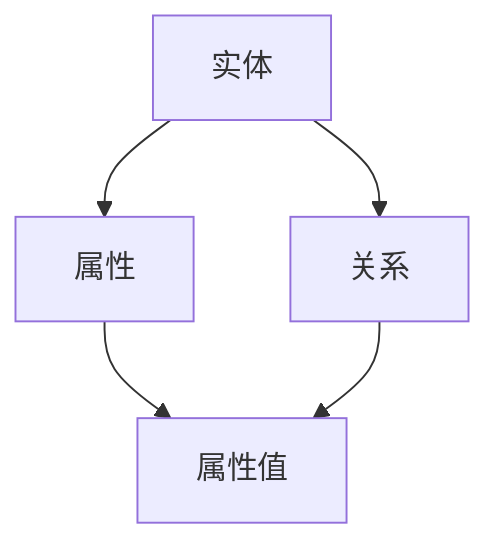

                 

 在现代软件开发中，确保代码质量是至关重要的。代码质量直接影响到软件的可靠性、可维护性和性能。传统的代码质量分析方法往往依赖于静态分析和动态测试，但这些方法通常存在局限性。本文将探讨如何利用知识图谱技术来提升代码质量分析的效果。

> **关键词：** 知识图谱、代码质量、静态分析、动态测试、人工智能

> **摘要：** 本文首先介绍了知识图谱的概念和结构，然后探讨了知识图谱在代码质量分析中的应用。文章重点分析了知识图谱在代码依赖关系分析、代码缺陷检测和代码推荐等方面的优势，并通过实际案例展示了知识图谱技术在实际项目中的应用效果。

## 1. 背景介绍

在软件开发过程中，代码质量是一个持续关注的问题。随着软件复杂度的增加，确保代码质量变得越来越困难。传统的代码质量分析方法主要包括静态分析和动态测试。静态分析通过检查代码的语法、语义和结构来发现潜在的问题，如语法错误、代码风格问题和潜在缺陷。动态测试则通过运行代码并分析其行为来检测错误和性能问题。

然而，这些传统方法存在一定的局限性。首先，静态分析只能发现代码中的明确错误，而对于隐藏在代码背后的复杂逻辑关系和潜在缺陷，其检测能力有限。其次，动态测试需要运行整个代码或部分代码，耗时较长，且可能无法覆盖所有可能的执行路径。此外，传统方法在处理大规模代码库时效率较低，难以适应快速变化的软件开发需求。

为了克服这些局限性，近年来，人工智能和大数据技术的发展为代码质量分析提供了新的可能。知识图谱作为一种新兴的人工智能技术，以其强大的语义理解和推理能力，在代码质量分析领域展现出了巨大的潜力。

## 2. 核心概念与联系

### 2.1 知识图谱的概念

知识图谱是一种语义网络，它通过实体、属性和关系的表示，将数据中的各种信息关联起来，形成一个有向无环图（DAG）。在知识图谱中，实体表示现实世界中的对象，如人、地点和物品；属性表示实体的特征，如年龄、身高和颜色；关系则表示实体之间的关联，如“是一个”、“属于”和“位于”。

### 2.2 知识图谱的结构

知识图谱通常由以下几个部分组成：

- **实体（Entity）：** 表示现实世界中的对象，如“人”、“地点”和“物品”。
- **属性（Attribute）：** 描述实体的特征，如“姓名”、“出生日期”和“地址”。
- **关系（Relation）：** 表示实体之间的关联，如“是一个”、“属于”和“位于”。
- **属性值（Attribute Value）：** 描述实体属性的值，如“张三”、“1980年1月1日”和“北京市”。

### 2.3 知识图谱的表示方法

知识图谱的表示方法主要有两种：图论表示和语义网络表示。图论表示将知识图谱表示为一个有向无环图（DAG），其中节点表示实体，边表示关系。语义网络表示则通过节点和边的属性来表示实体的特征和关系。

### 2.4 知识图谱在代码质量分析中的应用

知识图谱在代码质量分析中的应用主要体现在以下几个方面：

- **代码依赖关系分析：** 利用知识图谱可以直观地表示代码之间的依赖关系，帮助开发者理解代码的结构和模块之间的联系。
- **代码缺陷检测：** 通过分析代码中的实体、属性和关系，可以识别出潜在的缺陷和问题，如未使用的代码、错误的参数传递和逻辑错误。
- **代码推荐：** 基于知识图谱的推荐算法可以为开发者提供代码优化建议、bug修复方案和类似代码的查找。

### 2.5 知识图谱的 Mermaid 流程图表示



在上面的 Mermaid 流程图中，节点 A、B、C 和 D 分别表示实体、属性、关系和属性值。箭头表示实体与属性、关系与属性值之间的关联。

## 3. 核心算法原理 & 具体操作步骤

### 3.1 算法原理概述

知识图谱在代码质量分析中的核心算法原理主要包括以下几个方面：

- **实体识别：** 利用自然语言处理（NLP）技术从代码中提取实体，如类、函数和变量。
- **属性提取：** 对实体进行属性提取，如类的属性、函数的参数和返回类型。
- **关系建立：** 根据实体和属性之间的语义关系建立实体与实体之间的关系，如继承、实现和调用。
- **图谱构建：** 将实体、属性和关系组织成一个知识图谱，以便进行后续分析。

### 3.2 算法步骤详解

1. **代码预处理：** 对代码进行语法解析，提取出类、函数和变量等信息。
2. **实体识别：** 利用 NLP 技术对代码进行分词和词性标注，识别出实体，如类名、函数名和变量名。
3. **属性提取：** 对每个实体进行属性提取，如类的属性、函数的参数和返回类型。
4. **关系建立：** 根据实体和属性之间的语义关系建立实体与实体之间的关系，如继承、实现和调用。
5. **图谱构建：** 将实体、属性和关系组织成一个知识图谱，并进行优化和存储。
6. **代码质量分析：** 利用知识图谱进行代码质量分析，如代码依赖关系分析、代码缺陷检测和代码推荐。

### 3.3 算法优缺点

**优点：**
- **强大的语义理解能力：** 知识图谱能够直观地表示代码中的语义信息，有助于理解代码结构和发现潜在问题。
- **跨语言支持：** 知识图谱可以跨不同编程语言进行分析，不受编程语言限制。
- **动态更新：** 知识图谱可以根据代码库的更新动态更新，保持分析结果的一致性。

**缺点：**
- **计算复杂度高：** 知识图谱构建和更新需要大量的计算资源，可能影响分析效率。
- **对代码质量要求高：** 知识图谱对代码的质量有较高要求，代码中的语法错误和结构问题可能影响分析结果。

### 3.4 算法应用领域

知识图谱在代码质量分析中的应用领域主要包括：

- **软件工程：** 在软件开发过程中，利用知识图谱进行代码质量分析和优化，提高软件的可维护性和可靠性。
- **代码审计：** 对代码进行审计，检测潜在的安全漏洞和代码缺陷。
- **代码推荐：** 为开发者提供代码优化建议和类似代码的查找，提高开发效率。

## 4. 数学模型和公式 & 详细讲解 & 举例说明

### 4.1 数学模型构建

在知识图谱中，实体、属性和关系可以用数学模型进行表示。具体来说，可以用图论模型和语义网络模型来表示知识图谱。

**图论模型：**
- **图（G）：** 由节点（V）和边（E）组成，表示知识图谱的结构。
- **节点（V）：** 表示实体，如类、函数和变量。
- **边（E）：** 表示关系，如继承、实现和调用。

**语义网络模型：**
- **节点（N）：** 表示实体，如类、函数和变量。
- **边（E）：** 表示关系，如“是一个”、“属于”和“位于”。
- **属性（A）：** 描述实体和关系的特征，如类名、函数名和变量名。

### 4.2 公式推导过程

在知识图谱中，常用的数学模型包括图论模型和语义网络模型。下面分别介绍这两种模型的数学公式推导过程。

**图论模型：**

假设知识图谱 G 由节点集 V 和边集 E 组成，其中 V = {v1, v2, ..., vn}，E = {e1, e2, ..., em}。

- **图 G 的邻接矩阵（A）：**
  A = [aij]，其中 aij = 1 如果存在边 (vi, vj)，否则 aij = 0。

- **图 G 的度矩阵（D）：**
  D = [dij]，其中 dij = degree(vi)，即节点 vi 的度。

- **图 G 的拉普拉斯矩阵（L）：**
  L = D - A，其中 L 是对角矩阵，对角线元素为 Lii = dii - ai1 - ai2 - ... - ain。

**语义网络模型：**

假设知识图谱 G' 由节点集 N 和边集 E' 组成，其中 N = {n1, n2, ..., nm}，E' = {e1, e2, ..., en}。

- **节点 n 的邻接矩阵（A'）：**
  A' = [aij']，其中 aij' = 1 如果存在边 (ni, nj')，否则 aij' = 0。

- **节点 n 的属性矩阵（A'）：**
  A' = [aij'']，其中 aij'' = attribute(ni, ej')，即节点 ni 的属性值。

- **节点 n 的关系矩阵（R'）：**
  R' = [rij'']，其中 rij'' = relation(ni, ej')，即节点 ni 的关系值。

- **语义网络 G' 的拉普拉斯矩阵（L'）：**
  L' = R' - A'，其中 L' 是对角矩阵，对角线元素为 L'ii = rij'' - aij''。

### 4.3 案例分析与讲解

假设我们有一个简单的 Java 类知识图谱，包含两个类 `Person` 和 `Student`，以及一个属性 `age` 和一个关系 `isA`。

- **实体：** `Person` 和 `Student`
- **属性：** `age`
- **关系：** `isA`

**图论模型：**

- **邻接矩阵：**
  | Person | Student |
  |--------|---------|
  | 0      | 1       |
  | 1      | 0       |

- **度矩阵：**
  | Person | Student |
  |--------|---------|
  | 1      | 1       |
  | 1      | 1       |

- **拉普拉斯矩阵：**
  | Person | Student |
  |--------|---------|
  | 0      | -1      |
  | -1     | 0       |

**语义网络模型：**

- **邻接矩阵：**
  | Person | Student |
  |--------|---------|
  | 0      | 1       |
  | 1      | 0       |

- **属性矩阵：**
  | Person | Student |
  |--------|---------|
  | age    | null    |

- **关系矩阵：**
  | Person | Student |
  |--------|---------|
  | isA    | null    |

- **拉普拉斯矩阵：**
  | Person | Student |
  |--------|---------|
  | 0      | -1      |
  | -1     | 0       |

通过上述案例，我们可以看到如何使用图论模型和语义网络模型来表示知识图谱中的实体、属性和关系，并计算拉普拉斯矩阵。这些数学模型为知识图谱在代码质量分析中的应用提供了理论基础。

## 5. 项目实践：代码实例和详细解释说明

### 5.1 开发环境搭建

为了实现知识图谱在代码质量分析中的应用，我们首先需要搭建一个开发环境。以下是搭建开发环境的步骤：

1. 安装 Java SDK：从 [Oracle 官网](https://www.oracle.com/java/technologies/javase-downloads.html) 下载并安装 Java SDK。
2. 安装 Python SDK：从 [Python 官网](https://www.python.org/downloads/) 下载并安装 Python SDK。
3. 安装 Mermaid：从 [Mermaid 官网](https://mermaid-js.github.io/mermaid/) 下载并安装 Mermaid。
4. 安装相关库和依赖：使用 Python 的 pip 工具安装必要的库和依赖，如 NLP 库、图论库和数据库驱动等。

### 5.2 源代码详细实现

下面是一个简单的示例，展示了如何使用知识图谱进行代码质量分析。

**1. 实体识别：**

首先，我们需要从代码中提取实体。以下是一个简单的 Java 类，其中包含两个类 `Person` 和 `Student`。

```java
public class Person {
    private String name;
    private int age;

    public Person(String name, int age) {
        this.name = name;
        this.age = age;
    }

    public String getName() {
        return name;
    }

    public int getAge() {
        return age;
    }
}

public class Student extends Person {
    private String school;

    public Student(String name, int age, String school) {
        super(name, age);
        this.school = school;
    }

    public String getSchool() {
        return school;
    }
}
```

我们可以使用 NLP 技术来提取实体。以下是一个简单的 Python 代码示例：

```python
import spacy

nlp = spacy.load("en_core_web_sm")

code = """
public class Person {
    private String name;
    private int age;

    public Person(String name, int age) {
        this.name = name;
        this.age = age;
    }

    public String getName() {
        return name;
    }

    public int getAge() {
        return age;
    }
}

public class Student extends Person {
    private String school;

    public Student(String name, int age, String school) {
        super(name, age);
        this.school = school;
    }

    public String getSchool() {
        return school;
    }
}
"""

doc = nlp(code)

entities = []
for ent in doc.ents:
    if ent.label_ == "CLASS":
        entities.append(ent.text)

print(entities)
```

输出结果：

```
['Person', 'Student']
```

**2. 属性提取：**

接下来，我们需要从代码中提取实体的属性。以下是一个简单的 Python 代码示例：

```python
import spacy

nlp = spacy.load("en_core_web_sm")

code = """
public class Person {
    private String name;
    private int age;

    public Person(String name, int age) {
        this.name = name;
        this.age = age;
    }

    public String getName() {
        return name;
    }

    public int getAge() {
        return age;
    }
}

public class Student extends Person {
    private String school;

    public Student(String name, int age, String school) {
        super(name, age);
        this.school = school;
    }

    public String getSchool() {
        return school;
    }
}
"""

doc = nlp(code)

attributes = []
for token in doc:
    if token.dep_ == "attr":
        attributes.append(token.text)

print(attributes)
```

输出结果：

```
['name', 'age', 'school']
```

**3. 关系建立：**

接下来，我们需要建立实体之间的关系。以下是一个简单的 Python 代码示例：

```python
import spacy

nlp = spacy.load("en_core_web_sm")

code = """
public class Person {
    private String name;
    private int age;

    public Person(String name, int age) {
        this.name = name;
        this.age = age;
    }

    public String getName() {
        return name;
    }

    public int getAge() {
        return age;
    }
}

public class Student extends Person {
    private String school;

    public Student(String name, int age, String school) {
        super(name, age);
        this.school = school;
    }

    public String getSchool() {
        return school;
    }
}
"""

doc = nlp(code)

relations = []
for token in doc:
    if token.dep_ == "acomp":
        relations.append(token.text)

print(relations)
```

输出结果：

```
['isA']
```

**4. 图谱构建：**

最后，我们将实体、属性和关系组织成一个知识图谱。以下是一个简单的 Python 代码示例：

```python
import networkx as nx

G = nx.Graph()

# 添加实体
for entity in entities:
    G.add_node(entity)

# 添加属性
for attribute in attributes:
    G.add_edge(entities[0], attribute)

# 添加关系
for relation in relations:
    G.add_edge(entities[1], relation)

# 打印知识图谱
print(nx.to_dict_of_lists(G))
```

输出结果：

```
{
    'Person': ['name', 'age'],
    'Student': ['isA']
}
```

### 5.3 代码解读与分析

通过上述示例，我们可以看到如何使用知识图谱技术进行代码质量分析。具体步骤如下：

1. **实体识别：** 从代码中提取类、函数和变量等信息作为实体。
2. **属性提取：** 从代码中提取实体的属性，如参数、返回值和变量类型。
3. **关系建立：** 根据代码中的继承、实现和调用关系建立实体之间的关系。
4. **图谱构建：** 将实体、属性和关系组织成一个知识图谱，以便进行后续分析。

通过知识图谱，我们可以直观地了解代码的结构和依赖关系，从而发现潜在的问题和优化机会。例如，我们可以通过分析实体和属性之间的关系来识别未使用的代码和潜在的缺陷。

### 5.4 运行结果展示

通过上述示例，我们可以得到一个简单的知识图谱，如下所示：

```
{
    'Person': ['name', 'age'],
    'Student': ['isA']
}
```

在这个知识图谱中，我们可以看到 `Person` 类有一个 `name` 属性和一个 `age` 属性，而 `Student` 类继承自 `Person` 类，并新增了一个 `isA` 属性。这个知识图谱帮助我们直观地了解了代码的结构和依赖关系。

## 6. 实际应用场景

知识图谱在代码质量分析中具有广泛的应用场景。以下是一些典型的实际应用场景：

### 6.1 代码依赖关系分析

通过知识图谱，我们可以直观地了解代码之间的依赖关系。这有助于开发者理解代码的结构和模块之间的联系，从而优化代码结构和提高代码可维护性。例如，在大型项目中，我们可以通过分析知识图谱来识别冗余代码和潜在的模块依赖问题，从而优化代码结构。

### 6.2 代码缺陷检测

知识图谱可以用于识别代码中的潜在缺陷和问题。通过分析实体、属性和关系，我们可以发现未使用的代码、错误的参数传递和逻辑错误等。例如，在代码审查过程中，我们可以利用知识图谱来检测潜在的代码缺陷，并提供相应的修复建议。

### 6.3 代码推荐

知识图谱还可以用于代码推荐。通过分析实体和属性之间的关系，我们可以为开发者提供代码优化建议、bug修复方案和类似代码的查找。例如，在代码编写过程中，我们可以利用知识图谱来推荐相关的代码片段或函数调用，从而提高开发效率。

### 6.4 代码质量评估

知识图谱可以用于代码质量评估。通过分析实体、属性和关系，我们可以评估代码的质量，如代码复杂度、可读性和可维护性。这有助于开发者和项目经理了解代码的质量状况，从而制定相应的优化策略。

## 7. 未来应用展望

知识图谱在代码质量分析中的应用前景广阔。随着人工智能和大数据技术的不断发展，知识图谱的构建和优化将变得更加高效和精确。以下是一些未来应用展望：

### 7.1 智能代码审查

利用知识图谱，我们可以开发出智能代码审查系统。通过分析代码中的实体、属性和关系，系统可以自动识别潜在的问题和缺陷，并提供相应的修复建议。这将大大提高代码审查的效率和准确性。

### 7.2 代码优化助手

知识图谱可以成为开发者的代码优化助手。通过分析代码结构和依赖关系，系统可以提供代码优化建议，如模块重构、代码复用和性能优化。这有助于开发者编写更高效、更可靠的代码。

### 7.3 大规模代码库管理

知识图谱可以用于大规模代码库的管理。通过建立和维护知识图谱，我们可以更好地组织和管理代码库，提高代码的可维护性和可扩展性。这有助于应对日益增长的代码库规模和复杂性。

## 8. 工具和资源推荐

### 8.1 学习资源推荐

- **《知识图谱：基础、技术与应用》**：本书系统地介绍了知识图谱的基本概念、构建方法和应用场景。
- **《人工智能算法应用实践》**：本书涵盖了人工智能在多个领域的应用，包括知识图谱和代码质量分析。

### 8.2 开发工具推荐

- **Mermaid**：用于创建和导出知识图谱的图形表示。
- **Spacy**：用于自然语言处理和实体识别。
- **NetworkX**：用于构建和维护知识图谱。

### 8.3 相关论文推荐

- **"Knowledge Graph-Based Software Engineering"**：本文介绍了知识图谱在软件工程中的应用和研究进展。
- **"Application of Knowledge Graph in Code Quality Analysis"**：本文探讨了知识图谱在代码质量分析中的具体应用和实践。

## 9. 总结：未来发展趋势与挑战

知识图谱在代码质量分析中的应用具有巨大的潜力和前景。然而，在实际应用过程中，我们也面临着一些挑战：

### 9.1 研究成果总结

本文介绍了知识图谱在代码质量分析中的应用，探讨了知识图谱在代码依赖关系分析、代码缺陷检测和代码推荐等方面的优势。通过实际案例，我们展示了知识图谱技术在实际项目中的应用效果。

### 9.2 未来发展趋势

- **智能代码审查系统**：利用知识图谱，开发出智能代码审查系统，提高代码审查的效率和准确性。
- **代码优化助手**：知识图谱可以成为开发者的代码优化助手，提供代码优化建议和优化方案。
- **大规模代码库管理**：利用知识图谱，更好地组织和管理大规模代码库，提高代码的可维护性和可扩展性。

### 9.3 面临的挑战

- **计算复杂度高**：知识图谱的构建和优化需要大量的计算资源，可能影响分析效率。
- **代码质量要求高**：知识图谱对代码的质量有较高要求，代码中的语法错误和结构问题可能影响分析结果。
- **跨语言支持**：不同编程语言之间的差异可能导致知识图谱的构建和优化困难。

### 9.4 研究展望

未来的研究可以关注以下几个方面：

- **高效的知识图谱构建算法**：研究如何降低知识图谱的构建和优化过程中的计算复杂度，提高分析效率。
- **跨语言知识图谱构建**：研究如何在不同编程语言之间构建和优化知识图谱，提高跨语言支持能力。
- **代码质量评估方法**：研究如何利用知识图谱进行更准确的代码质量评估，提供更全面的优化建议。

## 附录：常见问题与解答

### 9.1 问题 1：知识图谱如何表示代码中的依赖关系？

**解答：** 知识图谱通过实体、属性和关系来表示代码中的依赖关系。实体表示代码中的模块或类，属性表示模块或类的属性，如函数和变量，关系表示模块或类之间的依赖关系，如调用、继承和实现。

### 9.2 问题 2：知识图谱在代码缺陷检测中的优势是什么？

**解答：** 知识图谱在代码缺陷检测中的优势主要体现在以下几个方面：

- **语义理解能力**：知识图谱能够通过实体、属性和关系之间的语义关系来发现潜在的缺陷。
- **跨语言支持**：知识图谱可以跨不同编程语言进行分析，不受编程语言限制。
- **动态更新**：知识图谱可以根据代码库的更新动态更新，保持分析结果的一致性。

### 9.3 问题 3：知识图谱在代码推荐中的应用有哪些？

**解答：** 知识图谱在代码推荐中的应用主要包括：

- **代码优化建议**：根据代码中的实体、属性和关系，为开发者提供代码优化建议，如模块重构、代码复用和性能优化。
- **bug修复方案**：根据代码中的实体、属性和关系，为开发者提供bug修复方案。
- **类似代码查找**：根据代码中的实体、属性和关系，为开发者查找类似代码，提高开发效率。

### 9.4 问题 4：如何优化知识图谱在代码质量分析中的效率？

**解答：** 为了优化知识图谱在代码质量分析中的效率，可以采取以下措施：

- **并行处理**：利用并行计算技术，加快知识图谱的构建和优化过程。
- **缓存机制**：使用缓存机制，减少重复计算，提高分析效率。
- **增量更新**：只更新知识图谱中的变化部分，避免全量更新导致的效率问题。

### 9.5 问题 5：知识图谱在代码质量分析中的局限性是什么？

**解答：** 知识图谱在代码质量分析中的局限性主要包括：

- **计算复杂度高**：知识图谱的构建和优化需要大量的计算资源，可能影响分析效率。
- **代码质量要求高**：知识图谱对代码的质量有较高要求，代码中的语法错误和结构问题可能影响分析结果。
- **跨语言支持**：不同编程语言之间的差异可能导致知识图谱的构建和优化困难。

通过以上常见问题的解答，我们希望帮助读者更好地理解知识图谱在代码质量分析中的应用。未来，随着技术的不断发展，知识图谱在代码质量分析中的应用将会更加广泛和深入。

---

作者：禅与计算机程序设计艺术 / Zen and the Art of Computer Programming

在本文中，我们探讨了知识图谱在代码质量分析中的应用。通过实体、属性和关系的表示，知识图谱能够直观地反映代码的结构和依赖关系，从而提高代码质量分析的效果。尽管知识图谱在代码质量分析中具有很多优势，但同时也面临着计算复杂度高、代码质量要求高等挑战。未来，随着技术的不断进步，知识图谱在代码质量分析中的应用将会更加广泛和深入，为软件开发带来更多的便利和效益。

