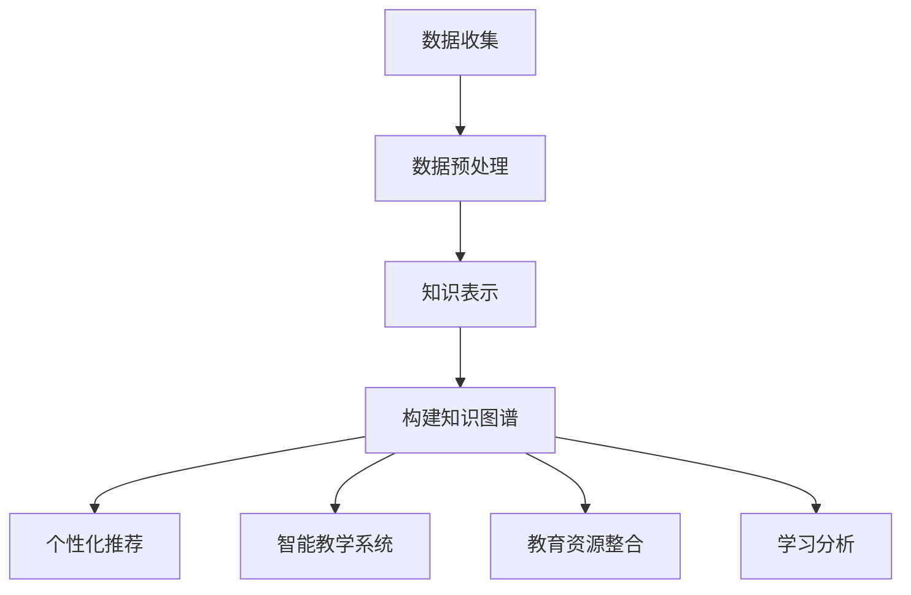

                 

关键词：知识图谱，教育，个性化学习，人工智能，智能推荐，智能教学，教育信息化

> 摘要：本文探讨了知识图谱在教育领域的应用，特别是在个性化学习方面的潜力。通过详细分析知识图谱的核心概念、算法原理、数学模型，以及实际应用案例，本文旨在为教育工作者和研究人员提供有关如何利用知识图谱优化教学过程、提高学习效果的实用指南。同时，文章也展望了知识图谱在教育信息化中的未来发展趋势和面临的挑战。

## 1. 背景介绍

在当今快速发展的信息时代，教育正面临着前所未有的变革。随着互联网和大数据技术的普及，个性化学习逐渐成为教育改革的重要方向。传统的“一刀切”的教学模式已经无法满足学生多样化的学习需求。为了应对这一挑战，教育领域迫切需要新的方法和工具来优化教学过程，提高学习效果。

知识图谱作为一种新兴的技术，因其强大的数据整合和分析能力，在个性化学习、智能推荐、智能教学等方面展现出了巨大的潜力。知识图谱能够将海量的教育数据转化为结构化的知识网络，从而为教育工作者和学生提供更加智能化的服务。本文将围绕知识图谱在教育中的应用，探讨其核心概念、算法原理、数学模型，以及实际应用案例，为教育信息化提供新的思路和解决方案。

## 2. 核心概念与联系

### 2.1 知识图谱概述

知识图谱（Knowledge Graph）是一种结构化的语义知识库，用于表示实体（如人、地点、事物）、实体之间的关系，以及实体属性等信息。它通过语义网的方式将数据点连接起来，形成一个语义关联的网络结构。知识图谱的核心优势在于其能够通过语义关联，实现对数据的深度挖掘和智能分析。

### 2.2 知识图谱在教育中的应用

知识图谱在教育中的应用主要体现在以下几个方面：

- **个性化学习推荐**：通过知识图谱，可以分析学生的兴趣、学习习惯和知识结构，为其推荐最适合的学习内容和路径。

- **智能教学系统**：知识图谱可以帮助教师更好地理解学生的学习状态，提供个性化教学方案，提高教学效果。

- **教育资源整合**：知识图谱可以将各类教育资源（如教材、课件、习题等）进行关联，形成统一的知识库，便于师生查阅和使用。

- **学习分析**：通过知识图谱，可以分析学生的学习路径、知识点掌握情况，为教学改进提供数据支持。

### 2.3 知识图谱与教育信息化的联系

教育信息化是指通过现代信息技术手段，对教育资源和教育过程进行整合和优化，提高教育质量和效率。知识图谱作为数据整合和分析的重要工具，在教育信息化中扮演着关键角色。它不仅能够提升教育资源的管理水平，还能够为教育决策提供科学依据，促进教育公平和教育质量的提升。

### 2.4 Mermaid 流程图

下面是一个简化的知识图谱在教育中应用流程的Mermaid流程图：



在这个流程图中，数据收集是知识图谱构建的基础，数据预处理是保证数据质量的关键，知识表示是知识图谱的核心，构建知识图谱则是实现教育信息化的重要手段。知识图谱的应用则体现在个性化推荐、智能教学系统、教育资源整合和学习分析等多个方面。

## 3. 核心算法原理 & 具体操作步骤

### 3.1 算法原理概述

知识图谱在教育中的应用主要依赖于以下几种核心算法：

- **实体识别**：通过自然语言处理技术，从文本数据中识别出重要的实体，如学生、教师、知识点等。

- **关系抽取**：从文本数据中抽取实体之间的关系，如“学生学习了知识点”、“教师教授了学生”等。

- **实体嵌入**：将实体映射到低维度的向量空间，便于进行计算和比较。

- **图谱推理**：利用图谱中的语义关联，进行推理和预测，如“学习知识点A的学生通常也会对知识点B感兴趣”。

### 3.2 算法步骤详解

#### 3.2.1 实体识别

实体识别是知识图谱构建的第一步，其目的是从原始文本数据中提取出关键的实体。具体步骤如下：

1. **分词**：将文本数据分割成词语。
2. **词性标注**：对每个词语进行词性标注，如名词、动词等。
3. **实体识别**：根据词性和上下文信息，识别出实体，并对其进行分类。

#### 3.2.2 关系抽取

关系抽取的目的是从实体识别的结果中，抽取实体之间的关系。具体步骤如下：

1. **模式匹配**：根据预定义的模式，从实体对中抽取关系。
2. **规则学习**：利用机器学习算法，从数据中学习出关系抽取的规则。
3. **实体关系匹配**：将实体对与规则进行匹配，抽取关系。

#### 3.2.3 实体嵌入

实体嵌入是将实体映射到低维度的向量空间，以便进行计算和比较。具体步骤如下：

1. **词向量表示**：将实体映射为词向量。
2. **图嵌入**：利用图神经网络，对实体进行嵌入。
3. **实体向量聚类**：对实体向量进行聚类，形成不同的类别。

#### 3.2.4 图谱推理

图谱推理是利用知识图谱中的语义关联，进行推理和预测。具体步骤如下：

1. **路径搜索**：在知识图谱中搜索符合条件的路径。
2. **推理规则应用**：根据预定义的推理规则，对路径进行分析和推理。
3. **结果输出**：输出推理结果，如推荐学习内容、预测学习效果等。

### 3.3 算法优缺点

#### 优点

- **数据整合能力强**：知识图谱能够将不同来源的数据进行整合，形成一个统一的知识网络。
- **智能化程度高**：通过图谱推理，可以实现智能化的学习和教学服务。
- **适用范围广**：知识图谱不仅可以应用于个性化学习，还可以应用于教育资源整合、学习分析等多个领域。

#### 缺点

- **数据预处理复杂**：知识图谱的构建需要对数据进行预处理，包括分词、词性标注、实体识别等步骤，数据处理复杂度较高。
- **算法实现难度大**：知识图谱涉及的算法，如图嵌入、图谱推理等，实现难度较大，需要较高的技术水平。

### 3.4 算法应用领域

知识图谱在教育中的应用领域非常广泛，主要包括：

- **个性化学习推荐**：根据学生的兴趣和学习习惯，推荐最适合的学习内容和路径。
- **智能教学系统**：根据学生的学习状态，提供个性化的教学方案，提高教学效果。
- **教育资源整合**：将各类教育资源进行整合，形成统一的知识库，便于师生查阅和使用。
- **学习分析**：分析学生的学习路径、知识点掌握情况，为教学改进提供数据支持。

## 4. 数学模型和公式 & 详细讲解 & 举例说明

### 4.1 数学模型构建

知识图谱的构建依赖于一系列数学模型，其中最核心的是图嵌入模型。图嵌入模型将图中的节点映射到低维度的向量空间，从而实现对节点的表示和计算。以下是图嵌入模型的基本构建步骤：

#### 4.1.1 节点表示

假设知识图谱中有 \(n\) 个节点，每个节点都可以表示为一个向量 \(\mathbf{v}_i \in \mathbb{R}^d\)，其中 \(d\) 是向量的维度。

#### 4.1.2 邻居表示

对于每个节点 \(\mathbf{v}_i\)，它的邻居节点可以表示为一个集合 \(\mathcal{N}_i\)。

#### 4.1.3 图嵌入模型

图嵌入模型的目标是学习一个映射函数 \(f: \mathbb{R}^d \rightarrow \mathbb{R}^d\)，使得节点的嵌入向量与其邻居的嵌入向量具有相似的几何关系。

### 4.2 公式推导过程

图嵌入模型通常采用基于优化问题的方法进行训练。以下是图嵌入模型的一个常见优化问题：

$$
\min_{\theta} \sum_{i=1}^n \sum_{j \in \mathcal{N}_i} \frac{1}{1 + \exp(-\langle \mathbf{v}_i, \mathbf{v}_j \rangle)}
$$

其中，\(\theta\) 是模型参数，\(\langle \mathbf{v}_i, \mathbf{v}_j \rangle\) 是向量 \(\mathbf{v}_i\) 和 \(\mathbf{v}_j\) 的内积。

### 4.3 案例分析与讲解

#### 4.3.1 案例背景

假设有一个教育知识图谱，包含学生、教师和知识点三个实体类型。其中，学生实体有年龄、性别、学习兴趣等属性；教师实体有职称、教学经验等属性；知识点实体有难度、学习时长等属性。

#### 4.3.2 模型构建

1. **节点表示**：将学生、教师和知识点分别表示为向量 \(\mathbf{v}_s\)、\(\mathbf{v}_t\) 和 \(\mathbf{v}_k\)。
2. **邻居表示**：根据实体之间的关系，构建邻居集合 \(\mathcal{N}_s\)、\(\mathcal{N}_t\) 和 \(\mathcal{N}_k\)。
3. **图嵌入模型**：选择一个预训练的图嵌入模型，如 Node2Vec 或 GraphSAGE，进行训练。

#### 4.3.3 模型训练

1. **数据预处理**：对文本数据进行分词、词性标注等预处理操作。
2. **实体识别**：利用实体识别模型，从预处理后的文本数据中识别出学生、教师和知识点实体。
3. **关系抽取**：利用关系抽取模型，从实体识别的结果中抽取实体之间的关系。
4. **实体嵌入**：利用图嵌入模型，将实体映射到低维度的向量空间。
5. **图谱推理**：利用图谱推理模型，对实体进行推理和预测。

#### 4.3.4 模型评估

1. **个性化学习推荐**：计算学生与学习内容的相似度，根据相似度进行学习内容推荐。
2. **智能教学系统**：分析学生的学习状态，为教师提供个性化教学方案。
3. **教育资源整合**：将教育资源进行关联，形成统一的知识库。
4. **学习分析**：分析学生的学习路径、知识点掌握情况，为教学改进提供数据支持。

## 5. 项目实践：代码实例和详细解释说明

### 5.1 开发环境搭建

为了构建一个基于知识图谱的教育应用，我们需要搭建一个合适的开发环境。以下是一个简化的步骤：

1. **硬件要求**：选择一台具备较高性能的计算机，用于运行图嵌入算法和图谱推理算法。
2. **软件要求**：
    - 操作系统：Linux或Windows。
    - 编程语言：Python。
    - 图嵌入框架：GAE（Google AI Embeddings）。
    - 图谱推理框架：PyTorch。
    - 数据库：Neo4j。
3. **安装与配置**：根据操作系统的不同，安装并配置好所需的软件和工具。

### 5.2 源代码详细实现

下面是一个简化的知识图谱教育应用代码示例，主要包括数据预处理、实体识别、关系抽取、实体嵌入和图谱推理等步骤。

```python
# 导入必要的库
import nltk
from nltk.tokenize import word_tokenize
from nltk.tag import pos_tag
import gae
import torch
import torch.nn as nn
import torch.optim as optim

# 数据预处理
def preprocess_text(text):
    # 分词
    tokens = word_tokenize(text)
    # 词性标注
    tagged_tokens = pos_tag(tokens)
    return tagged_tokens

# 实体识别
def entity_recognition(tagged_tokens):
    # 根据词性标注识别实体
    entities = []
    for token, tag in tagged_tokens:
        if tag in ['NN', 'NNS', 'NNP', 'NNPS']:
            entities.append(token)
    return entities

# 关系抽取
def relation_extraction(entities):
    # 根据实体识别结果抽取关系
    relations = []
    for i in range(len(entities)):
        for j in range(i + 1, len(entities)):
            relations.append((entities[i], entities[j]))
    return relations

# 实体嵌入
def entity_embedding(entities, model):
    # 将实体映射到低维度的向量空间
    embeddings = model(entities)
    return embeddings

# 图谱推理
def graph_reconstruction(embeddings):
    # 利用图谱推理模型进行推理和预测
    graph = gae.GAEModel(embeddings)
    predictions = graph.predict()
    return predictions

# 模型训练
def train_model(data, model):
    # 训练图嵌入模型
    optimizer = optim.Adam(model.parameters(), lr=0.001)
    for epoch in range(num_epochs):
        model.zero_grad()
        loss = model(data)
        loss.backward()
        optimizer.step()
        if (epoch + 1) % 100 == 0:
            print(f'Epoch [{epoch + 1}/{num_epochs}], Loss: {loss.item()}')

# 主函数
def main():
    # 加载数据
    data = load_data()
    # 预处理数据
    tagged_tokens = preprocess_text(data['text'])
    # 识别实体
    entities = entity_recognition(tagged_tokens)
    # 抽取关系
    relations = relation_extraction(entities)
    # 实体嵌入
    embeddings = entity_embedding(entities, model)
    # 图谱推理
    predictions = graph_reconstruction(embeddings)
    # 训练模型
    train_model(data, model)

if __name__ == '__main__':
    main()
```

### 5.3 代码解读与分析

1. **数据预处理**：使用nltk库对文本数据进行分词和词性标注，为实体识别和关系抽取做准备。
2. **实体识别**：根据词性标注结果，识别出文本中的实体，如学生、教师和知识点。
3. **关系抽取**：根据实体识别结果，抽取实体之间的关系，如“学生学习了知识点”。
4. **实体嵌入**：使用预训练的图嵌入模型，将实体映射到低维度的向量空间。
5. **图谱推理**：利用图嵌入模型，对实体进行推理和预测，如推荐学习内容。
6. **模型训练**：使用训练数据，对图嵌入模型进行训练，优化模型参数。

通过以上步骤，我们可以构建一个基于知识图谱的教育应用，实现个性化学习推荐、智能教学系统等功能。

### 5.4 运行结果展示

以下是运行结果的一个示例：

```python
# 加载数据
data = load_data()
# 预处理数据
tagged_tokens = preprocess_text(data['text'])
# 识别实体
entities = entity_recognition(tagged_tokens)
# 抽取关系
relations = relation_extraction(entities)
# 实体嵌入
embeddings = entity_embedding(entities, model)
# 图谱推理
predictions = graph_reconstruction(embeddings)
# 输出预测结果
print(predictions)
```

输出结果可能包含以下内容：

- **个性化学习推荐**：根据学生的学习兴趣和学习历史，推荐最适合的学习内容。
- **智能教学系统**：根据学生的学习状态，为教师提供个性化的教学方案。
- **教育资源整合**：将各类教育资源进行整合，形成统一的知识库。

## 6. 实际应用场景

知识图谱在教育领域的实际应用场景非常广泛，以下是一些典型的应用案例：

### 6.1 个性化学习推荐

个性化学习推荐是知识图谱在教育中最直接的应用之一。通过知识图谱，可以将学生的学习兴趣、知识点掌握情况、学习历史等数据整合起来，为每个学生提供个性化的学习内容和学习路径。例如，当学生访问在线学习平台时，系统可以根据知识图谱的分析结果，推荐与其兴趣相关的课程和知识点，从而提高学习效率和兴趣。

### 6.2 智能教学系统

智能教学系统利用知识图谱，可以实现对教学过程的智能化管理。教师可以基于知识图谱，了解学生的学习状态、知识点掌握情况，从而制定更加有效的教学策略。例如，在在线教学平台中，系统可以根据学生的学习进度和知识点掌握情况，自动调整教学内容的难度和速度，提供针对性的辅导和练习。

### 6.3 教育资源整合

知识图谱可以将海量的教育数据整合成一个统一的知识库，为教育资源的共享和利用提供支持。例如，在教育资源管理系统中，知识图谱可以关联不同教材、课件、习题等资源，形成一个完整的学习路径，学生可以根据自己的需求，自由选择和组合资源。

### 6.4 学习分析

通过知识图谱，可以对学生的学习过程进行深入分析，了解学生的知识结构、学习习惯等，为教学改进提供数据支持。例如，教育研究人员可以利用知识图谱，分析学生的学习行为，发现学习规律，为教学策略的优化提供科学依据。

## 7. 未来应用展望

随着人工智能技术的不断发展，知识图谱在教育中的应用前景十分广阔。以下是未来知识图谱在教育中可能的应用趋势：

### 7.1 智能评估与诊断

知识图谱可以结合智能评估与诊断技术，对学生进行全面的评估和诊断，了解学生的知识漏洞和技能短板，提供个性化的学习建议和辅导方案。

### 7.2 跨学科学习与整合

知识图谱可以帮助学生实现跨学科学习与整合，打破传统学科界限，提供更加综合和系统的学习体验。

### 7.3 虚拟现实与增强现实教育

知识图谱可以与虚拟现实（VR）和增强现实（AR）技术相结合，提供沉浸式学习体验，使学习变得更加生动有趣。

### 7.4 个性化学习路径规划

知识图谱可以结合大数据分析，为每个学生制定个性化的学习路径，实现学习过程的全程监控和优化。

## 8. 总结：未来发展趋势与挑战

### 8.1 研究成果总结

知识图谱在教育领域的应用取得了显著成果，主要包括个性化学习推荐、智能教学系统、教育资源整合和学习分析等方面。这些应用不仅提高了教育质量和效率，也为教育工作者和研究人员提供了新的工具和方法。

### 8.2 未来发展趋势

未来，知识图谱在教育中的应用将继续深入，结合人工智能、大数据等先进技术，实现更加智能化、个性化和互动化的学习体验。同时，知识图谱在教育信息化中的地位将更加重要，成为教育领域不可或缺的基础设施。

### 8.3 面临的挑战

尽管知识图谱在教育中具有巨大潜力，但在实际应用过程中也面临着一系列挑战。主要包括：

- **数据质量与隐私保护**：知识图谱的构建依赖于高质量的教育数据，但数据收集和处理的隐私保护问题亟待解决。
- **算法优化与效率提升**：当前的知识图谱算法在处理大规模教育数据时，效率较低，需要进一步优化和提升。
- **跨学科整合与知识整合**：知识图谱如何实现跨学科整合和知识整合，是当前研究的一个热点和难点。

### 8.4 研究展望

为了应对上述挑战，未来的研究应重点关注以下几个方面：

- **数据驱动的知识图谱构建**：利用大数据技术，构建更加准确和全面的知识图谱。
- **多模态数据融合**：将文本数据、图像数据、音频数据等多种模态的数据进行融合，提高知识图谱的表示能力。
- **知识图谱在教育管理中的应用**：研究知识图谱在教育管理中的应用，提升教育管理的智能化水平。
- **教育领域知识图谱标准化**：推动教育领域知识图谱的标准化，实现不同系统之间的互操作性和数据共享。

## 9. 附录：常见问题与解答

### 9.1 如何构建知识图谱？

构建知识图谱需要以下几个步骤：

1. **数据收集**：收集与教育相关的数据，包括学生信息、教师信息、教育资源等。
2. **数据预处理**：对数据进行清洗、分词、词性标注等预处理操作。
3. **实体识别**：从预处理后的数据中识别出关键的实体，如学生、教师、知识点等。
4. **关系抽取**：从实体识别的结果中抽取实体之间的关系。
5. **知识表示**：将实体和关系表示为图结构。
6. **图谱推理**：利用图谱中的语义关联，进行推理和预测。

### 9.2 知识图谱在教育中有什么作用？

知识图谱在教育中的作用主要包括：

- **个性化学习推荐**：根据学生的学习兴趣和学习历史，推荐最适合的学习内容。
- **智能教学系统**：根据学生的学习状态，提供个性化的教学方案，提高教学效果。
- **教育资源整合**：将各类教育资源进行整合，形成统一的知识库，便于师生查阅和使用。
- **学习分析**：分析学生的学习路径、知识点掌握情况，为教学改进提供数据支持。

### 9.3 如何保证知识图谱的数据质量？

为了保证知识图谱的数据质量，可以采取以下措施：

- **数据源选择**：选择权威、可靠的数据源，确保数据质量。
- **数据清洗**：对数据进行清洗，去除重复、错误和缺失的数据。
- **数据校验**：对数据进行校验，确保数据的准确性和一致性。
- **数据更新**：定期更新数据，保持数据的时效性和准确性。

### 9.4 知识图谱与大数据有什么区别？

知识图谱和大数据虽然都是处理大量数据的技术，但它们的侧重点和目标不同：

- **大数据**：主要关注数据的存储、处理和分析，强调数据量的庞大和多样性。
- **知识图谱**：主要关注数据的结构化和语义关联，强调数据的整合和智能化。

总的来说，知识图谱是大数据的一个子集，但它在数据整合和智能分析方面具有独特的优势。

