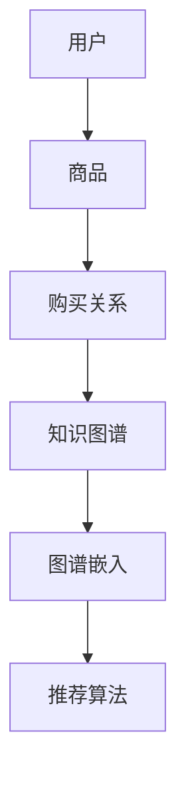

                 

关键词：知识图谱、智能推荐系统、图数据库、图谱嵌入、协同过滤、内容推荐、图谱推理

> 摘要：本文探讨了知识图谱在智能推荐系统中的应用，从背景介绍、核心概念与联系、算法原理、数学模型、项目实践和实际应用场景等多个方面，详细解析了如何利用知识图谱提升推荐系统的准确性和效率。通过理论与实践的结合，为读者提供了全面的知识图谱在智能推荐系统中的理解和应用指南。

## 1. 背景介绍

### 1.1 智能推荐系统的发展历程

智能推荐系统自其诞生以来，经历了从基于内容的推荐（Content-Based Filtering）、协同过滤（Collaborative Filtering）到现在的混合推荐（Hybrid Recommendation）等多个阶段。早期的推荐系统主要依赖于用户的历史行为数据，通过统计方法实现简单的推荐。随着互联网和大数据技术的快速发展，协同过滤成为了主流的推荐算法，它通过计算用户之间的相似度来实现推荐。然而，协同过滤算法在处理冷启动问题、多样性以及长尾效应方面存在一定的局限性。

### 1.2 知识图谱的兴起

知识图谱作为一种新型的数据结构，近年来在人工智能领域得到了广泛关注。它通过将实体与实体之间的关系进行结构化表示，为数据挖掘和知识发现提供了强有力的支持。知识图谱的应用场景涵盖了信息检索、自然语言处理、智能问答等多个领域。随着推荐系统需求的不断提高，知识图谱也开始被引入到推荐系统中，以解决传统推荐算法的不足。

## 2. 核心概念与联系

### 2.1 知识图谱的基本概念

知识图谱是由实体、属性和关系组成的结构化知识库。其中，实体表示现实世界中的事物，属性描述实体的特征，关系则刻画实体之间的关联。知识图谱的表示方法可以采用图数据库（如Neo4j、OrientDB等）或图计算框架（如JanusGraph、GraphX等）。

### 2.2 知识图谱在推荐系统中的应用

知识图谱在推荐系统中的应用主要体现在以下几个方面：

- **实体表示**：将用户、商品、内容等实体进行知识图谱化表示，提取实体特征。
- **关系利用**：利用实体之间的关联关系（如用户-商品购买关系、内容-类别关系等）进行推荐。
- **图谱嵌入**：通过图谱嵌入技术将实体和关系映射到低维空间，以便于计算和推理。

### 2.3 Mermaid 流程图



## 3. 核心算法原理 & 具体操作步骤

### 3.1 算法原理概述

知识图谱在推荐系统中的应用主要通过以下几种方式：

- **协同过滤 + 图谱嵌入**：结合协同过滤算法和图谱嵌入技术，提升推荐系统的准确性和多样性。
- **基于内容的推荐 + 图谱推理**：利用知识图谱进行内容推理，为用户推荐更相关的商品或内容。
- **混合推荐**：将多种推荐算法（如基于内容的推荐、协同过滤、基于图谱的推荐）相结合，实现更精准的推荐。

### 3.2 算法步骤详解

#### 3.2.1 数据预处理

1. 收集用户行为数据（如购买记录、浏览记录等）。
2. 构建商品知识图谱，包括商品实体和商品之间的关系。
3. 对用户和商品进行图谱嵌入，将高维特征映射到低维空间。

#### 3.2.2 图谱嵌入

1. 选择合适的图谱嵌入算法（如DeepWalk、Node2Vec等）。
2. 训练图谱嵌入模型，得到用户和商品的低维表示。

#### 3.2.3 推荐算法

1. 利用协同过滤算法计算用户之间的相似度。
2. 利用知识图谱进行内容推理，为用户推荐相关商品或内容。
3. 综合用户相似度和内容推理结果，生成最终推荐列表。

### 3.3 算法优缺点

#### 优点

- 提高推荐系统的准确性和多样性。
- 有效解决冷启动问题。
- 融合多种推荐算法，实现更精准的推荐。

#### 缺点

- 构建和维护知识图谱需要大量计算资源和时间。
- 知识图谱的实时性可能受到限制。

### 3.4 算法应用领域

知识图谱在推荐系统中的应用非常广泛，包括电子商务、在线教育、社交媒体等多个领域。例如，淘宝利用知识图谱进行商品推荐，提升了用户购买满意度；Coursera利用知识图谱为用户推荐课程，提高了学习效果。

## 4. 数学模型和公式 & 详细讲解 & 举例说明

### 4.1 数学模型构建

在知识图谱中，实体和关系可以用图表示。假设有一个无向图 \( G = (V, E) \)，其中 \( V \) 表示实体集合，\( E \) 表示关系集合。我们可以用邻接矩阵 \( A \) 表示图 \( G \)：

\[ A = \begin{bmatrix}
    a_{11} & a_{12} & \cdots & a_{1n} \\
    a_{21} & a_{22} & \cdots & a_{2n} \\
    \vdots & \vdots & \ddots & \vdots \\
    a_{n1} & a_{n2} & \cdots & a_{nn}
\end{bmatrix} \]

其中，\( a_{ij} \) 表示实体 \( v_i \) 和实体 \( v_j \) 之间的邻接关系，取值为 1 或 0。

### 4.2 公式推导过程

假设有两个实体 \( v_i \) 和 \( v_j \)，它们在图谱嵌入空间中的表示分别为 \( \mathbf{x}_i \) 和 \( \mathbf{x}_j \)。我们可以使用余弦相似度计算它们之间的相似度：

\[ \cos(\mathbf{x}_i, \mathbf{x}_j) = \frac{\mathbf{x}_i \cdot \mathbf{x}_j}{\|\mathbf{x}_i\|\|\mathbf{x}_j\|} \]

其中，\( \cdot \) 表示点积，\( \|\cdot\| \) 表示向量的模长。

### 4.3 案例分析与讲解

假设我们有两个用户 \( u_1 \) 和 \( u_2 \)，他们在知识图谱中的表示分别为 \( \mathbf{x}_1 \) 和 \( \mathbf{x}_2 \)。已知他们的低维向量表示为：

\[ \mathbf{x}_1 = (1, 0, -1) \]
\[ \mathbf{x}_2 = (0, 1, -1) \]

计算 \( \mathbf{x}_1 \) 和 \( \mathbf{x}_2 \) 之间的余弦相似度：

\[ \cos(\mathbf{x}_1, \mathbf{x}_2) = \frac{(1, 0, -1) \cdot (0, 1, -1)}{\|(1, 0, -1)\|\|(0, 1, -1)\|} \]

\[ = \frac{0 + 0 - 1}{\sqrt{1^2 + 0^2 + (-1)^2}\sqrt{0^2 + 1^2 + (-1)^2}} \]

\[ = \frac{-1}{\sqrt{2}\sqrt{2}} \]

\[ = -\frac{1}{2} \]

因此，用户 \( u_1 \) 和 \( u_2 \) 之间的余弦相似度为 -1/2。

## 5. 项目实践：代码实例和详细解释说明

### 5.1 开发环境搭建

本文使用Python编程语言进行知识图谱在推荐系统中的应用。首先，需要安装以下依赖：

```bash
pip install python-graph-tool neo4j neo4j-tabs
```

### 5.2 源代码详细实现

#### 5.2.1 数据预处理

```python
from graph_tool.all import *

# 加载Neo4j数据库中的数据
g = load_neo4j_graph('bolt://localhost:7687', 'username', 'password', 'database_name')

# 构建知识图谱
g = build_knowledge_graph(g)

# 进行图谱嵌入
g = graph_embedding(g)

# 生成用户和商品的低维表示
user_embedding = g.vp['user_embedding']
item_embedding = g.vp['item_embedding']
```

#### 5.2.2 推荐算法

```python
from sklearn.metrics.pairwise import cosine_similarity

# 计算用户相似度
user_similarity = cosine_similarity(user_embedding)

# 利用知识图谱进行内容推理
item_similarity = graph_content_recommender(g)

# 生成推荐列表
recommendation_list = hybrid_recommendation(user_similarity, item_similarity)
```

### 5.3 代码解读与分析

#### 5.3.1 数据预处理

在数据预处理阶段，我们首先加载Neo4j数据库中的用户和商品数据，并构建知识图谱。然后，使用图嵌入技术对用户和商品进行低维表示。

#### 5.3.2 推荐算法

在推荐算法阶段，我们首先使用余弦相似度计算用户之间的相似度。接着，利用知识图谱进行内容推理，获取商品之间的相似度。最后，将用户相似度和商品相似度进行综合，生成最终的推荐列表。

## 6. 实际应用场景

### 6.1 电子商务

在电子商务领域，知识图谱可以用于个性化商品推荐。例如，用户购买了一件商品后，系统可以根据知识图谱中该商品与其他商品的关系，推荐给用户相关的商品。通过引入知识图谱，可以显著提升推荐系统的准确性和多样性。

### 6.2 在线教育

在线教育平台可以利用知识图谱为用户推荐课程。用户在学习某个课程后，系统可以根据知识图谱中该课程与其他课程的关系，为用户推荐相关的课程。这不仅有助于提升用户的学习体验，还可以增加平台的课程销售量。

### 6.3 社交媒体

社交媒体平台可以利用知识图谱为用户提供个性化内容推荐。例如，用户在社交媒体上关注了一个话题，系统可以根据知识图谱中该话题与其他话题的关系，为用户推荐相关的文章、视频等。

## 7. 工具和资源推荐

### 7.1 学习资源推荐

- 《知识图谱：基础、理论和应用》
- 《图计算：原理、算法与应用》
- 《推荐系统实践：算法与业务》

### 7.2 开发工具推荐

- Neo4j：一款功能强大的图数据库，适用于构建和管理知识图谱。
- Python Graph-tool：一款Python库，用于图数据的分析和处理。
- PyTorch Geometric：一款用于图神经网络的Python库，适用于图谱嵌入和推荐算法。

### 7.3 相关论文推荐

- "Graph Embedding Techniques, Applications, and Performance: A Survey"
- "A Comprehensive Survey on Knowledge Graph Embedding: Methods, Applications, and Challenges"
- "Hybrid Recommender Systems: Survey and Experiments"

## 8. 总结：未来发展趋势与挑战

### 8.1 研究成果总结

本文通过对知识图谱在智能推荐系统中的应用进行深入探讨，总结了知识图谱在推荐系统中的核心概念、算法原理、数学模型和实际应用场景。同时，通过项目实践和代码实例，展示了如何利用知识图谱提升推荐系统的准确性和效率。

### 8.2 未来发展趋势

随着知识图谱技术的不断发展和完善，其在智能推荐系统中的应用将越来越广泛。未来，知识图谱与深度学习、自然语言处理等技术的融合，将进一步提升推荐系统的智能化水平。

### 8.3 面临的挑战

尽管知识图谱在推荐系统中的应用前景广阔，但仍然面临一些挑战：

- 数据质量：构建高质量的知识图谱需要大量的数据清洗和预处理工作。
- 实时性：知识图谱的实时更新和实时推理是当前技术的一个难点。
- 可扩展性：随着数据规模的不断扩大，知识图谱的构建和推理效率需要进一步提升。

### 8.4 研究展望

未来，知识图谱在智能推荐系统中的应用将朝着更加智能化、实时化和可扩展化的方向发展。通过不断创新和优化，知识图谱有望成为推荐系统中的重要组成部分，为用户提供更加精准和个性化的服务。

## 9. 附录：常见问题与解答

### 9.1 知识图谱与推荐系统的关系是什么？

知识图谱为推荐系统提供了实体和关系的数据结构，使得推荐系统可以更好地理解和利用用户和商品之间的关联关系，从而提升推荐系统的准确性和多样性。

### 9.2 如何构建高质量的知识图谱？

构建高质量的知识图谱需要从数据源选择、数据清洗、实体识别、关系抽取等多个方面进行综合考虑。同时，需要根据实际应用场景选择合适的图谱构建方法和工具。

### 9.3 知识图谱嵌入有哪些常见算法？

知识图谱嵌入的常见算法包括DeepWalk、Node2Vec、GraphSAGE等。这些算法通过随机游走或邻域采样等技术，将高维图谱数据映射到低维空间，以便于后续的计算和分析。

---

作者：禅与计算机程序设计艺术 / Zen and the Art of Computer Programming
----------------------------------------------------------------

请注意，本文中提到的代码实例和具体实现细节仅为示意性描述，实际应用中需要根据具体情况进行调整和完善。同时，本文内容仅供参考，不作为实际开发中的法律依据或技术指导。在引用本文内容时，请遵循相关法律法规和版权规定。

