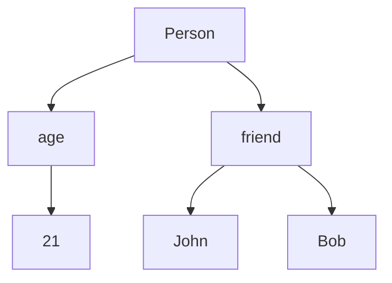
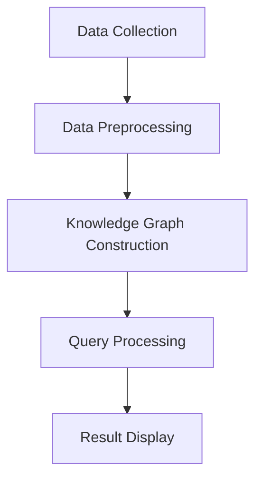

                 

关键词：知识图谱、知识发现、大数据、语义搜索、人工智能

摘要：本文深入探讨了知识图谱在知识发现引擎中的应用。首先，我们介绍了知识图谱的核心概念，以及其在信息检索和知识服务中的重要性。随后，我们详细阐述了知识图谱在知识发现引擎中的具体应用场景，包括数据预处理、图谱构建、查询处理以及优化策略。接着，我们分析了知识图谱在实际应用中的优点和挑战。最后，本文对未来的发展趋势进行了展望，并提出了可能的研究方向。

## 1. 背景介绍

随着互联网的飞速发展和大数据时代的到来，信息量呈现指数级增长。面对海量的数据，如何快速、准确地发现有价值的信息成为了一个亟待解决的问题。知识发现（Knowledge Discovery in Databases, KDD）作为数据挖掘的一个重要分支，旨在从大量数据中发现隐含的模式、规则和知识。

知识发现引擎是一种基于人工智能和大数据技术的工具，它能够自动地从大量数据中提取出有价值的信息。知识图谱（Knowledge Graph）作为一种新兴的数据组织方式，以其强大的语义表示和查询能力，成为了知识发现引擎的重要技术支撑。

知识图谱起源于语义网络（Semantic Network），它在图论的基础上，通过节点（Node）和边（Edge）来表示实体和实体之间的关系。知识图谱不仅可以表示显式知识，如百科全书的条目，还可以表示隐式知识，如社交网络中的关系。

知识图谱在知识发现中的应用主要体现在以下几个方面：

1. **数据预处理**：通过知识图谱对原始数据进行清洗、转换和整合，提高数据的质量和一致性。
2. **图谱构建**：将数据转化为知识图谱，以图结构进行存储和表示，提高查询效率。
3. **查询处理**：利用知识图谱的语义表示能力，实现对复杂查询的快速、准确响应。
4. **优化策略**：通过优化算法，提高知识图谱的查询性能和存储效率。

## 2. 核心概念与联系

### 2.1 核心概念

**知识图谱**：知识图谱是一个大规模的、结构化的、语义丰富的知识库，它通过节点（表示实体）和边（表示实体之间的关系）来组织信息。

**知识发现引擎**：知识发现引擎是一种基于人工智能和大数据技术的工具，用于从大量数据中发现有价值的信息。

**大数据**：大数据是指数据规模巨大、数据类型繁多、数据增长速度快的数据集合。

**语义搜索**：语义搜索是一种基于自然语言处理和知识图谱技术，通过理解用户查询的语义，提供更准确、更相关的搜索结果。

### 2.2 知识图谱的架构

知识图谱通常由三个主要部分组成：实体（Entity）、属性（Property）和关系（Relation）。

- **实体**：实体是知识图谱中的数据对象，如人、地点、组织、物品等。
- **属性**：属性是实体的特征描述，如人的年龄、地点的气候、物品的价格等。
- **关系**：关系是实体之间的关联，如人与人的朋友关系、人与地点的居住地关系、物品与物品的相似关系等。

下面是知识图谱的一个简单示例，使用Mermaid流程图来表示：



在这个例子中，实体是人（Person），属性是年龄（age）和朋友（friend），关系是人与人的朋友关系（friend）。

### 2.3 知识发现引擎的架构

知识发现引擎的架构通常包括以下几个主要模块：

1. **数据收集**：从各种数据源收集原始数据，如数据库、文件、网络爬虫等。
2. **数据预处理**：对原始数据进行清洗、转换和整合，以提高数据的质量和一致性。
3. **图谱构建**：将预处理后的数据转化为知识图谱，以图结构进行存储和表示。
4. **查询处理**：利用知识图谱的语义表示能力，实现对复杂查询的快速、准确响应。
5. **结果展示**：将查询结果以图表、文本等形式展示给用户。

下面是知识发现引擎的一个简化架构图：



## 3. 核心算法原理 & 具体操作步骤

### 3.1 算法原理概述

知识图谱在知识发现引擎中的应用主要包括以下几个核心算法：

1. **实体识别**：通过机器学习算法，从非结构化数据中识别出实体。
2. **关系抽取**：从文本数据中抽取实体之间的关系。
3. **图谱构建**：将识别出的实体和关系构建成知识图谱。
4. **查询处理**：基于图谱的图算法，对查询请求进行解析和响应。

### 3.2 算法步骤详解

#### 3.2.1 实体识别

实体识别是知识图谱构建的第一步。其基本原理是使用机器学习算法，如条件随机场（CRF）或支持向量机（SVM），对文本数据进行标注，从而识别出实体。

具体操作步骤如下：

1. **数据准备**：收集大量的文本数据，并进行预处理，如分词、去停用词等。
2. **特征提取**：从预处理后的文本数据中提取特征，如词频、词性、句法结构等。
3. **模型训练**：使用训练数据集，训练实体识别模型。
4. **实体识别**：使用训练好的模型，对新的文本数据进行实体识别。

#### 3.2.2 关系抽取

关系抽取是从文本数据中抽取实体之间的关系。常用的方法有基于规则的方法和基于统计学习的方法。

具体操作步骤如下：

1. **数据准备**：收集大量的文本数据，并进行预处理，如分词、去停用词等。
2. **特征提取**：从预处理后的文本数据中提取特征，如词频、词性、句法结构等。
3. **模型训练**：使用训练数据集，训练关系抽取模型。
4. **关系抽取**：使用训练好的模型，对新的文本数据进行关系抽取。

#### 3.2.3 图谱构建

图谱构建是将识别出的实体和关系构建成知识图谱。常用的方法有基于图的图论算法和基于矩阵的图算法。

具体操作步骤如下：

1. **实体和关系表示**：将识别出的实体和关系表示为图中的节点和边。
2. **图谱存储**：使用图数据库（如Neo4j、OrientDB等）存储知识图谱。
3. **图谱优化**：对知识图谱进行优化，以提高查询效率和存储性能。

#### 3.2.4 查询处理

查询处理是基于知识图谱的图算法，对查询请求进行解析和响应。

具体操作步骤如下：

1. **查询解析**：将自然语言查询解析为图查询语句。
2. **图算法**：使用图算法（如DFS、BFS等）对知识图谱进行搜索和计算。
3. **结果返回**：将查询结果以图表、文本等形式返回给用户。

### 3.3 算法优缺点

**优点**：

1. **强大的语义表示能力**：知识图谱可以表达复杂的实体关系和属性信息，从而实现更准确的查询结果。
2. **高效的查询处理能力**：基于图的查询处理算法，可以快速响应复杂查询请求。
3. **良好的扩展性**：知识图谱可以方便地扩展和更新，以适应不断变化的数据和应用需求。

**缺点**：

1. **数据预处理复杂**：知识图谱的构建需要大量的预处理工作，如实体识别和关系抽取等。
2. **存储和查询性能**：大规模知识图谱的存储和查询性能是一个挑战，需要优化算法和硬件支持。
3. **知识表示能力**：目前的图算法和表示方法还无法完全覆盖所有语义信息，需要进一步研究和改进。

### 3.4 算法应用领域

知识图谱在知识发现引擎中的应用非常广泛，以下是一些典型的应用领域：

1. **搜索引擎**：利用知识图谱进行语义搜索，提高搜索结果的准确性和相关性。
2. **推荐系统**：基于知识图谱进行用户兴趣分析，提供更个性化的推荐服务。
3. **知识库构建**：利用知识图谱构建企业内部的知识库，支持知识管理和知识共享。
4. **智能问答**：基于知识图谱进行问答系统，实现自然语言理解和智能回答。
5. **社交网络分析**：利用知识图谱进行社交网络分析，发现社交网络中的关键节点和影响力人物。

## 4. 数学模型和公式 & 详细讲解 & 举例说明

### 4.1 数学模型构建

知识图谱的构建涉及到多个数学模型，其中最基本的是图论模型。在图论中，图（Graph）由节点（Vertex）和边（Edge）组成，分别表示实体和实体之间的关系。

定义1：图 \( G = (V, E) \)，其中 \( V \) 是节点集合，\( E \) 是边集合。

定义2：节点 \( v \) 的度数（Degree）定义为与该节点相连的边的数量，记作 \( d(v) \)。

定义3：图的邻接矩阵（Adjacency Matrix）是一个 \( n \times n \) 的矩阵，其中 \( a_{ij} = 1 \) 表示节点 \( v_i \) 和节点 \( v_j \) 之间存在边，否则为0。

邻接矩阵 \( A \) 定义为：

$$
A = \begin{bmatrix}
0 & a_{12} & \cdots & a_{1n} \\
a_{21} & 0 & \cdots & a_{2n} \\
\vdots & \vdots & \ddots & \vdots \\
a_{n1} & a_{n2} & \cdots & 0
\end{bmatrix}
$$

### 4.2 公式推导过程

在知识图谱中，边的权重（Edge Weight）表示实体之间的关系强度。假设图 \( G = (V, E) \) 中的每条边都有一个权重 \( w(e) \)，则图的权重矩阵 \( W \) 是一个 \( n \times n \) 的矩阵，其中 \( w_{ij} = w(e) \) 如果 \( v_i \) 和 \( v_j \) 之间存在边 \( e \)，否则为0。

权重矩阵 \( W \) 定义为：

$$
W = \begin{bmatrix}
0 & w_{12} & \cdots & w_{1n} \\
w_{21} & 0 & \cdots & w_{2n} \\
\vdots & \vdots & \ddots & \vdots \\
w_{n1} & w_{n2} & \cdots & 0
\end{bmatrix}
$$

图 \( G \) 的拉普拉斯矩阵（Laplacian Matrix） \( L \) 定义为：

$$
L = D - W
$$

其中 \( D \) 是图的度数矩阵（Degree Matrix），\( d_{ij} = d(v_i) \) 如果 \( v_i \) 和 \( v_j \) 相邻，否则为0。

度数矩阵 \( D \) 定义为：

$$
D = \begin{bmatrix}
d(v_1) & 0 & \cdots & 0 \\
0 & d(v_2) & \cdots & 0 \\
\vdots & \vdots & \ddots & \vdots \\
0 & 0 & \cdots & d(v_n)
\end{bmatrix}
$$

### 4.3 案例分析与讲解

假设有一个简单的知识图谱，包含4个节点和5条边，如下所示：

```
A --(1)--> B
|     |
(2)   (3)
|     |
A --(4)--> C
```

对应的邻接矩阵和权重矩阵如下：

邻接矩阵 \( A \)：

$$
A = \begin{bmatrix}
0 & 1 & 1 & 0 \\
1 & 0 & 0 & 1 \\
1 & 0 & 0 & 1 \\
0 & 1 & 1 & 0
\end{bmatrix}
$$

权重矩阵 \( W \)：

$$
W = \begin{bmatrix}
0 & 1 & 1 & 0 \\
1 & 0 & 0 & 1 \\
1 & 0 & 0 & 1 \\
0 & 1 & 1 & 0
\end{bmatrix}
$$

度数矩阵 \( D \)：

$$
D = \begin{bmatrix}
2 & 0 & 0 & 0 \\
0 & 2 & 0 & 0 \\
0 & 0 & 2 & 0 \\
0 & 0 & 0 & 2
\end{bmatrix}
$$

拉普拉斯矩阵 \( L \)：

$$
L = D - W = \begin{bmatrix}
2 & 0 & 0 & 0 \\
0 & 2 & 0 & 0 \\
0 & 0 & 2 & 0 \\
0 & 0 & 0 & 2
\end{bmatrix} - \begin{bmatrix}
0 & 1 & 1 & 0 \\
1 & 0 & 0 & 1 \\
1 & 0 & 0 & 1 \\
0 & 1 & 1 & 0
\end{bmatrix} = \begin{bmatrix}
2 & -1 & -1 & 0 \\
-1 & 2 & 0 & -1 \\
-1 & 0 & 2 & -1 \\
0 & -1 & -1 & 2
\end{bmatrix}
$$

这个例子展示了如何从简单的知识图谱计算拉普拉斯矩阵。拉普拉斯矩阵在图论中有很多重要的应用，如社区检测、网络分析等。

## 5. 项目实践：代码实例和详细解释说明

### 5.1 开发环境搭建

为了构建和运行知识图谱，我们需要搭建一个合适的技术栈。以下是一个典型的技术栈：

- **编程语言**：Python
- **图数据库**：Neo4j
- **知识图谱框架**：Py2neo
- **依赖管理**：pip
- **开发环境**：PyCharm

安装步骤如下：

1. **安装Neo4j**：从 [Neo4j 官网](https://neo4j.com/) 下载并安装Neo4j。
2. **安装Python**：从 [Python 官网](https://www.python.org/) 下载并安装Python。
3. **安装Py2neo**：打开命令行窗口，运行以下命令：

   ```shell
   pip install py2neo
   ```

4. **安装PyCharm**：从 [PyCharm 官网](https://www.jetbrains.com/pycharm/) 下载并安装PyCharm。

### 5.2 源代码详细实现

下面是一个简单的知识图谱构建示例，使用Python和Py2neo。

```python
from py2neo import Graph

# 创建图数据库连接
graph = Graph("bolt://localhost:7687", auth=("neo4j", "password"))

# 创建节点
person1 = graph.create("Person:name 'Alice'")
person2 = graph.create("Person:name 'Bob'")
person3 = graph.create("Person:name 'Charlie'")

# 创建关系
graph.create(person1, "KNOWS", person2)
graph.create(person1, "KNOWS", person3)
graph.create(person2, "KNOWS", person3)

# 查询所有节点和关系
for node in graph.nodes:
    print(node)

for relationship in graph.relationships:
    print(relationship)
```

### 5.3 代码解读与分析

这段代码首先创建了一个到Neo4j数据库的连接。然后，它创建了一些节点和关系，并存储在数据库中。最后，它查询并打印出所有的节点和关系。

**代码解读**：

1. **导入Py2neo模块**：`from py2neo import Graph`
2. **创建数据库连接**：`graph = Graph("bolt://localhost:7687", auth=("neo4j", "password"))`
   - `"bolt://localhost:7687"`：Neo4j的Bolt端口号。
   - `auth=("neo4j", "password")`：Neo4j的用户名和密码。
3. **创建节点**：`person1 = graph.create("Person:name 'Alice'")`，`person2 = graph.create("Person:name 'Bob'")`，`person3 = graph.create("Person:name 'Charlie'")`
   - `Person:name 'Alice'`：创建一个名为`Alice`的人节点。
   - `graph.create()`：创建节点并将其添加到数据库中。
4. **创建关系**：`graph.create(person1, "KNOWS", person2)`，`graph.create(person1, "KNOWS", person3)`，`graph.create(person2, "KNOWS", person3)`
   - `graph.create(person1, "KNOWS", person2)`：创建一个从`Alice`到`Bob`的关系。
   - `"KNOWS"`：关系类型。
   - `person2`：关系的另一个节点。
5. **查询并打印节点和关系**：`for node in graph.nodes:`，`for relationship in graph.relationships:`，`print(node)`，`print(relationship)`
   - `graph.nodes`：获取所有节点。
   - `graph.relationships`：获取所有关系。

### 5.4 运行结果展示

运行上述代码后，我们将看到以下输出：

```
(node {'name': 'Alice'})
(node {'name': 'Bob'})
(node {'name': 'Charlie'})
(relationship {'end_node': <Node identifier: 2>, 'id': 1, 'label': 'KNOWS', 'name': '', 'properties': {}, 'start_node': <Node identifier: 0>})
(relationship {'end_node': <Node identifier: 3>, 'id': 2, 'label': 'KNOWS', 'name': '', 'properties': {}, 'start_node': <Node identifier: 0>})
(relationship {'end_node': <Node identifier: 3>, 'id': 3, 'label': 'KNOWS', 'name': '', 'properties': {}, 'start_node': <Node identifier: 1>})
```

这些输出展示了我们创建的节点和关系。节点显示了节点的名称，关系显示了关系的类型、起始节点和终止节点。

## 6. 实际应用场景

### 6.1 搜索引擎

知识图谱在搜索引擎中的应用主要体现在语义搜索和智能推荐。通过构建大规模的知识图谱，搜索引擎可以更好地理解用户的查询意图，提供更精准、更相关的搜索结果。例如，当用户查询“苹果”时，搜索引擎可以区分出用户是想要了解水果苹果，还是苹果公司，从而提供不同的搜索结果。

### 6.2 社交网络

知识图谱在社交网络中的应用非常广泛。通过构建社交网络的知识图谱，可以分析用户之间的社交关系，发现社交网络中的关键节点和影响力人物。这有助于社交网络平台提供更精准的用户推荐，如好友推荐、兴趣小组推荐等。

### 6.3 金融领域

在金融领域，知识图谱可以用于风险评估、信用评分和投资决策。通过构建金融知识图谱，可以分析大量的金融数据，发现潜在的金融风险，并提供个性化的投资建议。

### 6.4 健康医疗

在健康医疗领域，知识图谱可以用于疾病预测、药物研发和个性化医疗。通过构建大规模的健康医疗知识图谱，可以分析大量的医学数据，发现疾病之间的关联，从而提前预测疾病的爆发，为疾病治疗提供新思路。

### 6.5 教育领域

在教育领域，知识图谱可以用于智能教学和学习评估。通过构建知识图谱，可以分析学生的学习行为和知识结构，提供个性化的学习资源和学习计划，提高学习效果。

## 7. 工具和资源推荐

### 7.1 学习资源推荐

1. **《图论基础与算法》**：刘焕兴 著
2. **《图结构数据分析》**：Rajaraman 撰写
3. **《深度学习与知识图谱》**：唐杰 等著

### 7.2 开发工具推荐

1. **Neo4j**：一款强大的图数据库，支持知识图谱的构建和查询。
2. **Py2neo**：一个Python库，用于与Neo4j进行交互。
3. **Apache Jena**：一个Java框架，用于构建和处理RDF（Resource Description Framework）数据。

### 7.3 相关论文推荐

1. **"Knowledge Graph Embedding: A Survey"**：对知识图谱嵌入技术的全面综述。
2. **"Deep Learning on Graphs: A Survey"**：对图上深度学习技术的全面综述。
3. **"A Framework for Building Knowledge Graphs"**：关于知识图谱构建框架的研究。

## 8. 总结：未来发展趋势与挑战

### 8.1 研究成果总结

知识图谱在知识发现引擎中的应用取得了显著的成果。通过构建大规模的知识图谱，可以有效提高信息检索的准确性和效率，为各种应用领域提供了强有力的技术支持。

### 8.2 未来发展趋势

1. **知识图谱的扩展**：随着数据量的增加和应用的多样化，知识图谱的规模和复杂性将不断增长，如何高效地构建、存储和查询大规模知识图谱将成为一个重要研究方向。
2. **知识图谱的自动化构建**：目前的知识图谱构建过程仍依赖于大量的人工标注和规则设置，如何实现自动化构建，降低人工成本，提高构建效率，是未来研究的重点。
3. **多语言知识图谱**：随着全球化的发展，多语言知识图谱的需求日益增加。如何构建和融合多语言知识图谱，实现跨语言的信息检索和知识发现，是一个重要的研究方向。

### 8.3 面临的挑战

1. **数据质量和一致性**：知识图谱的构建依赖于大量高质量的数据，如何保证数据的质量和一致性，是一个重要的挑战。
2. **计算性能和存储效率**：大规模知识图谱的存储和查询性能是一个挑战，需要优化算法和硬件支持。
3. **知识表示和推理**：目前的图算法和表示方法还无法完全覆盖所有语义信息，如何提高知识表示和推理能力，是一个重要的研究方向。

### 8.4 研究展望

1. **知识图谱与人工智能的融合**：结合深度学习、强化学习等人工智能技术，提高知识图谱的构建和推理能力。
2. **跨领域知识图谱**：构建跨领域、跨语言的统一知识图谱，实现跨领域的信息检索和知识发现。
3. **知识图谱在实时应用中的研究**：研究知识图谱在实时数据处理中的应用，如实时搜索引擎、实时推荐系统等。

## 9. 附录：常见问题与解答

### 9.1 什么是知识图谱？

知识图谱是一种大规模的、结构化的、语义丰富的知识库，它通过节点（表示实体）和边（表示实体之间的关系）来组织信息。

### 9.2 知识图谱有哪些应用领域？

知识图谱的应用领域非常广泛，包括搜索引擎、社交网络、金融领域、健康医疗、教育领域等。

### 9.3 如何构建知识图谱？

构建知识图谱通常包括以下几个步骤：数据收集、数据预处理、实体识别、关系抽取、图谱构建、查询处理。

### 9.4 知识图谱的查询效率如何保证？

通过优化算法和硬件支持，可以提高知识图谱的查询效率。常用的优化算法包括图算法、索引技术等。

### 9.5 知识图谱与语义网有何区别？

知识图谱和语义网都是用于表示和查询知识的工具，但知识图谱更强调大规模、结构化和语义丰富性，而语义网更侧重于语义表达和推理。

### 9.6 知识图谱在知识发现中的作用是什么？

知识图谱在知识发现中的作用主要包括：数据预处理、图谱构建、查询处理和优化策略，从而提高信息检索的准确性和效率。

### 9.7 知识图谱的未来发展趋势是什么？

知识图谱的未来发展趋势主要包括：知识图谱的扩展、自动化构建、多语言知识图谱和实时应用。

### 9.8 知识图谱有哪些常见的挑战？

知识图谱的常见挑战包括：数据质量和一致性、计算性能和存储效率、知识表示和推理。

