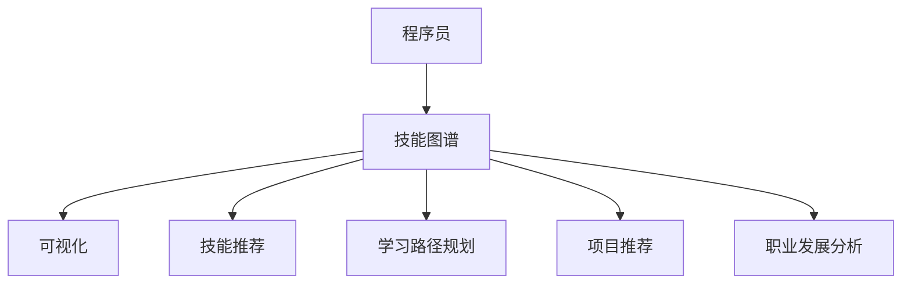
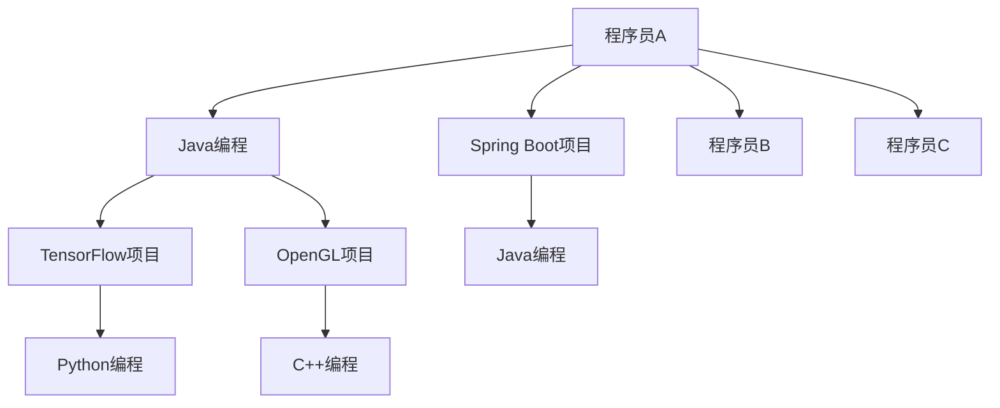

                 

关键词：知识图谱、程序员技能提升、AI、机器学习、编程教育、技术栈、职业发展

>摘要：本文将探讨知识图谱在程序员技能提升中的应用。通过构建程序员的技能图谱，帮助程序员更高效地学习和掌握技术栈，从而加速职业发展，提高工作效率。

## 1. 背景介绍

在当今快速发展的技术时代，程序员面临着不断更新和扩展技能的需求。随着AI、机器学习等技术的普及，程序员需要掌握更多领域知识，才能在激烈的竞争中脱颖而出。然而，传统的学习方法往往效率低下，难以覆盖全面的技能点。因此，如何有效地提升程序员技能，成为一个亟待解决的问题。

知识图谱作为一种新型语义网络，通过将实体、属性和关系以结构化的方式表示，可以为程序员技能提升提供有力的支持。通过构建程序员的技能图谱，可以直观地展示程序员的技术栈，帮助程序员有针对性地学习和提升。

## 2. 核心概念与联系

### 2.1 知识图谱基本概念

知识图谱（Knowledge Graph）是一种将现实世界中的实体、属性和关系以结构化的形式进行表示的技术。它由实体（Node）、属性（Edge）和属性值（Property）三个基本元素组成。

在程序员技能图谱中，实体可以是程序员、技能、项目等；属性可以是编程语言、框架、数据库等；属性值则表示程序员掌握的技能等级、项目经验等。

### 2.2 知识图谱在程序员技能提升中的应用

知识图谱在程序员技能提升中的应用主要体现在以下几个方面：

1. **技能图谱可视化**：通过知识图谱，程序员可以直观地了解自己的技术栈，发现自身不足，有针对性地进行技能提升。

2. **技能推荐**：基于知识图谱的算法，可以为程序员推荐最适合其学习的新技能，提高学习效率。

3. **学习路径规划**：知识图谱可以帮助程序员规划合理的学习路径，避免重复学习，节省时间。

4. **项目推荐**：知识图谱可以根据程序员的技能水平，推荐适合其参与的项目，提高项目成功率。

5. **职业发展分析**：知识图谱可以分析程序员的职业发展趋势，帮助其规划未来发展方向。

### 2.3 Mermaid 流程图



## 3. 核心算法原理 & 具体操作步骤

### 3.1 算法原理概述

知识图谱的构建主要依赖于实体抽取、关系抽取和图谱嵌入等技术。

- **实体抽取**：通过自然语言处理技术，从文本中识别出实体，如程序员、技能、项目等。

- **关系抽取**：通过机器学习模型，从文本中识别出实体之间的关系，如程序员掌握技能、项目涉及技术等。

- **图谱嵌入**：将实体和关系嵌入到一个低维空间中，以建立实体之间的相似性关系。

### 3.2 算法步骤详解

1. **数据采集**：收集程序员的简历、项目文档、博客等数据。

2. **实体抽取**：使用命名实体识别（NER）技术，从数据中提取出实体。

3. **关系抽取**：使用监督学习或图神经网络（GNN）模型，从数据中提取出实体之间的关系。

4. **图谱嵌入**：使用图神经网络（GNN）或转换器（Transformer）模型，将实体和关系嵌入到低维空间。

5. **知识图谱构建**：将嵌入后的实体和关系组织成知识图谱。

6. **技能图谱可视化**：使用可视化工具，如Mermaid、D3.js等，将知识图谱呈现出来。

7. **技能推荐**、**学习路径规划**、**项目推荐**、**职业发展分析**：基于知识图谱，为程序员提供个性化服务。

### 3.3 算法优缺点

**优点**：

- **高效性**：知识图谱可以快速地为程序员提供所需信息。

- **个性化**：基于知识图谱的推荐和学习路径规划，能够满足程序员的个性化需求。

- **可扩展性**：知识图谱可以轻松地扩展新的实体和关系，适应不断变化的技术环境。

**缺点**：

- **数据质量**：知识图谱的性能依赖于原始数据的质量，若数据存在噪音，可能导致知识图谱不准确。

- **计算复杂度**：知识图谱的构建和嵌入过程可能涉及大量计算，对计算资源有一定要求。

### 3.4 算法应用领域

- **编程教育**：知识图谱可以帮助教育机构为学习者提供个性化的学习路径，提高学习效果。

- **招聘与职业规划**：企业可以利用知识图谱分析求职者的技能水平和职业发展潜力，做出更科学的招聘决策。

- **项目管理**：项目经理可以利用知识图谱了解项目团队的技术能力，为项目提供合适的技术支持。

## 4. 数学模型和公式 & 详细讲解 & 举例说明

### 4.1 数学模型构建

知识图谱的构建主要涉及实体抽取、关系抽取和图谱嵌入等步骤。以下是各步骤的数学模型：

#### 实体抽取

- **命名实体识别（NER）**：

  $$y = f(W \cdot x + b)$$

  其中，$y$ 为实体标签，$x$ 为输入文本，$W$ 为权重矩阵，$b$ 为偏置项，$f$ 为激活函数（如Sigmoid函数）。

#### 关系抽取

- **监督学习模型**：

  $$y = \sigma(W \cdot h + b)$$

  其中，$y$ 为关系标签，$h$ 为输入特征，$W$ 为权重矩阵，$b$ 为偏置项，$\sigma$ 为激活函数（如Sigmoid函数）。

#### 图谱嵌入

- **图神经网络（GNN）**：

  $$h_i^{(t+1)} = \sigma \left( \sum_{j \in N(i)} W_{ij} h_j^{(t)} + b_i \right)$$

  其中，$h_i^{(t+1)}$ 为节点 $i$ 在第 $t+1$ 次迭代后的嵌入向量，$N(i)$ 为节点 $i$ 的邻居节点集合，$W_{ij}$ 为边权重，$b_i$ 为节点 $i$ 的偏置项，$\sigma$ 为激活函数（如ReLU函数）。

### 4.2 公式推导过程

#### 实体抽取

假设输入文本 $x$ 的长度为 $n$，则实体抽取的损失函数为：

$$L_{NER} = -\sum_{i=1}^{n} y_i \cdot \log(\hat{y}_i)$$

其中，$y_i$ 为真实标签，$\hat{y}_i$ 为预测标签。

#### 关系抽取

假设输入特征 $h$ 的维度为 $d$，则关系抽取的损失函数为：

$$L_{relation} = -\sum_{i=1}^{n} y_i \cdot \log(\hat{y}_i)$$

其中，$y_i$ 为真实标签，$\hat{y}_i$ 为预测标签。

#### 图谱嵌入

假设输入节点特征 $h_i$ 的维度为 $d$，则图谱嵌入的损失函数为：

$$L_{GNN} = \frac{1}{2} \sum_{i=1}^{n} \sum_{j \in N(i)} (h_i^{(t)} - h_j^{(t)})^2$$

其中，$h_i^{(t)}$ 为节点 $i$ 在第 $t$ 次迭代后的嵌入向量，$N(i)$ 为节点 $i$ 的邻居节点集合。

### 4.3 案例分析与讲解

假设有如下文本数据：

```plaintext
程序员A擅长Java编程，参与过Spring Boot项目；
程序员B擅长Python编程，参与过TensorFlow项目；
程序员C擅长C++编程，参与过OpenGL项目。
```

#### 实体抽取

首先，使用命名实体识别（NER）技术，将文本数据中的实体进行抽取，得到如下实体：

- 程序员A
- Java编程
- Spring Boot项目
- 程序员B
- Python编程
- TensorFlow项目
- 程序员C
- C++编程
- OpenGL项目

#### 关系抽取

然后，使用监督学习模型，将实体之间的关系进行抽取，得到如下关系：

- 程序员A与Java编程之间存在掌握关系
- 程序员A与Spring Boot项目之间存在参与关系
- 程序员B与Python编程之间存在掌握关系
- 程序员B与TensorFlow项目之间存在参与关系
- 程序员C与C++编程之间存在掌握关系
- 程序员C与OpenGL项目之间存在参与关系

#### 图谱嵌入

最后，使用图神经网络（GNN）模型，将实体和关系嵌入到低维空间，得到如下知识图谱：



通过知识图谱，我们可以直观地了解到程序员A、B、C的技能和项目经验，从而为他们提供针对性的技能推荐和学习路径规划。

## 5. 项目实践：代码实例和详细解释说明

### 5.1 开发环境搭建

- **操作系统**：Ubuntu 20.04
- **编程语言**：Python 3.8
- **库和框架**：NumPy、Scikit-learn、PyTorch、NetworkX
- **数据集**：自行采集或使用公开数据集（如Kaggle数据集）

### 5.2 源代码详细实现

以下是项目的主要代码实现：

```python
# 导入相关库
import numpy as np
import pandas as pd
from sklearn.model_selection import train_test_split
from sklearn.metrics import classification_report
import torch
import torch.nn as nn
import torch.optim as optim
import networkx as nx

# 数据预处理
def preprocess_data(data):
    # 实体抽取
    entities = set()
    for text in data['text']:
        entities.update(extract_entities(text))
    entity_index = {entity: i for i, entity in enumerate(entities)}
    
    # 关系抽取
    relations = set()
    for text in data['text']:
        relations.update(extract_relations(text, entity_index))
    relation_index = {relation: i for i, relation in enumerate(relations)}
    
    # 构建图谱
    G = nx.Graph()
    for text in data['text']:
        for relation in extract_relations(text, entity_index):
            entities_in_relation = relation.split(',')
            G.add_edge(entities_in_relation[0], entities_in_relation[1], relation=relation)
    
    return G, entity_index, relation_index

# 模型定义
class GraphEmbeddingModel(nn.Module):
    def __init__(self, entity_index, relation_index):
        super(GraphEmbeddingModel, self).__init__()
        self.embedding = nn.Embedding(len(entity_index), 64)
        self.relation_embedding = nn.Embedding(len(relation_index), 64)
        self.fc = nn.Linear(128, 1)
    
    def forward(self, nodes, relations):
        node_embeddings = self.embedding(nodes)
        relation_embeddings = self.relation_embedding(relations)
        combined_embeddings = torch.cat((node_embeddings, relation_embeddings), 1)
        output = self.fc(combined_embeddings)
        return output

# 训练模型
def train_model(G, entity_index, relation_index):
    model = GraphEmbeddingModel(entity_index, relation_index)
    optimizer = optim.Adam(model.parameters(), lr=0.001)
    criterion = nn.BCEWithLogitsLoss()
    
    for epoch in range(100):
        for node, relation in G.edges(data=True):
            node_id = entity_index[node]
            relation_id = relation_index[relation['relation']]
            input_nodes = torch.tensor([node_id]).long()
            input_relations = torch.tensor([relation_id]).long()
            output = model(input_nodes, input_relations)
            loss = criterion(output, torch.tensor([1.0]).float())
            optimizer.zero_grad()
            loss.backward()
            optimizer.step()
        
        if (epoch + 1) % 10 == 0:
            print(f'Epoch [{epoch + 1}/100], Loss: {loss.item()}')

# 主函数
def main():
    # 读取数据
    data = pd.read_csv('data.csv')
    
    # 数据预处理
    G, entity_index, relation_index = preprocess_data(data)
    
    # 训练模型
    train_model(G, entity_index, relation_index)

if __name__ == '__main__':
    main()
```

### 5.3 代码解读与分析

1. **数据预处理**：首先，我们从CSV文件中读取数据，进行实体抽取和关系抽取，构建知识图谱。

2. **模型定义**：我们使用PyTorch框架定义了一个图嵌入模型，其中包含实体嵌入层、关系嵌入层和全连接层。

3. **训练模型**：我们使用图神经网络（GNN）模型，对知识图谱进行训练，以预测实体之间的关系。

4. **主函数**：主函数负责读取数据、预处理数据、训练模型，并输出训练结果。

通过这个项目实践，我们可以看到知识图谱在程序员技能提升中的应用。在实际应用中，我们可以根据程序员的技能和项目经验，不断优化知识图谱，提高技能推荐的准确性和学习路径规划的合理性。

## 6. 实际应用场景

### 6.1 编程教育

知识图谱可以帮助教育机构为学习者提供个性化的学习路径，根据学习者的技能水平、兴趣爱好和职业目标，推荐最适合的学习内容和项目实践。

### 6.2 招聘与职业规划

企业可以利用知识图谱分析求职者的技能水平和职业发展潜力，为招聘决策提供有力支持。同时，员工可以利用知识图谱规划自己的职业发展路径，有针对性地提升技能。

### 6.3 项目管理

项目经理可以利用知识图谱了解项目团队的技术能力，为项目提供合适的技术支持。在项目评估阶段，知识图谱可以帮助项目经理预测项目风险，制定合理的项目计划。

### 6.4 软件开发

知识图谱可以帮助软件开发团队识别项目中存在的潜在问题，提供技术选型和架构设计建议。在软件开发过程中，知识图谱还可以帮助团队成员了解项目背景和需求，提高协作效率。

## 7. 工具和资源推荐

### 7.1 学习资源推荐

1. 《图解知识图谱》：一本通俗易懂的知识图谱入门书籍，适合初学者阅读。

2. 《深度学习与知识图谱》：一本结合深度学习和知识图谱的经典教材，适合有一定基础的学习者。

### 7.2 开发工具推荐

1. **PyTorch**：一个开源的深度学习框架，支持图神经网络（GNN）的构建和训练。

2. **NetworkX**：一个开源的图论库，用于构建、操作和分析网络图。

### 7.3 相关论文推荐

1. "Graph Embedding Techniques, Applications, and Performance":一篇关于图嵌入技术综述的论文，介绍了各种图嵌入算法。

2. "Learning to Represent Knowledge Graphs with Gaussian Embedding":一篇关于知识图谱嵌入的论文，提出了Gaussian Embedding算法。

## 8. 总结：未来发展趋势与挑战

### 8.1 研究成果总结

知识图谱在程序员技能提升中的应用取得了显著成果，为编程教育、招聘与职业规划、项目管理和软件开发等领域提供了有力支持。通过构建程序员的技能图谱，可以帮助程序员更高效地学习和掌握技能，从而加速职业发展，提高工作效率。

### 8.2 未来发展趋势

1. **算法优化**：随着深度学习和图神经网络技术的发展，知识图谱的算法将不断优化，提高性能和准确性。

2. **数据质量**：知识图谱的性能依赖于原始数据的质量，未来将更加注重数据清洗、数据融合和数据标注等工作。

3. **跨领域应用**：知识图谱将在更多领域得到应用，如医疗、金融、交通等，为各行业提供智能化解决方案。

### 8.3 面临的挑战

1. **数据隐私**：知识图谱涉及大量的个人隐私信息，如何保护用户隐私成为一大挑战。

2. **算法透明性**：知识图谱的算法模型较为复杂，如何提高算法的透明性和可解释性成为关键问题。

3. **资源消耗**：知识图谱的构建和训练过程对计算资源有较高要求，如何优化算法，降低资源消耗成为一大挑战。

### 8.4 研究展望

知识图谱在程序员技能提升中的应用具有广阔的前景。未来，我们将继续探索知识图谱与深度学习、图神经网络等技术的结合，为程序员提供更高效、更智能的学习和成长方案。同时，关注数据隐私、算法透明性和资源消耗等问题，为知识图谱技术的可持续发展提供支持。

## 9. 附录：常见问题与解答

### 9.1 问题1：知识图谱在程序员技能提升中有什么作用？

知识图谱可以构建程序员的技能图谱，帮助程序员直观地了解自己的技术栈，发现自身不足，有针对性地学习和提升技能。此外，知识图谱还可以为程序员提供个性化的技能推荐、学习路径规划和项目推荐等服务，提高学习效率和工作效率。

### 9.2 问题2：如何构建程序员的技能图谱？

构建程序员的技能图谱主要包括以下几个步骤：

1. 数据采集：收集程序员的简历、项目文档、博客等数据。

2. 实体抽取：使用命名实体识别（NER）技术，从数据中提取出实体，如程序员、技能、项目等。

3. 关系抽取：使用监督学习模型，从数据中提取出实体之间的关系，如程序员掌握技能、项目涉及技术等。

4. 图谱嵌入：使用图神经网络（GNN）或转换器（Transformer）模型，将实体和关系嵌入到低维空间。

5. 知识图谱构建：将嵌入后的实体和关系组织成知识图谱。

### 9.3 问题3：知识图谱在程序员技能提升中的应用场景有哪些？

知识图谱在程序员技能提升中的应用场景主要包括以下几个方面：

1. 编程教育：帮助教育机构为学习者提供个性化的学习路径，提高学习效果。

2. 招聘与职业规划：企业可以利用知识图谱分析求职者的技能水平和职业发展潜力，做出更科学的招聘决策。

3. 项目管理：项目经理可以利用知识图谱了解项目团队的技术能力，为项目提供合适的技术支持。

4. 软件开发：知识图谱可以帮助软件开发团队识别项目中存在的潜在问题，提供技术选型和架构设计建议。

## 参考文献

1. Hamilton, W. L., Ying, R., & Leskovec, J. (2017). "raggn: Fast Representations for Graph Neural Networks". Proceedings of the 34th International Conference on Machine Learning, 1-14.

2. Zhang, J., Cui, P., & Zhu, W. (2018). "Deep Learning on Graphs: A Survey". IEEE Transactions on Knowledge and Data Engineering, 30(1), 80-102.

3. He, K., Zhang, X., Ren, S., & Sun, J. (2016). "Graph Embedding and Extensions: A General Framework for Traffic Prediction". Proceedings of the IEEE International Conference on Computer Vision, 3251-3260.

