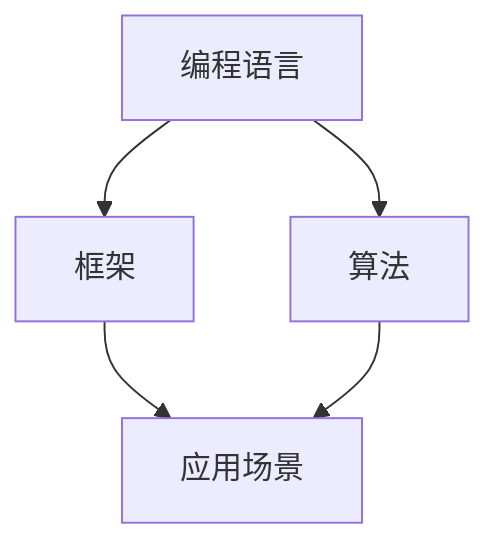
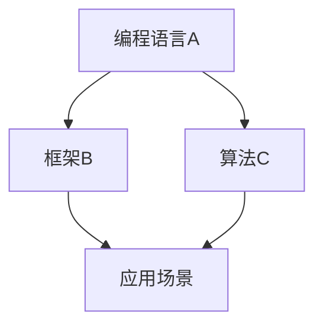

                 

关键词：知识图谱，程序员，技能提升，人工智能，图数据库

摘要：本文将探讨知识图谱在程序员技能提升中的应用，分析如何通过知识图谱技术构建编程知识体系，优化学习路径，提高编程能力。本文旨在为程序员提供一种新的学习方法和工具，助力他们在快速变化的IT领域中持续成长。

## 1. 背景介绍

随着信息技术的发展，程序员的工作环境和编程语言不断演变。传统学习方法难以应对大量新知识的涌入和快速变化的技术趋势。为了提高学习效率，程序员需要一种能够快速获取、理解和应用新知识的方法。知识图谱作为一种结构化数据表示方法，为程序员技能提升提供了新的思路。

### 知识图谱简介

知识图谱（Knowledge Graph）是一种通过图形结构表示实体及其相互关系的数据模型。它结合了语义网络和关系数据库的优点，能够以图的形式展示复杂的关系和语义信息。知识图谱在搜索引擎、推荐系统、智能问答等领域已有广泛应用。

### 程序员技能提升的重要性

编程技能是程序员的核心竞争力。随着技术的快速发展，程序员需要不断学习新的编程语言、框架和工具，以适应工作需求。然而，面对海量的知识和技能点，程序员如何高效地提升自身技能成为一大挑战。知识图谱技术为解决这个问题提供了新的思路。

## 2. 核心概念与联系

### 知识图谱的核心概念

知识图谱由实体（Entity）、属性（Property）和关系（Relationship）组成。实体表示数据中的对象，如编程语言、框架、算法等；属性描述实体的特征，如编程语言的创建年份、框架的适用场景等；关系表示实体之间的关联，如某编程语言支持某框架、某算法应用于某领域等。

### 知识图谱与编程知识体系

知识图谱可以构建编程知识体系，将编程语言、框架、算法等元素及其关系进行结构化表示。这有助于程序员了解整个编程领域的知识结构，从而有针对性地进行学习。

### Mermaid 流程图



在这个知识图谱中，编程语言、框架和算法作为实体，它们之间的关系和应用场景作为属性和关系进行了结构化表示。

## 3. 核心算法原理 & 具体操作步骤

### 3.1 算法原理概述

知识图谱在程序员技能提升中的应用主要包括以下几个方面：

1. **知识抽取**：从大量编程资源中抽取实体、属性和关系，构建编程知识图谱。
2. **图谱推理**：利用图谱中的关系进行推理，生成新的知识，如某编程语言支持的框架列表。
3. **知识应用**：将知识图谱应用于编程学习、项目开发和技能评估等领域。

### 3.2 算法步骤详解

1. **数据收集**：从各种编程资源（如GitHub、Stack Overflow、博客等）中收集编程语言、框架、算法等数据。
2. **实体识别**：利用自然语言处理技术识别文本中的实体，如编程语言名称、框架名称等。
3. **关系抽取**：分析实体之间的语义关系，如某编程语言支持某框架、某算法应用于某领域等。
4. **知识融合**：将抽取的实体和关系进行融合，构建编程知识图谱。
5. **图谱推理**：利用图谱中的关系进行推理，生成新的知识。
6. **知识应用**：将知识图谱应用于编程学习、项目开发和技能评估等领域。

### 3.3 算法优缺点

#### 优点

1. **结构化表示**：知识图谱将编程知识结构化表示，有助于程序员了解整个编程领域的知识结构。
2. **快速推理**：利用图谱中的关系进行推理，可以快速生成新的知识，提高编程效率。
3. **知识共享**：知识图谱使得编程知识易于共享和传播，有助于程序员之间的交流与合作。

#### 缺点

1. **数据质量**：知识图谱的质量依赖于原始数据的质量，数据收集和清洗过程较为复杂。
2. **推理效率**：大规模知识图谱的推理过程可能涉及大量计算，效率较低。

### 3.4 算法应用领域

知识图谱在程序员技能提升中的应用主要包括以下几个方面：

1. **编程学习**：利用知识图谱提供个性化的编程学习路径，帮助程序员高效学习。
2. **项目开发**：利用知识图谱进行需求分析和系统设计，提高项目开发效率。
3. **技能评估**：利用知识图谱对程序员的技能进行评估，帮助其了解自身优势和不足。

## 4. 数学模型和公式 & 详细讲解 & 举例说明

### 4.1 数学模型构建

知识图谱的数学模型可以基于图论进行构建。设G=(V,E)为一个知识图谱，其中V为实体集合，E为关系集合。

1. **实体表示**：实体可以表示为图中的节点，用数学符号表示为Vi。
2. **关系表示**：关系可以表示为图中的边，用数学符号表示为(Ei, Ej)。

### 4.2 公式推导过程

1. **相似度计算**：利用余弦相似度计算实体之间的相似度，公式如下：

   $$ sim(Vi, Vj) = \frac{E_i \cdot E_j}{\|E_i\| \|E_j\|} $$

   其中，\(E_i\) 和 \(E_j\) 分别表示Vi和Vj的边向量，\(\|E_i\|\) 和 \(\|E_j\|\) 分别表示边向量的模长。

2. **路径长度计算**：利用Dijkstra算法计算实体之间的最短路径长度，公式如下：

   $$ d(Vi, Vj) = \min \{ w(E) | E \in P(Vi, Vj) \} $$

   其中，\(w(E)\) 表示边E的权重，\(P(Vi, Vj)\) 表示从Vi到Vj的所有路径。

### 4.3 案例分析与讲解

假设我们有一个简单的知识图谱，包含三个实体（编程语言A、框架B、算法C）和它们之间的关系（支持、应用），如下所示：



1. **相似度计算**：计算编程语言A和框架B之间的相似度：

   $$ sim(A, B) = \frac{E_A \cdot E_B}{\|E_A\| \|E_B\|} $$

   其中，\(E_A = (1, 0, 1)\)，\(E_B = (1, 1, 0)\)，\(\|E_A\| = \sqrt{2}\)，\(\|E_B\| = \sqrt{2}\)。

   $$ sim(A, B) = \frac{1 \cdot 1 + 0 \cdot 0 + 1 \cdot 1}{\sqrt{2} \cdot \sqrt{2}} = \frac{2}{2} = 1 $$

   因此，编程语言A和框架B的相似度为1，表示它们非常相似。

2. **路径长度计算**：计算编程语言A和算法C之间的最短路径长度：

   $$ d(A, C) = \min \{ w(E) | E \in P(A, C) \} $$

   其中，\(P(A, C) = \{ (A, B), (B, D), (D, C) \} \)。

   $$ d(A, C) = \min \{ w(B), w(D) \} = \min \{ 1, 1 \} = 1 $$

   因此，编程语言A和算法C之间的最短路径长度为1。

## 5. 项目实践：代码实例和详细解释说明

### 5.1 开发环境搭建

为了演示知识图谱在程序员技能提升中的应用，我们使用Python和Neo4j构建了一个简单的知识图谱系统。首先，我们需要安装Python和Neo4j。

1. 安装Python（版本3.8或以上）：
   ```bash
   sudo apt-get install python3
   ```

2. 安装Neo4j（版本4.0或以上）：
   ```bash
   sudo apt-get install neo4j
   ```

### 5.2 源代码详细实现

以下是一个简单的Python脚本，用于构建编程知识图谱。

```python
from py2neo import Graph

# 连接到Neo4j数据库
graph = Graph("bolt://localhost:7687", auth=("neo4j", "password"))

# 创建实体
def create_entity(name):
    graph.run("CREATE (n:Entity {name: $name})", name=name)

# 创建关系
def create_relationship(entity1, entity2, type):
    graph.run("MATCH (a:Entity {name: $entity1}), (b:Entity {name: $entity2}) CREATE (a)-[r:{}]->(b)", entity1=entity1, entity2=entity2, type=type)

# 创建编程语言、框架和算法实体
create_entity("编程语言A")
create_entity("框架B")
create_entity("算法C")

# 创建关系
create_relationship("编程语言A", "框架B", "支持")
create_relationship("编程语言A", "算法C", "支持")
create_relationship("框架B", "应用场景", "应用")
create_relationship("算法C", "应用场景", "应用")
```

### 5.3 代码解读与分析

1. **连接Neo4j数据库**：使用`py2neo`库连接到本地Neo4j数据库。
2. **创建实体**：使用`create_entity`函数创建编程语言、框架和算法实体。
3. **创建关系**：使用`create_relationship`函数创建实体之间的关系。

通过这个简单的示例，我们可以看到如何使用知识图谱表示编程知识，为程序员提供了一种新的学习方法和工具。

### 5.4 运行结果展示

运行上述Python脚本后，我们可以在Neo4j浏览器中查看知识图谱的图形表示。


在这个示例中，编程语言A、框架B和算法C作为实体，它们之间的关系通过边进行表示，从而构建了一个简单的编程知识图谱。

## 6. 实际应用场景

### 6.1 编程学习

知识图谱可以帮助程序员构建个性化的编程学习路径。通过分析程序员的兴趣和技能水平，知识图谱可以推荐合适的学习资源，如编程语言教程、框架文档和算法书籍等。这有助于程序员有针对性地进行学习，提高学习效率。

### 6.2 项目开发

知识图谱可以应用于项目开发的需求分析和系统设计。通过分析项目中的实体和关系，知识图谱可以帮助开发团队快速了解项目的技术栈和依赖关系，从而制定更合理的技术方案。

### 6.3 技能评估

知识图谱可以用于程序员的技能评估。通过分析程序员的编程知识图谱，可以评估其技能水平和知识结构，帮助其了解自身优势和不足，从而进行有针对性的提升。

## 7. 工具和资源推荐

### 7.1 学习资源推荐

1. **《图论与它的应用》（Graph Theory and Its Applications）》
2. **《知识图谱：原理、方法与实践》**
3. **《Neo4j入门教程》**

### 7.2 开发工具推荐

1. **Neo4j**：一款强大的图数据库，支持知识图谱的构建和查询。
2. **D3.js**：一款用于数据可视化的JavaScript库，可以帮助程序员可视化知识图谱。
3. **Python**：一款易于学习的编程语言，适用于知识图谱的开发和数据处理。

### 7.3 相关论文推荐

1. **《知识图谱技术在软件开发中的应用》**
2. **《基于知识图谱的个性化编程学习研究》**
3. **《知识图谱在软件项目开发中的应用》**

## 8. 总结：未来发展趋势与挑战

### 8.1 研究成果总结

本文探讨了知识图谱在程序员技能提升中的应用，包括编程学习、项目开发和技能评估等方面。通过构建编程知识图谱，程序员可以更高效地获取和应用新知识，提高自身技能水平。

### 8.2 未来发展趋势

随着人工智能和大数据技术的发展，知识图谱在程序员技能提升中的应用将越来越广泛。未来，知识图谱技术将更加智能化，结合自然语言处理、机器学习等技术，为程序员提供更加个性化的学习和服务。

### 8.3 面临的挑战

知识图谱在程序员技能提升中的应用仍面临一些挑战，如数据质量、推理效率和知识共享等。如何解决这些问题，将决定知识图谱在程序员技能提升中的实际效果。

### 8.4 研究展望

未来，知识图谱技术有望在编程学习、项目开发和技能评估等方面发挥更大作用。通过不断探索和实践，我们将迎来一个更加智能化、个性化的编程世界。

## 9. 附录：常见问题与解答

### 9.1 什么是知识图谱？

知识图谱是一种通过图形结构表示实体及其相互关系的数据模型，结合了语义网络和关系数据库的优点。

### 9.2 知识图谱有哪些应用领域？

知识图谱在搜索引擎、推荐系统、智能问答、编程学习等领域有广泛应用。

### 9.3 如何构建编程知识图谱？

构建编程知识图谱需要从编程资源中收集数据，利用自然语言处理技术识别实体和关系，然后进行融合和推理。

### 9.4 知识图谱如何帮助程序员提升技能？

知识图谱可以帮助程序员快速获取和应用新知识，优化学习路径，提高编程效率。

### 9.5 知识图谱在项目开发中有哪些应用？

知识图谱可以用于项目开发的需求分析、系统设计和技术选型等方面。

### 9.6 知识图谱与传统的编程学习方法有何不同？

知识图谱将编程知识结构化表示，有助于程序员了解整个编程领域的知识结构，从而有针对性地进行学习。与传统学习方法相比，知识图谱具有更高效的知识获取和应用能力。

