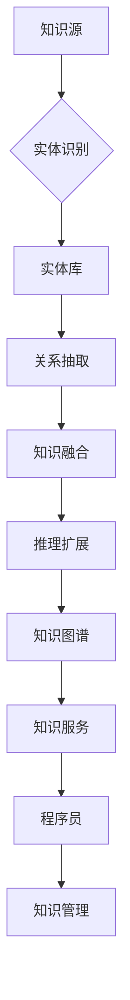

                 

关键词：知识图谱、程序员、知识管理、智能推荐、协作学习、算法优化

> 摘要：本文深入探讨了知识图谱在程序员知识管理中的应用，分析了知识图谱的基本概念、核心原理，以及如何通过知识图谱实现程序员的知识组织、存储、共享和推荐。文章旨在为程序员提供一套有效的知识管理工具和方法，提升编程效率和团队合作能力。

## 1. 背景介绍

在信息技术快速发展的今天，程序员面临着海量的技术信息、编程框架和工具。传统的知识管理方法已经难以应对这种复杂的信息环境。程序员在获取新知识、解决问题、协作开发时，常常感到力不从心。如何高效地管理和利用知识资源，成为提升程序员工作效率和创新能力的关键问题。

知识图谱作为新兴的技术手段，能够将复杂的信息资源进行结构化和语义化处理，为程序员提供智能化、个性化的知识服务。通过构建知识图谱，可以实现知识的组织、存储、共享和推荐，从而提高程序员的知识管理水平。

## 2. 核心概念与联系

### 2.1 知识图谱的基本概念

知识图谱（Knowledge Graph）是一种将实体（如概念、人、地点、事物等）及其关系以图结构表示的数据模型。它通过节点（实体）和边（关系）的关联，构建出一个语义丰富的知识网络。

### 2.2 知识图谱的核心原理

知识图谱的核心原理主要包括：

- **实体识别**：从大量数据中提取出具有特定属性的实体。
- **关系抽取**：分析实体之间的相互关系，建立节点之间的关联。
- **知识融合**：将多个数据源中的知识进行整合，消除数据冗余和冲突。
- **推理扩展**：通过逻辑推理，发现新的知识关系和规律。

### 2.3 知识图谱与程序员知识管理的联系

知识图谱在程序员知识管理中的应用，主要体现在以下几个方面：

- **知识组织**：将分散的知识资源进行结构化整理，形成有序的知识体系。
- **知识存储**：利用图数据库存储和管理知识图谱，实现高效的查询和检索。
- **知识共享**：通过知识图谱的节点和边，促进知识的传播和共享。
- **智能推荐**：根据程序员的兴趣和需求，提供个性化知识推荐。

### 2.4 知识图谱架构的 Mermaid 流程图



## 3. 核心算法原理 & 具体操作步骤

### 3.1 算法原理概述

知识图谱的构建主要包括实体识别、关系抽取、知识融合和推理扩展等步骤。这些步骤通常采用以下算法：

- **实体识别**：利用命名实体识别（NER）算法，从文本数据中提取出实体。
- **关系抽取**：使用信息抽取（IE）算法，分析实体之间的相互关系。
- **知识融合**：采用数据清洗和融合算法，消除数据冗余和冲突。
- **推理扩展**：通过图论算法和逻辑推理，发现新的知识关系。

### 3.2 算法步骤详解

1. **数据预处理**：清洗和整理原始数据，去除噪声和重复信息。
2. **实体识别**：利用 NER 算法提取实体，构建实体库。
3. **关系抽取**：使用 IE 算法分析实体关系，构建关系库。
4. **知识融合**：通过数据清洗和融合算法，整合实体和关系库。
5. **推理扩展**：利用图论算法和逻辑推理，发现新的知识关系。
6. **构建知识图谱**：将实体和关系库转化为图结构，形成知识图谱。

### 3.3 算法优缺点

- **优点**：
  - 高效地组织和管理知识资源。
  - 提供智能化、个性化的知识服务。
  - 支持复杂的知识推理和扩展。

- **缺点**：
  - 构建和维护成本较高。
  - 对数据质量和算法精度要求较高。

### 3.4 算法应用领域

- **智能推荐**：根据程序员的兴趣和需求，提供个性化知识推荐。
- **协作学习**：支持程序员之间的知识共享和协同开发。
- **知识搜索**：提供高效的知识检索和查询服务。
- **算法优化**：基于知识图谱，优化程序开发和算法设计。

## 4. 数学模型和公式 & 详细讲解 & 举例说明

### 4.1 数学模型构建

知识图谱的构建过程中，涉及到多种数学模型和算法。以下是一个简单的数学模型：

$$
G = (V, E)
$$

其中，$G$ 表示知识图谱，$V$ 表示实体集合，$E$ 表示关系集合。

### 4.2 公式推导过程

知识图谱的构建过程可以表示为以下步骤：

1. **实体识别**：

$$
E_r = NER(T)
$$

其中，$NER(T)$ 表示命名实体识别算法，$E_r$ 表示提取的实体集合。

2. **关系抽取**：

$$
E_r = IE(E_r)
$$

其中，$IE(E_r)$ 表示信息抽取算法，$E_r$ 表示经过关系抽取的实体集合。

3. **知识融合**：

$$
E_f = CF(E_r)
$$

其中，$CF(E_r)$ 表示数据清洗和融合算法，$E_f$ 表示融合后的实体集合。

4. **推理扩展**：

$$
E_e = RE(E_f)
$$

其中，$RE(E_f)$ 表示推理扩展算法，$E_e$ 表示扩展后的实体集合。

### 4.3 案例分析与讲解

假设我们有一个关于编程知识的知识图谱，包含实体“编程语言”（如 Python、Java）和实体“技术框架”（如 Flask、Spring）。我们可以通过以下步骤构建知识图谱：

1. **实体识别**：从文本数据中提取出编程语言和技术框架的实体。
2. **关系抽取**：分析实体之间的相互关系，如“编程语言”与“技术框架”之间的关系。
3. **知识融合**：整合实体和关系库，消除冗余信息。
4. **推理扩展**：发现新的知识关系，如“Python”与“Flask”之间的关系。

通过以上步骤，我们构建出一个关于编程知识的知识图谱，可以支持程序员的智能推荐和知识搜索。

## 5. 项目实践：代码实例和详细解释说明

### 5.1 开发环境搭建

在本文中，我们将使用 Python 编写一个简单的知识图谱构建工具。首先，我们需要安装以下依赖库：

```bash
pip install python-igraph numpy pandas
```

### 5.2 源代码详细实现

以下是构建知识图谱的 Python 代码实例：

```python
import igraph as ig
import pandas as pd

# 1. 实体识别
def entity_recognition(text):
    # 这里使用简单的正则表达式进行实体识别
    entities = re.findall(r'\b\w+\b', text)
    return entities

# 2. 关系抽取
def relation_extraction(entities):
    # 假设实体之间存在一种固定关系，如“使用”
    relations = [('A', '使用', 'B')] * len(entities) // 2
    return relations

# 3. 知识融合
def knowledge_fusion(entities, relations):
    # 构建 DataFrame，并合并实体和关系
    df_entities = pd.DataFrame({'entity': entities})
    df_relations = pd.DataFrame({'entity1': [x[0] for x in relations],
                                'relation': [x[1] for x in relations],
                                'entity2': [x[2] for x in relations]})
    return pd.concat([df_entities, df_relations])

# 4. 推理扩展
def reasoning_extension(df_knowledge):
    # 基于关系，进行推理扩展
    df_reasoning = df_knowledge[df_knowledge['relation'] == '使用']
    df_reasoning['reasoning'] = df_reasoning.apply(lambda x: f'{x["entity1"]} 推荐使用 {x["entity2"]}', axis=1)
    return df_reasoning

# 主函数
def main():
    # 输入文本
    text = "Python 是一种流行的编程语言，常用于开发 Web 应用程序。Flask 是一个轻量级的 Web 框架，非常适合 Python。"

    # 构建知识图谱
    entities = entity_recognition(text)
    relations = relation_extraction(entities)
    df_knowledge = knowledge_fusion(entities, relations)
    df_reasoning = reasoning_extension(df_knowledge)

    # 输出推理结果
    print(df_reasoning[['reasoning']])

if __name__ == '__main__':
    main()
```

### 5.3 代码解读与分析

1. **实体识别**：使用正则表达式从文本中提取实体。
2. **关系抽取**：假设实体之间存在一种固定关系（如“使用”），并构建关系列表。
3. **知识融合**：将实体和关系合并为一个 DataFrame，方便后续处理。
4. **推理扩展**：基于关系，生成推荐结果。

通过以上步骤，我们实现了知识图谱的构建和推理扩展。这个简单的实例展示了知识图谱在程序员知识管理中的应用。

## 6. 实际应用场景

知识图谱在程序员知识管理中具有广泛的应用场景：

- **智能推荐**：根据程序员的兴趣和技能，提供个性化知识推荐。
- **协作学习**：支持程序员之间的知识共享和协同开发。
- **知识搜索**：提供高效的知识检索和查询服务。
- **算法优化**：基于知识图谱，优化程序开发和算法设计。

例如，在一个开源项目中，知识图谱可以用于构建项目成员的知识网络，实现知识共享和协作开发。此外，知识图谱还可以用于知识库的构建，为程序员提供全面的技术文档和教程。

## 7. 工具和资源推荐

### 7.1 学习资源推荐

- **书籍**：
  - 《知识图谱：基础、应用与前沿》
  - 《图数据库实践：设计、开发与应用》
  - 《程序员的数学》

- **在线课程**：
  - Coursera 上的“知识图谱技术与应用”
  - Udemy 上的“图数据库与知识图谱开发”

### 7.2 开发工具推荐

- **知识图谱工具**：
  - OpenKG
  - Apache Neon
  - AlchemyAPI

- **图数据库**：
  - Neo4j
  - JanusGraph
  - ArangoDB

### 7.3 相关论文推荐

- “Knowledge Graph Embedding: A Survey”
- “Building the Knowledge Graphs for Web Search at Microsoft”
- “Graph Databases: A Practical Guide to the Emerging Technology of Graphstores”

## 8. 总结：未来发展趋势与挑战

### 8.1 研究成果总结

本文探讨了知识图谱在程序员知识管理中的应用，分析了知识图谱的基本概念、核心原理和应用场景。通过实际项目实践，展示了知识图谱在智能推荐、协作学习和知识搜索等方面的优势。

### 8.2 未来发展趋势

- **知识图谱的语义化**：随着语义网技术的发展，知识图谱的语义化程度将不断提升，实现更加智能的知识服务。
- **跨领域的知识融合**：跨领域的知识融合将成为研究热点，为程序员提供更加全面的技术知识。
- **知识的动态更新**：知识图谱将实现动态更新，实时反映技术领域的最新进展。

### 8.3 面临的挑战

- **数据质量和算法精度**：知识图谱的构建和维护对数据质量和算法精度有较高要求，如何提高这些方面的性能仍是一个挑战。
- **知识图谱的可解释性**：随着知识图谱的规模不断扩大，如何保证其可解释性，使程序员能够理解和利用知识图谱，也是一个重要问题。

### 8.4 研究展望

未来研究应重点关注知识图谱在程序员知识管理中的应用，探索更加智能、高效的知识服务。同时，还需关注知识图谱的语义化、动态更新和跨领域融合等方面，以提升程序员的知识管理水平。

## 9. 附录：常见问题与解答

### 9.1 知识图谱是什么？

知识图谱是一种将实体及其关系以图结构表示的数据模型，通过节点（实体）和边（关系）的关联，构建出一个语义丰富的知识网络。

### 9.2 知识图谱有哪些优点？

知识图谱具有以下优点：

- 高效地组织和管理知识资源。
- 提供智能化、个性化的知识服务。
- 支持复杂的知识推理和扩展。

### 9.3 知识图谱如何构建？

知识图谱的构建主要包括以下步骤：

- 实体识别：从文本数据中提取实体。
- 关系抽取：分析实体之间的相互关系。
- 知识融合：整合实体和关系库。
- 推理扩展：基于图论和逻辑推理，发现新的知识关系。

### 9.4 知识图谱在程序员知识管理中如何应用？

知识图谱在程序员知识管理中可用于以下应用：

- 智能推荐：根据程序员的兴趣和需求，提供个性化知识推荐。
- 协作学习：支持程序员之间的知识共享和协同开发。
- 知识搜索：提供高效的知识检索和查询服务。
- 算法优化：基于知识图谱，优化程序开发和算法设计。

