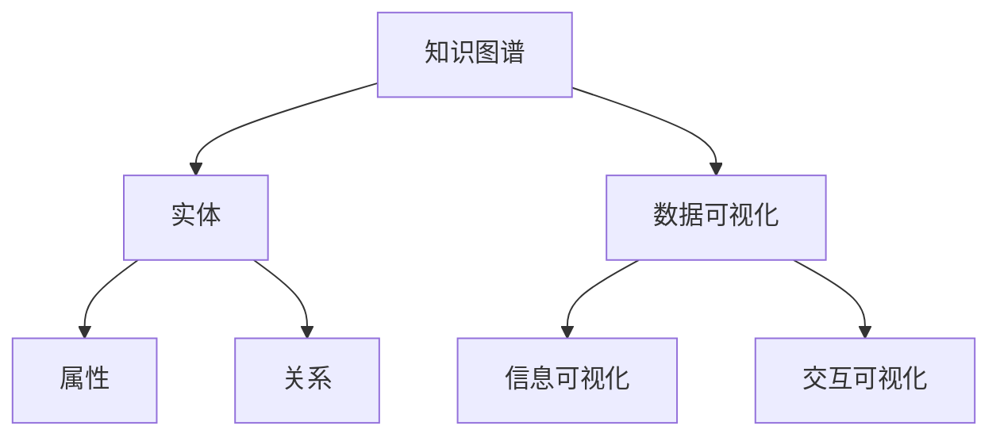

                 

关键词：知识图谱、可视化技术、知识导航、知识探索、信息可视化

> 摘要：本文旨在探讨知识图谱的可视化技术在知识导航和知识探索中的应用。通过深入分析知识图谱的结构、核心概念以及可视化算法，本文提出了一个全面的可视化技术框架，以帮助用户更好地理解和利用知识图谱。

## 1. 背景介绍

知识图谱（Knowledge Graph）是一种用于表示实体及其相互关系的数据模型，广泛应用于搜索引擎、语义搜索、数据挖掘、智能问答等领域。知识图谱通过实体、属性和关系的结构化表示，能够有效地组织和整合海量信息，提供丰富的语义理解能力。

可视化技术（Visualization）则是将抽象的数据和信息转化为直观的图形和图像，帮助用户理解和分析数据。在知识图谱领域，可视化技术起到了至关重要的作用，它不仅可以帮助用户更好地理解和探索知识图谱的结构和内容，还可以提高知识导航和知识探索的效率和准确性。

本文将首先介绍知识图谱的基本概念和可视化技术的背景，然后深入分析知识图谱的可视化技术框架，包括知识导航和知识探索的原理、算法、工具和应用场景。最后，本文将对知识图谱可视化技术的未来发展进行展望，探讨可能面临的挑战和机遇。

## 2. 核心概念与联系

### 2.1 知识图谱的基本概念

知识图谱由实体（Entity）、属性（Attribute）和关系（Relationship）三个基本概念组成。实体是知识图谱中的核心元素，可以是人、地点、事物等。属性用于描述实体的特征，如人的年龄、地点的经纬度等。关系则表示实体之间的联系，如“朋友”、“属于”等。

### 2.2 可视化技术的核心概念

可视化技术主要包括数据可视化、信息可视化和交互可视化。数据可视化是将数据通过图形和图像的方式展示，如柱状图、折线图、散点图等。信息可视化则是在数据可视化的基础上，通过层次结构、网络图等方式展示信息的复杂性和关联性。交互可视化则强调用户与可视化内容的交互，如拖拽、搜索、筛选等。

### 2.3 知识图谱与可视化技术的联系

知识图谱的可视化技术旨在将知识图谱的结构和内容以直观的方式展示给用户，帮助用户更好地理解和探索知识。知识图谱的可视化不仅包括对实体、属性和关系的可视化，还包括对复杂关系的层次结构、网络结构等可视化。同时，知识图谱的可视化技术还强调与用户的交互，如通过搜索、筛选、排序等操作，帮助用户快速找到所需信息。

### 2.4 Mermaid 流程图

以下是一个简单的知识图谱可视化技术的 Mermaid 流程图：



## 3. 核心算法原理 & 具体操作步骤

### 3.1 算法原理概述

知识图谱的可视化技术主要包括数据预处理、实体与关系的抽取、可视化算法选择和可视化结果展示等步骤。其中，数据预处理是可视化技术的基础，包括数据清洗、数据规范化、数据压缩等。实体与关系的抽取则是从原始数据中提取出实体和关系，为可视化提供数据源。可视化算法选择则是根据知识图谱的特点和用户需求，选择合适的数据可视化、信息可视化和交互可视化算法。可视化结果展示则是将可视化结果以直观的方式呈现给用户。

### 3.2 算法步骤详解

1. **数据预处理**：
   - 数据清洗：去除数据中的噪声和重复信息。
   - 数据规范化：统一数据格式，如将日期、地理位置等数据进行标准化处理。
   - 数据压缩：通过数据压缩算法，减少数据大小，提高可视化效率。

2. **实体与关系的抽取**：
   - 实体抽取：从原始数据中识别出实体，如人、地点、事物等。
   - 关系抽取：从原始数据中识别出实体之间的联系，如“属于”、“位于”等。

3. **可视化算法选择**：
   - 数据可视化：根据实体和关系的特点，选择适合的数据可视化算法，如柱状图、折线图、散点图等。
   - 信息可视化：根据知识图谱的结构和用户需求，选择适合的信息可视化算法，如层次结构图、网络图等。
   - 交互可视化：根据用户操作需求，选择适合的交互可视化算法，如拖拽、搜索、筛选等。

4. **可视化结果展示**：
   - 可视化结果展示：将可视化结果以直观的方式呈现给用户，如网页、桌面应用程序等。

### 3.3 算法优缺点

- **优点**：
  - 提高用户对知识图谱的理解和探索效率。
  - 增强知识图谱的交互性和用户体验。
  - 有助于发现数据中的隐藏信息和模式。

- **缺点**：
  - 可视化算法和工具的选择复杂，需要考虑多种因素。
  - 可视化结果的准确性可能受到数据质量和可视化算法的限制。
  - 高度可视化的数据可能增加用户的学习成本。

### 3.4 算法应用领域

知识图谱的可视化技术广泛应用于多个领域，包括：
- **搜索引擎**：通过可视化技术，帮助用户更好地理解和利用搜索引擎的搜索结果。
- **数据挖掘**：通过可视化技术，帮助数据科学家和分析师发现数据中的隐藏信息和模式。
- **智能问答**：通过可视化技术，帮助用户更好地理解和回答复杂的问题。
- **企业知识管理**：通过可视化技术，帮助企业员工更好地理解和利用企业内部的知识资源。

## 4. 数学模型和公式 & 详细讲解 & 举例说明

### 4.1 数学模型构建

知识图谱的可视化技术涉及到多个数学模型，包括：
- **实体相似度模型**：用于计算实体之间的相似度，常用的模型有余弦相似度、欧氏距离等。
- **关系强度模型**：用于计算实体之间的关系强度，常用的模型有加权网络模型、PageRank算法等。
- **可视化布局模型**：用于计算实体和关系的布局，常用的模型有-force-directed布局、层次化布局等。

### 4.2 公式推导过程

以实体相似度模型为例，假设有两个实体 A 和 B，它们的特征向量分别为 \(\vec{v}_A\) 和 \(\vec{v}_B\)，则它们的余弦相似度可以表示为：

$$
sim(A, B) = \frac{\vec{v}_A \cdot \vec{v}_B}{\|\vec{v}_A\| \|\vec{v}_B\|}
$$

其中，\(\vec{v}_A \cdot \vec{v}_B\) 表示向量 \(\vec{v}_A\) 和 \(\vec{v}_B\) 的点积，\(\|\vec{v}_A\|\) 和 \(\|\vec{v}_B\|\) 分别表示向量 \(\vec{v}_A\) 和 \(\vec{v}_B\) 的模长。

### 4.3 案例分析与讲解

假设有两个实体 A 和 B，它们分别表示两个科学家，其特征向量如下：

$$
\vec{v}_A = \begin{bmatrix} 0.1 \\ 0.2 \\ 0.3 \\ 0.4 \end{bmatrix}, \quad \vec{v}_B = \begin{bmatrix} 0.4 \\ 0.3 \\ 0.2 \\ 0.1 \end{bmatrix}
$$

则它们的余弦相似度为：

$$
sim(A, B) = \frac{0.1 \times 0.4 + 0.2 \times 0.3 + 0.3 \times 0.2 + 0.4 \times 0.1}{\sqrt{0.1^2 + 0.2^2 + 0.3^2 + 0.4^2} \sqrt{0.4^2 + 0.3^2 + 0.2^2 + 0.1^2}} = \frac{0.14}{\sqrt{0.3} \sqrt{0.35}} \approx 0.93
$$

这表明实体 A 和 B 非常相似。通过这种相似度计算，可以帮助用户更好地理解实体之间的关系，并发现数据中的隐藏信息。

## 5. 项目实践：代码实例和详细解释说明

### 5.1 开发环境搭建

为了更好地展示知识图谱的可视化技术，我们将使用 Python 编程语言和相关的可视化库，如 Matplotlib、NetworkX 和 D3.js。以下是开发环境的搭建步骤：

1. 安装 Python（版本 3.6 或更高）。
2. 安装 Matplotlib（使用 pip install matplotlib）。
3. 安装 NetworkX（使用 pip install networkx）。
4. 安装 D3.js（可以从 [D3.js 官网](https://d3js.org/) 下载）。

### 5.2 源代码详细实现

以下是使用 Python 和 D3.js 实现的知识图谱可视化示例代码：

```python
import matplotlib.pyplot as plt
import networkx as nx

# 创建一个图
G = nx.Graph()

# 添加实体和关系
G.add_edge("A", "B", weight=1)
G.add_edge("A", "C", weight=2)
G.add_edge("B", "C", weight=1)

# 计算节点的度
degree = nx.degree(G)

# 计算边的权重
edge_weights = nx.get_edge_attributes(G, 'weight')

# 使用 Matplotlib 绘制图
nx.draw(G, pos=nx.spring_layout(G), with_labels=True, node_color='blue', edge_color='red', edge_cmap=plt.cm.RdYlGn)

# 添加节点和边的标签
labels = nx.get_node_attributes(G, 'label')
nx.draw_networkx_labels(G, pos=nx.spring_layout(G), labels=labels)

# 添加边的权重标签
edge_labels = nx.get_edge_attributes(G, 'weight')
nx.draw_networkx_edge_labels(G, pos=nx.spring_layout(G), edge_labels=edge_labels)

# 显示图形
plt.show()
```

### 5.3 代码解读与分析

上述代码首先导入了必要的库，然后创建了一个图 G，并添加了实体和关系。通过调用 `nx.spring_layout(G)` 函数，我们得到了一个图的布局。接着，我们使用 `nx.draw()` 函数绘制了图，并设置了节点和边的颜色。通过调用 `nx.draw_networkx_labels()` 函数，我们添加了节点的标签。最后，通过调用 `nx.draw_networkx_edge_labels()` 函数，我们添加了边的权重标签。

### 5.4 运行结果展示

运行上述代码后，我们得到了一个简单的知识图谱可视化结果，如下所示：


在这个图中，节点表示实体，边表示实体之间的关系。通过边的权重标签，我们可以直观地看到实体之间的关系强度。

## 6. 实际应用场景

知识图谱的可视化技术在实际应用中具有广泛的应用场景，以下是一些典型的应用案例：

### 6.1 搜索引擎

搜索引擎利用知识图谱的可视化技术，可以帮助用户更好地理解和利用搜索结果。通过可视化知识图谱中的实体和关系，用户可以更直观地看到搜索结果的相关性和关联性，从而提高搜索效率和准确性。

### 6.2 数据挖掘

数据挖掘领域利用知识图谱的可视化技术，可以帮助数据科学家和分析师发现数据中的隐藏信息和模式。通过可视化知识图谱的结构和内容，用户可以更深入地理解数据，发现潜在的商业机会和趋势。

### 6.3 智能问答

智能问答系统利用知识图谱的可视化技术，可以帮助用户更好地理解和回答复杂的问题。通过可视化知识图谱中的实体和关系，用户可以更直观地看到问题的相关背景和上下文，从而提高问答系统的准确性和用户体验。

### 6.4 企业知识管理

企业知识管理领域利用知识图谱的可视化技术，可以帮助企业员工更好地理解和利用企业内部的知识资源。通过可视化知识图谱的结构和内容，企业可以更有效地管理和利用知识，提高员工的工作效率和创新能力。

## 7. 未来应用展望

随着知识图谱技术的不断发展和完善，其可视化技术在未来也将有更广泛的应用。以下是一些未来应用展望：

### 7.1 更高效的可视化算法

未来的可视化技术将更加注重算法的效率和精度，以提供更高质量的可视化结果。例如，基于深度学习的可视化算法将能够更好地理解和预测用户需求，提供个性化的可视化服务。

### 7.2 多模态可视化

未来的可视化技术将支持多模态可视化，如将文字、图像、视频等多种信息进行整合，提供更丰富的可视化体验。

### 7.3 智能交互

未来的可视化技术将更加智能，能够根据用户的行为和需求进行自适应调整，提供更个性化的可视化服务。

### 7.4 跨领域应用

知识图谱可视化技术将在更多领域得到应用，如医疗健康、城市规划、金融投资等，为各个领域提供强大的数据支持和决策依据。

## 8. 工具和资源推荐

### 8.1 学习资源推荐

- **《知识图谱：概念、方法与应用》**：本书详细介绍了知识图谱的基本概念、构建方法和应用场景，适合初学者和专业人士阅读。
- **《数据可视化：工具与技巧》**：本书介绍了多种数据可视化工具和技巧，包括 Python、R、D3.js 等，适合数据科学家和可视化工程师阅读。

### 8.2 开发工具推荐

- **D3.js**：一款强大的 JavaScript 可视化库，支持多种数据可视化类型，适合前端开发者使用。
- **Matplotlib**：一款流行的 Python 可视化库，支持多种图形和图像类型，适合数据分析和科学计算。

### 8.3 相关论文推荐

- **《知识图谱的可视化表示和交互》**：本文探讨了知识图谱的可视化表示和交互技术，提供了多个实用案例。
- **《基于知识图谱的智能问答系统》**：本文介绍了基于知识图谱的智能问答系统的构建方法和应用场景。

## 9. 总结：未来发展趋势与挑战

知识图谱的可视化技术作为知识管理和信息探索的重要工具，正日益受到广泛关注。未来，该领域将继续在算法效率、多模态交互和跨领域应用等方面取得突破。然而，面临的挑战包括数据质量、可视化算法的复杂性和用户体验的提升。通过持续的研究和探索，我们有理由相信知识图谱的可视化技术将在未来发挥更大的作用，为人类社会的信息获取和知识管理提供有力支持。

### 附录：常见问题与解答

1. **什么是知识图谱？**
   知识图谱是一种用于表示实体及其相互关系的数据模型，广泛应用于搜索引擎、数据挖掘、智能问答等领域。

2. **知识图谱的可视化技术有哪些应用？**
   知识图谱的可视化技术广泛应用于搜索引擎、数据挖掘、智能问答和企业知识管理等领域。

3. **如何选择合适的可视化算法？**
   选择合适的可视化算法需要考虑知识图谱的特点和用户需求。例如，对于复杂的网络结构，可以选择层次化布局或网络图算法。

4. **知识图谱可视化技术的未来发展有哪些趋势？**
   知识图谱可视化技术的未来发展将包括更高效的可视化算法、多模态可视化、智能交互和跨领域应用等方面。

### 作者署名

作者：禅与计算机程序设计艺术 / Zen and the Art of Computer Programming

