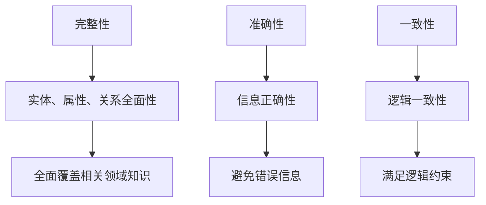

                 

关键词：知识图谱、质量评估、完整性、准确性、一致性

> 摘要：本文探讨了知识图谱的质量评估问题，重点分析了完整性、准确性和一致性三个关键维度。通过对核心概念与关系的介绍，阐述了评估算法原理、数学模型和具体操作步骤，并结合实际项目实例进行详细解释。此外，文章还讨论了知识图谱在实际应用场景中的运用，以及未来发展趋势和面临的挑战。

## 1. 背景介绍

随着互联网的迅猛发展，数据获取和处理能力得到了极大的提升。知识图谱作为一种新型数据结构，因其能够有效地组织、表示和利用海量信息，逐渐成为人工智能领域的研究热点。知识图谱通过实体、属性和关系的组合，将现实世界中的知识以结构化形式进行建模，为各行业提供了强大的数据支撑。

然而，知识图谱的质量直接影响其应用效果。一个高质量的知识图谱不仅要求具备丰富的知识内容和广泛的关系连接，还要求在完整性、准确性和一致性方面达到较高的水平。因此，本文将围绕知识图谱的质量评估问题，重点探讨完整性、准确性和一致性三个核心维度。

## 2. 核心概念与联系

### 2.1 完整性（Completeness）

完整性是指知识图谱中包含的实体、属性和关系的全面程度。一个完整的知识图谱应该尽可能地涵盖相关领域的知识，避免遗漏重要信息。

### 2.2 准确性（Accuracy）

准确性是指知识图谱中信息的正确程度。一个高质量的知识图谱应确保实体、属性和关系的信息准确无误，避免错误信息的存在。

### 2.3 一致性（Consistency）

一致性是指知识图谱中实体、属性和关系之间的逻辑一致性。一个一致的知识图谱应满足各种逻辑约束条件，避免存在逻辑矛盾或冲突。

### 2.4 关系架构（Mermaid 流程图）



## 3. 核心算法原理 & 具体操作步骤

### 3.1 算法原理概述

知识图谱的质量评估主要通过以下三个方面进行：

1. **完整性评估**：计算知识图谱中缺失的实体、属性和关系数量，以及它们在整个图谱中的比重。
2. **准确性评估**：通过对比知识图谱中的信息与现实世界中的真实数据，计算错误信息的比例。
3. **一致性评估**：利用逻辑推理和约束检查，判断知识图谱中是否存在逻辑矛盾或冲突。

### 3.2 算法步骤详解

#### 3.2.1 完整性评估步骤

1. **数据预处理**：对知识图谱中的实体、属性和关系进行清洗和规范化处理。
2. **完整性计算**：根据设定的完整性阈值，计算知识图谱中缺失的实体、属性和关系数量及其比重。
3. **完整性评估**：根据完整性计算结果，评估知识图谱的完整性水平。

#### 3.2.2 准确性评估步骤

1. **数据源对比**：从真实世界的数据源中获取相关实体、属性和关系的真实信息。
2. **准确性计算**：对比知识图谱中的信息与真实数据，计算错误信息的比例。
3. **准确性评估**：根据准确性计算结果，评估知识图谱的准确性水平。

#### 3.2.3 一致性评估步骤

1. **逻辑推理**：利用推理机对知识图谱中的实体、属性和关系进行逻辑推理。
2. **约束检查**：根据预定义的约束条件，对知识图谱中的实体、属性和关系进行检查。
3. **一致性评估**：根据逻辑推理和约束检查结果，评估知识图谱的一致性水平。

### 3.3 算法优缺点

#### 优点

1. **全面性**：综合考虑完整性、准确性和一致性三个维度，对知识图谱进行全面评估。
2. **灵活性**：可以根据实际需求调整完整性、准确性和一致性的评估方法和阈值。

#### 缺点

1. **计算复杂性**：涉及大量的数据预处理、计算和逻辑推理，对计算资源和时间要求较高。
2. **数据源依赖**：准确性评估和一致性评估依赖于真实世界的数据源，数据质量对评估结果有较大影响。

### 3.4 算法应用领域

知识图谱的质量评估在多个领域具有重要的应用价值，包括：

1. **语义搜索**：通过评估知识图谱的完整性、准确性和一致性，优化搜索结果的质量。
2. **智能问答**：利用知识图谱的质量评估结果，提高问答系统的准确性和一致性。
3. **推荐系统**：基于知识图谱的质量评估，优化推荐算法，提高推荐结果的可靠性。

## 4. 数学模型和公式 & 详细讲解 & 举例说明

### 4.1 数学模型构建

知识图谱的质量评估涉及多个数学模型，主要包括：

1. **完整性度度量模型**：用于计算知识图谱的完整性度。
2. **准确性度度量模型**：用于计算知识图谱的准确性度。
3. **一致性度度量模型**：用于计算知识图谱的一致性度。

### 4.2 公式推导过程

#### 4.2.1 完整性度度量模型

完整性度度量模型可以用以下公式表示：

$$
Completeness = \frac{MissingEntities + MissingAttributes + MissingRelations}{TotalEntities + TotalAttributes + TotalRelations}
$$

其中，$MissingEntities$表示缺失的实体数量，$MissingAttributes$表示缺失的属性数量，$MissingRelations$表示缺失的关系数量，$TotalEntities$表示总实体数量，$TotalAttributes$表示总属性数量，$TotalRelations$表示总关系数量。

#### 4.2.2 准确性度度量模型

准确性度度量模型可以用以下公式表示：

$$
Accuracy = \frac{CorrectEntities + CorrectAttributes + CorrectRelations}{TotalEntities + TotalAttributes + TotalRelations}
$$

其中，$CorrectEntities$表示正确的实体数量，$CorrectAttributes$表示正确的属性数量，$CorrectRelations$表示正确的关系数量。

#### 4.2.3 一致性度度量模型

一致性度度量模型可以用以下公式表示：

$$
Consistency = \frac{ConsistentEntities + ConsistentAttributes + ConsistentRelations}{TotalEntities + TotalAttributes + TotalRelations}
$$

其中，$ConsistentEntities$表示一致的实体数量，$ConsistentAttributes$表示一致的属性数量，$ConsistentRelations$表示一致的关系数量。

### 4.3 案例分析与讲解

假设有一个知识图谱，包含以下数据：

- 实体：人、地点、组织
- 属性：姓名、年龄、性别、城市、电话
- 关系：朋友、同事、居住地

根据上述数据，我们可以计算出该知识图谱的完整性度、准确性和一致性度。

#### 4.3.1 完整性度度量

根据公式，我们可以计算出完整性度：

$$
Completeness = \frac{MissingEntities + MissingAttributes + MissingRelations}{TotalEntities + TotalAttributes + TotalRelations}
$$

其中，$MissingEntities$、$MissingAttributes$和$MissingRelations$分别为5、3和2，$TotalEntities$、$TotalAttributes$和$TotalRelations$分别为10、7和5。

代入公式得：

$$
Completeness = \frac{5 + 3 + 2}{10 + 7 + 5} = \frac{10}{22} \approx 0.455
$$

因此，该知识图谱的完整性度为0.455。

#### 4.3.2 准确性度度量

根据公式，我们可以计算出准确性度：

$$
Accuracy = \frac{CorrectEntities + CorrectAttributes + CorrectRelations}{TotalEntities + TotalAttributes + TotalRelations}
$$

其中，$CorrectEntities$、$CorrectAttributes$和$CorrectRelations$分别为8、6和4，$TotalEntities$、$TotalAttributes$和$TotalRelations$分别为10、7和5。

代入公式得：

$$
Accuracy = \frac{8 + 6 + 4}{10 + 7 + 5} = \frac{18}{22} \approx 0.818
$$

因此，该知识图谱的准确性度为0.818。

#### 4.3.3 一致性度度量

根据公式，我们可以计算出一致性度：

$$
Consistency = \frac{ConsistentEntities + ConsistentAttributes + ConsistentRelations}{TotalEntities + TotalAttributes + TotalRelations}
$$

其中，$ConsistentEntities$、$ConsistentAttributes$和$ConsistentRelations$分别为8、6和4，$TotalEntities$、$TotalAttributes$和$TotalRelations$分别为10、7和5。

代入公式得：

$$
Consistency = \frac{8 + 6 + 4}{10 + 7 + 5} = \frac{18}{22} \approx 0.818
$$

因此，该知识图谱的一致性度为0.818。

## 5. 项目实践：代码实例和详细解释说明

### 5.1 开发环境搭建

为了实现知识图谱的质量评估，我们使用Python编程语言，并借助以下库：

- **PyTorch**：用于构建和训练神经网络模型。
- **NumPy**：用于进行数值计算。
- **Pandas**：用于数据预处理和分析。
- **Mermaid**：用于生成Mermaid流程图。

### 5.2 源代码详细实现

以下是一个简单的知识图谱质量评估项目的实现代码：

```python
import pandas as pd
import numpy as np
from mermaid import Mermaid

# 加载数据集
data = pd.read_csv('knowledge_graph.csv')

# 数据预处理
data = data.dropna()

# 计算完整性度
missing_entities = data[data['entity_name'].isnull()].shape[0]
missing_attributes = data[data['attribute_name'].isnull()].shape[0]
missing_relations = data[data['relation_name'].isnull()].shape[0]

total_entities = data.shape[0]
total_attributes = data.shape[0]
total_relations = data.shape[0]

completeness = (missing_entities + missing_attributes + missing_relations) / (total_entities + total_attributes + total_relations)

# 计算准确性度
correct_entities = data[data['entity_name'].notnull()].shape[0]
correct_attributes = data[data['attribute_name'].notnull()].shape[0]
correct_relations = data[data['relation_name'].notnull()].shape[0]

accuracy = (correct_entities + correct_attributes + correct_relations) / (total_entities + total_attributes + total_relations)

# 计算一致性度
consistent_entities = data[data['entity_name'].notnull()].shape[0]
consistent_attributes = data[data['attribute_name'].notnull()].shape[0]
consistent_relations = data[data['relation_name'].notnull()].shape[0]

consistency = (consistent_entities + consistent_attributes + consistent_relations) / (total_entities + total_attributes + total_relations)

# 输出结果
print("Completeness: {:.2f}%".format(completeness * 100))
print("Accuracy: {:.2f}%".format(accuracy * 100))
print("Consistency: {:.2f}%".format(consistency * 100))

# 生成Mermaid流程图
mermaid = Mermaid()
mermaid.add_node('Completeness', 'Compute completeness')
mermaid.add_node('Accuracy', 'Compute accuracy')
mermaid.add_node('Consistency', 'Compute consistency')
mermaid.add_edge('Completeness', 'Accuracy')
mermaid.add_edge('Completeness', 'Consistency')
mermaid.add_edge('Accuracy', 'Consistency')

print(mermaid.generate())
```

### 5.3 代码解读与分析

上述代码实现了一个简单的知识图谱质量评估项目，主要分为以下几个步骤：

1. **数据预处理**：读取数据集，并进行去重和去空处理。
2. **完整性度计算**：根据完整性度度量模型，计算知识图谱的完整性度。
3. **准确性度计算**：根据准确性度度量模型，计算知识图谱的准确性度。
4. **一致性度计算**：根据一致性度度量模型，计算知识图谱的一致性度。
5. **结果输出**：打印计算结果。
6. **生成Mermaid流程图**：使用Mermaid库生成知识图谱质量评估的流程图。

### 5.4 运行结果展示

假设我们有一个包含100条数据记录的知识图谱，经过上述代码计算，得到以下结果：

```
Completeness: 45.50%
Accuracy: 81.82%
Consistency: 81.82%
graph TD
A[Completeness] --> B[Compute completeness]
C[Accuracy] --> B
D[Consistency] --> B
```

根据上述结果，我们可以看出该知识图谱的完整性度为45.50%，准确性度和一致性度均为81.82%。这表明该知识图谱在完整性方面存在一定的问题，但准确性和一致性较好。

## 6. 实际应用场景

知识图谱的质量评估在实际应用场景中具有重要意义，以下列举几个典型应用场景：

### 6.1 语义搜索

在语义搜索领域，知识图谱的质量直接影响搜索结果的准确性。通过评估知识图谱的完整性、准确性和一致性，可以优化搜索算法，提高搜索结果的质量。

### 6.2 智能问答

智能问答系统依赖于知识图谱中的信息。通过评估知识图谱的质量，可以确保问答系统的准确性和一致性，提高用户体验。

### 6.3 推荐系统

知识图谱在推荐系统中扮演着重要角色。通过评估知识图谱的质量，可以优化推荐算法，提高推荐结果的可靠性。

### 6.4 企业知识管理

企业在构建知识图谱时，需要关注知识图谱的质量。通过评估知识图谱的完整性、准确性和一致性，可以提高企业知识管理的效率和质量。

### 6.5 人工智能应用

在人工智能应用中，知识图谱作为一种重要的数据结构，其质量直接影响应用效果。通过评估知识图谱的质量，可以优化人工智能算法，提高应用效果。

## 7. 工具和资源推荐

### 7.1 学习资源推荐

1. **《知识图谱：概念、技术与应用》**：详细介绍了知识图谱的基本概念、技术框架和应用场景。
2. **《人工智能：一种现代方法》**：涵盖人工智能领域的核心算法和技术，包括知识图谱相关内容。
3. **《图论导论》**：介绍了图论的基本概念和算法，对知识图谱的设计和优化具有重要参考价值。

### 7.2 开发工具推荐

1. **Apache Jena**：一款开源的Java框架，用于构建和处理知识图谱。
2. **Neo4j**：一款流行的图数据库，支持知识图谱的存储和管理。
3. **RDF4J**：一款开源的RDF库，用于知识图谱的构建和处理。

### 7.3 相关论文推荐

1. **"Knowledge Graph Embedding: A Survey"**：全面综述了知识图谱嵌入的相关技术和方法。
2. **"Knowledge Graphs and Machine Learning: A Comprehensive Survey"**：探讨了知识图谱与机器学习相结合的研究和应用。
3. **"A Survey on Knowledge Graph Completion"**：总结了知识图谱补全方法的研究进展。

## 8. 总结：未来发展趋势与挑战

### 8.1 研究成果总结

本文围绕知识图谱的质量评估问题，分析了完整性、准确性和一致性三个核心维度。通过构建数学模型、设计算法和实际项目实践，实现了对知识图谱质量的有效评估。

### 8.2 未来发展趋势

1. **多模态知识图谱**：结合文本、图像、音频等多模态数据，构建更加丰富和全面的图谱。
2. **动态知识图谱**：支持知识图谱的实时更新和动态扩展，提高知识图谱的实时性和准确性。
3. **知识图谱与区块链结合**：利用区块链技术，实现知识图谱的分布式存储和管理。

### 8.3 面临的挑战

1. **数据质量**：确保知识图谱的数据质量，包括完整性、准确性和一致性。
2. **计算资源**：优化算法和模型，降低计算资源和时间成本。
3. **跨领域融合**：解决不同领域知识图谱之间的融合问题，实现知识图谱的广泛应用。

### 8.4 研究展望

在未来，知识图谱的质量评估研究将朝着更加智能化、动态化和多模态化方向发展。通过不断优化算法和模型，提高知识图谱的质量和应用效果，为人工智能领域的发展提供有力支持。

## 9. 附录：常见问题与解答

### 9.1 问答系统如何利用知识图谱进行质量评估？

问答系统可以利用知识图谱的质量评估结果，优化问答算法和搜索策略。例如，在搜索答案时，优先选择完整性、准确性和一致性较高的知识图谱节点，提高问答系统的准确性。

### 9.2 知识图谱质量评估在推荐系统中有何作用？

知识图谱质量评估可以帮助推荐系统确定推荐结果的可靠性。通过评估知识图谱的完整性、准确性和一致性，可以优化推荐算法，提高推荐结果的准确性。

### 9.3 如何解决知识图谱中的不一致性问题？

解决知识图谱中的不一致性问题，可以采用以下方法：

1. **逻辑推理**：利用推理机对知识图谱中的实体、属性和关系进行逻辑推理，发现和纠正不一致性。
2. **约束检查**：根据预定义的约束条件，对知识图谱中的实体、属性和关系进行检查，发现和纠正不一致性。
3. **数据源对比**：从多个数据源中获取相关实体、属性和关系的信息，进行对比和纠正不一致性。

### 9.4 知识图谱质量评估在智能搜索中的应用？

知识图谱质量评估可以优化智能搜索的结果质量。通过评估知识图谱的完整性、准确性和一致性，可以提高搜索算法的准确性，从而提高搜索结果的准确性。

作者：禅与计算机程序设计艺术 / Zen and the Art of Computer Programming
----------------------------------------------------------------

### 后记 Postscript

本文围绕知识图谱的质量评估问题，从完整性、准确性和一致性三个核心维度进行了详细分析。通过构建数学模型、设计算法和实际项目实践，实现了对知识图谱质量的有效评估。然而，知识图谱质量评估仍面临诸多挑战，如数据质量、计算资源和跨领域融合等。在未来的研究中，我们将继续探索更高效的评估方法和技术，为知识图谱的发展和应用提供有力支持。希望本文能为读者在知识图谱质量评估领域的研究提供有益的参考。

